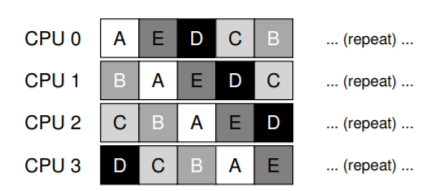
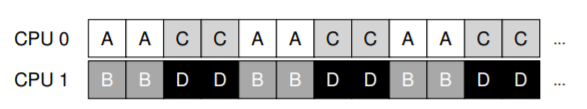
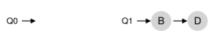

# 10. Multiprocessor Scheduling (Lập lịch trên đa bộ xử lý – nâng cao)

Chương này sẽ giới thiệu những khái niệm cơ bản về multiprocessor scheduling (lập lịch trên hệ thống đa bộ xử lý). Vì đây là một chủ đề tương đối nâng cao, nên tốt nhất là bạn nên học sau khi đã nghiên cứu chi tiết về concurrency (tính đồng thời) – tức phần “easy piece” thứ hai của cuốn sách.

Sau nhiều năm chỉ tồn tại trong các hệ thống máy tính cao cấp, ngày nay multiprocessor systems (hệ thống đa bộ xử lý) đã trở nên phổ biến, xuất hiện trong cả máy tính để bàn, laptop, và thậm chí cả thiết bị di động. Sự gia tăng này chủ yếu nhờ multicore processor (bộ xử lý đa lõi), trong đó nhiều CPU core (lõi CPU) được tích hợp trên một chip duy nhất. Các chip này trở nên phổ biến vì các kiến trúc sư máy tính gặp khó khăn trong việc làm cho một CPU đơn nhanh hơn mà không tiêu tốn quá nhiều năng lượng. Do đó, hầu hết chúng ta hiện nay đều có vài CPU sẵn sàng phục vụ — nghe có vẻ tuyệt, đúng không?

Tất nhiên, sự xuất hiện của nhiều CPU cũng mang lại nhiều vấn đề. Vấn đề chính là: một ứng dụng điển hình (ví dụ một chương trình C bạn viết) chỉ sử dụng một CPU; thêm nhiều CPU không khiến ứng dụng đơn lẻ đó chạy nhanh hơn. Để giải quyết, bạn phải viết lại ứng dụng để chạy song song, có thể bằng cách dùng threads (luồng) như đã bàn trong phần hai của cuốn sách. Multithreaded applications (ứng dụng đa luồng) có thể phân chia công việc cho nhiều CPU và do đó chạy nhanh hơn khi có thêm tài nguyên CPU.

> **ASIDE: ADVANCED CHAPTERS**
> Các chương nâng cao yêu cầu kiến thức từ nhiều phần của cuốn sách để hiểu đầy đủ, mặc dù về mặt logic chúng phù hợp ở những phần trước đó. Ví dụ, chương này về multiprocessor scheduling sẽ dễ hiểu hơn nếu bạn đã đọc phần giữa về concurrency; tuy nhiên, về mặt cấu trúc, nó lại phù hợp ở phần về virtualization (ảo hóa) và CPU scheduling (lập lịch CPU). Do đó, khuyến nghị là các chương này nên được học “không theo thứ tự”; trong trường hợp này, sau phần hai của cuốn sách.


*Figure 10.1: Single CPU With Cache*

Ngoài các ứng dụng, một vấn đề mới nảy sinh cho operating system (hệ điều hành), đó là multiprocessor scheduling. Trước giờ ta đã bàn nhiều nguyên tắc về single-processor scheduling (lập lịch trên hệ thống một bộ xử lý); vậy làm sao mở rộng chúng cho nhiều CPU? Những vấn đề mới nào cần giải quyết? Do đó, câu hỏi đặt ra:

> **CRUX: HOW TO SCHEDULE JOBS ON MULTIPLE CPUS**
> Hệ điều hành nên lập lịch jobs (tác vụ) trên nhiều CPU như thế nào? Vấn đề mới nào phát sinh? Các kỹ thuật cũ có còn hiệu quả không, hay cần những ý tưởng mới?

---

## 10.1 Kiến thức nền: Kiến trúc multiprocessor

Để hiểu vấn đề trong multiprocessor scheduling, ta phải nắm sự khác biệt cơ bản giữa phần cứng single-CPU và multi-CPU. Khác biệt này nằm ở hardware caches (bộ nhớ đệm phần cứng, xem Hình 10.1) và cách dữ liệu được chia sẻ giữa nhiều bộ xử lý. Ta sẽ bàn ở mức khái quát; chi tiết có thể tham khảo \[CSG99] hoặc các khóa học kiến trúc máy tính nâng cao.

Trong hệ thống single CPU, tồn tại một hệ thống phân cấp cache nhằm giúp CPU chạy chương trình nhanh hơn. Cache là bộ nhớ nhỏ, nhanh, dùng để lưu tạm các bản sao dữ liệu phổ biến vốn nằm trong main memory (bộ nhớ chính). Main memory thì chứa toàn bộ dữ liệu nhưng truy cập chậm hơn nhiều. Bằng cách giữ dữ liệu thường xuyên dùng trong cache, hệ thống khiến bộ nhớ lớn và chậm trông giống như một bộ nhớ nhanh.


*Figure 10.2: Two CPUs With Caches Sharing Memory*

Ví dụ: giả sử có một chương trình thực hiện lệnh load để lấy dữ liệu từ bộ nhớ trong một hệ thống single CPU. CPU có một cache nhỏ (ví dụ 64 KB) và một main memory lớn. Lần đầu tiên load, dữ liệu nằm ở main memory nên phải mất hàng chục hoặc hàng trăm nanosecond. CPU, đoán rằng dữ liệu có thể sẽ được dùng lại, sẽ lưu một bản sao trong cache. Lần sau, khi load lại cùng dữ liệu đó, CPU sẽ tìm trong cache; nếu có, nó chỉ mất vài nanosecond để lấy, khiến chương trình chạy nhanh hơn.

Cache dựa trên nguyên lý locality (tính cục bộ), có hai loại: temporal locality (cục bộ theo thời gian) và spatial locality (cục bộ theo không gian). Temporal locality: dữ liệu được truy cập một lần thì có khả năng sẽ được truy cập lại sớm (ví dụ biến trong vòng lặp). Spatial locality: khi chương trình truy cập địa chỉ x thì có khả năng sẽ truy cập các địa chỉ gần x (ví dụ duyệt mảng). Nhờ tính cục bộ này, hệ thống phần cứng có thể dự đoán dữ liệu nào nên đưa vào cache.

Nhưng điều gì xảy ra khi ta có nhiều CPU cùng dùng chung một main memory (Hình 10.2)?

Trong trường hợp này, caching trở nên phức tạp hơn nhiều. Ví dụ: chương trình trên CPU 1 đọc dữ liệu D tại địa chỉ A; vì cache CPU 1 chưa có, hệ thống lấy từ main memory. Sau đó, chương trình sửa dữ liệu tại A thành D′ nhưng chỉ cập nhật cache CPU 1 (ghi xuống main memory chậm nên thường trì hoãn). Nếu OS sau đó chuyển chương trình sang CPU 2, chương trình lại đọc A; vì cache CPU 2 chưa có, hệ thống lấy từ main memory và nhận giá trị cũ D thay vì D′. Sai rồi! Đây gọi là vấn đề cache coherence (tính nhất quán của cache). Có rất nhiều nghiên cứu giải quyết vấn đề này \[SHW11]. Ở đây ta chỉ nói khái quát; chi tiết bạn nên học trong các khóa kiến trúc máy tính.

Giải pháp cơ bản được phần cứng cung cấp: giám sát các truy cập bộ nhớ để đảm bảo mọi CPU thấy cùng một trạng thái bộ nhớ chung. Một cách phổ biến trên hệ thống bus là dùng bus snooping \[G83]; mỗi cache theo dõi các cập nhật trên bus nối với main memory. Khi thấy dữ liệu mà nó giữ bị thay đổi, nó sẽ tự vô hiệu hóa bản sao (invalidate) hoặc cập nhật. Tuy write-back cache (ghi chậm xuống bộ nhớ) làm mọi thứ phức tạp hơn, nhưng ý tưởng chính vẫn tương tự.

## 10.2 Đừng quên Synchronization

Mặc dù cache đã xử lý coherence, liệu chương trình (hoặc chính OS) có cần lo lắng khi truy cập dữ liệu chia sẻ không? Đáp án là **có**. Đây chính là nội dung lớn trong phần concurrency.

Khi truy cập (đặc biệt là cập nhật) dữ liệu chia sẻ trên nhiều CPU, ta cần mutual exclusion primitives (cơ chế loại trừ lẫn nhau) như locks để đảm bảo tính đúng đắn. Ví dụ: với một shared queue, nếu nhiều CPU thêm/xóa phần tử đồng thời mà không dùng lock, sẽ phát sinh lỗi logic, ngay cả khi hệ thống có protocol coherence. Locks đảm bảo cập nhật atomically (nguyên tử).

Xem ví dụ đoạn code xóa phần tử khỏi linked list ở Hình 10.3. Nếu hai threads chạy cùng lúc trên hai CPU, cả hai đều đọc cùng một giá trị `head`, và cả hai đều cố gắng xóa cùng một phần tử — dẫn tới lỗi nghiêm trọng (như double free).

```c
typedef struct __Node_t {
  int value;
  struct __Node_t *next;
} Node_t;

// ...

int List_Pop() {
  Node_t *tmp = head; // remember old head
  int value = head->value; // ... and its value
  head = head->next; // advance to next
  free(tmp); // free old head
  return value; // return value @head
}
```

*Hình 10.3: Code xóa phần tử trong danh sách liên kết*

Giải pháp: dùng lock. Ví dụ: khai báo `pthread_mutex_t m;` rồi đặt `lock(&m)` ở đầu hàm và `unlock(&m)` ở cuối. Tuy nhiên, khi số CPU tăng, việc truy cập cấu trúc dữ liệu đồng bộ sẽ trở nên chậm hơn.

---

## 10.3 Cache Affinity

Một vấn đề khác trong multiprocessor scheduling là cache affinity \[TTG95]. Nghĩa là: khi một process chạy trên một CPU, nó tạo ra trạng thái trong cache và TLB của CPU đó. Lần sau chạy lại trên cùng CPU, nó sẽ nhanh hơn. Nếu bị chuyển CPU liên tục, hiệu năng giảm vì phải nạp lại cache. Do đó, scheduler nên xem xét cache affinity, cố gắng giữ process trên cùng một CPU nếu có thể.

## 10.4 Single-Queue Scheduling (Lập lịch hàng đợi đơn)

Với phần kiến thức nền tảng đã có, bây giờ chúng ta sẽ thảo luận cách xây dựng một **scheduler** (bộ lập lịch) cho hệ thống **multiprocessor** (đa bộ xử lý). Cách tiếp cận cơ bản nhất là tái sử dụng khung lập lịch cho **single processor** (bộ xử lý đơn), bằng cách đưa tất cả các **job** (công việc) cần lập lịch vào **một hàng đợi duy nhất**; chúng ta gọi cách này là **single-queue multiprocessor scheduling** hay viết tắt là **SQMS**.  

Cách tiếp cận này có ưu điểm là **đơn giản**; không cần nhiều công sức để lấy một chính sách lập lịch hiện có (chọn job tốt nhất để chạy tiếp theo) và điều chỉnh nó để hoạt động trên nhiều CPU (ví dụ: nếu có hai CPU, nó sẽ chọn hai job tốt nhất để chạy).  

Tuy nhiên, SQMS có những hạn chế rõ ràng. Vấn đề đầu tiên là **thiếu khả năng mở rộng** (scalability). Để đảm bảo scheduler hoạt động đúng trên nhiều CPU, lập trình viên sẽ phải chèn một số cơ chế **locking** (khóa) vào mã nguồn, như đã mô tả ở phần trước. Lock đảm bảo rằng khi mã SQMS truy cập vào hàng đợi duy nhất (ví dụ: để tìm job tiếp theo để chạy), kết quả sẽ chính xác.  

Đáng tiếc là lock có thể làm giảm hiệu năng nghiêm trọng, đặc biệt khi số lượng CPU trong hệ thống tăng lên [A90]. Khi mức độ tranh chấp (contention) đối với lock này tăng, hệ thống sẽ tốn nhiều thời gian hơn cho việc xử lý lock và ít thời gian hơn cho công việc thực sự cần làm (lưu ý: sẽ rất tốt nếu có số liệu đo thực tế ở đây).  

Vấn đề lớn thứ hai của SQMS là **cache affinity** (tính gắn kết với bộ nhớ đệm CPU). Ví dụ, giả sử chúng ta có 5 job cần chạy (A, B, C, D, E) và 4 bộ xử lý. Hàng đợi lập lịch của chúng ta sẽ trông như sau:


Theo thời gian, giả sử mỗi job chạy trong một **time slice** (lượng thời gian CPU cấp cho một lần chạy) rồi một job khác được chọn, ta có thể có lịch chạy trên các CPU như sau:



Vì mỗi CPU chỉ đơn giản chọn job tiếp theo từ hàng đợi dùng chung toàn cục, nên mỗi job sẽ bị “nhảy” từ CPU này sang CPU khác, hoàn toàn ngược lại với nguyên tắc tối ưu cache affinity.  

Để xử lý vấn đề này, hầu hết các SQMS scheduler bao gồm một cơ chế **affinity** để tăng khả năng một **process** (tiến trình) sẽ tiếp tục chạy trên cùng một CPU nếu có thể. Cụ thể, có thể giữ affinity cho một số job, nhưng di chuyển các job khác để cân bằng tải. Ví dụ, với 5 job như trên, ta có thể lập lịch như sau:


Trong cách sắp xếp này, các job A đến D không bị di chuyển giữa các CPU, chỉ có job E di chuyển, do đó giữ được affinity cho hầu hết. Lần tiếp theo, bạn có thể chọn di chuyển một job khác để đạt **affinity fairness** (công bằng về affinity). Tuy nhiên, triển khai cơ chế này có thể phức tạp.  

Tóm lại, SQMS có điểm mạnh và điểm yếu: dễ triển khai nếu đã có scheduler cho single CPU (vốn chỉ có một hàng đợi), nhưng không mở rộng tốt (do chi phí đồng bộ hóa) và không dễ duy trì cache affinity.

---

## 10.5 Multi-Queue Scheduling (Lập lịch đa hàng đợi)

Do các vấn đề của single-queue scheduler, một số hệ thống chọn cách dùng **nhiều hàng đợi**, ví dụ: mỗi CPU một hàng đợi. Cách này gọi là **multi-queue multiprocessor scheduling** (MQMS).  

Trong MQMS, khung lập lịch cơ bản bao gồm nhiều hàng đợi lập lịch. Mỗi hàng đợi có thể áp dụng một **scheduling discipline** (kỷ luật lập lịch) nhất định, như **round robin**, mặc dù bất kỳ thuật toán nào cũng có thể dùng. Khi một job vào hệ thống, nó được đặt vào **một** hàng đợi duy nhất, theo một **heuristic** (quy tắc kinh nghiệm) nào đó (ví dụ: ngẫu nhiên, hoặc chọn hàng đợi có ít job hơn). Sau đó, job được lập lịch gần như độc lập, tránh được vấn đề chia sẻ thông tin và đồng bộ hóa của cách single-queue.  

Ví dụ, giả sử hệ thống có 2 CPU (CPU 0 và CPU 1), và một số job vào hệ thống: A, B, C, D. Vì mỗi CPU có một hàng đợi lập lịch riêng, OS phải quyết định đưa mỗi job vào hàng đợi nào. Có thể như sau:


Tùy theo chính sách lập lịch của hàng đợi, mỗi CPU sẽ có hai job để chọn khi quyết định chạy. Ví dụ, với round robin, hệ thống có thể tạo ra lịch chạy như sau:



MQMS có ưu thế rõ rệt so với SQMS ở chỗ nó **tự nhiên mở rộng tốt hơn**. Khi số CPU tăng, số hàng đợi cũng tăng, do đó lock và cache contention không trở thành vấn đề trung tâm. Ngoài ra, MQMS vốn dĩ duy trì cache affinity: job ở nguyên trên cùng một CPU và tận dụng dữ liệu đã được cache.  

Tuy nhiên, cách tiếp cận này lại xuất hiện một vấn đề mới, mang tính cơ bản: **load imbalance** (mất cân bằng tải). Giả sử vẫn như trên (4 job, 2 CPU), nhưng một job (C) kết thúc. Khi đó, các hàng đợi lập lịch sẽ như sau:


Nếu chạy round robin trên mỗi hàng đợi, ta sẽ có lịch chạy:


Như thấy, A nhận gấp đôi CPU so với B và D, điều này không mong muốn. Tệ hơn, giả sử cả A và C kết thúc, chỉ còn B và D. Khi đó:




Thật tệ — CPU 0 bị **idle** (nhàn rỗi)! Và biểu đồ sử dụng CPU trông thật “buồn”.


>> **CRUX: HOW TO DEAL WITH LOAD IMBALANCE**  
>> Làm thế nào để một multi-queue multiprocessor scheduler xử lý load imbalance, nhằm đạt được mục tiêu lập lịch mong muốn?

---

Câu trả lời hiển nhiên là **di chuyển job** — kỹ thuật gọi là **migration**. Bằng cách di chuyển một job từ CPU này sang CPU khác, ta có thể đạt cân bằng tải thực sự.  

Ví dụ: nếu một CPU rảnh và CPU kia có job, OS chỉ cần di chuyển một trong B hoặc D sang CPU 0. Kết quả: tải cân bằng, mọi người đều vui.  


Trường hợp khó hơn: A ở một mình trên CPU 0, B và D luân phiên trên CPU 1.


Lúc này, di chuyển một job duy nhất không giải quyết được vấn đề. Giải pháp là **liên tục migration** một hoặc nhiều job. Một cách là luân phiên đổi job: ban đầu A ở CPU 0, B và D ở CPU 1; sau vài time slice, di chuyển B sang CPU 0 để chạy cùng A, trong khi D chạy một mình trên CPU 1. Kết quả: tải cân bằng.  


Tất nhiên, còn nhiều mẫu migration khác. Nhưng câu hỏi khó là: **khi nào** hệ thống nên thực hiện migration?  

Một cách cơ bản là dùng kỹ thuật **work stealing** [FLR98]. Với work stealing, một hàng đợi **source** (nguồn) ít job sẽ thỉnh thoảng “nhìn” sang hàng đợi **target** (đích) để xem nó đầy thế nào. Nếu target đầy hơn đáng kể, source sẽ “steal” (lấy) một hoặc nhiều job từ target để cân bằng tải.  

Tuy nhiên, kỹ thuật này có sự đánh đổi: nếu kiểm tra các hàng đợi khác quá thường xuyên → overhead cao, khó mở rộng (đi ngược mục tiêu MQMS). Nếu kiểm tra quá ít → nguy cơ load imbalance nghiêm trọng. Việc tìm ngưỡng phù hợp vẫn là một “nghệ thuật đen” (black art) trong thiết kế chính sách hệ thống.

[^1]: Ít ai biết rằng hành tinh Cybertron đã bị hủy diệt bởi các quyết định lập lịch CPU tồi tệ. Và đây sẽ là lần đầu tiên và cuối cùng cuốn sách nhắc tới Transformers.

## 10.6 Linux Multiprocessor Schedulers (Bộ lập lịch đa bộ xử lý trong Linux)

Điều thú vị là trong cộng đồng **Linux**, chưa có một giải pháp chung nào được thống nhất để xây dựng **multiprocessor scheduler** (bộ lập lịch cho hệ thống đa bộ xử lý). Theo thời gian, đã xuất hiện ba bộ lập lịch khác nhau: **O(1) scheduler**, **Completely Fair Scheduler (CFS)**, và **BF Scheduler (BFS)**^[2]. Xem luận án của Meehean để có cái nhìn tổng quan xuất sắc về điểm mạnh và điểm yếu của các bộ lập lịch này [M11]; ở đây chúng ta chỉ tóm tắt một số điểm cơ bản.

Cả **O(1)** và **CFS** đều sử dụng **multiple queues** (nhiều hàng đợi), trong khi **BFS** sử dụng **single queue** (một hàng đợi), cho thấy rằng cả hai cách tiếp cận đều có thể thành công. Tất nhiên, có nhiều chi tiết khác biệt giữa các bộ lập lịch này.  

Ví dụ: **O(1) scheduler** là một **priority-based scheduler** (bộ lập lịch dựa trên mức ưu tiên) — tương tự như **MLFQ** đã thảo luận trước đó — thay đổi **priority** (mức ưu tiên) của một **process** (tiến trình) theo thời gian, rồi lập lịch cho các tiến trình có priority cao nhất để đạt được các mục tiêu lập lịch khác nhau; trong đó, **interactivity** (tính tương tác) là một trọng tâm đặc biệt.  

Ngược lại, **CFS** là một phương pháp **deterministic proportional-share** (chia sẻ tỷ lệ có tính quyết định), giống với **Stride scheduling** đã đề cập trước đó. **BFS**, bộ lập lịch duy nhất trong ba loại sử dụng single queue, cũng là proportional-share, nhưng dựa trên một cơ chế phức tạp hơn gọi là **Earliest Eligible Virtual Deadline First (EEVDF)** [SA96].  

Bạn có thể tự tìm hiểu thêm về các thuật toán hiện đại này; đến thời điểm này, bạn đã có đủ kiến thức để hiểu cách chúng hoạt động.


## 10.7 Summary (Tóm tắt)

Chúng ta đã xem xét nhiều cách tiếp cận khác nhau đối với **multiprocessor scheduling** (lập lịch đa bộ xử lý).  

- **Single-queue approach (SQMS)**: khá đơn giản để xây dựng và cân bằng tải tốt, nhưng vốn dĩ gặp khó khăn khi mở rộng ra nhiều bộ xử lý và trong việc duy trì **cache affinity** (tính gắn kết với bộ nhớ đệm CPU).  
- **Multiple-queue approach (MQMS)**: mở rộng tốt hơn và xử lý cache affinity hiệu quả, nhưng gặp vấn đề với **load imbalance** (mất cân bằng tải) và phức tạp hơn.

Dù chọn cách tiếp cận nào, cũng không có câu trả lời đơn giản: xây dựng một **general-purpose scheduler** (bộ lập lịch đa dụng) vẫn là một nhiệm vụ đầy thách thức, vì chỉ một thay đổi nhỏ trong mã nguồn cũng có thể dẫn đến sự khác biệt lớn trong hành vi hệ thống. Chỉ nên thực hiện công việc này nếu bạn **thực sự biết rõ mình đang làm gì**, hoặc ít nhất là **được trả một khoản tiền lớn để làm**.

[^2]: Bạn có thể tự tìm hiểu BF viết tắt cho cụm từ gì; xin lưu ý, nó **không dành cho những người yếu tim**.

#参考文献

[A90] “The Performance of Spin Lock Alternatives for Shared-Memory Multiprocessors”  
Thomas E. Anderson  
IEEE TPDS Volume 1:1, January 1990  
A classic paper on how different locking alternatives do and don’t scale. By Tom Anderson, very well known researcher in both systems and networking. And author of a very fine OS textbook, we must say.

[B+10] “An Analysis of Linux Scalability to Many Cores Abstract”  
Silas Boyd-Wickizer, Austin T. Clements, Yandong Mao, Aleksey Pesterev, M. Frans Kaashoek, Robert Morris, Nickolai Zeldovich  
OSDI ’10, Vancouver, Canada, October 2010  
A terrific modern paper on the difficulties of scaling Linux to many cores.

[CSG99] “Parallel Computer Architecture: A Hardware/Software Approach”  
David E. Culler, Jaswinder Pal Singh, and Anoop Gupta
Morgan Kaufmann, 1999  
A treasure filled with details about parallel machines and algorithms. As Mark Hill humorously observes on the jacket, the book contains more information than most research papers.

[FLR98] “The Implementation of the Cilk-5 Multithreaded Language”  
Matteo Frigo, Charles E. Leiserson, Keith Randall  
PLDI ’98, Montreal, Canada, June 1998  
Cilk is a lightweight language and runtime for writing parallel programs, and an excellent example of the work-stealing paradigm.

[G83] “Using Cache Memory To Reduce Processor-Memory Traffic”  
James R. Goodman  
ISCA ’83, Stockholm, Sweden, June 1983  
The pioneering paper on how to use bus snooping, i.e., paying attention to requests you see on the bus, to build a cache coherence protocol. Goodman’s research over many years at Wisconsin is full of cleverness, this being but one example.

[M11] “Towards Transparent CPU Scheduling”  
Joseph T. Meehean  
Doctoral Dissertation at University of Wisconsin—Madison, 2011  
A dissertation that covers a lot of the details of how modern Linux multiprocessor scheduling works. Pretty awesome! But, as co-advisors of Joe’s, we may be a bit biased here.

[SHW11] “A Primer on Memory Consistency and Cache Coherence”  
Daniel J. Sorin, Mark D. Hill, and David A. Wood  
Synthesis Lectures in Computer Architecture  
Morgan and Claypool Publishers, May 2011  
A definitive overview of memory consistency and multiprocessor caching. Required reading for anyone who likes to know way too much about a given topic.

[SA96] “Earliest Eligible Virtual Deadline First: A Flexible and Accurate Mechanism for Proportional Share Resource Allocation”  
Ion Stoica and Hussein Abdel-Wahab  
Technical Report TR-95-22, Old Dominion University, 1996  
A tech report on this cool scheduling idea, from Ion Stoica, now a professor at U.C. Berkeley and world expert in networking, distributed systems, and many other things.

[prev](../09/09.md)|[next](../13/13.md)