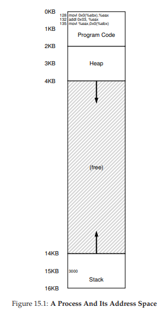
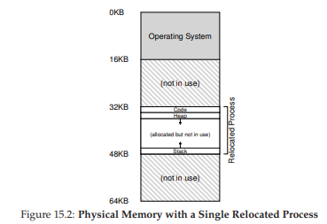
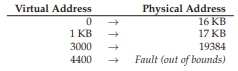
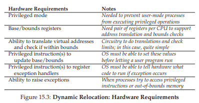
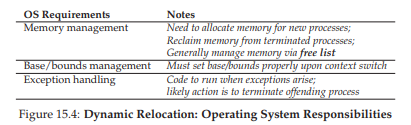
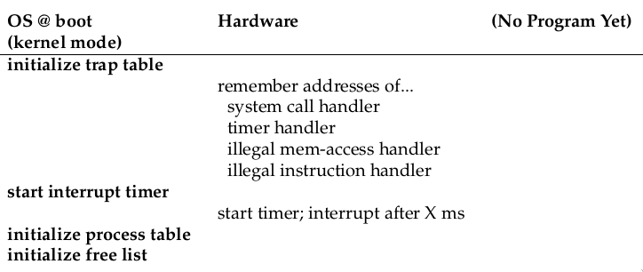
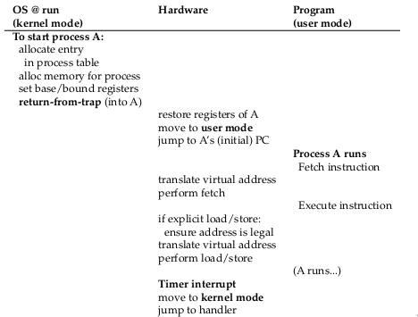
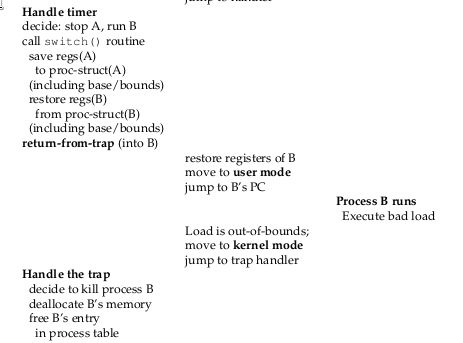

# 15 Cơ chế: Address Translation (Dịch địa chỉ)

Khi phát triển **virtualization** (ảo hóa) của CPU, chúng ta đã tập trung vào một cơ chế tổng quát được gọi là **limited direct execution** (LDE – thực thi trực tiếp có giới hạn). Ý tưởng đằng sau LDE rất đơn giản: phần lớn thời gian, để chương trình chạy trực tiếp trên phần cứng; tuy nhiên, tại một số thời điểm quan trọng (ví dụ: khi một **process** (tiến trình) thực hiện một **system call** hoặc khi xảy ra **timer interrupt**), sắp xếp để **OS** (hệ điều hành) can thiệp và đảm bảo rằng điều “đúng” sẽ xảy ra. Như vậy, OS, với một chút hỗ trợ từ phần cứng, cố gắng hết sức để tránh cản trở chương trình đang chạy, nhằm cung cấp một virtualization hiệu quả; tuy nhiên, bằng cách xen vào tại những thời điểm quan trọng đó, OS đảm bảo rằng nó vẫn duy trì quyền kiểm soát phần cứng. **Hiệu năng** và **kiểm soát** là hai trong số các mục tiêu chính của bất kỳ hệ điều hành hiện đại nào.

Trong việc ảo hóa bộ nhớ, chúng ta sẽ theo đuổi một chiến lược tương tự, đạt được cả hiệu năng và kiểm soát trong khi vẫn cung cấp virtualization mong muốn. Hiệu năng yêu cầu chúng ta tận dụng hỗ trợ từ phần cứng, ban đầu có thể rất sơ khai (ví dụ: chỉ một vài **register**), nhưng sẽ phát triển thành khá phức tạp (ví dụ: **TLB**, hỗ trợ **page table**, v.v., như bạn sẽ thấy). Kiểm soát có nghĩa là OS đảm bảo rằng không ứng dụng nào được phép truy cập vào bất kỳ vùng bộ nhớ nào ngoài vùng của chính nó; do đó, để bảo vệ các ứng dụng khỏi nhau, và bảo vệ OS khỏi các ứng dụng, chúng ta cũng cần sự hỗ trợ từ phần cứng. Cuối cùng, chúng ta cần thêm một chút **tính linh hoạt** từ hệ thống **VM** (virtual memory – bộ nhớ ảo); cụ thể, chúng ta muốn các chương trình có thể sử dụng **address space** (không gian địa chỉ) của mình theo bất kỳ cách nào chúng muốn, giúp hệ thống dễ lập trình hơn. Và từ đó, chúng ta đi đến vấn đề trọng tâm:

>> **THE CRUX: LÀM THẾ NÀO ĐỂ ẢO HÓA BỘ NHỚ MỘT CÁCH HIỆU QUẢ VÀ LINH HOẠT**  
>> Làm thế nào để xây dựng một virtualization bộ nhớ hiệu quả? Làm thế nào để cung cấp sự linh hoạt cần thiết cho ứng dụng? Làm thế nào để duy trì quyền kiểm soát đối với những vị trí bộ nhớ mà một ứng dụng có thể truy cập, và do đó đảm bảo rằng các truy cập bộ nhớ của ứng dụng được giới hạn đúng cách? Làm thế nào để làm tất cả những điều này một cách hiệu quả?

Kỹ thuật tổng quát mà chúng ta sẽ sử dụng, bạn có thể coi như một phần mở rộng của phương pháp LDE, được gọi là **hardware-based address translation** (dịch địa chỉ dựa trên phần cứng), hoặc ngắn gọn là **address translation**. Với address translation, phần cứng sẽ **chuyển đổi** mỗi lần truy cập bộ nhớ (ví dụ: **instruction fetch**, **load**, hoặc **store**), biến **virtual address** (địa chỉ ảo) do lệnh cung cấp thành **physical address** (địa chỉ vật lý) nơi thông tin mong muốn thực sự được lưu trữ. Như vậy, với mỗi lần tham chiếu bộ nhớ, phần cứng thực hiện address translation để **chuyển hướng** các truy cập bộ nhớ của ứng dụng tới vị trí thực tế trong bộ nhớ.

Tất nhiên, phần cứng **một mình** không thể ảo hóa bộ nhớ, vì nó chỉ cung cấp cơ chế mức thấp để thực hiện hiệu quả. OS phải can thiệp tại các điểm quan trọng để thiết lập phần cứng sao cho các phép dịch địa chỉ diễn ra đúng; do đó, OS phải **quản lý bộ nhớ**, theo dõi vùng nào còn trống và vùng nào đang được sử dụng, và can thiệp hợp lý để duy trì quyền kiểm soát cách bộ nhớ được sử dụng.

Một lần nữa, mục tiêu của tất cả công việc này là tạo ra một **ảo ảnh đẹp đẽ**: rằng chương trình có bộ nhớ riêng tư của mình, nơi chứa code và dữ liệu của nó. Đằng sau thực tế ảo đó là sự thật vật lý “xấu xí”: nhiều chương trình thực sự đang chia sẻ bộ nhớ cùng lúc, khi CPU (hoặc nhiều CPU) chuyển đổi giữa việc chạy chương trình này và chương trình khác. Thông qua virtualization, OS (với sự trợ giúp của phần cứng) biến thực tế máy móc xấu xí thành một **abstraction** (trừu tượng hóa) hữu ích, mạnh mẽ và dễ sử dụng.


## 15.1 Các giả định (Assumptions)

Những nỗ lực đầu tiên của chúng ta trong việc ảo hóa bộ nhớ sẽ rất đơn giản, thậm chí buồn cười. Cứ thoải mái cười đi; chẳng bao lâu nữa OS sẽ là kẻ cười vào bạn, khi bạn cố gắng hiểu từng ngóc ngách của **TLB**, **multi-level page table** (bảng trang nhiều cấp), và các kỳ quan kỹ thuật khác. Không thích ý tưởng OS cười vào bạn? Vậy thì có thể bạn sẽ không may mắn; đó là cách OS vận hành.

Cụ thể, hiện tại chúng ta sẽ giả định rằng **address space** của người dùng phải được đặt **liên tục** trong bộ nhớ vật lý. Chúng ta cũng giả định, để đơn giản, rằng kích thước address space không quá lớn; cụ thể là nhỏ hơn kích thước bộ nhớ vật lý. Cuối cùng, chúng ta cũng giả định rằng mỗi address space có kích thước **giống hệt nhau**. Đừng lo nếu những giả định này nghe có vẻ phi thực tế; chúng ta sẽ dần nới lỏng chúng, để đạt được một virtualization bộ nhớ thực tế.


## 15.2 Ví dụ (An Example)

Để hiểu rõ hơn những gì cần làm để triển khai address translation, và tại sao chúng ta cần cơ chế này, hãy xem một ví dụ đơn giản. Giả sử có một **process** với address space như minh họa ở **Hình 15.1**. Ở đây, chúng ta sẽ xem xét một đoạn code ngắn tải một giá trị từ bộ nhớ, tăng nó thêm 3, rồi lưu giá trị đó trở lại bộ nhớ. Bạn có thể hình dung đoạn code C tương ứng như sau:

>> **TIP: INTERPOSITION LÀ MỘT KỸ THUẬT MẠNH MẼ**  
>> **Interposition** (xen lớp) là một kỹ thuật tổng quát và mạnh mẽ, thường được sử dụng rất hiệu quả trong các hệ thống máy tính. Trong ảo hóa bộ nhớ, phần cứng sẽ xen vào mỗi lần truy cập bộ nhớ, và dịch mỗi virtual address do process phát ra thành physical address nơi thông tin mong muốn thực sự được lưu trữ. Tuy nhiên, kỹ thuật interposition nói chung còn áp dụng rộng rãi hơn nhiều; gần như bất kỳ **interface** (giao diện) được định nghĩa rõ ràng nào cũng có thể được xen vào, để thêm chức năng mới hoặc cải thiện một khía cạnh khác của hệ thống. Một lợi ích thường thấy của cách tiếp cận này là **tính trong suốt** (transparency); interposition thường được thực hiện mà không thay đổi giao diện của client, do đó không yêu cầu thay đổi ở phía client.

```c
void func() {
  int x = 3000; // cảm ơn Perry.
  x = x + 3;    // dòng code chúng ta quan tâm
  ...
}
```

Trình biên dịch sẽ chuyển dòng code này thành **assembly**, có thể trông như sau (trên kiến trúc x86). Sử dụng `objdump` trên Linux hoặc `otool` trên Mac để dịch ngược:

```assembly
128: movl 0x0(%ebx), %eax    ;load 0+ebx vào eax
132: addl $0x03, %eax        ;cộng 3 vào thanh ghi eax
135: movl %eax, 0x0(%ebx)    ;lưu eax trở lại bộ nhớ
```

Đoạn code này khá dễ hiểu; nó giả định rằng địa chỉ của `x` đã được đặt trong thanh ghi `ebx`, sau đó tải giá trị tại địa chỉ đó vào thanh ghi đa dụng `eax` bằng lệnh `movl` (di chuyển “longword”). Lệnh tiếp theo cộng 3 vào `eax`, và lệnh cuối cùng lưu giá trị trong `eax` trở lại bộ nhớ tại cùng vị trí.

Trong **Hình 15.1**, hãy quan sát cách cả **code** và **data** được bố trí trong **address space** (không gian địa chỉ) của **process** (tiến trình); đoạn code gồm ba lệnh được đặt tại địa chỉ 128 (trong vùng code gần phía trên), và giá trị của biến `x` nằm tại địa chỉ 15 KB (trong **stack** gần phía dưới). Trong hình, giá trị ban đầu của `x` là 3000, như thể hiện tại vị trí của nó trên stack.

Khi các lệnh này chạy, từ góc nhìn của process, các truy cập bộ nhớ sau sẽ diễn ra:

* Nạp (**fetch**) lệnh tại địa chỉ 128  
* Thực thi lệnh này (load từ địa chỉ 15 KB)  
* Nạp lệnh tại địa chỉ 132  
* Thực thi lệnh này (không truy cập bộ nhớ)  
* Nạp lệnh tại địa chỉ 135  
* Thực thi lệnh này (store vào địa chỉ 15 KB)  

  

**Hình 15.1:** Một process và không gian địa chỉ của nó  

  

**Hình 15.2:** Bộ nhớ vật lý với một process đã được di dời  

---

Từ góc nhìn của chương trình, không gian địa chỉ của nó bắt đầu tại địa chỉ 0 và tăng tối đa đến 16 KB; tất cả các tham chiếu bộ nhớ mà nó tạo ra đều nằm trong giới hạn này. Tuy nhiên, để **virtualize memory** (ảo hóa bộ nhớ), **OS** (hệ điều hành) muốn đặt process ở một vị trí khác trong **physical memory** (bộ nhớ vật lý), không nhất thiết tại địa chỉ 0.  

Vấn đề đặt ra: làm thế nào để **relocate** (di dời) process này trong bộ nhớ theo cách **transparent** (minh bạch) đối với process? Làm thế nào để cung cấp ảo tưởng rằng không gian địa chỉ bắt đầu từ 0, trong khi thực tế nó nằm ở một địa chỉ vật lý khác?

Ví dụ về bộ nhớ vật lý sau khi không gian địa chỉ của process này được đặt vào bộ nhớ được thể hiện trong **Hình 15.2**. Trong hình, bạn có thể thấy OS sử dụng **slot** đầu tiên của bộ nhớ vật lý cho chính nó, và đã di dời process từ ví dụ trên vào slot bắt đầu tại địa chỉ 32 KB của bộ nhớ vật lý. Hai slot còn lại đang trống (16 KB–32 KB và 48 KB–64 KB).

---

## 15.3 Dynamic (Hardware-based) Relocation

Để hiểu cơ chế **address translation** (dịch địa chỉ) dựa trên phần cứng, trước tiên chúng ta sẽ thảo luận về phiên bản đầu tiên của nó. Được giới thiệu trong các máy **time-sharing** (chia sẻ thời gian) đầu tiên vào cuối những năm 1950, đây là một ý tưởng đơn giản được gọi là **base and bounds**; kỹ thuật này cũng được gọi là **dynamic relocation** (di dời động); chúng ta sẽ dùng hai thuật ngữ này thay thế cho nhau [SS74].

Cụ thể, chúng ta cần hai **hardware register** (thanh ghi phần cứng) trong mỗi CPU: một gọi là **base register**, và một gọi là **bounds register** (đôi khi gọi là **limit register**). Cặp base–bounds này cho phép chúng ta đặt không gian địa chỉ ở bất kỳ đâu trong bộ nhớ vật lý, đồng thời đảm bảo process chỉ có thể truy cập vào không gian địa chỉ của chính nó.

---

> **ASIDE: SOFTWARE-BASED RELOCATION**  
> Trong những ngày đầu, trước khi có hỗ trợ phần cứng, một số hệ thống thực hiện một dạng relocation thô sơ hoàn toàn bằng phần mềm. Kỹ thuật cơ bản được gọi là **static relocation** (di dời tĩnh), trong đó một phần mềm gọi là **loader** nhận một file thực thi sắp chạy và ghi lại các địa chỉ của nó sang vị trí mong muốn trong bộ nhớ vật lý.  
>  
> Ví dụ: nếu một lệnh là load từ địa chỉ 1000 vào một thanh ghi (ví dụ: `movl 1000, %eax`), và không gian địa chỉ của chương trình được nạp bắt đầu tại địa chỉ 3000 (không phải 0 như chương trình nghĩ), loader sẽ ghi lại lệnh này để cộng thêm offset 3000 vào mỗi địa chỉ (ví dụ: `movl 4000, %eax`). Bằng cách này, một relocation tĩnh đơn giản của không gian địa chỉ process được thực hiện.  
>  
> Tuy nhiên, static relocation có nhiều vấn đề. Quan trọng nhất, nó không cung cấp **protection** (bảo vệ), vì process có thể tạo ra địa chỉ sai và truy cập trái phép vào bộ nhớ của process khác hoặc của OS; nói chung, cần hỗ trợ phần cứng để có bảo vệ thực sự [WL+93]. Một nhược điểm khác là khi đã đặt xong, rất khó để di dời không gian địa chỉ sang vị trí khác [M65].

---

Trong thiết lập này, mỗi chương trình được viết và biên dịch như thể nó được nạp tại địa chỉ 0. Tuy nhiên, khi chương trình bắt đầu chạy, OS quyết định vị trí trong bộ nhớ vật lý để nạp nó và đặt **base register** bằng giá trị đó. Trong ví dụ trên, OS quyết định nạp process tại địa chỉ vật lý 32 KB và đặt base register bằng giá trị này.

Khi process chạy, những điều thú vị bắt đầu xảy ra. Giờ đây, khi bất kỳ tham chiếu bộ nhớ nào được tạo ra bởi process, nó sẽ được dịch bởi bộ xử lý theo cách sau:

```
physical address = virtual address + base
```

Mỗi tham chiếu bộ nhớ do process tạo ra là một **virtual address** (địa chỉ ảo); phần cứng sẽ cộng nội dung của base register vào địa chỉ này và kết quả là một **physical address** (địa chỉ vật lý) có thể gửi tới hệ thống bộ nhớ.

---

Để hiểu rõ hơn, hãy theo dõi điều gì xảy ra khi một lệnh được thực thi. Cụ thể, hãy xem một lệnh từ chuỗi lệnh trước đó:

```
128: movl 0x0(%ebx), %eax
```

**Program Counter (PC)** được đặt thành 128; khi phần cứng cần nạp lệnh này, nó cộng giá trị này với base register (32 KB = 32768) để được địa chỉ vật lý 32896; phần cứng sau đó nạp lệnh từ địa chỉ vật lý này. Tiếp theo, bộ xử lý bắt đầu thực thi lệnh. Tại một thời điểm, process sẽ thực hiện:

---

> **TIP: HARDWARE-BASED DYNAMIC RELOCATION**  
> Với dynamic relocation, một chút phần cứng có thể tạo ra khác biệt lớn. Cụ thể, base register được dùng để biến đổi virtual address (do chương trình tạo ra) thành physical address. Bounds register (hoặc limit register) đảm bảo các địa chỉ này nằm trong phạm vi của không gian địa chỉ. Kết hợp lại, chúng cung cấp một cơ chế ảo hóa bộ nhớ đơn giản và hiệu quả.

---

Lệnh load từ địa chỉ ảo 15 KB, bộ xử lý cộng giá trị này với base register (32 KB), thu được địa chỉ vật lý cuối cùng là 47 KB và lấy được dữ liệu mong muốn.

Việc biến đổi một virtual address thành physical address chính là kỹ thuật gọi là **address translation**; tức là phần cứng lấy địa chỉ ảo mà process nghĩ rằng nó đang truy cập và biến đổi thành địa chỉ vật lý nơi dữ liệu thực sự tồn tại. Vì việc relocation này diễn ra **runtime** (khi chương trình đang chạy), và vì chúng ta có thể di chuyển không gian địa chỉ ngay cả khi process đã bắt đầu chạy, kỹ thuật này thường được gọi là **dynamic relocation** [M65].

Bây giờ bạn có thể hỏi: bounds register (limit register) thì sao? Sau cùng, đây chẳng phải là phương pháp base and bounds hay sao? Đúng vậy. Như bạn đoán, bounds register được dùng để hỗ trợ bảo vệ. Cụ thể, bộ xử lý sẽ kiểm tra trước xem tham chiếu bộ nhớ có nằm trong giới hạn hay không để đảm bảo nó hợp lệ; trong ví dụ đơn giản trên, bounds register sẽ luôn được đặt là 16 KB. Nếu một process tạo ra địa chỉ ảo lớn hơn hoặc bằng bounds, hoặc là số âm, CPU sẽ phát sinh **exception** (ngoại lệ), và process đó có thể sẽ bị chấm dứt. Mục đích của bounds là đảm bảo tất cả các địa chỉ do process tạo ra đều hợp lệ và nằm trong “ranh giới” của process, đúng như tên gọi.

Chúng ta cần lưu ý rằng **base register** và **bounds register** là các cấu trúc phần cứng được lưu trữ trực tiếp trên chip (mỗi CPU có một cặp). Đôi khi, người ta gọi phần của bộ xử lý hỗ trợ **address translation** (dịch địa chỉ) là **memory management unit** (MMU – đơn vị quản lý bộ nhớ); khi chúng ta phát triển các kỹ thuật quản lý bộ nhớ tinh vi hơn, sẽ cần bổ sung thêm mạch điện vào MMU.

Một lưu ý nhỏ về **bounds register**: nó có thể được định nghĩa theo một trong hai cách.  
- Cách thứ nhất (như đã mô tả ở trên): bounds register lưu kích thước của **address space** (không gian địa chỉ), và phần cứng sẽ kiểm tra địa chỉ ảo so với giá trị này trước khi cộng với base.  
- Cách thứ hai: bounds register lưu địa chỉ vật lý của điểm kết thúc không gian địa chỉ, và phần cứng sẽ cộng base trước, sau đó kiểm tra xem địa chỉ kết quả có nằm trong giới hạn hay không.  

Cả hai phương pháp đều tương đương về mặt logic; để đơn giản, chúng ta sẽ giả định phương pháp thứ nhất.

---

### Ví dụ dịch địa chỉ (Example Translations)

Để hiểu rõ hơn về **address translation** thông qua cơ chế **base-and-bounds**, hãy xem một ví dụ. Giả sử một **process** (tiến trình) có không gian địa chỉ kích thước 4 KB (vâng, nhỏ đến mức phi thực tế) được nạp tại địa chỉ vật lý 16 KB. Dưới đây là kết quả của một số phép dịch địa chỉ:



Như bạn thấy từ ví dụ, thật dễ dàng để chỉ cần cộng **base address** (địa chỉ cơ sở) vào **virtual address** (địa chỉ ảo) – vốn có thể được xem như một **offset** (độ lệch) trong không gian địa chỉ – để thu được **physical address** (địa chỉ vật lý) kết quả. Chỉ khi địa chỉ ảo “quá lớn” hoặc âm thì kết quả mới gây ra lỗi (**fault**), dẫn đến việc phát sinh **exception** (ngoại lệ).

---

## 15.4 Hỗ trợ phần cứng: Tóm tắt (Hardware Support: A Summary)

Bây giờ, chúng ta hãy tóm tắt những hỗ trợ cần thiết từ phần cứng (xem thêm **Hình 15.3**, trang 9).  

Trước hết, như đã thảo luận trong chương về **CPU virtualization** (ảo hóa CPU), chúng ta cần hai chế độ CPU khác nhau:  
- **Privileged mode** (hay **kernel mode**): OS chạy ở chế độ này, có quyền truy cập toàn bộ máy.  
- **User mode**: các ứng dụng chạy ở chế độ này, bị giới hạn quyền truy cập.  

Một bit duy nhất, có thể được lưu trong một dạng **processor status word** (từ trạng thái bộ xử lý), cho biết CPU đang chạy ở chế độ nào; trong một số trường hợp đặc biệt (ví dụ: **system call** hoặc một loại **exception** hay **interrupt** khác), CPU sẽ chuyển chế độ.

Phần cứng cũng phải cung cấp chính các **base register** và **bounds register**; mỗi CPU do đó có thêm một cặp thanh ghi, là một phần của **MMU**. Khi một chương trình người dùng đang chạy, phần cứng sẽ dịch mỗi địa chỉ bằng cách cộng giá trị base vào địa chỉ ảo do chương trình tạo ra. Phần cứng cũng phải kiểm tra địa chỉ đó có hợp lệ hay không, điều này được thực hiện nhờ bounds register và một số mạch logic trong CPU.

Phần cứng cần cung cấp các **instruction** (lệnh) đặc biệt để thay đổi giá trị của base và bounds register, cho phép OS thay đổi chúng khi các process khác nhau chạy. Các lệnh này là **privileged instruction** (lệnh đặc quyền); chỉ ở chế độ kernel (hoặc privileged mode) mới có thể thay đổi các thanh ghi này. Hãy tưởng tượng sự hỗn loạn mà một process người dùng có thể gây ra[^1] nếu nó có thể tùy ý thay đổi base register khi đang chạy. Hãy tưởng tượng điều đó! Và rồi nhanh chóng gạt bỏ những ý nghĩ đen tối ấy, vì đó là chất liệu của những cơn ác mộng.

[^1]: Có thứ gì khác ngoài “havoc” (hỗn loạn) có thể được “wreaked” (gây ra) không? [W17]

---

> **ASIDE: DATA STRUCTURE — THE FREE LIST**  
> OS phải theo dõi những phần bộ nhớ trống chưa được sử dụng, để có thể cấp phát bộ nhớ cho các process. Có thể dùng nhiều **data structure** (cấu trúc dữ liệu) khác nhau cho nhiệm vụ này; cấu trúc đơn giản nhất (mà chúng ta giả định ở đây) là **free list**, đơn giản là một danh sách các khoảng bộ nhớ vật lý hiện chưa được sử dụng.

---

 

**Hình 15.3:** Dynamic Relocation – Các yêu cầu phần cứng

---

Cuối cùng, CPU phải có khả năng tạo ra **exception** trong các tình huống khi một chương trình người dùng cố gắng truy cập bộ nhớ trái phép (với một địa chỉ “out of bounds” – vượt ngoài giới hạn); trong trường hợp này, CPU nên dừng việc thực thi chương trình người dùng và kích hoạt **OS out-of-bounds exception handler** (trình xử lý ngoại lệ vượt giới hạn) để chạy. Trình xử lý của OS sau đó sẽ quyết định cách phản ứng, trong trường hợp này có thể là chấm dứt process.  

Tương tự, nếu một chương trình người dùng cố gắng thay đổi giá trị của các thanh ghi base và bounds (vốn là privileged), CPU sẽ phát sinh exception và chạy **handler** cho tình huống “cố gắng thực thi một thao tác đặc quyền khi đang ở user mode”. CPU cũng phải cung cấp một phương thức để thông báo vị trí của các handler này; do đó cần thêm một số lệnh privileged khác.

Cuối cùng, **CPU** phải có khả năng tạo ra **exception** (ngoại lệ) trong các tình huống khi một chương trình người dùng (**user program**) cố gắng truy cập bộ nhớ trái phép (với một địa chỉ “out of bounds” – vượt ngoài giới hạn cho phép); trong trường hợp này, CPU sẽ dừng việc thực thi chương trình người dùng và kích hoạt **OS “out-of-bounds” exception handler** (trình xử lý ngoại lệ vượt giới hạn) để chạy. Trình xử lý của **OS** sau đó sẽ quyết định cách phản ứng, trong trường hợp này thường là chấm dứt **process** (tiến trình).  

Tương tự, nếu một chương trình người dùng cố gắng thay đổi giá trị của các thanh ghi (**register**) base và bounds (vốn là **privileged** – đặc quyền), CPU sẽ phát sinh exception và chạy trình xử lý “tried to execute a privileged operation while in user mode” (cố gắng thực thi một thao tác đặc quyền khi đang ở chế độ người dùng). CPU cũng phải cung cấp một phương thức để thông báo vị trí của các trình xử lý này; do đó cần thêm một số **privileged instruction** (lệnh đặc quyền).

---

## 15.5 Các vấn đề của Hệ điều hành (Operating System Issues)

Cũng giống như phần cứng cung cấp các tính năng mới để hỗ trợ **dynamic relocation** (di dời động), OS giờ đây có những vấn đề mới cần xử lý; sự kết hợp giữa hỗ trợ phần cứng và quản lý của OS dẫn đến việc triển khai một dạng **virtual memory** (bộ nhớ ảo) đơn giản. Cụ thể, có một số điểm quan trọng mà OS phải can thiệp để triển khai phiên bản virtual memory dựa trên **base-and-bounds**.

**Thứ nhất**, OS phải thực hiện hành động khi một process được tạo, tìm không gian cho **address space** (không gian địa chỉ) của nó trong bộ nhớ. May mắn thay, với giả định rằng mỗi address space (a) nhỏ hơn kích thước bộ nhớ vật lý và (b) có cùng kích thước, việc này khá dễ dàng cho OS; nó có thể đơn giản coi bộ nhớ vật lý như một mảng các **slot** (ô nhớ), và theo dõi xem mỗi ô đang trống hay đã được sử dụng. Khi một process mới được tạo, OS sẽ tìm kiếm trong một **data structure** (cấu trúc dữ liệu) – thường gọi là **free list** – để tìm chỗ trống cho address space mới và đánh dấu là đã sử dụng. Với các address space có kích thước thay đổi, việc này sẽ phức tạp hơn, nhưng chúng ta sẽ để vấn đề đó cho các chương sau.



**Hình 15.4:** Dynamic Relocation – Trách nhiệm của Hệ điều hành

Ví dụ: trong **Hình 15.2** (trang 5), bạn có thể thấy OS sử dụng slot đầu tiên của bộ nhớ vật lý cho chính nó, và đã di dời process từ ví dụ trước vào slot bắt đầu tại địa chỉ 32 KB của bộ nhớ vật lý. Hai slot còn lại đang trống (16 KB–32 KB và 48 KB–64 KB); do đó, free list sẽ bao gồm hai mục này.

**Thứ hai**, OS phải thực hiện một số công việc khi một process kết thúc (tức là khi nó thoát bình thường hoặc bị buộc dừng do hoạt động sai), thu hồi toàn bộ bộ nhớ của nó để sử dụng cho các process khác hoặc cho OS. Khi một process kết thúc, OS sẽ đưa bộ nhớ của nó trở lại free list và dọn dẹp các cấu trúc dữ liệu liên quan nếu cần.

**Thứ ba**, OS cũng phải thực hiện một số bước bổ sung khi xảy ra **context switch** (chuyển ngữ cảnh). Mỗi CPU chỉ có một cặp thanh ghi base và bounds, và giá trị của chúng khác nhau cho mỗi chương trình đang chạy, vì mỗi chương trình được nạp tại một địa chỉ vật lý khác nhau trong bộ nhớ. Do đó, OS phải lưu và khôi phục cặp base–bounds khi chuyển đổi giữa các process. Cụ thể, khi OS quyết định dừng một process, nó phải lưu giá trị của các thanh ghi base và bounds vào bộ nhớ, trong một cấu trúc dữ liệu riêng cho từng process, chẳng hạn như **process structure** hoặc **process control block (PCB)**. Tương tự, khi OS tiếp tục chạy một process (hoặc chạy lần đầu), nó phải đặt giá trị base và bounds trên CPU thành giá trị đúng của process đó.

Cần lưu ý rằng khi một process bị dừng (tức là không chạy), OS có thể di chuyển address space của nó từ vị trí này sang vị trí khác trong bộ nhớ khá dễ dàng. Để di chuyển address space của một process, OS trước tiên **deschedule** (loại khỏi lịch chạy) process đó; sau đó, OS sao chép address space từ vị trí hiện tại sang vị trí mới; cuối cùng, OS cập nhật giá trị base register đã lưu (trong process structure) để trỏ đến vị trí mới. Khi process được chạy lại, base register (mới) của nó được khôi phục và nó tiếp tục chạy, hoàn toàn không biết rằng code và dữ liệu của mình đã ở một vị trí hoàn toàn mới trong bộ nhớ.

**Thứ tư**, OS phải cung cấp các **exception handler** (trình xử lý ngoại lệ), hoặc các hàm sẽ được gọi, như đã thảo luận ở trên; OS cài đặt các handler này khi khởi động (**boot time**) thông qua các privileged instruction. Ví dụ: nếu một process cố gắng truy cập bộ nhớ ngoài giới hạn, CPU sẽ phát sinh exception; OS phải sẵn sàng xử lý khi ngoại lệ này xảy ra. Phản ứng phổ biến của OS sẽ là “thù địch”: nó sẽ chấm dứt process vi phạm. OS phải bảo vệ nghiêm ngặt máy mà nó đang chạy, và do đó không khoan dung với các process cố gắng truy cập bộ nhớ hoặc thực thi lệnh mà chúng không được phép. **Tạm biệt, process hư hỏng; thật vui khi từng biết bạn.**

 

**Hình 15.5:** Limited Direct Execution (Dynamic Relocation) khi khởi động


Các **Hình 15.5** và **15.6** (trang 12) minh họa phần lớn sự tương tác giữa phần cứng và OS theo dòng thời gian. Hình đầu tiên cho thấy OS làm gì khi khởi động để chuẩn bị máy sẵn sàng, và hình thứ hai cho thấy điều gì xảy ra khi một process (Process A) bắt đầu chạy; lưu ý rằng việc dịch địa chỉ bộ nhớ của nó được phần cứng xử lý mà không cần OS can thiệp. Tại một thời điểm (giữa hình thứ hai), một **timer interrupt** xảy ra, và OS chuyển sang Process B, tiến trình này thực hiện một “bad load” (truy cập một địa chỉ bộ nhớ bất hợp pháp); tại thời điểm đó, OS phải can thiệp, chấm dứt process và dọn dẹp bằng cách giải phóng bộ nhớ của B và xóa mục của nó khỏi **process table**. Như bạn thấy từ các hình, chúng ta vẫn đang tuân theo cách tiếp cận cơ bản của **limited direct execution**. Trong hầu hết các trường hợp, OS chỉ cần thiết lập phần cứng phù hợp và để process chạy trực tiếp trên CPU; chỉ khi process hoạt động sai thì OS mới phải can thiệp.

---

## 15.6 Tóm tắt (Summary)

Trong chương này, chúng ta đã mở rộng khái niệm **limited direct execution** với một cơ chế cụ thể được sử dụng trong virtual memory, gọi là **address translation** (dịch địa chỉ). Với address translation, OS có thể kiểm soát mọi truy cập bộ nhớ từ một process, đảm bảo các truy cập nằm trong giới hạn của address space. Yếu tố then chốt để kỹ thuật này hiệu quả là hỗ trợ phần cứng, cho phép thực hiện dịch địa chỉ nhanh chóng cho mỗi lần truy cập, biến virtual address (cách process nhìn bộ nhớ) thành physical address (cách bộ nhớ thực sự tồn tại). Tất cả điều này được thực hiện một cách **transparent** (minh bạch) đối với process đã được di dời; process hoàn toàn không biết rằng các tham chiếu bộ nhớ của nó đang được dịch, tạo nên một “ảo giác” hoàn hảo.





**Hình 15.6:** Limited Direct Execution (Dynamic Relocation) khi chạy

Chúng ta cũng đã thấy một dạng ảo hóa cụ thể, gọi là **base and bounds** hoặc **dynamic relocation**. Cơ chế base-and-bounds khá hiệu quả, vì chỉ cần một chút logic phần cứng bổ sung để cộng base register vào virtual address và kiểm tra địa chỉ do process tạo ra có nằm trong giới hạn hay không. Base-and-bounds cũng cung cấp **protection** (bảo vệ); OS và phần cứng phối hợp để đảm bảo không process nào có thể tạo ra tham chiếu bộ nhớ ra ngoài address space của chính nó. Bảo vệ chắc chắn là một trong những mục tiêu quan trọng nhất của OS; bảo vệ (**protection**) chắc chắn là một trong những mục tiêu quan trọng nhất của **OS**; nếu không có nó, OS sẽ không thể kiểm soát được hệ thống. Nếu các **process** (tiến trình) được tự do ghi đè bộ nhớ, chúng có thể dễ dàng thực hiện những hành vi nguy hiểm, chẳng hạn như ghi đè **trap table** (bảng bẫy) và chiếm quyền điều khiển toàn bộ hệ thống.

Tuy nhiên, kỹ thuật **dynamic relocation** (di dời động) đơn giản này vẫn tồn tại những điểm kém hiệu quả. Ví dụ, như bạn có thể thấy trong **Hình 15.2** (trang 5), process đã được di dời đang sử dụng bộ nhớ vật lý từ 32 KB đến 48 KB; tuy nhiên, vì **stack** và **heap** của process không quá lớn, toàn bộ khoảng trống giữa chúng bị bỏ phí. Dạng lãng phí này thường được gọi là **internal fragmentation** (phân mảnh bên trong), vì không gian bên trong đơn vị đã cấp phát không được sử dụng hết (tức là bị phân mảnh) và do đó bị lãng phí. Trong cách tiếp cận hiện tại, mặc dù có thể vẫn còn đủ bộ nhớ vật lý cho nhiều process hơn, chúng ta vẫn bị giới hạn bởi việc phải đặt một address space vào một **slot** có kích thước cố định, và vì thế internal fragmentation có thể xảy ra^[2]. Do đó, chúng ta sẽ cần những cơ chế tinh vi hơn để tận dụng bộ nhớ vật lý tốt hơn và tránh internal fragmentation. Nỗ lực đầu tiên của chúng ta sẽ là một sự tổng quát hóa nhẹ của base-and-bounds, được gọi là **segmentation** (phân đoạn), mà chúng ta sẽ thảo luận ngay sau đây.

^[2]: Một giải pháp khác có thể là đặt một stack có kích thước cố định trong address space, ngay bên dưới vùng code, và một heap tăng trưởng bên dưới đó. Tuy nhiên, điều này hạn chế tính linh hoạt vì khiến việc đệ quy và các lời gọi hàm lồng sâu trở nên khó khăn, và do đó là điều chúng ta muốn tránh.  

## Tham khảo

[M65] “On Dynamic Program Relocation”  
W.C. McGee  
IBM Systems Journal  
Volume 4, Number 3, 1965, pages 184–199  
This paper is a nice summary of early work on dynamic relocation, as well as some basics on static relocation.

[P90] “Relocating loader for MS-DOS .EXE executable files”  
Kenneth D. A. Pillay  
Microprocessors & Microsystems archive  
Volume 14, Issue 7 (September 1990)  
An example of a relocating loader for MS-DOS. Not the first one, but just a relatively modern example of how such a system works.

[SS74] “The Protection of Information in Computer Systems”  
J. Saltzer and M. Schroeder  
CACM, July 1974  
From this paper: “The concepts of base-and-bound register and hardware-interpreted descriptors appeared, apparently independently, between 1957 and 1959 on three projects with diverse goals. At M.I.T., McCarthy suggested the base-and-bound idea as part of the memory protection system necessary to make time-sharing feasible. IBM independently developed the base-and-bound register as a mechanism to permit reliable multiprogramming of the Stretch (7030) computer system. At Burroughs, R. Barton suggested that hardware-interpreted descriptors would provide direct support for the naming scope rules of higher level languages in the B5000 computer system.” We found this quote on Mark Smotherman’s cool history pages [S04]; see them for more information.

[S04] “System Call Support”  
Mark Smotherman, May 2004  
http://people.cs.clemson.edu/˜mark/syscall.html  
A neat history of system call support. Smotherman has also collected some early history on items like interrupts and other fun aspects of computing history. See his web pages for more details.

[WL+93] “Efficient Software-based Fault Isolation”  
Robert Wahbe, Steven Lucco, Thomas E. Anderson, Susan L. Graham  
SOSP ’93  
A terrific paper about how you can use compiler support to bound memory references from a program, without hardware support. The paper sparked renewed interest in software techniques for isolation of memory references.

[W17] Answer to footnote: “Is there anything other than havoc that can be wreaked?”  
Waciuma Wanjohi, October 2017  
Amazingly, this enterprising reader found the answer via google’s Ngram viewing tool (available at the following URL: http://books.google.com/ngrams). The answer, thanks to Mr. Wanjohi: “It’s only since about 1970 that ’wreak havoc’ has been more popular than ’wreak vengeance’. In the 1800s, the word wreak was almost always followed by ’his/their vengeance’.” Apparently, when you wreak, you are up to no good, but at least wreakers have some options now.  

[prev](../14/14.md)|[next](../16/16.md)