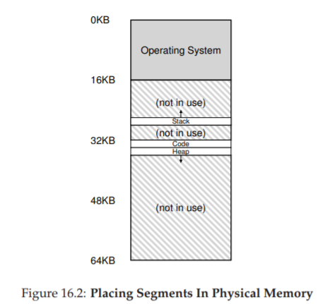
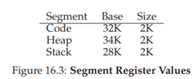

# 16 Segmentation
これまでは、各プロセスのアドレス空間全体をメモリに入れていました。ベースレジスタと境界レジスタを使用すると、OSは物理メモリの異なる部分にプロセスを簡単に再配置できます。しかし、あなたはこれらのアドレス空間について興味深いことに気づいたかもしれません。スタックとヒープの間であり中央に大きな空き領域があります。


図16.1から分かるように、スタックとヒープの間のスペースはプロセスによって使用されていませんが、物理メモリのどこかにアドレス空間全体を再配置すると、物理メモリを占有しています。したがって、メモリを仮想化するためにベースレジスタと境界レジスタのペアを使用する単純なアプローチは無駄です。また、アドレス空間全体がメモリに収まらないときは、プログラムを実行するのが非常に難しくなります。したがって、ベースと境界は、私たちが思っているほど柔軟ではありません。

>>THE CRUX: HOW TO SUPPORT A LARGE ADDRESS SPACE  
>>スタックとヒープの間に(潜在的に)空き領域が多い大きなアドレス空間をどのようにサポートしますか？我々の例では、小さな(ふりがな)アドレススペースで、無駄がそこまでないように見えることに注意してください。もし、32ビットのアドレス空間(4 GBのサイズ)であったらという状況を想像してみてください。一般的なプログラムはMBのメモリしか使用しませんが、アドレス空間全体がメモリに常駐することを要求するので大きな無駄になってしまいます。

# 16.1 Segmentation: Generalized Base/Bounds
この問題を解決するために、アイディアが生まれました。これをセグメンテーションと呼びます。少なくとも1960年代初頭と同じくらい古いものであることは、かなり古い考えです[H61、G62]。アイデアは簡単です。私たちのMMUにはベースと境界のペアが1つずつあるのではなく、アドレス空間の論理セグメントごとにベースと境界のペアがないのはなぜですか？セグメントは、特定の長さのアドレス空間のちょうど連続した部分であり、正規アドレス空間には、コード、スタック、およびヒープの3つの論理的に異なるセグメントがあります。セグメンテーションでは、物理メモリの異なる部分にこれらのセグメントを配置し、物理メモリに未使用の仮想アドレス空間を埋め込まないようにします。



例を見てみましょう。図16.1のアドレス空間を物理メモリに配置したいとします。セグメントごとにベースと境界のペアを使用して、各セグメントを物理メモリに独立して配置することができます。たとえば、図16.2を参照してください。そこには3つのセグメントがあります。64KBの物理メモリー(およびOS用に16KBが予約されています)が表示されます。

図でわかるように、使用されているメモリだけが物理メモリの領域を割り当てられているため、大量の未使用アドレス空間(疎なアドレス空間と呼ばれることもあります)を持つ大きなアドレス空間に対応できます。セグメンテーションをサポートするために必要な私たちのMMUのハードウェア構造は、すでに知っているものです。この場合は、3つのベースとバウンドのレジスタペアのセットです。下の図16.3に、上記の例のレジスタ値を示します。各境界レジスタはセグメントのサイズを保持します。



図から分かるように、コードセグメントは物理アドレス32KBに配置され、サイズは2KB、ヒープセグメントは34KBに配置され、サイズは2KBです。

図16.1のアドレス空間を使って変換例を見てみましょう。仮想アドレス100(コードセグメント内にある)への参照が行われたと仮定します。参照が行われると(命令フェッチなど)、ハードウェアはこのセグメント(この場合は100)のオフセットにベース値を加算して、100 + 32KBまたは32868の物理アドレスに到達します。アドレスが境界内にあることを確認し(100が2KB未満)、それが存在することを確認し、物理メモリアドレス32868への参照を発行します。

>>ASIDE: THE SEGMENTATION FAULT  
>>セグメンテーション違反または違反という用語は、セグメント化されたマシン上での不正なアドレスへのメモリアクセスによって発生します。ユーモラスな言い方をすれば、セグメンテーションをまったくサポートしていないマシンであっても、この言葉はそのままです。あなたのコードがフォールトを起こしている理由を理解できなければ、ユーモラスなこともありません。  
>>次に、ヒープ内のアドレス、仮想アドレス4200を見てみましょう(図16.1を参照)。最初に行うべきことは、ヒープへのオフセット、すなわちアドレスが参照するこのセグメントのどのバイトを抽出するかです。ヒープは仮想アドレス4KB(4096)から開始するので、4200のオフセットは実際に4200マイナス4096つまり104です。次に、このオフセット(104)を取得し、ベースレジスタの物理アドレス(34K)に追加して、望ましい結果を得ます：34920。  
>>ヒープの終わりを超えて7KBなどの違法アドレスを参照しようとするとどうなりますか？何が起こるか想像することができます。ハードウェアはアドレスが範囲外であることを検出し、OSにトラップし、問題のプロセスが終了する可能性があります。そして、すべてのCプログラマーが恐怖を覚える有名な用語の起源、つまりセグメンテーション違反を知りました。  

## 16.2 Which Segment Are We Referring To?
ハードウェアは、変換中にセグメントレジスタを使用します。セグメントへのオフセット、およびアドレスが参照するセグメントをどのように知っていますか？明示的アプローチと呼ばれることもある一般的なアプローチの1つは、アドレス空間を仮想アドレスの上位数ビットに基づいてセグメントに分割することです。この技法はVAX/VMSシステム[LL82]で使用されていました。上記の例では、3つのセグメントがあります。したがって、私たちの仕事を達成するには2ビットが必要です。14ビット仮想アドレスの上位2ビットを使用してセグメントを選択すると、仮想アドレスは次のようになります。


この例では、上位2ビットが00の場合、ハードウェアは仮想アドレスがコードセグメント内にあることを認識し、コードベースと境界のペアを使用してアドレスを正しい物理位置に再配置します。上位2ビットが01の場合、ハードウェアはアドレスがヒープにあることを認識し、ヒープのベースと境界を使用します。これを明確にするために、ヒープ仮想アドレスを上から(4200)取り出して変換してみましょう。バイナリ形式の仮想アドレス4200がここに表示されます。


画像からわかるように、上位2ビット(01)は、どのセグメントを参照しているかをハードウェアに伝えます。下位12ビットはセグメントへのオフセットです：0000 0110 1000、または16進数は0x068または104です。したがって、ハードウェアは、どのセグメントレジスタを使用するかを決定するために最初の2ビットを取り、次にセグメントへのオフセットとして次の12ビットを取ります。ベースレジスタをオフセットに加えることによって、ハードウェアは最終的な物理アドレスになります。オフセットは境界チェックを容易にします。オフセットが境界よりも小さいかどうかを簡単に確認できます。もしそうでなければ、アドレスは不正です。したがって、ベースと境界が配列(セグメントごとに1つのエントリ)であれば、ハードウェアは次のようにして目的の物理アドレスを取得します。

```c
// get top 2 bits of 14-bit VA
Segment = (VirtualAddress & SEG_MASK) >> SEG_SHIFT
// now get offset
Offset = VirtualAddress & OFFSET_MASK
if (Offset >= Bounds[Segment])
RaiseException(PROTECTION_FAULT)
else
PhysAddr = Base[Segment] + Offset
Register = AccessMemory(PhysAddr)
```
実行中の例では、上の定数の値を記入することができます。具体的には、SEG MASKは0x3000、SEG SHIFTは12、OFFSET MASKは0xFFFに設定されます。

また、上位2ビットを使用し、3つのセグメント(コード、ヒープ、スタック)しか持たない場合、アドレス空間の1つのセグメントが使用されなくなることに気付くかもしれません。したがって、一部のシステムでは、ヒープと同じセグメントにコードを配置し、したがって、使用するセグメントを選択するために1ビットのみを使用します[LL82]。

特定のアドレスがどのセグメントにあるかをハードウェアが判断する他の方法があります。暗黙的なアプローチでは、ハードウェアはアドレスがどのように形成されたかを知ることによってセグメントを決定します。例えば、アドレスがプログラムカウンタから生成された(すなわち命令フェッチであった)場合、アドレスはコードセグメント内にあります。アドレスがスタックポインタまたはベースポインタに基づいている場合は、スタックセグメント内になければなりません。他のアドレスはすべてヒープ内になければなりません。

## 16.3 What About The Stack?
ここまでは、アドレス空間の重要な要素の1つ、スタックを除外しました。スタックは上の図の物理アドレス28KBに再配置されていますが、重要な違いが1つあります。スタックは後退します。物理メモリでは、28KBから始まり、仮想アドレス16KBから14KBに対応する26KBにまで拡大します。変換は異なる方法で進めなければなりません。


まず必要なのは、ハードウェアの追加サポートです。ハードウェアは、ベースと境界の値の代わりに、セグメントがどのように成長するかを知る必要があります(たとえば、セグメントが正の方向に成長すると1に設定され、負の場合は0に設定されます)。ハードウェアが追跡している更新されたビューを図16.4に示します。

セグメントが負の方向に成長することをハードウェアが理解すると、ハードウェアはこのような仮想アドレスをわずかに異なる形で変換する必要があります。スタック仮想アドレスの例を取り上げ、それを翻訳してプロセスを理解してみましょう。

この例では、仮想アドレス15KBにアクセスすることを想定しています。物理アドレス27KBにマップする必要があります。私たちの仮想アドレスはバイナリ形式で、11 1100 0000 0000(hex 0x3C00)のようになります。ハードウェアは上位2ビット(11)を使用してセグメントを指定しますが、オフセットは3KBです。正しい負のオフセットを得るには、3KBから最大セグメントサイズを減算する必要があります。この例では、セグメントは4KBになりますので、正しい負のオフセットは3KBマイナス4KB -1KBです。正しい物理アドレス(27KB)に達するように、マイナスオフセット(-1KB)をベース(28KB)に追加するだけです。境界チェックは、負のオフセットの絶対値がセグメントのサイズより小さいことを確認することによって計算できます。

## 16.4 Support for Sharing
セグメンテーションのサポートが増えるにつれて、システム設計者はもう少しハードウェアをサポートして新しいタイプの効率を実現できることをすぐに認識しました。具体的には、メモリを節約するために、アドレス空間間で特定のメモリセグメントを共有すると便利なことがあります。特に、今日のシステムではコード共有が一般的であり、依然として使用されています。

共有をサポートするためには、保護ビットの形でハードウェアから少し余分なサポートが必要です。基本的なサポートは、セグメントごとに数ビットを追加し、プログラムがセグメントを読み書きできるかどうか、またはセグメント内にあるコードを実行するかどうかを示します。コードセグメントを読み取り専用に設定することにより、分離を害する心配することなく、同じコードを複数のプロセスにわたって共有することができます。各プロセスはそれ自身のプライベートメモリにアクセスしていると考えていますが、OSは秘密にプロセスによって変更できないメモリを共有しているので、錯覚は保持されます。


ハードウェア(およびOS)によって追跡される追加情報の例を図16.5に示します。ご覧のように、コードセグメントは読み込みと実行が設定されているため、メモリ内の同じ物理セグメントを複数の仮想アドレス空間にマップできます。

保護ビットを使用すると、前述のハードウェアアルゴリズムも変更する必要があります。仮想アドレスが境界内にあるかどうかを検査することに加えて、ハードウェアはまた、特定のアクセスが許可されるかどうかをチェックしなければいけません。ユーザープロセスが読み取り専用セグメントに書き込もうとするか、実行不可能なセグメントから実行しようとすると、ハードウェアは例外を発生させ、OSに問題のプロセスを処理させる必要があります。

## 16.5 Fine-grained vs. Coarse-grained Segmentation
これまでの例のほとんどは、ほんのわずかのセグメント(コード、スタック、ヒープ)を持つシステムに焦点を当てていました。このセグメンテーションは、アドレス空間を比較的大きく粗い塊に分割するので、粗い粒度と考えることができます。しかしながら、いくつかの初期のシステム(例えば、Multics [CV65、DD68])は、より柔軟であり、アドレス空間が細かいセグメント化と呼ばれる多数のより小さいセグメントから構成されることが可能でした。

多くのセグメントをサポートするには、ハードウェアのサポートをさらに必要とし、ある種のセグメントテーブルをメモリに格納します。このようなセグメントテーブルは、通常、非常に多数のセグメントの作成をサポートし、したがって、システムが、これまで説明したよりも柔軟性の高い方法でセグメントを使用できるようにします。たとえば、Burroughs B5000のような初期のマシンでは何千ものセグメントがサポートされていたため、コンパイラはコードとデータを別々のセグメントに分割してOSとハードウェアがサポートすることを期待していました[RK68]。当時の考えは、セグメントを細かく分割することによって、どのセグメントが使用されているか、どのセグメントが使用されていないかをより良く知ることができ、主メモリをより効果的に利用できるようになりました。

## 16.6 OS Support
セグメンテーションの仕組みについての基本的な考え方が必要です。システムが動作するにつれてアドレス空間の一部が物理メモリに再配置されるため、アドレス空間全体に対して単一のベース/境界ペアを使用した簡単なアプローチと比較して、物理メモリの大幅な節約が達成されます。具体的には、スタックとヒープの間の未使用領域をすべて物理メモリに割り当てる必要はなく、より多くのアドレス空間を物理メモリに収めることができます。

しかし、セグメンテーションはいくつかの新しい問題を引き起こします。最初に、対処しなければならない新しいOSの問題について説明します。今まで述べてきたものは古いものです。コンテキストスイッチでOSは何をすべきですか？それは、セグメントレジスタを保存して復元する必要があります。明らかに、各プロセスには独自の仮想アドレス空間があり、OSはプロセスを再実行する前にこれらのレジスタを正しく設定する必要があります。

第2の重要な問題は、物理メモリの空き領域を管理することです。新しいアドレス空間が作成されると、OSはそのセグメントの物理メモリ内の領域を見つけることができなければなりません。以前は、各アドレス空間が同じサイズであると仮定していたため、物理メモリはプロセスが収まるスロットの束と考えることができました。プロセスごとに多数のセグメントがあり、各セグメントは異なるサイズになっています。

一般的な問題は、物理メモリがすぐに空き領域の小さな穴で満たされ、新しいセグメントを割り当てることや既存のセグメントを拡張することが困難になることです。この問題を外部断片化と呼んでいます[R69]。図16.6を参照してください。


この例では、プロセスが20 KBのセグメントを割り当てようとしています。この例では、24KBの空きがありますが、1つの連続したセグメントではありません(むしろ3つの連続していないチャンク)。したがって、OSは20KB要求を満たすことができません。

この問題に対する1つの解決策は、既存のセグメントを再配置することによって物理メモリをコンパクト化することです。例えば、OSは実行中のプロセスを停止し、それらのデータを1つの連続したメモリ領域にコピーし、それらのセグメントレジスタ値を新しい物理位置を指すように変更することができ、したがって、これにより、OSは新しい割り当て要求を成功させることができます。しかし、コピー・セグメントはメモリーを消費し、一般的にかなりの量のプロセッサー時間を使用するため、圧縮はコストがかかります。圧縮された物理メモリの図については、図16.6(右)を参照してください。

よりシンプルな方法は、割り当てのために利用可能な大量のメモリを保持しようとするフリーリスト管理アルゴリズムを使用することです。ベストフィット(空きスペースのリストを保持し、リクエスタへの望ましい割り当てを満たすサイズに最も近いものを返す)、ワーストフィット、ファーストフィットなどの古典的なアルゴリズムを含む、人々が取ったアプローチは文字通り何百もあります。バディアルゴリズム[K68]のようなより複雑なスキームもあります。

Wilsonらによる優れた調査によると、このようなアルゴリズム[W+95]の詳細を知りたい場合や、後の章で基本のいくつかをカバーするまでお待ちください。残念なことに、たとえどんなにスマートなアルゴリズムであっても、外部の断片化は依然として存在します。従って、良いアルゴリズムはそれを最小化しようとするだけです。

>> TIP: IF 1000 SOLUTIONS EXIST, NO GREAT ONE DOES  
>> 外部の断片化を最小限に抑えるために非常に多くの異なるアルゴリズムが存在するという事実は、より根底にある真実を示唆しています。問題を解決する最良の方法はありません。したがって、我々は合理的な何かのために解決し、十分に良くなることを願っています。唯一の実際の解決策(次の章で説明します)は、可変サイズのチャンクにメモリを決して割り当てないことによって、問題を完全に回避することです。

## 16.7 Summary
セグメンテーションは多くの問題を解決し、メモリのより効果的な仮想化を構築するのに役立ちます。ダイナミックリロケーションだけでなく、セグメント化は、アドレス空間の論理セグメント間の巨大な潜在的なメモリの浪費を避けることによって、無駄にあいているアドレス空間をよりよくサポートすることができます。

算術セグメント化が容易で、ハードウェアにも適しているため、高速です。変換のオーバーヘッドは最小限に抑えられます。フリンジの利益も発生します。それはコード共有です。コードが別のセグメント内に配置されている場合、そのセグメントは実行中の複数のプログラム間で共有される可能性があります。

しかし、私たちが学んだように、可変サイズのセグメントをメモリに割り当てることは、克服したいいくつかの問題につながります。最初に述べたように、外部の断片化です。セグメントは変数化されているため、空きメモリが奇数の部分に細分化されるため、メモリ割り当て要求を満たすことは困難です。スマートアルゴリズム[W+95]を使用することも、周期的にコンパクトなメモリを使用することもできますが、この問題は基本的で避けがたいものです。

第2の、そしておそらくより重要な問題は、セグメンテーションが、完全に一般化された無駄にあいているアドレス空間をサポートするのに十分柔軟でないことです。たとえば、1つの論理セグメント内に大規模だが、まばらに使用されるヒープがある場合、ヒープ全体がアクセスされるためにはまだメモリに常駐する必要があります。言い換えれば、アドレス空間がどのように使用されているかのモデルが、基礎となるセグメンテーションの設計方法と正確に一致しない場合、セグメンテーションはうまく機能しません。したがって、新しいソリューションを見つける必要があります。それらを見つける準備ができていますか？

## Tham khảo

[CV65] “Introduction and Overview of the Multics System”  
F. J. Corbato and V. A. Vyssotsky  
Fall Joint Computer Conference, 1965  
One of five papers presented on Multics at the Fall Joint Computer Conference; oh to be a fly on the wall in that room that day!

[DD68] “Virtual Memory, Processes, and Sharing in Multics”  
Robert C. Daley and Jack B. Dennis  
Communications of the ACM, Volume 11, Issue 5, May 1968  
An early paper on how to perform dynamic linking in Multics, which was way ahead of its time. Dynamic linking finally found its way back into systems about 20 years later, as the large X-windows libraries demanded it. Some say that these large X11 libraries were MIT’s revenge for removing support for dynamic linking in early versions of UNIX!

[G62] “Fact Segmentation”  
M. N. Greenfield  
Proceedings of the SJCC, Volume 21, May 1962  
Another early paper on segmentation; so early that it has no references to other work.

[H61] “Program Organization and Record Keeping for Dynamic Storage”  
A. W. Holt  
Communications of the ACM, Volume 4, Issue 10, October 1961  
An incredibly early and difficult to read paper about segmentation and some of its uses.

[I09] “Intel 64 and IA-32 Architectures Software Developer’s Manuals”  
Intel, 2009  
Available: http://www.intel.com/products/processor/manuals  
Try reading about segmentation in here (Chapter 3 in Volume 3a); it’ll hurt your head, at least a little bit.

[K68] “The Art of Computer Programming: Volume I”  
Donald Knuth  
Addison-Wesley, 1968  
Knuth is famous not only for his early books on the Art of Computer Programming but for his typesetting system TeX which is still a powerhouse typesetting tool used by professionals today, and indeed to typeset this very book. His tomes on algorithms are a great early reference to many of the algorithms that underly computing systems today.

[L83] “Hints for Computer Systems Design”  
Butler Lampson  
ACM Operating Systems Review, 15:5, October 1983  
A treasure-trove of sage advice on how to build systems. Hard to read in one sitting; take it in a little at a time, like a fine wine, or a reference manual.

[LL82] “Virtual Memory Management in the VAX/VMS Operating System”  
Henry M. Levy and Peter H. Lipman  
IEEE Computer, Volume 15, Number 3 (March 1982)  
A classic memory management system, with lots of common sense in its design. We’ll study it in more detail in a later chapter.

[RK68] “Dynamic Storage Allocation Systems”  
B. Randell and C.J. Kuehner  
Communications of the ACM  
Volume 11(5), pages 297-306, May 1968  
A nice overview of the differences between paging and segmentation, with some historical discussion of various machines.

[R69] “A note on storage fragmentation and program segmentation”  
Brian Randell  
Communications of the ACM  
Volume 12(7), pages 365-372, July 1969  
One of the earliest papers to discuss fragmentation.

[W+95] “Dynamic Storage Allocation: A Survey and Critical Review”  
Paul R. Wilson, Mark S. Johnstone, Michael Neely, and David Boles  
In International Workshop on Memory Management  
Scotland, United Kingdom, September 1995  
A great survey paper on memory allocators.

[prev](../15/15.md)|[next](../17/17.md)
