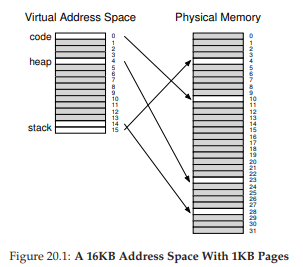

# 20 Paging: Smaller Tables
ここでは、ページングが導入する第2の問題に取り組んでいきます。ページテーブルが大きすぎるため、メモリを多く消費してしまいます。まずは、線形ページテーブルから始めましょう。線形ページテーブルはメモリ規模がかなり大きくなります。ここでも、4KB(2 ^ 12バイト)ページと4バイトのページテーブルエントリを持つ32ビットアドレス空間(2 ^ 32バイト)を仮定します。したがって、アドレス空間には約100万の仮想ページがあります(2 ^ 32/2 ^ 12)。ページテーブルエントリサイズを掛け合わせると、ページテーブルのサイズが4MBであることがわかります。また、システム内のすべてのプロセスについて1ページテーブルがあります。100個のアクティブなプロセス(現代のシステムでは一般的ではない)で、ページテーブルのためだけに数百メガバイトのメモリを割り当てます。その結果、我々はこの重い負担を軽減するための技術を模索しています。

>> CRUX: HOW TO MAKE PAGE TABLES SMALLER?  
>> 単純な配列ベースのページテーブル(通常は線形ページテーブル)は大きすぎるため、一般的なシステムではあまりにも多くのメモリを占有します。どのようにしてページテーブルを小さくすることができますか？重要なアイデアは何ですか？これらの新しいデータ構造の結果、どのような非効率性が生じますか？

## 20.1 Simple Solution: Bigger Pages
ページテーブルのサイズを1つの簡単な方法で減らすことができます。32ビットアドレス空間でもう一度考えてみましょう、しかし今回は16KBのページを仮定します。したがって、18ビットのVPNと14ビットのオフセットがあります。各PTE(4バイト)に同じサイズを仮定すると、線形ページテーブルには2^18のエントリがあり、ページテーブルの合計サイズは1MBとなり、ページテーブルのサイズは4倍に縮小されます(この縮小はページサイズの4倍の増加と反比例です)

しかし、このアプローチの主な問題は、大きなページが各ページ内で無駄になるということです。内部断片化として知られている問題(割り当て単位内のゴミ)です。アプリケーションはこうしてページの割り当てを終わらせますが、それぞれの小さなビットまたはある部分だけを使用するため、これらの大きすぎるページせいで、メモリはがいっぱいになります。したがって、ほとんどのシステムでは、通常の場合、4KB(x86の場合)または8KB(SPARCv9の場合)の比較的小さいページサイズを使用します。しかし、ページテーブルの問題は単純には解決できません。

>> ASIDE: MULTIPLE PAGE SIZES  
>> さて、MIPS、SPARC、x86-64などの多くのアーキテクチャで複数のページサイズがサポートされていることに注意してください。通常、小さな(4KBまたは8KB)ページサイズが使用されます。しかし、スマートなアプリケーションがそれを要求すると、アドレス空間の特定の部分に1つの大きなページ(たとえばサイズ4MB)を使用することができ、頻繁に使用される(そして大きな)データ構造をそのようなスペースは単一のTLBエントリのみを消費します。このような大きなページの使用は、データベース管理システムやその他のハイエンドの商用アプリケーションでは一般的です。しかし、複数のページサイズを使用する主な理由は、ページテーブルのスペースを節約することではありません。TLBへの負担を軽減し、プログラムがTLBミスを多すぎることなく多くのアドレス空間にアクセスできるようにします。しかし、[N+02]のように複数のページサイズを使用すると、OSの仮想メモリマネージャがより複雑になるため、大規模なページを直接要求するアプリケーションに新しいインターフェイスをエクスポートするだけで大​​きなページが簡単に使用されることがあります。

## 20.2 Hybrid Approach: Paging and Segments
あなたが人生の中で何かに合理的だが異なるアプローチを2つ持っているときは、常に両方の世界の最高を得ることができるかどうかを確認するために2つの組み合わせを調べる必要があります。このような組み合わせをハイブリッドと呼んでいます[M28]。  
数年前、Multicsの作成者(特にJack Dennis)は、Multics仮想メモリシステム[M07]の構築においてこのような考えにチャレンジしました。具体的には、Dennisはページテーブルのメモリオーバーヘッドを減らすためにページングとセグメンテーションを組み合わせる考えを持っていました。典型的な線形ページテーブルをより詳細に調べることによって、これがなぜ機能するのかが分かります。ヒープとスタックの使用部分が小さいアドレス空間があるとします。この例では、1KBページの小さな16KBアドレス空間を使用します(図20.1)。このアドレス空間のページテーブルは図20.2にあります。




この例では、単一コードページ(VPN 0)が物理ページ10、単一ヒープページ(VPN 4)から物理ページ23、およびアドレススペースの他端の2つのスタックページ(VPN 14および15)にマップされ、物理ページ28および4にそれぞれマッピングされる。画像からわかるように、ページテーブルのほとんどは使用されず、無効なエントリがいっぱいです。これは、16KBの小さなアドレス空間用です。32ビットのアドレス空間のページテーブルとそこに潜在するすべての無駄なスペースを想像してみてください！

したがって、私たちのハイブリッドアプローチとしては、プロセスのアドレス空間全体に単一のページテーブルを持たせる代わりに、論理セグメントごとに1つのページテーブルを作成するのはどうですか？この例では、3つのページテーブルを用意しています。1つはアドレススペースのコード、ヒープ、スタック部分用です。

ここで、セグメンテーションを覚えていれば、各セグメントが物理メモリにどこにあるのかを教えてくれるベースレジスタと、そのセグメントのサイズを教えてくれる境界レジスタまたは限界レジスタがありました。ハイブリッドでは、MMUにはそれらの構造があります。ここでは、ベースを使用してセグメント自体を指すのではなく、そのセグメントのページテーブルの物理アドレスを保持します。境界レジスタは、ページテーブルの終わり(すなわち、有効ページ数)を示すために使用されます。

明確な例を挙げてみましょう。4KBページの32ビット仮想アドレス空間と、4つのセグメントに分割されたアドレス空間を想定します。この例では、コード用、ヒープ用、スタック用の3つのセグメントのみを使用します。

アドレスが参照するセグメントを特定するために、アドレス空間の上位2ビットを使用します。00が何も使われていないセグメント、コードの場合は10、ヒープの場合は10、スタックの場合は11が使用されていると仮定しましょう。したがって、仮想アドレスは次のようになります。


ハードウェアでは、コード、ヒープ、スタックごとに1つずつ、3つのベース/境界のペアがあるとします。プロセスが実行されているとき、これらの各セグメントのベース・レジスタには、そのセグメントの線形ページテーブルの物理アドレスが格納されます。したがって、システム内の各プロセスには、3つのページテーブルが関連付けられています。コンテキストスイッチでは、これらのレジスタは、新しく実行されているプロセスのページテーブルの位置を反映するように変更する必要があります。

TLBミス(ハードウェア管理TLB、すなわちハードウェアがTLBミスを処理することを前提とする)では、ハードウェアはセグメントビット(SN)を使用して、使用するベースおよび境界のペアを決定する。次に、ハードウェアは、物理アドレスを取り込み、VPNと組み合わせてページテーブルエントリ(PTE)のアドレスを形成します。
```
SN = (VirtualAddress & SEG_MASK) >> SN_SHIFT
VPN = (VirtualAddress & VPN_MASK) >> VPN_SHIFT
AddressOfPTE = Base[SN] + (VPN * sizeof(PTE))
```
このシーケンスはよく知られているはずです。従来の線形ページテーブルとほぼ同じです。もちろん、唯一の違いは、単一のページテーブルベースレジスタの代わりに3つのセグメントベースレジスタの1つを使用することです。

ハイブリッド方式の重要な違いは、セグメントごとに境界レジスタが存在することです。各境界レジスタはセグメント内の最大有効ページの値を保持する。たとえば、コードセグメントが最初の3つのページ(0,1,2)を使用している場合、コードセグメントページテーブルには3つのエントリが割り当てられ、境界レジスタは3に設定されます。セグメントの終わりを超えたメモリアクセスは例外を生成し、プロセスの終了につながる可能性があります。このように、我々のハイブリッド手法は、線形ページテーブルと比較して大幅なメモリ節約を実現する。スタックとヒープの間の未割り当てページは、ページテーブル内のスペースを占有しなくなりました(有効でないものとしてマークする)。

しかし、気付いているように、このアプローチは問題がないわけではありません。まず、セグメント化を使用する必要があります。以前に議論したように、セグメンテーションは、アドレス空間の特定の使用パターンを想定しているので、我々が望むほどフレキシブルではありません。たとえば、大規模ではあるがまばらなヒープがあると、ページテーブルの無駄が多くなります。第二に、このハイブリッドは外部断片化を再び引き起こします。ほとんどのメモリはページサイズの単位で管理されますが、ページテーブルは任意のサイズ(PTEの倍数)になります。したがって、メモリ内の空き領域を見つけることはより複雑です。これらの理由から、人々は小さなページテーブルを実装するためのより良い方法を模索し続けました。

>> TIP: USE HYBRIDS  
>> 2つの良いアイデアと反対のアイデアがある場合は、両方の世界のベストを達成するためにハイブリッドに組み込むことができるかどうかを常に確認する必要があります。ハイブリッドトウモロコシ種は、例えば、任意の天然に存在する種よりも頑強であることが知られています。もちろん、すべてのハイブリッドが良い考えではありません。

## 20.3 Multi-level Page Tables
別のアプローチではセグメンテーションに頼るのではなく、同じ問題を攻撃します。つまり、ページテーブル内のすべての無効な領域をメモリ内に保存するのではなく、どのように取り除くのでしょうか？このアプローチは、線形ページテーブルをツリーのようなものに変えるため、マルチレベルのページテーブルと呼ばれています。このアプローチは、現代の多くのシステム(例えば、x86 [BOH10])を採用するほど効果的です。ここで、このアプローチについて詳しく説明します。

マルチレベルのページテーブルの背後にある基本的な考え方は簡単です。まず、ページ・テーブルをページ・サイズの単位に切ります。ページテーブルエントリ(PTE)のページ全体が無効である場合、ページテーブルのそのページに対してはまったく割り当てません。ページテーブルのページが有効かどうか(有効な場合はメモリ内のどこにあるか)を追跡するには、ページディレクトリと呼ばれる新しい構造を使用します。したがって、ページディレクトリは、ページテーブルのページがどこにあるか、またはページテーブルのページ全体に有効なページが含まれていないことを通知するために使用できます。


図20.3に例を示します。図の左側には古典的な線形ページテーブルがあります。アドレス空間の中間領域の大部分が有効ではないにもかかわらず、これらの領域に割り当てられたページテーブルスペース(すなわち、ページテーブルの中央の2ページ)が依然として必要です。右側には、複数レベルのページテーブルがあります。ページディレクトリは、ページテーブルの2ページだけを有効(最初と最後)としてマークします。したがって、ページテーブルの2つのページだけがメモリに存在します。したがって、マルチレベルテーブルが何をしているのかを視覚化する方法の1つを見ることができます。線形ページテーブルの一部を消して(他の用途ではそれらのフレームを解放して)、ページテーブルのどのページを割り当てるかを追跡します。

単純な2レベルの表のページディレクトリには、ページテーブルのページごとに1つのエントリが含まれています。これは、多数の page directory entries (PDE)で構成されています。PDE(最小限)は有効ビットとpage frame number(PFN)を持ち、PTEに似ています。しかし、上記で示したように、この有効ビットの意味はわずかに異なってます。PDEエントリが有効であれば、(PFNを介して)エントリがポイントするページテーブルの少なくとも1つのページが有効であり、このPDEが指し示すそのページ上の少なくとも1つのPTEにおいて、そのPTE内の有効ビットは1にセットされる。PDEエントリの有効ビットが0の場合、PDEは定義されません。

多レベルのページテーブルはこれまで見てきたアプローチに比べて明らかな利点がいくつかあります。最初に、おそらく最も明白なことに、マルチレベル・テーブルは、使用しているアドレス空間の量に比例したページ・テーブル・スペースのみを割り当てます。したがって、一般にコンパクトで、省メモリなアドレス空間をサポートします。

第2に、慎重に構築された場合、ページテーブルの各部分はページ内にきれいに収まるため、メモリの管理が容易になります。OSは、ページテーブルを割り当てたり、拡張したりする必要がある場合、次の空きページを簡単に取得できます。これを単純な(ページングされていない)線形ページテーブルと比較してください。これはVPNによってインデックスされたPTEの配列です。このような構造では、線形ページテーブル全体が物理メモリに連続して存在しなければいけません。大きなページテーブル(例えば4MB)では、未使用の連続した空き物理メモリのような大きなチャンクを見つけることは非常に困難です。マルチレベル構造では、ページテーブルの部分を指すページディレクトリを使用して間接レベルを追加します。そのため、物理メモリに必要な場所にページテーブルページを置くことを可能にします。

>> TIP: UNDERSTAND TIME-SPACE TRADE-OFFS  
>> データ構造を構築する際には、構築時に時間空間のトレードオフを常に考慮する必要があります。通常、特定のデータ構造へのアクセスを高速化したい場合は、その構造体に対してメモリを多く使用するペナルティを支払わなければなりません。  
マルチレベルテーブルには省メモリの代わりに高速化を犠牲にするコストがかかります。TLBミスでは、メモリからの2つのロードが、ページテーブル(ページディレクトリ用と、PTE用)から適切な変換情報を得るために必要となります。したがって、マルチレベルテーブルは、時間空間のトレードオフの小さな例です。私たちはもっと小さなテーブルを望みそれを手に入れましたが、トレードオフがあります。一般的なケース(TLBヒット)ではパフォーマンスは明らかに同一ですが、TLBミスはこの小さなテーブルではコストが高くなります。
別の問題点は、複雑さです。ページテーブル参照(TLBミス時)を処理するのがハードウェアであれ、OSであれ、間違いなく単純な線形ページテーブル参照よりも複雑です。多くの場合、パフォーマンスを向上させたり、メモリを削減したりするために、複雑さを増やすことになります。マルチレベルテーブルの場合、貴重なメモリを節約するために、ページテーブルのルックアップがより複雑になっています。

### A Detailed Multi-Level Example
マルチレベルのページテーブルの背後にある考え方をよりよく理解するために、例を挙げてみましょう。64KBのページで、サイズが16KBの小さなアドレス空間を想像してみてください。したがって、VPN用に8ビット、オフセット用に6ビットの14ビットの仮想アドレス空間があります。線形ページテーブルは、たとえアドレス空間のごく一部が使用されているとしても、28(256)のエントリを持ちます。図20.4にそのようなアドレス空間の一例を示します。


>>TIP: BE WARY OF COMPLEXITY  
>>システム設計者は、システムに複雑さを加えることに注意する必要があります。優れたシステム構築者は、手元にあるタスクを達成する最も簡単なシステムを実装しています。たとえば、ディスク容量が豊富な場合は、できるだけ数バイトで使用しにくいファイルシステムを設計しません。同様に、プロセッサが高速であれば、CPU内に最適化された手作業で作成された作業用のコードよりも、クリーンでわかりやすいモジュールをOSに書き込むほうがよいでしょう。早期に最適化されたコードや他の形式で、不必要な複雑さに注意してください。このようなアプローチにより、システムの理解、維持、デバッグが難しくなります。Antoine de Saint-Exuperyは次のように書いています。「完璧は、もはや何も追加する必要がなくなったときではなく、もはや取り去るものがなくなったときでもありません」彼は「実際に目的を達成するよりも完璧と言うのは簡単である。」と書いていませんでした。

この例では、仮想ページ0と1はコード用、仮想ページ4と5はヒープ用、仮想ページ254と255はスタック用です。アドレス空間の残りのページは使用されません。

このアドレス空間の2レベルのページテーブルを作成するには、完全な線形ページテーブルから始め、ページサイズの単位に分割します。私たちの全テーブル(この例では)には256個のエントリがあります。各PTEが4バイトのサイズであると仮定します。したがって、私たちのページテーブルは1KB(256×4バイト)のサイズです。64バイトのページがある場合、1KBのページテーブルは16の64バイトページに分割できます。各ページは16個のPTEを保持できます。

ここで理解する必要があるのは、VPNを使って、まずページディレクトリに、次にページテーブルのページにインデックスを付ける方法です。それぞれがエントリの配列であることを忘れないでください。したがって、私たちが把握する必要があるのは、それぞれのVPNからインデックスを作成する方法だけです。

最初にページディレクトリにインデックスを作成しましょう。この例のページテーブルは小さく、16ページにわたる256エントリです。ページディレクトリには、ページテーブルのページごとに1つのエントリが必要です。従って、それは16のエントリーを有する。その結果、ディレクトリにインデックスを作成するには、VPNの4ビットが必要です。次のように、VPNの上位4ビットを使用します。


page directory index(略してPDIndex)は、VPNからpage directory entry (PDE)を取り出すために使われます。使われる計算式は、PDEAddr = PageDirBase +(PDIndex * sizeof(PDE))となります。これにより、ページディレクトリが作成されます。ここでは、変換の進捗状況を確認します。

ページディレクトリのエントリが無効とマークされている場合、アクセスが無効であることがわかり、例外が発生します。しかし、PDEが有効な場合は、さらに多くの作業が必要です。具体的には、このページエントリエントリが指すページテーブルのページからページテーブルエントリ(PTE)をフェッチする必要があります。このPTEを見つけるには、VPNの残りのビットを使用してページテーブルの部分にインデックスを設定する必要があります。


このページテーブルインデックス(略してPTIndex)を使用して、ページテーブル自体にインデックスを付けて、PTEのアドレスを指定できます。
```
PTEAddr = (PDE.PFN << SHIFT) + (PTIndex * sizeof(PTE))
```
page directory entry (PDE)から取得したpage frame number(PFN)は、PTEのアドレスを形成するためにページ・テーブル索引と組み合わせる前に、左シフトして配置する必要があることに注意してください。

これがすべて意味をなさないかどうかを確認するために、いくつかの実際の値を持つ複数レベルのページテーブルを記入し、1つの仮想アドレスを変換します。この例のページ・ディレクトリから始めましょう(図20.5の左側)。この図では、各page directory entry (PDE)がアドレス・スペースのページ・テーブルのページについて何かを記述していることが分かります。 この例では、アドレス空間に(開始時と終了時に)2つの有効な領域と、その間にいくつかの無効なマッピングがあります。

物理ページ100(ページテーブルの0番目のページの物理フレーム番号)には、アドレス空間内の最初の16個のVPN用の16個のページテーブルエントリの最初のページがあります。ページテーブルのこの部分の内容については、図20.5(中央部)を参照してください。


ページテーブルのこのページには、最初の16個のVPNのマッピングが含まれています。この例では、VPN 0と1が有効であり(コードセグメント)、4と5(ヒープ)です。したがって、テーブルは、これらのページのそれぞれについてのマッピング情報を持っています。残りのエントリは無効とマークされます。ページテーブルの他の有効なページは、PFN 101内にある。このページは、アドレス空間の最後の16個のVPNのマッピングを含みます。詳細は図20.5(右)を参照してください。

この例では、VPN 254と255(スタック)は有効なマッピングを持っています。うまくいけば、この例からわかるように、マルチレベルの索引構造でどれくらいのスペースを節約できるかということです。この例では、線形ページテーブルに16ページすべてを割り当てるのではなく、ページディレクトリに1つ、ページテーブルのチャンクに有効なマッピングが2つずつ割り当てます。大きな(32ビットまたは64ビット)アドレス空間の節約は大きく働くでしょう。

最後に、この情報を使用して変換を実行してみましょう。ここには、VPN 254の0番目のバイト：0x3F80、または11 11000 1000 0000のバイナリを参照するアドレスがあります。

VPNの上位4ビットを使用してページディレクトリにインデックスを作成することを思い出してください。したがって、1111は、上記のページディレクトリの最後のエントリ(0番目から15番目のエントリ)を選択します。これは、アドレス101に位置するページテーブルの有効なページを示します。次に、VPNの次の4ビット(1110)を使用して、ページテーブルのそのページにインデックスを付け、欲しいPTEを見つます。1110は、ページ上の次の最後(14番目)のエントリであり、仮想アドレス空間のページ254が物理ページ55にマップされていることを示しています。PFN = 55(または16進数0x37)をoffset = 000000に連結すると、欲しい物理アドレスを形成し、その要求をメモリシステムに発行することができます。
```
PhysAddr = (PTE.PFN << SHIFT) + offset
= 00 1101 1100 0000 = 0x0DC0.
```
ページテーブルのページを指すページディレクトリを使用して、2レベルのページテーブルを構築する方法についていくつか考えてください。残念なことに、ここで説明するように、ページテーブルの2つのレベルでは不十分な場合があります。

### More Than Two Levels
これまでの例では、複数レベルのページテーブルはページディレクトリとページテーブルの2つのレベルしか持たないと仮定しています。場合によっては、より深いツリーが可能です(実際には必要です)。簡単な例を取り上げて、より深いマルチレベルテーブルが役立つ理由を説明しましょう。この例では、30ビットの仮想アドレス空間と小さな(512バイト)ページがあるとします。したがって、仮想アドレスには21ビットの仮想ページ番号コンポーネントと9ビットのオフセットがあります。

マルチレベルのページテーブルを構築することの目標を忘れないでください。ページテーブルの各部分を1ページに収めるようにします。これまでは、ページテーブル自体についてのみ検討してきました。ただし、ページディレクトリが大きすぎるとどうなりますか？

ページテーブルのすべての部分をページ内に収めるために、複数レベルのテーブルに必要なレベルの数を決定するには、ページ内にいくつのページテーブルエントリが収まるかを判断することから始めます。ページサイズが512バイトで、PTEサイズが4バイトであると仮定すると、1ページに128個のPTEを収めることができます。ページテーブルのページにインデックスを付けると、VPNの最下位7ビット(log2128)がインデックスとして必要であると判断できます。


上記の図から気づくかもしれないのは、(大きな)ページディレクトリに残っているビット数です。ページディレクトリのエントリが2^14であれば、ページは1ページではなく128ページになります。ページに収まる複数レベルのページテーブルが消えます。

この問題を解決するために、ページディレクトリ自体を複数のページに分割し、その上に別のページディレクトリを追加して、ページディレクトリのページを指すようにして、ツリーのレベルをさらに高めます。したがって、仮想アドレスを次のように分割することができます。


現在、上位レベルのページディレクトリのインデックスを作成するときには、仮想アドレスの最上位ビット(図のPDインデックス0)を使用します。この索引を使用して、top level page directoryから page directory entryをフェッチすることができます。有効な場合、トップレベルPDEからの物理フレーム番号とVPNの次の部分(PDインデックス1)を組み合わせて、ページディレクトリの第2レベルを調べます。最後に、有効であれば、PTEアドレスは、第2レベルのPDEからのアドレスと組み合わされたページテーブルインデックスを使用することによって形成することができます。

### The Translation Process: Remember the TLB
2レベルのページテーブルを使用してアドレス変換のプロセス全体を要約すると、アルゴリズムフロー形式で制御フローを示します(図20.6)。この図は、すべてのメモリ参照時にハードウェアで何が起こるかを示しています(ハードウェア管理TLBを前提としています。

図からわかるように、複雑なマルチレベル・ページ・テーブル・アクセスが発生する前に、ハードウェアはまずTLBをチェックします。ヒットすると、物理アドレスは、以前と同様にページテーブルに全くアクセスせずに直接形成される。TLBミス時にのみ、ハードウェアは完全なマルチレベルルックアップを実行する必要があります。このパスでは、従来の2レベルページテーブルのコストを確認できます。有効な変換を検索するための2つの追加メモリアクセスです。


## 20.4 Inverted Page Tables
反転したページテーブルを使用すると、ページテーブルの世界でさらに極端なスペース節減が見られます。ここでは、多くのページテーブル(システムのプロセスごとに1つ)を持つ代わりに、システムの物理ページごとに1つのページテーブルを保持しています。このエントリは、どのプロセスがこのページを使用しているか、およびそのプロセスのどの仮想ページがこの物理ページにマッピングされているかを示します。

正しいエントリを見つけることは、このデータ構造を通して検索することになります。線形スキャンは高価であり、検索を高速化するためにハッシュテーブルが基本構造上に構築されることが多いです。PowerPCはそのようなアーキテクチャ[JM98]の一例です。

より一般的には、逆ページテーブルは、最初から述べたことを示しています。ページテーブルは単なるデータ構造です。あなたは、データ構造を使ってたくさん面白いことをすることができます。小さくても大きくても、遅くても速くしても構いません。多段ページテーブルと逆ページテーブルは、できることの多くの2つの例に過ぎません。

## 20.5 Swapping the Page Tables to Disk
最後に、1つの最終的な仮定の緩和について議論する。ここまでは、カーネルが所有する物理メモリにページテーブルが存在すると仮定しています。しかし、ページテーブルのサイズを減らすための多くのトリックがあっても、メモリに入るには大きすぎる可能性があります。したがって、一部のシステムでは、このようなページテーブルをカーネル仮想メモリに配置するため、少しでもメモリが圧迫がされた場合に、システムがこれらのページテーブルの一部をディスクにスワップすることができます。これについては、今後の章(VAX/VMSのケーススタディ)で詳しく説明します。一度、ページをメモリ内外に移動する方法を理解したら、さらに詳しく説明します。

##20.6 Summary
実際のページテーブルの構築方法を見てきました。必ずしも線形配列ではなく、より複雑なデータ構造である必要があります。このようなテーブルは、時間と空間のトレードオフであり、テーブルが大きくなればなるほどTLBミスを高速に処理できるだけでなります。しかし、テーブルが小さくなればなるほど省メモリになりますがTLBミスが発生したら遅くなります。したがって、正しい構造の選択は、指定された環境の制約に強く依存します。

メモリが制約されたシステム(多くの古いシステムのように)では、小さな構造が理にかなっています。妥当な量のメモリを持ち、多数のページを積極的に使用する仕事量では、TLBミスの速度を上げる大きなテーブルが適切な選択肢になる可能性があります。ソフトウェア管理されたTLBを使用すると、データ構造全体がオペレーティングシステム革新者の喜びにつながります。どのような新しい構造を思いつくことができますか？どのような問題を解決しますか？これらの質問を考えて、オペレーティングシステム開発者だけが夢を見ることができる大きな夢を描いてみてください。

# 参考文献

[BOH10] “Computer Systems: A Programmer’s Perspective”  
Randal E. Bryant and David R. O’Hallaron  
Addison-Wesley, 2010  
We have yet to find a good first reference to the multi-level page table. However, this great textbook by Bryant and O’Hallaron dives into the details of x86, which at least is an early system that used such structures. It’s also just a great book to have.

[JM98] “Virtual Memory: Issues of Implementation”  
Bruce Jacob and Trevor Mudge  
IEEE Computer, June 1998  
An excellent survey of a number of different systems and their approach to virtualizing memory. Plenty of details on x86, PowerPC, MIPS, and other architectures.

[LL82] “Virtual Memory Management in the VAX/VMS Operating System”  
Hank Levy and P. Lipman  
IEEE Computer, Vol. 15, No. 3, March 1982  
A terrific paper about a real virtual memory manager in a classic operating system, VMS. So terrific, in fact, that we’ll use it to review everything we’ve learned about virtual memory thus far a few chapters from now.

[M28] “Reese’s Peanut Butter Cups”  
Mars Candy Corporation.  
Apparently these fine confections were invented in 1928 by Harry Burnett Reese, a former dairy farmer and shipping foreman for one Milton S. Hershey. At least, that is what it says on Wikipedia. If true, Hershey and Reese probably hated each other’s guts, as any two chocolate barons should.

[N+02] “Practical, Transparent Operating System Support for Superpages”  
Juan Navarro, Sitaram Iyer, Peter Druschel, Alan Cox  
OSDI ’02, Boston, Massachusetts, October 2002  
A nice paper showing all the details you have to get right to incorporate large pages, or superpages, into a modern OS. Not as easy as you might think, alas.

[M07] “Multics: History”  
Available: http://www.multicians.org/history.html  
This amazing web site provides a huge amount of history on the Multics system, certainly one of the most influential systems in OS history. The quote from therein: “Jack Dennis of MIT contributed influential architectural ideas to the beginning of Multics, especially the idea of combining paging and segmentation.” (from Section 1.2.1)

[prev](../19/19.md)|[next](../21/21.md)
