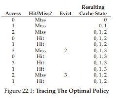
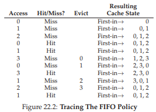
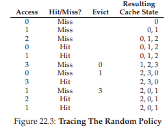
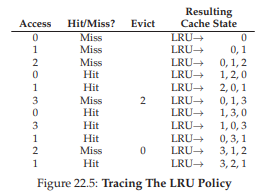

## 22 Beyond Physical Memory: Policies
仮想メモリマネージャでは、空きメモリが大量にある場合は簡単です。ページフォルトが発生した場合、フリーページリストに空きページがあり、それをフォールトページに割り当てます。

ほとんどのメモリが解放されれば、少し面白いことになります。このような場合、このメモリ圧迫により、OSは強制的に使用されるページのためのスペースを作るためにページをページアウトすることを開始します。追放するページ(またはページ)を決定することは、OSの置換ポリシー内にカプセル化されています。歴史的には、古いシステムでは物理メモリがほとんどなかったため、初期の仮想メモリシステムで最も重要な決定の1つでした。最小限にとどめておくと、これはもう少し知っておく価値がある面白いポリシーです。

>> THE CRUX: HOW TO DECIDE WHICH PAGE TO EVICT  
>> OSは、どのページ(またはページ)をメモリから退去させるかをOSはどのように決定できますか？この決定はシステムの置き換え方針によって行われます。システムの置き換え方針は、一般的な原則(下記参照)に従いますが、偏った場合の振る舞いを避けるための調整も含まれています。

## 22.1 Cache Management
ポリシーに入る前に、我々がまず解決しようとしている問題についてより詳しく説明します。メインメモリには、システム内のすべてのページのサブセットが格納されているため、システム内の仮想メモリページのキャッシュと見なすことができます。従って、このキャッシュのための置換ポリシーを選ぶことにおける我々の目標は、キャッシュミスの数を最小限にすること、すなわち、ディスクからページをフェッチする回数を最小にすることです。あるいは、キャッシュヒットの数、すなわちアクセスされたページがメモリ内に見つかった回数を最大にするという目標になります。

キャッシュヒット数とミス数を知ることで、プログラムのaverage memory access time(AMAT)を計算できます(メトリックコンピュータアーキテクトはハードウェアキャッシュを計算します[HP06])具体的には、これらの値を考慮して、次のようにプログラムのAMATを計算することができます。

ここで、TMはメモリにアクセスするコスト、TDはディスクにアクセスするコスト、PMはキャッシュ内のデータを見つけられない確率(ミス)を示します。PMissは0.0から1.0まで変化し、確率(例えば、10％のミス率はPMiss = 0.10を意味する)ではなく、パーセントミス率を参照することもあります。常にメモリ内のデータにアクセスするコストを支払うことに注意してください。さらに、見逃したときには、ディスクからデータを取り出すためのコストをさらに支払わなければなりません。

たとえば、(小さな)アドレス空間を持つマシン(4KB、256バイトページ)を想像してみましょう。したがって、仮想アドレスには、4ビットのVPN(最上位ビット)と8ビットのオフセット(最下位ビット)の2つのコンポーネントがあります。したがって、この例のプロセスは、24または16の合計仮想ページにアクセスできます。この例では、プロセスは、0x000、0x100、0x200、0x300、0x400、0x500、0x600、0x700、0x800、0x900という、次のメモリ参照(すなわち、仮想アドレス)を生成します。これらの仮想アドレスは、アドレス空間の最初の10個のページのそれぞれの最初のバイトを指します(ページ番号は各仮想アドレスの最初の16進数です)

さらに、仮想ページ3を除くすべてのページが既にメモリ内にあると仮定します。したがって、メモリ参照のシーケンスは、ヒット、ヒット、ヒット、ミス、ヒット、ヒット、ヒット、ヒット、ヒット、ヒットになります。ヒット率(メモリ内の参照の割合)を計算することができます。このとき、90％の参照がメモリに格納されているため、90％です。従って、ミス率は10％(PMiss = 0.1)です。一般に、PHit + PMiss = 1.0;ヒット率+ミス率合計を100％とします。

AMATを計算するには、メモリにアクセスするコストとディスクにアクセスするコストを知る必要があります。メモリ(TM)にアクセスするコストが約100ナノ秒であり、ディスク(TD)にアクセスするコストが約10ミリ秒であると仮定すると、100ns + 1ms、すなわち1.0001msである100ns + 0.1・10ms、約1ミリ秒です。ヒット率が99.9％(Pmiss = 0.001)だった場合、AMATは10.1マイクロ秒、つまり約100倍高速です。ヒット率が100％に近づくと、AMATは100ナノ秒に近づきます。

残念ながら、この例で分かるように、ディスクアクセスのコストは現代のシステムでは非常に高く、わずかなミス率でも実行中のプログラムのAMAT全体をすぐに支配します。できるだけ多くのミスを避けるか、ディスクの速度でゆっくりと実行する必要があります。これを手助けする1つの方法は、現在行っているように、優れたポリシーを慎重に開発することです。

## 22.2 The Optimal Replacement Policy
特定の置換ポリシーがどのように機能するかをよりよく理解するには、可能な限り最良の置換ポリシーと比較することをお勧めします。結局のところ、このような最適なポリシーは、何年も前にBeladyによって開発されました[B66](彼はもともとMINと呼ばれていた)最適な置換ポリシーは、全体として最小のミス数につながります。Beladyは、将来最も遠くにアクセスされるページを置き換えるシンプルな(しかし、残念なことに実装が難しい)アプローチが、最適なポリシーであり、結果としてキャッシュミスが最小限に抑えられることを示しました。

>> TIP: COMPARING AGAINST OPTIMAL IS USEFUL  
>> 最適な方針はあまり実用的ではありませんが、シミュレーションや他の研究の比較点としては非常に有用です。あなたが何も比較せずに派手な新しいアルゴリズムが80％のヒット率を持っているとしても意味がないということです。最適は82％のヒット率を達成すると言います(あなたの新しいアプローチは最適に非常に近いです)そのため、最適なものが何であるかを知ることで、より良い比較を実行し、改善の可能性がどれくらいあるのか、理想的なポリシーの改善に近づくことができます[AD03]。

うまくいけば、最適なポリシーの背後にあるものは理にかなっています。それについて考えてみましょう。あなたがいくつかのページを投げ捨てなければならない場合、最もアクセスする将来が遠いページを投げ捨てませんか？そうすることで、本質的に、キャッシュ内の他のすべてのページが、最も遠いページよりも重要であるということになります。これが当てはまる理由は簡単です。最も遠いものを参照する前に、他のページを参照します。

最適なポリシーがもたらす決定を理解するための簡単な例をたどってみましょう。プログラムは、0,1,2,0,1,3,0,3,1,2,1の仮想ページの次のストリームにアクセスすると仮定します。図22.1は、3ページに収まるキャッシュを想定した最適な動作を示しています。

この図では、次の操作を確認できます。最初の3回のアクセスは、キャッシュが空の状態で開始するため、ミスをしています。このようなミスはコールドスタートミス(または強制ミス)と呼ばれることがあります。次に、キャッシュ内でヒットしたページ0と1を再度参照します。最後に、別のミス(3ページ目)に達しますが、今回はキャッシュがいっぱいです。つまり、交換が行われなければいけません。どちらのページを置き換えなければならないのか疑問に思うでしょう。最適なポリシーでは、現在キャッシュ内にある各ページ(0,1,2)を調べ、0がほぼ即時にアクセスされ、1が少し後にアクセスされ、2が将来最も後にアクセスされることを確認します。つまり、ページ2を退かせて、キャッシュ内のページ0,1,3を生成します。次の3つの参考文献はヒットですが、退去したページ2のミスで苦しんでいます。ここで、最適なポリシーは、キャッシュ内の各ページ(0,1、および3)を調べ、ページ1(アクセスしようとしている)を追い出さない限り、問題ありません。この例では、ページ3が削除されていることが示されていますが、0でも問題ありません。最後に、1ページ目でヒットし、トレースが完了しました。

>> ASIDE: TYPES OF CACHE MISSES  
>> コンピュータアーキテクチャーの世界では、設計者はタイプごとにミスを3つのカテゴリの1つに特徴付けることが有用であることを示しています。compulsory、capacity、conflictのスリーC [H87]と呼ばれることがあります。一つ目の強制的なミス(またはコールドスタートミス[EF78])が発生するのは、キャッシュが最初から空であり、これがアイテムへの最初の参照であるためです。二つ目の容量不足は、キャッシュの容量が足りなくなり、新しいアイテムをキャッシュに持ち込むためにアイテムを追い出す必要があるために発生します。三つ目の競合ミスは、ハードウェアキャッシュ内にアイテムを置くことができる限界があるため、ハードウェアで発生します。そのようなキャッシュは常に完全に連想的です。つまり、メモリ内のどこにページを置くことができるかに制限がないので、OSページ・キャッシュ内では発生しません。詳細はH＆Pを参照してください[HP06]。

キャッシュのヒット率も計算できます。ヒット率は6ヒットと5ヒットで、ヒット率は(ヒット)/(ヒット+ミス)で、(6)/(6 + 5)または54.5％です。ヒット率を法とする強制ミスを計算することもできます(つまり、特定のページへの最初のミスを無視する)。その結果、ヒット率は85.7％になります。

残念ながら、以前にスケジューリング方針の策定において見た時と同じように、ページの将来は一般的にわかりません。汎用オペレーティングシステムの最適なポリシーを構築することはできません。したがって、実際の展開可能なポリシーを開発する際に、どのページを退去させるかを決める他の方法を見つけるアプローチに焦点を当てます。

## 22.3 A Simple Policy: FIFO
多くの初期のシステムでは、最適かつ雇用された非常に単純な代替ポリシーに近づくことの複雑さが回避されました。たとえば、一部のシステムでは、FIFO(先入れ先出し)置換が使用されました。ここでは、ページはシステムに入るときに単にキューに入れられます。置換が行われると、キューの末尾のページ(「ファーストイン」ページ)が追い出されます。FIFOには大きな強みがあります。実装が非常に簡単です。

サンプル参照ストリームでFIFOがどのように動作するかを調べてみましょう(図22.2)。ページ0、1、2への3回の強制ミスでトレースを開始し、0と1の両方でヒットします。次に、ページ3が参照され、ミスが発生します。置換の決定はFIFOで簡単です。「最初のもの」であったページを選択します(図のキャッシュ状態はFIFO順で、最初のページは左にあります)。これはページ0です。残念ながら、次のアクセスはページ0へのものであり、別のミスと置換(ページ1の)が発生します。その後、3ページ目にヒットしましたが、1と2でミスして、最終的に3になりました。

FIFOを最適値と比較すると、FIFOは著しく悪化します。つまり、ヒット率は36.4％(強制ミスを除くと57.1％)です。FIFOは単にブロックの重要性を判断することはできません。たとえページ0が何度もアクセスされたとしても、FIFOはメモリに取り込まれた最初のものだったからです。

>> ASIDE: BELADY’S ANOMALY  
>> Belady(最適政策の)と同僚たちは、予想外に行動した興味深い参照ストリームを見つけました[BNS69]。メモリ参照ストリームが1,2,3,4,1,2,5,1,2,3,4,5だったとしましょう。彼らが研究していたのは、キャッシュ・サイズが3から4ページに変更されたときに、キャッシュ・ヒット率がどのように変化したかです。一般に、キャッシュが大きくなると、キャッシュ・ヒット率が向上する(向上する)ことが期待されます。しかし、この場合、FIFOでは、悪化します！この行動は、一般的にBelady's Anomaly(彼の共著者の賛辞)と呼ばれています。  
LRUなどの他のポリシーは、この問題を抱えていません。なぜでしょうか？結論として、LRUにはスタックプロパティ[M+70]があります。このプロパティを持つアルゴリズムの場合、サイズN + 1のキャッシュには当然サイズNのキャッシュの内容が含まれます。したがって、キャッシュサイズを増やすと、ヒット率は変わらないか向上します。FIFOとランダム(とりわけ)は明らかにスタックのプロパティに従わず、したがって異常な動作の影響を受けやすいです。

## 22.4 Another Simple Policy: Random
もう1つの同様の置換ポリシーはRandomです。これはメモリ不足のもとで置換するランダムなページを選択するだけです。ランダムはFIFOに似た性質を持っています。実装するのは簡単ですが、どのブロックを取り除くことを考えると最適ではありません。私たちの有名な例のリファレンスストリームでRandomがどうなるかを見てみましょう(図22.3を参照)

もちろん、ランダムはどのように幸運な(または不運な)ランダムがその選択肢に入るかに完全に依存します。上記の例では、RandomはFIFOより少し良く、最適より少し劣っています。実際には、無作為実験を何千回も実行し、それがどのように一般的に行うかを決定することができます。図22.4は、無作為のシード値が異なる10,000件の試行に対して、無作為に達成したヒット数を示しています。あなたが見ることができるように、時には(時間のわずか40％を過ぎて)、ランダムは最適なほど良く、サンプルのトレースで6ヒットを達成します。時にはそれは2ヒット以下を達成するなど、さらに悪化する場合もあります。ランダムは抽選の運勢によって決まります。

## 22.5 Using History: LRU
残念なことに、FIFOやランダムなどの単純なポリシーは共通の問題を抱えている可能性があります。重要なページが再度参照される可能性があります。FIFOは、最初に持ち込まれたページをキックアウトします。これが重要なコードやデータ構造を持つページである場合、そのページはまもなくページングされますが、追い出されます。したがって、FIFO、ランダムなどのポリシーは最適に近づきそうにありません。よりスマートなものが必要です。

スケジューリング方針で行ったように、将来の推測を改善するために、履歴を見てみましょう。たとえば、プログラムが近い過去にページにアクセスした場合、近い将来にもう一度そのページにアクセスする可能性があります。

ページ置換ポリシーが使用できる履歴情報の1つのタイプは頻度です。ページが何度もアクセスされている場合は、明らかに何らかの価値があるので、置き換えてはいけません。もう一つは、アクセスの最新性です。より最近ページにアクセスした場合、おそらくそれが再びアクセスされる可能性が高くなります。

この一連のポリシーは、人々が地域の原則[D70]として言及しているものに基づいており、基本的にはプログラムとその行動についての単なる見解です。この原理は、プログラムがあるコードシーケンス(例えば、ループ内)およびデータ構造(例えば、ループによってアクセスされる配列)にかなり頻繁にアクセスする傾向があることを簡単に示しています。したがって、どのページが重要であるかを把握するために履歴を使用して、そのページを追い出し時にメモリに保存しておく必要があります。

そして、歴史的に単純なアルゴリズムのファミリーが生まれました。最小使用頻度の高い(LFU)ポリシーは、退去が発生しなければならないときに最も頻繁に使用されないページを置き換えます。同様に、LRU(Least Recently Used)ポリシーは、最も最近使用されたページを置き換えます。これらのアルゴリズムは名前を知ると、それが何をするのか正確に分かります。これは名前にとって優れた特性です。LRUをよりよく理解するために、LRUがサンプルの参照ストリームでどのように動作するかを調べてみましょう。図22.5に結果を示します。この図から、LRUがランダムまたはFIFOなどの履歴のような状態がないポリシーよりも優れた処理を行うために、履歴をどのように使用できるかがわかります。この例では、0と1が最近アクセスされたため、LRUは最初にページを置換する必要があるときにページ2を退去させます。1と3が最近アクセスされたため、ページ0が置き換えられます。どちらの場合も、履歴に基づくLRUの決定は正しいと判明し、次の参照はヒットします。したがって、単純な例では、LRUはパフォーマンスを最適にするためにできるだけ多くのことを行います。我々はまた、これらのアルゴリズムの対立するものが存在います。それは、Most Frequently Used(MFU)およびMost Recently Used(MRU)です。ほとんどの場合(すべてではありません)、これらのポリシーは、ほとんどのプログラムがそれを採用するのではなく局所性(キャッシュの状態)を無視するため、うまく機能しません。

>> ASIDE: TYPES OF LOCALITY  
>> プログラムが出現する傾向がある地域には2つのタイプがあります。一つは空間的局所性(spatial locality)として知られており、ページPがアクセスされた場合、その周辺のページ(例えば、P-1またはP + 1)もアクセスされる可能性が高いです。二つ目は、時間的局所性です。アクセスされたページは、近い将来再びアクセスされる可能性があります。このようなローカル性が存在すると仮定すると、ハードウェアシステムのキャッシュ階層で大きな役割を果たします。命令、データ、アドレス変換キャッシュのレベルをさまざまに配備して、局所性が存在する場合にプログラムを高速に実行できます。もちろん、局所性の原則は、すべてのプログラムが従わなければならない厳しい規則ではありません。実際、一部のプログラムは、メモリ(またはディスク)にむしろランダムにアクセスするため、アクセスストリームに少しも局所性がありません。したがって、あらゆる種類のキャッシュ(ハードウェアまたはソフトウェア)を設計する際に局所性を覚えておくことは良いことですが、成功を保証するものではありません。むしろ、それはコンピュータシステムの設計において有用であることがよく証明されるのがヒューリスティックです。

## 22.6 Workload Examples
これらのポリシーのいくつかの動作をよりよく理解するために、例を見てみましょう。ここでは、小さなトレースではなく、より複雑な仕事量を調べます。しかし、これらの仕事量さえも大幅に単純化されます。より良い研究にはアプリケーショントレースが含まれます。

私たちの最初の仕事量には局所性がありません。つまり、各参照はアクセスされたページのセット内のランダムなページになります。この単純な例では、仕事量は時間の経過とともに100のユニークなページにアクセスし、ランダムに参照する次のページを選択します。全体的に10,000ページがアクセスされます。実験では、各ポリシーがどのキャッシュサイズの範囲でどのように動作するかを確認するために、キャッシュサイズを非常に小さい(1ページ)からすべての固有ページ(100ページ)を保持するのに十分に変更しています。

図22.6は、最適、LRU、ランダム、およびFIFOの実験結果をプロットしたものです。図のy軸は、各ポリシーが達成するヒット率を示しています。x軸はキャッシュサイズを変更します。

グラフからいくつかの結論を導くことができます。まず、仕事量に局所性がない場合、どの現実的なポリシーを使用しているかは重要ではありません。LRU、FIFO、およびランダムはすべて、キャッシュのサイズによって正確に決定されるヒット率で同じ処理を行います。第2に、キャッシュが仕事量全体に適合するように十分な大きさであれば、どのポリシーを使用するかは重要ではありません。参照されたすべてのブロックがキャッシュに収まると、すべてのポリシー(ランダムでさえ)は100％のヒット率に収束します。最後に、最適化が現実的なポリシーよりも顕著に優れていることがわかります。可能であれば、将来を見て、より良い仕事を置き換えます。

次の仕事量は「80-20」仕事量と呼ばれ、局所性を示します。参照の80％はページの20％(「ホット」ページ)に作成されます。参照の20％はページの80％(「コールド」ページ)に作成されます。私たちの仕事量には、ユニークなページが合計100個あります。したがって、「ホット」ページはほとんどの時間に参照され、「コールド」ページは残りのページに参​​照されます。図22.7は、この仕事量でポリシーがどのように機能するかを示しています。図からわかるように、ランダムとFIFOの両方が合理的にうまくいく一方で、LRUはホットなページを保持する可能性が高いため、より良い結果を示します。それらのページは過去に頻繁に参照されているため、近い将来再び参照される可能性があります。LRUの履歴情報が完璧ではないことを示しています。

ここで疑問に思うかもしれません。ランダムとFIFOとLRUは本当にそれほど大きなトレードオフでしょうか？答えはいつものように「それは依存している」です。ミスが非常にコストがかかる場合、ヒット率のわずかな増加(ミス率の低下)でさえパフォーマンスに大きな違いをもたらす可能性があります。ミスがそれほどコストがかからない場合、もちろんLRUのメリットはそれほどありません。

最終的な仕事量を見てみましょう。これを「順序ループ」仕事量と呼びます。これは、50ページを順番に参照していきます。つまり、0から1、...、49ページまで順番に参照します。ループを繰り返して50ページへ合計10,000回のアクセスをします。図22.8の最後のグラフは、この仕事量でのポリシーの動作を示しています。

この仕事量は、多くのアプリケーション(データベース[CD85]などの重要な商用アプリケーションを含む)で一般的ですが、LRUとFIFOの両方で最悪のケースです。これらのアルゴリズムは、古いページを追い出します。そのため、仕事量がループする性質のため、これらの古いページは、将来使われるとしてもポリシーがキャッシュに保持しません。実際、サイズ49のキャッシュを使用しても、50ページのループ順の仕事量ではヒット率は0％になります。興味深いことに、ランダムなポリシーは著しく優れており、最適に近づいていませんが、少なくともゼロ以外のヒット率を達成しています。ランダムには素晴らしい性質があることがわかります。

## 22.7 Implementing Historical Algorithms
ご覧のように、LRUなどのアルゴリズムは、一般的に、FIFOやランダムなどの単純なポリシーよりも優れた処理を行いますが、重要なページを捨てる可能性があります。残念なことに、履歴のポリシーは私たちに新たな挑戦を提示します。

たとえば、LRUを取ってみましょう。完全に実装するには、多くの作業が必要です。具体的には、各ページアクセス(すなわち、各メモリアクセス、命令フェッチまたはロードまたはストア)に応じて、このページをリストの前部(すなわち、MRU側)に移動させるためにいくつかのデータ構造を更新しなければいけません。これをFIFOに対比すると、ページのFIFOリストは、ページが取り除かれたとき(最初のページを取り除くことによって)にアクセスされるとき、または新しいページがリストに追加されたとき(最後の側に)どのページが最小で最も最近に使用されたのかを把握するために、システムはすべてのメモリ参照に対していくつかのアカウンティング作業を行う必要があります。明らかに、細心の注意を払うことがありません。しかし、そのような一連の処理はパフォーマンスを大幅に低下させる可能があります。

これをスピードアップするのに役立つ方法の1つは、ハードウェアのサポートを少し追加することです。例えば、マシンは、各ページのアクセス時にメモリ内のtime fieldsを更新することができます(例えば、これはプロセス毎のページテーブル内にあってもよいし、メモリ内の別個の配列内にあってもよく、システムの物理ページ毎に1エントリ)。つまり、ページがアクセスされるとき、time fieldsはハードウェアによって現在の時間に設定されます。次に、ページを置換するとき、OSはシステム内のすべてのtime fieldsを単に走査して、最も最近に使用されたページを見つけることができます。

残念なことに、システム内のページ数が増えるにつれて、最も最近使用されていないページを見つけるために膨大な数のtime fieldsをスキャンするのは非常に高価です。4GBのメモリを搭載した最新のマシンを4KBのページに分けたと想像してください。このマシンには100万ページがあるため、最新のCPU速度であっても、LRUページの検索には長い時間がかかります。本当に交換する最も古いページを見つける必要があるのでしょうか？

>> CRUX: HOW TO IMPLEMENT AN LRU REPLACEMENT POLICY  
>>完璧なLRUを実装するのにはコストがかかることを考えるのであれば、何らかの方法で近似させることができますか？

## 22.8 Approximating LRU
結論としては、答えは「はい」です。計算上のオーバーヘッドの観点から、LRUを近似する方がより現実的であり、現代の多くのシステムではそうです。アイデアは、使用ビット(リファレンスビットと呼ばれることもあります)の形でハードウェアサポートを必要とします。最初のものは、ページング付きの最初のシステムで実装されたアトラスonelevel store [KE+62]です。システムの1ページあたり1ビットの使用ビットがあり、その使用ビットはどこかのメモリに存在します(たとえば、プロセスごとのページテーブル内、または配列のどこかにある可能性があります)。ページが参照される(すなわち、読み書きされる)ときはいつも、使用ビットはハードウェアによって1にセットされます。ハードウェアはビットを決してクリアしません(すなわち0にセットする行為)それはクリアを行うのはOSの責任です。

OSはLRUを近似するために使用ビットをどのように使用しますか？まあ、たくさんの方法があるかもしれませんが、clock algorithm[C69]では単純なpproachが1つ提案されました。システムのすべてのページが循環リストに配置されているとします。時計の針は、最初にいくつかの特定のページを指しています(本当に問題ありません)。置換が行われなければならない場合、OSは、現在指示されたページPに1または0の使用ビットがあるかどうかをチェックします。1ならば、これはページPが最近使用されたことを意味し、したがって置換のための良好な候補ではありません。したがって、Pの使用ビットは0(クリア)に設定され、クロック・ハンドは次のページ(P + 1)にインクリメントされます。アルゴリズムは、このページが最近使用されていないことを意味する0に設定された使用ビットが見つかるまで続きます(または、最悪の場合、すべてのページの検索を終了しすべてのクリアビットになっている)

このアプローチは、LRUを近似するために使用ビットを使用する唯一の方法ではないことに注意してください。実際には、使用ビットを定期的にクリアして、どちらのページが1と0の使用ビットを持っているかを区別して、どちらを置き換えるかを決めるアプローチは問題ありません。Corbatoのクロックアルゴリズムは、成功を収めた初期のアプローチの1つで、未使用のページを探しているすべてのメモリを繰り返しスキャンしないという素晴らしい特性を持っていました。

図22.9にクロックアルゴリズムの変形例の動作を示します。この変形は、置換を行うときにランダムにページをスキャンします。基準ビットが1にセットされたページに遭遇すると、ビットをクリアする(すなわち、それを0にセットする)。参照ビットが0に設定されたページが検出されると、参照ビットがその犠牲者として選択されます。ご覧のように、完璧なLRUとは言えませんが、履歴を全く考慮していないアプローチよりも優れています。

## 22.9 Considering Dirty Pages
一般的に行われているクロックアルゴリズム(Corbato [C69]が最初に提案したもの)を少し変更したのは、メモリ内でページが変更されたかどうかをさらに考慮することです。この理由は、ページが変更されて汚れている場合、ページを追い出すためにディスクに書き戻さなければならず、これは高価です。変更されていない(したがってクリーンな)場合は、削除は容易です。物理的なフレームは、追加のI/Oなしで他の目的のために単純に再利用することができます。したがって、一部のVMシステムでは、ダーティページでクリーンページを削除することができます。

この動作をサポートするために、ハードウェアは変更されたビット(a.k.a.ダーティビット)を含むべきである。このビットは、ページが書き込まれるたびに設定されるため、ページ置換アルゴリズムに組み込むことができます。たとえば、クロックアルゴリズムを変更して、使用されていないページとクリーンなページの両方をスキャンして最初に削除することができます。それらを見つけることができず、次いで、未使用のページが汚れているかどうか、等々です。

## 22.10 Other VM Policies
ページ置換は、VMサブシステムが採用している唯一のポリシーではありません(ただし、最も重要です)。例えば、OSはページをメモリにいつ持ち込むかを決定しなければいけません。このポリシーは(Denning [D70]によって呼び出されたように)ページ選択ポリシーと呼ばれることもありますが、OSにはいくつかのオプションがあります。

ほとんどのページでは、OSは単純にデマンドページングを使用します。つまり、OSはページがアクセスされたときにメモリを「オンデマンドで」オンにします。もちろん、OSはページが使用されようとしていることを推測することができます。この動作はプリフェッチと呼ばれ、合理的な成功の可能性がある場合にのみ実行する必要があります。例えば、あるシステムは、コードページPがメモリに持ち込まれると、そのコードページP +1がまもなくアクセスされる可能性が高いので、メモリに持ち込むべきであると仮定します。

別のポリシーは、OSがどのようにページをディスクに書き出すかを決定します。もちろん、それらは一度に1つずつ書き出すことができます。しかし、多くのシステムでは、多数のペンディング書き込みをメモリにまとめて1つの(より効率的な)書き込みでディスクに書き込みます。この動作は、通常、クラスタリングと呼ばれ、単純に書き込みのグループ化と呼ばれ、多数の小さなものよりも効率的に単一の大きな書き込みを実行するディスクドライブの性質のために有効です。

## 22.11 Thrashing
閉鎖する前に、最終的な質問に答えます。メモリが単純に過多になったときにOSが行うべきことは、実行中のプロセスのメモリ要求が単に利用可能な物理メモリを上回るだけですか？この場合、システムは絶えずページングを行い、時にはスラッシング[D70]と呼ばれる状態になります。

以前のオペレーティングシステムの中には、発生時にスラッシングを検出し対処するためのかなり洗練されたメカニズムがありました。例えば、一連のプロセスがある場合、システムは、プロセスの作業セット(積極的に使用しているページ)の縮小されたセットがメモリに収まり、改善されることを期待して、プロセスのサブセットを実行しないことを決定できます。このアプローチは、一般にアドミッションコントロールとして知られていますが、現実の生活だけでなく現代のコンピュータシステム(悲しいことに)で頻繁に遭遇する状況を、一度にすべてうまくやろうとするよりも、うまく動作しない方が良いと述べています。

現在のシステムの中には、メモリ過負荷に対するより厳しいアプローチをとっているものがあります。たとえば、Linuxのバージョンによっては、メモリが過剰登録されたときにメモリ不足のキラー(OOM killer)を実行するものがあります。このデーモンは大量のメモリを必要とするプロセスを選択して終了させるので、メモリーをあまりにも微妙な方法で減らすことができます。メモリ使用量を削減するのに成功しているが、このアプローチは、例えばXサーバを殺して、ディスプレイを必要とするアプリケーションを使用できなくすると、問題を引き起こす可能性があります。

## 22.12 Summary
我々は、すべての最新のオペレーティングシステムのVMサブシステムの一部であるいくつかのページ置換(およびその他の)ポリシーの導入を見てきました。現代のシステムでは、時計のような簡単なLRU近似にいくつかの微調整が追加されています。例えば、走査抵抗は、ARC [MM03]のような多くの最近のアルゴリズムの重要な部分です。スキャン耐性アルゴリズムは通常LRUのようなものですが、LRUのワーストケースの動作を回避しようとしています。LRUはループ順の仕事量で見ました。したがって、ページ置換アルゴリズムの進化が続いていきます。

しかし、多くの場合、メモリアクセスとディスクアクセス時間との間の相違が増大するにつれて、前記アルゴリズムの重要性が減少しています。ディスクへのページングは非常に高価なので、頻繁なページングのコストは非常に高くなります。したがって、過度のページングに対する最善の解決策は、よく単純(知的に不満な場合)です。

# 参考文献

[AD03] “Run-Time Adaptation in River”  
Remzi H. Arpaci-Dusseau  
ACM TOCS, 21:1, February 2003  
A summary of one of the authors’ dissertation work on a system named River. Certainly one place where he learned that comparison against the ideal is an important technique for system designers.

[B66] “A Study of Replacement Algorithms for Virtual-Storage Computer”  
Laszlo A. Belady  
IBM Systems Journal 5(2): 78-101, 1966  
The paper that introduces the simple way to compute the optimal behavior of a policy (the MIN algorithm).

[BNS69] “An Anomaly in Space-time Characteristics of Certain Programs Running in a Paging Machine”  
L. A. Belady and R. A. Nelson and G. S. Shedler  
Communications of the ACM, 12:6, June 1969  
Introduction of the little sequence of memory references known as Belady’s Anomaly. How do Nelson and Shedler feel about this name, we wonder?

[CD85] “An Evaluation of Buffer Management Strategies for Relational Database Systems”  
Hong-Tai Chou and David J. DeWitt  
VLDB ’85, Stockholm, Sweden, August 1985  
A famous database paper on the different buffering strategies you should use under a number of common database access patterns. The more general lesson: if you know something about a workload, you can tailor policies to do better than the general-purpose ones usually found in the OS.

[C69] “A Paging Experiment with the Multics System”  
F.J. Corbato  
Included in a Festschrift published in honor of Prof. P.M. Morse  
MIT Press, Cambridge, MA, 1969  
The original (and hard to find!) reference to the clock algorithm, though not the first usage of a use bit. Thanks to H. Balakrishnan of MIT for digging up this paper for us.

[D70] “Virtual Memory”  
Peter J. Denning  
Computing Surveys, Vol. 2, No. 3, September 1970  
Denning’s early and famous survey on virtual memory systems.

[EF78] “Cold-start vs. Warm-start Miss Ratios”  
Malcolm C. Easton and Ronald Fagin  
Communications of the ACM, 21:10, October 1978  
A good discussion of cold-start vs. warm-start misses.

[FP89] “Electrochemically Induced Nuclear Fusion of Deuterium”  
Martin Fleischmann and Stanley Pons  
Journal of Electroanalytical Chemistry, Volume 26, Number 2, Part 1, April, 1989  
The famous paper that would have revolutionized the world in providing an easy way to generate nearlyinfinite power from jars of water with a little metal in them. Unforuntately, the results published (and widely publicized) by Pons and Fleischmann turned out to be impossible to reproduce, and thus these two well-meaning scientists were discredited (and certainly, mocked). The only guy really happy about this result was Marvin Hawkins, whose name was left off this paper even though he participated in the work; he thus avoided having his name associated with one of the biggest scientific goofs of the 20th century.

[HP06] “Computer Architecture: A Quantitative Approach”  
John Hennessy and David Patterson  
Morgan-Kaufmann, 2006  
A great and marvelous book about computer architecture. Read it!  

[H87] “Aspects of Cache Memory and Instruction Buffer Performance”  
Mark D. Hill  
Ph.D. Dissertation, U.C. Berkeley, 1987  
Mark Hill, in his dissertation work, introduced the Three C’s, which later gained wide popularity with its inclusion in H&P [HP06]. The quote from therein: “I have found it useful to partition misses ... into three components intuitively based on the cause of the misses (page 49).”

[KE+62] “One-level Storage System”  
T. Kilburn, and D.B.G. Edwards and M.J. Lanigan and F.H. Sumner  
IRE Trans. EC-11:2, 1962  
Although Atlas had a use bit, it only had a very small number of pages, and thus the scanning of the use bits in large memories was not a problem the authors solved.

[M+70] “Evaluation Techniques for Storage Hierarchies”  
R. L. Mattson, J. Gecsei, D. R. Slutz, I. L. Traiger  
IBM Systems Journal, Volume 9:2, 1970  
A paper that is mostly about how to simulate cache hierarchies efficiently; certainly a classic in that regard, as well for its excellent discussion of some of the properties of various replacement algorithms. Can you figure out why the stack property might be useful for simulating a lot of different-sized caches at once?

[MM03] “ARC: A Self-Tuning, Low Overhead Replacement Cache”  
Nimrod Megiddo and Dharmendra S. Modha  
FAST 2003, February 2003, San Jose, California  
An excellent modern paper about replacement algorithms, which includes a new policy, ARC, that is now used in some systems. Recognized in 2014 as a “Test of Time” award winner by the storage systems community at the FAST ’14 conference.

[prev](../21/21.md)|[next](../23/23.md)
