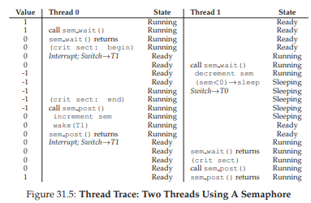
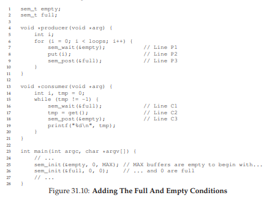
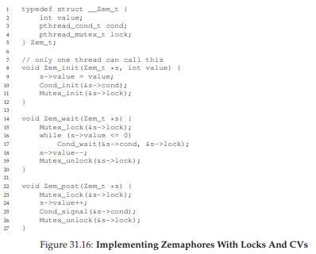

# 31 Semaphores
今のところわかっているように、関連性のある興味深い並行性の問題を解決するためには、ロックと条件変数の両方が必要です。この数年前に実現した最初の人のひとりは、Edsger Dijkstra(正確な歴史[GR92]を知ることは難しいが)である。グラフ理論[D59]の有名な「最短経路」アルゴリズムで知られている。「Goto Statements Considered Harmful」[D68a](これはすばらしいタイトルです)という名前の構造化プログラミングについて説明し、ここではセマフォー[D68b、D72]と呼ばれる同期プリミティブの導入を検討します。実際、Dijkstraらは、セマフォを同期に関連するすべてのものの単一のプリミティブとして考案しました。表示されるように、セマフォはロックと条件変数の両方として使用できます。

>> THE CRUX: HOW TO USE SEMAPHORES  
>> ロックと条件変数の代わりにセマフォを使用するにはどうすればよいですか？セマフォの定義は何ですか？バイナリセマフォとは何ですか？ロックと条件変数からセマフォーを構築するのは簡単ですか？セマフォからロックと条件変数を構築するにはどうすればよいでしょう？

## 31.1 Semaphores: A Definition
セマフォは、2つのルーチンで操作できる整数値を持つオブジェクトです。POSIX標準では、これらのルーチンは`sem_wait()`と`sem_post()`です。セマフォの初期値は、セマフォと相互作用する他のルーチンを呼び出す前に、その動作を決定するため、図31.1のコードと同じように、最初にセマフォをある値に初期化する必要があります。


この図では、セマフォsを宣言し、3番目の引数として1を渡して値1に初期化します。`sem_init()`の2番目の引数は、すべての例で0に設定されています。セマフォが同じプロセス内のスレッド間で共有されていることを示します。セマフォーの他の使用法(つまり、異なるプロセス間でアクセスを同期させるためにそれらをどのように使用することができるか)の詳細については、第2引数の値が異なる必要があります。

セマフォが初期化された後、`sem_wait()`または`sem_post()`の2つの関数のいずれかを呼び出すことができます。これらの2つの機能の動作を図31.2に示します。


今のところ、これらのルーチンの実装には関心がありません。`sem_wait()`と`sem_post()`を呼び出す複数のスレッドでは、これらのクリティカルセクションを管理するために必要があることは明らかです。ここでは、これらのプリミティブの使用方法に焦点を当てます。後に、それらがどのように構築されるかを議論するかもしれません。

ここではインターフェイスのいくつかの顕著な側面について議論する必要があります。`sem_wait()`は`sem_wait()`を呼び出したときにセマフォの値が1以上だったためすぐに返されるか、呼び出し側が後続のポストを待って実行を中断させます。もちろん、複数の呼び出しスレッドが`sem_wait()`を呼び出すことがあります。したがって、すべてが呼び出されるのを待ってキューに入れられます。

第2に、`sem_post()`は`sem_wait()`のように特定の条件が成立するのを待たないことがわかります。むしろ、単にセマフォの値をインクリメントし、次に目覚めようとしているスレッドがあれば、それらの1つを起動させます。

第3に、セマフォの値が負の場合、待機スレッドの数に等しい[D68b]。この値は一般的にセマフォのユーザには見られませんが、知る価値があり、セマフォがどのように機能するかを覚えておくのに役立ちます。

セマフォー内で可能な競合状態を心配しないでください。それらのアクションがアトミックに実行されると仮定します。私たちはこれを行うためにロックと条件変数を使用します。

## 31.2 Binary Semaphores (Locks)
セマフォを使用する準備ができました。私たちの最初の使い方は、すでによく知られているものです。それは、セマフォをロックとして使用します。コードスニペットについては、図31.3を参照してください。重要なセクションを`sem_wait()`/`sem_post()`のペアで囲むだけであることがわかります。ただし、この作業を行う上で重要なのは、セマフォmの初期値です(図のXに初期化されています)。Xは何をすべきですか？


...(先に進む前にそれについて考えてみてください)...

上記の`sem_wait()`と`sem_post()`ルーチンの定義を振り返ってみると、初期値は1であるはずです。

これを明確にするために、2つのスレッドを持つシナリオを想像してみましょう。最初のスレッド(スレッド0)は`sem_wait()`を呼び出します。セマフォの値を最初にデクリメントし、0に変更します。その後、値が0以上でない場合にのみ待機します。値が0であるため、`sem_wait()`は単に戻り値を返しますし継続します。スレッド0はクリティカルセクションに自由に入ります。スレッド0がクリティカルセクション内にある間に他のスレッドがロックを取得しようとしない場合、`sem_post()`を呼び出すと、セマフォの値を1に復元します(存在しないため待機スレッドを起動しません)。図31.4に、このシナリオのトレースを示します。


スレッド0がロックを保持し(つまり`sem_wait()`はまだ`sem_post()`と呼ばれていない)、別のスレッド(スレッド1)`sem_wait()`を呼び出してクリティカルセクションに入ることを試みているとき、スレッド1はセマフォの値を減らして-1にし、待機します(プロセッサをスリープさせて放棄する)スレッド0が再び実行されると、最終的に`sem_post()`が呼び出され、セマフォの値がゼロに戻されて待機スレッド(スレッド1)が起動され、ロックが獲得されます。スレッド1が終了すると、セマフォの値が再びインクリメントされ、再び1に戻されます。

図31.5に、この例のトレースを示します。スレッド動作に加えて、図は各スレッドのスケジューラ状態、すなわち実行中、実行可能(実行可能であるが実行中ではない)、およびスリープを示しています。特に、すでに保持されているロックを取得しようとすると、スレッド1はスリープ状態になります。スレッド0が再び実行された場合にのみ、スレッド1を起動し、潜在的に再び実行することができます。



独自の例を使用して作業したい場合は、複数のスレッドがロックを待って待機するシナリオを試してみてください。このようなトレース中にセマフォの値はどのようになりますか？

このようなとき、セマフォをロックとして使用することができます。ロックは2つの状態(保持され、保持されていない)しか持たないので、ロックとして使用されるセマフォをバイナリセマフォと呼ぶことがあります。注意として、このバイナリ形式でのみセマフォを使用している場合は、ここに示す汎用セマフォより簡単な方法で実装できます。

## 31.3 Semaphores For Ordering
セマフォは、並行プログラムでイベントを順序付けるのにも役立ちます。例えば、スレッドは、リストが空でなくなるのを待つことを望むかもしれないので、そこから要素を削除することができます。この使用パターンでは、あるスレッドが何か起こるのを待っていて、別のスレッドが何か起こっていることを確認してから、それが起こったことをシグナルで待機スレッドを呼び起こします。このようにして、セマフォを順序付けプリミティブとして使用しています(以前の条件変数の使用と同様)。

簡単な例は次のとおりです。スレッドが別のスレッドを作成し、実行を完了するのを待っているとします(図31.6)。このプログラムが実行されると、次の情報が表示されます。

  
```
parent: begin
child
parent: end
```
問題は、この効果を達成するためにセマフォを使用する方法です。それが判明したとき、答えは比較的理解しやすいです。コードでわかるように、親は`sem_wait()`と子`sem_post()`を呼び出して、実行を終了した子の状態が真になるのを待つだけです。しかし、これにより、このセマフォの初期値はどうなるべきかという疑問が生じます。

(やはり先読みではなく、ここで考えてみてください)

答えはもちろん、セマフォの値を0に設定する必要があります。考慮すべき2つのケースがあります。最初に、親が子を作成するが、子はまだ実行されていない(すなわち、準備完了キューに入っているが実行されていない)と仮定します。この場合(図31.7)、親は`sem_post()`を呼び出す前に`sem_wait()`を呼び出します。私たちは親が子供が走るのを待つことを望みます。これが起こる唯一の方法は、セマフォの値が0より大きくない場合です。従って、0が初期値になります。親が実行され、セマフォを減らして-1にしてから、スリープします。子が最終的に実行されると、`sem_post()`を呼び出し、セマフォの値を0にインクリメントし、親をスリープ解除して`sem_wait()`から戻り、プログラムを終了します。


2番目のケース(図31.8、ページ364)は、親が`sem_wait()`を呼び出す前に子プロセスが完了するまで実行されたときに発生します。この場合、子プロセスは`sem_post()`を最初に呼び出し、セマフォの値を0から1にインクリメントします。親プロセスが実行されると、`sem_wait()`がコールされ、セマフォの値が1かどうかを検索します。そうだったとき、親はその値を(0に)デクリメントし、待たずに`sem_wait()`から戻り、望んだ効果を得ます。


## 31.4 The Producer/Consumer (Bounded Buffer) Problem
この章で直面する次の問題は、プロデューサ/コンシューマの問題、時には限定されたバッファの問題[D72]として知られています。この問題は、前の章の条件変数で詳しく説明しています。詳細はこちらをご覧ください。

### First Attempt
この問題を解決するための最初の試みは、空といっぱいという2つのセマフォを導入します。これらのスレッドは、バッファエントリが空になったとき、またはいっぱいになったときを示すために使用します。putとgetルーチンのコードは図31.9にあり、プロデューサとコンシューマの問題を解決するための試みは図31.10にあります。




この例では、プロデューサはまずデータを格納するためにバッファが空になるのを待ち、コンシューマはバッファを使用する前にバッファがいっぱいになるのを待ちます。最初にMAX = 1(配列内にiという1つのバッファしかありません)と仮定し、これが機能するかどうかを見てみましょう。

再度、プロデューサとコンシューマの2つのスレッドがあると想像してください。単一のCPUで特定のシナリオを検討しましょう。コンシューマが最初に走ると仮定します。したがって、コンシューマは、sem_wait(＆full)を呼び出す図31.10のC1行目にヒットします。fullは値0に初期化されているため、コールはfullを減らして(-1)、コンシューマをブロックし、必要に応じて別のスレッドがfullで`sem_post()`を呼び出すのを待ちます。

プロデューサが実行されているとします。これはP1行目でヒットし、sem_wait(＆empty)ルーチンを呼び出します。コンシューマとは異なり、emptyは値MAX(この場合は1)に初期化されるため、プロデューサはこの行を介して継続します。したがってemptyは0にデクリメントされ、プロデューサはデータ値をバッファの最初のエントリに入れます(P2行目)。次に、プロデューサはP3に進み、sem_post(＆full)を呼び出し、fullのセマフォの値を-1から0に変更し、コンシューマを目覚めさせます(例えば、ブロックから準備完了に移動する)。

この場合、2つのうちの1つが起こる可能性があります。プロデューサが走り続けると、ループして再びP1行目にヒットします。ただし、emptyのセマフォの値が0であるため、今回はブロックされます。プロデューサが中断される代わりに、コンシューマが実行を開始すると、sem_wait(＆full)(C1行目)が呼び出され、消費します。いずれの場合でも、望んだの挙動を達成します。

この同じ例をもっと多くのスレッドで試すことができます(複数のプロデューサや複数のコンシューマなど)。それでも動作するはずです。

ここで、MAXが1より大きい(たとえばMAX = 10)と想像してみましょう。この例では、複数のプロデューサと複数のコンシューマが存在すると仮定します。ここで、問題を抱えています。それは競争状態です。どこで発生するのか見えていますか？(しばらく時間をとって見てください)見えない場合は、ヒントがあります。それは、`put()`と`get()`コード付近を詳しく見てください。

さて、問題を理解しましょう。2人のプロデューサー(PaとPb)が`put()`をほぼ同時に呼び出すとします。プロデューサPaが最初に実行され、最初のバッファエントリ(F1行目でfill = 0)を書き始めると仮定します。Paがfillカウンタを1にインクリメントするチャンスを得る前に、それは中断されます。プロデューサーPbが実行を開始し、F1行目でバッファーの0番目の要素にもデータが書き込まれます。つまり、古いデータが上書きされます。これはよくありません。プロデューサからのデータが失われることは望ましくありません。

### A Solution: Adding Mutual Exclusion
ご覧のとおり、ここで忘れてしまったのは相互排除です。バッファの充填とバッファへのインデックスのインクリメントはクリティカルセクションであるため、注意深く管理する必要があります。そのため、バイナリセマフォを使用していくつかのロックを追加しましょう。図31.11に私たちの試みを示します。


これで、NEW LINEコメントで示されているように、コードの`put()`/`get()`部分全体にいくつかのロックが追加されました。それは正しいアイデアのように見えますが、実際はうまくいきません。どうしてでしょうか？ヒントはデッドロックです。なぜデッドロックが発生するのでしょうか？それを考えてみましょう。デッドロックが発生するケースを見つけてみましょう。プログラムがデッドロックするためにはどのような手順を実行する必要がありますか？

### Avoiding Deadlock
さて、あなたは図を理解したので、ここに答えがあります。1つのプロデューサと1つのコンシューマの2つのスレッドを想像してください。まずコンシューマが最初に走ります。ミューテックス(C0行目)を取得し、fullセマフォ(c1行目)で`sem_wait()`を呼び出します。まだデータがないため、この呼び出しによってコンシューマはブロックしてCPUを生成します。重要なことですが、コンシューマはまだロックを保持しています。

プロデューサーが実行されます。それは生産するデータを持っていて、それが動くことができれば、それはコンシューマのスレッドを起こすことができ、すべてがうまくいくでしょう。残念なことに、最初に行うことは、バイナリミューテックスセマフォ(P0行目)に対して`sem_wait()`を呼び出すことです。ロックはすでに保持されています。したがって、プロデューサーは現在も待っています。

ここには単純なサイクルがあります。コンシューマはミューテックスを保持し、誰かがフルシグナルするのを待っています。プロデューサはフルシグナルを送ることができますが、ミューテックスを待っています。したがって、プロデューサとコンシューマはお互いに待っています。古典的なデッドロックです。

### At Last, A Working Solution
この問題を解決するには、単にロックの範囲を小さくする必要があります。図31.12に正しい解を示します。ご覧のとおり、ミューテックスの取得と解放をクリティカルセクションのまわりで行うだけです。フルおよび空の待機およびシグナルコードは外部に残されます。その結果、マルチスレッドプログラムでよく使用されるパターンである単純で作業効率の良い有限バッファーが得られます。それを今理解してください。後でそれを使用してください。あなたは何年も私たちに感謝することでしょう。


## 31.5 Reader-Writer Locks
別の古典的な問題は、異なるデータ構造アクセスが異なる種類のロックを必要とする可能性があることを認める、より柔軟なロックプリミティブに対する要望から生じます。たとえば、挿入や簡単な検索など、多数の並行リスト操作を想像してみてください。挿入がリストの状態を変える(したがって伝統的なクリティカルセクションが意味をなさない)間に、ルックアップは単にデータ構造を読み込みます。挿入が行われていないことを保証できれば、多くのルックアップを並行して進めることができます。このタイプの操作をサポートするために開発する特殊タイプのロックは、リーダライタロック[CHP71]として知られています。このようなロックのコードは、図31.13で使用できます。


コードはかなり簡単です。問題のデータ構造を更新したいスレッドがあれば、書き込みロックを獲得するための`rwlock_acquire_writelock()`とそれを解放するための`rwlock_release_writelock()`という新しい同期操作のペアを呼び出す必要があります。内部的には、これらは単に書き込みロックセマフォを使用して、1人のライターだけがロックを解除し、問題のデータ構造を更新するクリティカルセクションに入ることができるようにします。

さらに興味深いのは、読み取りロックを取得して解放するためのルーチンのペアです。読取りロックを獲得するとき、読者は最初にロックを獲得し、次に読者変数をインクリメントして、現在データ構造内にある読者の数を追跡します。`rwlock_acquire_readlock()`内で実行される重要なステップは、最初の読者がロックを取得したときに発生します。その場合、読者は、書き込みロックセマフォに対して`sem_wait()`を呼び出し、`sem_post()`を呼び出してロックを解放することによって、書き込みロックを取得します。

したがって、読者が読取りロックを取得すると、より多くの読者が読取りロックを取得することも許可されます。ただし、書き込みロックを取得するスレッドは、すべての読者が終了するまで待機する必要があります。クリティカルセクションを終了する最後のものは"writelock"の`sem_post()`を呼び出すので、待機中のライターはロックを獲得できます。このアプローチは(必要に応じて)機能しますが、特に公平性に関しては、いくつかのネガティブな点があります。特に、読者がライターを飢えさせるのは比較的簡単です。この問題に対するより高度な解決策が存在します。おそらくあなたはより良い実装を考えることができますか？ヒント：ライターが待っていると、より多くの読者がロックに入るのを防ぐために、あなたがする必要があることを考えてください。

最後に、リーダライタのロックを注意して使用する必要があることに注意してください。それらはしばしばオーバーヘッドが発生します(特により洗練された実装では)、単純で高速なロックプリミティブ[CB08]を使用するのと比べてパフォーマンスのスピードアップにつながりません。いずれにしても、セマフォを興味深く有用な方法で使用する方法をもう一度紹介します。

>> TIP: SIMPLE AND DUMB CAN BE BETTER (HILL’S LAW)  
>> シンプルで愚かなアプローチが最高のものになるという考えを過小評価するべきではありません。ロックすると、実装が簡単で高速であるため、単純なスピンロックが最適な場合があります。リーダライタのようなものはロックされていますが、複雑で複雑なものは遅いという意味です。したがって、まず、シンプルで愚かなアプローチをまず試みてください。
シンプルさに訴えるこのアイデアは、多くの場所で見られます。初期の情報源は、Mark Hillの論文[H87]であり、CPU用のキャッシュを設計する方法を研究しました。ヒル氏は、シンプルなダイレクトマップキャッシュは、ファンシーで先進的なデザインよりも優れていることを発見しました(キャッシングでは、デザインが単純なため、検索が高速になります)。ヒルが簡潔に彼の作品を要約したように、「巨大で愚かな方が良い」と言いました。

## 31.6 The Dining Philosophers
ダイクストラによって提起され、解決されたもっとも有名な並行性の問題の1つは、食堂の哲学者の問題[D71]として知られています。この問題は、それが楽しく、多分知的に面白いので有名です。しかし、その実用性は低いです。しかし、その名声はここに含まれています。実際には、ある面接でそれについて尋ねられるかもしれませんし、あなたがその質問を見落として仕事を得れなかったら、あなたはOSの教授を本当に恨むでしょう。逆に、あなたが仕事を得たら、あなたのOS教授に素敵なメモ、またはいくつかのストックオプションを送ってください。

問題の基本的な設定はこれです(図31.14を参照)。テーブルの周りに5人の"哲学者"が座っているとします。哲学者の各ペアの間には1つのフォーク(したがって合計5つ)があります。哲学者はそれぞれ考えている時間があり、フォークや食べる時間は必要ありません。食べるためには、哲学者は2本のフォークを必要とします。左側のものと右側のものの両方があります。これらのフォークの競合、それに続く同期の問題は、これを同時プログラミングで研究する問題となっています。


各哲学者の基本的なループは次のとおりです。
```c
while (1) {
    think();
    getforks();
    eat();
    putforks();
}
```
キーとなる挑戦は、デッドロックがなく、哲学者が飢えず、食べることもなく、並行性が高い(つまり、同時に多くの哲学者が同時に食べることができるように)書き込みのルーチンである`getforks()`と`putfork()`をできるだけ実行できるようにすることです。

ダウニーのソリューション[D08]に続いて、いくつかのヘルパー関数を使用して、私たちを解決策に導きます。
```c
int left(int p) { return p; }
int right(int p) { return (p + 1) % 5; }
```
哲学者pが左のフォークを参照したいとき、彼らは単にleft(p)を呼び出します。同様に、哲学者pの右側のフォークはright(p)を呼び出すことによって参照されます。その中の剰余演算子は、最後の哲学者(p = 4)がフォークが0であるとき右手でつかもうとする処理をします。

また、この問題を解決するためにセマフォーが必要になります。それぞれのフォークに対して1つずつ、sem_t forks [5]が5つあるとします。

### Broken Solution
我々はこの問題に対する最初の解決策を試みます。各セマフォー(フォーク配列内の)を1の値に初期化するものとします。各哲学者がそれ自身の数(p)を知っているとします。したがって、図31.15に示す`getforks()`と`putforks()`ルーチンを記述することができます。


この(壊れた)ソリューションの背後にある直感は次のとおりです。フォークを取得するには、まずそれぞれのロックを取得します。最初は左に、次に右にあるロックです。食べ終わると、私たちはそれを解放します。シンプルですよね？残念ながら、この場合、単純な手段は壊れています。発生した問題を理解できますか？それについて考えてみましょう。

問題はデッドロックです。哲学者が自分の右にあるフォークをつかむ前に、各哲学者が左にあるフォークをつかんでしまったら、それぞれのフォークをつかんで別のものを永遠に待つことになります。具体的には、哲学者0はフォーク0、哲学者1はフォーク1、哲学者2はフォーク2、哲学者3はフォーク3を、哲学者4はフォーク4をつかむ。すべてのフォークが獲得され、すべての哲学者が別の哲学者が所有するフォークを待っています。私たちはすぐにデッドロックを詳しく研究します。今のところ、これは実用的な解決策ではないと言っても過言ではありません。

### A Solution: Breaking The Dependency
この問題を攻撃する最も簡単な方法は、哲学者の少なくとも1人がフォークを取得する方法を変更することです。確かに、これはDijkstra自身がどのように問題を解決したかです。具体的には、哲学者4(一番高い番号の哲学者)がフォークを別の順序で取得すると仮定しましょう。これを行うコードは次のとおりです。


最後の哲学者は左手の前に右手をつかみようとしているので、各哲学者が1つのフォークをつかみ、別のフォークを待っている状況はありません。これで待ちのサイクルが解消されました。このソリューションの成果を考えて、それが機能することを自分自身で動かしてください。

このような他の「有名な」問題、例えばたばこ喫煙者の問題または睡眠中の理髪師の問題などがあります。それらのほとんどは、並行性について考えることの言い訳です。それらのいくつかは魅力的な名前を持っています。より多くのことを学ぶことに興味がある場合は、それらを見てください。あるいは同時により多くの練習を同時に行うことができます[D08]。

## 31.7 How To Implement Semaphores
最後に、低レベルの同期プリミティブ、ロック、および条件変数を使用して、...(ドラムロール)というセマフォの独自のバージョンを構築しましょう...Zemaphores。図31.16に示すように、この作業はかなり簡単です。



この図からわかるように、セマフォの値を追跡するために、ロックと条件変数を1つだけ使用し、状態変数を使用します。あなたが本当に理解するまで、あなた自身のためにコードを研究してください。ダイクストラによって定義されたZemaphoreと純粋なセマフォの1つの微妙な違いは、セマフォの値が負の場合は待機スレッドの数を反映するという不変値を維持しないことです。実際には、値は決してゼロより低くなることはありません。この動作は実装が容易で、現在のLinuxの実装と一致します。


>> TIP: BE CAREFUL WITH GENERALIZATION  
>>したがって、一般化の抽象的な技法は、システム設計において非常に有用であり、そこでは、1つの良いアイデアをわずかに広げてより大きなクラスの問題を解決することができます。ただし、一般化するときは注意してください。Lampsonは私たちに"一般化しないでください。一般化は一般に間違っている[L83]。  
>>セマフォをロックと条件変数の一般化として見ることができます。しかし、そのような一般化が必要ですか？また、セマフォの上に条件変数を実現するのが難しいことを考えると、おそらくこの一般化は一般的ではありません。

不思議なことに、セマフォから条件変数を構築することは、はるかにトリッキーな命題です。経験の豊富な並行プログラマの中には、Windows環境でこれを実行しようとしたものがあり、さまざまなバグが発生しました[B04]。自分で試して、セマフォからビルド条件変数を表示するのがなぜ難しいかを理解できるかどうかを確認してください。

## 31.8 Summary
セマフォは、並行プログラムを作成するための強力かつ柔軟なプリミティブです。一部のプログラマーは、そのシンプルさと有用性に、ロックと条件変数を避け、独占的にそれらを使用しています。この章では、いくつかの古典的な問題と解決策を紹介しました。詳細を知りたい場合は、参照できる他の多くの資料があります。1つの偉大な(そして自由な参照)は、並行性とセマフォー[D08]によるプログラミングに関するAllen Downeyの本です。この本は、一般的に特定の並行性と並行性の両方のセマフォの理解を向上させるために取り組むことができる多くのパズルを持っています。真の同時実行性の専門家になるには長年の努力が必要です。それが、このクラスで学んだことを超えて、マスターする鍵です。

## Tham khảo
[B04] “Implementing Condition Variables with Semaphores”  
Andrew Birrell  
December 2004  
An interesting read on how difficult implementing CVs on top of semaphores really is, and the mistakes the author and co-workers made along the way. Particularly relevant because the group had done a ton of concurrent programming; Birrell, for example, is known for (among other things) writing various thread-programming guides.

[CB08] “Real-world Concurrency”  
Bryan Cantrill and Jeff Bonwick  
ACM Queue. Volume 6, No. 5. September 2008  
A nice article by some kernel hackers from a company formerly known as Sun on the real problems faced in concurrent code.

[CHP71] “Concurrent Control with Readers and Writers”  
P.J. Courtois, F. Heymans, D.L. Parnas  
Communications of the ACM, 14:10, October 1971  
The introduction of the reader-writer problem, and a simple solution. Later work introduced more complex solutions, skipped here because, well, they are pretty complex.

[D59] “A Note on Two Problems in Connexion with Graphs”  
E. W. Dijkstra  
Numerische Mathematik 1, 269271, 1959  
Available: http://www-m3.ma.tum.de/twiki/pub/MN0506/WebHome/dijkstra.pdf  
Can you believe people worked on algorithms in 1959? We can’t. Even before computers were any fun to use, these people had a sense that they would transform the world...

[D68a] “Go-to Statement Considered Harmful”  
E.W. Dijkstra  
Communications of the ACM, volume 11(3): pages 147148, March 1968  
Available: http://www.cs.utexas.edu/users/EWD/ewd02xx/EWD215.PDF  
Sometimes thought as the beginning of the field of software engineering.

[D68b] “The Structure of the THE Multiprogramming System”  
E.W. Dijkstra  
Communications of the ACM, volume 11(5), pages 341346, 1968  
One of the earliest papers to point out that systems work in computer science is an engaging intellectual endeavor. Also argues strongly for modularity in the form of layered systems.

[D72] “Information Streams Sharing a Finite Buffer”  
E.W. Dijkstra  
Information Processing Letters 1: 179180, 1972  
Available: http://www.cs.utexas.edu/users/EWD/ewd03xx/EWD329.PDF  
Did Dijkstra invent everything? No, but maybe close. He certainly was the first to clearly write down what the problems were in concurrent code. However, it is true that practitioners in operating system design knew of many of the problems described by Dijkstra, so perhaps giving him too much credit would be a misrepresentation of history.

[D08] “The Little Book of Semaphores”  
A.B. Downey  
Available: http://greenteapress.com/semaphores/  
A nice (and free!) book about semaphores. Lots of fun problems to solve, if you like that sort of thing.

[D71] “Hierarchical ordering of sequential processes”  
E.W. Dijkstra  
Available: http://www.cs.utexas.edu/users/EWD/ewd03xx/EWD310.PDF  
Presents numerous concurrency problems, including the Dining Philosophers. The wikipedia page about this problem is also quite informative.

[GR92] “Transaction Processing: Concepts and Techniques”  
Jim Gray and Andreas Reuter  
Morgan Kaufmann, September 1992  
The exact quote that we find particularly humorous is found on page 485, at the top of Section 8.8: “The first multiprocessors, circa 1960, had test and set instructions ... presumably the OS implementors worked out the appropriate algorithms, although Dijkstra is generally credited with inventing semaphores many years later.”

[H87] “Aspects of Cache Memory and Instruction Buffer Performance”  
Mark D. Hill  
Ph.D. Dissertation, U.C. Berkeley, 1987  
Hill’s dissertation work, for those obsessed with caching in early systems. A great example of a quantitative dissertation.

[L83] “Hints for Computer Systems Design”  
Butler Lampson  
ACM Operating Systems Review, 15:5, October 1983  
Lampson, a famous systems researcher, loved using hints in the design of computer systems. A hint is something that is often correct but can be wrong; in this use, a signal() is telling a waiting thread that it changed the condition that the waiter was waiting on, but not to trust that the condition will be in the desired state when the waiting thread wakes up. In this paper about hints for designing systems, one of Lampson’s general hints is that you should use hints. It is not as confusing as it sounds.

[prev](../30/30.md)|[next](../32/32.md)
