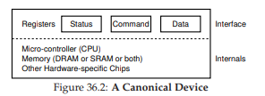
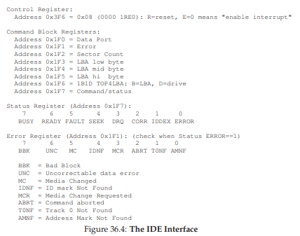

# 36 I/O Devices
本書のこの部分(永続性)の主な内容を掘り下げる前に、入出力(I/O)デバイスの概念を紹介し、オペレーティングシステムがそのようなエンティティとどのように対話するかを示します。もちろん、I/Oはコンピュータシステムにとって非常に重要です。入力なしのプログラムを想像してください(毎回同じ結果を出します)。今は出力のないプログラムを想像してください(何が目的なのですか？)。明らかに、コンピュータシステムが面白いためには、入力と出力の両方が必要です。

>> CRUX: HOW TO INTEGRATE I/O INTO SYSTEMS  
>> I/Oをシステムにどのように組み込むべきですか？一般的な仕組みは何ですか？どのように効率的にすることができますか？

## 36.1 System Architecture
議論を始めるには、典型的なシステムの構造を見てみましょう(図36.1)。画像は、ある種のメモリバスまたは相互接続を介してシステムのメインメモリに接続された単一のCPUを示しています。デバイスの中には、一般的なI/Oバスを介してシステムに接続されているものがあります。多くの現代システムでは、PCI(またはその多くの派生品)の1つです。グラフィックスやその他の高性能I/Oデバイスがここにあります。最後に、さらに低いものは、SCSI、SATA、またはUSBなどの周辺バスと呼ばれるものの1つ以上です。これらは、ディスク、マウス、およびその他の同様のコンポーネントを含む、最も遅いデバイスをシステムに接続します。

あなたが求めるかもしれない1つの質問は、なぜこのような階層構造が必要なのかということです。単純に言えば、物理学とコストです。バスが速ければ速いほど短くなければなりません。したがって、高性能メモリバスは、デバイスなどをプラグインする余地があまりありません。さらに、高性能のためにバスを設計することはかなりコストがかかります。したがって、システム設計者は、グラフィックカードなどの高性能を要求するコンポーネントがCPUに近いほど、この階層的アプローチを採用しています。性能の低いコンポーネントはさらに遠くにあります。周辺バスにディスクやその他の低速デバイスを配置する利点は多岐にわたっています。特に、多数のデバイスを配置することができます。

## 36.2 A Canonical Device
標準のデバイス(実際のものではない)を見て、このデバイスを使用してデバイスの相互作用を効率的にするために必要な機械のいくつかの理解を促進しましょう。図36.2から、デバイスには2つの重要なコンポーネントがあることがわかります。1つ目は、システムの残りの部分に提示するハードウェアインターフェイスです。ソフトウェアのように、ハードウェアは、システムソフトウェアがその動作を制御することを可能にする何らかの種類のインタフェースも提示しなければいけません。したがって、すべてのデバイスは、典型的な相互作用のための特定のインタフェースおよびプロトコルがあります。

任意のデバイスの第2の部分は、その内部構造です。デバイスのこの部分は実装固有のものであり、デバイスがシステムに提示する抽象化を実装する責任があります。非常にシンプルなデバイスは、その機能を実装するために1つまたはいくつかのハードウェアチップを持ちます。より複雑なデバイスには、シンプルなCPU、汎用メモリ、および他のデバイス固有のチップが含まれ、仕事を得て、おわらせます。例えば、最新のRAIDコントローラは、その機能を実現するために、数十万行のファームウェア(すなわち、ハードウェアデバイス内のソフトウェア)から構成されています。

## 36.3 The Canonical Protocol
上記の図では、(簡略化された)デバイスインタフェースは3つのレジスタで構成されています。ステータスレジスタは、デバイスの現在の状態を見るために読み出すことができます。コマンドレジスタは特定のタスクを実行するようにデバイスに指示します。データレジスタはデバイスにデータを渡すか、またはデバイスからデータを取得します。これらのレジスタを読み書きすることにより、オペレーティングシステムはデバイスの動作を制御できます。ここでは、デバイスがそのために何かを行うために、OSとデバイスが持つ可能性がある典型的な相互作用について説明します。プロトコルは次のとおりです。  
  
プロトコルには4つのステップがあります。最初に、OSは、デバイスがステータスレジスタを繰り返し読み出すことによってコマンドを受信する準備ができるまで待機します。このポーリングをデバイスと呼びます(基本的に、何が起こっているのかを尋ねるだけです)。第2に、OSはいくつかのデータをデータレジスタに送る。これがディスクの場合、たとえばディスクブロック(たとえば4KB)をデバイスに転送するために複数の書き込みが行われる必要があると想像することができます。メインCPUが(このプロトコル例のように)データ移動に関与する場合、これをプログラムI/O(PIO)と呼びます。第3に、OSはコマンドレジスタにコマンドを書き込む。そうすることで、暗黙的に、データが存在し、コマンドで作業を開始する必要があることをデバイスに知らせることができます。最後に、OSはデバイスが終了するのを待って、ループでポーリングして終了するかどうかを確認します(成功または失敗を示すエラーコードが表示されることがあります)。

この基本的なプロトコルは、単純で働きやすいという肯定的な側面を持っています。しかし、いくつかの非効率性と不便さがあります。プロトコルで最初に気づく問題は、ポーリングが非効率的であるように見えることです。具体的には、デバイスがそのアクティビティを完了するのを待つだけでCPU時間を大量に無駄する代わりに、別の準備完了プロセスに切り替え(潜在的に遅い)、CPUをより有効に利用しています。

## 36.4 Lowering CPU Overhead With Interrupts
この相互作用を改善するために何年も前に多くのエンジニアが出てきた発明は、すでに見てきたことです。デバイスを繰り返しポーリングする代わりに、OSは要求を発行し、呼び出しプロセスをスリープ状態にし、コンテキストを別のタスクに切り替えることができます。デバイスが最終的に動作を終了すると、ハードウェア割り込みが発生し、CPUが所定の割り込みサービスルーチン(ISR)またはより単純に割り込みハンドラでOSにジャンプします。ハンドラは、要求を終了する(たとえば、データおよびおそらくはデバイスからのエラーコードを読み取る)オペレーティングシステムコードの一部に過ぎず、I/Oを待っているプロセスを復帰させ、必要に応じて処理をすすめることができます。

したがって、割り込みは、計算とI/Oの重複を可能にします。これは、使用率を向上させるための鍵です。このタイムラインは問題を示しています  
  
この図では、プロセス1はCPUで一定時間実行され(CPU行で1が繰り返されます)、ディスクにI/O要求を発行してデータを読み取ります。割り込みがなければ、システムは単に回転し、I/Oが完了するまで(pで示される)、デバイスの状態を繰り返しポーリングします。ディスクは要求を処理し、最後にプロセス1を再度実行できます。代わりに、割り込みを利用して重複を許可すると、OSはディスクを待っている間に何か他のことをすることができます。  
  
この例では、ディスクサービスプロセス1の要求中に、OSはCPU上でプロセス2を実行します。ディスク要求が終了すると、割り込みが発生し、OSはプロセス1を起動して再度実行します。したがって、CPUとディスクの両方は、中程度の時間に適切に利用されます。

割り込みを使用することは常に最適な解決方法ではないことに注意してください。たとえば、タスクを非常に迅速に実行するデバイスを想像してください。最初のポーリングでは通常、タスクを実行するデバイスが見つけられます。この場合に割り込みを使用すると、実際にはシステムの速度が遅くなります。別のプロセスに切り替え、割り込みを処理し、発行プロセスに戻すのはコストがかかります。したがって、デバイスが高速であれば、ポーリングするのが最善の方法です。遅い場合、オーバーラップを許す割り込みが最適です。デバイスの速度がわかっていないか、時には高速で時には遅い場合は、しばらくポーリングするハイブリッドを使用し、デバイスがまだ終了していない場合は割り込みを使用するのが最善の方法です。この2段階アプローチは、両方の世界のベストを達成するかもしれません。

>> TIP: INTERRUPTS NOT ALWAYS BETTER THAN PIO  
>> 割り込みは計算とI/Oのオーバーラップを可能にしますが、遅いデバイスには本当に意味があります。それ以外の場合は、割込み処理とコンテキスト切り替えのコストが割込みの利点を上回る可能性があります。また、割り込みfloodがシステムに過負荷をかけ、それをライブロックに導く場合もあります[MR96]。そのような場合、ポーリングはOSのスケジューリングにおいてより多くの制御を提供し、したがって再び有用です。

割り込みを使用しない別の理由は、ネットワーク[MR96]で発生します。膨大なストリームの着信パケットがそれぞれ割り込みを生成すると、OSはライブロックすることができます。つまり、割り込み処理のみを実行し、ユーザーレベルのプロセスを実行して実際に要求を処理することはできません。たとえば、スラッシュドット効果のために突然負荷が高くなるWebサーバーを想像してください。この場合、ポーリングを使用して、システムで発生していることをよりうまく制御し、Webサーバーがいくつかの要求にサービスを提供してから、デバイスに戻ってより多くのパケット到着を確認することをお勧めします。

別の割り込みベースの最適化が統合されています。このような設定では、割り込みを発生させる必要のあるデバイスは、最初にCPUに割り込みを送信する前に少し待っています。待機している間に、他の要求が間もなく完了し、複数の割り込みを1つの割り込みデリバリにまとめて割り込み処理のオーバーヘッドを減らすことができます。もちろん、待ち時間が長すぎると、システムの一般的なトレードオフであるリクエストの待ち時間が長くなります。Ahmad et al。 [A + 11]は素晴らしい要約です。

## 36.5 More Efficient Data Movement With DMA
残念ながら、私たちの注意を必要とする標準プロトコルのもう一つの側面があります。特に、プログラムされたI/O(PIO)を使用して大量のデータをデバイスに転送する場合、CPUはもう少し過酷な作業で再び過負荷になり、実行に多くの時間と労力を費やし、他のプロセスの実行にもっと費やすことができる努力を無駄にします。このタイムラインは問題を示しています  
  
タイムラインでは、プロセス1が実行されていて、ディスクにデータを書きたいと考えています。その後、I/Oを開始します。このI/Oは、一度に1ワードずつメモリからデバイスに明示的にデータをコピーする必要があります(図のc)。コピーが完了すると、I/Oはディスク上で開始され、CPUは最終的に他の用途に使用されます。

>> THE CRUX: HOW TO LOWER PIO OVERHEADS  
>> PIOを使用すると、CPUは手作業でデバイス間でデータを移動するのに時間がかかりすぎます。どのようにしてこの作業をオフロードし、CPUをより効果的に利用できるようにするか？

この問題に対する解決策は、ダイレクトメモリアクセス(DMA)と呼ばれるものです。DMAエンジンは基本的にシステム内の非常に特殊なデバイスであり、多くのCPUの介入なしにデバイスとメインメモリ間の転送を調整することができます。

DMAは次のように動作します。たとえば、デバイスにデータを転送するには、OSはメモリにデータがどこにあるのか、どのくらいのデータをコピーするのか、どのデバイスにデータを送るのかを伝えることでDMAエンジンをプログラムします。その時点で、OSは転送を終え、他の作業を進めることができます。DMAが完了すると、DMAコントローラは割り込みを発生させ、したがってOSは転送が完了したことを知ります。改訂されたタイムラインでは以下のようになります。  
  
タイムラインから、データのコピーがDMAコントローラによって処理されることがわかります。その間にCPUはフリーであるため、OSはプロセス2を実行することを選択して別の処理を行うことができます。プロセス1はプロセス1が再び実行される前に、より多くのCPUを使用します。

## 36.6 Methods Of Device Interaction
I/Oを実行する際の効率の問題があるので、デバイスを最新のシステムに組み込むために処理する必要があるいくつかの問題があります。これまでに気がついた問題の1つは、OSが実際にデバイスとどのように通信しているかについては何も言いませんでした。

>> THE CRUX: HOW TO COMMUNICATE WITH DEVICES  
ハードウェアとデバイスとの通信方法明示的な指示があるべきか？それともそれ以外の方法がありますか？

時間の経過と共に、デバイス通信の2つの主要な方法が開発されています。最初の、(IBMのメインフレームで長年使用されている)最も古い方法は、明示的なI/O命令を持つことです。これらの命令は、OSが特定のデバイスレジスタにデータを送信する方法を指定し、したがって上述のプロトコルの構築を可能にします。

たとえば、x86では、inおよびout命令を使用してデバイスと通信することができます。たとえば、デバイスにデータを送信するには、呼び出し元はデータが入っているレジスタとデバイスに名前を付ける特定のポートを指定します。命令を実行すると、目的の動作になります。

そのような指示は通常特権が与えられます。OSはデバイスを制御するため、OSだけは直接通信できるエンティティとして許可されています。プログラムがディスクを読み書きできるかどうかを想像してみましょう。例えば、すべてのカオスはいつものように、どんなユーザプログラムもそのような抜け穴を使ってマシンを完全に制御することができます。

デバイスと対話する第2の方法は、メモリマップI/Oと呼ばれます。このアプローチでは、ハードウェアはデバイスのレジスタをあたかもメモリの場所のように使用可能にします。特定のレジスタにアクセスするために、OSはアドレスをロード(読み込み)または格納(書き込み)します。ハードウェアはメインメモリではなくデバイスにロード/ストアをルーティングします。あるアプローチや他のアプローチに大きな利点はありません。メモリマップされたアプローチは、それをサポートするための新しい命令は必要ないという点で素晴らしいですが、どちらのアプローチも今日でもまだ使用されています。

## 36.7 Fitting Into The OS: The Device Driver
最終的に私たちが議論する問題の1つは、それぞれ固有のインタフェースを持つデバイスをOSに組み込む方法です。できるだけ一般的なものにしたいと考えています。 たとえば、ファイルシステムを考えてみましょう。私たちは、SCSIディスク、IDEディスク、USBキーチェーンドライブなどの上で動作するファイルシステムを構築したいと考えています。また、ファイルシステムがこれらの差分があるタイプのドライブに対してどのように読み書き要求を発行するかの詳細すべてを比較的知らないことを望んでいます。

>> THE CRUX: HOW TO BUILD A DEVICE-NEUTRAL OS  
>> どのようにしてOSのデバイスの中立性を最大限に保ち、主要なOSサブシステムからのデバイスの相互作用の詳細を隠すことができますか？

この問題は、古くからの抽象化技術によって解決されています。最低レベルでは、OSの一部のソフトウェアは、デバイスがどのように動作するかを詳細に把握している必要があります。このソフトウェアはデバイスドライバと呼ばれ、デバイスの相互作用の詳細はすべてカプセル化されています。

この抽象化が、Linuxファイルシステムソフトウェアスタックを調べることによって、OSの設計と実装にどのように役立つかを見てみましょう。図36.3は、Linuxソフトウェアの組織の概略図です。ダイアグラムから分かるように、ファイルシステム(もちろん、上記のアプリケーション)は、使用しているディスククラスの詳細を完全に無視しています。ブロック読み出しおよび書き込み要求を汎用ブロックレイヤーに発行するだけで、適切なデバイスドライバにルーティングされ、特定の要求を発行する詳細が処理されます。簡略化されていますが、この図は、そのような詳細がほとんどのOSからどのように隠れるかを示しています。

  

このようなカプセル化は、同様にその欠点を有する可能性があることを覚えておいてください。例えば、多くの特殊な機能を備えているが、残りのカーネルに汎用インターフェースを提示しなければならないデバイスがある場合、それらの特殊機能は使用されなくなります。このような状況は、例えば、SCSIデバイスを搭載したLinuxでは非常に多くのエラー報告があります。他のブロックデバイス(例えば、ATA/IDE)はずっと簡単なエラー処理をもっているので、これまでに受け取ったより高いレベルのソフトウェアの全ては一般的なEIO(一般的なIOエラー)エラーコードです。したがって、SCSIが提供している可能性のあるエラーの詳細は、ファイルシステム(高いレベルのソフトウェア)[G08]では失われます。

興味深いことに、あなたのシステムに接続する可能性のあるデバイスにはデバイスドライバが必要であるため、時間の経過とともにカーネルコードの膨大な割合を占めています。Linuxカーネルの研究では、OSコードの70％以上がデバイスドライバ[C01]に存在することが明らかになりました。Windowsベースのシステムでも、かなり高い可能性で同じくらいあります。したがって、OSに何百万行ものコードが含まれていると言うと、実際にはOSには何百万行ものデバイスドライバコードが含まれています。当然のことながら、任意のインストールに対して、そのコードの大部分はアクティブではないです(すなわち、一度にいくつかのデバイスのみがシステムに接続される)。ドライバーは(フルタイムのカーネル開発者の代わりに)「アマチュア」によって書かれていることが多いため、より多くのバグを持つ傾向があり、カーネルクラッシュの主な原因となります[S03]。

## 36.8 Case Study: A Simple IDE Disk Driver
ここでもう少し詳しく調べるために、実際のデバイスを簡単に見てみましょう。IDEディスクドライブ[L94]です。この参考文献[W10]に記載されているプロトコルを要約します。実際のIDEドライバ[CK + 08]の簡単な例についてはxv6ソースコードを見ていきます。

IDEディスクは、コントロール、コマンドブロック、ステータス、およびエラーの4種類のレジスタで構成されるシンプルなインターフェイスをシステムに提供します。これらのレジスタは、I/O命令の入出力(x86では)を使用して、特定の"I/Oアドレス"(以下の0x3F6など)を読み書きすることで利用できます。

デバイスと相互作用するための基本的なプロトコルは、既に初期化されているものとします。

- ドライブの準備が整うのを待ちます。ドライブがREADYでBUSYになるまでステータスレジスタ(0x1F7)を読み込みます。  
- コマンドレジスタにパラメータを書き込む。アクセスするセクタのセクタ数、論理ブロックアドレス(LBA)、およびコマンド番号(0x1F2-0x1F6)にドライブ番号(IDEが2つのドライブのみを許可するため、マスタ= 0x00またはスレーブ= 0x10)を書き込みます。  
- I/Oを開始します。コマンドレジスタへの読出し/書込みを発行することによって、コマンドレジスタ(0x1F7)にREAD-WRITEコマンドを書き込みます。  
- データ転送(書き込み用)：ドライブステータスがREADYおよびDRQ(データのドライブ要求)になるまで待ちます。データポートにデータを書き込みます。  
- 割り込みを処理します。最も単純なケースでは、転送されるセクタごとに割り込みを処理します。より複雑なアプローチはバッチ処理と転送全体が完了したときに最終的な割り込みを可能にします。  
- エラー処理。各操作の後、ステータスレジスタを読み出します。ERRORビットがオンの場合は、エラー・レジスタを参照してください。

このプロトコルの大部分は、xv6 IDEドライバ(図36.5)にあります。初期化後、4つの主な機能が動作します。最初のものは`ide_rw()`で、要求がキューに入れられているかどうかを確認したり、`ide_start_request()`を使ってディスクに直接発行したりします。どちらの場合も、ルーチンは要求が完了するのを待つため、呼び出しプロセスがスリープ状態になります。2番目は`ide_start_request()`で、要求(ディスクの場合はデータ)をディスクに送信するために使用されます。インおよびアウトx86命令は、それぞれデバイスレジスタを読み書きするために呼び出されます。開始要求ルーチンは、3番目の関数`ide_wait_ready()`を使用して、要求を発行する前にドライブが準備状態になっていることを確認します。最後に、割り込みが発生すると`ide_intr()`が呼び出されます。(要求が書き込みではなく読み込みである場合)デバイスからデータを読み込み、I/Oが完了するのを待つプロセスを起動し、(I/Oキューにさらに要求がある場合)、`ide_start_request()`を介して次のI/Oに移ります。

## 36.9 Historical Notes
終了する前に、これらの基本的なアイデアの起源に関する簡単な歴史的な注記を掲載します。あなたがもっと学ぶことに興味があるなら、Smothermanの優れた要約[S08]を読んでください。

割り込みは古代の考えであり、最も初期のマシンに存在します。例えば、1950年代初期のUNIVACは、この機能が利用可能であったのかどうかは明確ではありませんが、何らかの形の割り込みベクタリングを持っていました[S08]。残念なことに、揺籃期(物事が張ってする初期の段階)であっても、私たちはコンピューティングの歴史の始まりを失い始めています。

DMAの考え方をどのマシンが最初に導入したのかについていくつかの議論があります。例えば、Knuthらは、DYSEAC(その時点でトレーラーで運ばれることができる「モバイル」マシン)を指していますが、他の人はIBM SAGEが最初の[S08]であったかもしれないと考えています。どちらの方法でも、50年代半ばまでに、メモリと直接通信し、終了時にCPUを中断するI/Oデバイスを持つシステムが存在しました。

この発明の歴史は現実、または時にはあいまいに機械と結びついているので、ここまで歴史は辿るのが難しいです。たとえば、リンカーン・ラボのTX-2マシンが最初にベクトル化された割込みであると考える人もいますが(S08)、これはほとんどわかりません。

アイデアは比較的分かりやすいので、遅いI/Oを待っている間にCPUに何か他のことをさせるというアイデアは自然に生まれたものでしょう。おそらく、"誰が先に？"というのは関係ありません。確かに明らかなのは、人々がこれらの初期のマシンを構築すると、I/Oサポートが必要だったということです。割り込み、DMA、および関連するアイデアは、すべて高速のCPUと低速デバイスの性質の自然な結果です。あなたがその時にそこにいたなら、あなたは似た考えを持っていたかもしれません。

## 36.10 Summary
これで、OSがデバイスとどのようにやりとりするかについて、基本的に理解しているはずです。デバイスの効率を助けるために、割り込みとDMAの2つの手法が導入されており、デバイス・レジスタ、明示的なI/O命令、およびメモリ・マップされたI/Oにアクセスする2つの方法の詳細が説明されています。最後に、デバイスドライバの概念が提示され、OS自体がどのように低レベルの詳細をカプセル化して、残りのOSをデバイス中立的な方法で簡単に構築できるかを示しています。

### Tham khảo
[A+11] “vIC: Interrupt Coalescing for Virtual Machine Storage Device IO”  
Irfan Ahmad, Ajay Gulati, Ali Mashtizadeh  
USENIX ’11  
A terrific survey of interrupt coalescing in traditional and virtualized environments.  

[C01] “An Empirical Study of Operating System Errors”  
Andy Chou, Junfeng Yang, Benjamin Chelf, Seth Hallem, Dawson Engler  
SOSP ’01  
One of the first papers to systematically explore how many bugs are in modern operating systems. Among other neat findings, the authors show that device drivers have something like seven times more bugs than mainline kernel code.  

[CK+08] “The xv6 Operating System”  
Russ Cox, Frans Kaashoek, Robert Morris, Nickolai Zeldovich  
From: http://pdos.csail.mit.edu/6.828/2008/index.html  
See ide.c for the IDE device driver, with a few more details therein.  

[D07] “What Every Programmer Should Know About Memory”  
Ulrich Drepper  
November, 2007  
Available: http://www.akkadia.org/drepper/cpumemory.pdf  
A fantastic read about modern memory systems, starting at DRAM and going all the way up to virtualization and cache-optimized algorithms.

[G08] “EIO: Error-handling is Occasionally Correct”  
Haryadi Gunawi, Cindy Rubio-Gonzalez, Andrea Arpaci-Dusseau, Remzi Arpaci-Dusseau, Ben Liblit  
FAST ’08, San Jose, CA, February 2008  
Our own work on building a tool to find code in Linux file systems that does not handle error return properly. We found hundreds and hundreds of bugs, many of which have now been fixed.

[L94] “AT Attachment Interface for Disk Drives”  
Lawrence J. Lamers, X3T10 Technical Editor  
Available: ftp://ftp.t10.org/t13/project/d0791r4c-ATA-1.pdf  
Reference number: ANSI X3.221 - 1994 A rather dry document about device interfaces. Read it at your own peril.

[MR96] “Eliminating Receive Livelock in an Interrupt-driven Kernel”  
Jeffrey Mogul and K. K. Ramakrishnan  
USENIX ’96, San Diego, CA, January 1996  
Mogul and colleagues did a great deal of pioneering work on web server network performance. This paper is but one example.

[S08] “Interrupts”  
Mark Smotherman, as of July ’08  
Available: http://people.cs.clemson.edu/˜mark/interrupts.html  
A treasure trove of information on the history of interrupts, DMA, and related early ideas in computing

[S03] “Improving the Reliability of Commodity Operating Systems”  
Michael M. Swift, Brian N. Bershad, and Henry M. Levy  
SOSP ’03  
Swift’s work revived interest in a more microkernel-like approach to operating systems; minimally, it finally gave some good reasons why address-space based protection could be useful in a modern OS.

[W10] “Hard Disk Driver”  
Washington State Course Homepage  
Available: http://eecs.wsu.edu/˜cs460/cs560/HDdriver.html  
A nice summary of a simple IDE disk drive’s interface and how to build a device driver for it.  

[prev](../35/35.md)|[next](../37/37.md)
