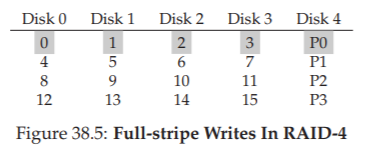
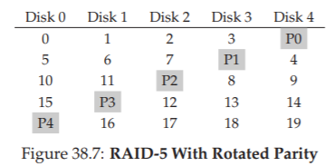
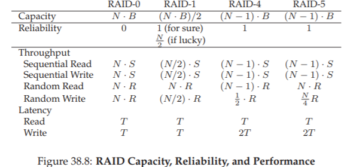

# 38 Redundant Arrays of Inexpensive Disks (RAIDs)
ディスクを使用する場合、ディスクを高速化したい場合があります。I/O操作が遅いため、システム全体のボトルネックになる可能性があります。ディスクを使用する場合、ディスクを大きくしたい場合があります。多くのデータをオンラインに置かなければ、ローカルディスクがデータでいっぱいになってしまいます。ディスクを使用する場合、ディスクをより信頼できるものにすることを望みます。ディスクに障害が発生した場合、データがバックアップされていなければ、その重要なデータはすべて失われます。

>> CRUX: HOW TO MAKE A LARGE, FAST, RELIABLE DISK  
>> 大規模で高速で信頼性の高いストレージシステムを構築するにはどうすればよいですか？重要な技術は何ですか？異なるアプローチ間のトレードオフは何ですか？

この章では、RAID [P + 88]というよりよく知られている安価なディスクの冗長配列を紹介します。これは、複数のディスクを一度に使用して、より速く、より大きく、より信頼性の高いディスクシステムを構築するテクニックです。この用語は、1980年代後半に米国バークレーの研究者グループによって導入されました。(David PattersonとRandy Katz教授、そしてGarth Gibson教授が率いる)くの異なる研究者が複数のディスクを使用してより優れたストレージシステムを構築するという基本的な考え方に同時に到達したのはこの頃でした[BG88、K86、K88、PB86、SG86]。

外部的には、RAIDはディスクのように見えます。つまり、読み書きできるブロックのグループです。内部的には、RAIDは複数のディスク、メモリ(揮発性と非揮発性の両方)、システムを管理する1つ以上のプロセッサで構成される複雑な獣です。ハードウェアRAIDは、ディスクグループを管理するタスクに特化したコンピュータシステムに非常によく似ています。

RAIDは、1つのディスクに比べて多くの利点を提供します。1つの利点はパフォーマンスです。並列に複数のディスクを使用すると、I/O時間が大幅に短縮されます。もう1つの利点は容量です。大きなデータセットには大きなディスクが必要です。最後に、RAIDは信頼性を向上させることができます。複数のディスクにデータを分散すると(RAID技術なし)、データは単一ディスクが壊れると消失するという脆弱に繋がります。何らかの形の冗長性では、RAIDはディスクの損失を許容し、何も問題がないかのように動作し続けることができます。

>> TIP: TRANSPARENCY ENABLES DEPLOYMENT  
システムに新しい機能を追加する方法を検討するときは、システムの残りの部分に変更を加える必要がないように、そのような機能を透過的に追加できるかどうかを常に検討する必要があります。既存のソフトウェア(または過激なハードウェア変更)の完全な書き換えを要求することは、アイデアのすばらしい可能性がなくなってしまいます。RAIDは完璧な例であり、確かにその透過性は成功に貢献しました。管理者はSCSIディスクの代わりにSCSIベースのRAIDストレージ配列をインストールでき、残りのシステム(ホストコンピュータ、OSなど)は1ビットも変更する必要がありませんでした。この展開の問題を解決することにより、RAIDは最初からすばらしい成功を収めました。

驚いたことに、RAIDは、これらの利点を使用するシステムにこれらの利点を透過的に提供します。つまり、RAIDはホストシステムにとって大きなディスクのように見えます。透明性の美しさはもちろん、ディスクをRAIDに置き換えるだけで、ソフトウェアの1行を変更する必要はありません。オペレーティング・システムおよびクライアント・アプリケーションは変更せずに動作し続けます。このように、透過性はRAIDの展開性を大幅に向上させ、ユーザと管理者がソフトウェア互換性の心配なしにRAIDを使用できるようにします。

ここで、RAIDの重要な側面のいくつかについて説明します。インターフェイス、障害モデルから始めて、容量、信頼性、パフォーマンスの3つの重要な軸に沿ってRAID設計を評価する方法について説明します。次に、RAIDの設計と実装にとって重要なその他の多くの問題について説明します。

## 38.1 Interface And RAID Internals
上のファイルシステムでは、RAIDは大きくて、うまくいけば高速で、(うまくいけば)信頼できるディスクのように見えます。単一のディスクの場合と同様に、ファイルシステム(または他のクライアント)によって読み書きできるブロックの線形配列として表示されます。

ファイルシステムがRAIDに論理I/O要求を発行すると、RAIDは内部要求を完了するためにアクセスしたディスク(またはディスク)を計算しなければいけません、そしてそうするために、1つまたは複数の物理I/Oを発行します。これらの物理I/Oの正確な性質は、RAIDレベルによって異なります(詳細は後述)。しかし、単純な例として、各ブロック(それぞれが別個のディスクにある)の2つのコピーを保持するRAIDを考えてみましょう。このようなミラー化されたRAIDシステムに書き込む場合、RAIDは発行される1つの論理I/Oごとに2つの物理I/Oを実行する必要があります。

RAIDシステムは、よくホストへの標準的な接続(例えば、SCSIまたはSATA)を有する別個のハードウェアボックスとして構築されます。しかし、内部的にRAIDはかなり複雑で、RAIDの動作を指示するファームウェアを実行するマイクロコントローラ、DRAMのような揮発性メモリが読み書きされたデータブロックをバッファリングし、場合によっては不揮発性メモリがバッファに安全な書き込みや特殊なロジックにも、パリティ計算を実行するかもしれません(いくつかのRAIDレベルで有効です、以下も参照してください)。高レベルでは、RAIDは特殊なコンピュータシステムです。プロセッサ、メモリ、およびディスクを備えています。ただし、アプリケーションを実行する代わりに、RAIDを動作させるように設計された専用ソフトウェアを実行します。

## 38.2 Fault Model
RAIDを理解し、さまざまなアプローチを比較するには、障害モデルを考慮する必要があります。RAIDは、特定の種類のディスク障害を検出してリカバリするように設計されています。したがって、どのような不具合が予期されるかを正確に知ることは、実際の設計に着手する上で重要です。

我々が想定する最初の故障モデルは非常に単純であり、fail stop fault model(フェイルストップフォールトモデル)と呼ばれています[S84]。このモデルでは、ディスクは正確に2つの状態のうちの1つになる可能性があります。二つの状態というのは作業中と故障です。作業ディスクを使用すると、すべてのブロックを読み書きすることができます。対照的に、ディスクに障害が発生した場合、ディスクは永久に失われたとみなされます。

フェールストップモデルの重要な側面の1つは、障害検出について想定していることです。具体的には、ディスクが故障した場合、これは容易に検出されると想定します。たとえば、RAID配列では、RAIDコントローラのハードウェア(またはソフトウェア)が、ディスクに障害が発生したときに直ちに監視することができます。

したがって、今のところ、ディスクの破損などのより複雑な「サイレント」エラーについては心配する必要はありません。また、別の方法で動作しているディスク(潜在的なセクタエラーと呼ばれることもあります)では、単一のブロックがアクセス不能になることを心配する必要はありません。私たちは後に、より複雑な(そして残念なことにより現実的な)ディスク障害を考えていきます。

## 38.3 How To Evaluate A RAID
すぐにわかるように、RAIDを構築するにはいくつかの異なるアプローチがあります。これらのアプローチのそれぞれは、その強みと弱みを理解するために、評価する価値のあるさまざまな特性を持っています。

具体的には、各RAID設計を3つの軸に沿って評価します。最初の軸は容量です。それぞれBブロックを持つN個のディスクのセットが与えられた場合、RAIDのクライアントはどれくらいの有用な容量を利用できますか？冗長性がなければ、答えはN・Bです。対照的に、各ブロックの2つのコピーを保持するシステム(ミラーリングと呼ばれる)があれば、(N・B)/2の容量が得られます。また、異なるスキーム(例えば、パリティベースのもの)がその間に入ることがあります。

評価の第2の軸は信頼性です。特定の設計で許容されるディスク障害の数はいくつですか？私たちのフォールト・モデルと一致して、ディスク全体が故障すると仮定します。後の章(データの完全性)では、より複雑な障害モードの処理方法について考えていきます。最後に、第3の軸はパフォーマンスです。パフォーマンスは、ディスク配列に提示される負荷に大きく依存するため、評価するのはやや難しいです。

したがって、パフォーマンスを評価する前に、最初に検討すべき典型的な仕事量のセットを提示します。RAIDレベル0(ストライピング)、RAIDレベル1(ミラーリング)、RAIDレベル4/5(パリティベースの冗長性)の3つの重要なRAID設計を検討します。これらのデザインの「レベル」という命名は、Berkeley [P + 88]のPatterson、Gibson、およびKatzの先駆的な仕事に由来します。

## 38.4 RAID Level 0: Striping
最初のRAIDレベルは、冗長性がないという点で、実際にはRAIDレベルではありません。ただし、RAIDレベル0、つまりストライピングはパフォーマンスと容量の優れた上限になり、理解を深めることができます。

ストライピングの最も単純な形式は、次のようにシステムのディスク全体にブロックをストライプします(ここでは4ディスク配列を仮定します)。  


図38.1から、ブロックの配列をラウンドロビン方式でディスクに分散させるという基本的な考え方が得られます。このアプローチは、連続したチャンクの配列に対して要求が行われたとき(たとえば、大規模なシーケンシャル読み取りの場合など)、配列から最も多くの並列性を抽出するように設計されています。同じ行のブロックをストライプと呼びます。したがって、ブロック0,1,2および3は、上の同じストライプにあります。

この例では、各ディスクに次のブロックに移動する前に、1つのブロック(それぞれサイズ4KB)が配置されていることを単純化しています。しかしながら、この配置は、必ずしもそうである必要はありません。たとえば、ブロックを図38.2のように配置することができます。  


この例では、各ディスクに2つの4KBブロックを配置してから、次のディスクに移動します。したがって、このRAIDアレイのチャンクサイズは8KBであり、したがってストライプは4チャンクまたは32KBのデータで構成されます。

>> ASIDE: THE RAID MAPPING PROBLEM  
>> RAIDの容量、信頼性、および性能の特性を調べる前に、まずマッピング問題と呼ばれるものを脇に示します。この問題はすべてのRAID配列で発生します。論理ブロックを読み書きすると、RAIDはアクセスする物理ディスクとオフセットを正確にどのように認識していますか？
これらのシンプルなRAIDレベルでは、論理ブロックを物理的な場所に正しくマップするために高度な知識は必要ありません。上記の最初のストライピングの例を考えてください(チャンクサイズ= 1ブロック= 4KB)。この場合、論理ブロックアドレスAが与えられれば、RAIDは簡単に2つの簡単な式で所望のディスクとオフセットを計算できます。  
```
Disk = A % number_of_disks
Offset = A / number_of_disks
```
>> これらはすべて整数演算であることに注意してください(たとえば、4/3 = 1ではなく1.33333 ...)。これらの方程式が簡単な例のためにどのように機能するかを見てみましょう。上記の最初のRAIDで、ブロック14の要求が到着したとします。4つのディスクがあると、ブロック14が(14％4 = 2)ディスク2であることを意味します。したがって、ブロック14は、3番目のディスク(0から始まるので)の4番目のブロック(0から始まるので)に存在しなければいけません。さまざまなチャンクサイズをサポートするためにこれらの方程式がどのように変更されるかについて考えることができます。それを試してみてください！それほど難しいことではありません。

### Chunk Sizes
チャンクサイズは主に配列のパフォーマンスに影響します。たとえば、チャンクサイズが小さいと、多くのファイルが多くのディスクにストライプ化され、1つのファイルに対する読み書きの並列性が向上します。ただし、要求全体の位置決め時間は、すべてのドライブの要求の位置決め時間の最大値によって決まるため、複数のディスクにまたがるブロックにアクセスするための位置決め時間が長くなります。

一方、大きなチャンクサイズは、このようなイントラファイルの並列性を低減し、従って、高いスループットを達成するために複数の並行要求(並行処理)に依存します。しかし、チャンクサイズが大きいと、位置決め時間が短縮されます。例えば、単一のファイルがチャンク内に収まり、単一のディスク上に置かれた場合、それにアクセスする際に発生する位置決め時間は、単一のディスクの位置決め時間と同じです。

したがって、「最良の」チャンク・サイズを決定することは、ディスク・システムに提示される仕事量に関する多くの知識を必要とするため、実行するのが難しいです。[CL95]。ここでは、1ブロック(4KB)のチャンクサイズを使用すると仮定します。ほとんどの配列はより大きいチャンクサイズ(たとえば64 KB)を使用しますが、以下で説明する問題については正確なチャンクサイズは関係ありません。したがって、わかりやすくするために単一のブロックを使用しています。

### Back To RAID-0 Analysis
ストライピングの容量、信頼性、パフォーマンスを評価しましょう。容量の観点からは、それは完璧です。サイズBブロックのN個のディスクがあれば、ストライピングはN・Bブロックの有用な容量を提供します。信頼性の観点からは、ストライピングも完璧ですが、悪いことにディスク障害が発生するとデータが失われます。最後に、パフォーマンスは優れています。ユーザーのI/O要求を処理するために、すべてのディスクが頻繁に並行して使用されます。

### Evaluating RAID Performance
RAIDパフォーマンスの分析では、2つの異なるパフォーマンスメトリックを考慮することができます。1つはsingle request latency(単一の要求の待ち時間)です。RAIDに対する単一のI/O要求の待ち時間を理解することは、単一の論理I/O操作中にどれだけの並列性が存在する可能性があるかを明らかにするのに役立ちます。第2は、steady state throughput of the RAID(RAIDの定常状態スループット)、すなわち多くの同時要求の総帯域幅です。RAIDは高性能環境で頻繁に使用されるため、定常状態の帯域幅は非常に重要なので、分析の主な焦点になります。

スループットをより詳細に理解するには、いくつかの重要な仕事量(仕事量)を提示する必要があります。ここでは、sequential(順次)とrandom(ランダム)の2種類の仕事量があると仮定します。シーケンシャル仕事量では、配列へのリクエストは大きな連続したチャンクになると想定します。例えば、ブロックxで始まりブロック(x + 1 MB)で終わる1 MBのデータにアクセスする要求(または一連の要求)は、連続しているとみなされます。シーケンシャル仕事量は多くの環境で共通しています(キーワードのために大きなファイルを検索することを考えると)、重要と考えられます。

ランダム仕事量の場合、各要求はかなり小さく、各要求はディスク上の別のランダムな場所にあると想定します。たとえば、要求のランダムなストリームは、最初に論理アドレス10で4KB、次に論理アドレス550,000、次に20,100などにアクセスすることができます。データベース管理システム(DBMS)上のなどのtransactional workloadsの重要な仕事量は、このタイプのアクセス・パターンを示します。したがって、重要な仕事量とみなされます。

もちろん、実際の仕事量はそれほど単純ではなく、しばしば、シーケンシャルとランダムに見えるコンポーネントの組み合わせと、その2つの間の動作を備えています。簡単にするために、これらの2つの可能性を考えます。

わかるように、シーケンシャルおよびランダムな仕事量は、ディスクとは大きく異なるパフォーマンス特性をもたらします。シーケンシャルアクセスでは、ディスクは最も効率的なモードで動作し、回転で待機している時間はほとんどなく、ほとんどの時間はデータを転送します。ランダムアクセスの場合、正反対です。ほとんどの時間は回転で待機しており、データの転送にはほとんど時間を費やされません。分析のこの違いを把握するために、ディスクはシーケンシャル仕事量でS MB /秒、ランダム仕事量でR MB /秒でデータを転送できると仮定します。一般に、SはRよりもはるかに大きい(すなわち、S >> R)。

この違いを理解するために、簡単な運動をしましょう。具体的には、次のディスク特性を考慮してSとRを計算しましょう。平均10MBのサイズの転送と平均10KBのランダム転送を仮定します。また、次のディスク特性を仮定します。  
  
Sを計算するには、まず標準的な10 MB転送で時間が費やされるかどうかを調べる必要があります。まず、7ミリ秒のシークと3ミリ秒の回転を行います。最後に転送が開始されます。10 MB @ 50 MB/sの場合、転送に費やされる時間は1/5秒、つまり200ミリ秒になります。したがって、10 MB要求ごとに、要求を完了するのに210ミリ秒を費やします。Sを計算するには、次のように分割する必要があります。  
  
わかるように、データ転送に時間がかかるため、Sはディスクのピーク帯域幅に非常に近くなります(シークおよびローテーションのコストは償却されます)。Rも同様に計算できます。シークと回転は同じです。転送に費やされた時間を計算します。転送時間は10KB @ 50MB / s、つまり0.195msです。  
  
わかるように、Rは1 MB/sより小さく、S/Rはほぼ50です。

### Back To RAID-0 Analysis, Again
ストライピングのパフォーマンスを評価しましょう。上記のように、一般的には良いです。たとえば、レイテンシの観点からは、シングルブロック要求のレイテンシは、単一のディスクのレイテンシとほぼ同じでなければなりません。結局のところ、RAID-0は単にその要求をそのディスクの1つにリダイレクトします。

定常状態のスループットの観点からは、システムの全帯域幅を得ることが期待されます。したがって、スループットはN(ディスクの数)にS(単一ディスクの連続帯域幅)を掛けたものに等しくなります。多数のランダムI/Oに対して、すべてのディスクを再び使用することができ、N・R MB/sを得ることができます。以下に示すように、これらの値は計算するのが最も簡単で、他のRAIDレベルと比較して上限として機能します。

## 38.5 RAID Level 1: Mirroring
ストライピングを超える最初のRAIDレベルは、RAIDレベル1またはミラーリングと呼ばれます。ミラーリングされたシステムでは、システム内の各ブロックのコピーを複数作成するだけです。もちろん、それぞれのコピーは別々のディスクに置かなければなりません。これにより、ディスク障害を許容することができます。

典型的なミラーリングされたシステムでは、各論理ブロックについて、RAIDは2つの物理コピーを保持していると仮定します。次に例を示します。  
  
この例では、ディスク0とディスク1の内容は同じで、ディスク2とディスク3も同じです。これらのミラーペアにデータがストライピングされます。実際、ディスクにブロックコピーを置く方法はいくつかあることに気が付いているかもしれません。上記の構成は一般的なもので、ミラーペア(RAID-1)、ストライプ(RAID-0)を使用するため、RAID-10または(RAID 1 + 0)と呼ばれることもあります。もう1つの一般的な構成は、RAID-01(またはRAID 0 + 1)です。この配列には、2つの大きなストライピング(RAID-0)配列と、その上にミラー(RAID-1)が含まれています。ここでは、上記のレイアウトを想定してミラーリングについて説明します。

ミラーリングされたアレイからブロックを読み取る場合、RAIDには選択肢があります。どちらのコピーも読み取ることができます。たとえば、論理ブロック5への読み取りがRAIDに対して発行された場合、ディスク2またはディスク3のいずれかから自由に読み取ることができます。ただし、ブロックを書き込む場合、そのような選択肢はありません。信頼性を維持するために両方のコピーのデータを更新します。ただし、これらの書き込みは並行して行うことができます。例えば、論理ブロック5への書き込みは、同時にディスク2および3に書き込むことができます。

### RAID-1 Analysis
RAID-1を評価してみましょう。容量の観点から、RAID-1は高価です。ミラーリングレベル= 2の場合、ピークの有効容量の半分しか得られません。BブロックのN個のディスクの場合、RAID-1の有効容量は(N・B)/ 2です。

信頼性の観点から、RAID-1はうまくいきます。いずれかのディスクの障害を許容することができます。また、RAID-1がこれよりも実際にはうまくいくかもしれないことに気がつくかもしれません。上の図では、ディスク0とディスク2の両方が故障したとします。このような状況では、データが失われることはありません！より一般的には、ミラーリングされたシステム(ミラーリングレベル2)は、特定のディスク障害を1回、失敗したディスクに応じて最大N / 2回の障害を許容することができます。実際には、私たちは一般的にこのようなことを偶然に残すことは良くないと思っています。したがって、ほとんどの人は、障害を処理するためにミラーリングが良いと考えています。

最後に、パフォーマンスを分析します。単一の読み取り要求の待ち時間の観点から、単一のディスク上の待ち時間と同じであることがわかります。RAID-1はすべてそのコピーをそのコピーの1つに転送します。書き込みは少し異なります。完了する前に2回の物理書き込みを完了する必要があります。これらの2つの書き込みは並行して行われるため、1回の書き込み時間とほぼ同じになります。ただし、論理書き込みは両方の物理書き込みが完了するまで待機する必要があるため、2つの要求の最悪の場合のシークと回転遅延が発生するため、平均して1つのディスクへの書き込みよりもわずかに高くなります。

>> ASIDE: THE RAID CONSISTENT-UPDATE PROBLEM  
>> RAID-1を分析する前に、一貫した更新の問題[DAA05]と呼ばれるマルチディスクRAIDシステムで発生する問題についてまず説明します。この問題は、単一の論理操作中に複数のディスクを更新する必要があるRAIDへの書き込みで発生します。この場合、ミラーリングされたディスク配列を検討しているものとします。  
書き込みがRAIDに発行されたとすると、RAIDはディスク0とディスク1の2つのディスクに書き込む必要があると判断します。次に、RAIDはディスク0に書き込みを発行しますが、RAIDがディスクに要求を発行する直前図1に示すように、電力損失(またはシステムクラッシュ)が発生したとします。このような不幸なケースでは、ディスク0への要求が完了したと仮定します(ただし、ディスク1へ明確に要求はされていないので、ディスク1への要求は発行されません)。  
不十分な電力損失の結果、ブロックの2つのコピーが矛盾していることがあります。ディスク0のコピーは新しいバージョンで、ディスク1のコピーは古いバージョンです。両方のディスクの状態が原子的に変化すること、すなわち、両方とも新しいバージョンとして終了するか、どちらも終了しないことである。  
この問題を解決する一般的な方法は、何らかの種類の先読みログを使用して、その前にRAIDが何をするかを最初に記録する(すなわち、2つのディスクを特定のデータで更新する)ことです。このアプローチをとることで、クラッシュが発生した場合に適切なことが起こることを保証することができます。保留中のすべてのトランザクションをRAIDにリカバリするrecovery procedure(リカバリ手順)を実行することで、2つのミラーリングされたコピー(RAID-1の場合)が同期していないことを確認できます。  
最後の注意：書き込みごとにディスクへのロギングが非常に高価であるため、ほとんどのRAIDハードウェアには、このタイプのロギングを実行する少量の不揮発性RAM(バッテリバックアップなど)が含まれています。 したがって、ディスクへの高コストのロギングを行うことなく、一貫性のあるアップデートが提供されます。

定常状態のスループットを分析するには、順次仕事量から始めましょう。シーケンシャルにディスクに書き込む場合、各論理書き込みでは2回の物理書き込みが必要です。たとえば、論理ブロック0(上の図)を書き込むと、RAIDはそれを内部的にディスク0とディスク1の両方に書き込みます。したがって、ミラーリングされたアレイへのシーケンシャル書き込み中に取得される最大帯域幅は(N / 2・S)、またはピーク帯域幅の半分である。

残念ながら、私たちはシーケンシャルリードの間に全く同じ性能を得ています。シーケンシャルな読み込みは、データの1つのコピーだけを読み込む必要があり、両方を読み込む必要がないため、よりうまくいくと考えるかもしれません。しかし、これがなぜあまり役に立たないのかを例を挙げて説明しましょう。ブロック0,1,2,3,4,5,6,7を読む必要があるとしましょう。ディスク0に0の読み取り、ディスク2に1の読み取り、ディスク1に2の読み取り、ディスク3に3の読み取りを発行します。ディスク0,2,1,3にそれぞれ4,5,6,7への読み取りを発行し続けます。すべてのディスクを利用しているため、アレイの全帯域幅を達成していると思うかもしれません。

ただし、必ずしもそうではないことを確認するには、1つのディスクが受け取る要求(たとえばディスク0)を考えてみてください。まず、ブロック0の要求を取得します。次に、ブロック4(ブロック2をスキップ)に対する要求を取得します。実際、各ディスクは1ブロックおきに要求を受け取ります。スキップされたブロック上で回転している間、クライアントに有用な帯域幅を提供していません。したがって、各ディスクはピーク帯域幅の半分しか配信しません。従って、シーケンシャルリードは、(N / 2・S)MB / sの帯域幅しか得られません。

ミラーリングされたRAIDの場合、ランダム読み取りが最適です。この場合、すべてのディスクに読み取りを配布して、可能な限りの帯域幅を確保できます。したがって、ランダム読み出しの場合、RAID-1はN・R MB/sで読み取ります。

最後に、期待どおりにランダム書き込みが実行されます。N / 2・R MB/sです。各論理書き込みは2つの物理書き込みに変わる必要があるため、すべてのディスクが使用されている間というのは、クライアントは利用可能な帯域幅の半分と認識します。論理ブロックxへの書き込みが2つの異なる物理ディスクへの2つの並列書き込みに変わったとしても、多くの小さな要求の帯域幅は、ストライピングで見たものの半分にしか達しません。すぐに利用可能な帯域幅の半分を得ることは、実際にはかなり良いことです。

## 38.6 RAID Level 4: Saving Space With Parity
ここでは、パリティと呼ばれるディスクアレイに冗長性を追加する別の方法を示します。 パリティベースのアプローチでは、容量を少なくして、ミラーリングされたシステムが支払う膨大なスペースペナルティを克服しようとします。コストはかかりません。しかし、パフォーマンスがかかります。  
  
次に、5ディスクRAID-4システムの例を示します(図38.4)。データの各ストライプについて、そのストライプブロックの冗長情報を格納する単一のパリティブロックを追加しました。例えば、パリティブロックP1は、ブロック4,5,6、および7から計算した冗長な情報を持っています。

パリティを計算するには、ストライプからのブロックのいずれかの損失に耐えることができる数学関数を使用する必要があります。単純な関数XORがそのトリックをきちんとやります。与えられたビットの組について、それらのビットのすべてのXORは、ビットに1の偶数がある場合は0を返し、1の奇数がある場合は1を返します。例えば：  
  

第1行(0,0,1,1)には2つの1(C2、C3)があり、したがってこれらの値のXORはすべて0(P)になります。同様に、第2の行には1つのC1(C1)しかないので、XORは1(P)でなければいけません。簡単な方法でこれを覚えておくことができます。つまり、任意の行の1の数が偶数(奇数でない)でなければなりません。パリティが正しいようにRAIDが維持しなければならない不変量です。

上記の例から、パリティ情報を使用して障害から回復する方法を推測することもできます。C2というラベルの付いた列がなくなったとします。どの値が列内になければならなかったかを理解するためには、その行の他のすべての値(XORされたパリティビットを含む)を読み込み、正しい答えを再構成するだけです。具体的には、列C2の最初の行の値が失われたとします(1)。その行の他の値(C0から0、C1から0、C3から1、パリティ列Pから0)を読み取ることによって、0、0、1、0の値を取得します。各行に1の偶数がある場合、欠落しているデータが何であるかを知っています。それは1です。これは、再構築がXORベースのパリティ方式でどのように機能するかです。再構成された値の計算方法にも注意してください。最初にパリティを計算したのと同じ方法で、データビットとパリティビットを一緒にXORします。

今、あなたは疑問に思っているかもしれません。これらのビットすべてを排他的論理和(XOR)といいますが、RAIDによって各ディスク上に4KB(またはそれ以上)のブロックが配置されています。パリティを計算するためにXORを複数のブロックに適用するにはどうすればよいですか？これは容易であることが判明しました。データブロックの各ビットにビット単位のXORを実行するだけです。各ビット単位のXORの結果をパリティブロックの対応するビットスロットに入れます。たとえば、サイズが4ビットのブロックがある場合(はい、これはまだ4KBブロックよりもかなり小さいですが、画像を取得する場合)、次のようになります。  
  
図からわかるように、パリティは各ブロックの各ビットごとに計算され、結果はパリティブロックに配置されます。

### RAID-4 Analysis
RAID-4を分析してみましょう。容量の観点から、RAID-4は保護しているすべてのディスクグループのパリティ情報として1つのディスクを使用します。したがって、RAIDグループの私たちの有用な容量は(N - 1)・Bです。

信頼性も非常に理解しやすいです：RAID-4は1つのディスク障害を許容します。複数のディスクが失われた場合、失われたデータを再構築する方法はありません。

最後に、パフォーマンスがあります。今度は、定常状態のスループットを分析してみましょう。順次読み出しのパフォーマンスは、パリティ・ディスクを除くすべてのディスクを利用できるため、(N-1)・S MB/sのピーク実効帯域幅を提供します(簡単なケース)。

順次書き込みのパフォーマンスを理解するには、まずそれらがどのように行われているかを理解する必要があります。大量のデータをディスクに書き込む場合、RAID-4はフルストライプ書き込みと呼ばれる簡単な最適化を実行できます。たとえば、書き込み要求の一部としてブロック0,1,2,3がRAIDに送信されたとします(図38.5)。



この場合、RAIDはP0の新しい値を単純に計算し(ブロック0,1,2,3のXORを実行して)、上の5つのディスクにすべてのブロック(パリティブロックを含む)を並行して書き込みます(図の灰色で強調表示)。したがって、フルストライプ書き込みは、RAID-4がディスクに書き込むための最も効率的な方法です。

フルストライプ書き込みを理解したら、RAID-4でのシーケンシャル書き込みのパフォーマンスを計算するのは簡単です。実効帯域幅も(N - 1)・S MB/sです。パリティディスクは操作中に常に使用されていますが、クライアントはパフォーマンス上の利点を得られません。

さて、ランダムな読み込みのパフォーマンスを分析しましょう。上記の図からもわかるように、1ブロックのランダムな読み込みセットは、システムのデータディスク全体に分散されますが、パリティディスクには分散されません。従って、有効な性能は、(N - 1)・R MB/sです。

私たちが最後に保存したランダム書き込みは、RAID-4にとって最も興味深いケースです。上記の例でブロック1を上書きするとします。パリティブロックP0はストライプの正しいパリティ値を正確に反映しなくなります。この例では、P0も更新する必要があります。正しく更新するにはどうすればよいですか？

2つの方法があります。最初のものは、additive parity(加法パリティ)として知られています。新しいパリティブロックの値を計算するには、ストライプ内の他のすべてのデータブロックを並列に読み込み(例ではブロック0,2,3)、それらを新しいブロック(1)とXORします。結果が新しいパリティブロックになります。書き込みを完了するために、新しいデータと新しいパリティをそれぞれのディスクに同時に書き込むことができます。

この手法の問題点は、ディスクの数に応じて拡張するため、大規模なRAIDではパリティを計算するために多くの読み込みが必要になります。したがって、subtractive parity method(減法パリティ法)です。たとえば、このビット列(4データビット、1パリティ)を想像してみてください。  
  
ビットC2をC2_newと呼ばれる新しい値で上書きしたいとしましょう。subtractive parity methodは3つのステップで動作します。まず、C2(C2_old = 1)と古いパリティ(P_old = 0)の古いデータを読み込みます。

次に、古いデータと新しいデータを比較します。それらが同じ場合(例えば、C2_new = C2_old)、パリティビットも同じままである(すなわち、P_new = P_old)ことがわかる。しかし、それらが異なる場合は、古いパリティビットを現在の状態の反対に、つまり(P_old == 1なら)、P_newを0に設定する必要があります。もし(P_old == 0)なら、P_newは1にセットされます。私たちはこの全体をXORできれいに表現することができます(⊕はXOR演算子です)：  
  
ビットではなくブロックを扱うので、ブロック内のすべてのビット(たとえば、各ブロックの4096バイトに1バイトあたり8ビットを掛けたもの)にわたってこの計算を実行します。したがって、ほとんどの場合、新しいブロックは古いブロックとは異なるため、新しいパリティブロックも同様になります。

これで、加算パリティ方式をいつ使うのか、減算方式を使うのかを理解できるはずです。加算方式では減算方式よりも少ないI/Oを実行できるように、システムに必要なディスクの数を考える必要があります。クロスオーバーポイントは何ですか？

この性能分析のために、減算方式を使用していると仮定します。したがって、書き込みごとに、RAIDは4つの物理I/O(2回の読み出しと2回の書き込み)を実行する必要があります。RAIDに提出された多くの書き込みがあると想像してください。RAID-4は何台並行して実行できますか？理解を深めるために、RAID-4レイアウトをもう一度見てみましょう(図38.6)。  
  
今度は、ブロック4とブロック13(図中の*でマークされている)とほぼ同時に、RAID-4に2回の小さな書き込みが行われたとします。

これらのディスクのデータはディスク0と1にあり、データの読み書きは並行して行われる可能性があります。発生する問題は、パリティディスクにあります。両方の要求は、4と13のパリティブロック1と3(+でマークされている)の関連パリティブロックを読み取らなければなりません。うまくいけば、この問題は明らかです。パリティディスクはこのタイプの仕事量の下でボトルネックです。私たちはこのように時々これをパリティベースのRAIDの小さな書き込み問題と呼んでいます。したがって、たとえデータディスクに並列にアクセスすることができたとしても、パリティディスクは並列化が実現するのを防ぎます。パリティディスクのため、システムへのすべての書き込みがシリアル化されます。

パリティディスクは論理I/Oごとに2つのI/O(1つの読み取り、1つの書き込み)を実行する必要があるためです。これらの2つのI/Oでパリティディスクのパフォーマンスを計算することで、RAID-4での小さなランダム書き込みのパフォーマンスを計算することができ、(R/2)MB/sを達成します。ランダムな小さな書き込みの下でRAID-4のスループットはひどいです。システムにディスクを追加しても改善されません。

私たちは、RAID-4のI/Oレイテンシを分析して結論づけます。あなたが今知っているように、単一の読み取り(障害がないと仮定)はただ1つのディスクにマップされているため、その待ち時間は1回のディスク要求の待ち時間と同等です。1回の書き込みのレイテンシには2回の読み取りと2回の書き込みが必要です。書き込みはできるだけ並行して行われるため、合計レイテンシは1つのディスクの約2倍です(いくつかの違いがありますが、両方の読み取りが完了するまで待ち、最悪の場合の位置決め時間を取得する必要があるためです。しかし、そのとき更新は探索コストを必要とせず、したがって、より優れた測位コストとなる可能性があります)。

## 38.7 RAID Level 5: Rotating Parity
小さな書き込み問題(少なくとも部分的に)に対処するために、Patterson、Gibson、およびKatzはRAID-5を導入しました。RAID-5は、ドライブ間でパリティブロックを回転させることを除いて、RAID-4とほぼ同じように機能します(図38.7)。  
  
ご覧のとおり、RAID-4のパリティディスクのボトルネックを解消するために、各ストライプのパリティブロックがディスク間で回転しています。

### RAID-5 Analysis
RAID-5の分析の多くは、RAID-4と同じです。たとえば、2つのレベルの実効容量と耐障害性は同じです。シーケンシャルな読み書き性能も同様です。単一の要求(読み込みか書き込みか)のレイテンシもRAID-4と同じです。

私たちはすべてのディスクを利用できるようになったので、ランダムな読み込みパフォーマンスは少し良くなりました。最後に、ランダム書き込みパフォーマンスがRAID-4よりも大幅に向上し、要求間で並列処理が可能です。ブロック1への書き込みとブロック10への書き込みを想像してください。これは、ディスク1とディスク4(ブロック1とそのパリティ用)とディスク0とディスク2(ブロック10とそのパリティ用)に対する要求になります。したがって、彼らは並行して進めることができます。実際、多数のランダムな要求があれば、すべてのディスクを均等に使用することができると一般的に想定できます。そうであれば、小規模の書き込みの総帯域幅はN/4・R MB/sになります。4つの損失の要因は、各RAID-5書き込みが4つの合計I/O操作を生成するという事実になります。これは単純にパリティベースのRAIDを使用するコストです。



RAID-5は基本的にRAID-4と同じですが、ほんのわずかな場合を除いて、市場ではRAID-4をほぼ完全に置き換えています。唯一の場所は、大きな書き込み以外のことを決して実行しないことを知っているシステムにあるため、小さな書き込みの問題を完全に回避することです[HLM94]。そのような場合は、RAID-4が使用されることがあります。これは、構築がやや簡単であるためです。

## 38.8 RAID Comparison: A Summary
ここで、図38.8の単純化されたRAIDレベルの比較をまとめます。分析を簡略化するために、いくつかの詳細を省略したことに注意してください。たとえば、ミラーリングされたシステムでは、シーク時間が2シーク(各ディスクに1つ)の最大値であるため、単一のディスクに書き込む場合よりも平均シーク時間が少し長くなります。したがって、2つのディスクへのランダム書き込み性能は、一般に、1つのディスクのランダム書き込み性能よりも少し低くなります。また、RAID-4/5のパリティディスクを更新する場合、古いパリティの最初の読み取りは完全なシークと回転を引き起こす可能性がありますが、パリティの2回目の書き込みは回転だけになります。

ただし、図38.8の比較では本質的な違いを把握でき、RAIDレベルのトレードオフを理解するのに役立ちます。 レイテンシ解析では、Tを使用して、単一のディスクへの要求にかかる時間を表します。

結論として、パフォーマンスを厳密に求め、信頼性に気にしない場合は、明らかにストライピングが最適です。ただし、ランダムI/Oパフォーマンスと信頼性が必要な場合は、ミラーリングが最適です。あなたが支払うコストは容量です。容量と信頼性が主な目標である場合は、RAID5が最適です。あなたが支払うコストは小さな書き込みパフォーマンスです。最後に、シーケンシャルI/Oを常に行い、容量を最大化したい場合は、RAID-5が最適です。

## 38.9 Other Interesting RAID Issues
RAIDについて考えるときに話し合うことができる(そしておそらくそうすべき)多くの他の興味深い考えがあります。私たちが最終的に書くかもしれないものは次のとおりです。

たとえば、元のタクソノミーのレベル2と3、複数のディスク障害に耐えるレベル6など、他の多くのRAID設計があります[C + 04]。ディスクに障害が発生したときにRAIDが行うこともあります。場合によっては、故障したディスクをカバーするためのhot spare(ホットスペア)があります。また、障害発生時のパフォーマンス、障害が発生したディスクの再構築中のパフォーマンスはどうなりますか？さらに、潜在的なセクタのエラーやブロックの破損[B + 08]を考慮する、より現実的なフォルトモデルや、そのようなフォルトを処理する多くのテクニックがあります(詳細については、データの完全性の章を参照してください)。最後に、RAIDをソフトウェアレイヤーとして構築することもできます。ソフトウェアRAIDシステムは安価ですが、一貫性のあるアップデート問題[DAA05]を含む他の問題があります。

## 38.10 Summary
我々はRAIDについて議論しました。RAIDは、多数の独立したディスクを、大規模で大容量で信頼性の高い単一のエンティティに変換します。重要なのは、それは透過的に行われるため、上記のハードウェアとソフトウェアは、その変換を忘れがちです。

選択可能なRAIDレベルは数多くあり、使用するRAIDレベルはエンドユーザーにとって重要なものに大きく依存します。たとえば、ミラーリングされたRAIDはシンプルで信頼性が高く、一般的にパフォーマンスは高くなりますが、容量にコストがかかります。対照的に、RAID-5は信頼性が高く、容量面では優れていますが、仕事量に書き込みが少ない場合はパフォーマンスが非常に悪くなります。RAIDを選択し、特定の仕事量に対してそのパラメータ(チャンクサイズ、ディスク数など)を適切に設定することは困難であり、科学というよりか、もはや芸術です。

### Tham khảo
[B+08] “An Analysis of Data Corruption in the Storage Stack”  
Lakshmi N. Bairavasundaram, Garth R. Goodson, Bianca Schroeder, Andrea C. Arpaci-Dusseau, Remzi H. Arpaci-Dusseau  
FAST ’08, San Jose, CA, February 2008  
Our own work analyzing how often disks actually corrupt your data. Not often, but sometimes! And thus something a reliable storage system must consider.

[BJ88] “Disk Shadowing”  
D. Bitton and J. Gray  
VLDB 1988  
One of the first papers to discuss mirroring, herein called “shadowing”.  

[CL95] “Striping in a RAID level 5 disk array”  
Peter M. Chen, Edward K. Lee  
SIGMETRICS 1995  
A nice analysis of some of the important parameters in a RAID-5 disk array.  

[C+04] “Row-Diagonal Parity for Double Disk Failure Correction”  
P. Corbett, B. English, A. Goel, T. Grcanac, S. Kleiman, J. Leong, S. Sankar  
FAST ’04, February 2004  
Though not the first paper on a RAID system with two disks for parity, it is a recent and highlyunderstandable version of said idea. Read it to learn more.

[DAA05] “Journal-guided Resynchronization for Software RAID”  
Timothy E. Denehy, A. Arpaci-Dusseau, R. Arpaci-Dusseau  
FAST 2005  
Our own work on the consistent-update problem. Here we solve it for Software RAID by integrating the journaling machinery of the file system above with the software RAID beneath it.

[HLM94] “File System Design for an NFS File Server Appliance”  
Dave Hitz, James Lau, Michael Malcolm  
USENIX Winter 1994, San Francisco, California, 1994  
The sparse paper introducing a landmark product in storage, the write-anywhere file layout or WAFL file system that underlies the NetApp file server.

[K86] “Synchronized Disk Interleaving”  
M.Y. Kim.  
IEEE Transactions on Computers, Volume C-35: 11, November 1986  
Some of the earliest work on RAID is found here.  

[K88] “Small Disk Arrays - The Emerging Approach to High Performance”  
F. Kurzweil.  
Presentation at Spring COMPCON ’88, March 1, 1988, San Francisco, California Another early RAID reference.

[P+88] “Redundant Arrays of Inexpensive Disks”  
D. Patterson, G. Gibson, R. Katz.  
SIGMOD 1988  
This is considered the RAID paper, written by famous authors Patterson, Gibson, and Katz. The paper has since won many test-of-time awards and ushered in the RAID era, including the name RAID itself!

[prev](../37/37.md)|[next](../39/39.md)
