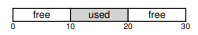
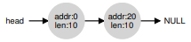
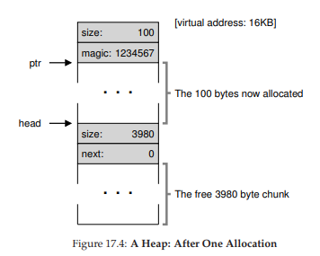
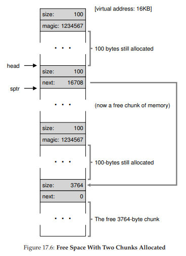
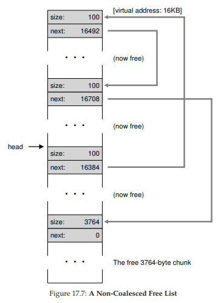
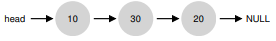
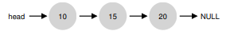

# 17 Quản lý vùng trống (Free-Space Management)

Trong chương này, chúng ta sẽ tạm rẽ sang một hướng khác so với chủ đề ảo hóa bộ nhớ (virtualizing memory) để bàn về một khía cạnh nền tảng của bất kỳ hệ thống quản lý bộ nhớ nào, dù đó là thư viện `malloc` (quản lý các page của heap của một process – tiến trình) hay chính hệ điều hành (OS – Operating System) quản lý các phần của không gian địa chỉ (address space) của một process. Cụ thể, chúng ta sẽ thảo luận về các vấn đề xoay quanh **free-space management** (quản lý vùng trống).

Hãy làm rõ vấn đề hơn. Việc quản lý vùng trống có thể rất dễ dàng, như chúng ta sẽ thấy khi bàn về khái niệm **paging** (phân trang). Nó dễ khi vùng nhớ bạn quản lý được chia thành các đơn vị có kích thước cố định; trong trường hợp đó, bạn chỉ cần giữ một danh sách các đơn vị cố định này; khi một client yêu cầu một đơn vị, bạn chỉ việc trả về phần tử đầu tiên.

Quản lý vùng trống trở nên khó khăn (và thú vị) hơn khi vùng trống bạn quản lý bao gồm các đơn vị có kích thước thay đổi; điều này xảy ra trong thư viện cấp phát bộ nhớ ở mức người dùng (user-level memory-allocation library, như `malloc()` và `free()`) và trong OS khi quản lý bộ nhớ vật lý bằng **segmentation** (phân đoạn) để triển khai **virtual memory** (bộ nhớ ảo). Trong cả hai trường hợp, vấn đề được gọi là **external fragmentation** (phân mảnh bên ngoài): vùng trống bị chia nhỏ thành nhiều mảnh có kích thước khác nhau và do đó bị phân mảnh; các yêu cầu cấp phát sau đó có thể thất bại vì không có một vùng liên tục đủ lớn để đáp ứng, mặc dù tổng dung lượng trống vẫn lớn hơn kích thước yêu cầu.



Hình dưới đây minh họa ví dụ về vấn đề này. Trong trường hợp này, tổng vùng trống là 20 byte; tuy nhiên, nó bị phân mảnh thành hai khối, mỗi khối 10 byte. Do đó, một yêu cầu cấp phát 15 byte sẽ thất bại mặc dù tổng dung lượng trống là 20 byte. Và đây chính là vấn đề mà chương này sẽ giải quyết.


> **CRUX: CÁCH QUẢN LÝ VÙNG TRỐNG**
>
> Làm thế nào để quản lý vùng trống khi phải đáp ứng các yêu cầu có kích thước thay đổi? Chiến lược nào có thể được sử dụng để giảm thiểu phân mảnh? Chi phí về thời gian và bộ nhớ của các phương pháp thay thế là gì?


## 17.1 Các giả định (Assumptions)

Phần lớn nội dung thảo luận sẽ tập trung vào lịch sử phong phú của các **allocator** (bộ cấp phát) trong thư viện cấp phát bộ nhớ ở mức người dùng. Chúng tôi tham khảo khảo sát xuất sắc của Wilson [W+95] và khuyến khích bạn đọc quan tâm tìm đọc tài liệu gốc để biết thêm chi tiết^[1].

Chúng ta giả định một giao diện cơ bản như `malloc()` và `free()`. Cụ thể, `void *malloc(size_t size)` nhận một tham số duy nhất `size`, là số byte mà ứng dụng yêu cầu; hàm này trả về một con trỏ (pointer) không có kiểu cụ thể, hay còn gọi là **void pointer** trong ngôn ngữ C, trỏ tới một vùng nhớ có kích thước bằng hoặc lớn hơn giá trị yêu cầu. Hàm bổ sung `void free(void *ptr)` nhận một con trỏ và giải phóng khối bộ nhớ tương ứng. Lưu ý hệ quả của giao diện này: khi người dùng giải phóng vùng nhớ, họ không thông báo cho thư viện biết kích thước của nó; do đó, thư viện phải tự xác định kích thước của khối bộ nhớ khi chỉ được cung cấp con trỏ. Chúng ta sẽ bàn về cách thực hiện điều này ở phần sau của chương.

Vùng nhớ mà thư viện này quản lý được gọi là **heap**, và cấu trúc dữ liệu tổng quát dùng để quản lý vùng trống trong heap là một dạng **free list** (danh sách vùng trống). Cấu trúc này chứa các tham chiếu tới tất cả các khối vùng trống trong vùng nhớ được quản lý. Tất nhiên, cấu trúc dữ liệu này không nhất thiết phải là danh sách tuyến tính, mà có thể là bất kỳ cấu trúc nào giúp theo dõi vùng trống.

Chúng ta cũng giả định rằng mối quan tâm chính là **external fragmentation** như đã mô tả ở trên. Các allocator cũng có thể gặp vấn đề **internal fragmentation** (phân mảnh bên trong); nếu một allocator cấp phát khối bộ nhớ lớn hơn yêu cầu, phần dư thừa (không được yêu cầu và không sử dụng) trong khối đó được xem là internal fragmentation (vì lãng phí xảy ra bên trong đơn vị đã cấp phát) và cũng là một dạng lãng phí bộ nhớ. Tuy nhiên, để đơn giản và vì external fragmentation thú vị hơn, chúng ta sẽ tập trung chủ yếu vào external fragmentation.

Chúng ta cũng giả định rằng một khi bộ nhớ đã được cấp phát cho client, nó không thể được di chuyển sang vị trí khác trong bộ nhớ. Ví dụ, nếu một chương trình gọi `malloc()` và nhận được một con trỏ tới một vùng trong heap, vùng nhớ đó về cơ bản được “sở hữu” bởi chương trình (và không thể bị thư viện di chuyển) cho đến khi chương trình trả lại nó thông qua lời gọi `free()` tương ứng. Do đó, không thể thực hiện **compaction** (gom khối) vùng trống, mặc dù đây là một kỹ thuật hữu ích để chống phân mảnh^[2]. Tuy nhiên, compaction có thể được OS sử dụng để xử lý phân mảnh khi triển khai segmentation (như đã bàn trong chương về segmentation).

^[1]: Tài liệu này dài gần 80 trang; bạn thực sự phải rất quan tâm mới đọc hết!  
^[2]: Khi bạn đưa một con trỏ tới một khối bộ nhớ cho chương trình C, thường rất khó để xác định tất cả các tham chiếu (pointer) tới vùng đó, vì chúng có thể được lưu trong các biến khác hoặc thậm chí trong thanh ghi tại một thời điểm thực thi. Điều này có thể không đúng với các ngôn ngữ có kiểu mạnh và thu gom rác (garbage-collected), vốn cho phép compaction như một kỹ thuật chống phân mảnh.

Cuối cùng, chúng ta giả định rằng allocator quản lý một vùng byte liên tục. Trong một số trường hợp, allocator có thể yêu cầu mở rộng vùng này; ví dụ, thư viện cấp phát bộ nhớ ở mức người dùng có thể gọi vào kernel để mở rộng heap (thông qua system call như `sbrk`) khi hết chỗ. Tuy nhiên, để đơn giản, chúng ta giả định rằng vùng này có kích thước cố định trong suốt vòng đời của nó.


## 17.2 Các cơ chế mức thấp (Low-level Mechanisms)

Trước khi đi sâu vào một số chi tiết về **policy** (chính sách cấp phát), trước hết chúng ta sẽ tìm hiểu một số cơ chế phổ biến được sử dụng trong hầu hết các **allocator** (bộ cấp phát). Đầu tiên, chúng ta sẽ thảo luận về các nguyên tắc cơ bản của **splitting** (chia nhỏ) và **coalescing** (gộp khối), những kỹ thuật thường gặp trong hầu hết các allocator. Tiếp theo, chúng ta sẽ xem cách theo dõi kích thước của các vùng đã cấp phát một cách nhanh chóng và tương đối dễ dàng. Cuối cùng, chúng ta sẽ bàn về cách xây dựng một danh sách đơn giản bên trong vùng trống để theo dõi phần nào đang trống và phần nào đã được sử dụng.


### Splitting và Coalescing

Một **free list** (danh sách vùng trống) chứa tập hợp các phần tử mô tả vùng trống còn lại trong **heap**. Giả sử chúng ta có một heap 30 byte như sau:


Free list cho heap này sẽ có hai phần tử. Một phần tử mô tả đoạn trống 10 byte đầu tiên (byte 0–9), và một phần tử mô tả đoạn trống còn lại (byte 20–29):



Như đã mô tả ở trên, một yêu cầu cấp phát lớn hơn 10 byte sẽ thất bại (trả về `NULL`), vì không có một khối bộ nhớ liên tục nào đủ lớn để đáp ứng. Một yêu cầu đúng bằng 10 byte có thể được đáp ứng dễ dàng bởi một trong hai khối trống. Nhưng điều gì xảy ra nếu yêu cầu nhỏ hơn 10 byte?

Giả sử chúng ta có một yêu cầu chỉ lấy 1 byte bộ nhớ. Trong trường hợp này, allocator sẽ thực hiện một thao tác gọi là **splitting**: nó sẽ tìm một khối trống đủ lớn để đáp ứng yêu cầu và chia nó thành hai phần. Phần thứ nhất sẽ được trả về cho người gọi; phần thứ hai sẽ vẫn nằm trong free list. Trong ví dụ trên, nếu yêu cầu 1 byte được đưa ra và allocator quyết định sử dụng phần tử thứ hai trong danh sách để đáp ứng yêu cầu, lời gọi `malloc()` sẽ trả về địa chỉ 20 (địa chỉ của vùng 1 byte được cấp phát) và danh sách sẽ trở thành:


Trong hình minh họa, bạn có thể thấy danh sách về cơ bản vẫn giữ nguyên; thay đổi duy nhất là vùng trống giờ bắt đầu tại byte 21 thay vì 20, và độ dài vùng trống này chỉ còn 9 byte^[3]. Do đó, splitting thường được sử dụng trong allocator khi yêu cầu nhỏ hơn kích thước của bất kỳ khối trống nào.

Một cơ chế bổ sung thường thấy trong nhiều allocator là **coalescing** vùng trống. Lấy lại ví dụ ở trên (trống 10 byte, dùng 10 byte, trống 10 byte).

Với heap nhỏ này, điều gì xảy ra khi một ứng dụng gọi `free(10)`, trả lại vùng ở giữa heap? Nếu chúng ta chỉ đơn giản thêm vùng trống này vào danh sách mà không xử lý gì thêm, chúng ta có thể nhận được danh sách như sau:


Hãy chú ý vấn đề: mặc dù toàn bộ heap giờ đã trống, nó lại bị chia thành ba khối 10 byte. Do đó, nếu người dùng yêu cầu 20 byte, việc duyệt danh sách sẽ không tìm thấy khối trống đủ lớn và sẽ trả về lỗi.

Để tránh vấn đề này, allocator sẽ **coalesce** vùng trống khi một khối bộ nhớ được giải phóng. Ý tưởng rất đơn giản: khi trả lại một khối trống, hãy kiểm tra kỹ địa chỉ của khối này và các khối trống lân cận; nếu vùng vừa được giải phóng nằm ngay cạnh một (hoặc hai, như trong ví dụ này) khối trống hiện có, hãy gộp chúng thành một khối trống lớn hơn. Với coalescing, danh sách cuối cùng sẽ như sau:


Thực tế, đây chính là trạng thái ban đầu của heap trước khi có bất kỳ cấp phát nào. Nhờ coalescing, allocator có thể đảm bảo tốt hơn rằng các khối trống lớn sẽ sẵn sàng cho ứng dụng.

^[3]: Phần thảo luận này giả định không có **header** (phần tiêu đề lưu thông tin quản lý), đây là giả định không thực tế nhưng giúp đơn giản hóa vấn đề.


### Theo dõi kích thước vùng đã cấp phát (Tracking The Size Of Allocated Regions)

Bạn có thể nhận thấy rằng giao diện `free(void *ptr)` không nhận tham số kích thước; do đó, giả định rằng khi có một con trỏ, thư viện `malloc` có thể nhanh chóng xác định kích thước của vùng bộ nhớ được giải phóng và đưa vùng này trở lại free list.

Để thực hiện điều này, hầu hết các allocator lưu một lượng nhỏ thông tin bổ sung trong một **header block** (khối tiêu đề) được giữ trong bộ nhớ, thường nằm ngay trước khối bộ nhớ được cấp phát cho người dùng. Hãy xem một ví dụ (Hình 17.1). Trong ví dụ này, chúng ta đang xét một khối đã cấp phát có kích thước 20 byte, được trỏ bởi `ptr`; giả sử người dùng gọi `malloc()` và lưu kết quả vào `ptr`, ví dụ:  
`ptr = malloc(20);`


**Hình 17.1:** Một vùng đã cấp phát kèm header  

Header tối thiểu sẽ chứa kích thước của vùng đã cấp phát (trong trường hợp này là 20); nó cũng có thể chứa các con trỏ bổ sung để tăng tốc giải phóng, một **magic number** (số đặc biệt) để kiểm tra tính toàn vẹn dữ liệu, và các thông tin khác. Giả sử một header đơn giản chỉ chứa kích thước vùng và magic number, như sau:

```c
typedef struct {
  int size;
  int magic;
} header_t;
```


**Hình 17.2:** Nội dung cụ thể của header  

Ví dụ trên sẽ trông giống như trong Hình 17.2. Khi người dùng gọi `free(ptr)`, thư viện sẽ dùng phép toán con trỏ đơn giản để xác định vị trí bắt đầu của header:

```c
void free(void *ptr) {
  header_t *hptr = (header_t *) ptr - 1;
  ...
}
```

Sau khi có con trỏ tới header, thư viện có thể dễ dàng kiểm tra xem magic number có khớp với giá trị mong đợi hay không như một bước kiểm tra hợp lệ (`assert(hptr->magic == 1234567)`), và tính toán tổng kích thước của vùng vừa được giải phóng bằng phép cộng đơn giản (tức là cộng kích thước của header với kích thước vùng dữ liệu của người dùng). Lưu ý một chi tiết nhỏ nhưng quan trọng: kích thước của vùng trống là kích thước của header cộng với kích thước vùng được cấp phát cho người dùng. Do đó, khi người dùng yêu cầu N byte bộ nhớ, thư viện không tìm kiếm một khối trống có kích thước N, mà tìm một khối trống có kích thước **N + kích thước header**.

### Nhúng một Free List (Embedding A Free List)

Cho đến giờ, chúng ta mới chỉ xem **free list** (danh sách vùng trống) đơn giản của mình như một thực thể khái niệm; nó chỉ là một danh sách mô tả các khối bộ nhớ trống trong **heap**. Nhưng làm thế nào để xây dựng danh sách này **ngay bên trong** chính vùng trống đó?

Trong một danh sách thông thường, khi cần cấp phát một **node** mới, bạn chỉ việc gọi `malloc()` để lấy bộ nhớ cho node đó. Thật không may, bên trong thư viện cấp phát bộ nhớ (**memory-allocation library**), bạn **không thể** làm như vậy! Thay vào đó, bạn cần xây dựng danh sách **ngay bên trong** vùng trống. Đừng lo nếu điều này nghe có vẻ hơi kỳ lạ; đúng là hơi khác thường, nhưng hoàn toàn có thể thực hiện được.

Giả sử chúng ta có một khối bộ nhớ 4096 byte để quản lý (tức heap là 4KB). Để quản lý nó như một free list, trước tiên chúng ta phải khởi tạo danh sách; ban đầu, danh sách sẽ chỉ có **một phần tử**, kích thước 4096 byte (trừ đi kích thước header). Đây là mô tả của một node trong danh sách:

```c
typedef struct __node_t {
  int size;
  struct __node_t *next;
} node_t;
```

Bây giờ, hãy xem một đoạn code khởi tạo heap và đặt phần tử đầu tiên của free list vào chính vùng trống đó. Chúng ta giả định rằng heap được xây dựng từ một vùng trống lấy được thông qua lời gọi **system call** `mmap()`; đây không phải là cách duy nhất để tạo heap, nhưng phù hợp cho ví dụ này. Đoạn code như sau:

```c
// mmap() trả về một con trỏ tới một vùng trống
node_t *head = mmap(NULL, 4096, PROT_READ|PROT_WRITE,
                    MAP_ANON|MAP_PRIVATE, -1, 0);
head->size = 4096 - sizeof(node_t);
head->next = NULL;
```


**Hình 17.3:** Một heap với một khối trống duy nhất  

Sau khi chạy đoạn code này, trạng thái danh sách là: nó có một phần tử duy nhất, kích thước 4088 byte. Đúng, đây là một heap rất nhỏ, nhưng đủ để minh họa. Con trỏ `head` chứa địa chỉ bắt đầu của vùng này; giả sử nó là 16KB (mặc dù bất kỳ địa chỉ ảo nào cũng được). Trực quan, heap trông giống như trong **Hình 17.3**.


**Hình 17.4:** Heap sau một lần cấp phát  


Bây giờ, giả sử có một yêu cầu cấp phát bộ nhớ, ví dụ 100 byte. Để xử lý yêu cầu này, thư viện sẽ tìm một khối trống đủ lớn; vì chỉ có một khối trống (kích thước 4088 byte), khối này sẽ được chọn. Sau đó, khối này sẽ được **chia** thành hai: một khối đủ lớn để đáp ứng yêu cầu (cộng với header, như đã mô tả ở trên) và phần còn lại là khối trống. Giả sử header dài 8 byte (gồm một số nguyên `size` và một số nguyên `magic number`), vùng nhớ trong heap lúc này sẽ giống như trong **Hình 17.4**.


**Hình 17.5:** Vùng trống khi đã cấp phát ba khối  

Như vậy, với yêu cầu 100 byte, thư viện đã cấp phát 108 byte từ khối trống duy nhất, trả về một con trỏ (được đánh dấu `ptr` trong hình) tới vùng này, lưu thông tin header ngay trước vùng cấp phát để dùng khi `free()`, và thu nhỏ node trống duy nhất trong danh sách xuống còn 3980 byte (4088 trừ 108).

Bây giờ, hãy xem heap khi có **ba vùng đã cấp phát**, mỗi vùng 100 byte (hoặc 108 byte nếu tính cả header). Hình minh họa heap này được thể hiện trong **Hình 17.5**.



**Hình 17.6:** Vùng trống khi còn hai khối đã cấp phát  

Như bạn thấy, 324 byte đầu tiên của heap hiện đã được cấp phát, và ta thấy ba header trong vùng này cùng ba vùng 100 byte đang được chương trình sử dụng. Free list vẫn đơn giản: chỉ một node (được `head` trỏ tới), nhưng giờ chỉ còn 3764 byte sau ba lần chia. Nhưng điều gì xảy ra khi chương trình trả lại một phần bộ nhớ qua `free()`?

Trong ví dụ này, ứng dụng trả lại **khối ở giữa** bằng cách gọi `free(16500)` (giá trị 16500 có được bằng cách cộng địa chỉ bắt đầu vùng nhớ 16384 với 108 byte của khối trước đó và 8 byte header của khối này). Giá trị này được thể hiện trong hình trước bởi con trỏ `sptr`.


**Hình 17.7:** Free list không được coalescing  


Thư viện ngay lập tức xác định kích thước vùng trống, rồi thêm khối này vào free list. Giả sử chúng ta chèn vào đầu free list, vùng nhớ lúc này sẽ giống như trong **Hình 17.6**.

Bây giờ, chúng ta có một danh sách bắt đầu bằng một khối trống nhỏ (100 byte, được `head` trỏ tới) và một khối trống lớn (3764 byte). Cuối cùng, danh sách của chúng ta đã có hơn một phần tử! Và đúng vậy, vùng trống đã bị **phân mảnh** — một hiện tượng không mong muốn nhưng thường gặp.


Ví dụ cuối cùng: giả sử bây giờ hai khối đang sử dụng còn lại được giải phóng. **Nếu không coalescing**, bạn sẽ gặp phân mảnh (Hình 17.7). Như bạn thấy, chúng ta có một “mớ hỗn độn”! Tại sao? Đơn giản là vì chúng ta quên gộp danh sách. Mặc dù toàn bộ bộ nhớ đang trống, nó bị chia nhỏ thành nhiều mảnh, khiến nó **trông như** bị phân mảnh dù thực tế không phải. Giải pháp rất đơn giản: duyệt qua danh sách và gộp các khối liền kề; khi hoàn tất, heap sẽ trở lại nguyên vẹn.

### Mở rộng Heap (Growing The Heap)

Chúng ta nên thảo luận về một cơ chế cuối cùng thường xuất hiện trong nhiều thư viện cấp phát bộ nhớ. Cụ thể, bạn sẽ làm gì nếu **heap** (vùng nhớ động) hết chỗ? Cách tiếp cận đơn giản nhất là… thất bại. Trong một số trường hợp, đây là lựa chọn duy nhất, và việc trả về `NULL` là một cách xử lý “đường đường chính chính”. Đừng cảm thấy tệ! Bạn đã cố gắng, và dù thất bại, bạn vẫn đã “chiến đấu” hết mình.

Hầu hết các **allocator** (bộ cấp phát) truyền thống bắt đầu với một heap có kích thước nhỏ, sau đó yêu cầu thêm bộ nhớ từ **OS** (hệ điều hành) khi hết chỗ. Thông thường, điều này có nghĩa là chúng sẽ thực hiện một lời gọi **system call** (lời gọi hệ thống) nào đó (ví dụ: `sbrk` trong hầu hết các hệ thống UNIX) để mở rộng heap, rồi cấp phát các khối mới từ đó. Để xử lý yêu cầu `sbrk`, OS sẽ tìm các **physical page** (trang bộ nhớ vật lý) còn trống, ánh xạ chúng vào **address space** (không gian địa chỉ) của **process** (tiến trình) yêu cầu, rồi trả về giá trị địa chỉ kết thúc của heap mới; tại thời điểm đó, một heap lớn hơn đã sẵn sàng, và yêu cầu cấp phát có thể được xử lý thành công.


## 17.3 Các chiến lược cơ bản (Basic Strategies)

Bây giờ khi chúng ta đã có một số cơ chế nền tảng, hãy cùng xem qua một số chiến lược cơ bản để quản lý vùng trống. Các cách tiếp cận này chủ yếu dựa trên những **policy** (chính sách) khá đơn giản mà chính bạn cũng có thể nghĩ ra; hãy thử suy nghĩ trước khi đọc tiếp để xem bạn có thể tìm ra tất cả các phương án (hoặc thậm chí những phương án mới) hay không.

Một allocator lý tưởng vừa phải nhanh, vừa phải giảm thiểu phân mảnh (**fragmentation**). Thật không may, vì luồng yêu cầu cấp phát và giải phóng có thể tùy ý (do lập trình viên quyết định), bất kỳ chiến lược nào cũng có thể hoạt động rất tệ nếu gặp bộ dữ liệu đầu vào “khó chịu”. Do đó, chúng ta sẽ không mô tả một phương pháp “tốt nhất”, mà chỉ bàn về một số phương pháp cơ bản, cùng ưu và nhược điểm của chúng.


### Best Fit

Chiến lược **best fit** khá đơn giản: trước tiên, duyệt qua **free list** (danh sách vùng trống) và tìm các khối bộ nhớ trống có kích thước **bằng hoặc lớn hơn** kích thước yêu cầu. Sau đó, trả về khối **nhỏ nhất** trong nhóm ứng viên này; đây chính là khối “best-fit” (có thể gọi là “smallest fit” – vừa khít nhất). Chỉ cần một lần duyệt qua free list là đủ để tìm khối phù hợp.

Trực giác đằng sau best fit rất rõ ràng: bằng cách trả về một khối gần với kích thước mà người dùng yêu cầu, best fit cố gắng giảm thiểu lãng phí bộ nhớ. Tuy nhiên, cái giá phải trả là hiệu năng; các triển khai đơn giản sẽ chịu chi phí tìm kiếm rất lớn khi phải duyệt toàn bộ danh sách để tìm khối phù hợp.


### Worst Fit

Chiến lược **worst fit** là đối lập với best fit: tìm khối lớn nhất và cấp phát phần bộ nhớ được yêu cầu; phần còn lại (vẫn là một khối lớn) được giữ lại trong free list. Worst fit cố gắng để lại các khối lớn thay vì tạo ra nhiều khối nhỏ như có thể xảy ra với best fit. Tuy nhiên, một lần nữa, phương pháp này yêu cầu duyệt toàn bộ vùng trống, và do đó có thể tốn kém. Tệ hơn, hầu hết các nghiên cứu cho thấy nó hoạt động kém, dẫn đến phân mảnh nhiều hơn trong khi vẫn có chi phí cao.


### First Fit

Phương pháp **first fit** chỉ đơn giản là tìm khối đầu tiên đủ lớn và cấp phát phần bộ nhớ được yêu cầu cho người dùng. Phần còn lại của khối vẫn được giữ lại để phục vụ các yêu cầu sau.

First fit có ưu điểm là nhanh — không cần duyệt toàn bộ danh sách vùng trống — nhưng đôi khi làm “ô nhiễm” phần đầu của free list với các khối nhỏ. Do đó, cách mà allocator quản lý thứ tự của free list trở thành một vấn đề. Một cách tiếp cận là sử dụng **address-based ordering** (sắp xếp theo địa chỉ); bằng cách giữ danh sách được sắp xếp theo địa chỉ của vùng trống, việc coalescing trở nên dễ dàng hơn và phân mảnh có xu hướng giảm.


### Next Fit

Thay vì luôn bắt đầu tìm kiếm theo kiểu first fit từ đầu danh sách, thuật toán **next fit** giữ thêm một con trỏ tới vị trí trong danh sách mà lần tìm kiếm trước đã dừng lại. Ý tưởng là phân tán việc tìm kiếm vùng trống đều hơn trên toàn bộ danh sách, tránh việc “băm nhỏ” phần đầu danh sách. Hiệu năng của phương pháp này khá giống với first fit, vì vẫn tránh được việc duyệt toàn bộ danh sách.


### Ví dụ

Dưới đây là một vài ví dụ về các chiến lược trên. Hãy hình dung một free list có ba phần tử, kích thước lần lượt là 10, 30 và 20 (chúng ta sẽ bỏ qua header và các chi tiết khác, chỉ tập trung vào cách các chiến lược hoạt động):



Giả sử có một yêu cầu cấp phát kích thước 15. Cách tiếp cận **best fit** sẽ duyệt toàn bộ danh sách và tìm ra rằng khối 20 là phù hợp nhất, vì nó là khối nhỏ nhất có thể chứa yêu cầu. Free list sau đó sẽ là:


Như trong ví dụ này, và thường xảy ra với best fit, một khối trống nhỏ sẽ bị bỏ lại. Cách tiếp cận **worst fit** tương tự nhưng thay vào đó tìm khối lớn nhất, trong ví dụ này là khối 30. Free list sau đó sẽ là:



Chiến lược **first fit** trong ví dụ này làm điều tương tự như worst fit, cũng tìm khối trống đầu tiên có thể đáp ứng yêu cầu. Sự khác biệt nằm ở chi phí tìm kiếm; cả best fit và worst fit đều duyệt toàn bộ danh sách, trong khi first fit chỉ kiểm tra các khối trống cho đến khi tìm được khối phù hợp, do đó giảm chi phí tìm kiếm.

Những ví dụ này chỉ mới “lướt qua bề mặt” của các chính sách cấp phát. Để hiểu sâu hơn, cần có phân tích chi tiết hơn với các tải công việc thực tế và hành vi allocator phức tạp hơn (ví dụ: coalescing). Có lẽ đây sẽ là một bài tập thú vị cho phần bài tập về nhà?


## 17.4 Các cách tiếp cận khác (Other Approaches)

Ngoài các phương pháp cơ bản đã mô tả ở trên, đã có rất nhiều kỹ thuật và thuật toán được đề xuất nhằm cải thiện việc cấp phát bộ nhớ theo nhiều cách khác nhau. Dưới đây là một số ví dụ để bạn tham khảo (tức là để bạn suy nghĩ nhiều hơn một chút ngoài phương pháp **best-fit allocation**).


### Segregated Lists (Danh sách phân tách)

Một cách tiếp cận thú vị đã tồn tại từ lâu là sử dụng **segregated lists** (danh sách phân tách). Ý tưởng cơ bản rất đơn giản: nếu một ứng dụng cụ thể thường xuyên có một (hoặc một vài) yêu cầu cấp phát với kích thước phổ biến, hãy giữ một danh sách riêng chỉ để quản lý các đối tượng có kích thước đó; tất cả các yêu cầu khác sẽ được chuyển đến một **memory allocator** (bộ cấp phát bộ nhớ) tổng quát hơn.

Lợi ích của cách tiếp cận này là rõ ràng. Bằng cách dành riêng một phần bộ nhớ cho một kích thước yêu cầu cụ thể, vấn đề **fragmentation** (phân mảnh) sẽ ít đáng lo ngại hơn; hơn nữa, các yêu cầu cấp phát và giải phóng có kích thước phù hợp có thể được xử lý rất nhanh, vì không cần tìm kiếm phức tạp trong danh sách.

Giống như bất kỳ ý tưởng hay nào, cách tiếp cận này cũng mang đến những phức tạp mới cho hệ thống. Ví dụ: nên dành bao nhiêu bộ nhớ cho **pool** (bể bộ nhớ) phục vụ các yêu cầu chuyên biệt của một kích thước nhất định, so với pool tổng quát? Một allocator cụ thể, **slab allocator** do kỹ sư xuất sắc Jeff Bonwick thiết kế (dùng trong **Solaris kernel**), xử lý vấn đề này theo một cách rất hay [B94].

Cụ thể, khi kernel khởi động, nó sẽ cấp phát một số **object cache** (bộ đệm đối tượng) cho các đối tượng kernel có khả năng được yêu cầu thường xuyên (như **lock**, **file-system inode**, v.v.); các object cache này chính là các free list phân tách theo kích thước và phục vụ nhanh chóng các yêu cầu cấp phát/giải phóng bộ nhớ. Khi một cache nhất định sắp hết vùng trống, nó sẽ yêu cầu một số **slab** bộ nhớ từ allocator tổng quát hơn (tổng dung lượng yêu cầu là bội số của **page size** và kích thước đối tượng). Ngược lại, khi **reference count** (bộ đếm tham chiếu) của tất cả đối tượng trong một slab về 0, allocator tổng quát có thể thu hồi slab đó từ allocator chuyên biệt — điều này thường được thực hiện khi hệ thống **VM** (virtual memory) cần thêm bộ nhớ.

> **ASIDE: KỸ SƯ GIỎI THỰC SỰ LÀ RẤT GIỎI**  
> Các kỹ sư như Jeff Bonwick (người không chỉ viết slab allocator được nhắc đến ở đây mà còn là trưởng nhóm phát triển hệ thống file tuyệt vời ZFS) chính là trái tim của Silicon Valley. Đằng sau hầu hết các sản phẩm hoặc công nghệ vĩ đại là một con người (hoặc một nhóm nhỏ) vượt trội về tài năng, khả năng và sự tận tâm. Như Mark Zuckerberg (Facebook) từng nói: “Một người xuất sắc trong vai trò của họ không chỉ giỏi hơn một chút so với người khá giỏi. Họ giỏi hơn gấp 100 lần.” Đây là lý do tại sao, ngay cả ngày nay, một hoặc hai người vẫn có thể khởi nghiệp và thay đổi bộ mặt thế giới mãi mãi (hãy nghĩ đến Google, Apple hoặc Facebook). Hãy làm việc chăm chỉ và bạn có thể trở thành một “người 100x” như vậy! Nếu không, hãy tìm cách làm việc cùng họ; bạn sẽ học được nhiều trong một ngày hơn hầu hết mọi người học trong một tháng.

Slab allocator còn vượt xa hầu hết các phương pháp segregated list khác ở chỗ nó giữ các đối tượng trống trong danh sách ở trạng thái **pre-initialized** (đã được khởi tạo sẵn). Bonwick chỉ ra rằng việc khởi tạo và hủy cấu trúc dữ liệu là tốn kém [B94]; bằng cách giữ các đối tượng đã giải phóng trong trạng thái đã khởi tạo, slab allocator tránh được chu kỳ khởi tạo/hủy lặp lại cho mỗi đối tượng và do đó giảm đáng kể chi phí.


### Buddy Allocation (Cấp phát theo cặp “buddy”)

Vì **coalescing** (gộp khối) là rất quan trọng đối với một allocator, một số phương pháp đã được thiết kế xoay quanh việc làm cho coalescing trở nên đơn giản. Một ví dụ điển hình là **binary buddy allocator** [K65].

Trong hệ thống này, bộ nhớ trống ban đầu được coi như một khối lớn có kích thước \( 2^N \). Khi có yêu cầu cấp phát, quá trình tìm kiếm sẽ chia đôi vùng trống một cách đệ quy cho đến khi tìm được một khối đủ lớn để đáp ứng yêu cầu (và nếu chia đôi thêm nữa sẽ tạo ra khối quá nhỏ). Tại thời điểm đó, khối được yêu cầu sẽ được trả về cho người dùng. Ví dụ dưới đây minh họa một vùng trống 64KB được chia nhỏ để tìm khối 7KB (**Hình 17.8**).


**Hình 17.8:** Ví dụ heap được quản lý bằng buddy  

Trong ví dụ, khối 8KB ngoài cùng bên trái được cấp phát (được tô màu xám đậm) và trả về cho người dùng; lưu ý rằng phương pháp này có thể gặp **internal fragmentation** (phân mảnh bên trong), vì chỉ được phép cấp phát các khối có kích thước là lũy thừa của 2.

Điểm hay của buddy allocation nằm ở chỗ khi khối đó được giải phóng. Khi trả lại khối 8KB vào free list, allocator sẽ kiểm tra xem “buddy” 8KB của nó có trống không; nếu có, nó sẽ gộp hai khối thành một khối 16KB. Sau đó, allocator kiểm tra xem buddy của khối 16KB này có trống không; nếu có, lại gộp tiếp thành khối 32KB. Quá trình coalescing đệ quy này tiếp tục lên trên cây, hoặc cho đến khi khôi phục toàn bộ vùng trống, hoặc dừng lại khi gặp một buddy đang được sử dụng.

Lý do buddy allocation hoạt động hiệu quả là vì rất dễ xác định buddy của một khối cụ thể. Làm thế nào? Hãy nghĩ về địa chỉ của các khối trong vùng trống ở trên. Nếu bạn quan sát kỹ, bạn sẽ thấy địa chỉ của mỗi cặp buddy chỉ khác nhau ở **một bit duy nhất**; bit nào khác nhau được xác định bởi cấp (level) trong cây buddy. Và đó là ý tưởng cơ bản của cơ chế binary buddy allocation. Để biết chi tiết hơn, hãy xem khảo sát của Wilson [W+95].


### Các ý tưởng khác (Other Ideas)

Một vấn đề lớn của nhiều phương pháp ở trên là **khả năng mở rộng** (scaling) kém. Cụ thể, việc tìm kiếm trong danh sách có thể rất chậm. Do đó, các allocator tiên tiến sử dụng cấu trúc dữ liệu phức tạp hơn để giảm chi phí này, đánh đổi sự đơn giản lấy hiệu năng. Ví dụ: **balanced binary tree**, **splay tree**, hoặc **partially-ordered tree** [W+95].

Vì các hệ thống hiện đại thường có nhiều bộ xử lý và chạy các tải công việc đa luồng (**multi-threaded workloads**, bạn sẽ học chi tiết trong phần về **Concurrency**), không có gì ngạc nhiên khi nhiều nỗ lực đã được dành để làm cho allocator hoạt động tốt trên hệ thống đa bộ xử lý. Hai ví dụ tiêu biểu là nghiên cứu của Berger et al. [B+00] và Evans [E06]; hãy tìm đọc để biết chi tiết.

Đây chỉ là hai trong số hàng ngàn ý tưởng mà con người đã nghĩ ra về memory allocator; nếu tò mò, bạn hãy tự tìm hiểu thêm. Nếu không, hãy đọc về cách hoạt động của **glibc allocator** [S15] để có cái nhìn thực tế hơn.


## 17.5 Tóm tắt (Summary)

Trong chương này, chúng ta đã thảo luận về những dạng cơ bản nhất của **memory allocator** (bộ cấp phát bộ nhớ). Các allocator như vậy tồn tại ở khắp nơi: được liên kết vào mọi chương trình C bạn viết, cũng như trong OS nền tảng đang quản lý bộ nhớ cho các cấu trúc dữ liệu của chính nó. Giống như nhiều hệ thống khác, có rất nhiều sự đánh đổi khi xây dựng một hệ thống như vậy, và càng biết rõ về **workload** (tải công việc) mà allocator phải xử lý, bạn càng có thể tinh chỉnh nó để hoạt động tốt hơn.