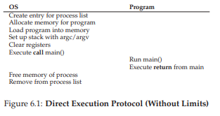

# 6. Cơ chế: Limited Direct Execution (Thực thi trực tiếp có giới hạn)

Để **virtualize** (ảo hóa) CPU, hệ điều hành (Operating System – OS) cần phải tìm cách chia sẻ CPU vật lý cho nhiều công việc (job) chạy dường như đồng thời. Ý tưởng cơ bản rất đơn giản: chạy một **process** (tiến trình) trong một khoảng thời gian ngắn, sau đó chuyển sang chạy một process khác, và cứ thế tiếp tục. Bằng cách chia sẻ thời gian (**time sharing**) của CPU theo cách này, việc ảo hóa được thực hiện.

Tuy nhiên, việc xây dựng cơ chế ảo hóa như vậy gặp một số thách thức. Thứ nhất là **hiệu năng**: làm thế nào để triển khai ảo hóa mà không tạo ra quá nhiều **overhead** (chi phí xử lý bổ sung) cho hệ thống? Thứ hai là **kiểm soát**: làm thế nào để chạy các process một cách hiệu quả mà vẫn giữ quyền kiểm soát CPU? Kiểm soát đặc biệt quan trọng đối với OS, vì OS chịu trách nhiệm quản lý tài nguyên; nếu không có kiểm soát, một process có thể chạy mãi mãi và chiếm toàn bộ máy, hoặc truy cập thông tin mà nó không được phép. Do đó, đạt được hiệu năng cao đồng thời duy trì khả năng kiểm soát là một trong những thách thức trung tâm khi xây dựng hệ điều hành.

>> **Cốt lõi: Làm thế nào để ảo hóa CPU một cách hiệu quả mà vẫn giữ quyền kiểm soát**  
>> 
>> OS phải ảo hóa CPU theo cách hiệu quả đồng thời duy trì quyền kiểm soát hệ thống. Để làm được điều này, cần có sự hỗ trợ từ cả phần cứng và hệ điều hành. OS thường tận dụng một số hỗ trợ phần cứng hợp lý để thực hiện công việc hiệu quả.

## 6.1 Kỹ thuật cơ bản: Limited Direct Execution

Để một chương trình chạy nhanh như mong đợi, các nhà phát triển OS đã đưa ra một kỹ thuật gọi là **limited direct execution** (thực thi trực tiếp có giới hạn). Phần “direct execution” (thực thi trực tiếp) của ý tưởng này rất đơn giản: chỉ cần chạy chương trình trực tiếp trên CPU.  

Khi OS muốn bắt đầu chạy một chương trình, nó sẽ:

1. Tạo một mục **process entry** trong **process list** (danh sách tiến trình).
2. Cấp phát một vùng bộ nhớ cho process.
3. Nạp mã chương trình vào bộ nhớ (từ đĩa).
4. Xác định **entry point** (điểm bắt đầu, ví dụ hàm `main()`).
5. Nhảy tới entry point và bắt đầu chạy mã của người dùng.



Hình 6.1 minh họa giao thức thực thi trực tiếp cơ bản này (chưa có giới hạn), sử dụng lời gọi hàm (call) và trả về (return) thông thường để nhảy vào `main()` của chương trình và sau đó quay lại **kernel**.

Nghe có vẻ đơn giản, đúng không? Nhưng cách tiếp cận này nảy sinh một số vấn đề trong mục tiêu ảo hóa CPU:

1. Nếu chỉ chạy chương trình, làm thế nào OS đảm bảo chương trình không làm những việc trái phép, mà vẫn chạy hiệu quả?
2. Khi đang chạy một process, làm thế nào OS dừng nó và chuyển sang process khác, để thực hiện **time sharing** cần thiết cho việc ảo hóa CPU?

Khi trả lời những câu hỏi này, chúng ta sẽ hiểu rõ hơn những gì cần thiết để ảo hóa CPU. Đồng thời, ta sẽ thấy vì sao có chữ “limited” (giới hạn) trong tên kỹ thuật này; nếu không giới hạn chương trình, OS sẽ không kiểm soát được gì và sẽ chỉ là “một thư viện” — một tình trạng đáng buồn cho một hệ điều hành đang hình thành.

## 6.2 Vấn đề #1: Restricted Operations (Các thao tác bị hạn chế)

**Direct execution** có ưu điểm rõ ràng là nhanh; chương trình chạy trực tiếp trên CPU phần cứng nên tốc độ đạt như mong đợi. Nhưng chạy trực tiếp trên CPU lại dẫn đến vấn đề: nếu process muốn thực hiện một thao tác bị hạn chế, ví dụ:

- Gửi yêu cầu I/O tới đĩa.
- Truy cập thêm tài nguyên hệ thống như CPU hoặc bộ nhớ.

> **Cốt lõi: Làm thế nào để thực hiện các thao tác bị hạn chế**  
> Một process cần có khả năng thực hiện I/O và một số thao tác bị hạn chế khác, nhưng không được trao toàn quyền kiểm soát hệ thống. Làm thế nào để OS và phần cứng phối hợp để đạt được điều này?

>> **Ghi chú:** *Vì sao system call trông giống như procedure call?*
>> 
>> Bạn có thể thắc mắc tại sao lời gọi tới một **system call** (lời gọi hệ thống), như `open()` hoặc `read()`, lại trông giống hệt một lời gọi hàm thông thường trong C. Nếu giống hệt procedure call, làm sao hệ thống biết đó là system call và xử lý đúng?  
>> 
>> Lý do đơn giản: nó thực sự là một procedure call, nhưng bên trong có chứa **trap instruction** (lệnh bẫy). Cụ thể:
>> 
>> - Khi bạn gọi `open()`, bạn đang gọi một hàm trong thư viện C.
>> - Thư viện này (dù là `open()` hay system call khác) tuân theo **calling convention** (quy ước gọi hàm) đã thống nhất với kernel: đặt các tham số vào vị trí đã biết (ví dụ: trên stack hoặc trong thanh ghi), đặt số hiệu system call vào vị trí đã biết, rồi thực thi lệnh trap.
>> - Mã trong thư viện sau lệnh trap sẽ giải nén giá trị trả về và trả quyền điều khiển lại cho chương trình gọi.
>> 
>> Phần mã của thư viện C thực hiện system call thường được viết bằng assembly, vì cần tuân thủ chặt chẽ quy ước để xử lý tham số và giá trị trả về chính xác, cũng như thực thi lệnh trap đặc thù của phần cứng. Nhờ vậy, lập trình viên ứng dụng không cần tự viết assembly để trap vào OS — đã có người viết sẵn cho bạn.

Một cách tiếp cận đơn giản là cho phép bất kỳ process nào thực hiện mọi thao tác I/O hoặc liên quan. Tuy nhiên, điều này sẽ phá vỡ nhiều loại hệ thống mong muốn. Ví dụ: nếu muốn xây dựng một **file system** (hệ thống tệp) kiểm tra quyền truy cập trước khi cho phép mở tệp, ta không thể để process người dùng gửi trực tiếp I/O tới đĩa; nếu làm vậy, process có thể đọc/ghi toàn bộ đĩa và mọi cơ chế bảo vệ sẽ mất tác dụng.

Vì vậy, ta giới thiệu một chế độ xử lý mới của CPU gọi là **user mode** (chế độ người dùng). Mã chạy trong user mode bị hạn chế khả năng:

- Không thể gửi yêu cầu I/O trực tiếp; nếu làm, CPU sẽ phát sinh **exception** (ngoại lệ) và OS có thể sẽ hủy process.

Ngược lại, **kernel mode** (chế độ nhân) là chế độ mà OS (kernel) chạy. Trong kernel mode, mã có thể thực hiện mọi thao tác, bao gồm các lệnh đặc quyền như I/O và các lệnh bị hạn chế khác.

Vấn đề còn lại: khi một process ở user mode muốn thực hiện thao tác đặc quyền (ví dụ đọc từ đĩa), nó phải làm thế nào?  
Hầu hết phần cứng hiện đại cho phép chương trình ở user mode thực hiện **system call**. Cơ chế này xuất hiện từ các máy tính cổ như Atlas, cho phép kernel cung cấp một số chức năng quan trọng cho chương trình người dùng, như:

- Truy cập file system.
- Tạo/hủy process.
- Giao tiếp giữa các process.
- Cấp phát thêm bộ nhớ.

Hầu hết OS hiện đại cung cấp vài trăm system call (xem chuẩn POSIX để biết chi tiết); các hệ Unix ban đầu chỉ có khoảng 20 system call.


> **Mẹo: Sử dụng Protected Control Transfer (chuyển điều khiển được bảo vệ)** 
> 
> Phần cứng hỗ trợ OS bằng cách cung cấp các chế độ thực thi khác nhau:
>
> - Trong user mode, ứng dụng không có toàn quyền truy cập tài nguyên phần cứng.
> - Trong kernel mode, OS có toàn quyền truy cập.
>
> Phần cứng cũng cung cấp:
>
> - Lệnh đặc biệt để trap vào kernel và lệnh return-from-trap để quay lại user mode.
> - Lệnh cho phép OS chỉ định vị trí **trap table** (bảng bẫy) trong bộ nhớ.


Để thực hiện một system call, chương trình phải thực thi lệnh trap đặc biệt. Lệnh này đồng thời:
1. Nhảy vào kernel.
2. Nâng mức đặc quyền lên kernel mode.

Khi ở kernel, hệ thống có thể thực hiện các thao tác đặc quyền cần thiết (nếu được phép) để phục vụ process gọi. Khi hoàn tất, OS thực thi lệnh **return-from-trap**, vừa trả quyền điều khiển cho chương trình người dùng, vừa hạ mức đặc quyền trở lại user mode.

Phần cứng cần cẩn trọng khi thực thi một **trap** (cơ chế bẫy), vì nó phải đảm bảo lưu đủ các thanh ghi (**register**) của tiến trình gọi để có thể khôi phục chính xác khi OS thực hiện lệnh **return-from-trap** (trả về từ trap).  

Ví dụ, trên kiến trúc **x86**, bộ xử lý sẽ **push** (đẩy) **program counter** (bộ đếm lệnh), **flags** (các cờ trạng thái) và một số thanh ghi khác vào **kernel stack** (ngăn xếp nhân) riêng cho từng **process** (tiến trình). Khi thực hiện **return-from-trap**, các giá trị này sẽ được **pop** (lấy ra) khỏi stack và tiếp tục thực thi chương trình ở **user mode** (chế độ người dùng). (Xem chi tiết trong tài liệu hệ thống của Intel [I11]). Các hệ thống phần cứng khác có thể dùng quy ước khác, nhưng khái niệm cơ bản là tương tự trên nhiều nền tảng.


Có một chi tiết quan trọng: làm sao trap biết được đoạn mã nào trong OS cần được thực thi? Rõ ràng, process gọi trap không thể chỉ định trực tiếp địa chỉ để nhảy tới (như khi gọi một hàm thông thường). Nếu cho phép, chương trình có thể nhảy tới bất kỳ đâu trong kernel — đây rõ ràng là một **Very Bad Idea** (ý tưởng cực kỳ tồi tệ) [^1]. Vì vậy, kernel phải kiểm soát chặt chẽ đoạn mã nào sẽ chạy khi xảy ra trap.

Kernel thực hiện điều này bằng cách thiết lập một **trap table** (bảng bẫy) khi khởi động máy (**boot time**). Khi máy khởi động, nó ở **kernel mode** (chế độ nhân, đặc quyền cao nhất), do đó có thể cấu hình phần cứng tùy ý. Một trong những việc đầu tiên OS thực hiện là thông báo cho phần cứng biết đoạn mã nào cần chạy khi xảy ra các sự kiện đặc biệt (**exceptional events**), ví dụ:

- Khi có **hard disk interrupt** (ngắt từ ổ cứng).
- Khi có **keyboard interrupt** (ngắt từ bàn phím).
- Khi một chương trình thực hiện **system call** (lời gọi hệ thống).


OS thông báo vị trí của các **trap handler** (trình xử lý trap) này cho phần cứng, thường thông qua một lệnh đặc biệt (**privileged instruction** – lệnh đặc quyền). Sau khi được cấu hình, phần cứng sẽ ghi nhớ vị trí các handler này cho đến khi máy được khởi động lại, và sẽ biết phải làm gì (tức là nhảy tới đoạn mã nào) khi xảy ra system call hoặc các sự kiện đặc biệt khác.

[^1] Ví dụ: tưởng tượng việc nhảy vào đoạn mã truy cập tệp nhưng ngay sau bước kiểm tra quyền truy cập; khả năng này có thể cho phép lập trình viên tinh ranh khiến kernel chạy các chuỗi lệnh tùy ý [S07]. Nói chung, hãy tránh những **Very Bad Ideas** như vậy.


> **TIP**: Cẩn trọng với dữ liệu đầu vào của người dùng trong hệ thống bảo mật
>
> Mặc dù chúng ta đã rất nỗ lực bảo vệ OS trong quá trình thực hiện system call (bằng cách thêm cơ chế trap phần cứng và đảm bảo mọi lời gọi vào OS đều đi qua cơ chế này), vẫn còn nhiều khía cạnh khác để xây dựng một hệ điều hành an toàn.  
>
> Một trong số đó là xử lý **arguments** (tham số) tại ranh giới system call; OS phải kiểm tra dữ liệu mà người dùng truyền vào và đảm bảo chúng hợp lệ, nếu không thì từ chối lời gọi.
>
> Ví dụ: với system call `write()`, người dùng chỉ định một địa chỉ bộ đệm (**buffer**) làm nguồn dữ liệu để ghi. Nếu người dùng (vô tình hoặc cố ý) truyền vào một địa chỉ “xấu” (ví dụ: nằm trong vùng địa chỉ của kernel), OS phải phát hiện và từ chối lời gọi. Nếu không, người dùng có thể đọc toàn bộ bộ nhớ của kernel; mà bộ nhớ kernel (virtual memory – bộ nhớ ảo) thường ánh xạ toàn bộ bộ nhớ vật lý của hệ thống, nên lỗi này sẽ cho phép đọc bộ nhớ của bất kỳ process nào khác.
>
> Nói chung, một hệ thống an toàn phải luôn **nghi ngờ** dữ liệu đầu vào từ người dùng. Nếu không, phần mềm sẽ dễ bị tấn công, lập trình viên OS sẽ mất việc, và thế giới sẽ trở nên nguy hiểm hơn.


Để xác định chính xác system call, mỗi system call thường được gán một **system-call number** (số hiệu). Mã người dùng sẽ đặt số hiệu này vào một thanh ghi hoặc một vị trí xác định trên stack. Khi xử lý system call trong trap handler, OS sẽ:

1. Kiểm tra số hiệu.
2. Đảm bảo nó hợp lệ.
3. Nếu hợp lệ, thực thi đoạn mã tương ứng.

Cách gián tiếp này giúp bảo vệ hệ thống: mã người dùng không thể chỉ định địa chỉ nhảy trực tiếp, mà chỉ có thể yêu cầu dịch vụ thông qua số hiệu.

One last aside: Khả năng thực thi lệnh thông báo cho phần cứng vị trí trap table là một quyền năng rất lớn. Do đó, đây cũng là một **privileged operation** (thao tác đặc quyền). Nếu cố gắng thực hiện lệnh này ở user mode, phần cứng sẽ không cho phép và chương trình vi phạm sẽ bị chấm dứt ngay.

Hãy suy nghĩ: nếu bạn có thể cài trap table của riêng mình, bạn có thể làm gì với hệ thống? Liệu bạn có thể chiếm quyền điều khiển toàn bộ máy?

Hình 6.2 (với thời gian tăng dần từ trên xuống) tóm tắt giao thức. Giả sử mỗi process có một kernel stack, nơi các thanh ghi (bao gồm cả thanh ghi đa dụng và program counter) được phần cứng lưu và khôi phục khi chuyển vào/ra kernel.

Giao thức LDE có hai giai đoạn:

1. **Giai đoạn khởi động (boot time)**:  
   - Kernel khởi tạo trap table.  
   - CPU ghi nhớ vị trí trap table để sử dụng sau này.  
   - Kernel thực hiện điều này bằng **privileged instruction**.

2. **Giai đoạn chạy process**:  
   - Kernel chuẩn bị một số thứ (ví dụ: cấp phát node trong process list, cấp phát bộ nhớ).  
   - Sử dụng lệnh **return-from-trap** để bắt đầu thực thi process (chuyển CPU sang user mode).  
   - Khi process muốn thực hiện system call, nó trap vào OS, OS xử lý và trả quyền điều khiển lại bằng return-from-trap.  
   - Khi process kết thúc (return từ `main()`), nó thường quay về một đoạn mã stub để thoát chương trình đúng cách (ví dụ: gọi system call `exit()` để trap vào OS).  
   - OS dọn dẹp và kết thúc.

## 6.3 Vấn đề #2: Chuyển đổi giữa các process

Vấn đề tiếp theo của **direct execution** là làm sao chuyển đổi giữa các process. Nghe có vẻ đơn giản: OS chỉ cần dừng một process và chạy process khác. Nhưng thực tế phức tạp hơn: nếu một process đang chạy trên CPU, điều đó có nghĩa là OS **không** đang chạy. Nếu OS không chạy, nó không thể làm gì cả. Đây là vấn đề thực tế, không chỉ triết lý.

>> **Cốt lõi: Làm sao OS giành lại quyền điều khiển CPU để chuyển đổi process?**

## Một phương pháp hợp tác: Chờ **system call** (lời gọi hệ thống)

Một phương pháp mà một số hệ thống trong quá khứ đã áp dụng (ví dụ: các phiên bản đầu tiên của hệ điều hành Macintosh [M11], hoặc hệ thống Xerox Alto cũ [A79]) được gọi là **phương pháp hợp tác** (*cooperative approach*). Trong mô hình này, **OS** (hệ điều hành) tin tưởng các **process** (tiến trình) trong hệ thống sẽ hoạt động một cách hợp lý. Các process chạy quá lâu được giả định là sẽ định kỳ nhường lại **CPU** để OS có thể quyết định chạy một tác vụ khác.  

Vậy, bạn có thể hỏi: trong “thế giới lý tưởng” này, một process “thân thiện” sẽ nhường CPU như thế nào? Thực tế, hầu hết các process thường xuyên chuyển quyền điều khiển CPU cho OS bằng cách thực hiện **system call** — ví dụ: mở một tệp và sau đó đọc nó, gửi một thông điệp tới một máy khác, hoặc tạo một process mới.  

Các hệ thống kiểu này thường bao gồm một **yield system call** (lời gọi hệ thống `yield`) — vốn không làm gì ngoài việc chuyển quyền điều khiển sang OS để nó có thể chạy các process khác.  

Ứng dụng cũng sẽ chuyển quyền điều khiển cho OS khi chúng thực hiện một hành vi bất hợp pháp. Ví dụ: nếu một ứng dụng thực hiện phép chia cho 0, hoặc cố gắng truy cập vào vùng bộ nhớ mà nó không được phép, nó sẽ tạo ra một **trap** (ngắt bẫy) tới OS. Khi đó, OS sẽ giành lại quyền điều khiển CPU (và nhiều khả năng sẽ chấm dứt process vi phạm).  

Như vậy, trong một hệ thống **cooperative scheduling** (lập lịch hợp tác), OS giành lại quyền điều khiển CPU bằng cách chờ một system call hoặc một thao tác bất hợp pháp nào đó xảy ra.  

Tuy nhiên, bạn có thể nghĩ: cách tiếp cận thụ động này có phải là không tối ưu? Điều gì sẽ xảy ra nếu một process (dù là độc hại hay chỉ đơn giản là chứa nhiều lỗi) rơi vào vòng lặp vô hạn và không bao giờ thực hiện system call? Khi đó OS có thể làm gì?  


## Một phương pháp không hợp tác: OS tự giành quyền điều khiển

Nếu không có sự hỗ trợ bổ sung từ phần cứng, hóa ra OS hầu như không thể làm gì khi một process từ chối thực hiện system call (hoặc mắc lỗi) và vì thế không trả quyền điều khiển về cho OS. Thực tế, trong phương pháp hợp tác, cách duy nhất khi một process bị kẹt trong vòng lặp vô hạn là dùng đến “giải pháp cổ điển” cho mọi vấn đề trong hệ thống máy tính: **khởi động lại máy**. Như vậy, chúng ta lại quay về một tiểu vấn đề (subproblem) trong mục tiêu tổng quát: **làm thế nào để giành quyền điều khiển CPU**.  

> **THE CRUX: HOW TO GAIN CONTROL WITHOUT COOPERATION**  
> Làm thế nào để OS có thể giành quyền điều khiển CPU ngay cả khi các process không hợp tác? OS có thể làm gì để đảm bảo một process “nổi loạn” không chiếm quyền điều khiển toàn bộ máy?  

Câu trả lời hóa ra lại đơn giản và đã được nhiều người xây dựng hệ thống máy tính phát hiện từ nhiều năm trước: **timer interrupt** (ngắt định thời) [M+63].   Một thiết bị **timer** có thể được lập trình để phát sinh một **interrupt** (ngắt) sau mỗi một khoảng thời gian tính bằng mili-giây; khi ngắt xảy ra, **process** (tiến trình) đang chạy sẽ bị tạm dừng, và một **interrupt handler** (trình xử lý ngắt) đã được cấu hình sẵn trong **OS** (Operating System – hệ điều hành) sẽ được thực thi.   Tại thời điểm này, OS đã giành lại quyền điều khiển **CPU**, và do đó có thể làm bất cứ điều gì cần thiết: dừng process hiện tại và khởi chạy một process khác.

Như đã thảo luận trước đây với **system call** (lời gọi hệ thống), OS phải thông báo cho phần cứng biết đoạn mã nào cần chạy khi xảy ra timer interrupt; vì vậy, trong quá trình **boot** (khởi động), OS sẽ thực hiện việc này.  

Tiếp theo, cũng trong quá trình khởi động, OS phải khởi chạy timer — đây tất nhiên là một **privileged operation** (thao tác đặc quyền). Khi timer đã bắt đầu, OS có thể yên tâm rằng quyền điều khiển sẽ sớm quay trở lại, và do đó OS có thể tự do chạy các chương trình người dùng. Timer cũng có thể bị tắt (cũng là thao tác đặc quyền), điều này sẽ được bàn đến sau khi chúng ta tìm hiểu chi tiết hơn về **concurrency** (tính đồng thời).


>> **TIP: Xử lý ứng dụng hoạt động sai (Application Misbehavior)**
>>
>> Hệ điều hành thường phải xử lý các process hoạt động sai — có thể do thiết kế (mục đích xấu) hoặc do vô tình (lỗi phần mềm) — cố gắng thực hiện những hành động không được phép.  
>> 
>> Trong các hệ thống hiện đại, cách OS xử lý hành vi sai trái này thường là **chấm dứt ngay lập tức** process vi phạm. *One strike and you’re out!* (Phạm lỗi một lần là bị loại ngay!) Nghe có vẻ khắc nghiệt, nhưng OS còn có thể làm gì khác khi bạn cố truy cập bộ nhớ trái phép hoặc thực thi một lệnh bất hợp pháp?

Cần lưu ý rằng phần cứng cũng có trách nhiệm khi một interrupt xảy ra, đặc biệt là phải lưu đủ trạng thái (**state**) của chương trình đang chạy tại thời điểm ngắt, để khi thực hiện lệnh **return-from-trap** (trả về từ trap) sau đó, chương trình có thể tiếp tục chạy chính xác. Tập hợp các hành động này khá giống với hành vi của phần cứng khi thực hiện một system-call trap vào **kernel**, với việc lưu các thanh ghi (ví dụ: vào **kernel stack**) và dễ dàng khôi phục chúng khi thực hiện return-from-trap.

## Lưu và khôi phục ngữ cảnh (Saving and Restoring Context)

Khi OS đã giành lại quyền điều khiển — dù là hợp tác thông qua system call, hay cưỡng chế thông qua timer interrupt — OS phải đưa ra quyết định: **tiếp tục chạy process hiện tại hay chuyển sang process khác**.  

Quyết định này được thực hiện bởi một thành phần của OS gọi là **scheduler** (bộ lập lịch). Chúng ta sẽ bàn chi tiết về các chính sách **scheduling** trong những chương tiếp theo.

Nếu quyết định chuyển đổi, OS sẽ thực thi một đoạn mã mức thấp gọi là **context switch** (chuyển đổi ngữ cảnh).  

Về mặt khái niệm, context switch khá đơn giản:

- OS lưu một số giá trị thanh ghi của process đang chạy (ví dụ: vào kernel stack của nó).
- OS khôi phục các giá trị thanh ghi của process sắp chạy (từ kernel stack của process đó).

Bằng cách này, OS đảm bảo rằng khi lệnh return-from-trap được thực thi, thay vì quay lại process cũ, hệ thống sẽ tiếp tục thực thi process mới.

Cụ thể, để lưu ngữ cảnh của process đang chạy, OS sẽ thực thi một số lệnh **assembly** mức thấp để lưu:

- Các **general purpose registers** (thanh ghi đa dụng).
- **PC** (Program Counter – bộ đếm lệnh).
- **Kernel stack pointer** (con trỏ ngăn xếp nhân).

Sau đó, OS khôi phục các giá trị này cho process sắp chạy và chuyển sang kernel stack của process đó.  

Việc chuyển stack cho phép kernel bắt đầu lời gọi tới mã chuyển đổi trong ngữ cảnh của process bị ngắt, và kết thúc trong ngữ cảnh của process sắp chạy. Khi OS thực hiện return-from-trap, process sắp chạy trở thành process đang chạy. **Context switch hoàn tất.**

>> **TIP: Sử dụng Timer Interrupt để giành lại quyền điều khiển**
>> 
>> Việc bổ sung timer interrupt cho phép OS có thể chạy lại trên CPU ngay cả khi các process hoạt động không hợp tác. Vì vậy, đây là một tính năng phần cứng **thiết yếu** giúp OS duy trì quyền kiểm soát hệ thống.


Thêm một mẹo khác

>> **TIP: Reboot là một công cụ hữu ích**
>> 
>> Trước đây, chúng ta đã lưu ý rằng giải pháp duy nhất cho vòng lặp vô hạn (và các hành vi tương tự) trong cơ chế **cooperative preemption** (tiền xử lý hợp tác) là **reboot** (khởi động lại) máy.  
>> 
>> Mặc dù bạn có thể coi đây là một “mẹo vặt” xấu xí, nhưng các nhà nghiên cứu đã chỉ ra rằng reboot (hoặc nói chung là khởi động lại một phần mềm) có thể là một công cụ cực kỳ hữu ích trong việc xây dựng hệ thống **robust** (mạnh mẽ) [C+04].
>> 
>> Cụ thể:
>> 
>> - Reboot đưa phần mềm trở lại trạng thái đã biết và thường được kiểm thử kỹ hơn.
>> - Reboot thu hồi các tài nguyên bị rò rỉ hoặc không còn sử dụng (ví dụ: bộ nhớ) mà nếu không sẽ khó xử lý.
>> - Reboot dễ dàng tự động hóa.
>> 
>> Vì những lý do này, trong các dịch vụ Internet quy mô lớn dạng **cluster** (cụm máy chủ), phần mềm quản lý hệ thống thường định kỳ reboot một nhóm máy để đặt lại trạng thái và tận dụng các lợi ích trên.

Vì vậy, lần tới khi bạn reboot, bạn không chỉ đang áp dụng một “mẹo vặt” tạm thời, mà thực ra đang sử dụng một phương pháp đã được kiểm chứng qua thời gian để cải thiện hành vi của hệ thống máy tính. **Rất đáng khen!**

Dòng thời gian của toàn bộ quá trình được minh họa trong **Hình 6.3**. Trong ví dụ này, **Process A** (tiến trình A) đang chạy thì bị **timer interrupt** (ngắt định thời) làm gián đoạn. Phần cứng sẽ lưu các **register** (thanh ghi) của nó (vào **kernel stack** – ngăn xếp nhân) và chuyển vào **kernel** (chuyển sang **kernel mode** – chế độ nhân).  

Trong **timer interrupt handler** (trình xử lý ngắt định thời), **OS** (Operating System – hệ điều hành) quyết định chuyển từ chạy Process A sang Process B. Tại thời điểm đó, OS gọi hàm `switch()`, hàm này sẽ:

- Cẩn thận lưu các giá trị thanh ghi hiện tại (vào **process structure** – cấu trúc tiến trình của A).
- Khôi phục các thanh ghi của Process B (từ mục cấu trúc tiến trình của B).
- Thực hiện **context switch** (chuyển đổi ngữ cảnh), cụ thể là thay đổi **stack pointer** để sử dụng kernel stack của B (thay vì của A).

Cuối cùng, OS thực hiện **return-from-trap**, khôi phục các thanh ghi của B và bắt đầu chạy nó.

Cần lưu ý rằng có **hai loại** thao tác lưu/khôi phục thanh ghi xảy ra trong giao thức này:

1. **Khi timer interrupt xảy ra**:  
   - Các **user registers** (thanh ghi của tiến trình người dùng) của process đang chạy được phần cứng **ngầm định** lưu lại, sử dụng kernel stack của process đó.

2. **Khi OS quyết định chuyển từ A sang B**:  
   - Các **kernel registers** (thanh ghi của nhân) được phần mềm (OS) **tường minh** lưu lại, lần này vào bộ nhớ trong process structure của tiến trình.  

Hành động thứ hai này khiến hệ thống chuyển từ trạng thái “như thể vừa trap vào kernel từ A” sang trạng thái “như thể vừa trap vào kernel từ B”.


Để bạn hình dung rõ hơn cách thực hiện chuyển đổi này, **Hình 6.4** hiển thị mã **context switch** của **xv6**. Bạn cần biết một chút về kiến trúc **x86** và hệ điều hành xv6 để hiểu rõ. Các cấu trúc ngữ cảnh (**context structures**) `old` và `new` lần lượt nằm trong process structure của tiến trình cũ và tiến trình mới.


 
*Figure 6.3: Limited Direct Execution Protocol (Timer Interrupt)*

## 6.4 Lo ngại về Concurrency (Tính đồng thời)

Một số bạn đọc kỹ lưỡng có thể đang nghĩ:  
- “Điều gì xảy ra nếu trong khi đang thực hiện một **system call**, lại có một **timer interrupt** xảy ra?”  
- “Điều gì xảy ra nếu đang xử lý một interrupt mà một interrupt khác lại đến? Kernel có xử lý được không?”

Câu trả lời là: **Có**, OS thực sự cần quan tâm đến việc nếu trong quá trình xử lý interrupt hoặc trap, một interrupt khác xảy ra thì điều gì sẽ diễn ra. Đây chính là chủ đề của **phần thứ hai** của cuốn sách này, về **concurrency**; chúng ta sẽ để phần thảo luận chi tiết cho sau.

Để gợi mở, ta điểm qua một số nguyên tắc cơ bản:  
- Một cách đơn giản mà OS có thể làm là **disable interrupts** (vô hiệu hóa ngắt) trong khi đang xử lý một interrupt; điều này đảm bảo rằng khi một interrupt đang được xử lý, sẽ không có interrupt khác được gửi tới CPU.  
- Tuy nhiên, OS phải cẩn thận: vô hiệu hóa ngắt quá lâu có thể dẫn đến **lost interrupts** (mất ngắt), điều này (theo thuật ngữ kỹ thuật) là **rất tệ**.


```assembly
# void swtch(struct context *old, struct context *new);
#
# Save current register context in old
# and then load register context from new.
.globl swtch
swtch:
# Save old registers
movl 4(%esp), %eax # put old ptr into eax
popl 0(%eax)
# save the old IP
movl %esp, 4(%eax) # and stack
movl %ebx, 8(%eax) # and other registers
movl %ecx, 12(%eax)
movl %edx, 16(%eax)
movl %esi, 20(%eax)
movl %edi, 24(%eax)
movl %ebp, 28(%eax)

# Load new registers
movl 4(%esp), %eax # put new ptr into eax
movl 28(%eax), %ebp # restore other registers
movl 24(%eax), %edi
movl 20(%eax), %esi
movl 16(%eax), %edx
movl 12(%eax), %ecx
movl 8(%eax), %ebx
movl 4(%eax), %esp # stack is switched here
pushl 0(%eax)
# return addr put in place
ret
# finally return into new ctxt
```

*Figure 6.4: The xv6 Context Switch Code*


Ngoài ra, các hệ điều hành hiện đại còn phát triển nhiều cơ chế **locking** (khóa) tinh vi để bảo vệ việc truy cập đồng thời vào các cấu trúc dữ liệu nội bộ. Điều này cho phép nhiều hoạt động diễn ra song song trong kernel, đặc biệt hữu ích trên hệ thống **multiprocessor** (đa bộ xử lý). Tuy nhiên, như chúng ta sẽ thấy ở phần sau, việc sử dụng khóa có thể phức tạp và dẫn đến nhiều lỗi khó phát hiện.

## 6.5 Tóm tắt

Chúng ta đã mô tả một số cơ chế mức thấp quan trọng để triển khai **CPU virtualization** (ảo hóa CPU) – tập hợp các kỹ thuật mà chúng ta gọi chung là **limited direct execution** (thực thi trực tiếp có giới hạn).  

Ý tưởng cơ bản rất đơn giản: chạy trực tiếp chương trình trên CPU, nhưng trước đó phải cấu hình phần cứng để giới hạn những gì process có thể làm mà không cần sự can thiệp của OS.

Cách tiếp cận này cũng tương tự trong đời sống. Ví dụ: nếu bạn có con nhỏ, bạn sẽ **baby proof** (làm an toàn cho trẻ) căn phòng: khóa tủ chứa đồ nguy hiểm, che ổ điện. Khi căn phòng đã được chuẩn bị như vậy, bạn có thể để trẻ tự do đi lại, yên tâm rằng các yếu tố nguy hiểm đã được hạn chế.

Tương tự như vậy, OS “baby proof” CPU bằng cách:
1. Trong **boot time** (thời gian khởi động), thiết lập **trap handler** và khởi động **interrupt timer**.
2. Chỉ chạy process ở **restricted mode** (chế độ hạn chế – user mode).

Bằng cách này, OS đảm bảo process chạy hiệu quả, chỉ cần OS can thiệp khi:

- Thực hiện thao tác đặc quyền.
- Hoặc chiếm CPU quá lâu và cần bị chuyển ra.

Như vậy, chúng ta đã có các cơ chế cơ bản để ảo hóa CPU. Nhưng vẫn còn một câu hỏi lớn: **Chạy process nào tại một thời điểm nhất định?** Đây chính là câu hỏi mà **scheduler** (bộ lập lịch) phải trả lời – và sẽ là chủ đề tiếp theo.


>> ASIDE: Thời gian thực hiện context switch
>> 
>> Một câu hỏi tự nhiên: **context switch** mất bao lâu? Hoặc một system call mất bao lâu?  
>> 
>> Có một công cụ tên **lmbench** [MS96] đo chính xác những điều này, cùng một số chỉ số hiệu năng khác. Kết quả đã cải thiện đáng kể theo thời gian, gần như song hành với hiệu năng CPU.  
>> 
>> Ví dụ:
>> 
>> - Năm 1996, chạy Linux 1.3.37 trên CPU P6 200 MHz:  
>>   - System call mất khoảng **4 microsecond**.  
>>   - Context switch mất khoảng **6 microsecond** [MS96].
>> - Hệ thống hiện đại nhanh hơn gần một bậc độ lớn, với kết quả dưới 1 microsecond trên CPU 2–3 GHz.
>> 
>> Tuy nhiên, không phải mọi thao tác của OS đều tỷ lệ thuận với tốc độ CPU. Như Ousterhout đã chỉ ra, nhiều thao tác của OS phụ thuộc nhiều vào bộ nhớ, và **memory bandwidth** (băng thông bộ nhớ) không tăng nhanh như tốc độ CPU [O90]. Do đó, tùy vào **workload** (khối lượng công việc), việc mua CPU mới nhất có thể không cải thiện OS nhiều như bạn kỳ vọng.


### ASIDE: Các thuật ngữ chính trong CPU virtualization (cơ chế)

- CPU phải hỗ trợ ít nhất **hai chế độ thực thi**:  
  - **User mode** (chế độ người dùng – bị hạn chế).  
  - **Kernel mode** (chế độ nhân – đặc quyền, không bị hạn chế).
- Ứng dụng người dùng chạy ở user mode và sử dụng **system call** để trap vào kernel, yêu cầu dịch vụ từ OS.
- **Trap instruction** lưu trạng thái thanh ghi, chuyển phần cứng sang kernel mode, và nhảy vào OS tới vị trí xác định trước trong **trap table**.
- Khi OS hoàn tất xử lý system call, nó quay lại chương trình người dùng qua lệnh **return-from-trap**, hạ mức đặc quyền và tiếp tục thực thi sau lệnh trap.
- **Trap table** phải được OS thiết lập khi boot và không thể bị chương trình người dùng sửa đổi. Đây là một phần của giao thức **limited direct execution**, cho phép chạy chương trình hiệu quả mà vẫn giữ quyền kiểm soát của OS.
- Khi chương trình đang chạy, OS phải dùng cơ chế phần cứng để đảm bảo nó không chạy mãi mãi, cụ thể là **timer interrupt**. Đây là cách tiếp cận **non-cooperative** (không hợp tác) trong CPU scheduling.
- Đôi khi, trong timer interrupt hoặc system call, OS có thể muốn chuyển từ process hiện tại sang process khác – kỹ thuật mức thấp này gọi là **context switch**.

## Tham khảo

[A79] “Alto User’s Handbook”  
Xerox Palo Alto Research Center, September 1979  
Available: http://history-computer.com/Library/AltoUsersHandbook.pdf  
An amazing system, way ahead of its time. Became famous because Steve Jobs visited, took notes, and built Lisa and eventually Mac.

[C+04] “Microreboot — A Technique for Cheap Recovery”  
George Candea, Shinichi Kawamoto, Yuichi Fujiki, Greg Friedman, Armando Fox  
OSDI ’04, San Francisco, CA, December 2004  
An excellent paper pointing out how far one can go with reboot in building more robust systems.

[I11] “Intel 64 and IA-32 Architectures Software Developer’s Manual”  
Volume 3A and 3B: System Programming Guide  
Intel Corporation, January 2011  

[K+61] “One-Level Storage System”  
T. Kilburn, D.B.G. Edwards, M.J. Lanigan, F.H. Sumner  
IRE Transactions on Electronic Computers, April 1962  
The Atlas pioneered much of what you see in modern systems. However, this paper is not the best one to read. If you were to only read one, you might try the historical perspective below [L78].

[L78] “The Manchester Mark I and Atlas: A Historical Perspective”  
S. H. Lavington  
Communications of the ACM, 21:1, January 1978  
A history of the early development of computers and the pioneering efforts of Atlas.

[M+63] “A Time-Sharing Debugging System for a Small Computer”  
J. McCarthy, S. Boilen, E. Fredkin, J. C. R. Licklider  
AFIPS ’63 (Spring), May, 1963, New York, USA  
An early paper about time-sharing that refers to using a timer interrupt; the quote that discusses it: “The basic task of the channel 17 clock routine is to decide whether to remove the current user from core and if so to decide which user program to swap in as he goes out.”

[MS96] “lmbench: Portable tools for performance analysis”  
Larry McVoy and Carl Staelin  
USENIX Annual Technical Conference, January 1996  
A fun paper about how to measure a number of different things about your OS and its performance. Download lmbench and give it a try.

[M11] “Mac OS 9”  
January 2011  
Available: http://en.wikipedia.org/wiki/Mac OS 9  

[O90] “Why Aren’t Operating Systems Getting Faster as Fast as Hardware?”  
J. Ousterhout  
USENIX Summer Conference, June 1990  
A classic paper on the nature of operating system performance.  

[P10] “The Single UNIX Specification, Version 3”  
The Open Group, May 2010  
Available: http://www.unix.org/version3/  
This is hard and painful to read, so probably avoid it if you can.  

[S07] “The Geometry of Innocent Flesh on the Bone:  
Return-into-libc without Function Calls (on the x86)”  
Hovav Shacham  
CCS ’07, October 2007  
One of those awesome, mind-blowing ideas that you’ll see in research from time to time. The author shows that if you can jump into code arbitrarily, you can essentially stitch together any code sequence you like (given a large code base); read the paper for the details. The technique makes it even harder to defend against malicious attacks, alas.


