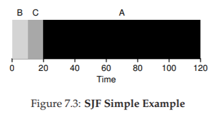
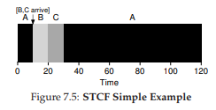
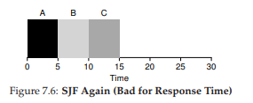
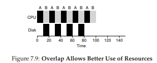

# 7. Scheduling: Giới thiệu

Đến thời điểm này, các cơ chế mức thấp để chạy process (tiến trình) như context switching (chuyển ngữ cảnh) hẳn đã rõ ràng; nếu chưa, hãy quay lại một hoặc hai chương trước để đọc lại phần mô tả cách hoạt động của chúng. Tuy nhiên, chúng ta vẫn chưa hiểu rõ các chính sách mức cao mà một OS scheduler (bộ lập lịch của hệ điều hành) sử dụng. Chúng ta sẽ làm điều đó ngay sau đây, bằng cách trình bày một loạt scheduling policy (chính sách lập lịch, đôi khi gọi là *discipline*) mà nhiều người thông minh và cần mẫn đã phát triển qua nhiều năm.

Thực tế, nguồn gốc của scheduling còn xuất hiện trước cả các hệ thống máy tính; những cách tiếp cận ban đầu được lấy từ lĩnh vực quản lý vận hành (operations management) và áp dụng cho máy tính. Điều này không có gì bất ngờ: dây chuyền lắp ráp và nhiều hoạt động khác của con người cũng đòi hỏi lập lịch, với cùng một mối quan tâm mạnh mẽ đến hiệu suất. Và như vậy, vấn đề của chúng ta là:

> **THE CRUX: CÁCH PHÁT TRIỂN CHÍNH SÁCH LẬP LỊCH**
> Làm thế nào để xây dựng một khung cơ bản cho tư duy về scheduling policy? Giả định nào là then chốt? Các chỉ số nào quan trọng? Các cách tiếp cận cơ bản nào đã được dùng trong những hệ thống máy tính đầu tiên?

## 7.1 Workload Assumptions (Các giả định về khối lượng công việc)

Trước khi đi sâu vào các chính sách có thể có, hãy đưa ra một số giả định đơn giản hóa về các process đang chạy trong hệ thống, đôi khi được gọi chung là *workload* (khối lượng công việc). Xác định workload là một phần quan trọng của việc xây dựng chính sách; bạn càng biết nhiều về workload thì chính sách lập lịch của bạn càng có thể tinh chỉnh tốt hơn.

Các giả định mà chúng ta đưa ra ở đây phần lớn là phi thực tế, nhưng điều đó không sao (ít nhất là lúc này), vì chúng ta sẽ dần nới lỏng chúng và cuối cùng phát triển thứ mà chúng ta sẽ gọi là... (nghỉ một chút cho kịch tính)... một *fully-operational scheduling discipline*^[1].

^[1]: Được nói theo cùng cách bạn sẽ nói “A fully-operational Death Star.”

Chúng ta sẽ đưa ra các giả định sau về process (còn gọi là *job*) đang chạy trong hệ thống:

1. Mỗi job chạy trong cùng một khoảng thời gian.
2. Tất cả job đến vào cùng một thời điểm.
3. Một khi đã bắt đầu, mỗi job sẽ chạy đến khi hoàn tất.
4. Tất cả job chỉ sử dụng CPU (không thực hiện I/O).
5. Thời gian chạy của mỗi job là đã biết trước.

Chúng ta đã nói rằng nhiều giả định này là phi thực tế, nhưng giống như trong *Trại súc vật* (*Animal Farm*) của Orwell [O45] rằng “một số con vật bình đẳng hơn những con khác”, ở đây cũng vậy: một số giả định phi thực tế hơn những giả định khác. Đặc biệt, việc biết trước thời gian chạy của mỗi job có thể khiến bạn khó chịu, vì điều này khiến scheduler trở thành *toàn tri* (omniscient) — điều mà mặc dù sẽ tuyệt vời (có lẽ thế), nhưng khó có khả năng xảy ra trong tương lai gần.

## 7.2 Scheduling Metrics (Các thước đo lập lịch)

Ngoài việc đưa ra giả định về workload, chúng ta cũng cần thêm một yếu tố nữa để có thể so sánh các scheduling policy khác nhau: một *scheduling metric* (thước đo lập lịch). Metric đơn giản là một đại lượng để đo lường điều gì đó, và trong lập lịch có nhiều metric hợp lý.

Tạm thời, chúng ta sẽ đơn giản hóa bằng cách chỉ xét một metric duy nhất: *turnaround time* (thời gian quay vòng). Turnaround time của một job được định nghĩa là thời điểm job hoàn tất trừ đi thời điểm job đến hệ thống. Một cách chính thức hơn, turnaround time \$T\_{turnaround}\$ được xác định như sau:

$$
T_{turnaround} = T_{completion} - T_{arrival} \quad (7.1)
$$

Vì chúng ta giả định rằng tất cả job đến cùng lúc, nên hiện tại \$T\_{arrival} = 0\$, do đó \$T\_{turnaround} = T\_{completion}\$. Thực tế này sẽ thay đổi khi ta nới lỏng các giả định ở trên.

Bạn cần lưu ý rằng turnaround time là một *performance metric* (chỉ số hiệu năng), vốn là trọng tâm chính trong chương này. Một metric khác cũng quan trọng là *fairness* (công bằng), được đo lường (ví dụ) bằng Jain’s Fairness Index [J91]. Trong lập lịch, performance và fairness thường mâu thuẫn với nhau; ví dụ, một scheduler có thể tối ưu hiệu năng nhưng lại khiến một số job không được chạy, từ đó làm giảm fairness. Thế mới thấy, cuộc đời vốn không hoàn hảo.

## 7.3 First In, First Out (FIFO)

Thuật toán cơ bản nhất mà chúng ta có thể cài đặt được gọi là *First In, First Out (FIFO)* hay đôi khi là *First Come, First Served (FCFS)*.

FIFO có một số ưu điểm: rõ ràng nó đơn giản và dễ triển khai. Và với các giả định hiện tại, nó hoạt động khá tốt.

Hãy làm một ví dụ nhanh. Giả sử có ba job A, B và C đến hệ thống gần như cùng lúc (\$T\_{arrival} = 0\$). Vì FIFO phải chọn một job chạy trước, hãy giả sử A đến sớm hơn một chút so với B, và B đến sớm hơn một chút so với C. Giả sử thêm rằng mỗi job chạy trong 10 giây. Vậy turnaround time trung bình sẽ là bao nhiêu?

Từ Hình 7.1, ta thấy A hoàn tất ở thời điểm 10, B ở thời điểm 20, và C ở thời điểm 30. Như vậy, turnaround time trung bình của ba job đơn giản là:

$(10 + 20 + 30) / 3 = 20$

Tính turnaround time đơn giản chỉ vậy thôi.

Giờ hãy nới lỏng một giả định: cụ thể là giả định số 1, tức không còn giả định rằng mỗi job có cùng thời gian chạy. Vậy FIFO hoạt động thế nào trong trường hợp này? Bạn có thể tạo ra workload nào để khiến FIFO hoạt động tệ hại?

*(hãy nghĩ kỹ trước khi đọc tiếp... nghĩ tiếp... rồi, hiểu chưa?)*

Chắc hẳn bạn đã thấy rồi, nhưng để chắc chắn, hãy làm một ví dụ. Giả sử có ba job (A, B và C), lần này A chạy trong 100 giây, còn B và C chỉ chạy trong 10 giây.

*Figure 7.2: Why FIFO Is Not That Great*

Như thấy ở Hình 7.2, job A chạy trước suốt 100 giây, khiến B và C không được chạy cho đến khi A hoàn tất. Do đó, turnaround time trung bình của hệ thống rất cao: tận 110 giây \$((100 + 110 + 120)/3 = 110)\$.

Vấn đề này thường được gọi là *convoy effect* [B+79], trong đó một số job ngắn phải xếp hàng chờ sau một job rất dài tiêu thụ tài nguyên. Trường hợp này giống như bạn xếp hàng ở siêu thị và thấy người phía trước có ba xe đẩy chất đầy hàng hóa và đang lục ví lấy sổ séc — bạn sẽ phải chờ khá lâu^[2].

Vậy chúng ta nên làm gì? Làm thế nào để phát triển một thuật toán tốt hơn để xử lý thực tế rằng các job có thời gian chạy khác nhau? Hãy suy nghĩ trước, rồi đọc tiếp.

> **TIP: NGUYÊN LÝ CỦA SJF**
> *Shortest Job First* (SJF) thể hiện một nguyên lý lập lịch tổng quát có thể áp dụng cho bất kỳ hệ thống nào mà turnaround time (thời gian quay vòng) cho mỗi khách hàng (hay ở đây là job) đều quan trọng. Hãy nghĩ đến bất kỳ hàng chờ nào bạn từng xếp: nếu cơ sở đó quan tâm đến sự hài lòng của khách hàng, rất có thể họ đã áp dụng SJF. Ví dụ, siêu thị thường có quầy thanh toán “dưới 10 món hàng” để đảm bảo người mua ít hàng không bị kẹt sau gia đình đang chuẩn bị dự trữ cho “mùa đông hạt nhân”.

## 7.4 Shortest Job First (SJF)

Hóa ra có một cách tiếp cận rất đơn giản để giải quyết vấn đề này; thực tế đây là một ý tưởng lấy từ *operations research* [C54,PV56] và áp dụng vào lập lịch job trong hệ thống máy tính. Chính sách lập lịch mới này gọi là *Shortest Job First (SJF)*, và cái tên đủ rõ ràng: luôn chạy job ngắn nhất trước, sau đó đến job ngắn tiếp theo, và cứ thế.

*Figure 7.3: SJF Simple Example*

Hãy áp dụng ví dụ trước nhưng dùng SJF làm chính sách lập lịch. Hình 7.3 cho thấy kết quả khi chạy A, B và C. Hy vọng sơ đồ đã làm rõ vì sao SJF cải thiện đáng kể turnaround time trung bình. Chỉ đơn giản bằng việc chạy B và C trước A, SJF đã giảm turnaround time trung bình từ 110 giây xuống còn 50 giây \$((10 + 20 + 120)/3 = 50)\$, tức cải thiện hơn hai lần.

^[2]: Hành động khuyến nghị trong trường hợp này: hoặc nhanh chóng chuyển sang hàng khác, hoặc hít một hơi thật sâu rồi thở ra thật chậm. Đúng vậy, hít vào, thở ra. Mọi thứ sẽ ổn thôi, đừng lo lắng.

> **ASIDE: PREEMPTIVE SCHEDULERS**
> Trong thời kỳ máy tính xử lý theo lô (*batch computing*), nhiều scheduler không hỗ trợ *preemption* (không thể ngắt job giữa chừng) đã được phát triển; hệ thống như vậy sẽ chạy từng job đến khi hoàn tất mới xem xét chạy job khác. Gần như tất cả scheduler hiện đại đều là *preemptive* (có thể ngắt), sẵn sàng dừng một process đang chạy để chuyển sang chạy process khác. Điều này ngụ ý rằng scheduler sử dụng các cơ chế mà chúng ta đã học trước đây; đặc biệt, scheduler có thể thực hiện *context switch*, tạm thời dừng một process đang chạy và tiếp tục (hoặc bắt đầu) một process khác.

Thực tế, với các giả định rằng tất cả job đến cùng lúc, chúng ta có thể chứng minh rằng *SJF* thực sự là một thuật toán lập lịch tối ưu. Tuy nhiên, bạn đang học môn *systems*, không phải lý thuyết hay *operations research*; nên sẽ không có chứng minh nào ở đây.

Như vậy, ta đã tìm được một cách tiếp cận khá tốt với SJF, nhưng các giả định vẫn còn quá phi thực tế. Hãy nới lỏng thêm một giả định nữa. Cụ thể, ta xét đến giả định số 2: thay vì giả định tất cả job đến cùng lúc, ta cho rằng các job có thể đến vào bất kỳ thời điểm nào. Vấn đề nào sẽ nảy sinh?
*(nghỉ một chút để suy nghĩ... bạn đang nghĩ chứ?... nào, bạn làm được mà)*

Ta có thể minh họa vấn đề bằng một ví dụ. Lần này, giả sử A đến lúc \$t = 0\$ và cần chạy trong 100 giây, trong khi B và C đến ở \$t = 10\$ và mỗi job cần 10 giây. Với SJF thuần túy, ta sẽ có lịch chạy như trong Hình 7.4.

*Figure 7.4: SJF With Late Arrivals From B and C*

Như bạn thấy ở hình, mặc dù B và C đến ngay sau A, nhưng chúng vẫn buộc phải chờ cho đến khi A hoàn tất, do đó lại chịu cảnh *convoy problem*. Turnaround time trung bình của ba job là 103.33 giây \$((100 + (110 - 10) + (120 - 10)) / 3)\$. Vậy scheduler có thể làm gì?

## 7.5 Shortest Time-to-Completion First (STCF)

Để giải quyết vấn đề này, chúng ta cần nới lỏng giả định số 3 (rằng job phải chạy đến khi hoàn tất). Đồng thời, scheduler cũng cần có thêm cơ chế hỗ trợ. Như bạn có thể đoán, dựa trên thảo luận trước về *timer interrupt* và *context switching*, scheduler hoàn toàn có thể làm điều gì đó khi B và C đến: nó có thể *preempt* (ngắt) job A và quyết định chạy một job khác, có thể tiếp tục A sau đó. Theo định nghĩa, SJF là một scheduler *non-preemptive* (không ngắt giữa chừng), vì thế nó gặp vấn đề như đã mô tả.

*Figure 7.5: STCF Simple Example*

May mắn thay, có một loại scheduler thực hiện đúng điều này: thêm khả năng preemption vào SJF, gọi là *Shortest Time-to-Completion First (STCF)* hay *Preemptive Shortest Job First (PSJF)* [CK68]. Mỗi khi có một job mới đến hệ thống, STCF sẽ xác định trong số các job còn lại (bao gồm cả job mới) job nào có thời gian còn lại ngắn nhất, rồi lập lịch cho job đó. Trong ví dụ của chúng ta, STCF sẽ ngắt A và chạy B cùng C đến khi xong; chỉ khi đó thời gian còn lại của A mới được tiếp tục. Hình 7.5 minh họa điều này.

Kết quả là turnaround time trung bình cải thiện đáng kể: 50 giây \$(((120 - 0) + (20 - 10) + (30 - 10))/3)\$. Và giống như trước, với giả định mới này, STCF có thể chứng minh được là tối ưu. Nếu SJF tối ưu khi tất cả job đến cùng lúc, thì bạn chắc hẳn cũng thấy được trực giác đằng sau tính tối ưu của STCF.

## 7.6 Một chỉ số mới: Response Time

Như vậy, nếu ta biết độ dài job, biết rằng các job chỉ dùng CPU, và chỉ quan tâm đến turnaround time, thì STCF là một chính sách tuyệt vời. Thực tế, với một số hệ thống batch computing ban đầu, loại thuật toán lập lịch này là hợp lý. Tuy nhiên, sự xuất hiện của máy *time-sharing* đã thay đổi tất cả. Giờ đây, người dùng ngồi trước terminal và đòi hỏi khả năng tương tác từ hệ thống. Từ đó, một chỉ số mới ra đời: *response time* (thời gian đáp ứng).

Chúng ta định nghĩa response time là khoảng thời gian từ lúc job đến hệ thống cho đến lần đầu tiên nó được lập lịch^[3]. Một cách chính thức:

$$
T_{response} = T_{firstrun} - T_{arrival} \quad (7.2)
$$

*Figure 7.6: SJF Again (Bad for Response Time)*

*Figure 7.7: Round Robin (Good For Response Time)*

^[3]: Một số định nghĩa khác bao gồm cả thời gian cho đến khi job tạo ra một “phản hồi”; định nghĩa ở đây là phiên bản tốt nhất, giả định rằng job tạo phản hồi ngay lập tức.

Ví dụ, nếu ta xét lịch từ Hình 7.5 (A đến lúc 0, B và C đến lúc 10), thì response time của mỗi job là: 0 cho A, 0 cho B, và 10 cho C (trung bình: 3.33).

Như bạn có thể đoán, STCF và các chính sách tương tự không thực sự tốt cho response time. Nếu ba job đến cùng lúc, job thứ ba sẽ phải chờ hai job trước chạy xong hoàn toàn trước khi được lập lịch. Trong khi rất tốt cho turnaround time, thì đây lại là điều tệ hại cho response time và tính tương tác. Hãy tưởng tượng bạn ngồi ở terminal, gõ lệnh, và phải chờ 10 giây mới thấy hệ thống phản hồi chỉ vì một job khác được lập lịch trước bạn — không hề dễ chịu.

Như vậy, chúng ta lại đối diện một vấn đề khác: làm thế nào để xây dựng scheduler nhạy cảm với response time?

## 7.7 Round Robin

Để giải quyết vấn đề này, ta sẽ giới thiệu một thuật toán lập lịch mới, cổ điển gọi là *Round Robin (RR)* [K64]. Ý tưởng cơ bản rất đơn giản: thay vì chạy job đến khi hoàn tất, RR chạy một job trong một khoảng thời gian gọi là *time slice* (đôi khi gọi là *scheduling quantum*), rồi chuyển sang job tiếp theo trong hàng đợi. Quá trình này lặp đi lặp lại cho đến khi tất cả job hoàn tất. Vì lý do này, RR đôi khi còn gọi là *time-slicing*.

Lưu ý rằng độ dài của time slice phải là bội số của chu kỳ *timer interrupt*; ví dụ, nếu timer ngắt mỗi 10 mili-giây, thì time slice có thể là 10, 20 hoặc bội số khác của 10 ms.

Để hiểu rõ hơn về RR, hãy xét một ví dụ. Giả sử ba job A, B, và C đến cùng lúc trong hệ thống, và mỗi job cần chạy 5 giây. Một scheduler SJF sẽ chạy từng job đến hoàn tất rồi mới chuyển sang job khác (Hình 7.6). Ngược lại, RR với time slice 1 giây sẽ luân phiên qua các job rất nhanh (Hình 7.7).

Response time trung bình của RR là \$(0+1+2)/3 = 1\$; còn với SJF, response time trung bình là \$(0+5+10)/3 = 5\$.

> **TIP: AMORTIZATION CÓ THỂ GIẢM CHI PHÍ**
> Kỹ thuật tổng quát gọi là *amortization* thường được dùng trong hệ thống khi một thao tác có chi phí cố định. Bằng cách thực hiện thao tác ít lần hơn, tổng chi phí sẽ giảm. Ví dụ, nếu time slice đặt là 10 ms và chi phí context switch là 1 ms, thì khoảng 10% thời gian bị lãng phí cho context switch. Nếu muốn amortize chi phí này, ta có thể tăng time slice, ví dụ lên 100 ms. Khi đó, chưa đến 1% thời gian bị lãng phí, và chi phí của time-slicing đã được amortize.

Như bạn thấy, độ dài time slice có vai trò then chốt trong RR. Time slice càng ngắn, hiệu năng của RR theo chỉ số response time càng tốt. Tuy nhiên, nếu quá ngắn, chi phí context switching sẽ trở nên chi phối và làm giảm hiệu năng tổng thể. Do đó, việc chọn độ dài time slice là một *trade-off* (cân bằng đánh đổi) đối với nhà thiết kế hệ thống: đủ dài để amortize chi phí switching nhưng không quá dài để làm hệ thống kém tương tác.

Lưu ý rằng chi phí context switching không chỉ đến từ việc OS lưu và khôi phục vài thanh ghi. Khi chương trình chạy, nó tạo ra rất nhiều trạng thái trong CPU cache, TLB, bộ dự đoán nhánh và các phần cứng trong chip khác. Chuyển sang job khác khiến các trạng thái này bị xóa và thay bằng trạng thái mới, gây ra chi phí hiệu năng đáng kể [MB91].

Với một time slice hợp lý, RR là một scheduler tuyệt vời nếu chỉ xét response time. Nhưng còn turnaround time thì sao? Hãy quay lại ví dụ trên. A, B, và C, mỗi job chạy 5 giây, đến cùng lúc, và RR dùng time slice 1 giây. Ta thấy từ hình minh họa rằng A hoàn tất ở thời điểm 13, B ở 14, và C ở 15, với turnaround time trung bình là 14. Rất tệ!

Không ngạc nhiên khi RR là một trong những chính sách tệ nhất nếu xét theo turnaround time. Trực giác mà nói, điều này hợp lý: RR kéo dài thời gian hoàn tất của mỗi job bằng cách chỉ chạy từng phần nhỏ rồi chuyển sang job khác. Vì turnaround time chỉ quan tâm đến khi job kết thúc, RR gần như *pessimal* (tệ hại nhất), thậm chí còn tệ hơn FIFO trong nhiều trường hợp.

Nói chung, bất kỳ chính sách nào (như RR) mà công bằng — chia CPU đều cho các process trong ngắn hạn — thì sẽ hoạt động tệ với chỉ số như turnaround time. Đây là một *trade-off* cố hữu: nếu chấp nhận “không công bằng”, bạn có thể cho job ngắn chạy xong sớm, nhưng đánh đổi bằng response time kém; còn nếu coi trọng công bằng, response time sẽ được cải thiện, nhưng turnaround time lại xấu đi. Kiểu đánh đổi này rất phổ biến trong hệ thống; bạn không thể “vừa giữ được cái bánh, vừa ăn nó”^[4].

Chúng ta đã phát triển hai loại scheduler. Loại thứ nhất (SJF, STCF) tối ưu turnaround time nhưng tệ cho response time. Loại thứ hai (RR) tối ưu response time nhưng tệ cho turnaround time. Và chúng ta vẫn còn hai giả định cần nới lỏng: giả định 4 (các job không làm I/O) và giả định 5 (thời gian chạy của mỗi job là đã biết). Hãy tiếp tục với chúng.

> **TIP: OVERLAP GIÚP TĂNG HIỆU SUẤT**
> Khi có thể, hãy *overlap* (chồng chéo) các thao tác để tối đa hóa việc sử dụng hệ thống. Overlap hữu ích trong nhiều lĩnh vực, chẳng hạn khi thực hiện disk I/O hoặc gửi thông điệp đến máy từ xa; trong cả hai trường hợp, bắt đầu một tác vụ rồi chuyển sang công việc khác là một ý tưởng tốt, giúp cải thiện hiệu suất và khả năng tận dụng tài nguyên của hệ thống.

## 7.8 Kết hợp với I/O

Trước tiên, ta nới lỏng giả định số 4 — hiển nhiên tất cả chương trình đều thực hiện I/O. Hãy tưởng tượng một chương trình không có input: nó sẽ tạo ra cùng một output mỗi lần chạy. Tưởng tượng một chương trình không có output: giống như “cái cây ngã trong rừng mà không ai thấy”; việc nó chạy chẳng có ý nghĩa gì.

Scheduler rõ ràng phải đưa ra quyết định khi một job khởi tạo yêu cầu I/O, vì job đang chạy sẽ không dùng CPU trong lúc chờ I/O hoàn tất; nó sẽ bị *blocked* (chặn). Nếu I/O gửi đến ổ cứng, process có thể bị chặn vài mili-giây hoặc lâu hơn, tùy vào tải I/O hiện tại của ổ. Do đó, scheduler có lẽ nên lập lịch một job khác dùng CPU tại thời điểm đó.

Scheduler cũng phải quyết định khi I/O hoàn tất. Khi đó, một *interrupt* được phát sinh, và OS sẽ đưa process phát lệnh I/O từ trạng thái *blocked* trở lại *ready state*. Tất nhiên, scheduler thậm chí có thể quyết định chạy job đó ngay lúc này. Vậy OS nên đối xử với mỗi job như thế nào?

Để hiểu rõ hơn, giả sử ta có hai job, A và B, mỗi job cần 50 ms CPU. Tuy nhiên, có một khác biệt rõ rệt: A chạy 10 ms rồi phát lệnh I/O (giả sử mỗi I/O mất 10 ms), còn B chỉ dùng CPU 50 ms và không thực hiện I/O. Scheduler chạy A trước, rồi đến B (Hình 7.8).

Giả sử ta muốn xây dựng một scheduler STCF. Làm thế nào để scheduler này tính đến thực tế rằng A bị chia thành 5 đoạn 10 ms, trong khi B chỉ có một nhu cầu CPU duy nhất 50 ms? Rõ ràng, chỉ đơn giản chạy từng job mà không xét I/O là vô nghĩa.

^[4]: Một câu nói gây nhầm lẫn, bởi đúng ra phải là “Bạn không thể vừa giữ bánh vừa ăn nó” (điều hiển nhiên, đúng không?). Thật đáng kinh ngạc khi Wikipedia có hẳn một trang về câu này; và còn thú vị để đọc nữa [W15]. Trong tiếng Ý, người ta nói “Avere la botte piena e la moglie ubriaca”.

Một cách tiếp cận phổ biến là coi mỗi đoạn 10 ms của A như một job độc lập. Như vậy, khi hệ thống khởi động, lựa chọn là lập lịch cho A (10 ms) hay B (50 ms). Với STCF, lựa chọn rõ ràng: chọn job ngắn hơn, tức A. Sau khi đoạn đầu của A hoàn tất, chỉ còn B, và nó bắt đầu chạy. Khi một đoạn mới của A được gửi vào, nó sẽ *preempt* B và chạy 10 ms.

Cách làm này cho phép *overlap*: CPU được một process sử dụng trong khi process khác chờ I/O, nhờ đó hệ thống tận dụng tốt hơn (Hình 7.9). Và như vậy, ta thấy cách scheduler kết hợp I/O: bằng cách coi mỗi *CPU burst* là một job, scheduler đảm bảo các process “tương tác” được chạy thường xuyên. Trong khi các job này thực hiện I/O, các job nặng CPU khác được chạy, giúp CPU được khai thác hiệu quả hơn.

## 7.9 Không còn “Oracle” nữa

Với cách tiếp cận cơ bản cho I/O, ta đến với giả định cuối cùng: scheduler biết trước độ dài mỗi job. Như đã nói, đây có lẽ là giả định tệ nhất. Trên thực tế, trong một OS đa mục đích (general-purpose OS), OS thường biết rất ít về độ dài mỗi job. Vậy làm sao xây dựng cách tiếp cận hoạt động giống SJF/STCF mà không cần kiến thức tiên nghiệm? Hơn nữa, làm sao ta kết hợp được các ý tưởng từ RR để cải thiện response time?

## 7.10 Tóm tắt

Chúng ta đã giới thiệu các ý tưởng cơ bản về scheduling và phát triển hai nhóm phương pháp. Nhóm thứ nhất chạy job ngắn nhất còn lại, tối ưu turnaround time. Nhóm thứ hai luân phiên qua tất cả job, tối ưu response time. Cả hai đều kém ở điểm mà nhóm kia mạnh, một *trade-off* vốn rất phổ biến trong hệ thống.

Chúng ta cũng đã thấy cách tích hợp I/O, nhưng vẫn chưa giải quyết được vấn đề cốt lõi: OS không thể nhìn thấy tương lai. Ngay sau đây, ta sẽ thấy cách khắc phục vấn đề này, bằng cách xây dựng một scheduler sử dụng quá khứ gần để dự đoán tương lai. Scheduler này được gọi là *multi-level feedback queue*, và nó sẽ là chủ đề của chương tiếp theo.

## Tham khảo

[B+79] “The Convoy Phenomenon”  
M. Blasgen, J. Gray, M. Mitoma, T. Price  
ACM Operating Systems Review, 13:2, April 1979  
Perhaps the first reference to convoys, which occurs in databases as well as the OS.

[C54] “Priority Assignment in Waiting Line Problems”  
A. Cobham  
Journal of Operations Research, 2:70, pages 70–76, 1954  
The pioneering paper on using an SJF approach in scheduling the repair of machines.  

[K64] “Analysis of a Time-Shared Processor”  
Leonard Kleinrock  
Naval Research Logistics Quarterly, 11:1, pages 59–73, March 1964  
May be the first reference to the round-robin scheduling algorithm; certainly one of the first analyses of said approach to scheduling a time-shared system.

[CK68] “Computer Scheduling Methods and their Countermeasures”  
Edward G. Coffman and Leonard Kleinrock  
AFIPS ’68 (Spring), April 1968  
An excellent early introduction to and analysis of a number of basic scheduling disciplines.

[J91] “The Art of Computer Systems Performance Analysis:Techniques for Experimental Design, Measurement, Simulation, and Modeling”  
R. Jain  
Interscience, New York, April 1991  
The standard text on computer systems measurement. A great reference for your library, for sure.

[O45] “Animal Farm”  
George Orwell  
Secker and Warburg (London), 1945  
A great but depressing allegorical book about power and its corruptions. Some say it is a critique of Stalin and the pre-WWII Stalin era in the U.S.S.R; we say it’s a critique of pigs.

[PV56] “Machine Repair as a Priority Waiting-Line Problem”  
Thomas E. Phipps Jr. and W. R. Van Voorhis  
Operations Research, 4:1, pages 76–86, February 1956  
Follow-on work that generalizes the SJF approach to machine repair from Cobham’s original work; also postulates the utility of an STCF approach in such an environment. Specifically, “There are certain types of repair work, ... involving much dismantling and covering the floor with nuts and bolts, which certainly should not be interrupted once undertaken; in other cases it would be inadvisable to continue work on a long job if one or more short ones became available (p.81).”

[MB91] “The effect of context switches on cache performance”  
Jeffrey C. Mogul and Anita Borg  
ASPLOS, 1991  
A nice study on how cache performance can be affected by context switching; less of an issue in today’s systems where processors issue billions of instructions per second but context-switches still happen in the millisecond time range.

[W15] “You can’t have your cake and eat it”  
http://en.wikipedia.org/wiki/You can’t have your cake and eat it  
Wikipedia, as of December 2015  
The best part of this page is reading all the similar idioms from other languages. In Tamil, you can’t “have both the moustache and drink the soup.”

