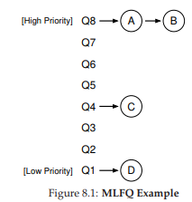

# 8 Scheduling: Multi-Level Feedback Queue

Trong chương này, chúng ta sẽ giải quyết vấn đề phát triển một trong những phương pháp **scheduling** (lập lịch) nổi tiếng nhất, được gọi là **Multi-level Feedback Queue** (MLFQ – Hàng đợi phản hồi đa mức). Bộ lập lịch MLFQ lần đầu tiên được mô tả bởi Corbato và cộng sự vào năm 1962 [C+62] trong một hệ thống có tên **Compatible Time-Sharing System** (CTSS – Hệ thống chia sẻ thời gian tương thích). Công trình này, cùng với các nghiên cứu sau đó trên hệ thống **Multics**, đã giúp Corbato nhận được giải thưởng cao quý nhất của ACM – **Turing Award**. Thuật toán lập lịch này sau đó đã được tinh chỉnh qua nhiều năm để trở thành các phiên bản triển khai mà bạn sẽ gặp trong một số hệ thống hiện đại.

Vấn đề cơ bản mà MLFQ cố gắng giải quyết gồm hai khía cạnh:

1. **Tối ưu hóa turnaround time** (thời gian hoàn thành), mà như chúng ta đã thấy ở phần trước, được thực hiện bằng cách chạy các job (công việc) ngắn trước. Tuy nhiên, hệ điều hành (OS) thường không biết chính xác một job sẽ chạy trong bao lâu – đây lại chính là thông tin mà các thuật toán như **SJF** (Shortest Job First) hoặc **STCF** (Shortest Time-to-Completion First) yêu cầu.
2. **Tăng tính phản hồi** đối với người dùng tương tác (interactive users – ví dụ: người dùng đang ngồi trước màn hình chờ một process (tiến trình) hoàn thành), tức là giảm **response time** (thời gian phản hồi). Các thuật toán như **Round Robin** có thể giảm response time, nhưng lại rất tệ đối với turnaround time.

Vậy, vấn đề đặt ra là: khi chúng ta **không biết trước** thông tin về một process, làm thế nào để xây dựng một scheduler (bộ lập lịch) đạt được cả hai mục tiêu trên? Làm thế nào để scheduler có thể **học** được đặc điểm của các job khi hệ thống đang chạy, từ đó đưa ra quyết định lập lịch tốt hơn?

>> **THE CRUX: HOW TO SCHEDULE WITHOUT PERFECT KNOWLEDGE?**  
>> Làm thế nào để thiết kế một scheduler vừa giảm thiểu response time cho các job tương tác, vừa giảm turnaround time, mà không cần biết trước độ dài của job?

> **TIP: LEARN FROM HISTORY**  
> Multi-level Feedback Queue là một ví dụ điển hình về hệ thống **học từ quá khứ để dự đoán tương lai**. Cách tiếp cận này phổ biến trong hệ điều hành (và nhiều lĩnh vực khác của Khoa học Máy tính, bao gồm cả bộ dự đoán nhánh phần cứng – hardware branch predictors – và các thuật toán caching). Phương pháp này hiệu quả khi các job có **các pha hành vi** (behavior phases) và do đó có thể dự đoán được. Tuy nhiên, cần thận trọng vì nếu dự đoán sai, hệ thống có thể đưa ra quyết định còn tệ hơn cả khi không biết gì.

## 8.1 MLFQ: Các quy tắc cơ bản

Để xây dựng một scheduler như vậy, trong chương này chúng ta sẽ mô tả các thuật toán cơ bản đằng sau MLFQ. Mặc dù chi tiết triển khai của nhiều phiên bản MLFQ khác nhau [E95], nhưng hầu hết đều có nguyên tắc tương tự.

Trong mô hình này, MLFQ có một số hàng đợi (queue) riêng biệt, mỗi hàng đợi được gán một **mức ưu tiên** (priority) khác nhau. Tại một thời điểm bất kỳ, một job sẵn sàng chạy sẽ nằm trong **một** hàng đợi duy nhất. MLFQ sử dụng **priority** để quyết định job nào sẽ chạy: job có priority cao hơn (nằm ở hàng đợi cao hơn) sẽ được chọn chạy.

Tất nhiên, có thể có nhiều job trong cùng một hàng đợi, tức là có cùng priority. Trong trường hợp này, chúng ta sẽ sử dụng **Round Robin** để chia sẻ CPU giữa các job đó.

Hai quy tắc cơ bản đầu tiên của MLFQ:

- **Rule 1:** Nếu Priority(A) > Priority(B), A chạy (B không chạy).
- **Rule 2:** Nếu Priority(A) = Priority(B), A và B chạy theo Round Robin.

Điểm mấu chốt của MLFQ nằm ở **cách scheduler thiết lập priority**. Thay vì gán một priority cố định cho mỗi job, MLFQ **thay đổi priority dựa trên hành vi quan sát được**:

- Nếu một job thường xuyên nhường CPU để chờ nhập liệu từ bàn phím, MLFQ sẽ giữ priority cao cho nó (đặc trưng của process tương tác).
- Nếu một job sử dụng CPU liên tục trong thời gian dài, MLFQ sẽ giảm priority của nó.

Bằng cách này, MLFQ **học** về process khi nó chạy và dùng **lịch sử** của job để dự đoán hành vi tương lai.

Ví dụ, nếu minh họa trạng thái các hàng đợi tại một thời điểm (Hình 8.1), ta có thể thấy: hai job (A và B) ở mức priority cao nhất, job C ở mức trung bình, và job D ở mức thấp nhất. Theo nguyên tắc MLFQ, scheduler sẽ luân phiên cấp CPU cho A và B, còn C và D sẽ không được chạy – điều này rõ ràng là không công bằng.

Tuy nhiên, chỉ nhìn vào một ảnh chụp tĩnh của các hàng đợi thì chưa thể hiểu rõ MLFQ hoạt động thế nào. Điều quan trọng là phải xem **priority của job thay đổi theo thời gian** ra sao – và đó chính là điều chúng ta sẽ tìm hiểu tiếp theo.

## 8.2 Lần thử thứ nhất: Cách thay đổi priority

Bây giờ, chúng ta cần quyết định cách MLFQ sẽ thay đổi priority của một job (và do đó thay đổi hàng đợi của nó) trong suốt vòng đời. Cần nhớ rằng workload của chúng ta là sự kết hợp giữa:

- Các job tương tác, chạy ngắn (thường xuyên nhường CPU).
- Các job **CPU-bound** (dùng CPU nhiều), chạy dài, không yêu cầu response time thấp.

Để làm điều này, chúng ta cần một khái niệm mới: **allotment** của job.  
Allotment là **lượng thời gian** mà một job có thể chạy ở một mức priority nhất định trước khi scheduler giảm priority của nó. Để đơn giản, ban đầu ta giả sử allotment = một time slice.

Thuật toán điều chỉnh priority đầu tiên:

- **Rule 3:** Khi một job vào hệ thống, nó được đặt ở mức priority cao nhất (hàng đợi trên cùng).
- **Rule 4a:** Nếu job dùng hết allotment khi chạy, priority của nó bị giảm (chuyển xuống một hàng đợi).
- **Rule 4b:** Nếu job nhường CPU (ví dụ: thực hiện I/O) trước khi allotment hết, nó giữ nguyên priority (allotment được đặt lại).

**Hình 8.2:** Job chạy dài theo thời gian

### **Ví dụ 1: Một job chạy dài duy nhất**  
Giả sử có một job chạy dài trong hệ thống, time slice = 10 ms, allotment = time slice. Hình 8.2 minh họa quá trình:

- Job bắt đầu ở priority cao nhất (Q2).
- Sau 10 ms, scheduler giảm priority xuống Q1.
- Sau một time slice ở Q1, job bị giảm xuống Q0 (thấp nhất) và ở đó mãi.

### **Ví dụ 2: Xuất hiện một job ngắn**  

Giờ xét trường hợp phức tạp hơn để thấy MLFQ **xấp xỉ SJF**:

- Job A: chạy dài, CPU-bound.
- Job B: chạy ngắn, tương tác.

Giả sử A đã chạy một thời gian và đang ở priority thấp nhất. Khi B đến (T = 100 ms), nó được đưa vào priority cao nhất. Vì B chỉ chạy 20 ms, nó hoàn thành trước khi bị giảm xuống priority thấp hơn. Sau đó, A tiếp tục chạy ở priority thấp.

Từ ví dụ này, ta thấy: vì không biết job là ngắn hay dài, MLFQ **giả định ban đầu là job ngắn** và cho priority cao. Nếu đúng là job ngắn, nó sẽ hoàn thành nhanh; nếu không, nó sẽ dần bị đẩy xuống các hàng đợi thấp hơn, trở thành job batch dài hạn. Bằng cách này, MLFQ **xấp xỉ SJF**.

### **Ví dụ 3: với I/O**

Bây giờ, hãy xem một ví dụ có liên quan đến **I/O** (Input/Output – nhập/xuất). Như **Rule 4b** đã nêu ở trên, nếu một **process** (tiến trình) nhường CPU trước khi sử dụng hết **allotment** (phần thời gian được cấp ở một mức ưu tiên), chúng ta sẽ giữ nó ở cùng mức **priority** (ưu tiên). Ý tưởng của quy tắc này rất đơn giản: nếu một **interactive job** (công việc tương tác), ví dụ, thực hiện nhiều thao tác I/O (chẳng hạn chờ nhập liệu từ bàn phím hoặc chuột), nó sẽ nhường CPU trước khi allotment kết thúc; trong trường hợp này, chúng ta không muốn phạt job đó, và do đó giữ nguyên mức priority.

**Hình 8.3 (bên phải)** minh họa cách hoạt động: một interactive job B (màu xám) chỉ cần CPU trong 1 ms trước khi thực hiện I/O, cạnh tranh CPU với một **batch job** chạy dài A (màu đen). Cách tiếp cận MLFQ giữ B ở mức priority cao nhất vì B liên tục nhường CPU; nếu B là một interactive job, MLFQ đạt được mục tiêu chạy nhanh các job tương tác.

### **Vấn đề với MLFQ hiện tại**

Như vậy, chúng ta đã có một MLFQ cơ bản. Nó dường như hoạt động khá tốt: chia sẻ CPU công bằng giữa các job chạy dài, và cho phép các job ngắn hoặc tương tác nhiều với I/O chạy nhanh. Tuy nhiên, cách tiếp cận này vẫn tồn tại những nhược điểm nghiêm trọng. Bạn có đoán ra không?  
(Đây là lúc bạn tạm dừng và suy nghĩ một cách “xảo quyệt” nhất có thể)

1. **Starvation** (đói CPU): nếu có “quá nhiều” interactive job trong hệ thống, chúng sẽ chiếm toàn bộ thời gian CPU, khiến các job chạy dài không bao giờ nhận được CPU (bị đói). Chúng ta muốn đảm bảo các job này vẫn có tiến triển, ngay cả trong tình huống này.
2. **Gaming the scheduler** (lách luật bộ lập lịch): một người dùng thông minh có thể viết lại chương trình để “đánh lừa” scheduler, nhằm nhận được nhiều tài nguyên hơn mức công bằng. Thuật toán hiện tại dễ bị tấn công như sau: trước khi allotment hết, thực hiện một thao tác I/O (ví dụ ghi/đọc file) để nhường CPU; việc này giúp job ở lại cùng hàng đợi, và do đó nhận được tỷ lệ CPU cao hơn. Nếu làm khéo (ví dụ chạy 99% allotment rồi mới nhường CPU), một job có thể gần như độc chiếm CPU.
3. **Thay đổi hành vi theo thời gian**: một chương trình ban đầu CPU-bound (dùng CPU nhiều) có thể chuyển sang giai đoạn tương tác. Với cách tiếp cận hiện tại, job này sẽ không được đối xử như các interactive job khác.

>> **TIP: SCHEDULING MUST BE SECURE FROM ATTACK**  
>> Bạn có thể nghĩ rằng một **scheduling policy** (chính sách lập lịch), dù bên trong hệ điều hành hay trong bối cảnh rộng hơn (ví dụ: xử lý yêu cầu I/O trong hệ thống lưu trữ phân tán [Y+18]), không liên quan đến bảo mật. Nhưng ngày càng nhiều trường hợp cho thấy điều ngược lại. Hãy xem xét một **data center** hiện đại, nơi người dùng từ khắp thế giới chia sẻ CPU, bộ nhớ, mạng và hệ thống lưu trữ; nếu không cẩn trọng trong thiết kế và thực thi chính sách, một người dùng có thể gây hại cho người khác và giành lợi thế cho mình. Do đó, **scheduling policy** là một phần quan trọng của bảo mật hệ thống và cần được xây dựng cẩn thận.

## 8.3 Lần thử #2: Priority Boost

Hãy thử thay đổi quy tắc để tránh vấn đề starvation. Chúng ta có thể làm gì để đảm bảo các job CPU-bound vẫn có tiến triển (dù ít)?

Ý tưởng đơn giản: định kỳ **tăng priority** cho tất cả job trong hệ thống. Có nhiều cách thực hiện, nhưng ta chọn cách đơn giản: đưa tất cả lên hàng đợi cao nhất. Do đó, có thêm quy tắc mới:

- **Rule 5:** Sau một khoảng thời gian **S**, di chuyển tất cả job trong hệ thống lên hàng đợi cao nhất.

Quy tắc mới này giải quyết hai vấn đề:

1. **Không bị đói CPU**: khi ở hàng đợi cao nhất, job sẽ chia sẻ CPU với các job ưu tiên cao khác theo Round Robin, và cuối cùng sẽ được chạy.
2. **Thay đổi hành vi**: nếu một job CPU-bound trở thành interactive, scheduler sẽ xử lý đúng sau khi job được tăng priority.

**Ví dụ:** Một job chạy dài cạnh tranh CPU với hai job tương tác ngắn.  
- **Hình 8.4 (trái):** Không có priority boost → job chạy dài bị đói khi hai job ngắn xuất hiện.  
- **Hình 8.4 (phải):** Có priority boost mỗi 100 ms (giá trị này có thể quá nhỏ, nhưng dùng để minh họa) → job chạy dài được tăng priority định kỳ và có cơ hội chạy.

Tất nhiên, việc thêm khoảng thời gian S dẫn đến câu hỏi: **S nên là bao nhiêu?** John Ousterhout – một nhà nghiên cứu hệ thống nổi tiếng [O11] – gọi các giá trị như vậy là **voo-doo constants** (hằng số “ma thuật”), vì việc chọn đúng giá trị giống như cần phép thuật. Nếu S quá lớn → job chạy dài có thể bị đói; nếu quá nhỏ → job tương tác không được chia CPU hợp lý. Thường thì quản trị viên hệ thống sẽ điều chỉnh, hoặc hiện nay, dùng phương pháp tự động dựa trên **machine learning** [A+17].

## 8.4 Lần thử #3: Better Accounting

Chúng ta còn một vấn đề: **ngăn chặn việc lách luật scheduler**. Thủ phạm chính là **Rules 4a và 4b**, cho phép job giữ nguyên priority nếu nhường CPU trước khi allotment hết. Giải pháp?

>> **TIP: AVOID VOO-DOO CONSTANTS (OUSTERHOUT’S LAW)**  
>> Tránh dùng **voo-doo constants** là ý tưởng tốt khi có thể. Nhưng như ví dụ trên, điều này thường khó. Có thể làm hệ thống tự học giá trị phù hợp, nhưng cũng không đơn giản. Kết quả thường thấy: một file cấu hình đầy giá trị mặc định, để quản trị viên giàu kinh nghiệm tinh chỉnh khi cần. Thực tế, chúng thường bị bỏ mặc, và chúng ta chỉ hy vọng giá trị mặc định hoạt động tốt. Mẹo này đến từ giáo sư OS John Ousterhout, nên được gọi là **Ousterhout’s Law**.

**Giải pháp:** Thực hiện **better accounting** (ghi nhận chính xác hơn) thời gian CPU ở mỗi mức MLFQ. Thay vì quên allotment đã dùng khi job thực hiện I/O, scheduler sẽ **ghi nhớ**; khi job dùng hết allotment, nó bị giảm priority, bất kể dùng một lần dài hay nhiều lần ngắn. Do đó, gộp Rules 4a và 4b thành: **Rule 4:** Khi một job dùng hết allotment ở một mức (bất kể bao nhiêu lần nhường CPU), priority của nó bị giảm (chuyển xuống một hàng đợi).

**Ví dụ:** **Hình 8.5** cho thấy:  
- **Trái:** Với Rules 4a và 4b cũ → job có thể thực hiện I/O trước khi allotment hết, giữ nguyên priority và chiếm CPU.  
- **Phải:** Với better accounting → bất kể hành vi I/O, job sẽ dần bị giảm priority, không thể chiếm CPU quá mức.

## 8.5 Tinh chỉnh MLFQ và các vấn đề khác

Một số vấn đề khác cũng phát sinh với **MLFQ scheduling** (lập lịch hàng đợi phản hồi đa mức). Một câu hỏi lớn là làm thế nào để **tham số hóa** (parameterize) một bộ lập lịch như vậy. Ví dụ: nên có bao nhiêu hàng đợi? **Time slice** (lượng thời gian chia cho mỗi tiến trình trong một vòng lập lịch) cho mỗi hàng đợi nên dài bao nhiêu? **Allotment** (tổng thời gian được cấp ở một mức ưu tiên) là bao nhiêu? Bao lâu thì nên **boost priority** (tăng mức ưu tiên) để tránh **starvation** (đói CPU) và phản ánh sự thay đổi trong hành vi của tiến trình?  

Không có câu trả lời đơn giản cho những câu hỏi này, và do đó chỉ có kinh nghiệm thực tế với các **workload** (khối lượng công việc) và việc tinh chỉnh bộ lập lịch sau đó mới có thể dẫn đến một sự cân bằng hợp lý.  

Ví dụ, hầu hết các biến thể của MLFQ cho phép thay đổi độ dài time slice giữa các hàng đợi khác nhau. Các hàng đợi ưu tiên cao thường được cấp time slice ngắn; chúng bao gồm các **interactive job** (tác vụ tương tác), và do đó việc chuyển đổi nhanh giữa chúng là hợp lý (ví dụ: 10 mili-giây hoặc ít hơn). Ngược lại, các hàng đợi ưu tiên thấp chứa các **long-running job** (tác vụ chạy dài) vốn **CPU-bound** (phụ thuộc nhiều vào CPU); vì vậy, time slice dài hơn sẽ hiệu quả hơn (ví dụ: hàng trăm mili-giây).  

Hình 8.6 minh họa một ví dụ trong đó hai job chạy 20 ms ở hàng đợi cao nhất (với time slice 10 ms), 40 ms ở hàng giữa (time slice 20 ms), và với time slice 40 ms ở hàng thấp nhất.

**Hình 8.6:** Mức ưu tiên thấp hơn, lượng thời gian (quanta) dài hơn.

Triển khai MLFQ của **Solaris** — lớp lập lịch **Time-Sharing** (TS) — đặc biệt dễ cấu hình; nó cung cấp một tập hợp các bảng xác định chính xác cách mức ưu tiên của một **process** (tiến trình) thay đổi trong suốt vòng đời của nó, độ dài mỗi time slice, và tần suất tăng mức ưu tiên của một job [AD00]. Quản trị viên có thể chỉnh sửa bảng này để khiến bộ lập lịch hoạt động theo những cách khác nhau.  

Giá trị mặc định của bảng là 60 hàng đợi, với độ dài time slice tăng dần từ 20 mili-giây (ưu tiên cao nhất) đến vài trăm mili-giây (ưu tiên thấp nhất), và mức ưu tiên được tăng khoảng mỗi 1 giây.  

Các bộ lập lịch MLFQ khác không sử dụng bảng hoặc các quy tắc chính xác như mô tả trong chương này; thay vào đó, chúng điều chỉnh mức ưu tiên bằng các công thức toán học. Ví dụ, bộ lập lịch **FreeBSD** (phiên bản 4.3) sử dụng một công thức để tính mức ưu tiên hiện tại của một job, dựa trên lượng CPU mà process đã sử dụng [LM+89]; ngoài ra, mức sử dụng này bị **decay** (giảm dần) theo thời gian, cung cấp hiệu ứng tăng ưu tiên theo một cách khác so với mô tả ở đây. Xem bài báo của Epema để có cái nhìn tổng quan xuất sắc về các thuật toán **decay-usage** và đặc tính của chúng [E95].  

Cuối cùng, nhiều bộ lập lịch còn có một số tính năng khác mà bạn có thể gặp. Ví dụ, một số bộ lập lịch dành các mức ưu tiên cao nhất cho công việc của hệ điều hành; do đó các job của người dùng thông thường sẽ không bao giờ đạt được mức ưu tiên cao nhất trong hệ thống. Một số hệ thống cũng cho phép người dùng cung cấp **advice** (gợi ý) để giúp thiết lập mức ưu tiên; ví dụ, bằng cách sử dụng tiện ích dòng lệnh `nice`, bạn có thể tăng hoặc giảm mức ưu tiên của một job (ở một mức độ nhất định) và do đó tăng hoặc giảm khả năng nó được chạy tại một thời điểm nhất định. Xem **man page** để biết thêm chi tiết.

> **TIP: USE ADVICE WHERE POSSIBLE**  
> Vì hệ điều hành hiếm khi biết điều gì là tốt nhất cho từng process trong hệ thống, nên việc cung cấp các giao diện cho phép người dùng hoặc quản trị viên đưa ra một số gợi ý cho OS thường rất hữu ích. Chúng ta thường gọi những gợi ý này là *advice*, vì OS không nhất thiết phải tuân theo, nhưng có thể cân nhắc chúng để đưa ra quyết định tốt hơn. Những gợi ý như vậy hữu ích ở nhiều phần của OS, bao gồm bộ lập lịch (ví dụ: với `nice`), **memory manager** (trình quản lý bộ nhớ, ví dụ: `madvise`), và **file system** (hệ thống tệp, ví dụ: *informed prefetching* và *caching* [P+95]).

## 8.6 MLFQ: Tóm tắt

Chúng ta đã mô tả một phương pháp lập lịch được gọi là **Multi-Level Feedback Queue** (MLFQ — hàng đợi phản hồi đa mức). Hy vọng bạn đã thấy lý do tại sao nó được gọi như vậy: nó có nhiều mức hàng đợi, và sử dụng **feedback** (phản hồi) để xác định mức ưu tiên của một job nhất định. Lịch sử thực thi là kim chỉ nam: quan sát cách các job hoạt động theo thời gian và xử lý chúng tương ứng.  

Bộ quy tắc MLFQ đã được tinh chỉnh, rải rác trong chương, được tổng hợp lại ở đây:  

- **Rule 1:** Nếu Priority(A) > Priority(B), A chạy (B không chạy).  
- **Rule 2:** Nếu Priority(A) = Priority(B), A và B chạy theo kiểu **round-robin** (xoay vòng) sử dụng time slice (độ dài quantum) của hàng đợi tương ứng.  
- **Rule 3:** Khi một job vào hệ thống, nó được đặt ở mức ưu tiên cao nhất (hàng đợi trên cùng).  
- **Rule 4:** Khi một job sử dụng hết allotment (tổng thời gian được cấp) ở một mức (bất kể nó đã nhường CPU bao nhiêu lần), mức ưu tiên của nó bị giảm (tức là nó xuống một hàng đợi).  
- **Rule 5:** Sau một khoảng thời gian S, di chuyển tất cả các job trong hệ thống lên hàng đợi trên cùng.  

MLFQ thú vị ở chỗ: thay vì yêu cầu biết trước bản chất của một job, nó quan sát quá trình thực thi và ưu tiên nó tương ứng. Theo cách này, nó đạt được lợi ích của cả hai thế giới: có thể cung cấp hiệu năng tổng thể xuất sắc (tương tự **SJF/STCF**) cho các job tương tác ngắn hạn, đồng thời vẫn công bằng và đảm bảo tiến độ cho các workload dài hạn, tiêu tốn nhiều CPU.  

Vì lý do này, nhiều hệ thống, bao gồm các biến thể **BSD UNIX** [LM+89, B86], **Solaris** [M06], và **Windows NT** cùng các hệ điều hành Windows sau này [CS97], sử dụng một dạng MLFQ làm bộ lập lịch (scheduler) cơ sở.  

## Tham khảo

[AD00] “Multilevel Feedback Queue Scheduling in Solaris”  
Andrea Arpaci-Dusseau  
Available: http://www.ostep.org/Citations/notes-solaris.pdf  
A great short set of notes by one of the authors on the details of the Solaris scheduler. OK, we are probably biased in this description, but the notes are pretty darn good.

[B86] “The Design of the UNIX Operating System”  
M.J. Bach  
Prentice-Hall, 1986  
One of the classic old books on how a real UNIX operating system is built; a definite must-read for kernel hackers.

[C+62] “An Experimental Time-Sharing System”  
F. J. Corbato, M. M. Daggett, R. C. Daley  
IFIPS 1962  
A bit hard to read, but the source of many of the first ideas in multi-level feedback scheduling. Much of this later went into Multics, which one could argue was the most influential operating system of all time.

[CS97] “Inside Windows NT”  
Helen Custer and David A. Solomon  
Microsoft Press, 1997  
The NT book, if you want to learn about something other than UNIX. Of course, why would you? OK, we’re kidding; you might actually work for Microsoft some day you know.

[E95] “An Analysis of Decay-Usage Scheduling in Multiprocessors”  
D.H.J. Epema  
SIGMETRICS ’95  
A nice paper on the state of the art of scheduling back in the mid 1990s, including a good overview of the basic approach behind decay-usage schedulers.

[LM+89] “The Design and Implementation of the 4.3BSD UNIX Operating System”  
S.J. Leffler, M.K. McKusick, M.J. Karels, J.S. Quarterman  
Addison-Wesley, 1989  
Another OS classic, written by four of the main people behind BSD. The later versions of this book, while more up to date, don’t quite match the beauty of this one.

[M06] “Solaris Internals: Solaris 10 and OpenSolaris Kernel Architecture”  
Richard McDougall  
Prentice-Hall, 2006  
A good book about Solaris and how it works.

[O11] “John Ousterhout’s Home Page”
John Ousterhout
Available: http://www.stanford.edu/˜ouster/
The home page of the famous Professor Ousterhout. The two co-authors of this book had the pleasure of
taking graduate operating systems from Ousterhout while in graduate school; indeed, this is where the
two co-authors got to know each other, eventually leading to marriage, kids, and even this book. Thus,
you really can blame Ousterhout for this entire mess you’re in.

[P+95] “Informed Prefetching and Caching”
R.H. Patterson, G.A. Gibson, E. Ginting, D. Stodolsky, J. Zelenka
SOSP ’95
A fun paper about some very cool ideas in file systems, including how applications can give the OS
advice about what files it is accessing and how it plans to access them

