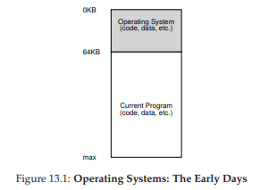
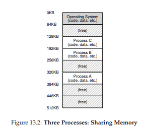
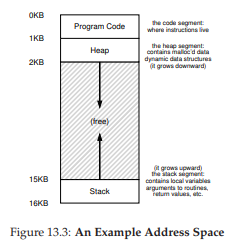

# 13 Trừu tượng hóa: Address Spaces (Không gian địa chỉ)

Trong những ngày đầu, việc xây dựng hệ thống máy tính khá đơn giản. Vì sao vậy, bạn hỏi ư? Bởi vì người dùng chẳng kỳ vọng gì nhiều. Chính những người dùng khó tính, với những mong đợi về “dễ sử dụng”, “hiệu năng cao”, “độ tin cậy”, v.v., đã dẫn đến hàng loạt đau đầu này. Lần tới nếu bạn gặp một người dùng máy tính, hãy cảm ơn họ vì tất cả những vấn đề mà họ đã gây ra.

## 13.1 Các hệ thống ban đầu

Từ góc nhìn bộ nhớ, các máy tính ban đầu không cung cấp nhiều sự trừu tượng hóa cho người dùng. Về cơ bản, bộ nhớ vật lý của máy tính trông giống như Hình 13.1 (trang 2). Hệ điều hành (OS – Operating System) chỉ là một tập hợp các thủ tục (thực chất là một thư viện) được nạp vào bộ nhớ (bắt đầu từ địa chỉ vật lý 0 trong ví dụ này). Sau đó sẽ có một chương trình đang chạy (một process – tiến trình) được nạp vào bộ nhớ vật lý (bắt đầu từ địa chỉ 64KB trong ví dụ này) và chiếm phần còn lại của bộ nhớ. Không có nhiều “ảo tưởng” nào ở đây, và người dùng cũng chẳng kỳ vọng nhiều từ hệ điều hành. Quả thật, cuộc sống dễ dàng biết bao cho các lập trình viên hệ điều hành thời đó, phải không?

## 13.2 Multiprogramming và Time Sharing

Sau một thời gian, vì máy tính rất đắt đỏ, con người bắt đầu chia sẻ máy tính hiệu quả hơn. Thế là kỷ nguyên của multiprogramming (đa chương trình) ra đời [DV66], trong đó nhiều process sẵn sàng chạy tại cùng một thời điểm, và hệ điều hành sẽ luân phiên chuyển đổi giữa chúng, ví dụ khi một process thực hiện một thao tác I/O. Cách làm này giúp tăng hiệu quả sử dụng CPU. Việc nâng cao hiệu suất đặc biệt quan trọng trong thời kỳ mà mỗi máy tính có giá hàng trăm nghìn, thậm chí hàng triệu đô la (và bạn còn nghĩ chiếc Mac của mình đắt sao!).

Chẳng bao lâu sau, con người lại tiếp tục đòi hỏi nhiều hơn, và kỷ nguyên time sharing (chia sẻ thời gian) ra đời [S59, L60, M62, M83]. Đặc biệt, nhiều người nhận ra hạn chế của batch computing (xử lý theo lô), nhất là đối với lập trình viên [CV65], những người mệt mỏi với chu kỳ debug dài dằng dặc (và do đó kém hiệu quả). Khái niệm tính tương tác trở nên quan trọng, khi nhiều người dùng có thể đồng thời sử dụng cùng một máy, mỗi người đều mong đợi một phản hồi kịp thời từ task (nhiệm vụ) mà họ đang thực thi.



*Figure 13.1: Operating Systems: The Early Days*

Một cách để hiện thực time sharing là chạy một process trong một khoảng thời gian ngắn, cho phép nó truy cập toàn bộ bộ nhớ (Hình 13.1), rồi dừng nó lại, lưu toàn bộ trạng thái của nó xuống đĩa (bao gồm toàn bộ bộ nhớ vật lý), sau đó nạp trạng thái của một process khác, cho nó chạy một lúc, và cứ thế tạo nên một cơ chế chia sẻ máy tính thô sơ [M+63].

Thật không may, cách tiếp cận này có một vấn đề lớn: nó quá chậm, đặc biệt khi bộ nhớ ngày càng lớn. Việc lưu và khôi phục trạng thái ở mức thanh ghi (PC, thanh ghi đa dụng, v.v.) thì khá nhanh, nhưng lưu toàn bộ nội dung bộ nhớ xuống đĩa là cực kỳ kém hiệu năng. Vì vậy, ta muốn giữ các process ở trong bộ nhớ và chỉ cần chuyển đổi giữa chúng, cho phép hệ điều hành thực hiện time sharing hiệu quả hơn (như minh họa trong Hình 13.2, trang 3).

Trong sơ đồ, có ba process (A, B, và C), mỗi cái chiếm một phần nhỏ trong bộ nhớ vật lý 512KB. Giả sử chỉ có một CPU, hệ điều hành sẽ chọn chạy một trong số các process (ví dụ A), trong khi các process còn lại (B và C) ngồi trong ready queue (hàng đợi sẵn sàng) chờ đến lượt.

Khi time sharing trở nên phổ biến, bạn có thể đoán ra rằng những yêu cầu mới được đặt lên hệ điều hành. Đặc biệt, việc cho phép nhiều chương trình cùng tồn tại trong bộ nhớ khiến vấn đề protection (bảo vệ) trở thành mối quan tâm lớn; ta không muốn một process có thể đọc, hay tệ hơn là ghi vào bộ nhớ của process khác.




**Hình 13.2: Ba process chia sẻ bộ nhớ**

## 13.3 Address Space (Không gian địa chỉ)

Tuy nhiên, ta vẫn phải lưu ý đến những người dùng khó tính kia, và điều đó đòi hỏi hệ điều hành phải tạo ra một trừu tượng hóa dễ sử dụng của bộ nhớ vật lý. Ta gọi trừu tượng hóa này là **address space (không gian địa chỉ)**, và nó chính là cách mà chương trình đang chạy nhìn thấy bộ nhớ trong hệ thống. Hiểu được trừu tượng hóa nền tảng này là chìa khóa để nắm được cách virtual memory (bộ nhớ ảo) hoạt động.

Address space của một process chứa toàn bộ trạng thái bộ nhớ của chương trình đang chạy. Ví dụ, code (mã lệnh) của chương trình phải nằm đâu đó trong bộ nhớ, và do đó nó thuộc về address space. Trong khi chạy, chương trình dùng stack để lưu dấu vết trong chuỗi lời gọi hàm cũng như để cấp phát biến cục bộ, truyền tham số và trả giá trị cho các thủ tục. Cuối cùng, heap được dùng để quản lý bộ nhớ cấp phát động, ví dụ như thông qua `malloc()` trong C hoặc `new` trong ngôn ngữ hướng đối tượng như C++ hoặc Java. Tất nhiên còn nhiều thành phần khác (ví dụ biến được khởi tạo tĩnh), nhưng để đơn giản ta giả định chỉ có ba thành phần: code, stack và heap.

Trong ví dụ ở Hình 13.3 (trang 4), ta có một address space rất nhỏ (chỉ 16KB) ^[1]. Code của chương trình nằm ở đầu address space (bắt đầu từ 0 trong ví dụ này, chiếm 1KB đầu tiên). Code là tĩnh (không thay đổi kích thước trong quá trình chạy), nên ta có thể dễ dàng đặt nó ở đầu address space.

^[1]: Ta thường dùng ví dụ nhỏ như thế này vì (a) rất bất tiện để minh họa một address space 32-bit và (b) toán học sẽ phức tạp hơn. Chúng tôi thích toán học đơn giản.




**Hình 13.3: Ví dụ về một address space**

Tiếp theo là hai vùng trong address space có thể thay đổi (lớn lên hoặc nhỏ đi) khi chương trình chạy: heap (ở phía trên) và stack (ở phía dưới). Ta sắp xếp như vậy để mỗi vùng có thể phát triển theo hướng riêng: heap bắt đầu sau code (tại 1KB) và phát triển xuống dưới (khi người dùng yêu cầu thêm bộ nhớ bằng `malloc()`); stack bắt đầu từ 16KB và phát triển lên trên (mỗi khi có lời gọi hàm). Tuy nhiên, cách sắp xếp này chỉ là quy ước; ta hoàn toàn có thể bố trí khác (và khi nhiều thread cùng tồn tại trong một address space, mô hình này không còn phù hợp nữa).

Điều quan trọng cần nhớ là address space chỉ là một **trừu tượng hóa** mà hệ điều hành cung cấp cho chương trình đang chạy. Thực tế, chương trình không thực sự nằm trong bộ nhớ tại địa chỉ 0 đến 16KB; nó được nạp vào những địa chỉ vật lý khác nhau. Quan sát process A, B và C trong Hình 13.2, ta thấy chúng được nạp vào các địa chỉ vật lý khác nhau. Và do đó, vấn đề nảy sinh:

> **THE CRUX: HOW TO VIRTUALIZE MEMORY**
> **Điểm mấu chốt: Làm thế nào để ảo hóa bộ nhớ**
> Làm thế nào hệ điều hành có thể xây dựng trừu tượng hóa về một address space riêng tư, tiềm năng rất lớn, cho nhiều process đang chạy (tất cả cùng chia sẻ bộ nhớ) chỉ dựa trên một bộ nhớ vật lý duy nhất?

Khi làm được điều này, ta nói hệ điều hành đang **ảo hóa bộ nhớ**, bởi vì chương trình nghĩ rằng nó được nạp vào bộ nhớ tại một địa chỉ cụ thể (ví dụ 0) và có một address space lớn (32-bit hoặc 64-bit), trong khi thực tế thì khác.

Ví dụ, khi process A trong Hình 13.2 cố gắng đọc từ địa chỉ 0 (virtual address – địa chỉ ảo), hệ điều hành cùng với phần cứng phải đảm bảo rằng thao tác đó không thực sự đọc từ địa chỉ vật lý 0 mà từ địa chỉ 320KB (nơi A được nạp). Đây chính là chìa khóa của virtual memory, nền tảng của mọi hệ thống máy tính hiện đại.

## 13.4 Các mục tiêu

Vậy công việc của hệ điều hành trong phần này là: **ảo hóa bộ nhớ**. Nhưng không chỉ đơn giản là ảo hóa, hệ điều hành phải làm điều đó một cách **hiệu quả**. Để đạt được điều này, ta cần một số mục tiêu định hướng (như đã từng thấy ở phần Giới thiệu).

Mục tiêu chính của một hệ thống virtual memory (VM) là **transparency (tính trong suốt)**. Hệ điều hành phải triển khai virtual memory sao cho hoàn toàn **vô hình** với chương trình đang chạy. Chương trình không nên biết rằng bộ nhớ đang được ảo hóa; nó phải hành xử như thể có bộ nhớ vật lý riêng. Phía sau, hệ điều hành (và phần cứng) sẽ thực hiện mọi công việc để chia sẻ bộ nhớ giữa nhiều job khác nhau, tạo nên ảo tưởng đó.

Một mục tiêu khác của VM là **efficiency (hiệu quả)**. Hệ điều hành phải ảo hóa bộ nhớ sao cho ít tốn kém nhất, cả về thời gian (chương trình không bị chạy chậm đi đáng kể) lẫn không gian (không tiêu tốn quá nhiều bộ nhớ cho cấu trúc hỗ trợ ảo hóa). Để đạt hiệu quả về thời gian, hệ điều hành phải dựa vào phần cứng, bao gồm các tính năng như TLB (Translation Lookaside Buffer – bộ đệm tra cứu nhanh), mà ta sẽ học sau.

Cuối cùng, mục tiêu thứ ba là **protection (bảo vệ)**. Hệ điều hành phải đảm bảo rằng các process được bảo vệ lẫn nhau, và hệ điều hành cũng được bảo vệ khỏi process. Khi một process thực hiện load, store hay instruction fetch, nó không được phép truy cập hay tác động đến bộ nhớ của process khác hoặc của hệ điều hành. Đây chính là nguyên lý **isolation (cách ly)**, giúp mỗi process chạy trong môi trường độc lập, an toàn trước lỗi hoặc sự tấn công.

^[2]: Việc sử dụng từ “transparency” (tính trong suốt) đôi khi gây nhầm lẫn; một số sinh viên nghĩ rằng nó nghĩa là “mọi thứ phải minh bạch”, như chính phủ cần minh bạch. Ở đây, nghĩa ngược lại: ảo tưởng do hệ điều hành tạo ra **không được lộ ra** trước ứng dụng. Trong ngôn ngữ CNTT, một hệ thống “transparent” là hệ thống khó nhận thấy, chứ không phải hệ thống công khai thông tin.


> **TIP: THE PRINCIPLE OF ISOLATION**
> **Nguyên lý cách ly**
> Isolation là nguyên lý then chốt trong việc xây dựng hệ thống tin cậy. Nếu hai thực thể được cách ly đúng cách, một cái có thể hỏng mà không ảnh hưởng đến cái kia. Hệ điều hành luôn cố gắng cách ly các process để ngăn chúng gây hại cho nhau. Thông qua isolation ở mức bộ nhớ, hệ điều hành đảm bảo rằng chương trình không thể tác động đến hoạt động của OS. Một số hệ điều hành hiện đại còn cách ly các thành phần của chính OS với nhau. Các microkernel [BH70, R+89, S+03] có thể cung cấp độ tin cậy cao hơn so với các thiết kế monolithic kernel (kernel nguyên khối).


Trong các chương tiếp theo, ta sẽ tập trung vào các cơ chế nền tảng để ảo hóa bộ nhớ, bao gồm cả hỗ trợ phần cứng và phần mềm. Ta cũng sẽ xem xét các chính sách quản lý bộ nhớ quan trọng, chẳng hạn cách quản lý free space (không gian trống) và cách chọn trang nào sẽ bị loại bỏ khi bộ nhớ thiếu chỗ. Qua đó, bạn sẽ hiểu rõ hơn cách một hệ thống virtual memory hiện đại thực sự vận hành ^[3].

^[3]: Hoặc, chúng tôi sẽ khiến bạn bỏ học. Nhưng kiên nhẫn nào; nếu bạn vượt qua VM, bạn có thể đi đến cuối khóa!

## 13.5 Tóm tắt

Chúng ta đã thấy sự ra đời của một phân hệ quan trọng trong hệ điều hành: **virtual memory**. VM chịu trách nhiệm cung cấp ảo tưởng về một address space lớn, thưa thớt, riêng biệt cho mỗi chương trình. Mỗi address space chứa toàn bộ code và dữ liệu của chương trình, được tham chiếu thông qua virtual address. Hệ điều hành, cùng với phần cứng, sẽ chuyển đổi các virtual address này thành physical address, để truy cập dữ liệu thực sự. Hệ điều hành thực hiện dịch vụ này đồng thời cho nhiều process, đảm bảo sự bảo vệ lẫn nhau và bảo vệ cả hệ điều hành. Cách tiếp cận này đòi hỏi nhiều cơ chế ở mức thấp cũng như các chính sách quan trọng; ta sẽ bắt đầu từ các cơ chế cơ bản trước. Và bây giờ, ta tiếp tục!


> **ASIDE: EVERY ADDRESS YOU SEE IS VIRTUAL**
> **Mỗi địa chỉ bạn thấy đều là địa chỉ ảo**
> Bạn đã bao giờ viết một chương trình C in ra con trỏ chưa? Giá trị bạn thấy (một số lớn, thường in dưới dạng hexa) là một virtual address. Bạn có từng thắc mắc code của chương trình nằm ở đâu không? Bạn cũng có thể in nó ra, và nếu in được, nó cũng là một virtual address. Thực tế, mọi địa chỉ bạn thấy với tư cách lập trình viên cấp user-level đều là virtual address. Chỉ có hệ điều hành (và phần cứng) mới biết chúng ánh xạ đến đâu trong bộ nhớ vật lý. Hãy nhớ: nếu bạn in ra một địa chỉ trong chương trình, đó là địa chỉ ảo – một ảo tưởng về cách bộ nhớ được bố trí. Chỉ hệ điều hành và phần cứng mới biết sự thật.
>
> Đây là một chương trình nhỏ (va.c) in ra vị trí của `main()` (nơi code nằm), một giá trị heap được cấp phát từ `malloc()`, và vị trí của một biến int trên stack:
>
> ```c
> #include <stdio.h>
> #include <stdlib.h>
> int main(int argc, char *argv[]) {
>     printf("location of code : %p\n", main);
>     printf("location of heap : %p\n", malloc(100e6));
>     int x = 3;
>     printf("location of stack: %p\n", &x);
>     return x;
> }
> ```
>
> Khi chạy trên một máy Mac 64-bit, ta thu được kết quả:
>
> ```
> location of code : 0x1095afe50
> location of heap : 0x1096008c0
> location of stack: 0x7fff691aea64
> ```
>
> Từ đây, bạn có thể thấy code nằm ở đầu address space, tiếp đó là heap, còn stack ở tận cuối không gian địa chỉ. Tất cả những địa chỉ này đều là virtual address, và sẽ được hệ điều hành cùng phần cứng dịch sang địa chỉ vật lý thực tế để lấy dữ liệu.
