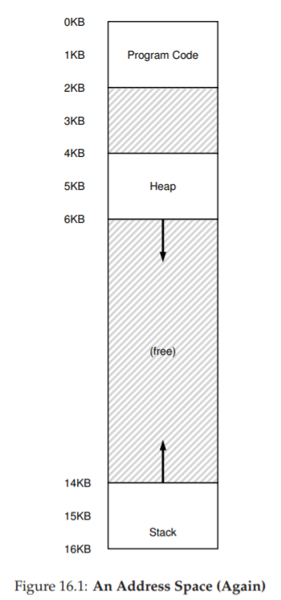
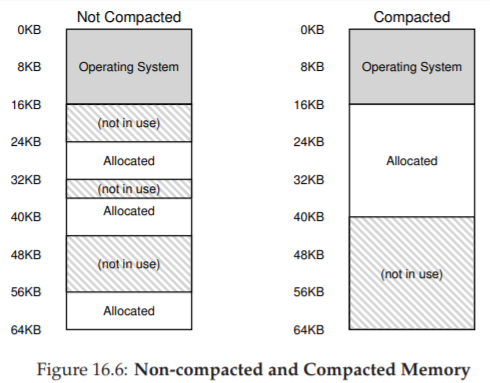

# 16 Segmentation (Phân đoạn bộ nhớ)

Cho đến nay, chúng ta đã đặt toàn bộ **address space** (không gian địa chỉ) của mỗi **process** (tiến trình) vào bộ nhớ. Với **base register** (thanh ghi cơ sở) và **bounds register** (thanh ghi giới hạn), **OS** (hệ điều hành) có thể dễ dàng tái định vị (relocate) các process sang các vị trí khác nhau trong **physical memory** (bộ nhớ vật lý). Tuy nhiên, bạn có thể nhận thấy một điều thú vị về các address space này: có một khoảng “trống” lớn ngay ở giữa, giữa **stack** và **heap**.

Như bạn có thể hình dung từ *Figure 16.1*, mặc dù khoảng trống giữa stack và heap không được process sử dụng, nó vẫn chiếm physical memory khi chúng ta tái định vị toàn bộ address space vào một vị trí nào đó trong physical memory. Do đó, cách tiếp cận đơn giản sử dụng một cặp base–bounds register để ảo hóa bộ nhớ là lãng phí. Nó cũng khiến việc chạy một chương trình trở nên khó khăn khi toàn bộ address space không thể vừa trong bộ nhớ; vì vậy, cơ chế base and bounds không linh hoạt như mong muốn. Và do đó:

> **THE CRUX: HOW TO SUPPORT A LARGE ADDRESS SPACE**  
> Làm thế nào để hỗ trợ một address space lớn với (có thể) rất nhiều khoảng trống giữa stack và heap? Lưu ý rằng trong các ví dụ của chúng ta, với address space nhỏ (giả định), sự lãng phí có vẻ không quá nghiêm trọng. Tuy nhiên, hãy tưởng tượng một address space 32-bit (kích thước 4 GB); một chương trình điển hình chỉ sử dụng vài megabyte bộ nhớ, nhưng vẫn yêu cầu toàn bộ address space phải nằm trong bộ nhớ.


## 16.1 Segmentation: Generalized Base/Bounds

Để giải quyết vấn đề này, một ý tưởng đã ra đời, gọi là **segmentation** (phân đoạn bộ nhớ). Đây là một ý tưởng khá cũ, xuất hiện ít nhất từ đầu những năm 1960 [H61, G62]. Ý tưởng rất đơn giản: thay vì chỉ có một cặp base–bounds register trong **MMU** (Memory Management Unit — đơn vị quản lý bộ nhớ), tại sao không có một cặp base–bounds cho mỗi **logical segment** (đoạn logic) của address space?  

**Segment** là một phần liên tục của address space với độ dài xác định. Trong address space chuẩn của chúng ta, có ba segment khác nhau về mặt logic: **code**, **stack**, và **heap**. Segmentation cho phép OS đặt từng segment này ở các vị trí khác nhau trong physical memory, từ đó tránh việc lấp đầy physical memory bằng các vùng virtual address space không sử dụng.



**Figure 16.1: An Address Space (Again)**  
*(Một không gian địa chỉ — minh họa lại)*

Hãy xem một ví dụ. Giả sử chúng ta muốn đặt address space từ *Figure 16.1* vào physical memory. Với một cặp base–bounds cho mỗi segment, chúng ta có thể đặt từng segment độc lập trong physical memory. Ví dụ, xem *Figure 16.2* (trang 3); ở đó bạn thấy một physical memory 64 KB với ba segment này (và 16 KB dành riêng cho OS).


**Figure 16.2: Placing Segments In Physical Memory**  
*(Đặt các segment trong bộ nhớ vật lý)*

Như bạn thấy trong sơ đồ, chỉ vùng bộ nhớ được sử dụng mới chiếm chỗ trong physical memory; do đó, các address space lớn với nhiều vùng không sử dụng (thường gọi là **sparse address spaces**) vẫn có thể được chứa.  

Cấu trúc phần cứng trong MMU để hỗ trợ segmentation đúng như bạn mong đợi: trong trường hợp này, là một tập hợp ba cặp base–bounds register. *Figure 16.3* dưới đây cho thấy giá trị các thanh ghi cho ví dụ trên; mỗi bounds register lưu kích thước của một segment.


Segment | Base | Size
--- | --- | --- 
Code | 32K | 2K
Heap | 34K | 3K
Stack | 28K | 2K

**Figure 16.3: Segment Register Values**  
*(Giá trị thanh ghi phân đoạn)*

Bạn có thể thấy từ hình rằng **code segment** được đặt tại địa chỉ vật lý 32 KB và có kích thước 2 KB, còn **heap segment** được đặt tại 34 KB và có kích thước 3 KB. Giá trị kích thước segment ở đây giống hệt bounds register đã giới thiệu trước đó; nó cho phần cứng biết chính xác có bao nhiêu byte hợp lệ trong segment này (và do đó, cho phép phần cứng xác định khi nào chương trình truy cập trái phép ra ngoài giới hạn).

Hãy làm một ví dụ dịch địa chỉ, sử dụng address space trong *Figure 16.1*. Giả sử có một tham chiếu tới virtual address 100 (nằm trong code segment, như thấy trực quan ở *Figure 16.1*, trang 2). Khi tham chiếu diễn ra (ví dụ, khi nạp lệnh), phần cứng sẽ cộng giá trị base với offset trong segment này (100 trong trường hợp này) để ra địa chỉ vật lý mong muốn: 100 + 32 KB = 32868. Sau đó, nó kiểm tra địa chỉ có nằm trong bounds hay không (100 < 2 KB), thấy hợp lệ, và gửi yêu cầu tới địa chỉ vật lý 32868.

> **ASIDE: THE SEGMENTATION FAULT**  
> Thuật ngữ **segmentation fault** hoặc **segmentation violation** xuất phát từ việc truy cập bộ nhớ trái phép trên một máy sử dụng segmentation. Thú vị là thuật ngữ này vẫn tồn tại, ngay cả trên các máy không hỗ trợ segmentation. Hoặc không thú vị lắm, nếu bạn không hiểu tại sao code của mình liên tục bị lỗi.

Bây giờ, hãy xem một địa chỉ trong heap: virtual address 4200 (xem lại *Figure 16.1*). Nếu chỉ cộng virtual address 4200 với base của heap (34 KB), ta được địa chỉ vật lý 39016 — đây không phải kết quả đúng. Trước tiên, ta cần lấy **offset** trong heap, tức là byte nào trong segment này địa chỉ đang trỏ tới. Vì heap bắt đầu tại virtual address 4 KB (4096), offset của 4200 là 4200 − 4096 = 104. Sau đó, ta cộng offset này (104) với base register của heap (34 KB) để được kết quả đúng: 34920.

Nếu ta thử truy cập một địa chỉ trái phép (ví dụ: virtual address ≥ 7 KB, vượt quá cuối heap), phần cứng sẽ phát hiện địa chỉ vượt giới hạn, tạo **trap** vào OS, và nhiều khả năng dẫn tới việc chấm dứt process vi phạm. Và giờ bạn đã biết nguồn gốc của thuật ngữ mà mọi lập trình viên C đều e ngại: segmentation violation hoặc segmentation fault.


## 16.2 Which Segment Are We Referring To?  
(Chúng ta đang tham chiếu tới segment nào?)

Phần cứng sử dụng **segment register** trong quá trình dịch địa chỉ. Làm thế nào nó biết offset trong segment và địa chỉ thuộc segment nào?

Một cách tiếp cận phổ biến, đôi khi gọi là **explicit approach** (cách tiếp cận tường minh), là chia address space thành các segment dựa trên một vài bit cao nhất của virtual address; kỹ thuật này được sử dụng trong hệ thống **VAX/VMS** [LL82]. Trong ví dụ của chúng ta, có ba segment; do đó cần 2 bit để thực hiện. Nếu dùng 2 bit cao nhất của virtual address 14-bit để chọn segment, virtual address sẽ trông như sau:


Trong ví dụ này, nếu 2 bit cao nhất là `00`, phần cứng biết virtual address nằm trong code segment, và sẽ dùng cặp base–bounds của code để dịch địa chỉ sang physical address đúng. Nếu 2 bit cao nhất là `01`, phần cứng biết địa chỉ nằm trong heap, và sẽ dùng cặp base–bounds của heap.

Hãy lấy lại ví dụ heap virtual address ở trên (4200) và dịch nó để làm rõ. Virtual address 4200 ở dạng nhị phân:


Như bạn có thể thấy từ hình minh họa, **2 bit cao nhất** (01) cho phần cứng biết chúng ta đang tham chiếu đến **segment** (phân đoạn) nào. **12 bit thấp** còn lại là **offset** (độ lệch) bên trong segment: `0000 0110 1000`, hay ở dạng hex là `0x068`, hoặc 104 ở hệ thập phân.  

Do đó, phần cứng chỉ cần lấy 2 bit cao nhất để xác định **segment register** (thanh ghi phân đoạn) cần sử dụng, sau đó lấy 12 bit tiếp theo làm offset trong segment. Bằng cách cộng **base register** (thanh ghi cơ sở) với offset, phần cứng sẽ tính ra **địa chỉ vật lý** (physical address) cuối cùng.  

Lưu ý rằng offset cũng giúp việc kiểm tra giới hạn (**bounds check**) trở nên đơn giản hơn: chúng ta chỉ cần kiểm tra xem offset có nhỏ hơn giá trị bounds hay không; nếu không, địa chỉ đó là bất hợp lệ.  

Vì vậy, nếu base và bounds được lưu trong các mảng (mỗi phần tử ứng với một segment), phần cứng sẽ thực hiện tương tự như đoạn mã sau để lấy được địa chỉ vật lý mong muốn:

```c
// lấy 2 bit cao nhất của VA (Virtual Address - địa chỉ ảo) 14-bit
Segment = (VirtualAddress & SEG_MASK) >> SEG_SHIFT;
// lấy offset
Offset = VirtualAddress & OFFSET_MASK;
if (Offset >= Bounds[Segment]) {
  RaiseException(PROTECTION_FAULT);
} else {
  PhysAddr = Base[Segment] + Offset;
}
Register = AccessMemory(PhysAddr);
```

Trong ví dụ đang xét, chúng ta có thể gán giá trị cho các hằng số ở trên. Cụ thể:  
- `SEG_MASK` sẽ được đặt là `0x3000`  
- `SEG_SHIFT` là 12  
- `OFFSET_MASK` là `0xFFF`  

Bạn cũng có thể nhận thấy rằng khi chúng ta dùng 2 bit cao nhất, nhưng chỉ có **3 segment** (code, heap, stack), thì sẽ có một segment trong không gian địa chỉ (**address space**) không được sử dụng.  

Để tận dụng tối đa **virtual address space** (bộ nhớ ảo) và tránh lãng phí một segment, một số hệ thống đặt code chung với heap trong cùng một segment, và do đó chỉ cần dùng **1 bit** để chọn segment cần sử dụng [LL82].  

Một vấn đề khác khi sử dụng một số bit cao nhất để chọn **segment** (đoạn bộ nhớ) là nó giới hạn việc sử dụng **virtual address space** (không gian địa chỉ ảo). Cụ thể, mỗi segment bị giới hạn ở một kích thước tối đa, trong ví dụ của chúng ta là 4 KB (việc dùng 2 bit cao nhất để chọn segment ngụ ý rằng address space 16 KB sẽ bị chia thành 4 phần, tức mỗi phần 4 KB). Nếu một chương trình đang chạy muốn mở rộng một segment (ví dụ heap hoặc stack) vượt quá giới hạn này, chương trình sẽ không thể thực hiện được.

Có những cách khác để phần cứng xác định một địa chỉ thuộc segment nào. Trong **implicit approach** (cách tiếp cận ngầm định), phần cứng xác định segment bằng cách quan sát cách địa chỉ được hình thành. Ví dụ, nếu địa chỉ được tạo ra từ **program counter** (tức là khi nạp lệnh — instruction fetch), thì địa chỉ đó thuộc code segment; nếu địa chỉ dựa trên **stack pointer** hoặc **base pointer**, nó phải thuộc stack segment; bất kỳ địa chỉ nào khác sẽ thuộc heap.


## 16.3 What About The Stack? (Còn stack thì sao?)

Cho đến giờ, chúng ta đã bỏ qua một thành phần quan trọng của address space: **stack**. Stack đã được tái định vị tới địa chỉ vật lý 28 KB trong sơ đồ ở trên, nhưng có một điểm khác biệt quan trọng: nó **tăng trưởng ngược** (tức là hướng về các địa chỉ thấp hơn). Trong physical memory, nó “bắt đầu” tại 28 KB[^1] và phát triển ngược về 26 KB, tương ứng với virtual address từ 16 KB đến 14 KB; do đó, quá trình dịch địa chỉ phải thực hiện khác đi.

Điều đầu tiên chúng ta cần là một chút hỗ trợ bổ sung từ phần cứng. Thay vì chỉ lưu giá trị base và bounds, phần cứng cũng cần biết hướng tăng trưởng của segment (ví dụ: một bit được đặt là 1 nếu segment tăng theo hướng địa chỉ dương, và 0 nếu tăng theo hướng âm). Cách nhìn cập nhật về những gì phần cứng theo dõi được thể hiện trong *Figure 16.4*:

Segment | Base | Size (max 4K) | Grows Positive?
--- | --- | --- | ---
Code 00 | 32K | 2K | 1
Heap 01 | 34K | 3K | 1
Stack 11 | 28K | 2K | 0

**Figure 16.4: Segment Registers (With Negative-Growth Support)**  
*(Thanh ghi phân đoạn với hỗ trợ tăng trưởng ngược)*

Khi phần cứng hiểu rằng segment có thể tăng trưởng theo hướng âm, nó phải dịch các virtual address như vậy theo cách hơi khác. Hãy lấy một ví dụ về địa chỉ stack ảo và dịch nó để hiểu quy trình.

Trong ví dụ này, giả sử chúng ta muốn truy cập virtual address 15 KB, vốn sẽ ánh xạ tới physical address 27 KB. Virtual address này ở dạng nhị phân là:  
`11 1100 0000 0000` (hex `0x3C00`).  

Phần cứng dùng 2 bit cao nhất (`11`) để xác định segment, sau đó còn lại offset là 3 KB. Để có được offset âm đúng, ta phải lấy 3 KB trừ đi kích thước tối đa của segment: trong ví dụ này, một segment có thể là 4 KB, do đó offset âm đúng là 3 KB − 4 KB = −1 KB. Ta chỉ cần cộng offset âm (−1 KB) này với base (28 KB) để ra physical address đúng: 27 KB.  

Việc kiểm tra bounds có thể được thực hiện bằng cách đảm bảo giá trị tuyệt đối của offset âm nhỏ hơn hoặc bằng kích thước hiện tại của segment (trong trường hợp này là 2 KB).

[^1]: Mặc dù để đơn giản, chúng ta nói stack “bắt đầu” tại 28 KB, nhưng thực tế giá trị này là byte ngay **trước** vùng tăng trưởng ngược; byte hợp lệ đầu tiên thực sự là 28 KB trừ 1. Ngược lại, các vùng tăng trưởng xuôi bắt đầu tại địa chỉ của byte đầu tiên của segment. Chúng ta chọn cách này vì nó giúp việc tính toán physical address trở nên đơn giản: physical address chỉ là base cộng với offset âm.


## 16.4 Support for Sharing (Hỗ trợ chia sẻ)

Khi hỗ trợ segmentation phát triển, các nhà thiết kế hệ thống sớm nhận ra rằng họ có thể đạt được những hiệu quả mới với một chút hỗ trợ phần cứng bổ sung. Cụ thể, để tiết kiệm bộ nhớ, đôi khi việc chia sẻ một số segment giữa các address space là hữu ích. Đặc biệt, **code sharing** (chia sẻ mã lệnh) là phổ biến và vẫn được sử dụng trong các hệ thống ngày nay.

Để hỗ trợ chia sẻ, chúng ta cần thêm một chút hỗ trợ từ phần cứng, dưới dạng **protection bits** (các bit bảo vệ). Hỗ trợ cơ bản thêm một vài bit cho mỗi segment, cho biết chương trình có thể đọc hoặc ghi segment hay không, hoặc có thể thực thi mã nằm trong segment đó hay không. Bằng cách đặt code segment ở chế độ chỉ đọc (**read-only**), cùng một mã lệnh có thể được chia sẻ giữa nhiều process, mà không lo ảnh hưởng đến tính cách ly; trong khi mỗi process vẫn nghĩ rằng nó đang truy cập bộ nhớ riêng, OS thực chất đang chia sẻ vùng bộ nhớ không thể bị process sửa đổi, do đó ảo tưởng này được duy trì.

Một ví dụ về thông tin bổ sung được phần cứng (và OS) theo dõi được thể hiện trong *Figure 16.5*. Như bạn thấy, code segment được đặt ở chế độ đọc và thực thi (**read** và **execute**), do đó cùng một segment vật lý trong bộ nhớ có thể được ánh xạ vào nhiều virtual address space.

Segment | Base | Size (max 4K) | Grows Positive? | Protection
--- | --- | --- | --- | ---
Code 00 | 32K | 2K | 1 | Read-Execute
Heap 01 | 34K | 3K | 1 | Read-Write
Stack 11 | 28K | 2K | 0 | Read-Write

**Figure 16.5: Segment Register Values (with Protection)**  
*(Giá trị thanh ghi phân đoạn với bảo vệ)*

Với protection bits, thuật toán phần cứng đã mô tả trước đó cũng phải thay đổi. Ngoài việc kiểm tra virtual address có nằm trong bounds hay không, phần cứng còn phải kiểm tra xem một truy cập cụ thể có được phép hay không. Nếu một user process cố ghi vào segment chỉ đọc, hoặc thực thi từ segment không cho phép thực thi, phần cứng sẽ phát sinh **exception**, và OS sẽ xử lý process vi phạm.


## 16.5 Fine-grained vs. Coarse-grained Segmentation  
(Phân đoạn mịn so với phân đoạn thô)

Hầu hết các ví dụ của chúng ta cho đến nay tập trung vào các hệ thống chỉ có một vài segment (ví dụ: code, stack, heap); chúng ta có thể coi segmentation này là **coarse-grained** (phân đoạn thô), vì nó chia address space thành các khối lớn, thô. Tuy nhiên, một số hệ thống đời đầu (ví dụ: **Multics** [CV65, DD68]) linh hoạt hơn và cho phép address space bao gồm một số lượng lớn các segment nhỏ hơn, gọi là **fine-grained segmentation** (phân đoạn mịn).



Hỗ trợ nhiều segment đòi hỏi thêm hỗ trợ phần cứng, với một **segment table** (bảng phân đoạn) nào đó được lưu trong bộ nhớ. Các bảng phân đoạn như vậy thường hỗ trợ tạo ra một số lượng rất lớn segment, cho phép hệ thống sử dụng segment theo những cách linh hoạt hơn so với những gì chúng ta đã thảo luận. Ví dụ, các máy đời đầu như **Burroughs B5000** hỗ trợ hàng nghìn segment, và mong đợi trình biên dịch (compiler) chia nhỏ code và dữ liệu thành các segment riêng biệt mà OS và phần cứng sẽ hỗ trợ [RK68]. Suy nghĩ vào thời điểm đó là: bằng cách có các segment mịn, OS có thể hiểu rõ hơn segment nào đang được sử dụng và segment nào không, từ đó tận dụng **main memory** (bộ nhớ chính) hiệu quả hơn.

## 16.6 OS Support (Hỗ trợ từ Hệ điều hành)

Đến đây, bạn đã có một ý tưởng cơ bản về cách **segmentation** (phân đoạn bộ nhớ) hoạt động. Các phần của **address space** (không gian địa chỉ) được tái định vị (relocate) vào **physical memory** (bộ nhớ vật lý) khi hệ thống chạy, và nhờ đó tiết kiệm được một lượng lớn physical memory so với cách tiếp cận đơn giản chỉ dùng một cặp **base/bounds register** (thanh ghi cơ sở/giới hạn) cho toàn bộ address space. Cụ thể, toàn bộ vùng trống giữa **stack** và **heap** không cần phải được cấp phát trong physical memory, cho phép chúng ta chứa nhiều address space hơn trong physical memory và hỗ trợ một virtual address space (bộ nhớ ảo) lớn và thưa (sparse) cho mỗi **process** (tiến trình).

Tuy nhiên, segmentation đặt ra một số vấn đề mới cho **OS** (hệ điều hành). Vấn đề đầu tiên là một vấn đề cũ: OS nên làm gì khi xảy ra **context switch** (chuyển ngữ cảnh)? Có lẽ bạn đã đoán được: các **segment register** (thanh ghi phân đoạn) phải được lưu và khôi phục. Rõ ràng, mỗi process có virtual address space riêng, và OS phải đảm bảo thiết lập đúng các thanh ghi này trước khi cho process chạy lại.

Vấn đề thứ hai là sự tương tác của OS khi các segment tăng (hoặc giảm) kích thước. Ví dụ, một chương trình có thể gọi `malloc()` để cấp phát một đối tượng. Trong một số trường hợp, heap hiện tại có thể đáp ứng yêu cầu, và `malloc()` sẽ tìm vùng trống cho đối tượng và trả về một con trỏ cho hàm gọi. Tuy nhiên, trong các trường hợp khác, chính heap segment có thể cần mở rộng. Khi đó, thư viện cấp phát bộ nhớ sẽ thực hiện một **system call** (lời gọi hệ thống) để mở rộng heap (ví dụ: system call `sbrk()` truyền thống của UNIX). OS sau đó (thường) sẽ cấp thêm không gian, cập nhật **segment size register** (thanh ghi kích thước segment) thành kích thước mới (lớn hơn), và thông báo cho thư viện biết việc mở rộng thành công; thư viện khi đó có thể cấp phát vùng nhớ cho đối tượng mới và trả về thành công cho chương trình gọi. Lưu ý rằng OS có thể từ chối yêu cầu nếu không còn physical memory, hoặc nếu nó quyết định rằng process gọi đã sử dụng quá nhiều.

> **TIP: IF 1000 SOLUTIONS EXIST, NO GREAT ONE DOES**  
> Việc tồn tại quá nhiều thuật toán khác nhau nhằm giảm thiểu **external fragmentation** (phân mảnh bên ngoài) cho thấy một sự thật cơ bản hơn: không có một cách “tốt nhất” để giải quyết vấn đề. Do đó, chúng ta chọn một giải pháp hợp lý và hy vọng nó đủ tốt. Giải pháp thực sự duy nhất (như chúng ta sẽ thấy trong các chương tiếp theo) là tránh vấn đề ngay từ đầu, bằng cách không bao giờ cấp phát bộ nhớ theo các khối có kích thước thay đổi.

Vấn đề cuối cùng, và có lẽ quan trọng nhất, là quản lý vùng trống trong physical memory. Khi một address space mới được tạo, OS phải tìm được chỗ trong physical memory cho các segment của nó. Trước đây, chúng ta giả định rằng mỗi address space có cùng kích thước, và do đó physical memory có thể được coi như một tập hợp các slot (ô nhớ) để đặt các process. Giờ đây, mỗi process có nhiều segment, và mỗi segment có thể có kích thước khác nhau.

Vấn đề chung phát sinh là physical memory nhanh chóng bị lấp đầy bởi các “lỗ” nhỏ của vùng trống, khiến việc cấp phát segment mới hoặc mở rộng segment hiện tại trở nên khó khăn. Chúng ta gọi vấn đề này là **external fragmentation** [R69]; xem *Figure 16.6* (trái).

Trong ví dụ, một process muốn cấp phát một segment 20 KB. Trong ví dụ này, có 24 KB trống, nhưng không nằm trong một vùng liên tục (mà ở ba khối rời rạc). Do đó, OS không thể đáp ứng yêu cầu 20 KB. Các vấn đề tương tự có thể xảy ra khi có yêu cầu mở rộng một segment; nếu số byte tiếp theo trong physical memory không có sẵn, OS sẽ phải từ chối yêu cầu, ngay cả khi vẫn còn byte trống ở nơi khác trong physical memory.

Một giải pháp cho vấn đề này là **compaction** (nén bộ nhớ vật lý) bằng cách sắp xếp lại các segment hiện có. Ví dụ, OS có thể dừng các process đang chạy, sao chép dữ liệu của chúng vào một vùng liên tục trong bộ nhớ, thay đổi giá trị segment register để trỏ tới vị trí vật lý mới, và nhờ đó có một vùng trống lớn để sử dụng. Bằng cách này, OS có thể đáp ứng yêu cầu cấp phát mới. Tuy nhiên, compaction rất tốn kém, vì việc sao chép segment tiêu tốn nhiều tài nguyên bộ nhớ và thường sử dụng khá nhiều thời gian CPU; xem *Figure 16.6* (phải) để thấy sơ đồ bộ nhớ vật lý sau khi compaction. Trớ trêu thay, compaction cũng khiến việc mở rộng các segment hiện có trở nên khó khăn, và có thể dẫn đến việc phải sắp xếp lại thêm để đáp ứng các yêu cầu đó.

Một cách tiếp cận đơn giản hơn là sử dụng một thuật toán quản lý **free list** (danh sách vùng trống) nhằm cố gắng giữ các vùng bộ nhớ lớn sẵn sàng cho việc cấp phát. Có hàng trăm cách tiếp cận đã được đề xuất, bao gồm các thuật toán kinh điển như **best-fit** (giữ danh sách các vùng trống và trả về vùng gần nhất về kích thước so với yêu cầu), **worst-fit**, **first-fit**, và các phương pháp phức tạp hơn như **buddy algorithm** [K68]. Một khảo sát xuất sắc của Wilson et al. [W+95] là điểm khởi đầu tốt nếu bạn muốn tìm hiểu thêm về các thuật toán này, hoặc bạn có thể chờ đến khi chúng ta đề cập đến một số nguyên lý cơ bản trong chương sau. Tuy nhiên, dù thuật toán có thông minh đến đâu, external fragmentation vẫn tồn tại; một thuật toán tốt chỉ cố gắng giảm thiểu nó.


## 16.7 Summary (Tóm tắt)

Segmentation giải quyết được nhiều vấn đề và giúp chúng ta xây dựng một cơ chế ảo hóa bộ nhớ hiệu quả hơn. Ngoài việc hỗ trợ **dynamic relocation** (tái định vị động), segmentation còn hỗ trợ tốt hơn cho **sparse address space** (không gian địa chỉ thưa), bằng cách tránh lãng phí bộ nhớ lớn giữa các segment logic của address space. Nó cũng nhanh, vì các phép tính mà segmentation yêu cầu rất đơn giản và phù hợp với phần cứng; chi phí dịch địa chỉ là tối thiểu. Một lợi ích phụ nữa là **code sharing** (chia sẻ mã lệnh). Nếu code được đặt trong một segment riêng, segment đó có thể được chia sẻ giữa nhiều chương trình đang chạy.

Tuy nhiên, như chúng ta đã thấy, việc cấp phát các segment có kích thước thay đổi trong bộ nhớ dẫn đến một số vấn đề cần khắc phục. Vấn đề đầu tiên, như đã thảo luận ở trên, là **external fragmentation**. Vì segment có kích thước thay đổi, vùng nhớ trống bị chia nhỏ thành các mảnh kích thước lẻ, khiến việc đáp ứng yêu cầu cấp phát bộ nhớ trở nên khó khăn. Có thể sử dụng các thuật toán thông minh [W+95] hoặc định kỳ compaction bộ nhớ, nhưng vấn đề này là cơ bản và khó tránh.

Vấn đề thứ hai, và có lẽ quan trọng hơn, là segmentation vẫn chưa đủ linh hoạt để hỗ trợ một sparse address space tổng quát hoàn toàn. Ví dụ, nếu chúng ta có một heap lớn nhưng sử dụng thưa, tất cả nằm trong một segment logic, thì toàn bộ heap vẫn phải nằm trong bộ nhớ để có thể truy cập. Nói cách khác, nếu mô hình sử dụng address space của chúng ta không khớp chính xác với cách segmentation được thiết kế để hỗ trợ, segmentation sẽ hoạt động không hiệu quả. Do đó, chúng ta cần tìm các giải pháp mới. Sẵn sàng khám phá chúng chứ?