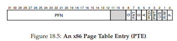

# 18. Paging: Giới thiệu

Người ta đôi khi nói rằng hệ điều hành (operating system – OS) thường áp dụng một trong hai cách tiếp cận khi giải quyết hầu hết các vấn đề quản lý không gian bộ nhớ.  
Cách tiếp cận thứ nhất là chia nhỏ không gian thành các phần có kích thước thay đổi (variable-sized pieces), như chúng ta đã thấy với segmentation (phân đoạn) trong virtual memory (bộ nhớ ảo).  
Đáng tiếc, giải pháp này có những khó khăn vốn có. Cụ thể, khi chia một không gian thành các khối có kích thước khác nhau, chính không gian đó có thể bị **phân mảnh** (fragmentation), và do đó việc cấp phát (allocation) trở nên khó khăn hơn theo thời gian.

Vì vậy, có thể đáng để xem xét cách tiếp cận thứ hai: chia nhỏ không gian thành các phần có kích thước cố định (fixed-sized pieces). Trong virtual memory, ý tưởng này được gọi là **paging** (phân trang), và nó bắt nguồn từ một hệ thống quan trọng thời kỳ đầu – **Atlas** [KE+62, L78].

Thay vì chia không gian địa chỉ (address space) của một process (tiến trình) thành một số segment (đoạn) logic có kích thước thay đổi (ví dụ: code, heap, stack), chúng ta chia nó thành các đơn vị có kích thước cố định, mỗi đơn vị được gọi là **page** (trang). Tương ứng, chúng ta xem physical memory (bộ nhớ vật lý) như một mảng các ô có kích thước cố định gọi là **page frame** (khung trang); mỗi frame có thể chứa một page của virtual memory.  
Thách thức đặt ra là:

> **THE CRUX:**
>
> **HOW TO VIRTUALIZE MEMORY WITH PAGES**  
> Làm thế nào để ảo hóa bộ nhớ bằng pages, nhằm tránh các vấn đề của segmentation? Các kỹ thuật cơ bản là gì? Làm sao để các kỹ thuật này hoạt động hiệu quả, với chi phí về không gian và thời gian tối thiểu?


## 18.1 Ví dụ đơn giản và tổng quan

Để làm rõ hơn cách tiếp cận này, hãy minh họa bằng một ví dụ đơn giản.  

**Hình 18.1** trình bày một ví dụ về một address space rất nhỏ, chỉ có tổng cộng 64 byte, với bốn page 16 byte (các virtual page 0, 1, 2 và 3).  
Trong thực tế, address space thường lớn hơn nhiều, phổ biến là 32-bit (tương đương 4 GB address space), hoặc thậm chí 64-bit^[1]. Trong sách này, chúng ta sẽ thường dùng các ví dụ nhỏ để dễ tiếp thu.

^[1]: Một address space 64-bit rất khó hình dung vì nó cực kỳ lớn. Một phép so sánh: nếu address space 32-bit có kích thước bằng một sân tennis, thì address space 64-bit có kích thước xấp xỉ cả châu Âu (!).


**Hình 18.1: A Simple 64-byte Address Space**  

Physical memory, như thể hiện trong **Hình 18.2**, cũng bao gồm một số ô có kích thước cố định, trong trường hợp này là tám page frame (tổng cộng 128 byte physical memory – cũng rất nhỏ).  
Như bạn thấy trong sơ đồ, các page của virtual address space được đặt tại các vị trí khác nhau trong physical memory; sơ đồ cũng cho thấy OS sử dụng một phần physical memory cho chính nó.

Paging, như chúng ta sẽ thấy, có nhiều ưu điểm so với các cách tiếp cận trước đây. Có lẽ cải tiến quan trọng nhất là **tính linh hoạt**: với một cơ chế paging hoàn chỉnh, hệ thống có thể hỗ trợ trừu tượng hóa address space một cách hiệu quả, bất kể process sử dụng address space như thế nào; ví dụ, chúng ta không cần giả định heap và stack sẽ phát triển theo hướng nào hoặc được dùng ra sao.


**Hình 18.2: A 64-Byte Address Space In A 128-Byte Physical Memory**  

Một ưu điểm khác là **sự đơn giản trong quản lý vùng trống** mà paging mang lại.  
Ví dụ, khi OS muốn đặt address space 64 byte của chúng ta vào physical memory 8 page, nó chỉ cần tìm 4 page trống; có thể OS duy trì một **free list** (danh sách trang trống) và chỉ việc lấy 4 page đầu tiên từ danh sách này.  
Trong ví dụ, OS đã đặt virtual page 0 của address space (AS) vào physical frame 3, virtual page 1 vào frame 7, page 2 vào frame 5, và page 3 vào frame 2. Các frame 1, 4 và 6 hiện đang trống.

Để ghi nhận vị trí của từng virtual page trong physical memory, OS thường duy trì một cấu trúc dữ liệu **per-process** (riêng cho từng process) gọi là **page table** (bảng trang). Vai trò chính của page table là lưu trữ **address translation** (bản dịch địa chỉ) cho từng virtual page của address space, cho phép biết mỗi page nằm ở đâu trong physical memory.

Với ví dụ đơn giản này (**Hình 18.2**), page table sẽ có bốn mục:  
- (Virtual Page 0 → Physical Frame 3)  
- (VP 1 → PF 7)  
- (VP 2 → PF 5)  
- (VP 3 → PF 2)

Cần nhớ rằng page table này là **per-process** (đa số cấu trúc page table chúng ta thảo luận là per-process; ngoại lệ sẽ được đề cập là **inverted page table**). Nếu một process khác chạy trong ví dụ trên, OS sẽ phải quản lý một page table khác cho nó, vì các virtual page của nó sẽ ánh xạ (map) tới các physical page khác (trừ khi có chia sẻ bộ nhớ).


Giờ đây, chúng ta đã đủ thông tin để thực hiện một ví dụ dịch địa chỉ (address translation).  
Giả sử process với address space 64 byte này thực hiện một truy cập bộ nhớ:

```
movl <virtual address>, %eax
```

Cụ thể, hãy chú ý đến việc nạp dữ liệu từ `<virtual address>` vào thanh ghi `eax` (và bỏ qua việc fetch lệnh đã xảy ra trước đó).

Để **translate** (dịch) virtual address mà process tạo ra, trước tiên chúng ta phải tách nó thành hai thành phần:  
- **Virtual Page Number (VPN)** – số hiệu trang ảo  
- **Offset** – độ lệch trong trang

Với ví dụ này, vì virtual address space của process là 64 byte, chúng ta cần 6 bit cho virtual address (2^6 = 64). Virtual address có thể được biểu diễn như sau:

```
Va5 Va4 Va3 Va2 Va1 Va0
```

Trong đó, `Va5` là bit cao nhất, `Va0` là bit thấp nhất.  
Vì page size là 16 byte, chúng ta có thể chia virtual address như sau:


Page size là 16 byte trong address space 64 byte; do đó, chúng ta cần chọn 4 page, và 2 bit cao nhất của địa chỉ sẽ đảm nhiệm việc này. Như vậy, chúng ta có 2-bit VPN. Các bit còn lại (4 bit) cho biết byte nào trong page được truy cập – đây chính là offset.

Khi một process tạo ra virtual address, OS và phần cứng phải phối hợp để dịch nó thành physical address.  
Ví dụ, giả sử lệnh load ở trên truy cập virtual address 21:

```
movl 21, %eax
```

Chuyển “21” sang nhị phân, ta được `010101`.  
Phân tích địa chỉ này, ta thấy:

- VPN = `01` (tức virtual page 1)  
- Offset = `0101` (byte thứ 5 trong page)

Tra VPN trong page table, ta thấy virtual page 1 nằm ở physical frame 7 (PFN = 7, nhị phân `111`).  
Do đó, ta dịch địa chỉ ảo này bằng cách thay VPN bằng PFN, rồi thực hiện load từ physical memory.


**Hình 18.3: The Address Translation Process**  


**Hình 18.4: Example: Page Table in Kernel Physical Memory**  

Lưu ý rằng **offset** (độ lệch) vẫn giữ nguyên (tức là không được dịch), vì offset chỉ cho biết byte nào **bên trong** page (trang) mà chúng ta muốn truy cập. Địa chỉ vật lý (physical address) cuối cùng của chúng ta là `1110101` (117 ở hệ thập phân), và đây chính xác là nơi mà lệnh load sẽ lấy dữ liệu (xem **Hình 18.2**, trang 2).

Với phần tổng quan cơ bản này, giờ đây chúng ta có thể đặt ra (và hy vọng trả lời) một số câu hỏi cơ bản về **paging** (phân trang).  
Ví dụ: Các **page table** (bảng trang) này được lưu ở đâu? Nội dung điển hình của một page table gồm những gì, và kích thước của chúng lớn đến mức nào? Paging có làm hệ thống chậm đi quá mức không? Những câu hỏi này và các vấn đề thú vị khác sẽ được giải đáp, ít nhất là một phần, trong phần dưới đây. Hãy tiếp tục đọc.


## 18.2 Page Table được lưu ở đâu?

Page table có thể trở nên cực kỳ lớn, lớn hơn nhiều so với segment table (bảng phân đoạn) nhỏ hoặc cặp base/bounds (địa chỉ cơ sở/giới hạn) mà chúng ta đã thảo luận trước đây.  
Ví dụ, hãy tưởng tượng một address space (không gian địa chỉ) 32-bit điển hình, với kích thước page là 4KB. Virtual address (địa chỉ ảo) này sẽ được chia thành **20-bit VPN** (Virtual Page Number – số hiệu trang ảo) và **12-bit offset** (nhớ rằng với page 1KB cần 10 bit cho offset, và chỉ cần thêm 2 bit nữa để thành 4KB).

Một VPN 20-bit có nghĩa là có \( 2^{20} \) phép ánh xạ (translation) mà OS (hệ điều hành) phải quản lý cho mỗi process (tiến trình) – tức khoảng một triệu ánh xạ.  
Giả sử chúng ta cần 4 byte cho mỗi **PTE** (Page Table Entry – mục trong bảng trang) để lưu trữ thông tin dịch địa chỉ vật lý cùng các thông tin hữu ích khác, thì tổng dung lượng cần cho mỗi page table sẽ là 4MB – một con số rất lớn.  
Bây giờ, hãy tưởng tượng có 100 process đang chạy: điều này có nghĩa là OS sẽ cần tới 400MB bộ nhớ **chỉ** để lưu các bản dịch địa chỉ! Ngay cả trong thời đại hiện nay, khi máy tính có hàng gigabyte bộ nhớ, việc dùng một phần lớn bộ nhớ chỉ để lưu translation nghe cũng khá “điên rồ”. Và chúng ta thậm chí chưa dám nghĩ đến kích thước của page table cho một address space 64-bit – điều đó sẽ quá khủng khiếp và có thể khiến bạn nản lòng ngay lập tức.

> **ASIDE: DATA STRUCTURE — THE PAGE TABLE**  
> Một trong những cấu trúc dữ liệu quan trọng nhất trong hệ thống quản lý bộ nhớ của OS hiện đại là **page table**. Nói chung, page table lưu trữ các ánh xạ từ địa chỉ ảo sang địa chỉ vật lý, cho phép hệ thống biết mỗi page của address space thực sự nằm ở đâu trong physical memory.  
> Vì mỗi address space cần các ánh xạ như vậy, nên thông thường sẽ có **một page table cho mỗi process** trong hệ thống. Cấu trúc chính xác của page table có thể do phần cứng quyết định (trong các hệ thống cũ) hoặc được OS quản lý linh hoạt hơn (trong các hệ thống hiện đại).

Vì page table quá lớn, chúng ta không lưu chúng trong phần cứng on-chip đặc biệt của MMU (Memory Management Unit – đơn vị quản lý bộ nhớ) để chứa page table của process đang chạy. Thay vào đó, page table của mỗi process được lưu **trong bộ nhớ** ở đâu đó.  
Tạm thời, hãy giả định rằng page table nằm trong physical memory do OS quản lý; sau này chúng ta sẽ thấy rằng phần lớn bộ nhớ của OS cũng có thể được ảo hóa, và do đó page table có thể được lưu trong virtual memory của OS (thậm chí được swap ra đĩa), nhưng điều này hiện tại sẽ gây rối, nên ta sẽ bỏ qua.  

**Hình 18.4** (trang 5) minh họa một page table trong bộ nhớ của OS; bạn có thấy tập hợp nhỏ các ánh xạ ở đó không?


## 18.3 Thực sự có gì trong Page Table?

Hãy nói một chút về tổ chức của page table. Page table chỉ là một cấu trúc dữ liệu dùng để ánh xạ từ virtual address (hoặc chính xác hơn là virtual page number – VPN) sang physical address (physical frame number – PFN). Do đó, về lý thuyết, bất kỳ cấu trúc dữ liệu nào cũng có thể dùng được.  
Dạng đơn giản nhất được gọi là **linear page table** (bảng trang tuyến tính), chỉ đơn giản là một mảng. OS sẽ **index** (đánh chỉ số) mảng này bằng VPN, và tra PTE tại chỉ số đó để tìm PFN mong muốn.  
Hiện tại, chúng ta sẽ giả định cấu trúc tuyến tính đơn giản này; ở các chương sau, chúng ta sẽ dùng các cấu trúc dữ liệu nâng cao hơn để giải quyết một số vấn đề của paging.

Về nội dung của mỗi PTE, có một số bit quan trọng cần hiểu:  
- **Valid bit**: cho biết ánh xạ này có hợp lệ hay không. Ví dụ, khi một chương trình bắt đầu chạy, nó sẽ có code và heap ở một đầu của address space, và stack ở đầu kia. Tất cả không gian chưa dùng ở giữa sẽ được đánh dấu **invalid**. Nếu process cố truy cập vùng bộ nhớ này, nó sẽ tạo ra một trap (ngắt) tới OS, và OS có thể sẽ chấm dứt process đó.  
  Valid bit rất quan trọng để hỗ trợ **sparse address space** (không gian địa chỉ thưa thớt); bằng cách đánh dấu invalid cho tất cả các page chưa dùng, chúng ta không cần cấp phát physical frame cho chúng, từ đó tiết kiệm đáng kể bộ nhớ.



**Hình 18.5: An x86 Page Table Entry (PTE)**  

Ngoài ra, còn có **protection bits** (bit bảo vệ), cho biết page có thể được đọc, ghi hoặc thực thi hay không. Truy cập page theo cách không được phép bởi các bit này sẽ tạo ra trap tới OS.

Một số bit khác cũng quan trọng nhưng tạm thời chúng ta chưa bàn sâu:  
- **Present bit**: cho biết page này đang ở physical memory hay đã được lưu trên đĩa (swapped out). Cơ chế này sẽ được tìm hiểu kỹ hơn khi chúng ta học về **swap** – kỹ thuật di chuyển một phần address space ra đĩa để hỗ trợ address space lớn hơn physical memory. Swapping cho phép OS giải phóng physical memory bằng cách chuyển các page ít dùng ra đĩa.  
- **Dirty bit**: cho biết page đã bị sửa đổi kể từ khi được nạp vào bộ nhớ hay chưa.  
- **Reference bit** (hay **accessed bit**): cho biết page đã được truy cập hay chưa, hữu ích để xác định page nào được dùng thường xuyên và nên giữ lại trong bộ nhớ. Thông tin này rất quan trọng trong **page replacement** (thay thế trang), một chủ đề sẽ được nghiên cứu chi tiết ở các chương sau.


**Hình 18.5** cho thấy một ví dụ về PTE trong kiến trúc x86 [I09]. Nó bao gồm:  
- Present bit (P)  
- Read/Write bit (R/W) – xác định có cho phép ghi vào page hay không  
- User/Supervisor bit (U/S) – xác định process ở user mode có thể truy cập page hay không  
- Một số bit (PWT, PCD, PAT, G) – xác định cách phần cứng caching hoạt động với page này  
- Accessed bit (A) và Dirty bit (D)  
- Cuối cùng là Page Frame Number (PFN) – số hiệu khung trang vật lý

Bạn có thể đọc **Intel Architecture Manuals** [I09] để biết thêm chi tiết về hỗ trợ paging trong x86. Tuy nhiên, cần lưu ý: đọc các tài liệu này, dù rất hữu ích (và chắc chắn cần thiết cho những ai viết code để dùng page table trong OS), có thể khá khó khăn lúc đầu. Cần một chút kiên nhẫn và nhiều quyết tâm.

> **ASIDE: TẠI SAO KHÔNG CÓ BIT VALID?**  
> Bạn có thể nhận thấy trong ví dụ của Intel, không có valid bit riêng biệt, mà chỉ có present bit (P). Nếu bit này được đặt (P=1), nghĩa là page vừa **present** vừa **valid**. Nếu không (P=0), nghĩa là page có thể không có trong bộ nhớ (nhưng vẫn valid), hoặc có thể không valid.  
> 
> Khi có một truy cập tới page với P = 0, phần cứng sẽ kích hoạt một **trap** (bẫy) tới **OS** (Operating System – hệ điều hành). Lúc này, OS phải sử dụng các cấu trúc dữ liệu bổ sung mà nó duy trì để xác định xem page đó có **valid** (hợp lệ) hay không. Nếu hợp lệ, có thể page này cần được **swapped back in** (nạp lại từ bộ nhớ phụ vào bộ nhớ chính). Nếu không hợp lệ, điều đó có nghĩa là chương trình đang cố gắng truy cập vào vùng bộ nhớ trái phép.  
> 
> Cách thiết kế tiết kiệm này khá phổ biến trong phần cứng, vốn thường chỉ cung cấp **tập hợp tối thiểu các tính năng** để OS có thể xây dựng nên một hệ thống dịch vụ đầy đủ.  
>
> *(Giải thích thêm: Trong kiến trúc Intel, việc gộp hai khái niệm “valid” và “present” vào một bit giúp giảm độ phức tạp phần cứng, nhưng yêu cầu OS phải xử lý logic phân biệt khi xảy ra lỗi truy cập bộ nhớ.)*  

## 18.4 Paging: Cũng Quá Chậm

Với **page table** (bảng trang) được lưu trong bộ nhớ, chúng ta đã biết rằng chúng có thể quá lớn. Hóa ra, chúng cũng có thể làm chậm hệ thống.  
Ví dụ, hãy xét lệnh đơn giản sau:

```
movl 21, %eax
```

Một lần nữa, chúng ta chỉ xem xét việc truy cập rõ ràng tới địa chỉ 21 và không quan tâm đến việc **instruction fetch** (nạp lệnh). Trong ví dụ này, chúng ta giả định phần cứng sẽ thực hiện việc **dịch địa chỉ** (translation) cho chúng ta.  
Để lấy được dữ liệu mong muốn, hệ thống trước tiên phải dịch **virtual address** (địa chỉ ảo) 21 thành **physical address** (địa chỉ vật lý) 117. Như vậy, trước khi lấy dữ liệu từ địa chỉ 117, hệ thống phải truy xuất **page table entry** (PTE – mục trong bảng trang) tương ứng từ page table của process (tiến trình), thực hiện dịch địa chỉ, rồi mới nạp dữ liệu từ **physical memory** (bộ nhớ vật lý).

Để làm được điều này, phần cứng phải biết page table của process đang chạy hiện tại nằm ở đâu.  
Giả sử tạm thời rằng có một **page-table base register** (thanh ghi cơ sở bảng trang) chứa địa chỉ vật lý của vị trí bắt đầu của page table. Để tìm vị trí của PTE mong muốn, phần cứng sẽ thực hiện các bước sau:

```
VPN = (VirtualAddress & VPN_MASK) >> SHIFT
PTEAddr = PageTableBaseRegister + (VPN * sizeof(PTE))
```

Trong ví dụ của chúng ta, `VPN_MASK` sẽ được đặt là `0x30` (hex 30, hay nhị phân `110000`) để trích ra các bit VPN từ toàn bộ virtual address; `SHIFT` được đặt là 4 (số bit của offset), để dịch các bit VPN xuống tạo thành số nguyên VPN chính xác.  
Ví dụ, với virtual address 21 (`010101`), phép **masking** biến giá trị này thành `010000`; phép dịch (shift) biến nó thành `01`, tức virtual page 1 như mong muốn. Chúng ta sau đó dùng giá trị này làm chỉ số trong mảng PTE mà page-table base register trỏ tới.

Khi đã biết địa chỉ vật lý của PTE, phần cứng có thể nạp PTE từ bộ nhớ, lấy ra **PFN** (Physical Frame Number – số hiệu khung trang vật lý), và ghép nó với offset từ virtual address để tạo thành physical address mong muốn.  
Cụ thể, bạn có thể hình dung PFN được dịch trái (left-shift) bởi `SHIFT`, rồi thực hiện phép **bitwise OR** với offset để tạo địa chỉ cuối cùng như sau:

```
offset = VirtualAddress & OFFSET_MASK
PhysAddr = (PFN << SHIFT) | offset
```

Cuối cùng, phần cứng có thể nạp dữ liệu mong muốn từ bộ nhớ và đưa nó vào thanh ghi `eax`. Chương trình đã thành công trong việc nạp một giá trị từ bộ nhớ.

Tóm lại, chúng ta mô tả giao thức ban đầu cho những gì xảy ra ở mỗi lần truy cập bộ nhớ. **Hình 18.6** (trang 9) minh họa cách tiếp cận này.  
Với **mỗi** lần truy cập bộ nhớ (dù là instruction fetch hay load/store rõ ràng), paging yêu cầu chúng ta thực hiện **thêm một lần truy cập bộ nhớ** để trước tiên lấy bản dịch địa chỉ từ page table. Đây là một khối lượng công việc lớn! Các lần truy cập bộ nhớ bổ sung rất tốn kém, và trong trường hợp này có thể làm chậm process đi gấp đôi hoặc hơn.

Bây giờ, bạn có thể thấy rằng có **hai** vấn đề thực sự mà chúng ta phải giải quyết. Nếu không thiết kế cẩn thận cả phần cứng lẫn phần mềm, page table sẽ khiến hệ thống vừa chạy quá chậm, vừa chiếm quá nhiều bộ nhớ.  
Mặc dù paging có vẻ là một giải pháp tuyệt vời cho nhu cầu **memory virtualization** (ảo hóa bộ nhớ) của chúng ta, nhưng hai vấn đề then chốt này phải được khắc phục trước.


```
1  // Extract the VPN from the virtual address
2  VPN = (VirtualAddress & VPN_MASK) >> SHIFT
3
4  // Form the address of the page-table entry (PTE)
5  PTEAddr = PTBR + (VPN * sizeof(PTE))
6
7  // Fetch the PTE
8  PTE = AccessMemory(PTEAddr)
9
10 // Check if process can access the page
11 if (PTE.Valid == False)
12     RaiseException(SEGMENTATION_FAULT)
13 else if (CanAccess(PTE.ProtectBits) == False)
14     RaiseException(PROTECTION_FAULT)
15 else
16     // Access OK: form physical address and fetch it
17     offset = VirtualAddress & OFFSET_MASK
18     PhysAddr = (PTE.PFN << PFN_SHIFT) | offset
19     Register = AccessMemory(PhysAddr)
```

**Hình 18.6: Accessing Memory With Paging**  

## 18.5 A Memory Trace (Dấu vết truy cập bộ nhớ)

Trước khi kết thúc, chúng ta sẽ lần theo một ví dụ truy cập bộ nhớ đơn giản để minh họa tất cả các truy cập bộ nhớ phát sinh khi sử dụng **paging** (phân trang). Đoạn code (viết bằng C, trong tệp `array.c`) mà chúng ta quan tâm như sau:

```c
int array[1000];
...
for (i = 0; i < 1000; i++)
    array[i] = 0;
```

Chúng ta biên dịch `array.c` và chạy nó với các lệnh sau:

```
prompt> gcc -o array array.c -Wall -O
prompt> ./array
```

Tất nhiên, để thực sự hiểu được đoạn code này (vốn chỉ khởi tạo một mảng) sẽ tạo ra những truy cập bộ nhớ nào, chúng ta cần biết (hoặc giả định) thêm một số thông tin.  
Trước hết, chúng ta cần **disassemble** (dịch ngược) tệp nhị phân kết quả (sử dụng `objdump` trên Linux hoặc `otool` trên Mac) để xem các lệnh assembly được dùng để khởi tạo mảng trong vòng lặp. Kết quả thu được như sau:

```
1024 movl $0x0,(%edi,%eax,4)
1028 incl %eax
1032 cmpl $0x03e8,%eax
1036 jne 1024
```

Nếu bạn biết một chút về **x86**, đoạn code này khá dễ hiểu^[2].  
- Lệnh đầu tiên (`movl $0x0,(%edi,%eax,4)`) ghi giá trị 0 (`$0x0`) vào địa chỉ bộ nhớ ảo của phần tử mảng; địa chỉ này được tính bằng cách lấy giá trị trong `%edi` cộng với `%eax` nhân 4. Như vậy, `%edi` giữ **địa chỉ cơ sở** của mảng, còn `%eax` giữ **chỉ số mảng** (`i`). Chúng ta nhân với 4 vì mảng là mảng số nguyên (integer), mỗi phần tử có kích thước 4 byte.  
- Lệnh thứ hai (`incl %eax`) tăng chỉ số mảng trong `%eax`.  
- Lệnh thứ ba (`cmpl $0x03e8,%eax`) so sánh giá trị trong `%eax` với `0x03e8` (thập phân là 1000).  
- Nếu hai giá trị chưa bằng nhau (điều mà lệnh `jne` kiểm tra), lệnh thứ tư (`jne 1024`) sẽ nhảy về đầu vòng lặp.

Để hiểu các truy cập bộ nhớ mà chuỗi lệnh này tạo ra (ở cả mức địa chỉ ảo và địa chỉ vật lý), chúng ta cần giả định một số điều về vị trí của đoạn code và mảng trong **virtual memory** (bộ nhớ ảo), cũng như nội dung và vị trí của **page table** (bảng trang).

Trong ví dụ này, giả sử **virtual address space** (không gian địa chỉ ảo) có kích thước 64KB (rất nhỏ so với thực tế). Chúng ta cũng giả định **page size** (kích thước trang) là 1KB.

Điều tiếp theo cần biết là nội dung của page table và vị trí của nó trong **physical memory** (bộ nhớ vật lý). Giả sử chúng ta có một page table tuyến tính (linear, dạng mảng) và nó được đặt tại địa chỉ vật lý 1KB (1024).

Về nội dung, chỉ có một vài **virtual page** (trang ảo) cần quan tâm trong ví dụ này:  
- Trước hết là virtual page chứa đoạn code. Vì page size là 1KB, địa chỉ ảo 1024 nằm trên trang thứ hai của virtual address space (VPN = 1, vì VPN = 0 là trang đầu tiên). Giả sử virtual page này ánh xạ tới **physical frame** 4 (VPN 1 → PFN 4).  
- Tiếp theo là mảng. Mảng có kích thước 4000 byte (1000 số nguyên), và giả sử nó nằm tại các địa chỉ ảo từ 40000 đến 44000 (không bao gồm byte cuối). Các virtual page cho dải địa chỉ này là VPN = 39 … VPN = 42. Giả sử ánh xạ virtual-to-physical như sau:  
  - VPN 39 → PFN 7  
  - VPN 40 → PFN 8  
  - VPN 41 → PFN 9  
  - VPN 42 → PFN 10

^[2]: Ở đây chúng ta đơn giản hóa một chút, giả định mỗi lệnh có kích thước 4 byte; thực tế, lệnh x86 có kích thước thay đổi.


**Hình 18.7: A Virtual (And Physical) Memory Trace**  

Bây giờ chúng ta đã sẵn sàng để theo dõi các truy cập bộ nhớ của chương trình.  
Khi chạy, mỗi **instruction fetch** (nạp lệnh) sẽ tạo ra **hai** truy cập bộ nhớ:  
1. Một truy cập tới page table để tìm physical frame chứa lệnh.  
2. Một truy cập tới chính lệnh đó để nạp vào CPU xử lý.

Ngoài ra, còn có một truy cập bộ nhớ rõ ràng từ lệnh `mov`, điều này sẽ thêm một truy cập page table trước (để dịch địa chỉ ảo của mảng sang địa chỉ vật lý đúng) và sau đó là truy cập tới phần tử mảng.

Toàn bộ quá trình cho **5 vòng lặp đầu tiên** được minh họa trong **Hình 18.7** (trang 11):  
- Biểu đồ dưới cùng: các truy cập bộ nhớ lệnh (instruction memory references) trên trục y màu đen (địa chỉ ảo bên trái, địa chỉ vật lý bên phải).  
- Biểu đồ giữa: các truy cập mảng (array accesses) màu xám đậm (cũng với địa chỉ ảo bên trái, địa chỉ vật lý bên phải).  
- Biểu đồ trên cùng: các truy cập page table màu xám nhạt (chỉ địa chỉ vật lý, vì page table trong ví dụ này nằm trong physical memory).

Trục x của toàn bộ trace thể hiện các truy cập bộ nhớ trong 5 vòng lặp đầu tiên; mỗi vòng lặp có 10 truy cập bộ nhớ, bao gồm:  
- 4 instruction fetch  
- 1 cập nhật bộ nhớ rõ ràng (explicit memory update)  
- 5 truy cập page table để dịch 4 instruction fetch và 1 cập nhật bộ nhớ.

Hãy thử phân tích các mẫu (pattern) xuất hiện trong hình minh họa. Đặc biệt, điều gì sẽ thay đổi khi vòng lặp tiếp tục chạy vượt quá 5 vòng đầu tiên? Những vị trí bộ nhớ mới nào sẽ được truy cập? Bạn có thể tìm ra không?

Đây mới chỉ là một ví dụ đơn giản (chỉ vài dòng C), nhưng bạn có thể cảm nhận được sự phức tạp khi phân tích hành vi bộ nhớ thực tế của các ứng dụng. Đừng lo: nó sẽ **còn phức tạp hơn**, vì các cơ chế mà chúng ta sắp giới thiệu sẽ làm tăng thêm độ phức tạp cho hệ thống vốn đã phức tạp này. Xin lỗi^[3]!


## 18.6 Tóm tắt

Chúng ta đã giới thiệu khái niệm **paging** như một giải pháp cho thách thức ảo hóa bộ nhớ. Paging có nhiều ưu điểm so với các phương pháp trước (như segmentation):  
- Thứ nhất, nó không gây ra **external fragmentation** (phân mảnh bên ngoài), vì paging (theo thiết kế) chia bộ nhớ thành các đơn vị có kích thước cố định.  
- Thứ hai, nó rất linh hoạt, cho phép sử dụng **virtual address space** (không gian địa chỉ ảo) một cách thưa thớt (sparse).

Tuy nhiên, nếu triển khai paging mà không cẩn thận, hệ thống sẽ:  
- Chạy chậm hơn (do nhiều truy cập bộ nhớ bổ sung để truy cập page table).  
- Lãng phí bộ nhớ (do bộ nhớ bị chiếm bởi page table thay vì dữ liệu ứng dụng hữu ích).

Vì vậy, chúng ta cần suy nghĩ kỹ hơn để xây dựng một hệ thống paging **không chỉ hoạt động được mà còn hoạt động hiệu quả**.  
May mắn thay, hai chương tiếp theo sẽ cho chúng ta thấy cách thực hiện điều đó.

^[3]: Thực ra chúng tôi không thật sự xin lỗi. Nhưng chúng tôi xin lỗi vì… không xin lỗi, nếu điều đó có thể hiểu được.
