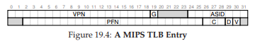

# **19. Paging: Faster Translations (TLBs)**
(Paging: Dịch địa chỉ nhanh hơn với TLB)

Việc sử dụng **paging** (phân trang) như cơ chế cốt lõi để hỗ trợ **virtual memory** (bộ nhớ ảo) có thể dẫn đến chi phí hiệu năng cao. Bằng cách chia nhỏ **address space** (không gian địa chỉ) thành các đơn vị nhỏ, kích thước cố định (tức là **page**), paging đòi hỏi một lượng lớn thông tin ánh xạ. Vì thông tin ánh xạ này thường được lưu trong **physical memory** (bộ nhớ vật lý), nên về mặt logic, paging yêu cầu một lần truy cập bộ nhớ bổ sung cho mỗi **virtual address** (địa chỉ ảo) được chương trình tạo ra. Việc phải truy cập bộ nhớ để lấy thông tin dịch địa chỉ trước mỗi lần nạp lệnh (**instruction fetch**) hoặc mỗi thao tác load/store rõ ràng là quá chậm. Và đây chính là vấn đề của chúng ta:

> **THE CRUX: HOW TO SPEED UP ADDRESS TRANSLATION**  
> Làm thế nào để tăng tốc quá trình dịch địa chỉ, và nói chung là tránh được lần truy cập bộ nhớ bổ sung mà paging dường như yêu cầu? Cần hỗ trợ phần cứng gì? OS cần tham gia ở mức nào?

Khi muốn tăng tốc, OS thường cần sự hỗ trợ. Và sự hỗ trợ này thường đến từ “người bạn cũ” của OS: **hardware** (phần cứng). Để tăng tốc dịch địa chỉ, chúng ta sẽ bổ sung một thành phần gọi là (vì lý do lịch sử [CP78]) **translation-lookaside buffer** hay **TLB** [CG68, C95]. **TLB** là một phần của **memory-management unit** (MMU — đơn vị quản lý bộ nhớ) trên chip, và đơn giản là một **hardware cache** (bộ nhớ đệm phần cứng) lưu trữ các ánh xạ **virtual-to-physical address translations** (dịch địa chỉ từ ảo sang vật lý) được sử dụng thường xuyên; vì vậy, một tên gọi chính xác hơn sẽ là **address-translation cache**.  

Mỗi khi có một **virtual memory reference** (tham chiếu bộ nhớ ảo), phần cứng sẽ kiểm tra TLB trước để xem bản dịch mong muốn có ở đó không; nếu có, quá trình dịch sẽ được thực hiện (nhanh chóng) mà không cần truy vấn **page table** (bảng trang — chứa toàn bộ các bản dịch). Do tác động lớn đến hiệu năng, TLB thực sự là yếu tố khiến virtual memory khả thi [C95].


```
VPN = (VirtualAddress & VPN_MASK) >> SHIFT
(Success, TlbEntry) = TLB_Lookup(VPN)
if (Success == True)
  // TLB Hit
  if (CanAccess(TlbEntry.ProtectBits) == True)
    Offset = VirtualAddress & OFFSET_MASK
    PhysAddr = (TlbEntry.PFN << SHIFT) | Offset
    Register = AccessMemory(PhysAddr)
  else
    RaiseException(PROTECTION_FAULT)
else
  // TLB Miss
  PTEAddr = PTBR + (VPN * sizeof(PTE))
  PTE = AccessMemory(PTEAddr)
  if (PTE.Valid == False)
    RaiseException(SEGMENTATION_FAULT)
  else if (CanAccess(PTE.ProtectBits) == False)
    RaiseException(PROTECTION_FAULT)
  else
    TLB_Insert(VPN, PTE.PFN, PTE.ProtectBits)
    RetryInstruction()
```

**Figure 19.1: TLB Control Flow Algorithm**  
*(Thuật toán luồng điều khiển của TLB)*


## **19.1 TLB Basic Algorithm** (Thuật toán cơ bản của TLB)

*Figure 19.1* minh họa sơ đồ cách phần cứng có thể xử lý một **virtual address translation** (dịch địa chỉ ảo), giả sử sử dụng **linear page table** (bảng trang tuyến tính — tức page table là một mảng) và **hardware-managed TLB** (TLB do phần cứng quản lý — phần cứng đảm nhiệm phần lớn việc truy cập page table; chúng ta sẽ giải thích thêm bên dưới).

Thuật toán phần cứng thực hiện như sau:  
- Đầu tiên, trích xuất **virtual page number** (VPN — số trang ảo) từ virtual address (Dòng 1 trong *Figure 19.1*), và kiểm tra xem TLB có chứa bản dịch cho VPN này không (Dòng 2).  
- Nếu có, đây là một **TLB hit** (trúng TLB), nghĩa là TLB đã có bản dịch. Thành công! Lúc này, ta trích xuất **page frame number** (PFN — số khung trang) từ entry tương ứng trong TLB, ghép nó với **offset** từ virtual address ban đầu, tạo thành **physical address** (PA — địa chỉ vật lý) mong muốn, và truy cập bộ nhớ (Dòng 5–7), giả sử **protection checks** (kiểm tra bảo vệ) không thất bại (Dòng 4).

- Nếu CPU không tìm thấy bản dịch trong TLB (**TLB miss**), sẽ cần thêm công việc. Trong ví dụ này, phần cứng truy cập page table để tìm bản dịch (Dòng 11–12), và giả sử **virtual memory reference** do **process** (tiến trình) tạo ra là hợp lệ và có thể truy cập (Dòng 13, 15), phần cứng sẽ cập nhật TLB với bản dịch này (Dòng 18). Các thao tác này tốn kém, chủ yếu vì cần một lần truy cập bộ nhớ bổ sung để lấy thông tin từ page table (Dòng 12). Cuối cùng, khi TLB đã được cập nhật, phần cứng sẽ thực thi lại lệnh; lần này, bản dịch được tìm thấy trong TLB và truy cập bộ nhớ diễn ra nhanh chóng.

Giống như mọi **cache**, TLB được xây dựng dựa trên giả định rằng trong hầu hết các trường hợp, bản dịch sẽ được tìm thấy trong cache (tức là hit). Nếu đúng, chi phí thêm vào là rất nhỏ, vì TLB nằm gần lõi xử lý và được thiết kế để rất nhanh. Khi xảy ra miss, chi phí cao của paging sẽ xuất hiện; page table phải được truy cập để tìm bản dịch, dẫn đến một lần truy cập bộ nhớ bổ sung (hoặc nhiều hơn nếu page table phức tạp). Nếu điều này xảy ra thường xuyên, chương trình sẽ chạy chậm thấy rõ; so với hầu hết các lệnh CPU, truy cập bộ nhớ là rất tốn kém, và **TLB miss** dẫn đến nhiều lần truy cập bộ nhớ hơn. Do đó, mục tiêu của chúng ta là tránh TLB miss càng nhiều càng tốt.

## **19.2 Example: Accessing An Array** (Ví dụ: Truy cập một mảng)

Để làm rõ cách TLB hoạt động, hãy xem xét một **virtual address trace** (dấu vết địa chỉ ảo) đơn giản và xem TLB có thể cải thiện hiệu năng như thế nào.  

Giả sử chúng ta có một mảng gồm 10 số nguyên 4 byte trong bộ nhớ, bắt đầu tại **virtual address** 100. Giả sử thêm rằng chúng ta có một **virtual address space** 8-bit nhỏ, với **page size** (kích thước trang) là 16 byte; do đó, một virtual address được chia thành **VPN** 4-bit (có 16 virtual pages) và **offset** 4-bit (mỗi page có 16 byte).

*Figure 19.2* (trang 4) cho thấy mảng được bố trí trên 16 page 16-byte của hệ thống. Như bạn thấy, phần tử đầu tiên của mảng (a) bắt đầu tại (VPN=06, offset=04); chỉ có ba số nguyên 4 byte nằm vừa trên page này. Mảng tiếp tục sang page tiếp theo (VPN=07), nơi chứa bốn phần tử tiếp theo (a ... a). Cuối cùng, ba phần tử còn lại của mảng 10 phần tử (a ... a) nằm trên page tiếp theo của address space (VPN=08).

Xét một vòng lặp đơn giản truy cập từng phần tử mảng, ví dụ trong C:

```c
int i, sum = 0;
for (i = 0; i < 10; i++) {
  sum += a[i];
}
```

Để đơn giản, ta giả định rằng các truy cập bộ nhớ duy nhất mà vòng lặp tạo ra là tới mảng (bỏ qua biến `i` và `sum`, cũng như bản thân các lệnh). Khi phần tử đầu tiên (a) được truy cập, CPU sẽ thấy một lệnh load tới virtual address 100. Phần cứng trích xuất VPN từ địa chỉ này (VPN=06) và dùng nó để kiểm tra TLB xem có bản dịch hợp lệ không. Giả sử đây là lần đầu chương trình truy cập mảng, kết quả sẽ là **TLB miss**.

Lần truy cập tiếp theo là tới a, và đây là tin tốt: **TLB hit**! Vì phần tử thứ hai nằm ngay cạnh phần tử đầu tiên, nó nằm trên cùng một page; và vì page này đã được truy cập khi lấy phần tử đầu tiên, bản dịch đã có trong TLB. Lần truy cập tới a tiếp theo cũng hit, vì nó cũng nằm trên cùng page với a và a.


*Figure 19.2: Ví dụ: Một mảng trong không gian địa chỉ nhỏ.*

Không may, khi chương trình truy cập a tiếp theo, ta gặp một **TLB miss** khác. Tuy nhiên, một lần nữa, các phần tử tiếp theo (a ... a) sẽ hit trong TLB, vì tất cả đều nằm trên cùng một page trong bộ nhớ.

Cuối cùng, việc truy cập vào **a** gây ra một `TLB miss` (lỗi tra cứu TLB). Phần cứng một lần nữa tham chiếu đến `page table` (bảng trang) để xác định vị trí của `virtual page` (trang ảo) này trong `physical memory` (bộ nhớ vật lý), và cập nhật TLB tương ứng. Hai lần truy cập cuối cùng (a và a) được hưởng lợi từ việc cập nhật TLB này; khi phần cứng tra cứu TLB để tìm bản dịch địa chỉ, cả hai lần đều dẫn đến **hit** (trúng).  

Tóm tắt lại hoạt động của TLB trong mười lần truy cập vào mảng: **miss, hit, hit, miss, hit, hit, hit, miss, hit, hit**. Do đó, `TLB hit rate` (tỉ lệ trúng TLB) — được tính bằng số lần hit chia cho tổng số lần truy cập — là **70%**. Mặc dù con số này không quá cao (thực tế, chúng ta mong muốn tỉ lệ này tiệm cận 100%), nhưng nó khác 0, điều này có thể gây bất ngờ. Ngay cả khi đây là lần đầu tiên chương trình truy cập vào mảng, TLB vẫn cải thiện hiệu năng nhờ `spatial locality` (tính cục bộ không gian). Các phần tử của mảng được sắp xếp sát nhau trong các trang (tức là chúng gần nhau về mặt vị trí trong bộ nhớ), và vì vậy chỉ lần truy cập đầu tiên đến một phần tử trên một trang mới gây ra `TLB miss`.  

Cũng cần lưu ý vai trò của `page size` (kích thước trang) trong ví dụ này. Nếu `page size` chỉ đơn giản lớn gấp đôi (32 byte thay vì 16 byte), việc truy cập mảng sẽ gặp ít lỗi miss hơn nữa. Vì `page size` điển hình thường vào khoảng 4KB, nên các kiểu truy cập mảng dày đặc (dense, array-based accesses) như thế này đạt hiệu năng TLB rất tốt, chỉ gặp một lỗi miss cho mỗi trang được truy cập.  


> **TIP: USE CACHING WHEN POSSIBLE**  
> **(MẸO: SỬ DỤNG CƠ CHẾ CACHE KHI CÓ THỂ)**  
> **Caching** (bộ nhớ đệm) là một trong những kỹ thuật tối ưu hiệu năng cơ bản nhất trong hệ thống máy tính, được sử dụng lặp đi lặp lại để làm cho “trường hợp phổ biến chạy nhanh” [HP06]. Ý tưởng đằng sau **hardware caches** (bộ nhớ đệm phần cứng) là tận dụng **locality** (tính cục bộ) trong các tham chiếu lệnh và dữ liệu. Thông thường có hai loại locality: **temporal locality** (tính cục bộ theo thời gian) và **spatial locality** (tính cục bộ theo không gian).  
> Với temporal locality, ý tưởng là một lệnh hoặc dữ liệu vừa được truy cập gần đây thì nhiều khả năng sẽ được truy cập lại sớm trong tương lai. Hãy nghĩ đến các biến vòng lặp hoặc các lệnh trong vòng lặp; chúng được truy cập lặp đi lặp lại theo thời gian.  
> Với spatial locality, ý tưởng là nếu một chương trình truy cập bộ nhớ tại địa chỉ x, thì nhiều khả năng nó sẽ sớm truy cập bộ nhớ gần x. Hãy hình dung việc duyệt qua một mảng, truy cập một phần tử rồi đến phần tử tiếp theo.  
> Tất nhiên, các đặc tính này phụ thuộc vào bản chất cụ thể của chương trình, vì vậy chúng không phải là các quy luật tuyệt đối mà chỉ là các nguyên tắc kinh nghiệm.  
> Hardware caches, dù cho lệnh, dữ liệu, hay dịch địa chỉ (như TLB của chúng ta), đều tận dụng locality bằng cách giữ các bản sao dữ liệu trong **on-chip memory** (bộ nhớ trên chip) nhỏ và nhanh. Thay vì phải truy cập bộ nhớ (chậm) để đáp ứng yêu cầu, bộ xử lý có thể kiểm tra trước xem có bản sao gần đó trong cache không; nếu có, bộ xử lý có thể truy cập nhanh (chỉ vài chu kỳ CPU) và tránh mất thời gian tốn kém khi truy cập bộ nhớ (nhiều nanosecond).  
> Bạn có thể tự hỏi: nếu cache (như TLB) tuyệt vời như vậy, sao không làm cache lớn hơn và giữ toàn bộ dữ liệu trong đó? Tiếc là ở đây chúng ta gặp phải các giới hạn cơ bản như các định luật vật lý. Nếu muốn cache nhanh, nó phải nhỏ, vì các vấn đề như tốc độ ánh sáng và các ràng buộc vật lý khác trở nên quan trọng. Bất kỳ cache lớn nào, theo định nghĩa, sẽ chậm, và do đó phản tác dụng. Vì vậy, chúng ta buộc phải dùng cache nhỏ và nhanh; câu hỏi còn lại là làm thế nào để sử dụng chúng tốt nhất nhằm cải thiện hiệu năng.


Một điểm cuối cùng về hiệu năng của **TLB**: nếu chương trình, ngay sau khi vòng lặp này kết thúc, truy cập lại mảng, chúng ta có thể thấy kết quả còn tốt hơn nữa, giả sử TLB đủ lớn để lưu các bản dịch cần thiết: hit, hit, hit, hit, hit, hit, hit, hit, hit, hit. Trong trường hợp này, **TLB hit rate** (tỉ lệ trúng TLB) sẽ cao nhờ **temporal locality**, tức là việc tham chiếu lại nhanh chóng các mục dữ liệu theo thời gian. Giống như mọi cache, TLB dựa vào cả **spatial locality** và **temporal locality** để đạt hiệu quả, đây là các đặc tính của chương trình. Nếu chương trình có các đặc tính này (và nhiều chương trình có), TLB hit rate sẽ cao.

```
VPN = (VirtualAddress & VPN_MASK) >> SHIFT
(Success, TlbEntry) = TLB_Lookup(VPN)
if (Success == True) // TLB Hit
  if (CanAccess(TlbEntry.ProtectBits) == True)
    Offset = VirtualAddress & OFFSET_MASK
    PhysAddr = (TlbEntry.PFN << SHIFT) | Offset
    Register = AccessMemory(PhysAddr)
  else
    RaiseException(PROTECTION_FAULT)
else
  RaiseException(TLB_MISS) // TLB Miss
```

**Figure 19.3: TLB Control Flow Algorithm (OS Handled)**  
*(Thuật toán luồng điều khiển TLB — do OS xử lý)*


## **19.3 Who Handles The TLB Miss?**
(Ai xử lý TLB miss?)

Một câu hỏi cần trả lời: ai sẽ xử lý một **TLB miss**? Có hai khả năng: **hardware** (phần cứng) hoặc **software** (OS).  

Trong những ngày đầu, phần cứng có **complex instruction sets** (tập lệnh phức tạp, đôi khi gọi là **CISC** — *complex-instruction set computers*) và những người thiết kế phần cứng không mấy tin tưởng “đám OS” kia. Vì vậy, phần cứng sẽ xử lý toàn bộ TLB miss. Để làm được điều này, phần cứng phải biết chính xác **page tables** (bảng trang) nằm ở đâu trong bộ nhớ (thông qua **page-table base register**, được dùng ở Dòng 11 trong *Figure 19.1*), cũng như định dạng chính xác của chúng; khi xảy ra miss, phần cứng sẽ “walk” page table, tìm **page-table entry** đúng và trích xuất bản dịch mong muốn, cập nhật TLB với bản dịch đó, và thực thi lại lệnh.  

Một ví dụ về kiến trúc “cũ” có **hardware-managed TLBs** là kiến trúc Intel x86, sử dụng **multi-level page table** (bảng trang nhiều cấp) cố định (xem chi tiết ở chương sau); page table hiện tại được trỏ bởi thanh ghi CR3 [I09].

Các kiến trúc hiện đại hơn (ví dụ: MIPS R10k [H93] hoặc Sun’s SPARC v9 [WG00], cả hai đều là **RISC** — *reduced-instruction set computers*) có cái gọi là **software-managed TLB**. Khi xảy ra TLB miss, phần cứng chỉ đơn giản phát sinh một **exception** (ngoại lệ) (Dòng 11 trong *Figure 19.3*), tạm dừng luồng lệnh hiện tại, nâng mức đặc quyền lên **kernel mode**, và nhảy tới một **trap handler**. Như bạn có thể đoán, trap handler này là mã trong OS được viết với mục đích xử lý TLB miss. Khi chạy, mã này sẽ tra cứu bản dịch trong page table, sử dụng các lệnh “đặc quyền” để cập nhật TLB, và quay lại từ trap; tại thời điểm này, phần cứng sẽ thực thi lại lệnh (dẫn đến TLB hit).


Hãy thảo luận một vài chi tiết quan trọng:  
- Thứ nhất, **return-from-trap instruction** (lệnh quay lại từ trap) cần khác một chút so với return-from-trap mà ta đã thấy khi xử lý **system call**. Trong trường hợp system call, return-from-trap sẽ tiếp tục thực thi tại lệnh ngay sau trap vào OS, giống như việc quay lại từ một call thủ tục sẽ tiếp tục tại lệnh ngay sau call.  
- Trong trường hợp trap do TLB miss, khi return-from-trap, phần cứng phải tiếp tục thực thi tại **chính lệnh gây ra trap**; lần thử lại này sẽ khiến lệnh chạy lại, và lần này sẽ là TLB hit. Do đó, tùy thuộc vào nguyên nhân gây ra trap hoặc exception, phần cứng phải lưu **PC** (program counter) khác nhau khi trap vào OS, để có thể khôi phục đúng khi cần.

> **ASIDE: RISC VS. CISC**  
> Vào những năm 1980, một cuộc chiến lớn đã diễn ra trong cộng đồng kiến trúc máy tính. Một bên là phe **CISC** (*Complex Instruction Set Computing*), bên kia là **RISC** (*Reduced Instruction Set Computing*) [PS81]. Phe RISC được dẫn dắt bởi David Patterson tại Berkeley và John Hennessy tại Stanford (cũng là đồng tác giả của một số cuốn sách nổi tiếng [HP06]), mặc dù sau này John Cocke được trao giải Turing cho công trình tiên phong về RISC [CM00].  
> **CISC instruction sets** thường có rất nhiều lệnh, và mỗi lệnh tương đối mạnh. Ví dụ, có thể có một lệnh sao chép chuỗi, nhận hai con trỏ và một độ dài, rồi sao chép byte từ nguồn sang đích. Ý tưởng của CISC là các lệnh nên là các nguyên thủy cấp cao, giúp **assembly language** (ngôn ngữ hợp ngữ) dễ dùng hơn và mã nguồn gọn hơn.  
> **RISC instruction sets** thì hoàn toàn ngược lại. Một quan sát then chốt của RISC là tập lệnh thực chất là đích đến của **compiler** (trình biên dịch), và tất cả những gì compiler cần là một vài nguyên thủy đơn giản để tạo ra mã hiệu năng cao. Vì vậy, những người ủng hộ RISC lập luận rằng hãy loại bỏ càng nhiều phần cứng càng tốt (đặc biệt là **microcode**), và làm cho phần còn lại đơn giản, đồng nhất và nhanh.  
> Trong những ngày đầu, các chip RISC tạo ra tác động lớn, vì chúng nhanh hơn một cách rõ rệt [BC91]; nhiều bài báo khoa học đã được viết; một số công ty được thành lập (ví dụ: MIPS và Sun). Tuy nhiên, theo thời gian, các nhà sản xuất CISC như Intel đã tích hợp nhiều kỹ thuật của RISC vào lõi của bộ xử lý của họ, ví dụ bằng cách thêm các giai đoạn pipeline ban đầu để biến đổi các lệnh phức tạp thành các **micro-instructions** (vi lệnh) có thể được xử lý theo cách giống RISC. Những cải tiến này, cộng với số lượng transistor ngày càng tăng trên mỗi chip, đã giúp CISC duy trì khả năng cạnh tranh. Kết quả cuối cùng là cuộc tranh luận dần lắng xuống, và ngày nay cả hai loại bộ xử lý đều có thể được thiết kế để chạy nhanh.

Thứ hai, khi chạy `TLB miss-handling code` (mã xử lý lỗi TLB miss), hệ điều hành (OS) cần đặc biệt cẩn trọng để không gây ra một chuỗi vô hạn các `TLB misses` (lỗi tra cứu TLB). Có nhiều giải pháp tồn tại; ví dụ, bạn có thể lưu `TLB miss handlers` (trình xử lý lỗi TLB miss) trong `physical memory` (bộ nhớ vật lý) — nơi chúng không được ánh xạ và không chịu sự chi phối của `address translation` (dịch địa chỉ), hoặc dành riêng một số mục (entry) trong TLB cho các bản dịch luôn hợp lệ (permanently-valid translations) và sử dụng một số slot dịch địa chỉ cố định này cho chính `handler code` (mã xử lý) đó; các `wired translations` (bản dịch cố định) này luôn cho kết quả hit trong TLB.  

> **ASIDE: TLB VALID BIT != PAGE TABLE VALID BIT**  
> (**Lưu ý: Bit hợp lệ trong TLB khác với bit hợp lệ trong page table**)  
> Một lỗi phổ biến là nhầm lẫn giữa **valid bit** (bit hợp lệ) trong **TLB** và valid bit trong **page table** (bảng trang). Trong page table, khi một **page-table entry** (PTE — mục bảng trang) được đánh dấu **invalid** (không hợp lệ), điều đó có nghĩa là page chưa được **process** (tiến trình) cấp phát, và một chương trình hoạt động đúng sẽ không được phép truy cập vào page đó. Phản ứng thông thường khi truy cập một page không hợp lệ là phát sinh **trap** (bẫy) tới **OS** (hệ điều hành), và OS sẽ phản hồi bằng cách chấm dứt process đó.  
> Ngược lại, **TLB valid bit** chỉ đơn giản cho biết một entry trong TLB có chứa bản dịch hợp lệ hay không. Ví dụ, khi hệ thống khởi động, trạng thái ban đầu phổ biến của mỗi entry trong TLB là **invalid**, vì chưa có bản dịch địa chỉ nào được cache ở đó. Khi **virtual memory** (bộ nhớ ảo) được kích hoạt, và khi các chương trình bắt đầu chạy và truy cập **virtual address space** (không gian địa chỉ ảo) của chúng, TLB sẽ dần được lấp đầy, và các entry hợp lệ sẽ nhanh chóng xuất hiện trong TLB.  
> TLB valid bit cũng rất hữu ích khi thực hiện **context switch** (chuyển ngữ cảnh), như chúng ta sẽ thảo luận bên dưới. Bằng cách đặt tất cả các entry trong TLB về trạng thái invalid, hệ thống có thể đảm bảo rằng process sắp chạy sẽ không vô tình sử dụng một **virtual-to-physical translation** (bản dịch từ địa chỉ ảo sang địa chỉ vật lý) từ một process trước đó.


Lợi thế chính của cách tiếp cận **software-managed** (TLB do phần mềm quản lý) là tính linh hoạt: OS có thể sử dụng bất kỳ **data structure** (cấu trúc dữ liệu) nào để triển khai page table, mà không cần thay đổi phần cứng. Một lợi thế khác là sự đơn giản, như thấy trong luồng điều khiển TLB (dòng 11 trong *Figure 19.3*, so với dòng 11–19 trong *Figure 19.1*). Phần cứng không làm nhiều khi xảy ra miss: chỉ cần phát sinh **exception** và để **TLB miss handler** của OS xử lý phần còn lại.


### **19.4 TLB Contents: What’s In There?**
(Nội dung của TLB: Bên trong có gì?)

Hãy xem chi tiết nội dung của **hardware TLB** (TLB phần cứng). Một TLB điển hình có thể có 32, 64 hoặc 128 entry và thuộc loại **fully associative** (hoàn toàn kết hợp). Điều này có nghĩa là bất kỳ bản dịch nào cũng có thể nằm ở bất kỳ vị trí nào trong TLB, và phần cứng sẽ tìm kiếm toàn bộ TLB song song để tìm bản dịch mong muốn. Một entry TLB có thể trông như sau:

```
VPN  |  PFN  |  other bits
```

Lưu ý rằng cả **VPN** (virtual page number — số trang ảo) và **PFN** (page frame number — số khung trang) đều có trong mỗi entry, vì bản dịch có thể nằm ở bất kỳ vị trí nào (trong thuật ngữ phần cứng, TLB được gọi là **fully-associative cache**). Phần cứng tìm kiếm song song các entry để xem có khớp hay không.

Điều thú vị hơn là các “other bits” (các bit khác). Ví dụ, TLB thường có **valid bit** cho biết entry có chứa bản dịch hợp lệ hay không. Ngoài ra còn có **protection bits** (bit bảo vệ), xác định cách một page có thể được truy cập (giống như trong page table). Ví dụ, **code pages** có thể được đánh dấu **read** và **execute**, trong khi **heap pages** có thể được đánh dấu **read** và **write**. Ngoài ra có thể có một số trường khác, bao gồm **address-space identifier** (ASID — định danh không gian địa chỉ), **dirty bit** (bit bẩn), v.v.; xem thêm bên dưới để biết chi tiết.


### **19.5 TLB Issue: Context Switches**
(Vấn đề TLB: Chuyển ngữ cảnh)

Với TLB, các vấn đề mới nảy sinh khi chuyển đổi giữa các **process** (và do đó là giữa các **address space**). Cụ thể, TLB chứa các **virtual-to-physical translations** chỉ hợp lệ cho process đang chạy; các bản dịch này không có ý nghĩa với process khác. Do đó, khi chuyển từ process này sang process khác, phần cứng hoặc OS (hoặc cả hai) phải đảm bảo rằng process sắp chạy sẽ không vô tình sử dụng các bản dịch từ process trước đó.

Để hiểu rõ hơn, hãy xem một ví dụ: Khi một process (P1) đang chạy, nó giả định rằng TLB có thể đang cache các bản dịch hợp lệ cho nó, tức là lấy từ page table của P1. Giả sử, trong ví dụ này, **virtual page** thứ 10 của P1 được ánh xạ tới **physical frame** 100. Giả sử có một process khác (P2), và OS sắp thực hiện **context switch** để chạy nó. Giả sử **virtual page** thứ 10 của P2 được ánh xạ tới **physical frame** 170. Nếu các entry của cả hai process đều có trong TLB, nội dung TLB sẽ là:


| VPN | PFN | valid | prot |
|---|---|---|---|
| 10 | 100 | 1 | rwx |
| — | — | 0 | — |
| 10 | 170 | 1 | rwx |
| — | — | 0 | — |

Trong TLB trên, rõ ràng có vấn đề: VPN 10 có thể dịch thành PFN 100 (P1) hoặc PFN 170 (P2), nhưng phần cứng không thể phân biệt entry nào thuộc về process nào. Do đó, chúng ta cần làm thêm để TLB có thể hỗ trợ **virtualization** (ảo hóa) giữa nhiều process một cách đúng đắn và hiệu quả.

> **THE CRUX: HOW TO MANAGE TLB CONTENTS ON A CONTEXT SWITCH**  
> Khi **context-switching** giữa các process, các bản dịch trong TLB của process trước không có ý nghĩa với process sắp chạy. Phần cứng hoặc OS nên làm gì để giải quyết vấn đề này?

Có một số giải pháp khả thi:  
- Một cách là **flush** (xóa) TLB khi context switch, làm trống nó trước khi chạy process tiếp theo. Trong hệ thống **software-based**, điều này có thể thực hiện bằng một lệnh phần cứng đặc quyền; với **hardware-managed TLB**, việc flush có thể được thực hiện khi **page-table base register** (PTBR) thay đổi (OS phải thay đổi PTBR khi context switch). Trong cả hai trường hợp, thao tác flush chỉ đơn giản là đặt tất cả valid bit về 0, xóa sạch nội dung TLB.

Bằng cách flush TLB mỗi lần context switch, chúng ta có một giải pháp hoạt động, vì process sẽ không bao giờ gặp phải bản dịch sai trong TLB. Tuy nhiên, chi phí là: mỗi lần process chạy, nó sẽ gặp **TLB miss** khi truy cập dữ liệu và code pages của mình. Nếu OS chuyển đổi process thường xuyên, chi phí này có thể cao.

Để giảm chi phí này, một số hệ thống bổ sung hỗ trợ phần cứng để cho phép chia sẻ TLB qua các lần context switch. Cụ thể, một số hệ thống phần cứng cung cấp trường **address space identifier** (ASID) trong TLB. Có thể coi ASID như một **process identifier** (PID), nhưng thường có ít bit hơn (ví dụ: 8 bit cho ASID so với 32 bit cho PID). Nếu thêm ASID vào ví dụ TLB ở trên, các process có thể chia sẻ TLB dễ dàng: chỉ cần trường ASID để phân biệt các bản dịch giống hệt nhau. Here is a depiction of a TLB with the added ASID field:

| VPN | PFN | valid | prot | ASID |
|---|---|---|---|---|
| 10 | 100 | 1 | rwx | 1 |
| — | — | 0 | — | — |
| 10 | 170 | 1 | rwx | 2 |
| — | — | 0 | — | — |

Với **address-space identifiers**, TLB có thể chứa bản dịch từ các process khác nhau cùng lúc mà không bị nhầm lẫn. Tất nhiên, phần cứng cũng cần biết process nào đang chạy để thực hiện dịch địa chỉ, và do đó OS phải, khi context switch, thiết lập một **privileged register** (thanh ghi đặc quyền) tới ASID của process hiện tại.

Ngoài ra, bạn có thể nghĩ đến một trường hợp khác khi hai entry trong TLB khá giống nhau. Trong ví dụ này, có hai entry cho hai process khác nhau với hai VPN khác nhau nhưng trỏ tới cùng một **physical page**:

| VPN | PFN | valid | prot | ASID |
|---|---|---|---|---|
| 10 | 101 | 1 | r-x | 1 |
| — | — | 0 | — | — |
| 50 | 101 | 1 | r-x | 2 |
| — | — | 0 | — | — |

Tình huống này có thể xảy ra, ví dụ, khi hai process chia sẻ một page (ví dụ: **code page**). Trong ví dụ trên, P1 chia sẻ physical page 101 với P2; P1 ánh xạ page này vào page thứ 10 trong address space của nó, trong khi P2 ánh xạ nó vào page thứ 50 trong address space của nó. Việc chia sẻ code pages (trong các binary hoặc **shared libraries**) giúp giảm số lượng page vật lý đang được dùng, từ đó giảm memory overhead.


### **19.7 A Real TLB Entry**
(Một entry TLB thực tế)

Cuối cùng, hãy cùng xem nhanh một ví dụ TLB thực tế. Ví dụ này đến từ **MIPS R4000** [H93], một hệ thống hiện đại sử dụng **software-managed TLBs** (TLB do phần mềm quản lý); một entry TLB của MIPS đã được giản lược đôi chút có thể thấy trong *Figure 19.4*.



**Figure 19.4: A MIPS TLB Entry**  
*(Một entry TLB của MIPS)*

MIPS R4000 hỗ trợ **address space** (không gian địa chỉ) 32-bit với **page** 4KB. Do đó, trong một **virtual address** (địa chỉ ảo) điển hình, ta sẽ kỳ vọng có **VPN** (virtual page number — số trang ảo) 20-bit và **offset** 12-bit. Tuy nhiên, như bạn thấy trong TLB, chỉ có 19 bit cho VPN; lý do là **user addresses** (địa chỉ người dùng) chỉ chiếm một nửa address space (phần còn lại dành cho **kernel**), nên chỉ cần 19 bit VPN. VPN này được dịch sang tối đa **PFN** (physical frame number — số khung trang vật lý) 24-bit, do đó có thể hỗ trợ hệ thống với tối đa 64GB **main memory** (bộ nhớ chính vật lý) (2^24 page 4KB).

Có một số bit thú vị khác trong MIPS TLB:  

- **Global bit** (G): dùng cho các page được **globally-shared** (chia sẻ toàn cục) giữa các **process** (tiến trình). Nếu global bit được bật, **ASID** sẽ bị bỏ qua. 
- **ASID** 8-bit: OS có thể dùng để phân biệt các address space (như đã mô tả ở trên). Câu hỏi đặt ra: OS nên làm gì nếu có hơn 256 (2^8) process chạy cùng lúc?  
- 3 bit **Coherence** (C): xác định cách phần cứng cache một page (vượt ngoài phạm vi ghi chú này).  
- **Dirty bit**: được đánh dấu khi page đã bị ghi (sẽ thấy cách sử dụng sau).  
- **Valid bit**: cho phần cứng biết entry có chứa bản dịch hợp lệ hay không.  
- **Page mask field** (không hiển thị): hỗ trợ nhiều kích thước page; sau này chúng ta sẽ thấy tại sao page lớn lại hữu ích.  
- Một số bit trong tổng số 64 bit không được sử dụng (tô xám trong sơ đồ).

> **TIP: RAM ISN’T ALWAYS RAM (CULLER’S LAW)**  
> Thuật ngữ **random-access memory** (RAM — bộ nhớ truy cập ngẫu nhiên) ngụ ý rằng bạn có thể truy cập bất kỳ phần nào của RAM nhanh như nhau. Mặc dù nhìn chung nên nghĩ về RAM theo cách này, nhưng do các đặc tính phần cứng/OS như TLB, việc truy cập một page bộ nhớ cụ thể có thể tốn kém, đặc biệt nếu page đó hiện không được ánh xạ trong TLB. Vì vậy, luôn nên nhớ mẹo triển khai: RAM không phải lúc nào cũng là RAM. Đôi khi việc truy cập ngẫu nhiên address space của bạn, đặc biệt nếu số lượng page được truy cập vượt quá **TLB coverage** (phạm vi bao phủ của TLB), có thể dẫn đến suy giảm hiệu năng nghiêm trọng. Vì một trong các cố vấn của chúng tôi, David Culler, thường chỉ ra TLB là nguồn gốc của nhiều vấn đề hiệu năng, nên chúng tôi đặt tên định luật này để vinh danh ông: **Culler’s Law**.

Thông thường, MIPS TLB có 32 hoặc 64 entry như vậy, phần lớn được dùng bởi **user processes** khi chúng chạy. Tuy nhiên, một số entry được dành riêng cho OS. Một **wired register** có thể được OS thiết lập để báo cho phần cứng biết cần dành bao nhiêu slot TLB cho OS; OS sử dụng các ánh xạ dự trữ này cho **code** và **data** mà nó muốn truy cập trong các thời điểm quan trọng, khi một **TLB miss** sẽ gây vấn đề (ví dụ: trong **TLB miss handler**).

Vì MIPS TLB là **software managed**, cần có các lệnh để cập nhật TLB. MIPS cung cấp bốn lệnh như vậy:  
- `TLBP`: dò TLB để xem một bản dịch cụ thể có ở đó không.  
- `TLBR`: đọc nội dung một entry TLB vào các **register**.  
- `TLBWI`: thay thế một entry TLB cụ thể.  
- `TLBWR`: thay thế một entry TLB ngẫu nhiên.  

OS sử dụng các lệnh này để quản lý nội dung TLB. Tất nhiên, điều quan trọng là các lệnh này phải là **privileged** (đặc quyền); hãy tưởng tượng điều gì sẽ xảy ra nếu một **user process** có thể sửa nội dung TLB (gợi ý: gần như bất cứ điều gì, bao gồm chiếm quyền điều khiển máy, chạy “OS” độc hại của riêng nó, hoặc thậm chí “làm biến mất Mặt Trời”).


### **19.8 Summary**
(Tóm tắt)

Chúng ta đã thấy cách phần cứng có thể giúp tăng tốc **address translation** (dịch địa chỉ). Bằng cách cung cấp một **on-chip TLB** nhỏ, chuyên dụng như một **address-translation cache**, hầu hết các **memory references** (tham chiếu bộ nhớ) sẽ được xử lý mà không cần truy cập **page table** trong **main memory**. Do đó, trong trường hợp phổ biến, hiệu năng chương trình gần như không bị ảnh hưởng bởi việc bộ nhớ đang được **virtualized** (ảo hóa) — một thành tựu tuyệt vời cho **operating system** (hệ điều hành), và chắc chắn là yếu tố thiết yếu để sử dụng **paging** trong các hệ thống hiện đại.

Tuy nhiên, TLB không phải lúc nào cũng mang lại “màu hồng” cho mọi chương trình. Đặc biệt, nếu số lượng page mà chương trình truy cập trong một khoảng thời gian ngắn vượt quá số page có thể chứa trong TLB, chương trình sẽ tạo ra nhiều **TLB misses** và chạy chậm hơn đáng kể. Hiện tượng này được gọi là **exceeding the TLB coverage** (vượt quá phạm vi bao phủ của TLB), và có thể là vấn đề nghiêm trọng với một số chương trình. Một giải pháp, như sẽ thảo luận ở chương sau, là hỗ trợ **larger page sizes** (kích thước page lớn hơn); bằng cách ánh xạ các **data structures** (cấu trúc dữ liệu) quan trọng vào các vùng của address space được ánh xạ bởi page lớn, **coverage** hiệu quả của TLB có thể được tăng lên. Hỗ trợ **large pages** thường được khai thác bởi các chương trình như **database management system** (DBMS — hệ quản trị cơ sở dữ liệu), vốn có một số cấu trúc dữ liệu vừa lớn vừa được truy cập ngẫu nhiên.

Một vấn đề khác đáng nhắc tới: **TLB access** (truy cập TLB) có thể dễ dàng trở thành nút thắt cổ chai trong **CPU pipeline**, đặc biệt với loại **physically-indexed cache** (bộ nhớ đệm đánh chỉ số theo địa chỉ vật lý). Với loại cache này, address translation phải diễn ra trước khi cache được truy cập, điều này có thể làm chậm đáng kể. Vì vấn đề tiềm ẩn này, người ta đã nghiên cứu nhiều cách thông minh để truy cập cache bằng **virtual addresses**, tránh bước dịch địa chỉ tốn kém trong trường hợp **cache hit**. Loại **virtually-indexed cache** này giải quyết một số vấn đề hiệu năng, nhưng cũng đưa ra các thách thức mới trong **hardware design** (thiết kế phần cứng). Xem khảo sát của Wiggins [W03] để biết thêm chi tiết.