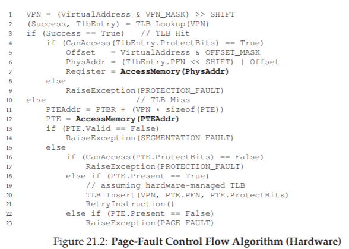
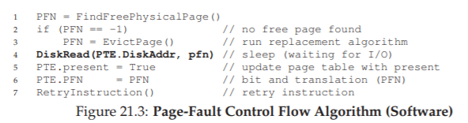

# 21 Beyond Physical Memory: Mechanisms  
(Vượt ra ngoài bộ nhớ vật lý: Các cơ chế)

Cho đến nay, chúng ta đã giả định rằng **address space** (không gian địa chỉ) là rất nhỏ và vừa khít trong **physical memory** (bộ nhớ vật lý). Thực tế, chúng ta còn giả định rằng mọi address space của mọi **process** (tiến trình) đang chạy đều vừa trong bộ nhớ. Bây giờ, chúng ta sẽ nới lỏng các giả định lớn này và giả định rằng ta muốn hỗ trợ nhiều address space lớn chạy đồng thời. Để làm được điều đó, chúng ta cần một tầng bổ sung trong **memory hierarchy** (hệ phân cấp bộ nhớ).  

Cho đến giờ, chúng ta giả định rằng tất cả các **page** (trang) đều nằm trong physical memory. Tuy nhiên, để hỗ trợ address space lớn, **OS** (hệ điều hành) sẽ cần một nơi để “cất giữ” các phần của address space hiện không được sử dụng nhiều. Nói chung, đặc điểm của vị trí này là nó phải có dung lượng lớn hơn bộ nhớ; do đó, nó thường chậm hơn (nếu nhanh hơn, chúng ta đã dùng nó làm bộ nhớ rồi, đúng không?). Trong các hệ thống hiện đại, vai trò này thường do **hard disk drive** (ổ đĩa cứng) đảm nhiệm. Vì vậy, trong memory hierarchy, các ổ cứng lớn và chậm nằm ở đáy, với bộ nhớ ở ngay phía trên. Và đây chính là vấn đề mấu chốt:

> **THE CRUX: HOW TO GO BEYOND PHYSICAL MEMORY**  
> (Làm thế nào để vượt ra ngoài giới hạn bộ nhớ vật lý)  
> Làm thế nào để OS sử dụng một thiết bị lớn hơn, chậm hơn để cung cấp một cách trong suốt ảo tưởng về một **virtual address space** (không gian địa chỉ ảo) lớn?

Một câu hỏi bạn có thể đặt ra: tại sao chúng ta muốn hỗ trợ một address space lớn cho một process? Câu trả lời, một lần nữa, là vì **tính tiện lợi và dễ sử dụng**. Với một address space lớn, bạn không cần lo lắng liệu có đủ chỗ trong bộ nhớ cho các **data structure** (cấu trúc dữ liệu) của chương trình hay không; thay vào đó, bạn chỉ cần viết chương trình một cách tự nhiên, cấp phát bộ nhớ khi cần. Đây là một ảo tưởng mạnh mẽ mà OS cung cấp, giúp cuộc sống của bạn đơn giản hơn rất nhiều.  

Ngược lại, trong các hệ thống cũ sử dụng **memory overlays** (lớp phủ bộ nhớ), lập trình viên phải tự di chuyển các phần code hoặc dữ liệu vào và ra khỏi bộ nhớ khi cần [D97]. Hãy thử tưởng tượng: trước khi gọi một hàm hoặc truy cập dữ liệu, bạn phải đảm bảo code hoặc dữ liệu đó đã nằm trong bộ nhớ; thật phiền phức!

> **ASIDE: STORAGE TECHNOLOGIES**  
> (Công nghệ lưu trữ)  
> Chúng ta sẽ tìm hiểu sâu hơn về cách các **I/O device** (thiết bị vào/ra) hoạt động ở phần sau (xem chương về I/O devices). Hãy kiên nhẫn! Và tất nhiên, thiết bị chậm hơn không nhất thiết phải là ổ cứng, mà có thể là thiết bị hiện đại hơn như **Flash-based SSD** (ổ SSD dùng bộ nhớ flash). Chúng ta cũng sẽ bàn về những thứ đó. Hiện tại, hãy giả định rằng chúng ta có một thiết bị lớn và tương đối chậm, có thể dùng để giúp xây dựng ảo tưởng về một **virtual memory** (bộ nhớ ảo) rất lớn, thậm chí lớn hơn cả physical memory.

Không chỉ cho một process, việc bổ sung **swap space** (không gian hoán đổi) cho phép OS hỗ trợ ảo tưởng về một virtual memory lớn cho nhiều process chạy đồng thời. Sự ra đời của **multiprogramming** (đa chương trình — chạy nhiều chương trình “cùng lúc” để tận dụng tốt hơn máy tính) gần như đòi hỏi khả năng hoán đổi một số page ra ngoài, vì các máy tính đời đầu rõ ràng không thể chứa tất cả page cần thiết cho mọi process cùng lúc. Do đó, sự kết hợp giữa multiprogramming và tính tiện lợi dẫn đến nhu cầu hỗ trợ sử dụng nhiều bộ nhớ hơn mức vật lý sẵn có. Đây là điều mà tất cả các hệ thống **VM** (virtual memory) hiện đại đều làm; và giờ chúng ta sẽ tìm hiểu kỹ hơn.

## 21.1 Swap Space  
(Không gian hoán đổi)

Điều đầu tiên chúng ta cần làm là **dành một phần dung lượng trên đĩa** để di chuyển các page ra vào. Trong OS, chúng ta thường gọi vùng này là **swap space**, vì ta **swap** (hoán đổi) các page từ bộ nhớ ra đó và từ đó vào bộ nhớ. Do đó, ta sẽ giả định rằng OS có thể đọc và ghi vào swap space theo đơn vị kích thước page.  

Để làm được điều này, OS cần ghi nhớ **địa chỉ trên đĩa** của một page nhất định. Kích thước của swap space rất quan trọng, vì nó quyết định số lượng tối đa các page bộ nhớ có thể được hệ thống sử dụng tại một thời điểm. Để đơn giản, tạm giả định rằng nó rất lớn.

**Figure 21.1: Physical Memory and Swap Space**  
*(Bộ nhớ vật lý và không gian hoán đổi)*

Trong ví dụ nhỏ (*Figure 21.1*), bạn có thể thấy một ví dụ với **physical memory** 4 page và **swap space** 8 page. Trong ví dụ, ba process (Proc 0, Proc 1, Proc 2) đang chia sẻ physical memory; mỗi process chỉ có một số page hợp lệ trong bộ nhớ, phần còn lại nằm trong swap space trên đĩa. Một process thứ tư (Proc 3) có toàn bộ page bị hoán đổi ra đĩa, và rõ ràng không chạy tại thời điểm này. Một khối swap vẫn còn trống. Ngay cả từ ví dụ nhỏ này, hy vọng bạn có thể thấy việc sử dụng swap space cho phép hệ thống “giả vờ” rằng bộ nhớ lớn hơn thực tế.

Cần lưu ý rằng swap space không phải là vị trí duy nhất trên đĩa cho lưu lượng hoán đổi. Ví dụ, giả sử bạn đang chạy một **program binary** (tệp thực thi chương trình) như `ls` hoặc chương trình `main` do bạn biên dịch. Các **code page** (trang mã) từ binary này ban đầu nằm trên đĩa, và khi chương trình chạy, chúng được nạp vào bộ nhớ (hoặc tất cả cùng lúc khi chương trình bắt đầu, hoặc — như trong các hệ thống hiện đại — từng page một khi cần). Tuy nhiên, nếu hệ thống cần giải phóng bộ nhớ vật lý cho mục đích khác, nó có thể tái sử dụng không gian bộ nhớ của các code page này, vì biết rằng có thể nạp lại chúng từ binary trên đĩa trong **file system** (hệ thống tệp).

## 21.2 The Present Bit  
(Bit hiện diện)

Bây giờ, khi đã có không gian trên đĩa, chúng ta cần bổ sung một số cơ chế ở tầng cao hơn trong hệ thống để hỗ trợ việc hoán đổi page ra/vào đĩa. Giả sử, để đơn giản, rằng chúng ta có một hệ thống với **hardware-managed TLB** (TLB do phần cứng quản lý).

Hãy nhớ lại điều gì xảy ra khi có một **memory reference** (tham chiếu bộ nhớ). Process đang chạy tạo ra các tham chiếu tới virtual memory (cho việc nạp lệnh hoặc truy cập dữ liệu), và trong trường hợp này, phần cứng dịch chúng sang **physical address** (địa chỉ vật lý) trước khi lấy dữ liệu mong muốn từ bộ nhớ.

Nhớ rằng phần cứng trước tiên trích xuất **VPN** (virtual page number — số trang ảo) từ virtual address, kiểm tra TLB để tìm khớp (**TLB hit**), và nếu hit, tạo ra physical address tương ứng và lấy dữ liệu từ bộ nhớ. Đây là trường hợp phổ biến và nhanh (không cần thêm truy cập bộ nhớ).

Nếu VPN không có trong TLB (**TLB miss**), phần cứng sẽ tìm **page table** (bảng trang) trong bộ nhớ (sử dụng **page table base register**) và tra cứu **PTE** (page-table entry) cho page này bằng VPN làm chỉ số. Nếu page hợp lệ và có mặt trong physical memory, phần cứng trích xuất PFN từ PTE, nạp nó vào TLB, và thực thi lại lệnh, lần này tạo ra TLB hit; mọi thứ vẫn ổn.

Tuy nhiên, nếu muốn cho phép page được hoán đổi ra đĩa, chúng ta phải bổ sung thêm cơ chế. Cụ thể, khi phần cứng tra cứu PTE, nó có thể phát hiện page không có trong physical memory. Cách phần cứng (hoặc OS, trong trường hợp **software-managed TLB**) xác định điều này là thông qua một thông tin mới trong mỗi PTE, gọi là **present bit** (

(TODO)

> **ASIDE: SWAPPING TERMINOLOGY AND OTHER THINGS**  
> (Thuật ngữ hoán đổi và một số vấn đề khác)  
> Thuật ngữ trong các hệ thống **virtual memory** (bộ nhớ ảo) có thể hơi gây nhầm lẫn và thay đổi tùy theo máy và hệ điều hành. Ví dụ, **page fault** (lỗi trang) nói chung có thể chỉ bất kỳ tham chiếu nào tới **page table** (bảng trang) dẫn đến một loại lỗi nào đó: điều này có thể bao gồm loại lỗi mà chúng ta đang thảo luận ở đây, tức là **page-not-present fault** (lỗi trang không hiện diện), nhưng đôi khi cũng có thể chỉ các truy cập bộ nhớ bất hợp pháp. Thực tế, thật kỳ lạ khi chúng ta gọi một truy cập hoàn toàn hợp lệ (tới một page đã được ánh xạ vào virtual address space của một **process** (tiến trình), nhưng tại thời điểm đó không nằm trong physical memory) là một “fault” (lỗi); thực ra, nó nên được gọi là **page miss** (trượt trang). Nhưng thường thì, khi mọi người nói một chương trình đang “page faulting”, họ muốn nói rằng nó đang truy cập các phần của virtual address space mà OS đã hoán đổi ra đĩa.  
>  
> Chúng tôi cho rằng lý do hành vi này được gọi là “fault” liên quan đến cơ chế trong OS để xử lý nó. Khi có điều gì bất thường xảy ra, tức là khi phần cứng gặp một tình huống mà nó không biết cách xử lý, phần cứng sẽ đơn giản chuyển quyền điều khiển cho OS, hy vọng OS có thể xử lý tốt hơn. Trong trường hợp này, một page mà process muốn truy cập bị thiếu trong bộ nhớ; phần cứng chỉ có thể làm một việc duy nhất là phát sinh **exception** (ngoại lệ), và OS tiếp quản từ đó. Vì điều này giống hệt với những gì xảy ra khi một process làm điều gì đó bất hợp pháp, nên không có gì ngạc nhiên khi chúng ta gọi hoạt động này là một “fault”.

Hành động truy cập một page không nằm trong physical memory thường được gọi là **page fault**. Khi xảy ra page fault, OS sẽ được gọi để xử lý. Một đoạn mã cụ thể, gọi là **page-fault handler** (trình xử lý lỗi trang), sẽ chạy và phải xử lý page fault, như chúng ta sẽ mô tả dưới đây.

## 21.3 The Page Fault  
(Lỗi trang)

Hãy nhớ rằng với **TLB miss** (trượt TLB), chúng ta có hai loại hệ thống: **hardware-managed TLB** (TLB do phần cứng quản lý — phần cứng tra cứu page table để tìm bản dịch mong muốn) và **software-managed TLB** (TLB do phần mềm quản lý — OS thực hiện). Trong cả hai loại hệ thống, nếu một page không hiện diện, OS sẽ chịu trách nhiệm xử lý page fault. **Page-fault handler** của OS sẽ chạy để xác định cần làm gì. Hầu như tất cả các hệ thống đều xử lý page fault bằng phần mềm; ngay cả với hardware-managed TLB, phần cứng cũng tin tưởng OS để quản lý nhiệm vụ quan trọng này.

Nếu một page không hiện diện và đã bị hoán đổi ra đĩa, OS sẽ cần hoán đổi page đó vào bộ nhớ để xử lý page fault. Do đó, câu hỏi đặt ra: làm thế nào OS biết được vị trí của page cần tìm? Trong nhiều hệ thống, page table là nơi tự nhiên để lưu trữ thông tin này.

> **ASIDE: WHY HARDWARE DOESN’T HANDLE PAGE FAULTS**  
> (Tại sao phần cứng không xử lý page fault)  
> Từ kinh nghiệm với TLB, chúng ta biết rằng các nhà thiết kế phần cứng thường không muốn tin tưởng OS làm nhiều việc. Vậy tại sao họ lại tin tưởng OS xử lý page fault? Có một vài lý do chính. Thứ nhất, page fault tới đĩa là chậm; ngay cả khi OS mất nhiều thời gian để xử lý lỗi, thực thi hàng loạt lệnh, thì bản thân thao tác đĩa vốn đã chậm đến mức chi phí bổ sung của phần mềm là không đáng kể. Thứ hai, để có thể xử lý page fault, phần cứng sẽ phải hiểu về swap space, cách phát lệnh I/O tới đĩa, và nhiều chi tiết khác mà hiện tại nó không biết nhiều. Vì vậy, vì cả lý do hiệu năng và đơn giản, OS xử lý page fault, và ngay cả các kỹ sư phần cứng cũng hài lòng với điều đó.

Do đó, OS có thể sử dụng các bit trong PTE vốn thường dùng cho dữ liệu như PFN của page để lưu địa chỉ trên đĩa. Khi OS nhận được page fault cho một page, nó sẽ tra cứu PTE để tìm địa chỉ, và phát lệnh tới đĩa để nạp page vào bộ nhớ.

Khi I/O đĩa hoàn tất, OS sẽ cập nhật page table để đánh dấu page là **present** (hiện diện), cập nhật trường PFN của PTE để ghi lại vị trí trong bộ nhớ của page vừa được nạp, và thực thi lại lệnh. Lần thử tiếp theo có thể tạo ra một TLB miss, khi đó sẽ được xử lý và cập nhật TLB với bản dịch (hoặc có thể cập nhật TLB ngay khi xử lý page fault để bỏ qua bước này). Cuối cùng, lần thực thi lại cuối cùng sẽ tìm thấy bản dịch trong TLB và tiếp tục lấy dữ liệu hoặc lệnh mong muốn từ bộ nhớ tại địa chỉ vật lý đã dịch.

Lưu ý rằng trong khi I/O đang diễn ra, process sẽ ở trạng thái **blocked** (bị chặn). Do đó, OS có thể chạy các process sẵn sàng khác trong khi page fault đang được xử lý. Vì I/O tốn kém, việc chồng lấp giữa I/O (page fault) của một process và việc thực thi của process khác là một cách nữa để hệ thống **multiprogramming** (đa chương trình) tận dụng hiệu quả phần cứng.

## 21.4 What If Memory Is Full?  
(Điều gì xảy ra nếu bộ nhớ đầy?)

Trong quy trình mô tả ở trên, bạn có thể nhận thấy rằng chúng ta giả định có nhiều bộ nhớ trống để nạp một page từ swap space. Tất nhiên, điều này có thể không đúng; bộ nhớ có thể đã đầy (hoặc gần đầy). Do đó, OS có thể muốn trước tiên **page out** (đưa ra ngoài) một hoặc nhiều page để tạo chỗ cho page mới sắp được nạp vào. Quá trình chọn một page để loại bỏ hoặc thay thế được gọi là **page-replacement policy** (chính sách thay thế trang).

Thực tế, đã có rất nhiều nghiên cứu để tạo ra một page-replacement policy tốt, vì loại bỏ nhầm page có thể gây tổn thất lớn cho hiệu năng chương trình. Quyết định sai có thể khiến chương trình chạy với tốc độ như đĩa thay vì tốc độ bộ nhớ; với công nghệ hiện tại, điều đó có nghĩa là chương trình có thể chạy chậm hơn 10.000 hoặc 100.000 lần. Do đó, chính sách này là thứ chúng ta nên nghiên cứu chi tiết; và đó chính xác là những gì chúng ta sẽ làm ở chương tiếp theo. Hiện tại, chỉ cần hiểu rằng chính sách này tồn tại, được xây dựng dựa trên các cơ chế đã mô tả ở đây.

## 21.5 Page Fault Control Flow  
(Luồng điều khiển khi xảy ra lỗi trang)

Với tất cả kiến thức này, chúng ta có thể phác thảo sơ bộ luồng điều khiển hoàn chỉnh của việc truy cập bộ nhớ. Nói cách khác, khi ai đó hỏi bạn “chuyện gì xảy ra khi một chương trình lấy dữ liệu từ bộ nhớ?”, bạn nên có ý tưởng khá rõ về tất cả các khả năng khác nhau. Xem luồng điều khiển trong *Figure 21.2* và *Figure 21.3* để biết chi tiết; hình đầu tiên cho thấy phần cứng làm gì trong quá trình dịch địa chỉ, và hình thứ hai cho thấy OS làm gì khi xảy ra page fault.

**Figure 21.2: Page-Fault Control Flow Algorithm (Hardware)**  
*(Thuật toán luồng điều khiển lỗi trang — phần cứng)*

**Figure 21.3: Page-Fault Control Flow Algorithm (Software)**  
*(Thuật toán luồng điều khiển lỗi trang — phần mềm)*

Từ sơ đồ luồng điều khiển phần cứng trong *Figure 21.2*, lưu ý rằng hiện có ba trường hợp quan trọng cần hiểu khi xảy ra TLB miss:  
1. Page vừa **present** vừa **valid** (Dòng 18–21); trong trường hợp này, **TLB miss handler** chỉ cần lấy PFN từ PTE, thực thi lại lệnh (lần này sẽ là TLB hit), và tiếp tục như đã mô tả trước đó.  
2. **Page fault handler** phải chạy (Dòng 22–23); mặc dù đây là page hợp lệ để process truy cập (valid), nhưng nó không hiện diện trong physical memory.  
3. Truy cập tới một page **invalid** (kh

(TODO)

Để giữ một lượng nhỏ bộ nhớ trống, hầu hết các **operating system** (hệ điều hành) đều có một cơ chế **high watermark** (HW — ngưỡng cao) và **low watermark** (LW — ngưỡng thấp) để quyết định khi nào bắt đầu **evicting pages** (loại bỏ các trang) khỏi bộ nhớ. Cách hoạt động như sau: khi OS phát hiện số lượng page trống ít hơn LW, một **background thread** (luồng nền) chịu trách nhiệm giải phóng bộ nhớ sẽ chạy. Luồng này sẽ loại bỏ các page cho đến khi số lượng page trống đạt HW. Background thread này, đôi khi được gọi là **swap daemon** hoặc **page daemon**[^1], sau đó sẽ chuyển sang trạng thái ngủ, hài lòng vì đã giải phóng được một lượng bộ nhớ để các process đang chạy và OS có thể sử dụng.

[^1]: Từ “daemon”, thường được phát âm là “demon”, là một thuật ngữ cũ chỉ một background thread hoặc process thực hiện một công việc hữu ích. Nguồn gốc của thuật ngữ này (một lần nữa!) xuất phát từ hệ thống **Multics** [CS94].

> **TIP: DO WORK IN THE BACKGROUND**  
> (Thực hiện công việc ở chế độ nền)  
> Khi bạn có một số công việc cần làm, thường là một ý tưởng hay nếu thực hiện chúng ở chế độ nền để tăng hiệu quả và cho phép gom nhóm các thao tác. OS thường thực hiện công việc ở chế độ nền; ví dụ, nhiều hệ thống **buffer** (đệm) các thao tác ghi file trong bộ nhớ trước khi thực sự ghi dữ liệu ra đĩa. Cách làm này có nhiều lợi ích tiềm năng: tăng hiệu quả của đĩa, vì đĩa có thể nhận nhiều yêu cầu ghi cùng lúc và do đó lập lịch tốt hơn; cải thiện độ trễ ghi, vì ứng dụng nghĩ rằng thao tác ghi đã hoàn tất rất nhanh; khả năng giảm khối lượng công việc, vì có thể các thao tác ghi này sẽ không bao giờ cần ghi ra đĩa (ví dụ: nếu file bị xóa); và tận dụng tốt hơn thời gian nhàn rỗi, vì công việc nền có thể được thực hiện khi hệ thống đang rảnh, từ đó khai thác phần cứng hiệu quả hơn [G+95].

Bằng cách thực hiện nhiều thao tác thay thế (replacement) cùng lúc, các tối ưu hiệu năng mới trở nên khả thi. Ví dụ, nhiều hệ thống sẽ **cluster** hoặc nhóm một số page và ghi chúng ra **swap partition** (phân vùng hoán đổi) cùng lúc, từ đó tăng hiệu quả của đĩa [LL82]; như chúng ta sẽ thấy sau khi bàn chi tiết về đĩa, việc clustering như vậy giúp giảm **seek** và **rotational overheads** (chi phí tìm kiếm và quay) của đĩa, từ đó cải thiện hiệu năng đáng kể.

Để phối hợp với background paging thread, luồng điều khiển trong *Figure 21.3* nên được điều chỉnh một chút; thay vì thực hiện replacement trực tiếp, thuật toán sẽ chỉ cần kiểm tra xem có page trống nào không. Nếu không, nó sẽ thông báo cho background paging thread rằng cần có page trống; khi luồng này giải phóng được một số page, nó sẽ đánh thức lại luồng ban đầu, luồng này sau đó có thể **page in** (nạp vào) page mong muốn và tiếp tục công việc.

## 21.7 Summary  
(Tóm tắt)

Trong chương ngắn này, chúng ta đã giới thiệu khái niệm truy cập nhiều bộ nhớ hơn mức hiện diện vật lý trong hệ thống. Để làm được điều đó đòi hỏi cấu trúc page table phức tạp hơn, vì cần có một **present bit** (bit hiện diện) để cho biết page có đang ở trong bộ nhớ hay không. Khi page không hiện diện, **page-fault handler** (trình xử lý lỗi trang) của OS sẽ chạy để xử lý page fault, và sắp xếp việc chuyển page mong muốn từ đĩa vào bộ nhớ, có thể trước tiên phải thay thế một số page trong bộ nhớ để tạo chỗ cho các page sắp được nạp vào.

Điều quan trọng (và thật đáng kinh ngạc!) cần nhớ là tất cả các hành động này diễn ra **một cách trong suốt** đối với process. Đối với process, nó chỉ đang truy cập vào virtual memory riêng, liên tục của mình. Ở phía sau, các page được đặt ở những vị trí tùy ý (không liên tục) trong physical memory, và đôi khi chúng thậm chí không có trong bộ nhớ, buộc phải nạp từ đĩa. Mặc dù chúng ta hy vọng rằng trong trường hợp phổ biến, truy cập bộ nhớ sẽ nhanh, nhưng trong một số trường hợp, sẽ cần nhiều thao tác đĩa để xử lý; một việc đơn giản như thực hiện một lệnh đơn có thể, trong trường hợp xấu nhất, mất nhiều mili-giây để hoàn tất.