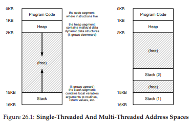
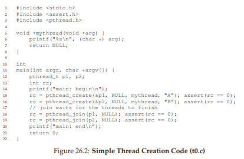
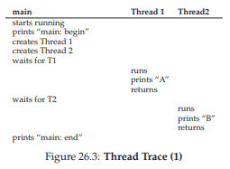
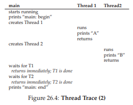
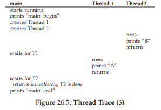

# 26 Tính đồng thời: Giới thiệu (Concurrency: An Introduction)

Cho đến nay, chúng ta đã tìm hiểu sự phát triển của các **abstraction** (trừu tượng hóa) cơ bản mà **OS** (hệ điều hành) thực hiện. Chúng ta đã thấy cách biến một **physical CPU** (CPU vật lý) thành nhiều **virtual CPU** (CPU ảo), từ đó tạo ra ảo tưởng rằng nhiều chương trình đang chạy đồng thời. Chúng ta cũng đã thấy cách tạo ra ảo tưởng về một **virtual memory** (bộ nhớ ảo) lớn và riêng tư cho mỗi **process** (tiến trình); abstraction của **address space** (không gian địa chỉ) này cho phép mỗi chương trình hoạt động như thể nó có bộ nhớ riêng, trong khi thực tế OS đang bí mật **multiplexing** (đa hợp) các address space trên physical memory (và đôi khi cả đĩa).

Trong chương này, chúng ta giới thiệu một abstraction mới cho một process đang chạy: **thread** (luồng). Thay vì cách nhìn cổ điển về một **điểm thực thi duy nhất** trong chương trình (tức là một **PC** — program counter — nơi các lệnh được nạp và thực thi), một chương trình **multi-threaded** (đa luồng) có nhiều điểm thực thi (tức là nhiều PC, mỗi PC đang được nạp và thực thi). Một cách khác để hình dung là: mỗi thread gần giống như một process riêng biệt, ngoại trừ một điểm khác biệt: chúng **chia sẻ cùng một address space** và do đó có thể truy cập cùng dữ liệu.

**Trạng thái** của một thread đơn lẻ rất giống với trạng thái của một process. Nó có một **program counter (PC)** để theo dõi vị trí chương trình đang nạp lệnh. Mỗi thread có tập **register** (thanh ghi) riêng để thực hiện tính toán; do đó, nếu có hai thread chạy trên một CPU, khi chuyển từ thread này (T1) sang thread kia (T2), cần thực hiện **context switch** (chuyển ngữ cảnh). Context switch giữa các thread khá giống với context switch giữa các process, vì trạng thái register của T1 phải được lưu và trạng thái register của T2 phải được khôi phục trước khi chạy T2. Với process, chúng ta lưu trạng thái vào **process control block (PCB)**; bây giờ, chúng ta cần một hoặc nhiều **thread control block (TCB)** để lưu trạng thái của từng thread trong một process. Tuy nhiên, có một điểm khác biệt lớn trong context switch giữa thread so với process: **address space vẫn giữ nguyên** (tức là không cần chuyển đổi page table đang sử dụng).

Một khác biệt lớn khác giữa thread và process liên quan đến **stack**. Trong mô hình đơn giản về address space của một process cổ điển (mà giờ ta có thể gọi là **single-threaded process** — tiến trình đơn luồng), chỉ có một stack, thường nằm ở cuối address space (*Figure 26.1*, bên trái). Tuy nhiên, trong một **multi-threaded process**, mỗi thread chạy độc lập và tất nhiên có thể gọi vào nhiều **routine** (hàm con) khác nhau để thực hiện công việc. Thay vì một stack duy nhất trong address space, sẽ có **một stack cho mỗi thread**. Giả sử chúng ta có một multi-threaded process với hai thread; address space kết quả sẽ khác (*Figure 26.1*, bên phải).


**Figure 26.1: Single-Threaded And Multi-Threaded Address Spaces**  
*(Không gian địa chỉ của tiến trình đơn luồng và đa luồng)*

Trong hình này, bạn có thể thấy hai stack nằm rải rác trong address space của process. Do đó, bất kỳ biến cấp phát trên stack, tham số, giá trị trả về, và các dữ liệu khác mà ta đặt trên stack sẽ được lưu trong cái gọi là **thread-local storage** (bộ nhớ cục bộ của luồng), tức là stack của thread tương ứng.

Bạn cũng có thể nhận thấy điều này phá vỡ bố cục address space “đẹp đẽ” trước đây. Trước kia, stack và heap có thể phát triển độc lập và chỉ gặp vấn đề khi hết không gian trong address space. Giờ đây, chúng ta không còn tình huống thuận lợi như vậy. May mắn thay, điều này thường không sao, vì stack thường không cần quá lớn (ngoại lệ là các chương trình sử dụng đệ quy sâu).


## 26.1 Tại sao sử dụng Thread? (Why Use Threads?)

Trước khi đi sâu vào chi tiết về thread và một số vấn đề có thể gặp khi lập trình đa luồng, hãy trả lời một câu hỏi đơn giản hơn: **Tại sao lại dùng thread?**

Hóa ra, có ít nhất **hai lý do chính** để bạn nên dùng thread.

**Lý do thứ nhất** rất đơn giản: **parallelism** (tính song song). Hãy tưởng tượng bạn đang viết một chương trình thực hiện các phép toán trên các mảng rất lớn, ví dụ: cộng hai mảng lớn với nhau, hoặc tăng giá trị của mỗi phần tử trong mảng lên một lượng nào đó. Nếu bạn chạy trên một CPU duy nhất, nhiệm vụ khá đơn giản: chỉ cần thực hiện từng phép toán và xong. Tuy nhiên, nếu bạn chạy chương trình trên một hệ thống có nhiều CPU, bạn có khả năng tăng tốc quá trình này đáng kể bằng cách để mỗi CPU thực hiện một phần công việc. Việc biến một chương trình đơn luồng tiêu chuẩn thành một chương trình thực hiện công việc này trên nhiều CPU được gọi là **parallelization** (song song hóa), và sử dụng một thread cho mỗi CPU để làm việc là cách tự nhiên và phổ biến để tăng tốc chương trình trên phần cứng hiện đại.

**Lý do thứ hai** tinh tế hơn: **tránh chặn tiến trình của chương trình do I/O chậm**. Hãy tưởng tượng bạn đang viết một chương trình thực hiện nhiều loại I/O khác nhau: chờ gửi hoặc nhận tin nhắn, chờ một thao tác **disk I/O** (I/O đĩa) hoàn tất, hoặc thậm chí (ngầm) chờ một **page fault** được xử lý xong. Thay vì chờ đợi, chương trình của bạn có thể muốn làm việc khác, bao gồm tận dụng CPU để tính toán, hoặc thậm chí gửi thêm yêu cầu I/O khác. Sử dụng thread là cách tự nhiên để tránh bị “mắc kẹt”; khi một thread trong chương trình chờ (tức là bị **blocked** do I/O), **CPU scheduler** (bộ lập lịch CPU) có thể chuyển sang các thread khác đang sẵn sàng chạy và làm việc hữu ích. Threading cho phép **overlap** (chồng lấp) giữa I/O và các hoạt động khác trong cùng một chương trình, tương tự như **multiprogramming** (đa chương trình) đã làm cho các process giữa các chương trình; kết quả là nhiều ứng dụng server hiện đại (web server, hệ quản trị cơ sở dữ liệu, v.v.) sử dụng thread trong triển khai của chúng.

Tất nhiên, trong cả hai trường hợp trên, bạn **có thể** dùng nhiều process thay vì thread. Tuy nhiên, thread **chia sẻ cùng một address space** và do đó dễ dàng chia sẻ dữ liệu, vì vậy là lựa chọn tự nhiên khi xây dựng các loại chương trình này. Process là lựa chọn hợp lý hơn cho các tác vụ tách biệt về mặt logic, nơi ít cần chia sẻ cấu trúc dữ liệu trong bộ nhớ.

## 26.2 Ví dụ: Tạo Thread (An Example: Thread Creation)

Bây giờ chúng ta đi vào một số chi tiết. Giả sử chúng ta muốn chạy một chương trình tạo ra hai **thread** (luồng), mỗi thread thực hiện một công việc độc lập, trong trường hợp này là in ra “A” hoặc “B”. Mã nguồn được thể hiện trong *Figure 26.2* (trang 4).


**Figure 26.2: Simple Thread Creation Code (t0.c)**

Chương trình **main** tạo ra hai thread (gọi là T1 và T2), mỗi thread sẽ chạy hàm `mythread()`, nhưng với các đối số khác nhau (chuỗi “A” hoặc “B”). Ngay khi một thread được tạo, nó có thể bắt đầu chạy ngay lập tức (tùy thuộc vào quyết định của **scheduler** — bộ lập lịch); hoặc nó có thể được đưa vào trạng thái “ready” (sẵn sàng) nhưng chưa “running” (đang chạy) và do đó chưa thực thi. Tất nhiên, trên một hệ thống **multiprocessor** (đa bộ xử lý), các thread thậm chí có thể chạy đồng thời, nhưng tạm thời chúng ta chưa xét đến khả năng này.

Sau khi tạo hai thread, **main thread** gọi `pthread_join()`, hàm này sẽ chờ một thread cụ thể hoàn thành. Lệnh này được gọi hai lần, đảm bảo T1 và T2 sẽ chạy và hoàn tất trước khi cho phép main thread chạy tiếp; khi đó, nó sẽ in ra “main: end” và thoát. Tổng cộng, ba thread được sử dụng trong lần chạy này: main thread, T1 và T2.

Hãy xem xét các khả năng sắp xếp thứ tự thực thi của chương trình nhỏ này. Trong sơ đồ thực thi (*Figure 26.3*, trang 5), thời gian tăng dần theo chiều từ trên xuống, và mỗi cột thể hiện thời điểm một thread khác nhau (main, Thread 1 hoặc Thread 2) đang chạy.


**Figure 26.3: Thread Trace (1)**

Tuy nhiên, cần lưu ý rằng thứ tự này không phải là thứ tự duy nhất có thể xảy ra. Thực tế, với một chuỗi lệnh, có khá nhiều khả năng, tùy thuộc vào việc scheduler quyết định chạy thread nào tại một thời điểm nhất định. Ví dụ, ngay khi một thread được tạo, nó có thể chạy ngay lập tức, dẫn đến thứ tự thực thi như trong *Figure 26.4* (trang 5).


**Figure 26.4: Thread Trace (2)**

Chúng ta thậm chí có thể thấy “B” được in trước “A”, nếu scheduler quyết định chạy Thread 2 trước, mặc dù Thread 1 được tạo trước; không có lý do gì để giả định rằng thread được tạo trước sẽ chạy trước. *Figure 26.5* (trang 6) cho thấy thứ tự thực thi này, với việc Thread 2 chạy trước Thread 1.


**Figure 26.5: Thread Trace (3)**

Như bạn có thể thấy, một cách để hình dung việc tạo thread là nó giống như gọi một hàm; tuy nhiên, thay vì thực thi hàm trước rồi mới quay lại hàm gọi, hệ thống sẽ tạo ra một **thread of execution** (luồng thực thi) mới cho routine được gọi, và nó chạy độc lập với hàm gọi, có thể trước khi `create` trả về, hoặc có thể muộn hơn nhiều. Thread nào chạy tiếp theo được quyết định bởi OS scheduler, và mặc dù scheduler có thể triển khai một thuật toán hợp lý, nhưng rất khó để biết chính xác thread nào sẽ chạy tại một thời điểm bất kỳ.

Bạn cũng có thể nhận ra từ ví dụ này rằng thread làm mọi thứ trở nên phức tạp: ngay cả việc xác định cái gì sẽ chạy khi nào cũng đã khó! Máy tính vốn đã khó hiểu nếu không có concurrency (tính đồng thời). Đáng tiếc là với concurrency, mọi thứ còn tệ hơn. Nhiều hơn thế nữa.


## 26.3 Tại sao mọi thứ tệ hơn: Dữ liệu chia sẻ (Why It Gets Worse: Shared Data)

Ví dụ thread đơn giản ở trên hữu ích để minh họa cách tạo thread và cách chúng có thể chạy theo các thứ tự khác nhau tùy vào scheduler. Tuy nhiên, nó chưa cho thấy cách các thread tương tác khi truy cập **shared data** (dữ liệu chia sẻ).

Hãy tưởng tượng một ví dụ đơn giản, nơi hai thread muốn cập nhật một biến toàn cục dùng chung. Mã nguồn được nghiên cứu nằm trong *Figure 26.6* (trang 7).


**Figure 26.6: Sharing Data: Uh Oh (t1.c)**

Một vài ghi chú về mã nguồn:  
- Thứ nhất, như Stevens gợi ý [SR05], chúng ta **wrap** (bao bọc) các routine tạo và join thread để thoát ngay khi gặp lỗi; với một chương trình đơn giản như thế này, chúng ta ít nhất muốn phát hiện lỗi (nếu có), nhưng không cần xử lý phức tạp (ví dụ: chỉ cần thoát). Do đó, `Pthread_create()` chỉ đơn giản gọi `pthread_create()` và đảm bảo mã trả về là 0; nếu không, `Pthread_create()` sẽ in thông báo và thoát.  
- Thứ hai, thay vì dùng hai hàm riêng cho các worker thread, chúng ta chỉ dùng một đoạn code và truyền đối số (ở đây là một chuỗi) để mỗi thread in ra một ký tự khác nhau trước thông điệp của nó.  
- Cuối cùng, và quan trọng nhất, chúng ta xem mỗi worker đang làm gì: cộng một số vào biến chia sẻ `counter`, và làm điều đó 10 triệu lần (1e7) trong vòng lặp. Kết quả mong muốn: **20.000.000**.

Bây giờ, chúng ta biên dịch và chạy chương trình để xem hành vi:

Trường hợp mọi thứ diễn ra như mong đợi:

```
prompt> gcc -o main main.c -Wall -pthread; ./main
main: begin (counter = 0)
A: begin
B: begin
A: done
B: done
main: done with both (counter = 20000000)
```

Đáng tiếc, khi chạy chương trình này, ngay cả trên một CPU đơn, chúng ta **không nhất thiết** nhận được kết quả mong muốn. Đôi khi, kết quả là:

```
prompt> ./main
main: begin (counter = 0)
A: begin
B: begin
A: done
B: done
main: done with both (counter = 19345221)
```

Thử lại một lần nữa, chỉ để chắc rằng chúng ta không bị “ảo giác”. Rốt cuộc, chẳng phải máy tính được dạy là phải cho kết quả **deterministic** (xác định) sao?! Hay các giáo sư đã lừa chúng ta? (há hốc mồm)

```
prompt> ./main
main: begin (counter = 0)
A: begin
B: begin
A: done
B: done
main: done with both (counter = 19221041)
```

Không chỉ mỗi lần chạy đều **sai**, mà kết quả còn **khác nhau**! Câu hỏi lớn còn lại: **Tại sao điều này xảy ra?**


> **TIP: KNOW AND USE YOUR TOOLS**  
> (Biết và sử dụng thành thạo công cụ của bạn)  
> Bạn nên luôn học các công cụ mới giúp viết, gỡ lỗi và hiểu hệ thống máy tính. Ở đây, chúng ta sử dụng một công cụ hữu ích gọi là **disassembler** (trình dịch ngược mã máy sang assembly). Khi bạn chạy một disassembler trên một tệp thực thi (**executable**), nó sẽ hiển thị các lệnh **assembly** tạo nên chương trình. Ví dụ, nếu chúng ta muốn hiểu đoạn code cấp thấp dùng để cập nhật biến `counter` (như trong ví dụ), ta chạy `objdump` (trên Linux) để xem mã assembly:  
> ```
> prompt> objdump -d main
> ```  
> Thao tác này sẽ tạo ra một danh sách dài tất cả các lệnh trong chương trình, được gắn nhãn rõ ràng (đặc biệt nếu bạn biên dịch với cờ `-g`), bao gồm cả thông tin **symbol** (ký hiệu) trong chương trình. Chương trình `objdump` chỉ là một trong nhiều công cụ bạn nên học cách sử dụng; một **debugger** như `gdb`, các **memory profiler** như `valgrind` hoặc `purify`, và tất nhiên là cả trình biên dịch (**compiler**) cũng là những công cụ khác mà bạn nên dành thời gian tìm hiểu thêm; bạn càng thành thạo công cụ, bạn càng có thể xây dựng được những hệ thống tốt hơn.


## 26.4 Trọng tâm của vấn đề: Lập lịch không kiểm soát (The Heart Of The Problem: Uncontrolled Scheduling)

Để hiểu tại sao điều này xảy ra, chúng ta phải hiểu chuỗi lệnh mà **compiler** (trình biên dịch) sinh ra để cập nhật `counter`. Trong trường hợp này, chúng ta chỉ muốn cộng thêm một số (1) vào `counter`. Do đó, chuỗi lệnh để thực hiện có thể trông như sau (trên kiến trúc x86):

```assembly
mov 0x8049a1c, %eax
add $0x1, %eax
mov %eax, 0x8049a1c
```

Ví dụ này giả định rằng biến `counter` nằm tại địa chỉ `0x8049a1c`. Trong chuỗi ba lệnh này:  
- Lệnh `mov` của x86 được dùng trước tiên để lấy giá trị từ bộ nhớ tại địa chỉ đó và đưa vào thanh ghi `eax`.  
- Sau đó, lệnh `add` được thực hiện, cộng 1 (`0x1`) vào nội dung của thanh ghi `eax`.  
- Cuối cùng, nội dung của `eax` được lưu trở lại bộ nhớ tại cùng địa chỉ.

Hãy tưởng tượng một trong hai thread (Thread 1) đi vào đoạn code này, và chuẩn bị tăng `counter` lên một. Nó nạp giá trị của `counter` (giả sử ban đầu là 50) vào thanh ghi `eax`. Do đó, `eax = 50` đối với Thread 1. Sau đó, nó cộng thêm 1 vào thanh ghi; do đó `eax = 51`.

Bây giờ, một điều không may xảy ra: một **timer interrupt** (ngắt định thời) được kích hoạt; do đó, OS lưu trạng thái của thread đang chạy (PC, các thanh ghi bao gồm `eax`, v.v.) vào **TCB** (thread control block) của thread đó.

Tiếp theo, một điều tệ hơn xảy ra: Thread 2 được chọn để chạy, và nó cũng đi vào cùng đoạn code này. Nó cũng thực hiện lệnh đầu tiên, lấy giá trị của `counter` và đưa vào `eax` của nó (lưu ý: mỗi thread khi chạy có tập thanh ghi riêng; các thanh ghi này được “ảo hóa” bởi mã context switch lưu và khôi phục chúng). Giá trị của `counter` lúc này vẫn là 50, do đó Thread 2 có `eax = 50`. Giả sử Thread 2 thực hiện hai lệnh tiếp theo, tăng `eax` lên 1 (`eax = 51`), rồi lưu nội dung của `eax` vào `counter` (địa chỉ `0x8049a1c`). Như vậy, biến toàn cục `counter` giờ có giá trị 51.

Cuối cùng, một **context switch** khác xảy ra, và Thread 1 tiếp tục chạy. Nhớ rằng nó vừa thực hiện xong lệnh `mov` và `add`, và giờ chuẩn bị thực hiện lệnh `mov` cuối cùng. Cũng nhớ rằng `eax = 51`. Do đó, lệnh `mov` cuối cùng được thực thi, lưu giá trị vào bộ nhớ; `counter` được đặt thành 51 một lần nữa.

Nói ngắn gọn, điều đã xảy ra là: đoạn code tăng `counter` đã được chạy **hai lần**, nhưng `counter`, vốn bắt đầu ở 50, giờ chỉ bằng 51. Một phiên bản “đúng” của chương trình này lẽ ra phải khiến `counter` bằng 52.

Hãy xem một **execution trace** (vết thực thi) chi tiết để hiểu rõ hơn vấn đề. Giả sử, trong ví dụ này, đoạn code trên được nạp tại địa chỉ 100 trong bộ nhớ, như chuỗi sau (lưu ý cho những ai quen với các tập lệnh dạng RISC: x86 có lệnh độ dài biến đổi; lệnh `mov` này chiếm 5 byte bộ nhớ, và lệnh `add` chỉ chiếm 3 byte):

```
100 mov 0x8049a1c, %eax
105 add $0x1, %eax
108 mov %eax, 0x8049a1c
```


**Figure 26.7: The Problem: Up Close and Personal**  
*(Vấn đề: Cận cảnh và chi tiết)*

Với các giả định này, những gì xảy ra được minh họa trong **Hình 26.7** (trang 10). Giả sử biến `counter` bắt đầu với giá trị 50, và hãy lần theo ví dụ này để đảm bảo bạn hiểu điều gì đang diễn ra.

Những gì chúng ta vừa minh họa được gọi là **race condition** (điều kiện tranh chấp) — cụ thể hơn là **data race** (tranh chấp dữ liệu): kết quả phụ thuộc vào thời điểm thực thi của đoạn code. Với một chút “xui xẻo” (tức là **context switch** xảy ra tại những điểm không thuận lợi trong quá trình thực thi), chúng ta sẽ nhận kết quả sai. Thực tế, mỗi lần chạy có thể cho ra kết quả khác nhau; do đó, thay vì một phép tính **deterministic** (xác định) như chúng ta thường mong đợi từ máy tính, ta gọi kết quả này là **indeterminate** (không xác định), tức là không biết trước đầu ra sẽ là gì và rất có thể sẽ khác nhau giữa các lần chạy.

Bởi vì nhiều **thread** cùng thực thi đoạn code này có thể dẫn đến race condition, chúng ta gọi đoạn code này là một **critical section** (vùng tới hạn). Critical section là một đoạn code truy cập một biến chia sẻ (hoặc nói chung hơn là một tài nguyên chia sẻ) và **không được phép** thực thi đồng thời bởi nhiều hơn một thread.

Điều chúng ta thực sự muốn cho đoạn code này là **mutual exclusion** (loại trừ lẫn nhau). Tính chất này đảm bảo rằng nếu một thread đang thực thi bên trong critical section, các thread khác sẽ bị ngăn không cho làm điều đó.

Hầu như tất cả các thuật ngữ này, nhân tiện, đều được đặt ra bởi **Edsger Dijkstra**, một nhà tiên phong trong lĩnh vực này và đã giành giải **Turing Award** nhờ công trình này và các công trình khác; hãy xem bài báo năm 1968 của ông “Cooperating Sequential Processes” [D68] để có một mô tả cực kỳ rõ ràng về vấn đề. Chúng ta sẽ còn nhắc đến Dijkstra nhiều hơn trong phần này của sách.

> **TIP: USE ATOMIC OPERATIONS**  
> (Sử dụng các thao tác nguyên tử)  
> **Atomic operations** (các thao tác nguyên tử) là một trong những kỹ thuật nền tảng mạnh mẽ nhất trong việc xây dựng hệ thống máy tính, từ **computer architecture** (kiến trúc máy tính), đến **concurrent code** (mã đồng thời — như chúng ta đang học ở đây), đến **file system** (hệ thống tệp — mà chúng ta sẽ học sớm thôi), **database management system** (hệ quản trị cơ sở dữ liệu), và thậm chí cả **distributed system** (hệ thống phân tán) [L+93].  
>  
> Ý tưởng đằng sau việc biến một chuỗi hành động thành nguyên tử có thể được diễn đạt đơn giản bằng cụm “tất cả hoặc không gì cả” (**all or nothing**); nghĩa là hoặc tất cả các hành động bạn muốn nhóm lại đều xảy ra, hoặc không hành động nào xảy ra, và không tồn tại trạng thái trung gian có thể nhìn thấy. Đôi khi, việc nhóm nhiều hành động thành một hành động nguyên tử duy nhất được gọi là **transaction** (giao dịch), một khái niệm được phát triển rất chi tiết trong lĩnh vực cơ sở dữ liệu và xử lý giao dịch [GR92].  
>  
> Trong chủ đề nghiên cứu **concurrency** (tính đồng thời) của chúng ta, chúng ta sẽ sử dụng các **synchronization primitive** (nguyên thủy đồng bộ hóa) để biến các chuỗi lệnh ngắn thành các **atomic block** (khối nguyên tử) khi thực thi, nhưng ý tưởng về tính nguyên tử còn rộng hơn nhiều, như chúng ta sẽ thấy. Ví dụ, file system sử dụng các kỹ thuật như **journaling** hoặc **copy-on-write** để chuyển đổi trạng thái trên đĩa một cách nguyên tử, điều này rất quan trọng để hệ thống hoạt động đúng khi gặp sự cố. Nếu điều này chưa rõ ràng, đừng lo — bạn sẽ hiểu ở các chương sau.


## 26.5 Mong muốn về tính nguyên tử (The Wish For Atomicity)

Một cách để giải quyết vấn đề này là có những lệnh mạnh mẽ hơn, có thể trong một bước duy nhất thực hiện chính xác những gì chúng ta cần và loại bỏ khả năng bị ngắt tại thời điểm không thích hợp. Ví dụ, giả sử chúng ta có một **super instruction** (siêu lệnh) như sau:

```
memory-add 0x8049a1c, $0x1
```

Giả sử lệnh này cộng một giá trị vào một vị trí bộ nhớ, và phần cứng đảm bảo rằng nó được thực thi **atomically** (nguyên tử); khi lệnh được thực thi, nó sẽ thực hiện cập nhật như mong muốn. Nó không thể bị ngắt giữa chừng, bởi vì đó chính là đảm bảo mà phần cứng cung cấp: khi một ngắt xảy ra, hoặc lệnh chưa chạy chút nào, hoặc nó đã chạy xong hoàn toàn; không tồn tại trạng thái trung gian. Phần cứng thật tuyệt vời, đúng không?

**Atomically** trong ngữ cảnh này nghĩa là “như một đơn vị” (**as a unit**), đôi khi được hiểu là “tất cả hoặc không gì cả” (**all or none**). Điều chúng ta muốn là thực thi nguyên tử chuỗi ba lệnh sau:

```assembly
mov 0x8049a1c, %eax
add $0x1, %eax
mov %eax, 0x8049a1c
```

Như đã nói, nếu chúng ta có một lệnh duy nhất để làm điều này, ta chỉ cần phát lệnh đó và xong. Nhưng trong trường hợp tổng quát, chúng ta sẽ **không** có một lệnh như vậy. Hãy tưởng tượng chúng ta đang xây dựng một **concurrent B-tree** (cây B đồng thời) và muốn cập nhật nó; liệu chúng ta có thực sự muốn phần cứng hỗ trợ một lệnh “atomic update of B-tree” (cập nhật nguyên tử cây B) không? Có lẽ là không, ít nhất là trong một **instruction set** (tập lệnh) hợp lý.

Do đó, thay vào đó, chúng ta sẽ yêu cầu phần cứng cung cấp một vài lệnh hữu ích mà trên đó chúng ta có thể xây dựng một tập hợp tổng quát các **synchronization primitive**. Bằng cách sử dụng hỗ trợ phần cứng này, kết hợp với sự hỗ trợ từ hệ điều hành, chúng ta sẽ có thể xây dựng mã đa luồng truy cập các critical section một cách đồng bộ và có kiểm soát, từ đó tạo ra kết quả đúng một cách đáng tin cậy bất chấp bản chất đầy thách thức của thực thi đồng thời. Thật tuyệt vời, đúng không? Đây chính là vấn đề mà chúng ta sẽ nghiên cứu trong phần này của sách. Đây là một vấn đề vừa thú vị vừa khó, và sẽ khiến bạn “đau đầu” (một chút). Nếu không thấy “đau đầu”, nghĩa là bạn chưa hiểu! Hãy tiếp tục làm việc cho đến khi đầu bạn “đau”; khi đó, bạn biết mình đang đi đúng hướng. Và lúc đó, hãy nghỉ ngơi; chúng ta không muốn bạn đau đầu quá mức.

> **THE CRUX: HOW TO SUPPORT SYNCHRONIZATION**  
> (Vấn đề cốt lõi: Làm thế nào để hỗ trợ đồng bộ hóa)  
> Chúng ta cần sự hỗ trợ gì từ **hardware** (phần cứng) để xây dựng các **synchronization primitive** (nguyên thủy đồng bộ hóa) hữu ích? Chúng ta cần sự hỗ trợ gì từ **OS** (hệ điều hành)? Làm thế nào để xây dựng các primitive này một cách đúng đắn và hiệu quả? Các chương trình có thể sử dụng chúng như thế nào để đạt được kết quả mong muốn?


## 26.6 Một vấn đề khác: Chờ đợi luồng khác (One More Problem: Waiting For Another)

Chương này đã thiết lập vấn đề **concurrency** (tính đồng thời) như thể chỉ có một loại tương tác xảy ra giữa các **thread** (luồng): đó là truy cập các biến chia sẻ và nhu cầu hỗ trợ **atomicity** (tính nguyên tử) cho các **critical section** (vùng tới hạn). Tuy nhiên, thực tế còn có một dạng tương tác phổ biến khác, khi một thread phải **chờ** một thread khác hoàn thành một hành động nào đó trước khi nó có thể tiếp tục.  

Tương tác này xuất hiện, ví dụ, khi một **process** (tiến trình) thực hiện một thao tác **disk I/O** (I/O đĩa) và bị đưa vào trạng thái ngủ (**sleep**); khi I/O hoàn tất, process cần được đánh thức (**wake up**) để có thể tiếp tục.

Do đó, trong các chương tiếp theo, chúng ta sẽ không chỉ nghiên cứu cách xây dựng hỗ trợ cho synchronization primitive để đảm bảo atomicity, mà còn cả các cơ chế hỗ trợ dạng tương tác **sleeping/waking** (ngủ/thức) này — vốn rất phổ biến trong các chương trình đa luồng. Nếu hiện tại điều này chưa rõ ràng, cũng không sao! Bạn sẽ hiểu ngay khi đọc chương về **condition variable** (biến điều kiện). Nếu đến lúc đó vẫn chưa hiểu, thì… không ổn lắm, và bạn nên đọc lại chương đó (và đọc lại nhiều lần) cho đến khi hiểu.

> **ASIDE: KEY CONCURRENCY TERMS**  
> (Các thuật ngữ then chốt về tính đồng thời)  
> **CRITICAL SECTION, RACE CONDITION, INDETERMINATE, MUTUAL EXCLUSION**  
>  
> Bốn thuật ngữ này quan trọng đến mức chúng tôi muốn nêu rõ chúng ở đây. Xem một số công trình ban đầu của **Dijkstra** [D65, D68] để biết thêm chi tiết.  
> - **Critical section**: một đoạn code truy cập một tài nguyên chia sẻ, thường là một biến hoặc cấu trúc dữ liệu.  
> - **Race condition** (hay **data race** [NM92]): xảy ra nếu nhiều thread cùng đi vào critical section gần như cùng lúc; cả hai đều cố gắng cập nhật cấu trúc dữ liệu chia sẻ, dẫn đến kết quả bất ngờ (và có thể không mong muốn).  
> - **Indeterminate program**: chương trình chứa một hoặc nhiều race condition; đầu ra của chương trình thay đổi giữa các lần chạy, tùy thuộc vào thread nào chạy khi nào. Kết quả vì thế không **deterministic** (xác định), điều mà chúng ta thường kỳ vọng ở hệ thống máy tính.  
> - Để tránh các vấn đề này, thread nên sử dụng một dạng **mutual exclusion primitive**; điều này đảm bảo rằng chỉ một thread duy nhất được vào critical section tại một thời điểm, tránh race condition và tạo ra kết quả xác định.


## 26.7 Tóm tắt: Tại sao học trong môn Hệ điều hành? (Summary: Why in OS Class?)

Trước khi kết thúc, có thể bạn sẽ hỏi: tại sao chúng ta lại học nội dung này trong môn Hệ điều hành? Câu trả lời ngắn gọn: **“History”** (lịch sử); OS là chương trình đồng thời đầu tiên, và nhiều kỹ thuật đã được tạo ra để sử dụng bên trong OS. Sau này, với sự xuất hiện của **multi-threaded process** (tiến trình đa luồng), lập trình viên ứng dụng cũng phải quan tâm đến những vấn đề này.

Ví dụ, hãy tưởng tượng trường hợp có hai process đang chạy. Giả sử cả hai đều gọi `write()` để ghi vào một tệp, và cả hai đều muốn **append** (nối thêm) dữ liệu vào tệp (tức là thêm dữ liệu vào cuối tệp, làm tăng kích thước của nó). Để làm được điều đó, cả hai phải:  
- Cấp phát một **block** mới  
- Ghi vào **inode** của tệp vị trí block này  
- Thay đổi kích thước tệp để phản ánh kích thước mới lớn hơn  
(và một số thao tác khác; chúng ta sẽ tìm hiểu thêm về tệp trong phần ba của sách).  

Vì **interrupt** (ngắt) có thể xảy ra bất kỳ lúc nào, đoạn code cập nhật các cấu trúc chia sẻ này (ví dụ: **bitmap** cho việc cấp phát, hoặc inode của tệp) là **critical section**; do đó, các nhà thiết kế OS, ngay từ khi khái niệm interrupt được giới thiệu, đã phải lo lắng về cách OS cập nhật các cấu trúc nội bộ. Một interrupt xảy ra không đúng lúc sẽ gây ra tất cả các vấn đề đã mô tả ở trên.  

Không có gì ngạc nhiên khi **page table**, **process list**, cấu trúc của file system, và hầu như mọi **kernel data structure** (cấu trúc dữ liệu của nhân) đều phải được truy cập một cách cẩn thận, với các synchronization primitive phù hợp, để hoạt động chính xác.