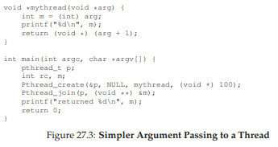

# 27 Phần xen kẽ: Thread API (Interlude: Thread API)

Chương này trình bày ngắn gọn các phần chính của **thread API** (giao diện lập trình ứng dụng cho luồng). Mỗi phần sẽ được giải thích chi tiết hơn trong các chương tiếp theo, khi chúng ta minh họa cách sử dụng API. Thông tin chi tiết hơn có thể tìm thấy trong nhiều sách và nguồn trực tuyến [B89, B97, B+96, K+96]. Cần lưu ý rằng các chương tiếp theo sẽ giới thiệu các khái niệm về **lock** (khóa) và **condition variable** (biến điều kiện) một cách chậm rãi hơn, kèm nhiều ví dụ; do đó, chương này phù hợp hơn để dùng như tài liệu tham khảo.

> **CRUX: HOW TO CREATE AND CONTROL THREADS**  
> (Vấn đề cốt lõi: Làm thế nào để tạo và điều khiển thread)  
> OS nên cung cấp những **interface** (giao diện) nào để tạo và điều khiển thread? Các interface này nên được thiết kế như thế nào để vừa dễ sử dụng vừa hữu ích?


## 27.1 Thread Creation (Tạo thread)

Điều đầu tiên bạn cần làm để viết một chương trình **multi-threaded** (đa luồng) là tạo ra các thread mới, và do đó phải tồn tại một **thread creation interface** (giao diện tạo luồng). Trong **POSIX**, điều này khá đơn giản:

```c
#include <pthread.h>
int pthread_create(pthread_t        *thread,
                   const pthread_attr_t *attr,
                   void             *(*start_routine)(void*),
                   void             *arg);
```

Khai báo này có thể trông hơi phức tạp (đặc biệt nếu bạn chưa từng dùng **function pointer** — con trỏ hàm — trong C), nhưng thực tế không quá khó. Có bốn tham số: `thread`, `attr`, `start_routine`, và `arg`.

- Tham số thứ nhất, `thread`, là một con trỏ tới cấu trúc kiểu `pthread_t`; chúng ta sẽ dùng cấu trúc này để tương tác với thread, và do đó cần truyền nó vào `pthread_create()` để khởi tạo.

- Tham số thứ hai, `attr`, được dùng để chỉ định các **attribute** (thuộc tính) mà thread này có thể có. Ví dụ: thiết lập kích thước stack hoặc thông tin về **scheduling priority** (độ ưu tiên lập lịch) của thread. Một attribute được khởi tạo bằng một call riêng tới `pthread_attr_init()`; xem trang **manual** để biết chi tiết. Tuy nhiên, trong hầu hết các trường hợp, giá trị mặc định là đủ; trong trường hợp này, chúng ta chỉ cần truyền giá trị `NULL`.

- Tham số thứ ba là phức tạp nhất, nhưng thực chất chỉ là câu hỏi: **thread này sẽ bắt đầu chạy ở hàm nào?** Trong C, đây là một function pointer, và ở đây nó cho biết điều sau: một tên hàm (`start_routine`), hàm này nhận một đối số duy nhất kiểu `void *` (như được chỉ ra trong dấu ngoặc đơn sau `start_routine`), và trả về một giá trị kiểu `void *` (tức là một con trỏ void).

Nếu routine này thay vào đó yêu cầu một đối số kiểu **integer** thay vì void pointer, khai báo sẽ trông như sau:

```c
int pthread_create(..., // hai tham số đầu giống nhau
                   void *(*start_routine)(int),
                   int arg);
```

Nếu routine nhận một void pointer làm đối số, nhưng trả về một integer, nó sẽ trông như sau:

```c
int pthread_create(..., // hai tham số đầu giống nhau
                   int (*start_routine)(void *),
                   void *arg);
```

- Cuối cùng, tham số thứ tư, `arg`, chính là đối số sẽ được truyền vào hàm nơi thread bắt đầu thực thi. Bạn có thể hỏi: tại sao chúng ta cần các void pointer này? Câu trả lời khá đơn giản: việc có một void pointer làm đối số của hàm `start_routine` cho phép chúng ta truyền vào bất kỳ kiểu dữ liệu nào; việc có nó làm giá trị trả về cho phép thread trả về bất kỳ kiểu kết quả nào.

Hãy xem một ví dụ trong **Hình 27.1**. Ở đây, chúng ta chỉ tạo một thread được truyền hai đối số, được đóng gói vào một kiểu dữ liệu do chúng ta tự định nghĩa (`myarg_t`). Thread, khi được tạo, có thể đơn giản **cast** (ép kiểu) đối số của nó sang kiểu mong đợi và giải nén các đối số theo ý muốn.


**Hình 27.1: Tạo một Thread**

Và đó là nó! Khi bạn tạo một thread, bạn thực sự đã có thêm một thực thể đang thực thi độc lập, với **call stack** (ngăn xếp call hàm) riêng của nó, chạy trong cùng **address space** (không gian địa chỉ) với tất cả các thread hiện có trong chương trình. Và từ đây, “cuộc vui” bắt đầu!


## 27.2 Hoàn thành Thread (Thread Completion)

Ví dụ ở trên cho thấy cách tạo một thread. Tuy nhiên, điều gì sẽ xảy ra nếu bạn muốn **chờ** một thread hoàn thành? Bạn cần làm một việc đặc biệt để chờ hoàn tất; cụ thể, bạn phải gọi hàm `pthread_join()`.

```c
int pthread_join(pthread_t thread, void **value_ptr);
```

Hàm này nhận hai tham số:

- Tham số thứ nhất có kiểu `pthread_t`, được dùng để chỉ định **thread** mà bạn muốn chờ. Biến này được khởi tạo bởi hàm tạo thread (khi bạn truyền con trỏ tới nó làm đối số cho `pthread_create()`); nếu bạn giữ lại biến này, bạn có thể dùng nó để chờ thread đó kết thúc.

- Tham số thứ hai là một con trỏ tới giá trị trả về mà bạn muốn nhận lại. Vì hàm này có thể trả về bất kỳ thứ gì, nó được định nghĩa để trả về một con trỏ kiểu `void`; và vì `pthread_join()` sẽ thay đổi giá trị của đối số được truyền vào, bạn cần truyền vào **con trỏ tới giá trị đó**, chứ không chỉ giá trị.

Hãy xem một ví dụ khác (**Hình 27.2**, trang 4). Trong đoạn code này, một thread được tạo, và được truyền một vài đối số thông qua cấu trúc `myarg_t`. Để trả về giá trị, kiểu `myret_t` được sử dụng. Khi thread kết thúc, **main thread**, vốn đang chờ bên trong `pthread_join()`[^1], sẽ tiếp tục chạy, và chúng ta có thể truy cập các giá trị trả về từ thread, cụ thể là những gì nằm trong `myret_t`.

```c
typedef struct { int a; int b; } myarg_t;
typedef struct { int x; int y; } myret_t;

void *mythread(void *arg) {
  myret_t *rvals = Malloc(sizeof(myret_t));
  rvals->x = 1;
  rvals->y = 2;
  return (void *) rvals;
}

int main(int argc, char *argv[]) {
  pthread_t p;
  myret_t *rvals;
  myarg_t args = { 10, 20 };
  Pthread_create(&p, NULL, mythread, &args);
  Pthread_join(p, (void **) &rvals);
  printf("returned %d %d\n", rvals->x, rvals->y);
  free(rvals);
  return 0;
}
```


**Hình 27.2: Chờ Thread hoàn thành**

Một vài điểm cần lưu ý về ví dụ này:

- Thứ nhất, nhiều khi chúng ta không cần phải đóng gói và giải nén đối số phức tạp như vậy. Ví dụ, nếu chỉ tạo một thread **không có đối số**, ta có thể truyền `NULL` khi tạo thread. Tương tự, ta có thể truyền `NULL` vào `pthread_join()` nếu không quan tâm đến giá trị trả về.

[^1]: Lưu ý rằng chúng ta sử dụng **wrapper function** ở đây; cụ thể, chúng ta gọi `Malloc()`, `Pthread_join()`, và `Pthread_create()`, vốn chỉ gọi các phiên bản chữ thường tương ứng và đảm bảo các hàm này không trả về giá trị bất thường.

- Thứ hai, nếu chỉ truyền một giá trị duy nhất (ví dụ: một `long long int`), ta không cần đóng gói nó thành cấu trúc. **Hình 27.3** (trang 5) cho thấy ví dụ. Trong trường hợp này, mọi thứ đơn giản hơn, vì ta không cần đóng gói đối số và giá trị trả về vào cấu trúc.

```c
void *mythread(void *arg) {
  long long int value = (long long int) arg;
  printf("%lld\n", value);
  return (void *) (value + 1);
}
int main(int argc, char *argv[]) {
  pthread_t p;
  long long int rvalue;
  Pthread_create(&p, NULL, mythread, (void *) 100);
  Pthread_join(p, (void **) &rvalue);
  printf("returned %lld\n", rvalue);
  return 0;
}
```



**Hình 27.3: Truyền đối số đơn giản hơn cho Thread**

- Thứ ba, cần **cực kỳ cẩn thận** với cách trả về giá trị từ một thread. Cụ thể, **không bao giờ** trả về một con trỏ trỏ tới vùng nhớ được cấp phát trên **call stack** của thread. Nếu làm vậy, điều gì sẽ xảy ra? (hãy suy nghĩ!). Đây là một ví dụ nguy hiểm, được sửa đổi từ ví dụ trong **Hình 27.2**:

```c
void *mythread(void *arg) {
  myarg_t *args = (myarg_t *) arg;
  printf("%d %d\n", args->a, args->b);
  myret_t oops; // ALLOCATED ON STACK: BAD!
  oops.x = 1;
  oops.y = 2;
  return (void *) &oops;
}
```

Trong trường hợp này, biến `oops` được cấp phát trên stack của `mythread`. Tuy nhiên, khi hàm trả về, giá trị này sẽ bị **tự động giải phóng** (đó là lý do stack dễ sử dụng!), và việc trả về một con trỏ trỏ tới biến đã bị giải phóng sẽ dẫn đến nhiều hậu quả xấu. Khi in ra giá trị mà bạn nghĩ là đã trả về, bạn có thể (nhưng không chắc chắn) sẽ bất ngờ. Hãy thử và tự kiểm chứng[^2]!

- Cuối cùng, bạn có thể nhận thấy việc dùng `pthread_create()` để tạo một thread, rồi ngay lập tức gọi `pthread_join()` là một cách khá kỳ lạ để tạo thread. Thực tế, có một cách dễ hơn để làm đúng việc này: **gọi hàm trực tiếp**. Rõ ràng, chúng ta thường sẽ tạo nhiều hơn một thread và chờ chúng hoàn thành, nếu không thì việc dùng thread cũng chẳng có nhiều ý nghĩa.

Cũng cần lưu ý rằng không phải mọi chương trình đa luồng đều sử dụng hàm join. Ví dụ, một **multi-threaded web server** có thể tạo nhiều **worker thread** và dùng main thread để nhận yêu cầu và phân phát cho các worker, chạy vô thời hạn. Những chương trình chạy lâu như vậy có thể không cần join. Tuy nhiên, một chương trình song song tạo thread để thực hiện một tác vụ cụ thể (theo kiểu song song) thường sẽ dùng join để đảm bảo tất cả công việc hoàn tất trước khi thoát hoặc chuyển sang giai đoạn tính toán tiếp theo.

[^2]: May mắn là trình biên dịch `gcc` thường sẽ cảnh báo khi bạn viết code như thế này, và đó là một lý do nữa để chú ý đến cảnh báo của trình biên dịch.

## 27.3 Locks (Khóa)

Bên cạnh việc tạo và join thread, có lẽ nhóm hàm hữu ích tiếp theo mà thư viện **POSIX threads** cung cấp là các hàm hỗ trợ **mutual exclusion** (loại trừ lẫn nhau) cho **critical section** (vùng tới hạn) thông qua **lock** (khóa). Cặp hàm cơ bản nhất để sử dụng cho mục đích này được định nghĩa như sau:

```c
int pthread_mutex_lock(pthread_mutex_t *mutex);
int pthread_mutex_unlock(pthread_mutex_t *mutex);
```

Các hàm này khá dễ hiểu và sử dụng. Khi bạn có một đoạn code là critical section, và do đó cần được bảo vệ để đảm bảo hoạt động đúng, lock là công cụ rất hữu ích. Bạn có thể hình dung đoạn code như sau:

```c
pthread_mutex_t lock;
pthread_mutex_lock(&lock);
x = x + 1; // hoặc bất kỳ đoạn code nào thuộc critical section
pthread_mutex_unlock(&lock);
```

Ý tưởng của đoạn code này như sau: nếu không có thread nào khác đang giữ lock khi `pthread_mutex_lock()` được gọi, thread sẽ **acquire** (giành) được lock và đi vào critical section. Nếu một thread khác đang giữ lock, thread đang cố lấy lock sẽ **không trả về** từ call hàm cho đến khi nó giành được lock (ngụ ý rằng thread đang giữ lock đã **release** nó thông qua call `unlock`). Tất nhiên, có thể có nhiều thread bị kẹt chờ bên trong hàm lấy lock tại cùng một thời điểm; tuy nhiên, chỉ thread đang giữ lock mới được phép gọi `unlock`.

Đáng tiếc, đoạn code trên **bị lỗi** ở hai điểm quan trọng.


**Vấn đề thứ nhất** là **không khởi tạo đúng cách**. Tất cả các lock phải được khởi tạo đúng để đảm bảo chúng có giá trị ban đầu chính xác và hoạt động như mong muốn khi gọi lock và unlock.

Với POSIX threads, có hai cách để khởi tạo lock:

- **Cách 1:** Sử dụng hằng `PTHREAD_MUTEX_INITIALIZER`, như sau:

```c
pthread_mutex_t lock = PTHREAD_MUTEX_INITIALIZER;
```

Cách này sẽ đặt lock về giá trị mặc định và làm cho lock có thể sử dụng được.

- **Cách 2:** Khởi tạo động (tức là tại **run time**) bằng cách gọi `pthread_mutex_init()`, như sau:

```c
int rc = pthread_mutex_init(&lock, NULL);
assert(rc == 0); // luôn kiểm tra thành công!
```

Tham số thứ nhất của hàm này là địa chỉ của lock, tham số thứ hai là một tập **attribute** (thuộc tính) tùy chọn. Bạn có thể tự tìm hiểu thêm về các thuộc tính này; truyền `NULL` sẽ dùng giá trị mặc định. Cả hai cách đều hoạt động, nhưng thông thường chúng ta dùng cách khởi tạo động (cách thứ hai). Lưu ý rằng khi không còn dùng lock, bạn nên gọi hàm `pthread_mutex_destroy()` để giải phóng; xem trang manual để biết chi tiết.


**Vấn đề thứ hai** là **không kiểm tra mã lỗi** khi gọi `lock` và `unlock`. Giống như hầu hết các hàm thư viện trong hệ thống UNIX, các hàm này **có thể thất bại**! Nếu code của bạn không kiểm tra mã lỗi, lỗi sẽ xảy ra một cách âm thầm, và trong trường hợp này có thể cho phép nhiều thread cùng vào critical section. Tối thiểu, hãy dùng **wrapper** để đảm bảo hàm thực thi thành công, như minh họa trong **Hình 27.4** (trang 7); các chương trình phức tạp hơn (không phải chương trình minh họa đơn giản) — vốn không thể chỉ đơn giản thoát khi có lỗi — nên kiểm tra thất bại và xử lý phù hợp khi call không thành công.

```c
// Giữ code gọn gàng; chỉ dùng nếu exit() là chấp nhận được khi lỗi
void Pthread_mutex_lock(pthread_mutex_t *mutex) {
  int rc = pthread_mutex_lock(mutex);
  assert(rc == 0);
}
```


**Hình 27.4: Ví dụ về Wrapper**


Các hàm `lock` và `unlock` không phải là những hàm duy nhất trong thư viện pthreads tương tác với lock. Còn hai hàm khác cũng đáng chú ý:

```c
int pthread_mutex_trylock(pthread_mutex_t *mutex);
int pthread_mutex_timedlock(pthread_mutex_t *mutex,
                            struct timespec *abs_timeout);
```

Hai call này được dùng để **acquire lock** (lấy khóa):

- Phiên bản `trylock` sẽ trả về lỗi nếu lock đang được giữ.
- Phiên bản `timedlock` sẽ trả về sau khi hết thời gian chờ (**timeout**) hoặc sau khi lấy được lock, tùy điều kiện nào xảy ra trước. Do đó, `timedlock` với thời gian chờ bằng 0 sẽ tương đương với `trylock`.

Cả hai phiên bản này nhìn chung nên tránh sử dụng; tuy nhiên, vẫn có một số trường hợp việc tránh bị kẹt (có thể là vô thời hạn) trong hàm lấy lock là hữu ích, như chúng ta sẽ thấy trong các chương sau (ví dụ: khi nghiên cứu **deadlock** — bế tắc).

## 27.4 Condition Variables (Biến điều kiện)

Thành phần quan trọng khác của bất kỳ thư viện **thread** (luồng) nào, và chắc chắn đúng với **POSIX threads**, là **condition variable** (biến điều kiện). Condition variable hữu ích khi cần thực hiện một dạng **signaling** (báo hiệu) giữa các thread, trong trường hợp một thread phải chờ thread khác làm xong một việc nào đó trước khi nó có thể tiếp tục. Hai hàm chính được các chương trình sử dụng khi muốn tương tác theo cách này là:

```c
int pthread_cond_wait(pthread_cond_t *cond,
                      pthread_mutex_t *mutex);
int pthread_cond_signal(pthread_cond_t *cond);
```

Để sử dụng condition variable, ta cần có thêm một **lock** (khóa) được liên kết với biến điều kiện này. Khi gọi một trong hai hàm trên, lock này phải đang được giữ.

Hàm đầu tiên, `pthread_cond_wait()`, sẽ đưa **calling thread** (thread gọi hàm) vào trạng thái ngủ (**sleep**), và chờ cho đến khi một thread khác **signal** (báo hiệu) nó, thường là khi có điều gì đó trong chương trình thay đổi mà thread đang ngủ quan tâm. Một ví dụ sử dụng điển hình như sau:

```c
pthread_mutex_t lock = PTHREAD_MUTEX_INITIALIZER;
pthread_cond_t cond = PTHREAD_COND_INITIALIZER;
Pthread_mutex_lock(&lock);
while (ready == 0)
  Pthread_cond_wait(&cond, &lock);
Pthread_mutex_unlock(&lock);
```

Trong đoạn code này, sau khi khởi tạo lock và condition liên quan[^3], một thread sẽ kiểm tra xem biến `ready` đã được đặt thành giá trị khác 0 hay chưa. Nếu chưa, thread sẽ gọi hàm `wait` để ngủ cho đến khi một thread khác đánh thức nó.

Code để đánh thức một thread, chạy trong một thread khác, sẽ như sau:

```c
Pthread_mutex_lock(&lock);
ready = 1;
Pthread_cond_signal(&cond);
Pthread_mutex_unlock(&lock);
```

Một vài điểm cần lưu ý về trình tự code này:

- **Thứ nhất**, khi **signal** (báo hiệu) — cũng như khi thay đổi biến toàn cục `ready` — ta luôn đảm bảo lock đang được giữ. Điều này giúp tránh vô tình tạo ra **race condition** (điều kiện tranh chấp) trong code.

- **Thứ hai**, bạn có thể nhận thấy rằng hàm `wait` nhận lock làm tham số thứ hai, trong khi hàm `signal` chỉ nhận condition. Lý do cho sự khác biệt này là: hàm `wait`, ngoài việc đưa thread gọi vào trạng thái ngủ, còn **release** (nhả) lock khi đưa thread đó vào ngủ. Hãy tưởng tượng nếu nó không làm vậy: thread khác sẽ không thể acquire lock và signal để đánh thức nó. Tuy nhiên, trước khi trả về sau khi được đánh thức, `pthread_cond_wait()` sẽ **re-acquire** (lấy lại) lock, đảm bảo rằng bất cứ khi nào thread đang chờ chạy giữa lúc acquire lock ở đầu vòng chờ và release lock ở cuối, nó luôn giữ lock.

- **Thứ ba**, một điểm đặc biệt: thread đang chờ sẽ **kiểm tra lại** điều kiện trong vòng lặp `while`, thay vì chỉ dùng câu lệnh `if`. Chúng ta sẽ bàn chi tiết hơn về vấn đề này khi học condition variable ở chương sau, nhưng nói chung, dùng `while` là cách đơn giản và an toàn. Mặc dù việc kiểm tra lại điều kiện có thể thêm một chút overhead, nhưng một số bản cài đặt pthread có thể **spurious wakeup** (đánh thức giả) một thread đang chờ; trong trường hợp đó, nếu không kiểm tra lại, thread sẽ tiếp tục chạy với giả định rằng điều kiện đã thay đổi, dù thực tế không phải vậy. An toàn hơn là coi việc được đánh thức chỉ là một **gợi ý** rằng có thể đã có thay đổi, chứ không phải một sự thật tuyệt đối.


Lưu ý rằng đôi khi người ta có thể bị cám dỗ sử dụng một **flag** (cờ) đơn giản để báo hiệu giữa hai thread, thay vì dùng condition variable và lock đi kèm. Ví dụ, ta có thể viết lại code chờ ở trên thành:

```c
while (ready == 0)
  ; // spin
```

Và code báo hiệu tương ứng sẽ là:

```c
ready = 1;
```

[^3]: Có thể dùng `pthread_cond_init()` (và `pthread_cond_destroy()`) thay cho cách khởi tạo tĩnh `PTHREAD_COND_INITIALIZER`. Nghe có vẻ tốn công hơn? Đúng vậy.


**Đừng bao giờ làm như vậy**, vì các lý do sau:

- **Thứ nhất**, cách này hoạt động kém hiệu quả trong nhiều trường hợp (việc **spin** lâu chỉ lãng phí chu kỳ CPU).
- **Thứ hai**, nó dễ gây lỗi. Nghiên cứu gần đây [X+10] cho thấy, thật đáng ngạc nhiên là việc dùng flag (như trên) để đồng bộ giữa các thread rất dễ mắc lỗi; trong nghiên cứu đó, khoảng **một nửa** số trường hợp đồng bộ kiểu “tự chế” này là **buggy** (có lỗi)!

Đừng lười biếng; hãy dùng condition variable ngay cả khi bạn nghĩ rằng có thể bỏ qua.

Nếu condition variable nghe có vẻ khó hiểu, đừng quá lo (ít nhất là bây giờ) — chúng ta sẽ học rất chi tiết về chúng trong một chương sau. Cho đến lúc đó, chỉ cần biết rằng chúng tồn tại và hiểu sơ qua cách cũng như lý do sử dụng chúng là đủ.

## 27.5 Biên dịch và chạy

Tất cả các ví dụ mã trong chương này đều tương đối dễ thiết lập và chạy. Để biên dịch, bạn phải include header `pthread.h` trong mã nguồn. Trên dòng liên kết (link), bạn cũng phải liên kết tường minh với thư viện pthreads bằng cách thêm cờ `-pthread`. Ví dụ, để biên dịch một chương trình multi-threaded (đa luồng) đơn giản, bạn chỉ cần làm như sau:

``` 
prompt> gcc -o main main.c -Wall -pthread
```

Chỉ cần `main.c` include header của pthreads, bạn đã biên dịch thành công một chương trình concurrent (đồng thời). Còn nó có chạy đúng hay không thì, như thường lệ, là một chuyện hoàn toàn khác.  
Lưu ý: thread (luồng) là đơn vị thực thi nhẹ trong cùng một process (tiến trình), chia sẻ không gian địa chỉ; lập trình multi-threaded đòi hỏi quản lý đồng bộ chặt chẽ để tránh lỗi tinh vi.


## 27.6 Tóm tắt

Chúng ta đã giới thiệu những kiến thức cơ bản về thư viện pthread, bao gồm tạo thread (luồng), xây dựng mutual exclusion (loại trừ lẫn nhau) thông qua locks (khóa), và cơ chế signaling/waiting (phát tín hiệu/chờ đợi) thông qua condition variables (biến điều kiện). Bạn không cần nhiều hơn thế để viết mã multi-threaded vững chắc và hiệu quả, ngoài sự kiên nhẫn và rất nhiều cẩn trọng!  
Giải thích ngắn: lock bảo đảm chỉ một thread truy cập vùng dữ liệu tới hạn tại một thời điểm; condition variable cho phép thread ngủ và được đánh thức khi một điều kiện trở nên đúng.

Chúng ta kết thúc chương bằng một tập hợp các mẹo có thể hữu ích khi bạn viết mã multi-threaded (xem phần aside ở trang sau để biết chi tiết). Còn có nhiều khía cạnh khác của API cũng thú vị; nếu muốn biết thêm, hãy gõ `man -k pthread` trên hệ thống Linux để xem hơn một trăm API cấu thành toàn bộ giao diện. Tuy nhiên, các phần cơ bản đã thảo luận ở đây sẽ giúp bạn xây dựng các chương trình multi-threaded tinh vi (và hy vọng là đúng đắn và hiệu năng). Phần khó với threads không nằm ở API, mà ở logic tinh vi của cách bạn xây dựng các chương trình concurrent. Hãy đọc tiếp để tìm hiểu thêm.  
Lưu ý: API là tập hợp hàm/giao ước của thư viện; hiểu đúng semantics (ngữ nghĩa) của từng primitive đồng bộ mới là chìa khóa.

>> **ASIDE: THREAD API GUIDELINES**  
>>  
>> Có một số điều nhỏ nhưng quan trọng cần ghi nhớ khi bạn dùng POSIX thread library (thư viện POSIX threads/Pthreads) — hoặc thực ra là bất kỳ thread library nào — để xây dựng chương trình multi-threaded. Chúng bao gồm:  
>>  
>> - **Keep it simple:** Trên hết, mọi đoạn code để lock hoặc signal giữa các thread nên càng đơn giản càng tốt. Các tương tác luồng rắc rối thường dẫn đến lỗi.  
>> - **Minimize thread interactions:** Cố gắng giảm thiểu số cách mà các thread tương tác với nhau. Mỗi tương tác nên được suy xét cẩn thận và xây dựng bằng các cách tiếp cận đã được kiểm nghiệm (nhiều trong số đó chúng ta sẽ học ở các chương sau).  
>> - **Initialize locks and condition variables:** Không khởi tạo sẽ dẫn đến mã có lúc chạy được, có lúc thất bại theo những cách rất kỳ quặc.  
>> - **Check your return codes:** Trong mọi lập trình C và UNIX, bạn nên kiểm tra mọi giá trị trả về; ở đây cũng vậy. Không làm vậy sẽ dẫn đến hành vi khó hiểu, khiến bạn có thể (a) hét lên, (b) bứt tóc, hoặc (c) cả hai.  
>> - **Be careful with how you pass arguments to, and return values from, threads:** Đặc biệt, bất cứ khi nào bạn truyền tham chiếu đến biến được cấp phát trên stack (ngăn xếp), rất có thể bạn đang làm sai.  
>> - **Each thread has its own stack:** Liên quan đến ý trên, hãy nhớ mỗi thread có stack riêng. Vì thế, nếu bạn có biến cục bộ trong một hàm mà thread đang thực thi, biến đó về bản chất là riêng tư với thread đó; thread khác không thể (dễ dàng) truy cập. Để chia sẻ dữ liệu giữa các thread, giá trị phải nằm trên heap (bộ nhớ heap) hoặc ở một vùng có thể truy cập toàn cục.  
>> - **Always use condition variables to signal between threads:** Dù đôi khi hấp dẫn khi dùng một cờ (flag) đơn giản, đừng làm vậy.  
>> - **Use the manual pages:** Trên Linux, các trang `pthread` trong man rất nhiều thông tin và bàn về nhiều sắc thái được trình bày ở đây, thường còn chi tiết hơn. Hãy đọc kỹ!  
>>  
>> Giải thích ngắn: stack là vùng nhớ cho biến cục bộ và khung hàm của mỗi thread; heap là vùng nhớ cấp phát động dùng để chia sẻ an toàn hơn giữa các thread khi kết hợp với đồng bộ hóa phù hợp.