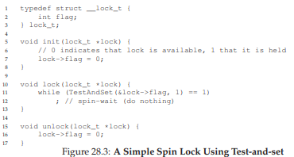
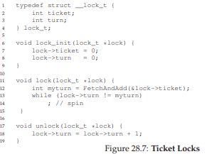

# 28 Locks (Khóa)

Từ phần giới thiệu về **concurrency** (tính đồng thời), chúng ta đã thấy một trong những vấn đề cơ bản của lập trình đồng thời: chúng ta muốn thực thi một chuỗi lệnh một cách **atomically** (nguyên tử), nhưng do sự tồn tại của **interrupt** (ngắt) trên một bộ xử lý đơn (hoặc nhiều **thread** chạy đồng thời trên nhiều bộ xử lý), chúng ta không thể làm được. Trong chương này, chúng ta sẽ giải quyết trực tiếp vấn đề này bằng cách giới thiệu một cơ chế gọi là **lock** (khóa). Lập trình viên sẽ chú thích mã nguồn bằng các lock, đặt chúng bao quanh các **critical section** (vùng tới hạn), từ đó đảm bảo rằng bất kỳ critical section nào cũng được thực thi như thể nó là một lệnh nguyên tử duy nhất.


## 28.1 Locks: Ý tưởng cơ bản (Locks: The Basic Idea)

Ví dụ, giả sử critical section của chúng ta trông như sau — đây là dạng cập nhật kinh điển của một biến chia sẻ:

```
balance = balance + 1;
```

Tất nhiên, các critical section khác cũng có thể xảy ra, chẳng hạn như thêm một phần tử vào **linked list** (danh sách liên kết) hoặc các cập nhật phức tạp hơn đối với các cấu trúc dữ liệu chia sẻ, nhưng ở đây chúng ta sẽ giữ ví dụ đơn giản này. Để sử dụng lock, ta thêm một số đoạn code bao quanh critical section như sau:

```c
lock_t mutex; // một lock 'mutex' được cấp phát toàn cục
...
lock(&mutex);
balance = balance + 1;
unlock(&mutex);
```

Một lock chỉ là một biến, do đó để sử dụng, bạn phải khai báo một biến lock nào đó (như `mutex` ở trên). Biến lock này (hoặc gọi tắt là “lock”) lưu trạng thái của khóa tại mọi thời điểm. Nó có thể ở trạng thái **available** (có sẵn / unlocked / free) — nghĩa là không có thread nào giữ lock, hoặc ở trạng thái **acquired** (đã được giữ / locked / held) — nghĩa là đúng một thread đang giữ lock và giả định rằng nó đang ở trong critical section. Ta cũng có thể lưu trữ thêm thông tin khác trong kiểu dữ liệu này, chẳng hạn như thread nào đang giữ lock, hoặc một hàng đợi để sắp xếp thứ tự lấy lock, nhưng những thông tin như vậy thường được ẩn khỏi người dùng lock.

**Ngữ nghĩa** của các hàm `lock()` và `unlock()` khá đơn giản:

- Gọi hàm `lock()` sẽ cố gắng **acquire** (lấy) lock; nếu không có thread nào khác đang giữ lock (tức là lock đang free), thread sẽ lấy được lock và vào critical section; thread này đôi khi được gọi là **owner** (chủ sở hữu) của lock.
- Nếu một thread khác gọi `lock()` trên cùng biến lock đó (`mutex` trong ví dụ này) khi lock đang bị giữ, call sẽ **không trả về** cho đến khi lock được thread đang giữ **release** (nhả) ra; theo cách này, các thread khác bị ngăn không cho vào critical section khi thread đầu tiên vẫn đang ở trong đó.

Khi **owner** của lock gọi `unlock()`, lock sẽ trở lại trạng thái free. Nếu không có thread nào khác đang chờ lock (tức là không có thread nào gọi `lock()` và bị kẹt ở đó), trạng thái lock đơn giản được chuyển sang free. Nếu có các thread đang chờ (bị kẹt trong `lock()`), một trong số chúng sẽ (cuối cùng) nhận ra (hoặc được thông báo) về sự thay đổi trạng thái này, lấy lock và vào critical section.

Lock cung cấp cho lập trình viên một mức độ kiểm soát tối thiểu đối với **scheduling** (lập lịch). Thông thường, chúng ta coi thread là các thực thể được lập trình viên tạo ra nhưng được OS lập lịch theo bất kỳ cách nào OS muốn. Lock trả lại một phần quyền kiểm soát đó cho lập trình viên; bằng cách đặt lock quanh một đoạn code, lập trình viên có thể đảm bảo rằng không bao giờ có nhiều hơn một thread hoạt động trong đoạn code đó. Nhờ vậy, lock giúp biến sự hỗn loạn của lập lịch truyền thống trong OS thành một hoạt động có kiểm soát hơn.


## 28.2 Pthread Locks

Tên mà thư viện **POSIX** dùng cho lock là **mutex** (viết tắt của *mutual exclusion* — loại trừ lẫn nhau), vì nó được dùng để đảm bảo rằng nếu một thread đang ở trong critical section, nó sẽ **ngăn** các thread khác vào cho đến khi hoàn tất. Do đó, khi bạn thấy đoạn code POSIX threads sau, bạn nên hiểu rằng nó thực hiện cùng chức năng như ví dụ ở trên (ở đây chúng ta lại dùng **wrapper** để kiểm tra lỗi khi lock và unlock):

```c
pthread_mutex_t lock = PTHREAD_MUTEX_INITIALIZER;
Pthread_mutex_lock(&lock); // wrapper; thoát nếu lỗi
balance = balance + 1;
Pthread_mutex_unlock(&lock);
```

Bạn cũng có thể nhận thấy rằng phiên bản POSIX truyền một biến vào hàm lock và unlock, vì chúng ta có thể dùng các lock khác nhau để bảo vệ các biến khác nhau. Cách làm này có thể **tăng concurrency** (tính đồng thời): thay vì dùng **một big lock** (khóa lớn) cho mọi critical section (chiến lược **coarse-grained locking** — khóa thô), người ta thường bảo vệ các dữ liệu và cấu trúc dữ liệu khác nhau bằng các lock khác nhau, cho phép nhiều thread cùng ở trong các đoạn code đã khóa cùng lúc (**fine-grained locking** — khóa tinh).

## 28.3 Xây dựng một Lock (Building A Lock)

Đến thời điểm này, bạn hẳn đã có một số hiểu biết về cách một **lock** (khóa) hoạt động, từ góc nhìn của lập trình viên. Nhưng làm thế nào để **xây dựng** một lock? Cần hỗ trợ gì từ **hardware** (phần cứng)? Cần hỗ trợ gì từ **OS** (hệ điều hành)? Đây chính là tập hợp các câu hỏi mà phần còn lại của chương này sẽ giải đáp.

> **THE CRUX: HOW TO BUILD A LOCK**  
> (Vấn đề cốt lõi: Làm thế nào để xây dựng một lock)  
> Làm thế nào để xây dựng một lock hiệu quả? Một lock hiệu quả phải cung cấp **mutual exclusion** (loại trừ lẫn nhau) với chi phí thấp, và có thể đạt được một số đặc tính khác mà chúng ta sẽ thảo luận bên dưới. Cần hỗ trợ gì từ phần cứng? Cần hỗ trợ gì từ hệ điều hành?

Để xây dựng một lock hoạt động đúng, chúng ta sẽ cần sự trợ giúp từ “người bạn cũ” là phần cứng, cũng như “người bạn tốt” là hệ điều hành. Qua nhiều năm, một số **hardware primitive** (nguyên thủy phần cứng) khác nhau đã được bổ sung vào **instruction set** (tập lệnh) của nhiều kiến trúc máy tính; mặc dù chúng ta sẽ không nghiên cứu cách các lệnh này được triển khai (đó là chủ đề của môn kiến trúc máy tính), nhưng chúng ta sẽ nghiên cứu cách sử dụng chúng để xây dựng một **mutual exclusion primitive** như lock. Chúng ta cũng sẽ tìm hiểu cách hệ điều hành tham gia để hoàn thiện bức tranh và cho phép xây dựng một thư viện lock tinh vi.


## 28.4 Đánh giá Lock (Evaluating Locks)

Trước khi xây dựng bất kỳ lock nào, chúng ta cần hiểu rõ mục tiêu, và do đó cần đặt câu hỏi: **đánh giá hiệu quả của một lock như thế nào**? Để đánh giá một lock có hoạt động (và hoạt động tốt) hay không, chúng ta cần thiết lập một số tiêu chí cơ bản.

- **Tiêu chí đầu tiên**: lock có thực hiện đúng nhiệm vụ cơ bản là cung cấp **mutual exclusion** hay không? Nói cách khác, lock có ngăn chặn nhiều thread cùng vào một critical section hay không?

- **Tiêu chí thứ hai**: **fairness** (tính công bằng). Mỗi thread cạnh tranh lock có cơ hội công bằng để lấy lock khi nó được giải phóng hay không? Xét ở trường hợp cực đoan: có thread nào bị **starvation** (đói tài nguyên) khi cạnh tranh lock, dẫn đến không bao giờ lấy được lock hay không?

- **Tiêu chí cuối cùng**: **performance** (hiệu năng), cụ thể là **time overhead** (độ trễ thời gian) do việc sử dụng lock gây ra. Có một số trường hợp đáng xem xét:
  1. **No contention** (không tranh chấp): khi chỉ có một thread chạy và thực hiện lấy và nhả lock, chi phí của việc này là bao nhiêu?
  2. **Single CPU, multiple threads contending** (một CPU, nhiều thread tranh chấp): trong trường hợp này, có vấn đề hiệu năng nào không?
  3. **Multiple CPUs contending** (nhiều CPU, mỗi CPU có thread tranh chấp lock): lock hoạt động thế nào?

Bằng cách so sánh các kịch bản này, chúng ta có thể hiểu rõ hơn tác động hiệu năng của các kỹ thuật lock khác nhau.


## 28.5 Kiểm soát Interrupt (Controlling Interrupts)

Một trong những giải pháp sớm nhất để cung cấp **mutual exclusion** là **tắt interrupt** cho critical section; giải pháp này được phát minh cho hệ thống **single-processor** (đơn xử lý). Mã nguồn sẽ như sau:

```c
void lock() {
  DisableInterrupts();
}
void unlock() {
  EnableInterrupts();
}
```

Giả sử chúng ta đang chạy trên một hệ thống đơn xử lý như vậy. Bằng cách tắt interrupt (sử dụng một lệnh phần cứng đặc biệt) trước khi vào critical section, chúng ta đảm bảo rằng mã bên trong critical section sẽ không bị ngắt, và do đó sẽ thực thi như thể nó là nguyên tử. Khi xong, chúng ta bật lại interrupt (cũng bằng lệnh phần cứng) và chương trình tiếp tục như bình thường.

**Ưu điểm chính** của cách tiếp cận này là **đơn giản**. Bạn không cần phải suy nghĩ nhiều để hiểu tại sao nó hoạt động. Không có ngắt, một thread có thể chắc chắn rằng đoạn code nó thực thi sẽ chạy trọn vẹn và không bị thread khác can thiệp.

**Nhược điểm**, đáng tiếc, lại nhiều:

1. **Vấn đề tin cậy**: Cách này yêu cầu cho phép bất kỳ thread nào gọi hàm cũng có thể thực hiện một thao tác đặc quyền (bật/tắt interrupt), và do đó phải tin rằng khả năng này không bị lạm dụng. Như bạn đã biết, bất cứ khi nào phải tin tưởng một chương trình tùy ý, chúng ta có thể gặp rắc rối. Ví dụ:
   - Một chương trình “tham lam” có thể gọi `lock()` ngay khi bắt đầu và chiếm dụng CPU.
   - Tệ hơn, một chương trình lỗi hoặc độc hại có thể gọi `lock()` rồi chạy vòng lặp vô hạn. Trong trường hợp này, OS sẽ **mất quyền kiểm soát** hệ thống, và cách duy nhất để khắc phục là **khởi động lại**.  
   Việc dùng tắt interrupt như một giải pháp đồng bộ hóa tổng quát đòi hỏi quá nhiều sự tin tưởng vào ứng dụng.

2. **Không hoạt động trên multiprocessor**: Nếu nhiều thread chạy trên các CPU khác nhau và cùng cố vào một critical section, việc tắt interrupt không giúp ích gì; các thread vẫn có thể chạy trên CPU khác và vào critical section. Vì multiprocessor hiện nay rất phổ biến, giải pháp tổng quát của chúng ta phải tốt hơn.

3. **Mất interrupt**: Tắt interrupt trong thời gian dài có thể dẫn đến mất interrupt, gây ra các vấn đề nghiêm trọng cho hệ thống. Ví dụ: nếu CPU bỏ lỡ tín hiệu rằng một thiết bị đĩa đã hoàn tất yêu cầu đọc, OS sẽ không biết để đánh thức process đang chờ.

Vì những lý do này, việc tắt interrupt chỉ được dùng trong **ngữ cảnh hạn chế** như một primitive đảm bảo mutual exclusion. Ví dụ, trong một số trường hợp, chính hệ điều hành sẽ dùng **interrupt masking** (che ngắt) để đảm bảo tính nguyên tử khi truy cập các cấu trúc dữ liệu nội bộ, hoặc ít nhất để tránh một số tình huống xử lý ngắt phức tạp. Cách dùng này hợp lý, vì vấn đề tin cậy không tồn tại bên trong OS — vốn luôn tin tưởng chính nó để thực hiện các thao tác đặc quyền.


## 28.6 Một nỗ lực thất bại: Chỉ sử dụng Load/Store

Để vượt ra khỏi các kỹ thuật dựa trên **interrupt** (ngắt), chúng ta sẽ phải dựa vào **CPU hardware** (phần cứng CPU) và các **instruction** (lệnh) mà nó cung cấp để xây dựng một **lock** (khóa) đúng nghĩa. Trước tiên, hãy thử xây dựng một lock đơn giản bằng cách sử dụng một biến cờ (**flag**) duy nhất. Trong nỗ lực thất bại này, chúng ta sẽ thấy một số ý tưởng cơ bản cần thiết để xây dựng lock, và (hy vọng) sẽ thấy lý do tại sao chỉ dùng một biến duy nhất và truy cập nó thông qua các thao tác load/store thông thường là **không đủ**.

Trong nỗ lực đầu tiên này (**Hình 28.1**), ý tưởng khá đơn giản: sử dụng một biến (`flag`) để biểu thị việc một thread nào đó đang giữ lock. Thread đầu tiên vào **critical section** (vùng tới hạn) sẽ gọi `lock()`, hàm này sẽ kiểm tra xem `flag` có bằng 1 hay không (trong trường hợp này là không), và sau đó đặt `flag` thành 1 để biểu thị rằng thread hiện đang giữ lock. Khi hoàn tất critical section, thread sẽ gọi `unlock()` và xóa `flag`, cho biết lock không còn bị giữ nữa.

```c
typedef struct __lock_t { int flag; } lock_t;

void init(lock_t *mutex) {
  // 0 -> lock đang rảnh, 1 -> lock đang bị giữ
  mutex->flag = 0;
}

void lock(lock_t *mutex) {
  while (mutex->flag == 1) // KIỂM TRA flag
    ; // spin-wait (không làm gì)
  mutex->flag = 1;         // BÂY GIỜ đặt flag!
}

void unlock(lock_t *mutex) {
  mutex->flag = 0;
}
```


**Hình 28.1: Nỗ lực đầu tiên: Một biến cờ đơn giản**

Nếu một thread khác gọi `lock()` trong khi thread đầu tiên đang ở trong critical section, nó sẽ chỉ đơn giản **spin-wait** (chờ bận) trong vòng lặp `while` cho đến khi thread kia gọi `unlock()` và xóa `flag`. Khi thread đầu tiên làm vậy, thread đang chờ sẽ thoát khỏi vòng lặp `while`, đặt `flag` thành 1 cho chính nó, và tiếp tục vào critical section.

Đáng tiếc, đoạn code này có **hai vấn đề**: một về **tính đúng đắn** (correctness), và một về **hiệu năng** (performance).

- **Vấn đề tính đúng đắn** rất dễ thấy khi bạn quen với tư duy lập trình đồng thời. Hãy tưởng tượng sự xen kẽ lệnh như trong **Hình 28.2**; giả sử ban đầu `flag = 0`:

```
Thread 1                  Thread 2
call lock()
while (flag == 1)
interrupt: switch to Thread 2

                          call lock()
                          while (flag == 1)
                          flag = 1;
                          interrupt: switch to Thread 1
flag = 1; // cũng đặt flag thành 1!
```


**Hình 28.2: Trace: Không có Mutual Exclusion**

Như bạn thấy từ sự xen kẽ này, chỉ với một **interrupt** xảy ra “đúng lúc” (hay “sai lúc”), ta dễ dàng tạo ra tình huống cả hai thread đều đặt `flag` thành 1 và cả hai cùng vào critical section. Đây là hành vi mà dân chuyên gọi là “tệ” — rõ ràng chúng ta đã thất bại trong việc cung cấp yêu cầu cơ bản nhất: **mutual exclusion**.

- **Vấn đề hiệu năng** (sẽ được bàn kỹ hơn sau) nằm ở cách một thread chờ để lấy lock đang bị giữ: nó liên tục kiểm tra giá trị của `flag`, kỹ thuật này gọi là **spin-waiting**. Spin-waiting lãng phí thời gian CPU để chờ thread khác nhả lock. Sự lãng phí này đặc biệt nghiêm trọng trên **uniprocessor** (bộ xử lý đơn), nơi thread mà thread chờ đang đợi thậm chí **không thể chạy** (ít nhất là cho đến khi xảy ra context switch)! Do đó, khi phát triển các giải pháp tinh vi hơn, chúng ta cũng nên xem xét cách tránh loại lãng phí này.


## 28.7 Xây dựng Spin Lock hoạt động với Test-And-Set

Vì việc tắt interrupt không hoạt động trên **multiprocessor** (đa xử lý), và vì các cách tiếp cận đơn giản chỉ dùng load/store (như ở trên) không hiệu quả, các nhà thiết kế hệ thống đã bắt đầu phát minh ra **hardware support** (hỗ trợ phần cứng) cho việc khóa. Những hệ thống multiprocessor đầu tiên, như **Burroughs B5000** vào đầu những năm 1960 [M82], đã có hỗ trợ này; ngày nay, tất cả các hệ thống đều cung cấp loại hỗ trợ này, ngay cả với hệ thống chỉ có một CPU.

Phần hỗ trợ phần cứng đơn giản nhất để hiểu được gọi là **test-and-set** (hoặc **atomic exchange**[^1]). Chúng ta định nghĩa chức năng của lệnh test-and-set thông qua đoạn code C sau:

```c
int TestAndSet(int *old_ptr, int new) {
  int old = *old_ptr; // lấy giá trị cũ tại old_ptr
  // ghi 'new' vào old_ptr
  *old_ptr = new;
  return old;         // trả về giá trị cũ
}
```

[^1]: Mỗi kiến trúc hỗ trợ test-and-set lại gọi nó bằng tên khác nhau. Trên SPARC, nó được gọi là lệnh load/store unsigned byte (`ldstub`); trên x86, nó là phiên bản có khóa (**locked**) của lệnh atomic exchange (`xchg`).

> **ASIDE: THUẬT TOÁN DEKKER VÀ PETERSON**  
>  
> Vào những năm 1960, **Dijkstra** đã nêu ra bài toán **concurrency** (tính đồng thời) cho bạn bè của mình, và một trong số họ — nhà toán học **Theodorus Jozef Dekker** — đã đưa ra một lời giải [D68]. Không giống như các giải pháp mà chúng ta thảo luận ở đây, vốn sử dụng các **hardware instruction** (lệnh phần cứng) đặc biệt và thậm chí cả sự hỗ trợ từ **OS** (hệ điều hành), thuật toán của Dekker chỉ dùng các thao tác **load** và **store** (giả định rằng chúng nguyên tử với nhau, điều này đúng trên phần cứng đời đầu).  
>  
> Cách tiếp cận của Dekker sau đó được **Peterson** cải tiến [P81]. Một lần nữa, chỉ dùng load và store, và ý tưởng là đảm bảo rằng hai **thread** (luồng) không bao giờ cùng vào **critical section** (vùng tới hạn) cùng lúc. Dưới đây là thuật toán Peterson (cho hai thread); hãy thử xem bạn có hiểu đoạn code này không. Các biến `flag` và `turn` được dùng để làm gì?  
>  
> ```c
> int flag[2];
> int turn;
> 
> void init() {
>   // biểu thị ý định giữ lock bằng 'flag'
>   flag[0] = flag[1] = 0;
>   // lượt của ai? (thread 0 hoặc 1)
>   turn = 0;
> }
> 
> void lock() {
>   // 'self' là ID của thread gọi hàm
>   flag[self] = 1;
>   // nhường lượt cho thread kia
>   turn = 1 - self;
>   while ((flag[1-self] == 1) && (turn == 1 - self))
>     ; // spin-wait khi chưa đến lượt
> }
> 
> void unlock() {
>   // hủy ý định giữ lock
>   flag[self] = 0;
> }
> ```
>  
> Vì một lý do nào đó, việc phát triển các lock hoạt động mà không cần hỗ trợ phần cứng đặc biệt đã trở thành trào lưu một thời, mang lại cho giới nghiên cứu lý thuyết nhiều vấn đề để giải quyết. Tất nhiên, hướng nghiên cứu này trở nên khá vô dụng khi người ta nhận ra rằng dễ dàng hơn nhiều nếu giả định có một chút hỗ trợ phần cứng (và thực tế là hỗ trợ này đã tồn tại từ những ngày đầu của **multiprocessing**). Hơn nữa, các thuật toán như trên không hoạt động trên phần cứng hiện đại (do **relaxed memory consistency model** — mô hình nhất quán bộ nhớ lỏng), khiến chúng còn ít hữu ích hơn trước đây. Thêm một hướng nghiên cứu nữa bị xếp vào “ngăn lưu trữ lịch sử”...


Lệnh `test-and-set` hoạt động như sau: nó trả về giá trị cũ tại địa chỉ mà `old_ptr` trỏ tới, đồng thời cập nhật giá trị đó thành `new`. Điểm mấu chốt là chuỗi thao tác này được thực hiện **atomically** (nguyên tử). Sở dĩ gọi là “test and set” là vì nó cho phép bạn “kiểm tra” (test) giá trị cũ (giá trị được trả về) đồng thời “đặt” (set) vị trí bộ nhớ đó thành giá trị mới; hóa ra, lệnh mạnh hơn một chút này là đủ để xây dựng một **spin lock** đơn giản, như chúng ta sẽ xem trong **Hình 28.3**. Hoặc tốt hơn: hãy thử tự mình suy luận trước!

```c
typedef struct __lock_t {
  int flag;
} lock_t;

void init(lock_t *lock) {
  // 0: lock đang rảnh, 1: lock đang bị giữ
  lock->flag = 0;
}

void lock(lock_t *lock) {
  while (TestAndSet(&lock->flag, 1) == 1)
    ; // spin-wait (không làm gì)
}

void unlock(lock_t *lock) {
  lock->flag = 0;
}
```



**Hình 28.3: Một Spin Lock đơn giản sử dụng Test-and-Set**

Hãy đảm bảo rằng chúng ta hiểu tại sao lock này hoạt động. Trước hết, tưởng tượng trường hợp một thread gọi `lock()` và không có thread nào khác đang giữ lock; khi đó, `flag` sẽ bằng 0. Khi thread gọi `TestAndSet(flag, 1)`, hàm sẽ trả về giá trị cũ của `flag` (0); do đó, thread gọi hàm — khi kiểm tra giá trị `flag` — sẽ không bị kẹt trong vòng lặp `while` và sẽ lấy được lock. Thread này cũng đồng thời đặt giá trị `flag` thành 1 một cách nguyên tử, biểu thị rằng lock hiện đang bị giữ. Khi thread hoàn tất critical section, nó gọi `unlock()` để đặt lại `flag` về 0.

Trường hợp thứ hai xảy ra khi một thread khác đã giữ lock (tức là `flag` = 1). Khi đó, thread này gọi `lock()` và tiếp tục gọi `TestAndSet(flag, 1)`. Lần này, `TestAndSet()` sẽ trả về giá trị cũ tại `flag` là 1 (vì lock đang bị giữ), đồng thời đặt lại nó thành 1. Chừng nào lock còn bị giữ bởi thread khác, `TestAndSet()` sẽ liên tục trả về 1, và thread này sẽ tiếp tục **spin** cho đến khi lock được nhả. Khi `flag` cuối cùng được đặt về 0 bởi thread khác, thread này sẽ gọi `TestAndSet()` lần nữa, lúc này trả về 0 đồng thời đặt giá trị thành 1, và do đó lấy được lock để vào critical section.

> **TIP: HÃY NGHĨ VỀ CONCURRENCY NHƯ MỘT BỘ LẬP LỊCH “XẤU TÍNH”**  
> Từ ví dụ này, bạn có thể hình dung cách tiếp cận cần có để hiểu việc thực thi đồng thời. Hãy thử tưởng tượng bạn là một **scheduler** (bộ lập lịch) “xấu tính”, người sẽ ngắt các thread vào những thời điểm tệ hại nhất để phá hỏng nỗ lực yếu ớt của chúng trong việc xây dựng các **synchronization primitive** (nguyên thủy đồng bộ hóa). Bạn thật là một scheduler độc ác! Mặc dù chuỗi ngắt chính xác có thể khó xảy ra, nhưng nó **có thể** xảy ra, và đó là tất cả những gì cần để chứng minh một cách tiếp cận nào đó là không hoạt động. Đôi khi, suy nghĩ theo hướng “xấu tính” lại hữu ích!  

Bằng cách biến cả thao tác kiểm tra (giá trị cũ của lock) và đặt (giá trị mới) thành một **atomic operation** (thao tác nguyên tử) duy nhất, chúng ta đảm bảo rằng chỉ một thread có thể lấy được lock. Và đó chính là cách xây dựng một **mutual exclusion primitive** hoạt động! Giờ đây, bạn cũng có thể hiểu tại sao loại lock này thường được gọi là **spin lock**. Đây là loại lock đơn giản nhất để xây dựng, và chỉ đơn giản là “quay vòng” (spin), tiêu tốn chu kỳ CPU, cho đến khi lock sẵn sàng. Để hoạt động đúng trên **single processor** (bộ xử lý đơn), nó cần một **preemptive scheduler** (bộ lập lịch ưu tiên ngắt) — tức là một bộ lập lịch sẽ ngắt một thread thông qua **timer** (bộ định thời) để chạy thread khác theo định kỳ. Nếu không có preemption, spin lock không có nhiều ý nghĩa trên một CPU đơn, vì một thread đang spin trên CPU sẽ không bao giờ tự nhường CPU.

## 28.8 Đánh giá Spin Lock (Evaluating Spin Locks)

Với **spin lock** cơ bản mà chúng ta đã xây dựng, giờ đây ta có thể đánh giá mức độ hiệu quả của nó dựa trên các tiêu chí đã mô tả trước đó.

Tiêu chí quan trọng nhất của một **lock** là **correctness** (tính đúng đắn): nó có cung cấp **mutual exclusion** (loại trừ lẫn nhau) hay không? Ở đây, câu trả lời là **có**: spin lock chỉ cho phép một **thread** (luồng) duy nhất vào **critical section** (vùng tới hạn) tại một thời điểm. Do đó, chúng ta có một lock đúng đắn.

Tiêu chí tiếp theo là **fairness** (tính công bằng). Spin lock có công bằng với thread đang chờ hay không? Bạn có thể đảm bảo rằng một thread đang chờ sẽ **luôn** được vào critical section không? Đáng tiếc, câu trả lời là **không**: spin lock không cung cấp bất kỳ đảm bảo nào về tính công bằng. Thực tế, một thread có thể **spin** (quay vòng chờ) mãi mãi khi có tranh chấp. Spin lock đơn giản (như đã thảo luận) là **không công bằng** và có thể dẫn đến **starvation** (đói tài nguyên).

Tiêu chí cuối cùng là **performance** (hiệu năng). Chi phí của việc sử dụng spin lock là gì? Để phân tích kỹ hơn, hãy xem xét một vài trường hợp khác nhau.  
- **Trường hợp 1**: Các thread cạnh tranh lock trên **single processor** (bộ xử lý đơn).  
- **Trường hợp 2**: Các thread phân bố trên nhiều CPU.

Với spin lock, trong trường hợp **single CPU**, chi phí hiệu năng có thể rất tệ; hãy tưởng tượng khi thread đang giữ lock bị **preempted** (tạm dừng) ngay trong critical section. **Scheduler** (bộ lập lịch) có thể sẽ chạy tất cả các thread khác (giả sử có N − 1 thread khác), mỗi thread đều cố gắng lấy lock. Trong trường hợp này, mỗi thread sẽ spin trong suốt **time slice** (lượng thời gian CPU cấp cho một thread) trước khi nhường CPU, gây lãng phí chu kỳ CPU.

Tuy nhiên, trên **multiple CPUs** (đa xử lý), spin lock hoạt động khá tốt (nếu số lượng thread xấp xỉ số lượng CPU). Lý do như sau: giả sử Thread A chạy trên CPU 1 và Thread B chạy trên CPU 2, cả hai cùng tranh chấp lock. Nếu Thread A (CPU 1) lấy được lock, và Thread B cố lấy, B sẽ spin (trên CPU 2). Tuy nhiên, giả định rằng critical section ngắn, lock sẽ sớm được nhả và Thread B sẽ lấy được. Trong trường hợp này, việc spin để chờ lock giữ trên CPU khác không lãng phí nhiều chu kỳ CPU, và do đó có thể hiệu quả.


## 28.9 Compare-And-Swap

Một **hardware primitive** (nguyên thủy phần cứng) khác mà một số hệ thống cung cấp được gọi là **compare-and-swap** (trên SPARC) hoặc **compare-and-exchange** (trên x86). Mã giả C cho lệnh này được thể hiện trong **Hình 28.4**.

```c
int CompareAndSwap(int *ptr, int expected, int new) {
  int original = *ptr;
  if (original == expected)
    *ptr = new;
  return original;
}
```


**Hình 28.4: Compare-and-swap**

Ý tưởng cơ bản của `compare-and-swap` là kiểm tra xem giá trị tại địa chỉ `ptr` có bằng `expected` hay không; nếu có, cập nhật vị trí bộ nhớ đó thành giá trị `new`. Nếu không, không làm gì cả. Trong cả hai trường hợp, trả về giá trị gốc tại vị trí bộ nhớ đó, cho phép đoạn code gọi `compare-and-swap` biết được thao tác có thành công hay không.

Với lệnh `compare-and-swap`, ta có thể xây dựng lock tương tự như với `test-and-set`. Ví dụ, ta chỉ cần thay hàm `lock()` ở trên bằng:

```c
void lock(lock_t *lock) {
  while (CompareAndSwap(&lock->flag, 0, 1) == 1)
    ; // spin
}
```

Phần còn lại của code giống như ví dụ `test-and-set` ở trên. Code này hoạt động tương tự: nó kiểm tra nếu `flag` bằng 0 thì nguyên tử thay bằng 1 để lấy lock. Các thread cố lấy lock khi nó đang bị giữ sẽ bị kẹt spin cho đến khi lock được nhả.

Nếu bạn muốn xem cách triển khai `compare-and-swap` phiên bản x86 có thể gọi từ C, đoạn code (từ [S05]) có thể hữu ích[^2].

Cuối cùng, như bạn có thể nhận ra, `compare-and-swap` là một lệnh mạnh hơn `test-and-set`. Chúng ta sẽ tận dụng sức mạnh này trong tương lai khi tìm hiểu về **lock-free synchronization** (đồng bộ hóa không khóa) [H91]. Tuy nhiên, nếu chỉ xây dựng spin lock đơn giản với nó, hành vi sẽ giống hệt spin lock đã phân tích ở trên.

[^2]: github.com/remzi-arpacidusseau/ostep-code/tree/master/threads-locks


## 28.10 Load-Linked và Store-Conditional

Một số nền tảng cung cấp cặp lệnh hoạt động cùng nhau để giúp xây dựng critical section. Trên kiến trúc **MIPS** [H93], ví dụ, lệnh **load-linked** và **store-conditional** có thể được dùng kết hợp để xây dựng lock và các cấu trúc đồng thời khác. Mã giả C cho các lệnh này được thể hiện trong **Hình 28.5**. Alpha, PowerPC và ARM cũng cung cấp các lệnh tương tự [W09].

```c
int LoadLinked(int *ptr) {
  return *ptr;
}

int StoreConditional(int *ptr, int value) {
  if (no update to *ptr since LL to this addr) {
    *ptr = value;
    return 1; // thành công!
  } else {
    return 0; // thất bại
  }
}
```


**Hình 28.5: Load-linked và Store-conditional**

`Load-linked` hoạt động gần giống như lệnh load thông thường, chỉ đơn giản là lấy giá trị từ bộ nhớ và đặt vào thanh ghi. Sự khác biệt chính nằm ở `store-conditional`, lệnh này chỉ thành công (và cập nhật giá trị tại địa chỉ vừa được load-linked) nếu **không có** thao tác store nào khác tới địa chỉ đó diễn ra trong khoảng thời gian từ lúc load-linked. Nếu thành công, `store-conditional` trả về 1 và cập nhật giá trị tại `ptr` thành `value`; nếu thất bại, giá trị tại `ptr` không thay đổi và trả về 0.

**Thử thách**: hãy tự nghĩ cách xây dựng lock bằng load-linked và store-conditional. Sau đó, so sánh với đoạn code dưới đây — một giải pháp đơn giản. Giải pháp được thể hiện trong **Hình 28.6**.

```c
void lock(lock_t *lock) {
  while (1) {
    while (LoadLinked(&lock->flag) == 1)
      ; // spin cho đến khi flag = 0
    if (StoreConditional(&lock->flag, 1) == 1)
      return; // nếu đặt thành 1 thành công: xong
    // nếu thất bại: thử lại
  }
}

void unlock(lock_t *lock) {
  lock->flag = 0;
}
```


**Hình 28.6: Sử dụng LL/SC để xây dựng một Lock**

Phần code `lock()` là phần thú vị nhất. Đầu tiên, một **thread** sẽ **spin** (quay vòng chờ) cho đến khi `flag` được đặt về 0 (biểu thị rằng lock đang không bị giữ). Khi điều kiện này thỏa mãn, thread sẽ cố gắng lấy lock thông qua lệnh **store-conditional**; nếu thành công, thread đã thay đổi giá trị của `flag` thành 1 một cách **atomic** (nguyên tử) và do đó có thể tiếp tục vào **critical section** (vùng tới hạn).

Hãy lưu ý cách mà việc **store-conditional** có thể thất bại. Một thread gọi `lock()` và thực hiện **load-linked**, trả về 0 vì lock chưa bị giữ. Trước khi nó có thể thực hiện **store-conditional**, nó bị **interrupt** (ngắt) và một thread khác đi vào code lock, cũng thực hiện lệnh **load-linked**, cũng nhận được giá trị 0 và tiếp tục. Tại thời điểm này, cả hai thread đều đã thực hiện load-linked và đều chuẩn bị thực hiện store-conditional. Điểm mấu chốt của cặp lệnh này là **chỉ một** trong hai thread sẽ thành công trong việc cập nhật `flag` thành 1 và do đó lấy được lock; thread thứ hai khi thực hiện store-conditional sẽ thất bại (vì thread kia đã cập nhật giá trị của `flag` giữa thời điểm load-linked và store-conditional của nó) và do đó phải thử lấy lock lại từ đầu.

Trong một buổi học vài năm trước, sinh viên đại học David Capel đã gợi ý một dạng rút gọn hơn của đoạn code trên, dành cho những ai thích **short-circuiting boolean conditionals** (rút gọn điều kiện logic). Hãy thử xem bạn có hiểu tại sao nó tương đương không. Rõ ràng là nó ngắn hơn!

```c
void lock(lock_t *lock) {
  while (LoadLinked(&lock->flag) ||
         !StoreConditional(&lock->flag, 1))
    ; // spin
}
```


## 28.11 Fetch-And-Add

Một **hardware primitive** (nguyên thủy phần cứng) cuối cùng là lệnh **fetch-and-add**, lệnh này sẽ **tăng** một giá trị một cách nguyên tử đồng thời trả về giá trị cũ tại một địa chỉ nhất định. Mã giả C cho lệnh fetch-and-add như sau:

```c
int FetchAndAdd(int *ptr) {
  int old = *ptr;
  *ptr = old + 1;
  return old;
}
```

> **TIP: ÍT CODE HƠN LÀ CODE TỐT HƠN (LUẬT CỦA LAUER)**  
> Lập trình viên thường hay khoe khoang về việc họ đã viết bao nhiêu code để làm một việc gì đó. Cách nghĩ này là sai lầm cơ bản. Điều đáng khoe khoang hơn là bạn đã viết **ít** code như thế nào để hoàn thành một nhiệm vụ. Code ngắn gọn, súc tích luôn được ưu tiên; nó thường dễ hiểu hơn và ít lỗi hơn. Như Hugh Lauer đã nói khi bàn về việc xây dựng hệ điều hành Pilot: “Nếu cùng một nhóm người có gấp đôi thời gian, họ có thể tạo ra một hệ thống tốt tương đương chỉ với một nửa số dòng code.” [L81] Chúng ta sẽ gọi đây là **Luật của Lauer**, và nó rất đáng để ghi nhớ. Vì vậy, lần tới khi bạn định khoe về việc đã viết bao nhiêu code để hoàn thành bài tập, hãy suy nghĩ lại, hoặc tốt hơn, hãy quay lại, viết lại và làm cho code rõ ràng và ngắn gọn nhất có thể.

Trong ví dụ này, chúng ta sẽ sử dụng `fetch-and-add` để xây dựng một **ticket lock** thú vị hơn, được giới thiệu bởi Mellor-Crummey và Scott [MS91]. Code cho lock và unlock được thể hiện trong **Hình 28.7** (trang 14).

```c
typedef struct __lock_t {
  int ticket;
  int turn;
} lock_t;

void lock_init(lock_t *lock) {
  lock->ticket = 0;
  lock->turn   = 0;
}

void lock(lock_t *lock) {
  int myturn = FetchAndAdd(&lock->ticket);
  while (lock->turn != myturn)
    ; // spin
}

void unlock(lock_t *lock) {
  lock->turn = lock->turn + 1;
}
```



**Hình 28.7: Ticket Locks**

Thay vì chỉ dùng một giá trị, giải pháp này sử dụng kết hợp hai biến `ticket` và `turn` để xây dựng lock. Cách hoạt động cơ bản khá đơn giản: khi một thread muốn lấy lock, nó thực hiện một thao tác `fetch-and-add` nguyên tử trên giá trị `ticket`; giá trị trả về được coi là “lượt” (`myturn`) của thread đó. Biến `lock->turn` dùng chung toàn cục sẽ xác định lượt của thread nào; khi (`myturn == turn`) đối với một thread, đó là lượt của thread đó để vào critical section. Việc unlock chỉ đơn giản là tăng `turn` để thread đang chờ tiếp theo (nếu có) có thể vào critical section.

Hãy lưu ý một điểm khác biệt quan trọng của giải pháp này so với các nỗ lực trước: nó đảm bảo **progress** (tiến triển) cho tất cả các thread. Một khi thread được gán giá trị ticket, nó sẽ được chạy vào một thời điểm nào đó trong tương lai (sau khi các thread trước nó đã đi qua critical section và nhả lock). Trong các nỗ lực trước, không có đảm bảo như vậy; một thread spin trên `test-and-set` (ví dụ) có thể spin mãi ngay cả khi các thread khác liên tục lấy và nhả lock.


## 28.12 Quá nhiều spinning: Làm gì tiếp?

Các lock dựa trên phần cứng của chúng ta rất đơn giản (chỉ vài dòng code) và chúng hoạt động (bạn thậm chí có thể chứng minh điều đó nếu muốn, bằng cách viết code), đây là hai đặc tính tuyệt vời của bất kỳ hệ thống hoặc đoạn code nào. Tuy nhiên, trong một số trường hợp, các giải pháp này có thể khá **kém hiệu quả**. Hãy tưởng tượng bạn đang chạy hai thread trên một **single processor**. Giờ giả sử một thread (thread 0) đang ở trong critical section và giữ lock, và không may bị **interrupt**. Thread thứ hai (thread 1) lúc này cố gắng lấy lock, nhưng phát hiện nó đang bị giữ. Do đó, nó bắt đầu spin. Và spin. Rồi spin tiếp. Cuối cùng, một **timer interrupt** xảy ra, thread 0 được chạy lại, nhả lock, và cuối cùng (ở lần chạy tiếp theo chẳng hạn), thread 1 sẽ không phải spin nhiều nữa và có thể lấy được lock. Như vậy, bất cứ khi nào một thread bị kẹt spin trong tình huống như thế này, nó sẽ lãng phí **toàn bộ time slice** chỉ để kiểm tra một giá trị mà sẽ không thay đổi! Vấn đề còn tệ hơn khi có N thread tranh chấp lock; **N − 1** time slice có thể bị lãng phí theo cách tương tự, chỉ để spin và chờ một thread duy nhất nhả lock. Và do đó, chúng ta có vấn đề tiếp theo:

> **THE CRUX: LÀM THẾ NÀO ĐỂ TRÁNH SPINNING**  
> Làm thế nào để phát triển một lock mà không lãng phí thời gian CPU vào việc spin vô ích?

Chỉ hỗ trợ phần cứng thôi là **không đủ** để giải quyết vấn đề này. Chúng ta sẽ cần cả sự hỗ trợ từ **OS**! Hãy cùng tìm hiểu cách mà điều đó có thể hoạt động.

## 28.13 Một cách tiếp cận đơn giản: **Just Yield, Baby**

**Hardware support** (hỗ trợ phần cứng) đã giúp chúng ta tiến khá xa: có được các **lock** (khóa) hoạt động, và thậm chí (như trong trường hợp **ticket lock**) còn đảm bảo **fairness** (tính công bằng) trong việc giành lock. Tuy nhiên, chúng ta vẫn còn một vấn đề: phải làm gì khi một **context switch** (chuyển ngữ cảnh) xảy ra trong **critical section** (vùng tới hạn), và các **thread** (luồng) bắt đầu **spin** (quay vòng chờ) vô tận, đợi thread đang giữ lock (và bị ngắt) được chạy lại?

Cách thử đầu tiên của chúng ta là một phương pháp đơn giản và “thân thiện”: khi bạn sắp spin, hãy nhường CPU cho thread khác. Như Al Davis có thể nói: *“just yield, baby!”* [D91]. **Hình 28.8** (trang 15) minh họa cách tiếp cận này.

```c
void init() {
  flag = 0;
}

void lock() {
  while (TestAndSet(&flag, 1) == 1)
    yield(); // nhường CPU
}

void unlock() {
  flag = 0;
}
```


**Hình 28.8: Lock với Test-and-set và Yield**

Trong cách tiếp cận này, chúng ta giả định có một **OS primitive** (nguyên thủy hệ điều hành) `yield()` mà một thread có thể gọi khi muốn nhường CPU và cho phép thread khác chạy. Một thread có thể ở một trong ba trạng thái (**running**, **ready**, hoặc **blocked**); `yield` đơn giản là một **system call** (call hệ thống) chuyển thread gọi hàm từ trạng thái running sang trạng thái ready, và do đó đưa một thread khác lên trạng thái running. Nói cách khác, thread gọi `yield` tự loại mình khỏi lịch chạy.

Hãy nghĩ về ví dụ với hai thread trên một CPU; trong trường hợp này, cách tiếp cận dựa trên yield hoạt động khá tốt. Nếu một thread gọi `lock()` và phát hiện lock đang bị giữ, nó sẽ đơn giản nhường CPU, và do đó thread còn lại sẽ chạy và hoàn tất critical section của nó. Trong trường hợp đơn giản này, cách tiếp cận yield hoạt động hiệu quả.

Bây giờ hãy xét trường hợp có nhiều thread (giả sử 100) liên tục tranh chấp lock. Trong trường hợp này, nếu một thread lấy được lock và bị **preempted** (tạm dừng) trước khi nhả lock, 99 thread còn lại sẽ lần lượt gọi `lock()`, phát hiện lock đang bị giữ, và nhường CPU. Giả sử **scheduler** (bộ lập lịch) dùng kiểu **round-robin**, cả 99 thread này sẽ thực hiện mô hình “chạy rồi yield” trước khi thread giữ lock được chạy lại. Mặc dù tốt hơn so với cách spin (vốn sẽ lãng phí 99 **time slice** chỉ để quay vòng chờ), cách này vẫn tốn kém; chi phí của một **context switch** có thể đáng kể, và do đó vẫn có nhiều lãng phí.

Tệ hơn, cách này không giải quyết được **starvation** (đói tài nguyên). Một thread có thể bị kẹt trong vòng lặp yield vô tận trong khi các thread khác liên tục vào và ra khỏi critical section. Rõ ràng, chúng ta cần một cách tiếp cận giải quyết starvation một cách trực tiếp.


## 28.14 Sử dụng hàng đợi: **Sleeping thay vì Spinning**

Vấn đề thực sự với một số cách tiếp cận trước đây (ngoại trừ ticket lock) là chúng để quá nhiều thứ cho **may rủi**. **Scheduler** quyết định thread nào sẽ chạy tiếp theo; nếu scheduler chọn sai, một thread được chạy sẽ hoặc là spin chờ lock (cách tiếp cận đầu tiên của chúng ta), hoặc là yield CPU ngay lập tức (cách tiếp cận thứ hai). Dù theo cách nào, vẫn có khả năng lãng phí và không có cơ chế ngăn chặn starvation.


**Hình 28.9: Lock với Queue, Test-and-set, Yield và Wakeup**

Do đó, chúng ta phải **chủ động kiểm soát** thread nào sẽ được lấy lock tiếp theo sau khi thread hiện tại nhả lock. Để làm điều này, chúng ta cần thêm một chút hỗ trợ từ **OS** (hệ điều hành), cũng như một **queue** (hàng đợi) để theo dõi các thread đang chờ lấy lock.

Để đơn giản, chúng ta sẽ sử dụng hỗ trợ do **Solaris** cung cấp, thông qua hai call:  
- `park()` để đưa thread gọi hàm vào trạng thái ngủ (**sleep**),  
- `unpark(threadID)` để đánh thức một thread cụ thể được chỉ định bởi `threadID`.  

Hai hàm này có thể được dùng kết hợp để xây dựng một lock mà sẽ đưa thread gọi hàm vào ngủ nếu nó cố lấy một lock đang bị giữ, và đánh thức nó khi lock được giải phóng. Hãy xem code trong **Hình 28.9** để hiểu một cách sử dụng các primitive này.

> **ASIDE: LÝ DO KHÁC ĐỂ TRÁNH SPINNING – PRIORITY INVERSION**  
> Một lý do tốt để tránh **spin lock** là hiệu năng: như đã mô tả trong phần chính, nếu một thread bị ngắt khi đang giữ lock, các thread khác dùng spin lock sẽ tiêu tốn rất nhiều thời gian CPU chỉ để chờ lock được giải phóng. Tuy nhiên, còn một lý do thú vị khác để tránh spin lock trên một số hệ thống: **tính đúng đắn**. Vấn đề cần cảnh giác được gọi là **priority inversion** (đảo ngược độ ưu tiên), một “tai họa liên hành tinh” đã xảy ra cả trên Trái Đất [M15] và Sao Hỏa [R97]!  
>  
> Giả sử có hai thread trong hệ thống. Thread 2 (T2) có **scheduling priority** (độ ưu tiên lập lịch) cao, và Thread 1 (T1) có độ ưu tiên thấp hơn. Giả sử **CPU scheduler** luôn chạy T2 thay vì T1 nếu cả hai đều sẵn sàng chạy; T1 chỉ chạy khi T2 không thể (ví dụ: khi T2 bị block do I/O).  
>  
> Bây giờ, vấn đề xảy ra: giả sử T2 bị block vì lý do nào đó. T1 chạy, lấy một spin lock và vào critical section. T2 được **unblock** (có thể vì một I/O hoàn tất), và scheduler lập tức chạy T2 (loại T1 ra). T2 cố lấy lock, nhưng không được (vì T1 đang giữ lock), nên nó cứ spin mãi. Vì lock là spin lock, T2 spin vô tận và hệ thống bị treo.  
>  
> Chỉ tránh dùng spin lock thôi thì đáng tiếc là **không** tránh được vấn đề inversion. Hãy tưởng tượng có ba thread: T1, T2, và T3, với T3 có độ ưu tiên cao nhất, T1 thấp nhất. Giả sử T1 lấy lock. T3 bắt đầu chạy và vì có độ ưu tiên cao hơn T1, nó lập tức chạy (preempt T1). T3 cố lấy lock mà T1 giữ, nhưng bị kẹt chờ. Nếu T2 bắt đầu chạy, nó có độ ưu tiên cao hơn T1, nên sẽ chạy. T3, dù có độ ưu tiên cao hơn T2, vẫn bị kẹt chờ T1, và T1 có thể không bao giờ chạy nếu T2 vẫn chạy. Thật trớ trêu khi T3 “hùng mạnh” không thể chạy, trong khi T2 “thấp kém” lại chiếm CPU.  
>  
> Có nhiều cách để xử lý vấn đề priority inversion. Trong trường hợp spin lock gây ra vấn đề, có thể tránh dùng spin lock (sẽ được mô tả bên dưới). Tổng quát hơn, một thread có độ ưu tiên cao đang chờ một thread có độ ưu tiên thấp có thể **tạm thời nâng độ ưu tiên** của thread thấp hơn, cho phép nó chạy và giải quyết inversion — kỹ thuật này gọi là **priority inheritance** (kế thừa độ ưu tiên). Giải pháp đơn giản nhất: đảm bảo tất cả thread có cùng độ ưu tiên.


Trong ví dụ này, chúng ta làm hai việc thú vị:  
1. Kết hợp ý tưởng `test-and-set` cũ với một **queue** chứa các thread chờ lock để tạo ra một lock hiệu quả hơn.  
2. Sử dụng queue để kiểm soát thread nào sẽ lấy lock tiếp theo, từ đó tránh **starvation** (đói tài nguyên).

Bạn có thể để ý cách `guard` được sử dụng (Hình 28.9, trang 16), về cơ bản là một spin lock bao quanh các thao tác trên `flag` và queue mà lock sử dụng. Cách này không loại bỏ hoàn toàn spin-waiting; một thread có thể bị ngắt khi đang acquire hoặc release lock, khiến các thread khác phải spin chờ nó chạy lại. Tuy nhiên, thời gian spin là rất ngắn (chỉ vài lệnh bên trong code `lock` và `unlock`, thay vì toàn bộ critical section do người dùng định nghĩa), nên cách này có thể chấp nhận được.

Bạn cũng có thể thấy rằng trong `lock()`, khi một thread không thể lấy lock (lock đang bị giữ), chúng ta cẩn thận thêm thread đó vào queue (bằng cách gọi `gettid()` để lấy thread ID của thread hiện tại), đặt `guard` về 0, và nhường CPU. Một câu hỏi cho bạn: điều gì sẽ xảy ra nếu việc nhả guard lock diễn ra **sau** `park()` thay vì trước? Gợi ý: điều gì đó tệ sẽ xảy ra.

Bạn cũng có thể nhận thấy rằng `flag` **không** được đặt lại về 0 khi một thread khác được đánh thức. Tại sao? Đây không phải lỗi, mà là **bắt buộc**! Khi một thread được đánh thức, nó sẽ như thể đang quay lại từ `park()`; tuy nhiên, tại thời điểm đó nó **không giữ** `guard` và do đó không thể đặt `flag` thành 1. Vì vậy, chúng ta chỉ đơn giản **chuyển lock trực tiếp** từ thread nhả lock sang thread tiếp theo lấy lock; `flag` không được đặt về 0 ở giữa.

Cuối cùng, bạn có thể nhận thấy một race condition tiềm ẩn trong giải pháp, ngay trước call `park()`. Nếu thời điểm không may, một thread chuẩn bị park, giả định rằng nó sẽ ngủ cho đến khi lock được nhả. Nếu lúc đó chuyển sang một thread khác (ví dụ: thread đang giữ lock) và thread này nhả lock, thì lần park tiếp theo của thread đầu tiên có thể ngủ mãi mãi — vấn đề này gọi là **wakeup/waiting race**.

Solaris giải quyết vấn đề này bằng cách thêm một system call thứ ba: `setpark()`. Khi gọi hàm này, thread báo rằng nó sắp park. Nếu sau đó nó bị ngắt và một thread khác gọi `unpark` trước khi `park` thực sự được gọi, thì lần `park` tiếp theo sẽ trả về ngay lập tức thay vì ngủ. Việc sửa code trong `lock()` là rất nhỏ:

```c
queue_add(m->q, gettid());
setpark(); // code mới
m->guard = 0;
```

Một giải pháp khác là truyền `guard` vào kernel. Khi đó, kernel có thể đảm bảo việc nhả lock và đưa thread ra khỏi hàng đợi diễn ra một cách nguyên tử.


## 28.15 Hệ điều hành khác, hỗ trợ khác nhau

Cho đến giờ, chúng ta đã thấy một dạng hỗ trợ mà OS có thể cung cấp để xây dựng một lock hiệu quả hơn trong thư viện thread. Các OS khác cũng cung cấp hỗ trợ tương tự; chi tiết có thể khác nhau.

Ví dụ, **Linux** cung cấp một cơ chế gọi là **futex** (fast userspace mutex), tương tự như giao diện của Solaris nhưng cung cấp nhiều chức năng hơn trong kernel. Cụ thể, mỗi futex gắn với một vị trí bộ nhớ vật lý cụ thể, cũng như một hàng đợi trong kernel cho mỗi futex. Các thread có thể dùng các call futex (mô tả bên dưới) để ngủ và thức khi cần.

Cụ thể, có hai call:  
- `futex_wait(address, expected)` đưa thread gọi hàm vào trạng thái ngủ, giả sử giá trị tại địa chỉ `address` bằng `expected`. Nếu không bằng, call trả về ngay lập tức.  
- `futex_wake(address)` đánh thức một thread đang chờ trong hàng đợi.

Cách sử dụng các call này trong một **Linux mutex** được minh họa trong **Hình 28.10** (trang 19).


**Hình 28.10: Linux-based Futex Locks**

Đoạn code này trích từ tệp `lowlevellock.h` trong thư viện **nptl** (một phần của thư viện **gnu libc**) [L09] thú vị ở một vài điểm.  

Thứ nhất, nó sử dụng **một số nguyên duy nhất** để theo dõi cả việc lock đang bị giữ hay không (**bit cao** của số nguyên) và số lượng **waiter** (thread đang chờ lock) (**các bit còn lại**). Do đó, nếu giá trị của lock là **số âm**, điều đó có nghĩa là lock đang bị giữ (vì bit cao được đặt và bit này quyết định dấu của số nguyên).

Thứ hai, đoạn code này cho thấy cách **tối ưu hóa cho trường hợp phổ biến**, cụ thể là khi **không có tranh chấp** lock; với chỉ một thread thực hiện acquire và release lock, lượng công việc thực hiện là rất ít (một thao tác nguyên tử `test-and-set` để lock và một phép cộng nguyên tử để release lock).

Hãy thử tự phân tích phần còn lại của lock “thực tế” này để hiểu cách nó hoạt động. Hãy làm điều đó và trở thành **bậc thầy về Linux locking**, hoặc ít nhất là một người biết lắng nghe khi sách bảo bạn làm gì[^3].

[^3]: Giống như việc mua một bản in của OSTEP! Dù cuốn sách có sẵn miễn phí trên mạng, nhưng chẳng phải bạn sẽ rất thích có một bản bìa cứng để trên bàn làm việc sao? Hoặc tốt hơn, mười bản để chia sẻ với bạn bè và gia đình? Và có thể thêm một bản nữa để… ném vào kẻ thù? (cuốn sách khá nặng, và do đó ném nó lại khá hiệu quả)


## 28.16 Two-Phase Locks

Một ghi chú cuối: cách tiếp cận của Linux mang hơi hướng của một phương pháp cũ đã được sử dụng không liên tục trong nhiều năm, ít nhất là từ thời **Dahm Locks** vào đầu những năm 1960 [M82], và hiện được gọi là **two-phase lock** (khóa hai pha).  

Một two-phase lock nhận ra rằng **spinning** (quay vòng chờ) có thể hữu ích, đặc biệt nếu lock sắp được nhả. Vì vậy, ở **pha đầu tiên**, lock sẽ spin trong một khoảng thời gian, hy vọng có thể acquire lock.

Tuy nhiên, nếu lock không được acquire trong pha spin đầu tiên, sẽ chuyển sang **pha thứ hai**, trong đó thread gọi hàm sẽ được đưa vào trạng thái **sleep** (ngủ) và chỉ được đánh thức khi lock trở nên rảnh. Lock của Linux ở trên là một dạng của loại lock này, nhưng nó chỉ spin **một lần**; một phiên bản tổng quát hơn có thể spin trong vòng lặp một khoảng thời gian cố định trước khi sử dụng hỗ trợ `futex` để sleep.

Two-phase lock là một ví dụ khác của **hybrid approach** (cách tiếp cận lai), nơi việc kết hợp hai ý tưởng tốt có thể tạo ra một ý tưởng tốt hơn. Tất nhiên, việc này phụ thuộc rất nhiều vào nhiều yếu tố, bao gồm môi trường phần cứng, số lượng thread, và đặc điểm tải công việc. Như thường lệ, việc tạo ra một loại lock **general-purpose** (dùng chung) tốt cho mọi trường hợp sử dụng là một thách thức lớn.


## 28.17 Tóm tắt (Summary)

Cách tiếp cận ở trên cho thấy cách mà các **real lock** (lock thực tế) được xây dựng ngày nay: một phần **hardware support** (hỗ trợ phần cứng) (dưới dạng các lệnh mạnh hơn) kết hợp với một phần **OS support** (hỗ trợ từ hệ điều hành) (ví dụ: dưới dạng các primitive `park()` và `unpark()` trên Solaris, hoặc `futex` trên Linux).  

Tất nhiên, chi tiết sẽ khác nhau, và đoạn code chính xác để thực hiện việc locking như vậy thường được **tinh chỉnh rất kỹ**. Hãy xem mã nguồn của Solaris hoặc Linux nếu bạn muốn biết thêm chi tiết; chúng là những tài liệu rất thú vị để đọc [L09, S09]. Ngoài ra, hãy xem công trình xuất sắc của David và cộng sự để so sánh các chiến lược locking trên các hệ thống **multiprocessor** (đa xử lý) hiện đại [D+13].