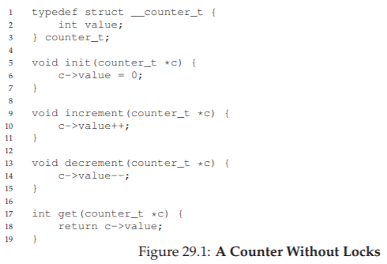
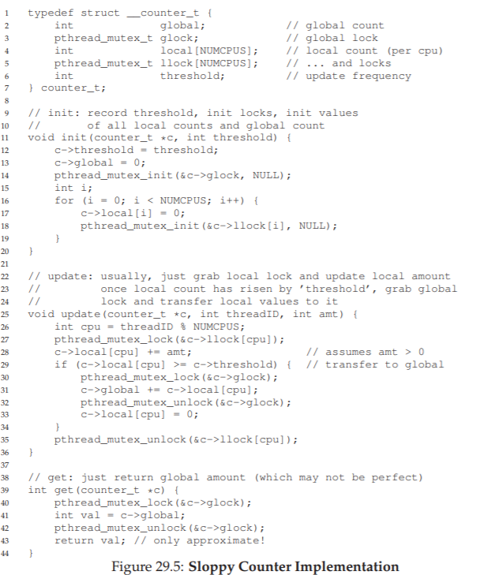
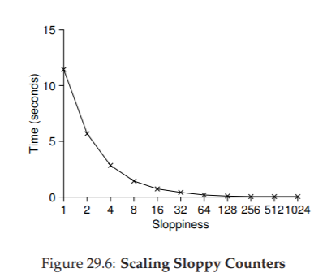
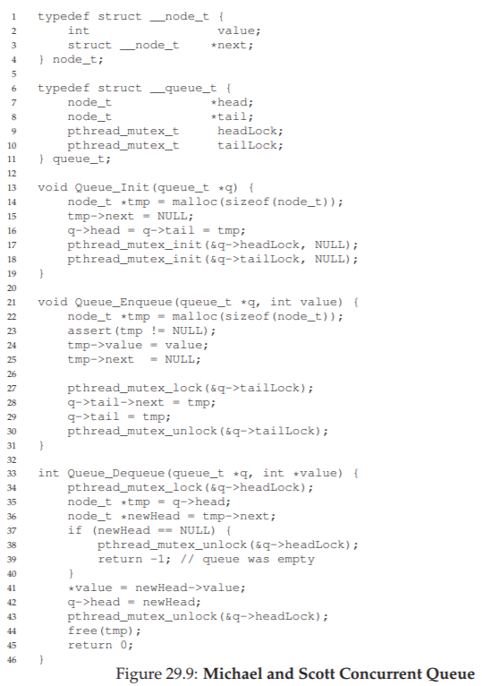

# 29 Cấu trúc dữ liệu đồng thời dựa trên khóa (Lock-based Concurrent Data Structures)
Trước khi đi xa hơn khỏi chủ đề **lock** (khóa), chúng ta sẽ mô tả cách sử dụng khóa trong một số cấu trúc dữ liệu phổ biến. Việc thêm khóa vào một cấu trúc dữ liệu để cho phép **thread** (luồng) sử dụng sẽ khiến cấu trúc đó trở nên **thread safe** (an toàn luồng). Tất nhiên, cách thức chính xác mà các khóa này được thêm vào sẽ quyết định cả **tính đúng đắn** (correctness) và **hiệu năng** (performance) của cấu trúc dữ liệu. Và đây chính là thách thức của chúng ta:

> **THE CRUX: LÀM THẾ NÀO ĐỂ THÊM KHÓA VÀO CẤU TRÚC DỮ LIỆU**  
> Khi được giao một cấu trúc dữ liệu cụ thể, chúng ta nên thêm khóa vào như thế nào để nó hoạt động đúng? Hơn nữa, làm thế nào để thêm khóa sao cho cấu trúc dữ liệu đạt hiệu năng cao, cho phép nhiều thread truy cập đồng thời (concurrently) cùng lúc?

Tất nhiên, chúng ta khó có thể bao quát tất cả các cấu trúc dữ liệu hoặc mọi phương pháp thêm tính đồng thời, vì đây là một chủ đề đã được nghiên cứu trong nhiều năm, với (thực sự) hàng ngàn bài báo khoa học được công bố. Do đó, chúng tôi hy vọng sẽ cung cấp một phần giới thiệu đủ để bạn nắm được cách tư duy cần thiết, và giới thiệu một số nguồn tài liệu tốt để bạn tự tìm hiểu thêm. Chúng tôi nhận thấy khảo sát của Moir và Shavit là một nguồn thông tin tuyệt vời [MS04].

## 29.1 Bộ đếm đồng thời (Concurrent Counters)

Một trong những cấu trúc dữ liệu đơn giản nhất là **counter** (bộ đếm). Đây là một cấu trúc thường được sử dụng và có giao diện đơn giản. Chúng ta định nghĩa một bộ đếm đơn giản **không đồng thời** trong **Hình 29.1**.

### Đơn giản nhưng không mở rộng được (Simple But Not Scalable)

Như bạn thấy, bộ đếm **non-synchronized** (không đồng bộ) là một cấu trúc dữ liệu rất đơn giản, chỉ cần một lượng mã nhỏ để triển khai. Giờ chúng ta có thách thức tiếp theo: làm thế nào để khiến đoạn code này **thread safe**? **Hình 29.2** cho thấy cách chúng ta thực hiện điều đó.

**Hình 29.1:** Bộ đếm không có khóa  

Bộ đếm đồng thời này đơn giản và hoạt động đúng. Thực tế, nó tuân theo một **mẫu thiết kế** (design pattern) phổ biến đối với các cấu trúc dữ liệu đồng thời cơ bản nhất: chỉ cần thêm một **lock duy nhất**, được **acquire** (chiếm giữ) khi gọi một hàm thao tác trên cấu trúc dữ liệu, và **release** (giải phóng) khi trả về từ call hàm. Theo cách này, nó tương tự như một cấu trúc dữ liệu được xây dựng với **monitor** [BH73], nơi khóa được tự động chiếm giữ và giải phóng khi bạn gọi và trả về từ các phương thức của đối tượng.

Tại thời điểm này, bạn đã có một cấu trúc dữ liệu đồng thời hoạt động được. Vấn đề bạn có thể gặp phải là **hiệu năng**. Nếu cấu trúc dữ liệu của bạn quá chậm, bạn sẽ phải làm nhiều hơn là chỉ thêm một khóa duy nhất; các tối ưu hóa như vậy, nếu cần, sẽ là chủ đề của phần còn lại của chương này. Lưu ý rằng nếu cấu trúc dữ liệu không quá chậm, bạn đã xong! Không cần làm gì phức tạp nếu giải pháp đơn giản đã hiệu quả.

Để hiểu chi phí hiệu năng của cách tiếp cận đơn giản này, chúng tôi chạy một **benchmark** (bài kiểm thử hiệu năng) trong đó mỗi thread cập nhật một bộ đếm dùng chung một số lần cố định; sau đó chúng tôi thay đổi số lượng thread. **Hình 29.5** cho thấy tổng thời gian thực hiện, với từ một đến bốn thread hoạt động; mỗi thread cập nhật bộ đếm một triệu lần. Thí nghiệm này được chạy trên một máy iMac với bốn CPU Intel i5 2.7 GHz; với nhiều CPU hoạt động hơn, chúng tôi kỳ vọng sẽ hoàn thành nhiều công việc hơn trong cùng một đơn vị thời gian.

Từ đường trên cùng trong hình (được gắn nhãn “Precise”), bạn có thể thấy hiệu năng của bộ đếm **synchronized** (đồng bộ hóa) mở rộng rất kém. Trong khi một thread có thể hoàn thành một triệu lần cập nhật bộ đếm trong thời gian rất ngắn (khoảng 0,03 giây), thì khi có hai thread cùng cập nhật bộ đếm một triệu lần mỗi thread **đồng thời**, thời gian thực hiện tăng vọt (lên hơn 5 giây!). Và tình hình chỉ tệ hơn khi có nhiều thread hơn.

**Hình 29.2:** Bộ đếm có khóa  

Lý tưởng nhất, bạn muốn các thread hoàn thành nhanh như trên nhiều bộ xử lý cũng giống như một thread trên một bộ xử lý. Đạt được điều này được gọi là **perfect scaling** (mở rộng hoàn hảo); mặc dù có nhiều công việc hơn, nhưng nó được thực hiện song song, và do đó thời gian hoàn thành nhiệm vụ không tăng lên.

### Đếm có khả năng mở rộng (Scalable Counting)

Thật đáng kinh ngạc, các nhà nghiên cứu đã nghiên cứu cách xây dựng các **counter** (bộ đếm) có khả năng mở rộng tốt hơn trong nhiều năm [MS04]. Càng đáng kinh ngạc hơn là việc các bộ đếm có khả năng mở rộng thực sự quan trọng, như các nghiên cứu gần đây về phân tích hiệu năng hệ điều hành đã chỉ ra [B+10]; nếu không có khả năng đếm mở rộng, một số **workload** (tải công việc) chạy trên Linux sẽ gặp vấn đề nghiêm trọng về khả năng mở rộng trên các máy đa lõi (**multicore**). Nhiều kỹ thuật đã được phát triển để giải quyết vấn đề này. Chúng ta sẽ mô tả một phương pháp được gọi là **approximate counter** (bộ đếm xấp xỉ) [C06].

**Approximate counter** hoạt động bằng cách biểu diễn một bộ đếm logic duy nhất thông qua nhiều bộ đếm vật lý cục bộ (**local counter**), mỗi CPU core một bộ đếm, cùng với một bộ đếm toàn cục (**global counter**). Cụ thể, trên một máy có bốn CPU, sẽ có bốn local counter và một global counter. Ngoài các bộ đếm này, còn có các **lock** (khóa): một khóa cho mỗi local counter^[1], và một khóa cho global counter.

Ý tưởng cơ bản của approximate counting như sau: khi một **thread** (luồng) chạy trên một core nhất định muốn tăng giá trị bộ đếm, nó sẽ tăng local counter của core đó; việc truy cập local counter này được đồng bộ hóa thông qua local lock tương ứng. Vì mỗi CPU có local counter riêng, các thread trên các CPU khác nhau có thể cập nhật local counter mà không tranh chấp (**contention**), và do đó việc cập nhật bộ đếm có khả năng mở rộng.

Tuy nhiên, để giữ cho global counter luôn được cập nhật (trong trường hợp một thread muốn đọc giá trị của nó), các giá trị local sẽ được định kỳ chuyển sang global counter, bằng cách chiếm giữ (**acquire**) global lock và tăng nó thêm giá trị của local counter; sau đó local counter được đặt lại về 0.

Tần suất thực hiện việc chuyển từ local sang global này được xác định bởi một **ngưỡng** (**threshold**) S. S càng nhỏ, bộ đếm càng hoạt động giống bộ đếm không mở rộng ở trên; S càng lớn, bộ đếm càng có khả năng mở rộng, nhưng giá trị global có thể lệch xa hơn so với giá trị thực tế. Người ta có thể đơn giản là chiếm giữ tất cả local lock và global lock (theo một thứ tự xác định để tránh **deadlock**) để lấy giá trị chính xác, nhưng cách này không mở rộng được.

Để làm rõ, hãy xem một ví dụ (**Hình 29.3**). Trong ví dụ này, ngưỡng S được đặt là 5, và có các thread trên mỗi trong bốn CPU đang cập nhật local counter L1 ... L4. Giá trị của global counter (G) cũng được hiển thị trong **trace**, với thời gian tăng dần từ trên xuống. Ở mỗi bước thời gian, một local counter có thể được tăng; nếu giá trị local đạt ngưỡng S, giá trị local sẽ được chuyển sang global counter và local counter được đặt lại.

**Hình 29.3:** Theo dõi hoạt động của approximate counter  

^[1]: Chúng ta cần local lock vì giả định rằng có thể có nhiều hơn một thread trên mỗi core. Nếu chỉ có một thread chạy trên mỗi core, sẽ không cần local lock.

Đường dưới trong **Hình 29.5** (được gắn nhãn “Approximate”, ở trang 6) cho thấy hiệu năng của approximate counter với ngưỡng S = 1024. Hiệu năng rất tốt; thời gian để cập nhật bộ đếm bốn triệu lần trên bốn bộ xử lý hầu như không cao hơn thời gian để cập nhật một triệu lần trên một bộ xử lý.

**Hình 29.4:** Triển khai approximate counter  

**Hình 29.5:** Hiệu năng của bộ đếm truyền thống so với approximate counter  

**Hình 29.6:** Khả năng mở rộng của approximate counter  

**Hình 29.6** cho thấy tầm quan trọng của giá trị ngưỡng S, với bốn thread mỗi thread tăng bộ đếm 1 triệu lần trên bốn CPU. Nếu S thấp, hiệu năng kém (nhưng giá trị global luôn khá chính xác); nếu S cao, hiệu năng rất tốt, nhưng giá trị global bị trễ (tối đa bằng số CPU nhân với S). Đây chính là sự đánh đổi giữa **độ chính xác** và **hiệu năng** mà approximate counter mang lại.

Một phiên bản sơ khai của approximate counter được thể hiện trong **Hình 29.4** (trang 5). Hãy đọc nó, hoặc tốt hơn, tự chạy thử nghiệm để hiểu rõ hơn cách nó hoạt động.

> **TIP: NHIỀU TÍNH ĐỒNG THỜI HƠN KHÔNG PHẢI LÚC NÀO CŨNG NHANH HƠN**  
> Nếu thiết kế của bạn thêm quá nhiều chi phí phụ (ví dụ: liên tục acquire và release lock thay vì chỉ một lần), thì việc nó đồng thời hơn có thể không quan trọng. Các giải pháp đơn giản thường hoạt động tốt, đặc biệt nếu chúng hiếm khi sử dụng các thao tác tốn kém. Thêm nhiều khóa và sự phức tạp có thể là nguyên nhân khiến bạn thất bại. Tất cả những điều đó để nói rằng: chỉ có một cách thực sự để biết — hãy xây dựng cả hai phương án (đơn giản nhưng ít đồng thời hơn, và phức tạp nhưng đồng thời hơn) và đo lường hiệu năng. Cuối cùng, bạn không thể “ăn gian” hiệu năng; ý tưởng của bạn hoặc là nhanh hơn, hoặc là không.

## 29.2 Danh sách liên kết đồng thời (Concurrent Linked Lists)

Tiếp theo, chúng ta sẽ xem xét một cấu trúc phức tạp hơn: **linked list** (danh sách liên kết). Hãy bắt đầu lại với một cách tiếp cận cơ bản. Để đơn giản, chúng ta sẽ bỏ qua một số hàm hiển nhiên mà một danh sách như vậy thường có, và chỉ tập trung vào thao tác **insert** (chèn) và **lookup** (tìm kiếm) đồng thời; phần **delete** (xóa) và các thao tác khác sẽ để bạn đọc tự suy nghĩ. **Hình 29.7** cho thấy mã nguồn của cấu trúc dữ liệu sơ khai này.

**Hình 29.7:** Danh sách liên kết đồng thời  

Như bạn thấy trong mã nguồn, hàm `insert` đơn giản là **acquire** (chiếm giữ) một **lock** khi bắt đầu, và **release** (giải phóng) nó khi kết thúc. Một vấn đề nhỏ nhưng tinh vi có thể xảy ra nếu `malloc()` thất bại (một trường hợp hiếm); trong tình huống này, mã nguồn cũng phải giải phóng khóa trước khi kết thúc thao tác chèn.

Kiểu **luồng điều khiển ngoại lệ** (exceptional control flow) này đã được chứng minh là rất dễ gây lỗi; một nghiên cứu gần đây về các bản vá của **Linux kernel** cho thấy một tỷ lệ lớn lỗi (gần 40%) xuất hiện ở những nhánh mã hiếm khi được thực thi như vậy (thực tế, quan sát này đã khơi nguồn cho một số nghiên cứu của chính chúng tôi, trong đó chúng tôi loại bỏ tất cả các nhánh xử lý lỗi cấp phát bộ nhớ trong một hệ thống file của Linux, giúp hệ thống trở nên ổn định hơn [S+11]).

Vậy, thách thức đặt ra: liệu chúng ta có thể viết lại các hàm `insert` và `lookup` sao cho vẫn đúng khi có chèn đồng thời, nhưng tránh được trường hợp nhánh lỗi cũng phải thêm lệnh `unlock`?

Câu trả lời, trong trường hợp này, là **có**. Cụ thể, chúng ta có thể sắp xếp lại mã nguồn một chút để việc **lock** và **release** chỉ bao quanh **critical section** (vùng tới hạn) thực sự trong hàm `insert`, và để hàm `lookup` sử dụng một đường thoát chung (common exit path). Cách thứ nhất hoạt động vì một phần của thao tác chèn thực tế không cần khóa; giả sử `malloc()` tự nó là **thread-safe**, mỗi thread có thể gọi nó mà không lo điều kiện tranh chấp (**race condition**) hoặc lỗi đồng thời khác. Chỉ khi cập nhật danh sách dùng chung mới cần giữ khóa. Xem **Hình 29.8** để biết chi tiết các chỉnh sửa này.

Đối với hàm `lookup`, đây là một phép biến đổi mã đơn giản: thoát khỏi vòng lặp tìm kiếm chính và đi đến một đường trả về duy nhất. Làm như vậy giúp giảm số lần acquire/release lock trong mã, và do đó giảm khả năng vô tình tạo ra lỗi (chẳng hạn quên `unlock` trước khi `return`).

**Hình 29.8:** Danh sách liên kết đồng thời: Phiên bản viết lại  

### Mở rộng khả năng của linked list (Scaling Linked Lists)

Mặc dù chúng ta lại có một linked list đồng thời cơ bản, nhưng một lần nữa, nó không mở rộng hiệu quả. Một kỹ thuật mà các nhà nghiên cứu đã khám phá để cho phép nhiều tính đồng thời hơn trong danh sách được gọi là **hand-over-hand locking** (hay còn gọi là **lock coupling**) [MS04].

Ý tưởng khá đơn giản: thay vì có một khóa duy nhất cho toàn bộ danh sách, bạn thêm một khóa cho **mỗi node** của danh sách. Khi duyệt danh sách, mã nguồn sẽ **acquire** khóa của node kế tiếp trước, rồi mới **release** khóa của node hiện tại (điều này tạo cảm giác như “chuyền tay” khóa, do đó có tên gọi hand-over-hand).

> **TIP: CẨN TRỌNG VỚI KHÓA VÀ LUỒNG ĐIỀU KHIỂN**  
> Một mẹo thiết kế tổng quát, hữu ích cả trong lập trình đồng thời lẫn các lĩnh vực khác, là hãy cẩn trọng với các thay đổi luồng điều khiển dẫn đến việc hàm kết thúc sớm (return), thoát (exit), hoặc các điều kiện lỗi tương tự khiến hàm dừng thực thi. Bởi vì nhiều hàm sẽ bắt đầu bằng việc acquire một khóa, cấp phát bộ nhớ, hoặc thực hiện các thao tác thay đổi trạng thái khác, khi lỗi xảy ra, mã nguồn phải hoàn tác tất cả các thay đổi trạng thái trước khi trả về — điều này rất dễ gây lỗi. Do đó, tốt nhất là cấu trúc mã để giảm thiểu mô hình này.

Về mặt ý tưởng, một linked list kiểu hand-over-hand có vẻ hợp lý; nó cho phép mức độ đồng thời cao trong các thao tác trên danh sách. Tuy nhiên, trên thực tế, rất khó để làm cho cấu trúc này nhanh hơn cách tiếp cận dùng một khóa duy nhất, vì chi phí acquire và release khóa cho mỗi node trong quá trình duyệt là quá lớn. Ngay cả với danh sách rất dài và số lượng thread lớn, mức độ đồng thời đạt được nhờ cho phép nhiều lượt duyệt song song cũng khó có thể nhanh hơn việc chỉ cần acquire một khóa, thực hiện thao tác, rồi release nó. Có lẽ một dạng **lai** (hybrid) — nơi bạn acquire một khóa mới sau mỗi một số node nhất định — sẽ đáng để nghiên cứu.

## 29.3 Hàng đợi đồng thời (Concurrent Queues)

Như bạn đã biết, luôn có một phương pháp tiêu chuẩn để biến một cấu trúc dữ liệu thành **concurrent data structure** (cấu trúc dữ liệu đồng thời): thêm một **big lock** (khóa lớn). Đối với **queue** (hàng đợi), chúng ta sẽ bỏ qua cách tiếp cận này, giả định rằng bạn có thể tự hình dung ra.

Thay vào đó, chúng ta sẽ xem xét một hàng đợi đồng thời hơn một chút, được thiết kế bởi Michael và Scott [MS98]. Cấu trúc dữ liệu và mã nguồn được sử dụng cho hàng đợi này được thể hiện trong **Hình 29.9** (trang 11).

**Hình 29.9:** Hàng đợi đồng thời của Michael và Scott  

Nếu bạn nghiên cứu kỹ đoạn code này, bạn sẽ nhận thấy có **hai khóa**: một cho **head** (đầu hàng đợi) và một cho **tail** (đuôi hàng đợi). Mục tiêu của hai khóa này là cho phép các thao tác **enqueue** (thêm phần tử vào đuôi) và **dequeue** (lấy phần tử từ đầu) diễn ra đồng thời. Trong trường hợp phổ biến, hàm `enqueue` chỉ truy cập **tail lock**, và `dequeue` chỉ truy cập **head lock**.

Một thủ thuật được Michael và Scott sử dụng là thêm một **dummy node** (nút giả, được cấp phát trong mã khởi tạo hàng đợi); nút giả này cho phép tách biệt các thao tác ở head và tail. Hãy nghiên cứu mã nguồn, hoặc tốt hơn, gõ lại, chạy thử và đo đạc để hiểu sâu hơn cách nó hoạt động.

Hàng đợi được sử dụng phổ biến trong các ứng dụng **multi-threaded** (đa luồng). Tuy nhiên, loại hàng đợi được sử dụng ở đây (chỉ với khóa) thường không hoàn toàn đáp ứng nhu cầu của các chương trình như vậy. Một **bounded queue** (hàng đợi giới hạn) được phát triển đầy đủ hơn, cho phép một thread chờ nếu hàng đợi rỗng hoặc quá đầy, sẽ là chủ đề nghiên cứu chuyên sâu của chúng ta trong chương tiếp theo về **condition variables** (biến điều kiện). Hãy đón xem!

## 29.4 Bảng băm đồng thời (Concurrent Hash Table)

Chúng ta kết thúc phần thảo luận với một cấu trúc dữ liệu đồng thời đơn giản và có tính ứng dụng rộng rãi: **hash table** (bảng băm). Chúng ta sẽ tập trung vào một bảng băm đơn giản **không thay đổi kích thước**; việc xử lý thay đổi kích thước cần thêm một chút công việc, và chúng tôi để lại như một bài tập cho bạn đọc.

**Hình 29.10:** Bảng băm đồng thời  

Bảng băm đồng thời này (**Hình 29.10**) khá trực quan, được xây dựng bằng cách sử dụng các **concurrent list** (danh sách đồng thời) mà chúng ta đã phát triển trước đó, và hoạt động rất hiệu quả. Lý do cho hiệu năng tốt của nó là thay vì có một khóa duy nhất cho toàn bộ cấu trúc, nó sử dụng **một khóa cho mỗi hash bucket** (mỗi bucket được biểu diễn bởi một danh sách). Cách làm này cho phép nhiều thao tác đồng thời diễn ra.

**Hình 29.11** (trang 13) cho thấy hiệu năng của bảng băm khi thực hiện các cập nhật đồng thời (từ 10.000 đến 50.000 cập nhật đồng thời từ mỗi trong bốn thread, trên cùng một máy iMac với bốn CPU). Cũng được hiển thị, để so sánh, là hiệu năng của một linked list (với một khóa duy nhất).

**Hình 29.11:** Khả năng mở rộng của bảng băm  

Như bạn thấy từ biểu đồ, bảng băm đồng thời đơn giản này mở rộng rất tốt; ngược lại, linked list thì không.

## 29.5 Tóm tắt (Summary)

Chúng ta đã giới thiệu một số ví dụ về **concurrent data structure** (cấu trúc dữ liệu đồng thời), từ **counter** (bộ đếm), đến **list** (danh sách) và **queue** (hàng đợi), và cuối cùng là **hash table** (bảng băm) — một cấu trúc phổ biến và được sử dụng rộng rãi. Trên đường đi, chúng ta đã học được một số bài học quan trọng:

- Cần cẩn trọng khi **acquire** (chiếm giữ) và **release** (giải phóng) khóa xung quanh các thay đổi luồng điều khiển (**control flow changes**).
- Việc tăng tính đồng thời không nhất thiết sẽ tăng hiệu năng.
- Chỉ nên khắc phục các vấn đề hiệu năng khi chúng thực sự tồn tại.

Điểm cuối cùng này — tránh **premature optimization** (tối ưu hóa sớm) — là nguyên tắc cốt lõi đối với bất kỳ lập trình viên nào quan tâm đến hiệu năng; không có giá trị gì khi làm một thứ nhanh hơn nếu điều đó không cải thiện hiệu năng tổng thể của ứng dụng.

Tất nhiên, chúng ta mới chỉ chạm tới bề mặt của các cấu trúc hiệu năng cao. Hãy xem khảo sát xuất sắc của Moir và Shavit để biết thêm thông tin, cũng như các liên kết đến những nguồn khác [MS04]. Đặc biệt, bạn có thể quan tâm đến các cấu trúc khác (như **B-tree**); để học về chúng, một khóa học cơ sở dữ liệu sẽ là lựa chọn tốt nhất. Bạn cũng có thể tò mò về các kỹ thuật **không sử dụng khóa truyền thống**; các **non-blocking data structure** (cấu trúc dữ liệu không chặn) là thứ mà chúng ta sẽ tìm hiểu sơ qua trong chương về các lỗi đồng thời phổ biến, nhưng thực tế đây là một lĩnh vực kiến thức riêng biệt, đòi hỏi nhiều nghiên cứu hơn khả năng của cuốn sách này. Nếu muốn, bạn hãy tự tìm hiểu thêm.

> **TIP: TRÁNH TỐI ƯU HÓA SỚM (ĐỊNH LUẬT CỦA KNUTH)**  
> Khi xây dựng một cấu trúc dữ liệu đồng thời, hãy bắt đầu với cách tiếp cận cơ bản nhất: thêm một **big lock** duy nhất để cung cấp quyền truy cập đồng bộ. Bằng cách này, bạn có khả năng xây dựng một cơ chế khóa đúng; nếu sau đó bạn thấy nó gặp vấn đề về hiệu năng, bạn có thể tinh chỉnh, chỉ làm cho nó nhanh hơn khi cần. Như Knuth đã nói nổi tiếng: *“Premature optimization is the root of all evil.”*  
> Nhiều hệ điều hành đã sử dụng một khóa duy nhất khi lần đầu chuyển sang **multiprocessor** (đa bộ xử lý), bao gồm Sun OS và Linux. Trong Linux, khóa này thậm chí còn có tên: **big kernel lock** (BKL). Trong nhiều năm, cách tiếp cận đơn giản này là một lựa chọn tốt, nhưng khi hệ thống đa CPU trở thành tiêu chuẩn, việc chỉ cho phép một thread hoạt động trong kernel tại một thời điểm đã trở thành nút thắt cổ chai về hiệu năng. Do đó, đã đến lúc bổ sung tối ưu hóa để cải thiện tính đồng thời cho các hệ thống này. Trong Linux, cách tiếp cận trực tiếp hơn đã được áp dụng: thay thế một khóa bằng nhiều khóa. Trong Sun, một quyết định táo bạo hơn đã được đưa ra: xây dựng một hệ điều hành hoàn toàn mới, gọi là **Solaris**, tích hợp tính đồng thời một cách cơ bản ngay từ đầu. Hãy đọc các sách về kernel của Linux và Solaris để biết thêm thông tin về những hệ thống thú vị này [BC05, MM00].
