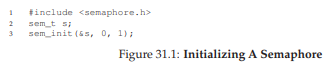
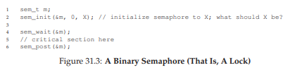
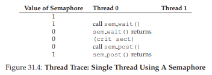
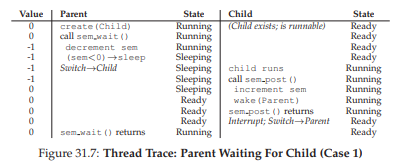
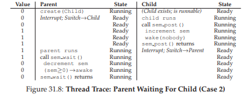
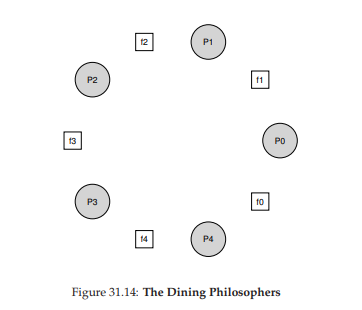

# 31. Semaphores (Cơ chế Semaphore)

Như chúng ta đã biết, để giải quyết được một loạt các vấn đề **concurrency** (tính đồng thời) quan trọng và thú vị, chúng ta cần cả **lock** (khóa) và **condition variable** (biến điều kiện). Một trong những người đầu tiên nhận ra điều này từ nhiều năm trước là **Edsger Dijkstra** (mặc dù thật khó để biết chính xác lịch sử [GR92]). Ông nổi tiếng với nhiều đóng góp, như thuật toán “**shortest paths**” (đường đi ngắn nhất) trong lý thuyết đồ thị [D59], bài viết gây tiếng vang về lập trình có cấu trúc mang tên “**Goto Statements Considered Harmful**” [D68a] (một tiêu đề tuyệt vời!), và trong trường hợp chúng ta nghiên cứu ở đây — việc giới thiệu một **synchronization primitive** (nguyên thủy đồng bộ hóa) gọi là **semaphore** [D68b, D72]. Thực tế, Dijkstra và các cộng sự đã phát minh ra semaphore như một nguyên thủy duy nhất cho mọi thứ liên quan đến đồng bộ hóa; như bạn sẽ thấy, có thể dùng semaphore như cả lock và condition variable.

> **THE CRUX: CÁCH SỬ DỤNG SEMAPHORE**  
> Làm thế nào để dùng semaphore thay cho lock và condition variable? Định nghĩa của semaphore là gì? Binary semaphore là gì? Có dễ dàng xây dựng semaphore từ lock và condition variable không? Và ngược lại, có thể xây dựng lock và condition variable từ semaphore không?


## 31.1 Semaphores: Định nghĩa

**Semaphore** là một đối tượng có một giá trị nguyên, mà chúng ta có thể thao tác thông qua hai hàm; trong chuẩn **POSIX**, các hàm này là `sem_wait()` và `sem_post()`[^1]. Vì giá trị khởi tạo của semaphore quyết định hành vi của nó, trước khi gọi bất kỳ hàm nào khác để tương tác với semaphore, chúng ta phải khởi tạo nó với một giá trị, như trong **Hình 31.1**.

[^1]: Lịch sử: `sem_wait()` ban đầu được Dijkstra gọi là **P()** và `sem_post()` là **V()**. Các dạng viết tắt này xuất phát từ tiếng Hà Lan; thú vị là các từ gốc tiếng Hà Lan này đã thay đổi theo thời gian. Ban đầu, P() đến từ “passering” (đi qua) và V() từ “vrijgave” (giải phóng); sau này, Dijkstra viết rằng P() đến từ “prolaag” (ghép của “probeer” – thử và “verlaag” – giảm), và V() từ “verhoog” – tăng. Đôi khi, người ta gọi chúng là **down** và **up**. Bạn có thể dùng các phiên bản tiếng Hà Lan này để gây ấn tượng với bạn bè, hoặc làm họ bối rối, hoặc cả hai. Xem thêm tại https://news.ycombinator.com/item?id=8761539.

```c
#include <semaphore.h>
sem_t s;
sem_init(&s, 0, 1);
```



**Hình 31.1: Khởi tạo một Semaphore**

Trong hình, chúng ta khai báo một semaphore `s` và khởi tạo nó với giá trị 1 (tham số thứ ba). Tham số thứ hai của `sem_init()` sẽ được đặt là 0 trong tất cả các ví dụ chúng ta sẽ thấy; điều này cho biết semaphore được chia sẻ giữa các thread trong cùng một **process** (tiến trình). Xem trang **man** để biết chi tiết các cách sử dụng khác của semaphore (ví dụ: đồng bộ hóa giữa các process khác nhau), khi đó tham số thứ hai sẽ có giá trị khác.

Sau khi semaphore được khởi tạo, chúng ta có thể gọi một trong hai hàm để tương tác với nó: `sem_wait()` hoặc `sem_post()`. Hành vi của hai hàm này được mô tả trong **Hình 31.2**.

Hiện tại, chúng ta chưa quan tâm đến cách triển khai các hàm này, vốn rõ ràng cần được xử lý cẩn thận; với nhiều thread cùng gọi `sem_wait()` và `sem_post()`, cần phải quản lý các **critical section** (vùng tới hạn) bên trong chúng. Giờ chúng ta sẽ tập trung vào cách sử dụng các primitive này; sau đó có thể bàn về cách chúng được xây dựng.

Một số điểm quan trọng về giao diện này:

- Thứ nhất, `sem_wait()` sẽ hoặc trả về ngay (nếu giá trị của semaphore ≥ 1 khi gọi), hoặc sẽ khiến thread gọi bị **suspend** (tạm dừng) để chờ một lần post tiếp theo. Tất nhiên, nhiều thread có thể cùng gọi `sem_wait()` và tất cả sẽ được xếp hàng chờ được đánh thức.
- Thứ hai, `sem_post()` không chờ một điều kiện cụ thể như `sem_wait()`; nó chỉ đơn giản tăng giá trị của semaphore và nếu có thread đang chờ, sẽ đánh thức một thread.
- Thứ ba, giá trị của semaphore, khi âm, bằng đúng số lượng thread đang chờ [D68b]. Mặc dù giá trị này thường không được hiển thị cho người dùng semaphore, nhưng đây là một bất biến đáng biết và có thể giúp bạn nhớ cách semaphore hoạt động.

```c
int sem_wait(sem_t *s) {
  decrement the value of semaphore s by one
  wait if value of semaphore s is negative
}

int sem_post(sem_t *s) {
  increment the value of semaphore s by one
  if there are one or more threads waiting, wake one
}
```


**Hình 31.2: Semaphore – Định nghĩa Wait và Post**

Đừng lo (vội) về các **race condition** có thể xảy ra bên trong semaphore; giả định rằng các thao tác này được thực hiện **atomically** (nguyên tử). Chúng ta sẽ sớm dùng lock và condition variable để đảm bảo điều này.


## 31.2 Binary Semaphores (Dùng như Lock)

Giờ chúng ta sẵn sàng sử dụng semaphore. Cách dùng đầu tiên là một trường hợp quen thuộc: dùng semaphore như một **lock**. Xem **Hình 31.3**; ở đó, bạn sẽ thấy chúng ta chỉ cần bao quanh critical section cần bảo vệ bằng cặp `sem_wait()/sem_post()`. Điều quan trọng để cơ chế này hoạt động là giá trị khởi tạo của semaphore `m` (được khởi tạo với `X` trong hình). Vậy `X` nên là bao nhiêu?  
...(Hãy thử suy nghĩ trước khi đọc tiếp)...

```c
sem_t m;
sem_init(&m, 0, X); // init to X; what should X be?

sem_wait(&m);
// critical section here
sem_post(&m);
```



**Hình 31.3: Binary Semaphore (tức là Lock)**

Nhìn lại định nghĩa của `sem_wait()` và `sem_post()` ở trên, ta thấy giá trị khởi tạo nên là **1**.

Để làm rõ, hãy tưởng tượng kịch bản với hai thread. Thread đầu tiên (Thread 0) gọi `sem_wait()`; nó sẽ giảm giá trị của semaphore xuống 0. Sau đó, nó sẽ chỉ chờ nếu giá trị nhỏ hơn 0. Vì giá trị là 0, `sem_wait()` sẽ trả về ngay và thread gọi tiếp tục; Thread 0 giờ được vào critical section. Nếu không có thread nào khác cố lấy lock khi Thread 0 đang ở trong critical section, khi nó gọi `sem_post()`, giá trị semaphore sẽ được khôi phục về 1 (và không đánh thức thread nào vì không có ai đang chờ). **Hình 31.4** sẽ cho thấy vết thực thi (trace) của kịch bản này.



**Hình 31.4: Vết thực thi của luồng – Một luồng sử dụng Semaphore**

Một trường hợp thú vị hơn xảy ra khi **Thread 0** “giữ lock” (tức là đã gọi `sem_wait()` nhưng chưa gọi `sem_post()`), và một luồng khác (**Thread 1**) cố gắng vào **critical section** (vùng tới hạn) bằng cách gọi `sem_wait()`.  

Trong trường hợp này, **Thread 1** sẽ giảm giá trị của semaphore xuống **-1**, và do đó sẽ phải **wait** (tự đưa mình vào trạng thái ngủ và nhường CPU). Khi **Thread 0** chạy lại, nó sẽ gọi `sem_post()`, tăng giá trị của semaphore trở lại **0**, và sau đó đánh thức luồng đang chờ (**Thread 1**). Lúc này, **Thread 1** sẽ có thể tự acquire lock. Khi **Thread 1** hoàn tất, nó sẽ lại tăng giá trị của semaphore, khôi phục nó về **1**.


**Hình 31.5: Vết thực thi của luồng – Hai luồng sử dụng Semaphore**


**Hình 31.5** minh họa vết thực thi của ví dụ này. Ngoài các hành động của luồng, hình còn cho thấy **trạng thái scheduler** của mỗi luồng:  
- **Run** (luồng đang chạy)  
- **Ready** (có thể chạy nhưng chưa được chạy)  
- **Sleep** (luồng đang bị block).  

Lưu ý rằng **Thread 1** sẽ chuyển sang trạng thái **sleeping** khi cố gắng acquire một lock đang bị giữ; chỉ khi **Thread 0** chạy lại thì **Thread 1** mới có thể được đánh thức và có khả năng chạy tiếp.

Nếu bạn muốn tự thực hành, hãy thử một kịch bản trong đó nhiều luồng xếp hàng chờ lock. Giá trị của semaphore sẽ là bao nhiêu trong vết thực thi như vậy?


Như vậy, chúng ta có thể dùng **semaphore** như **lock**. Vì lock chỉ có hai trạng thái (**held** – đang bị giữ và **not held** – không bị giữ), đôi khi chúng ta gọi semaphore dùng như lock là **binary semaphore**. Lưu ý rằng nếu bạn chỉ dùng semaphore theo cách nhị phân này, nó có thể được triển khai đơn giản hơn so với semaphore tổng quát mà chúng ta trình bày ở đây.


## 31.3 Semaphores cho việc sắp xếp thứ tự (Semaphores For Ordering)

Semaphore cũng hữu ích để **sắp xếp thứ tự các sự kiện** trong một chương trình đồng thời. Ví dụ, một luồng có thể muốn chờ cho đến khi một danh sách không còn rỗng, để nó có thể xóa một phần tử khỏi danh sách.  

Trong mô hình sử dụng này, thường có một luồng **chờ** một sự kiện xảy ra, và một luồng khác **tạo ra** sự kiện đó rồi **signal** rằng nó đã xảy ra, từ đó đánh thức luồng đang chờ. Chúng ta đang dùng semaphore như một **ordering primitive** (nguyên thủy sắp xếp thứ tự), tương tự như cách chúng ta đã dùng **condition variable** trước đây.


Một ví dụ đơn giản như sau: giả sử một luồng tạo ra một luồng khác và muốn chờ cho đến khi luồng đó hoàn tất thực thi (**Hình 31.6**). Khi chương trình này chạy, chúng ta muốn thấy kết quả:

```
parent: begin
child
parent: end
```

Câu hỏi đặt ra là: làm thế nào để dùng semaphore đạt được hiệu ứng này? Thực tế, câu trả lời khá dễ hiểu.  

Như bạn thấy trong code, **parent** chỉ cần gọi `sem_wait()` và **child** gọi `sem_post()` để chờ cho đến khi điều kiện “child hoàn thành” trở thành đúng.  

Tuy nhiên, điều này dẫn đến câu hỏi: **giá trị khởi tạo của semaphore này nên là bao nhiêu?**  
(Một lần nữa, hãy thử suy nghĩ trước khi đọc tiếp)


**Hình 31.6: Parent chờ Child**

Câu trả lời, tất nhiên, là giá trị của semaphore nên được đặt là **0**. Có hai trường hợp cần xem xét:

1. **Trường hợp 1:** Parent tạo child nhưng child chưa chạy (tức là đang ở trong **ready queue** nhưng chưa được chạy). Trong trường hợp này (**Hình 31.7**, trang 6), parent sẽ gọi `sem_wait()` trước khi child gọi `sem_post()`; chúng ta muốn parent phải chờ cho đến khi child chạy. Cách duy nhất để điều này xảy ra là giá trị của semaphore **không lớn hơn 0**; do đó, giá trị khởi tạo phải là **0**.  

   Parent chạy, giảm giá trị semaphore xuống **-1**, rồi **wait** (ngủ). Khi child cuối cùng chạy, nó sẽ gọi `sem_post()`, tăng giá trị semaphore lên **0**, và đánh thức parent, lúc này sẽ return từ `sem_wait()` và kết thúc chương trình.



**Hình 31.7: Vết thực thi luồng – Parent chờ Child (Trường hợp 1)**  



**Hình 31.8: Vết thực thi luồng – Parent chờ Child (Trường hợp 2)**  

Trường hợp thứ hai (**Hình 31.8**) xảy ra khi **child** chạy xong hoàn toàn trước khi **parent** có cơ hội gọi `sem_wait()`. Trong trường hợp này, child sẽ gọi `sem_post()` trước, do đó tăng giá trị của semaphore từ **0** lên **1**. Khi parent sau đó được chạy, nó sẽ gọi `sem_wait()` và thấy giá trị của semaphore là **1**; parent sẽ giảm giá trị này xuống **0** và trả về từ `sem_wait()` mà không phải chờ, vẫn đạt được hiệu ứng mong muốn.  


## 31.4 Bài toán Producer/Consumer (Bounded Buffer)

Vấn đề tiếp theo mà chúng ta sẽ gặp trong chương này được gọi là **producer/consumer problem** (bài toán nhà sản xuất/nhà tiêu thụ), hoặc đôi khi là **bounded buffer problem** (bài toán bộ đệm giới hạn) [D72]. Vấn đề này đã được mô tả chi tiết trong chương trước về **condition variable**; bạn có thể xem lại ở đó để biết chi tiết.  

> **ASIDE: THIẾT LẬP GIÁ TRỊ CHO SEMAPHORE**  
>  
> Chúng ta vừa thấy hai ví dụ về việc khởi tạo semaphore. Trong trường hợp đầu tiên, ta đặt giá trị là **1** để dùng semaphore như một **lock**; trong trường hợp thứ hai, đặt giá trị là **0** để dùng semaphore cho mục đích **ordering** (sắp xếp thứ tự). Vậy quy tắc tổng quát để khởi tạo semaphore là gì?  
>  
> Một cách đơn giản để suy nghĩ, nhờ gợi ý của Perry Kivolowitz, là hãy xem xét số lượng **tài nguyên** bạn sẵn sàng “phát” ngay sau khi khởi tạo. Với lock, giá trị là **1**, vì bạn sẵn sàng cho phép lock được “giữ” ngay sau khi khởi tạo. Với trường hợp ordering, giá trị là **0**, vì ban đầu không có gì để “phát”; chỉ khi child thread hoàn thành thì tài nguyên mới được tạo ra, lúc đó giá trị mới được tăng lên **1**. Hãy thử áp dụng cách suy nghĩ này cho các bài toán semaphore sau này và xem nó có giúp ích không.


### Lần thử đầu tiên

Trong lần thử đầu tiên để giải quyết vấn đề, chúng ta giới thiệu hai semaphore: `empty` và `full`, mà các thread sẽ dùng để biểu thị khi một ô trong buffer đã được làm rỗng hoặc đã được lấp đầy. Code cho các hàm `put` và `get` nằm trong **Hình 31.9**, và cách chúng ta thử giải quyết bài toán producer/consumer nằm trong **Hình 31.10** (trang 8).  


**Hình 31.10: Thêm điều kiện Full và Empty**

Trong ví dụ này, **producer** trước tiên sẽ chờ cho đến khi một buffer rỗng để đặt dữ liệu vào, và **consumer** tương tự sẽ chờ cho đến khi một buffer đầy trước khi sử dụng nó.  

Trước hết, hãy giả sử `MAX=1` (chỉ có một buffer trong mảng), và xem điều này có hoạt động không.  


Giả sử có hai thread: một producer và một consumer. Hãy xét một kịch bản cụ thể trên một CPU đơn. Giả sử consumer chạy trước. Khi đó, consumer sẽ đến dòng C1 trong **Hình 31.10**, gọi `sem_wait(&full)`. Vì `full` được khởi tạo với giá trị **0**, call này sẽ giảm `full` xuống **-1**, chặn consumer lại, và chờ một thread khác gọi `sem_post()` trên `full`, đúng như mong muốn.  

Giả sử producer sau đó chạy. Nó sẽ đến dòng P1, gọi `sem_wait(&empty)`. Không giống consumer, producer sẽ tiếp tục qua dòng này, vì `empty` được khởi tạo với giá trị `MAX` (trong trường hợp này là **1**). Do đó, `empty` sẽ bị giảm xuống **0** và producer sẽ đặt một giá trị dữ liệu vào ô đầu tiên của `buffer` (dòng P2). Producer sau đó tiếp tục đến P3 và gọi `sem_post(&full)`, thay đổi giá trị của semaphore `full` từ **-1** lên **0** và đánh thức consumer (ví dụ: chuyển nó từ trạng thái **blocked** sang **ready**).  


Trong trường hợp này, có thể xảy ra một trong hai tình huống:  
- Nếu producer tiếp tục chạy, nó sẽ lặp lại và đến dòng P1 lần nữa. Lần này, nó sẽ bị chặn, vì giá trị của `empty` là **0**.  
- Nếu producer bị ngắt và consumer bắt đầu chạy, consumer sẽ return từ `sem_wait(&full)` (dòng C1), thấy buffer đã đầy và tiêu thụ nó.  

Dù theo cách nào, chúng ta cũng đạt được hành vi mong muốn.  

Bạn có thể thử ví dụ này với nhiều thread hơn (ví dụ: nhiều producer và nhiều consumer). Nó vẫn sẽ hoạt động.  


Bây giờ, hãy giả sử `MAX` lớn hơn 1 (ví dụ `MAX=10`). Trong ví dụ này, giả sử có nhiều producer và nhiều consumer. Lúc này, chúng ta gặp một vấn đề: **race condition**. Bạn có thấy nó xảy ra ở đâu không? (hãy dành thời gian quan sát) Nếu chưa thấy, gợi ý là: hãy nhìn kỹ hơn vào code của `put()` và `get()`.  


OK, hãy phân tích vấn đề. Giả sử có hai producer (Pa và Pb) cùng gọi `put()` gần như đồng thời. Giả sử producer Pa chạy trước, và bắt đầu ghi dữ liệu vào ô đầu tiên của buffer (`fill=0` tại dòng F1). Trước khi Pa kịp tăng biến đếm `fill` lên 1, nó bị ngắt. Producer Pb bắt đầu chạy, và tại dòng F1 nó cũng ghi dữ liệu vào phần tử thứ 0 của `buffer`, nghĩa là dữ liệu cũ ở đó bị ghi đè! Đây là hành động **không được phép**; chúng ta không muốn dữ liệu từ producer bị mất.  


### Giải pháp: Thêm Mutual Exclusion

Như bạn thấy, điều chúng ta quên ở đây là **mutual exclusion** (loại trừ lẫn nhau). Việc ghi dữ liệu vào buffer và tăng chỉ số `fill` là một **critical section** và do đó phải được bảo vệ cẩn thận. Vì vậy, hãy dùng **binary semaphore** như một **lock**. **Hình 31.11** cho thấy cách chúng ta thử áp dụng.


**Hình 31.11: Thêm Mutual Exclusion (Sai cách)**  

Giờ đây, chúng ta đã thêm một số **lock** bao quanh toàn bộ phần `put()/get()` của code, như được đánh dấu bởi các chú thích **NEW LINE**. Nghe có vẻ là một ý tưởng đúng, nhưng thực tế lại **không hoạt động**. Tại sao? **Deadlock**.  

Vì sao deadlock xảy ra? Hãy dành chút thời gian suy nghĩ; thử tìm một tình huống mà deadlock xuất hiện. Trình tự các bước nào phải xảy ra để chương trình rơi vào deadlock?


### Tránh Deadlock

OK, bây giờ khi bạn đã tìm ra, đây là câu trả lời. Hãy tưởng tượng có hai **thread**, một **producer** và một **consumer**. Consumer chạy trước. Nó acquire **mutex** (dòng C0), sau đó gọi `sem_wait()` trên semaphore `full` (dòng C1); vì chưa có dữ liệu nào, call này khiến consumer bị block và nhường CPU; quan trọng là, consumer **vẫn đang giữ lock**.

Sau đó, producer chạy. Nó có dữ liệu để sản xuất và nếu có thể chạy, nó sẽ đánh thức consumer và mọi thứ sẽ ổn. Nhưng đáng tiếc, việc đầu tiên nó làm là gọi `sem_wait()` trên semaphore nhị phân `mutex` (dòng P0). Lock này đã bị giữ. Do đó, producer cũng bị kẹt chờ.

Ở đây hình thành một vòng lặp đơn giản: consumer giữ mutex và đang chờ ai đó signal `full`. Producer có thể signal `full` nhưng lại đang chờ `mutex`. Kết quả là producer và consumer đều kẹt chờ nhau: một deadlock kinh điển.


### Cuối cùng, một giải pháp hoạt động

Để giải quyết vấn đề này, chúng ta chỉ cần **giảm phạm vi của lock**. **Hình 31.12** (trang 10) cho thấy giải pháp đúng. Như bạn thấy, chúng ta chỉ cần di chuyển phần acquire và release mutex để bao quanh đúng **critical section**; phần code `wait` và `signal` trên `full` và `empty` được để bên ngoài[^2].  

Kết quả là một bounded buffer đơn giản và hoạt động đúng — một mẫu thường được sử dụng trong các chương trình đa luồng. Hiểu nó ngay bây giờ; dùng nó sau này. Bạn sẽ cảm ơn chúng tôi trong nhiều năm tới. Hoặc ít nhất, bạn sẽ cảm ơn khi câu hỏi tương tự xuất hiện trong kỳ thi cuối kỳ, hoặc trong một buổi phỏng vấn xin việc.


**Hình 31.12: Thêm Mutual Exclusion (Đúng cách)**  

[^2]: Thực tế, sẽ tự nhiên hơn nếu đặt phần acquire/release mutex bên trong các hàm `put()` và `get()` để đảm bảo tính mô-đun.


## 31.5 Reader-Writer Locks

Một vấn đề kinh điển khác xuất phát từ nhu cầu có một **locking primitive** (nguyên thủy khóa) linh hoạt hơn, cho phép các thao tác truy cập cấu trúc dữ liệu khác nhau có thể yêu cầu các loại khóa khác nhau.  

Ví dụ: hãy tưởng tượng có nhiều thao tác đồng thời trên một danh sách, bao gồm **insert** (chèn) và **lookup** (tra cứu) đơn giản. Trong khi insert thay đổi trạng thái của danh sách (vì vậy critical section truyền thống là hợp lý), lookup chỉ đọc cấu trúc dữ liệu; miễn là chúng ta đảm bảo không có insert nào đang diễn ra, ta có thể cho phép nhiều lookup chạy đồng thời.  

Loại lock đặc biệt mà chúng ta sẽ phát triển để hỗ trợ kiểu hoạt động này được gọi là **reader-writer lock** [CHP71]. Code cho loại lock này được thể hiện trong **Hình 31.13** (trang 12).


**Hình 31.13: Một Reader-Writer Lock đơn giản**

Code khá đơn giản. Nếu một thread muốn **update** (cập nhật) cấu trúc dữ liệu, nó sẽ gọi cặp hàm đồng bộ mới:  
- `rwlock_acquire_writelock()` để acquire write lock  
- `rwlock_release_writelock()` để release write lock  

Bên trong, chúng chỉ đơn giản sử dụng semaphore `writelock` để đảm bảo chỉ một writer có thể acquire lock và do đó vào critical section để cập nhật cấu trúc dữ liệu.


Điều thú vị hơn là cặp hàm acquire và release **read lock**. Khi acquire read lock, reader trước tiên acquire `lock` và sau đó tăng biến `readers` để theo dõi số lượng reader hiện đang ở trong cấu trúc dữ liệu.  

Bước quan trọng trong `rwlock_acquire_readlock()` xảy ra khi **reader đầu tiên** acquire lock; trong trường hợp đó, reader này cũng acquire write lock bằng cách gọi `sem_wait()` trên semaphore `writelock`, sau đó release `lock` bằng cách gọi `sem_post()`.


Như vậy, khi một reader đã acquire read lock, các reader khác cũng sẽ được phép acquire read lock; tuy nhiên, bất kỳ thread nào muốn acquire write lock sẽ phải chờ cho đến khi **tất cả** reader hoàn tất; reader cuối cùng rời critical section sẽ gọi `sem_post()` trên `writelock` và cho phép writer đang chờ acquire lock.


Cách tiếp cận này hoạt động (đúng như mong muốn), nhưng có một số nhược điểm, đặc biệt là về **fairness** (tính công bằng). Cụ thể, rất dễ để reader khiến writer bị **starvation** (đói tài nguyên). Có những giải pháp tinh vi hơn cho vấn đề này; có lẽ bạn có thể nghĩ ra một cách triển khai tốt hơn? Gợi ý: hãy nghĩ về cách ngăn không cho reader mới vào lock khi đã có writer đang chờ.

Cuối cùng, cần lưu ý rằng reader-writer lock nên được sử dụng một cách thận trọng. Chúng thường thêm nhiều overhead (đặc biệt với các triển khai phức tạp hơn), và do đó có thể không cải thiện hiệu năng so với việc chỉ dùng các locking primitive đơn giản và nhanh [CB08]. Dù sao, chúng cũng cho thấy một lần nữa cách chúng ta có thể dùng semaphore theo những cách thú vị và hữu ích.

> **TIP: ĐƠN GIẢN VÀ “NGU NGỐC” CÓ THỂ LÀ TỐT HƠN (HILL’S LAW)**  
> Đừng bao giờ đánh giá thấp ý tưởng rằng cách tiếp cận đơn giản và “ngu ngốc” có thể là tốt nhất. Với locking, đôi khi một spin lock đơn giản lại hoạt động tốt nhất, vì nó dễ triển khai và nhanh. Mặc dù thứ như reader/writer lock nghe có vẻ “ngầu”, nhưng chúng phức tạp, và phức tạp có thể đồng nghĩa với chậm. Vì vậy, hãy luôn thử cách đơn giản và “ngu ngốc” trước.  
> Ý tưởng này, hướng tới sự đơn giản, xuất hiện ở nhiều nơi. Một nguồn sớm là luận án của Mark Hill [H87], nghiên cứu cách thiết kế cache cho CPU. Hill phát hiện rằng cache **direct-mapped** đơn giản hoạt động tốt hơn so với thiết kế **set-associative** phức tạp (một lý do là trong caching, thiết kế đơn giản cho phép tra cứu nhanh hơn). Như Hill đã tóm tắt ngắn gọn: “To và ngu là tốt hơn.” Và do đó, chúng ta gọi lời khuyên tương tự này là **Hill’s Law**.


## 31.6 The Dining Philosophers

Một trong những bài toán concurrency nổi tiếng nhất được Dijkstra nêu ra và giải quyết là **dining philosopher’s problem** [D71]. Bài toán này nổi tiếng vì nó thú vị và có phần kích thích trí tuệ; tuy nhiên, tính ứng dụng thực tế của nó là thấp. Nhưng vì danh tiếng, nó vẫn được đưa vào đây; thực tế, bạn có thể bị hỏi về nó trong một buổi phỏng vấn, và bạn sẽ “ghét” giảng viên môn Hệ điều hành của mình nếu bỏ lỡ câu hỏi đó và mất cơ hội việc làm. Ngược lại, nếu bạn được nhận, hãy thoải mái gửi cho giảng viên một lời cảm ơn, hoặc vài cổ phiếu.


Bối cảnh cơ bản của bài toán như sau (**Hình 31.14**): giả sử có **năm “triết gia”** ngồi quanh một bàn tròn. Giữa mỗi cặp triết gia là một chiếc **nĩa** (fork) — tổng cộng năm chiếc. Mỗi triết gia có những khoảng thời gian **suy nghĩ** (không cần nĩa) và những khoảng thời gian **ăn**. Để ăn, một triết gia cần **hai chiếc nĩa**: một bên trái và một bên phải. Sự tranh chấp các chiếc nĩa này, và các vấn đề đồng bộ hóa phát sinh, chính là lý do bài toán này được nghiên cứu trong lập trình đồng thời.


**Hình 31.14: The Dining Philosophers**

Dưới đây là vòng lặp cơ bản của mỗi triết gia, giả sử mỗi người có một **thread identifier** (ID luồng) duy nhất `p` từ 0 đến 4 (bao gồm):

Thách thức chính ở đây là viết các hàm `get_forks()` và `put_forks()` sao cho **không xảy ra deadlock**, **không có triết gia nào bị đói** (starvation) và không bao giờ được ăn, đồng thời **độ đồng thời** (concurrency) là cao nhất có thể (tức là có nhiều triết gia ăn cùng lúc nhất có thể).

Theo giải pháp của **Downey** [D08], chúng ta sẽ dùng một vài hàm trợ giúp để tiến tới lời giải. Chúng là:

```c
int left(int p) { return p; }
int right(int p) { return (p + 1) % 5; }
```

Khi triết gia `p` muốn tham chiếu đến chiếc nĩa bên trái của mình, họ chỉ cần gọi `left(p)`. Tương tự, chiếc nĩa bên phải của triết gia `p` được tham chiếu bằng cách gọi `right(p)`; toán tử modulo ở đây xử lý trường hợp đặc biệt khi triết gia cuối cùng (`p=4`) cố gắng lấy chiếc nĩa bên phải của mình, vốn là nĩa số 0.

Chúng ta cũng sẽ cần một số **semaphore** để giải quyết vấn đề này. Giả sử chúng ta có 5 semaphore, mỗi cái cho một chiếc nĩa:  
```c
sem_t forks[5];
```


### Giải pháp sai (Broken Solution)

Chúng ta thử giải pháp đầu tiên cho vấn đề. Giả sử ta khởi tạo mỗi semaphore (trong mảng `forks`) với giá trị **1**. Giả sử thêm rằng mỗi triết gia biết số thứ tự của mình (`p`). Khi đó, ta có thể viết các hàm `get_forks()` và `put_forks()` (**Hình 31.15**, trang 15).



**Hình 31.15: Các hàm get_forks() và put_forks()**

Trực giác đằng sau giải pháp (sai) này như sau: để lấy nĩa, ta chỉ cần “giữ lock” trên từng cái: trước tiên là cái bên trái, sau đó là cái bên phải. Khi ăn xong, ta nhả chúng ra. Nghe có vẻ đơn giản, đúng không? Đáng tiếc, trong trường hợp này, “đơn giản” lại đồng nghĩa với “sai”. Bạn có thấy vấn đề phát sinh không? Hãy suy nghĩ.

Vấn đề ở đây là **deadlock**. Nếu mỗi triết gia tình cờ lấy chiếc nĩa bên trái của mình trước khi bất kỳ ai lấy được chiếc nĩa bên phải, thì mỗi người sẽ bị kẹt, giữ một chiếc nĩa và chờ chiếc còn lại mãi mãi. Cụ thể: triết gia 0 lấy nĩa 0, triết gia 1 lấy nĩa 1, triết gia 2 lấy nĩa 2, triết gia 3 lấy nĩa 3, và triết gia 4 lấy nĩa 4; tất cả nĩa đều đã bị giữ, và tất cả triết gia đều bị kẹt chờ một chiếc nĩa mà người khác đang giữ. Chúng ta sẽ nghiên cứu deadlock chi tiết hơn sau; còn bây giờ, có thể nói rằng đây **không** phải là một giải pháp hoạt động.


### Một giải pháp: Phá vỡ sự phụ thuộc (Breaking The Dependency)

Cách đơn giản nhất để giải quyết vấn đề này là thay đổi cách lấy nĩa của ít nhất một triết gia; thực tế, đây chính là cách Dijkstra đã giải quyết vấn đề. Cụ thể, giả sử triết gia số 4 (người có số thứ tự cao nhất) sẽ lấy nĩa theo thứ tự khác với những người còn lại (**Hình 31.16**); code `put_forks()` vẫn giữ nguyên.


**Hình 31.16: Phá vỡ sự phụ thuộc trong get_forks()**

Vì triết gia cuối cùng cố gắng lấy nĩa bên phải trước nĩa bên trái, sẽ không có tình huống tất cả triết gia đều giữ một nĩa và chờ nĩa còn lại; vòng chờ bị phá vỡ. Hãy suy nghĩ về hệ quả của giải pháp này và tự thuyết phục rằng nó hoạt động.

Có những bài toán “nổi tiếng” khác tương tự, ví dụ: **cigarette smoker’s problem** (bài toán người hút thuốc) hoặc **sleeping barber problem** (bài toán thợ cắt tóc ngủ). Hầu hết chỉ là cái cớ để suy nghĩ về concurrency; một số có tên gọi thú vị. Hãy tìm hiểu nếu bạn muốn biết thêm, hoặc chỉ để luyện tập tư duy đồng thời [D08].


## 31.7 Thread Throttling

Một trường hợp sử dụng đơn giản khác của semaphore đôi khi xuất hiện, và chúng ta sẽ trình bày ở đây. Vấn đề cụ thể là: làm thế nào để lập trình viên ngăn “quá nhiều” thread làm một việc cùng lúc và làm chậm hệ thống? Câu trả lời: xác định một ngưỡng cho “quá nhiều”, và sau đó dùng semaphore để giới hạn số lượng thread đồng thời thực thi đoạn code đó. Chúng ta gọi cách tiếp cận này là **throttling** [T99], và coi nó như một dạng **admission control** (kiểm soát truy cập).

Hãy xét một ví dụ cụ thể hơn. Giả sử bạn tạo ra hàng trăm thread để xử lý song song một vấn đề. Tuy nhiên, trong một phần của code, mỗi thread cần cấp phát một lượng lớn bộ nhớ để thực hiện một phần tính toán; ta gọi phần code này là **memory-intensive region** (vùng tiêu tốn bộ nhớ). Nếu tất cả thread cùng vào vùng này cùng lúc, tổng yêu cầu cấp phát bộ nhớ sẽ vượt quá lượng bộ nhớ vật lý của máy. Kết quả là máy sẽ bắt đầu **thrashing** (tức là liên tục hoán đổi trang giữa RAM và đĩa), và toàn bộ quá trình tính toán sẽ chậm lại đáng kể.

Một semaphore đơn giản có thể giải quyết vấn đề này. Bằng cách khởi tạo giá trị của semaphore bằng số lượng tối đa thread mà bạn muốn cho phép vào vùng tiêu tốn bộ nhớ cùng lúc, và đặt `sem_wait()` và `sem_post()` bao quanh vùng này, semaphore sẽ tự nhiên giới hạn số lượng thread đồng thời ở trong vùng “nguy hiểm” của code.


## 31.8 Cách triển khai Semaphore

Cuối cùng, hãy sử dụng các **synchronization primitive** (nguyên thủy đồng bộ hóa) cấp thấp của chúng ta — **lock** và **condition variable** — để xây dựng phiên bản semaphore của riêng mình, gọi là... (trống đánh...) **Zemaphores**. Nhiệm vụ này khá đơn giản, như bạn có thể thấy trong **Hình 31.17** (trang 17).


**Hình 31.17: Triển khai Zemaphore bằng Locks và Condition Variables**

Trong đoạn code trên, chúng ta chỉ sử dụng **một lock** và **một condition variable**, cùng với một biến trạng thái để theo dõi giá trị của semaphore. Hãy tự nghiên cứu đoạn code này cho đến khi bạn thực sự hiểu nó. Hãy làm đi!

Một điểm khác biệt tinh tế giữa Zemaphore của chúng ta và **pure semaphore** (semaphore thuần) như Dijkstra định nghĩa là chúng ta **không duy trì bất biến** rằng giá trị của semaphore, khi âm, phản ánh số lượng thread đang chờ; thực tế, giá trị này sẽ **không bao giờ nhỏ hơn 0**. Hành vi này dễ triển khai hơn và phù hợp với cách hiện tại Linux đang thực hiện.

Điều thú vị là, việc xây dựng **condition variable** từ semaphore lại là một nhiệm vụ khó khăn hơn nhiều. Một số lập trình viên giàu kinh nghiệm về lập trình đồng thời đã thử làm điều này trong môi trường Windows, và kết quả là xuất hiện rất nhiều lỗi khác nhau [B04]. Hãy tự thử và xem bạn có thể tìm ra lý do tại sao việc xây dựng condition variable từ semaphore lại là một vấn đề khó hơn so với vẻ bề ngoài hay không.


## 31.9 Tóm tắt (Summary)

**Semaphore** là một **synchronization primitive** (nguyên thủy đồng bộ hóa) mạnh mẽ và linh hoạt để viết các chương trình đồng thời. Một số lập trình viên thậm chí chỉ sử dụng semaphore, bỏ qua lock và condition variable, vì sự đơn giản và tính hữu dụng của nó.

Trong chương này, chúng ta đã trình bày một vài vấn đề và giải pháp kinh điển. Nếu bạn quan tâm và muốn tìm hiểu thêm, có rất nhiều tài liệu khác để tham khảo. Một nguồn tuyệt vời (và miễn phí) là cuốn sách của **Allen Downey** về concurrency và lập trình với semaphore [D08]. Cuốn sách này có rất nhiều bài tập dạng “puzzle” để bạn luyện tập, giúp cải thiện hiểu biết của bạn về semaphore nói riêng và concurrency nói chung. Trở thành một chuyên gia thực thụ về concurrency đòi hỏi nhiều năm nỗ lực; việc học vượt ra ngoài những gì bạn tiếp thu trong khóa học này chắc chắn là chìa khóa để làm chủ chủ đề này.

> **TIP: CẨN THẬN KHI TỔNG QUÁT HÓA (BE CAREFUL WITH GENERALIZATION)**  
> Kỹ thuật trừu tượng hóa để tổng quát hóa có thể rất hữu ích trong thiết kế hệ thống, khi một ý tưởng tốt có thể được mở rộng một chút để giải quyết một lớp vấn đề lớn hơn. Tuy nhiên, hãy cẩn thận khi tổng quát hóa; như Lampson đã cảnh báo: *“Đừng tổng quát hóa; các tổng quát hóa thường là sai”* [L83].  
> Người ta có thể coi semaphore là một sự tổng quát hóa của lock và condition variable; tuy nhiên, liệu sự tổng quát hóa này có thực sự cần thiết? Và, xét đến độ khó khi hiện thực một condition variable dựa trên semaphore, có lẽ sự tổng quát hóa này không “tổng quát” như bạn nghĩ.