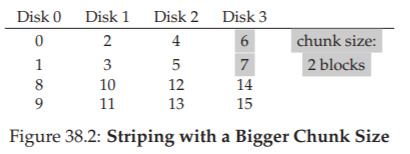

# 38 Mảng đĩa dư thừa giá rẻ (Redundant Arrays of Inexpensive Disks – RAIDs)

Khi sử dụng một ổ đĩa, đôi khi chúng ta muốn nó **nhanh hơn**; các thao tác I/O vốn chậm và có thể trở thành **nút thắt cổ chai** cho toàn bộ hệ thống. Khi sử dụng một ổ đĩa, đôi khi chúng ta muốn nó **lớn hơn**; ngày càng nhiều dữ liệu được đưa lên môi trường trực tuyến, và do đó ổ đĩa của chúng ta ngày càng đầy. Khi sử dụng một ổ đĩa, đôi khi chúng ta muốn nó **đáng tin cậy hơn**; khi một ổ đĩa bị hỏng, nếu dữ liệu của chúng ta không được sao lưu, toàn bộ dữ liệu quý giá đó sẽ mất.

> **CRUX: LÀM THẾ NÀO ĐỂ TẠO MỘT Ổ ĐĨA LỚN, NHANH VÀ ĐÁNG TIN CẬY**  
> Làm thế nào để xây dựng một hệ thống lưu trữ vừa lớn, vừa nhanh, vừa đáng tin cậy? Các kỹ thuật then chốt là gì? Những đánh đổi (trade-off) giữa các cách tiếp cận khác nhau ra sao?

Trong chương này, chúng ta giới thiệu **Redundant Array of Inexpensive Disks** – thường được biết đến với tên **RAID** [P+88], một kỹ thuật sử dụng nhiều ổ đĩa phối hợp với nhau để xây dựng một hệ thống đĩa nhanh hơn, lớn hơn và đáng tin cậy hơn. Thuật ngữ này được giới thiệu vào cuối những năm 1980 bởi một nhóm nghiên cứu tại Đại học California, Berkeley (dẫn đầu bởi các Giáo sư David Patterson và Randy Katz, cùng nghiên cứu sinh khi đó là Garth Gibson); vào thời điểm đó, nhiều nhóm nghiên cứu khác nhau cũng đồng thời đưa ra ý tưởng cơ bản về việc sử dụng nhiều ổ đĩa để xây dựng một hệ thống lưu trữ tốt hơn [BG88, K86, K88, PB86, SG86].

Về **bên ngoài**, một RAID trông giống như một ổ đĩa: một tập hợp các block có thể đọc hoặc ghi. Về **bên trong**, RAID là một cấu trúc phức tạp, bao gồm nhiều ổ đĩa, bộ nhớ (cả volatile và non-volatile), và một hoặc nhiều bộ xử lý để quản lý hệ thống. Một **hardware RAID** (RAID phần cứng) rất giống một hệ thống máy tính, nhưng được chuyên biệt hóa cho nhiệm vụ quản lý một nhóm ổ đĩa.

RAID mang lại nhiều lợi thế so với một ổ đĩa đơn:

- **Hiệu năng**: Sử dụng nhiều ổ đĩa song song có thể tăng tốc đáng kể thời gian I/O.  
- **Dung lượng**: Các tập dữ liệu lớn đòi hỏi ổ đĩa có dung lượng lớn.  
- **Độ tin cậy**: Việc phân tán dữ liệu trên nhiều ổ đĩa (mà không có kỹ thuật RAID) khiến dữ liệu dễ bị mất khi một ổ đĩa hỏng; với một số dạng **redundancy** (dư thừa), RAID có thể chịu được việc mất một ổ đĩa và vẫn tiếp tục hoạt động như không có vấn đề gì.

> **TIP: TÍNH MINH BẠCH GIÚP TRIỂN KHAI DỄ DÀNG**  
> Khi xem xét cách bổ sung chức năng mới cho một hệ thống, ta nên cân nhắc liệu chức năng đó có thể được thêm vào một cách **minh bạch** hay không, tức là không đòi hỏi thay đổi gì ở phần còn lại của hệ thống. Việc yêu cầu viết lại toàn bộ phần mềm hiện có (hoặc thay đổi phần cứng lớn) sẽ làm giảm khả năng áp dụng ý tưởng. RAID là một ví dụ hoàn hảo, và chắc chắn tính minh bạch của nó đã góp phần vào thành công; quản trị viên có thể cài đặt một mảng lưu trữ RAID dựa trên SCSI thay cho một ổ SCSI đơn, và phần còn lại của hệ thống (máy chủ, hệ điều hành, v.v.) không cần thay đổi gì để bắt đầu sử dụng. Bằng cách giải quyết vấn đề triển khai này, RAID đã thành công ngay từ ngày đầu.

Điều đáng kinh ngạc là RAID cung cấp những lợi thế này **một cách minh bạch** đối với các hệ thống sử dụng nó, tức là một RAID chỉ đơn giản xuất hiện như một ổ đĩa lớn đối với hệ thống chủ. Vẻ đẹp của tính minh bạch nằm ở chỗ: bạn chỉ cần thay thế một ổ đĩa bằng một RAID mà không phải thay đổi một dòng mã phần mềm nào; hệ điều hành và các ứng dụng khách vẫn tiếp tục hoạt động mà không cần chỉnh sửa. Theo cách này, tính minh bạch cải thiện đáng kể khả năng triển khai RAID, cho phép người dùng và quản trị viên đưa RAID vào sử dụng mà không phải lo lắng về khả năng tương thích phần mềm.

Tiếp theo, chúng ta sẽ thảo luận một số khía cạnh quan trọng của RAID. Chúng ta bắt đầu với **giao diện** (interface), **mô hình lỗi** (fault model), và sau đó bàn về cách đánh giá một thiết kế RAID theo ba tiêu chí quan trọng: **dung lượng** (capacity), **độ tin cậy** (reliability), và **hiệu năng** (performance). Cuối cùng, chúng ta sẽ đề cập đến một số vấn đề khác quan trọng đối với thiết kế và triển khai RAID.

## 38.1 Giao diện và cấu trúc bên trong của RAID (Interface And RAID Internals)

Đối với **file system** (hệ thống tệp) ở tầng trên, một **RAID** trông giống như một ổ đĩa lớn, (hy vọng là) nhanh và (hy vọng là) đáng tin cậy. Giống như một ổ đĩa đơn, nó được trình bày như một mảng tuyến tính các **block**, mỗi block có thể được đọc hoặc ghi bởi file system (hoặc các client khác).

Khi một file system gửi một yêu cầu **logical I/O** (I/O logic) tới RAID, bên trong RAID phải tính toán xem cần truy cập ổ đĩa (hoặc các ổ đĩa) nào để hoàn tất yêu cầu, và sau đó phát ra một hoặc nhiều **physical I/O** (I/O vật lý) để thực hiện. Bản chất chính xác của các I/O vật lý này phụ thuộc vào **RAID level** (cấp RAID), như chúng ta sẽ thảo luận chi tiết bên dưới. Tuy nhiên, như một ví dụ đơn giản, hãy xem xét một RAID lưu hai bản sao của mỗi block (mỗi bản trên một ổ đĩa riêng biệt); khi ghi vào một hệ thống RAID dạng **mirrored** (nhân bản), RAID sẽ phải thực hiện hai I/O vật lý cho mỗi một I/O logic được gửi tới.

Một hệ thống RAID thường được xây dựng như một thiết bị phần cứng riêng biệt, với kết nối tiêu chuẩn (ví dụ: **SCSI** hoặc **SATA**) tới máy chủ. Tuy nhiên, bên trong, RAID khá phức tạp, bao gồm một **microcontroller** (vi điều khiển) chạy **firmware** để điều khiển hoạt động của RAID, bộ nhớ **volatile** như **DRAM** để **buffer** (đệm) các block dữ liệu khi đọc và ghi, và trong một số trường hợp, bộ nhớ **non-volatile** để đệm ghi một cách an toàn, và thậm chí cả **logic chuyên dụng** để thực hiện các phép tính **parity** (chẵn lẻ – hữu ích trong một số cấp RAID, như chúng ta sẽ thấy bên dưới). Ở mức khái quát, một RAID rất giống một hệ thống máy tính chuyên dụng: nó có bộ xử lý, bộ nhớ và ổ đĩa; tuy nhiên, thay vì chạy các ứng dụng, nó chạy phần mềm chuyên biệt được thiết kế để vận hành RAID.


## 38.2 Mô hình lỗi (Fault Model)

Để hiểu RAID và so sánh các cách tiếp cận khác nhau, chúng ta cần có một **mô hình lỗi** (fault model) trong đầu. RAID được thiết kế để phát hiện và khôi phục từ một số loại lỗi ổ đĩa nhất định; do đó, việc biết chính xác những lỗi nào cần dự đoán là rất quan trọng để đưa ra một thiết kế khả thi.

Mô hình lỗi đầu tiên mà chúng ta giả định khá đơn giản, và được gọi là **fail-stop fault model** [S84]. Trong mô hình này, một ổ đĩa chỉ có thể ở một trong hai trạng thái: **working** (hoạt động) hoặc **failed** (hỏng). Với một ổ đĩa đang hoạt động, tất cả các block có thể được đọc hoặc ghi. Ngược lại, khi một ổ đĩa bị hỏng, ta giả định rằng nó bị mất hoàn toàn và vĩnh viễn.

Một khía cạnh quan trọng của mô hình fail-stop là giả định về **phát hiện lỗi**. Cụ thể, khi một ổ đĩa bị hỏng, ta giả định rằng điều này có thể được phát hiện dễ dàng. Ví dụ, trong một mảng RAID, ta giả định rằng phần cứng (hoặc phần mềm) của **RAID controller** (bộ điều khiển RAID) có thể ngay lập tức nhận biết khi một ổ đĩa bị hỏng.

Do đó, ở thời điểm này, chúng ta chưa cần lo lắng về các lỗi “im lặng” (silent failures) phức tạp hơn như **disk corruption** (hỏng dữ liệu trên đĩa). Chúng ta cũng chưa cần lo về việc một block đơn lẻ trở nên không thể truy cập trên một ổ đĩa vẫn đang hoạt động (đôi khi gọi là **latent sector error** – lỗi sector tiềm ẩn). Chúng ta sẽ xem xét các lỗi đĩa phức tạp hơn (và đáng tiếc là thực tế hơn) này ở phần sau.

## 38.3 Cách đánh giá một RAID (How To Evaluate A RAID)

Như chúng ta sẽ thấy ngay sau đây, có nhiều cách tiếp cận khác nhau để xây dựng một hệ thống RAID. Mỗi cách tiếp cận này có những đặc điểm riêng đáng để đánh giá, nhằm hiểu rõ điểm mạnh và điểm yếu của chúng.

Cụ thể, chúng ta sẽ đánh giá mỗi thiết kế RAID theo **ba trục** sau:

- **Trục thứ nhất: Dung lượng (Capacity)**  
  Giả sử có một tập hợp **N** ổ đĩa, mỗi ổ có **B** block, dung lượng hữu ích mà RAID cung cấp cho client là bao nhiêu?  
  Nếu **không có redundancy** (dữ liệu dự phòng), câu trả lời là \( N \cdot B \).  
  Ngược lại, nếu hệ thống lưu hai bản sao của mỗi block (gọi là **mirroring** – nhân bản), dung lượng hữu ích sẽ là \( (N \cdot B) / 2 \).  
  Các phương án khác (ví dụ: dựa trên **parity**) thường nằm ở khoảng giữa hai giá trị này.

- **Trục thứ hai: Độ tin cậy (Reliability)**  
  Thiết kế RAID có thể chịu được bao nhiêu lỗi ổ đĩa?  
  Theo mô hình lỗi (fault model) mà chúng ta đã giả định, ta chỉ xét trường hợp **một ổ đĩa hỏng hoàn toàn**; ở các chương sau (ví dụ: về **data integrity** – tính toàn vẹn dữ liệu), chúng ta sẽ xem xét cách xử lý các dạng lỗi phức tạp hơn.

- **Trục thứ ba: Hiệu năng (Performance)**  
  Hiệu năng khó đánh giá hơn, vì nó phụ thuộc nhiều vào **workload** (khối lượng công việc) mà mảng đĩa phải xử lý.  
  Do đó, trước khi đánh giá hiệu năng, chúng ta sẽ trình bày một tập hợp các workload điển hình cần xem xét.

Tiếp theo, chúng ta sẽ xem xét ba thiết kế RAID quan trọng:  
- **RAID Level 0** (striping – phân dải dữ liệu)  
- **RAID Level 1** (mirroring – nhân bản dữ liệu)  
- **RAID Levels 4/5** (dự phòng dựa trên parity)  

Việc đặt tên các thiết kế này theo “level” bắt nguồn từ công trình tiên phong của Patterson, Gibson và Katz tại Berkeley [P+88].


## 38.4 RAID Level 0: Striping

Cấp RAID đầu tiên thực ra **không phải** là một cấp RAID đúng nghĩa, vì nó **không có redundancy**. Tuy nhiên, **RAID Level 0**, hay còn được biết đến nhiều hơn với tên **striping** (phân dải dữ liệu), đóng vai trò như một **giới hạn trên** tuyệt vời về hiệu năng và dung lượng, và do đó rất đáng để tìm hiểu.

Hình thức striping đơn giản nhất sẽ phân bố các block trên các ổ đĩa của hệ thống như sau (giả sử ở đây là một mảng 4 ổ đĩa):

...


**Hình 38.1: RAID-0 – Striping đơn giản**

Từ **Hình 38.1**, bạn có thể thấy ý tưởng cơ bản: phân tán các block của mảng dữ liệu lên các ổ đĩa theo kiểu **round-robin** (xoay vòng). Cách tiếp cận này được thiết kế để khai thác tối đa khả năng **song song** của mảng khi có các yêu cầu truy cập tới các khối dữ liệu liên tiếp (ví dụ: một thao tác đọc tuần tự lớn).  
Chúng ta gọi các block nằm trên cùng một hàng là một **stripe**; do đó, các block 0, 1, 2 và 3 ở trên thuộc cùng một stripe.

Trong ví dụ này, chúng ta đã đơn giản hóa bằng cách giả định rằng chỉ **1 block** (mỗi block giả sử có kích thước 4KB) được đặt trên mỗi ổ đĩa trước khi chuyển sang ổ tiếp theo. Tuy nhiên, cách sắp xếp này **không bắt buộc** phải như vậy.  
Ví dụ, chúng ta có thể sắp xếp các block trên các ổ đĩa như trong **Hình 38.2**:

...



**Hình 38.2: Striping với kích thước chunk lớn hơn**

Trong ví dụ này, chúng ta đặt **hai block 4KB** trên mỗi ổ đĩa trước khi chuyển sang ổ tiếp theo. Do đó, **chunk size** (kích thước khối dữ liệu trên mỗi ổ trong một stripe) của mảng RAID này là **8KB**, và một stripe sẽ bao gồm **4 chunk**, tức **32KB dữ liệu**.


> **ASIDE: VẤN ĐỀ MAPPING TRONG RAID (THE RAID MAPPING PROBLEM)**  
> Trước khi nghiên cứu các đặc tính về dung lượng, độ tin cậy và hiệu năng của RAID, trước hết chúng ta cần nói về một vấn đề gọi là **mapping problem** (bài toán ánh xạ).  
> Vấn đề này xuất hiện trong tất cả các mảng RAID; nói đơn giản, khi có một **logical block** (block logic) cần đọc hoặc ghi, làm thế nào để RAID biết chính xác **ổ đĩa vật lý** và **offset** (vị trí) cần truy cập?  
>  
> Với các cấp RAID đơn giản, chúng ta không cần quá nhiều sự phức tạp để ánh xạ đúng các block logic sang vị trí vật lý của chúng.  
> Lấy ví dụ striping đầu tiên ở trên (**chunk size = 1 block = 4KB**). Trong trường hợp này, với một **logical block address** A, RAID có thể dễ dàng tính toán ổ đĩa và offset mong muốn bằng hai công thức đơn giản:  
>  
> ```
> Disk   = A % number_of_disks
> Offset = A / number_of_disks
> ```  
>  
> Lưu ý rằng đây đều là các phép toán số nguyên (ví dụ: 4 / 3 = 1 chứ không phải 1.33333...).  
> Hãy xem các công thức này hoạt động thế nào qua một ví dụ đơn giản:  
> Giả sử trong RAID đầu tiên ở trên, có một yêu cầu tới block 14. Với 4 ổ đĩa, điều này có nghĩa là ổ đĩa cần truy cập là (14 % 4 = 2): **disk 2**. Block chính xác được tính là (14 / 4 = 3): **block 3**.  
> Như vậy, block 14 sẽ nằm ở **block thứ tư** (block 3, tính từ 0) của **ổ đĩa thứ ba** (disk 2, tính từ 0), và đó chính xác là vị trí của nó.  
>  
> Bạn có thể suy nghĩ về cách các công thức này sẽ được điều chỉnh để hỗ trợ các **chunk size** khác nhau. Hãy thử làm! Không quá khó đâu.

### Kích thước chunk (Chunk Sizes)

**Chunk size** (kích thước khối dữ liệu trên mỗi ổ trong một stripe) chủ yếu ảnh hưởng đến **hiệu năng** của mảng đĩa.  
Ví dụ, một chunk size nhỏ có nghĩa là nhiều tệp sẽ được **striped** (phân dải) trên nhiều ổ đĩa, từ đó **tăng mức độ song song** của các thao tác đọc và ghi đối với một tệp duy nhất; tuy nhiên, **thời gian định vị** (positioning time) để truy cập các block trên nhiều ổ đĩa sẽ tăng lên, vì thời gian định vị cho toàn bộ yêu cầu được xác định bởi **giá trị lớn nhất** của thời gian định vị trong số các yêu cầu trên tất cả các ổ.

Ngược lại, một chunk size lớn sẽ **giảm mức độ song song trong nội bộ tệp** (intra-file parallelism), và do đó phụ thuộc vào nhiều yêu cầu đồng thời để đạt được **throughput** (băng thông) cao. Tuy nhiên, chunk size lớn lại **giảm thời gian định vị**; ví dụ, nếu một tệp vừa khít trong một chunk và do đó được đặt trên một ổ đĩa duy nhất, thời gian định vị khi truy cập nó sẽ chỉ là thời gian định vị của một ổ đĩa.

Vì vậy, việc xác định **chunk size “tối ưu”** là rất khó, vì nó đòi hỏi phải có nhiều kiến thức về **workload** (khối lượng công việc) mà hệ thống đĩa phải xử lý [CL95]. Trong phần còn lại của thảo luận này, chúng ta sẽ giả định rằng mảng đĩa sử dụng chunk size bằng **một block** (4KB). Hầu hết các mảng đĩa thực tế sử dụng chunk size lớn hơn (ví dụ: 64KB), nhưng đối với các vấn đề chúng ta bàn dưới đây, chunk size chính xác không quan trọng; do đó, chúng ta dùng một block để đơn giản hóa.


### Quay lại phân tích RAID-0 (Back To RAID-0 Analysis)

Bây giờ, hãy đánh giá **dung lượng**, **độ tin cậy** và **hiệu năng** của striping.

- **Dung lượng**: Hoàn hảo – với N ổ đĩa, mỗi ổ có dung lượng B block, striping cung cấp \( N \cdot B \) block dung lượng hữu ích.
- **Độ tin cậy**: Cũng “hoàn hảo” nhưng theo nghĩa xấu – bất kỳ lỗi hỏng ổ đĩa nào cũng sẽ dẫn đến mất dữ liệu.
- **Hiệu năng**: Xuất sắc – tất cả các ổ đĩa đều được sử dụng, thường là song song, để phục vụ các yêu cầu I/O của người dùng.


### Đánh giá hiệu năng RAID (Evaluating RAID Performance)

Khi phân tích hiệu năng RAID, ta có thể xem xét **hai chỉ số hiệu năng** khác nhau:

1. **Single-request latency** (độ trễ của một yêu cầu đơn lẻ): Hiểu được độ trễ của một yêu cầu I/O đơn tới RAID giúp ta biết được mức độ song song có thể đạt được trong một thao tác I/O logic duy nhất.
2. **Steady-state throughput** (băng thông trạng thái ổn định) của RAID: tức tổng băng thông khi có nhiều yêu cầu đồng thời. Vì RAID thường được sử dụng trong các môi trường hiệu năng cao, băng thông trạng thái ổn định là yếu tố **then chốt**, và sẽ là trọng tâm chính trong các phân tích của chúng ta.

Để hiểu rõ hơn về throughput, chúng ta cần đưa ra một số **workload** tiêu biểu. Trong phần này, chúng ta giả định có hai loại workload:

- **Sequential workload** (tải tuần tự): Các yêu cầu tới mảng đĩa đến dưới dạng các khối dữ liệu liên tiếp lớn.  
  Ví dụ: một yêu cầu (hoặc chuỗi yêu cầu) truy cập 1 MB dữ liệu, bắt đầu tại block x và kết thúc tại block (x + 1 MB), sẽ được coi là tuần tự.  
  Workload tuần tự rất phổ biến trong nhiều môi trường (hãy nghĩ đến việc tìm kiếm một từ khóa trong một tệp lớn), và do đó được coi là quan trọng.

- **Random workload** (tải ngẫu nhiên): Mỗi yêu cầu tương đối nhỏ, và mỗi yêu cầu tới một vị trí ngẫu nhiên khác nhau trên đĩa.  
  Ví dụ: một luồng yêu cầu ngẫu nhiên có thể truy cập 4KB tại địa chỉ logic 10, sau đó tại địa chỉ 550.000, rồi tại 20.100, v.v.  
  Một số workload quan trọng, chẳng hạn như **transactional workload** (tải giao dịch) trên **database management system** (DBMS – hệ quản trị cơ sở dữ liệu), thể hiện kiểu truy cập này, và do đó cũng được coi là quan trọng.

Tất nhiên, **workload** (khối lượng công việc) thực tế không đơn giản như vậy, và thường bao gồm sự pha trộn giữa các thành phần **sequential** (tuần tự) và **random-seeming** (có vẻ ngẫu nhiên), cũng như các hành vi nằm ở khoảng giữa hai loại này. Để đơn giản, chúng ta chỉ xét hai khả năng này.

Như bạn có thể thấy, **sequential workload** và **random workload** sẽ tạo ra các đặc tính hiệu năng rất khác nhau đối với một ổ đĩa.  
- Với **sequential access** (truy cập tuần tự), ổ đĩa hoạt động ở chế độ hiệu quả nhất, dành ít thời gian cho **seek** (tìm kiếm) và chờ quay (**rotational delay**), và phần lớn thời gian để truyền dữ liệu (**transfer**).  
- Với **random access** (truy cập ngẫu nhiên), điều ngược lại xảy ra: phần lớn thời gian dành cho seek và chờ quay, và chỉ một phần nhỏ thời gian để truyền dữ liệu.

Để phản ánh sự khác biệt này trong phân tích, chúng ta giả định rằng một ổ đĩa có thể truyền dữ liệu với tốc độ **S MB/s** khi xử lý sequential workload, và **R MB/s** khi xử lý random workload. Nói chung, **S** lớn hơn rất nhiều so với **R** (tức là \( S \gg R \)).


Để đảm bảo chúng ta hiểu rõ sự khác biệt này, hãy làm một bài tập đơn giản. Cụ thể, hãy tính **S** và **R** dựa trên các đặc tính ổ đĩa sau. Giả sử:

- Kích thước truyền dữ liệu trung bình trong sequential transfer: **10 MB**  
- Kích thước truyền dữ liệu trung bình trong random transfer: **10 KB**  
- Đặc tính ổ đĩa:  
  * Thời gian seek trung bình: **7 ms**  
  * Độ trễ quay trung bình: **3 ms**  
  * Tốc độ truyền dữ liệu: **50 MB/s**


**Tính S**:  
Trước tiên, ta xác định thời gian tiêu tốn cho một lần truyền 10 MB.  
- Seek: 7 ms  
- Quay: 3 ms  
- Truyền dữ liệu: \( 10 \text{ MB} @ 50 \text{ MB/s} \) → \( \frac{1}{5} \) giây = **200 ms**  

Tổng thời gian: \( 7 + 3 + 200 = 210 \) ms.

Công thức:

[
S = \frac{\text{Amount of Data}}{\text{Time to access}} = \frac{10 \ \text{MB}}{210 \ \text{ms}} = 47.62 \ \text{MB/s}
\]

Như ta thấy, do thời gian truyền dữ liệu lớn, **S** gần bằng băng thông cực đại của ổ đĩa (chi phí seek và quay đã được **amortized** – phân bổ).


**Tính R**:  
Seek và quay giữ nguyên như trên. Thời gian truyền dữ liệu: \( 10 \ \text{KB} @ 50 \ \text{MB/s} \) → **0.195 ms**.

Công thức:

[
R = \frac{\text{Amount of Data}}{\text{Time to access}} = \frac{10 \ \text{KB}}{10.195 \ \text{ms}} = 0.981 \ \text{MB/s}
\]

Như vậy, **R** nhỏ hơn 1 MB/s, và tỉ lệ \( S / R \) gần **50**.


### Quay lại phân tích RAID-0

Bây giờ, hãy đánh giá hiệu năng của **striping**. Như đã nói ở trên, hiệu năng nói chung là tốt.

- **Về độ trễ**: Độ trễ của một yêu cầu đọc/ghi một block sẽ gần như giống hệt với độ trễ của một ổ đĩa đơn; bởi vì RAID-0 chỉ đơn giản chuyển tiếp yêu cầu đó tới một trong các ổ đĩa của nó.
- **Về băng thông tuần tự trạng thái ổn định**: Ta kỳ vọng đạt được toàn bộ băng thông của hệ thống, tức là \( \text{Throughput} = N \times S \) (N là số ổ đĩa, S là băng thông tuần tự của một ổ).  
- **Với nhiều I/O ngẫu nhiên**: Ta cũng có thể sử dụng tất cả các ổ đĩa, do đó đạt \( N \times R \) MB/s.

Như chúng ta sẽ thấy ở phần sau, các giá trị này vừa dễ tính toán, vừa đóng vai trò là **giới hạn trên** khi so sánh với các cấp RAID khác.


## 38.5 RAID Level 1: Mirroring

Cấp RAID đầu tiên vượt ra ngoài striping được gọi là **RAID Level 1**, hay **mirroring** (nhân bản dữ liệu). Với một hệ thống mirrored, chúng ta đơn giản tạo **nhiều hơn một bản sao** của mỗi block trong hệ thống; tất nhiên, mỗi bản sao phải được đặt trên một ổ đĩa riêng biệt. Bằng cách này, hệ thống có thể **chịu được lỗi hỏng ổ đĩa**.

...


**Hình 38.3: RAID-1 đơn giản – Mirroring**

Trong một hệ thống **mirrored** (nhân bản) điển hình, chúng ta giả định rằng với mỗi **logical block** (block logic), RAID sẽ lưu giữ **hai bản sao vật lý** của nó. Ví dụ: trong minh họa, **disk 0** và **disk 1** có nội dung giống hệt nhau, và **disk 2** và **disk 3** cũng vậy; dữ liệu được **striped** (phân dải) trên các cặp mirror này.  
Thực tế, bạn có thể nhận thấy rằng có nhiều cách khác nhau để bố trí các bản sao block trên các ổ đĩa. Cách bố trí ở trên là một cách phổ biến và đôi khi được gọi là **RAID-10** (hoặc **RAID 1+0**, stripe of mirrors) vì nó sử dụng các cặp mirror (RAID-1) và sau đó **striping** (RAID-0) trên các cặp này; một cách bố trí phổ biến khác là **RAID-01** (hoặc **RAID 0+1**, mirror of stripes), bao gồm hai mảng striping (RAID-0) lớn, sau đó được mirror (RAID-1) ở tầng trên.  
Trong phạm vi này, chúng ta sẽ chỉ nói về mirroring với giả định bố trí như ở trên.

Khi đọc một block từ một mảng mirrored, RAID có quyền lựa chọn: nó có thể đọc từ **bất kỳ bản sao nào**. Ví dụ, nếu RAID nhận yêu cầu đọc **logical block 5**, nó có thể đọc từ **disk 2** hoặc **disk 3**.  
Tuy nhiên, khi ghi một block, không có sự lựa chọn như vậy: RAID **phải** cập nhật cả hai bản sao dữ liệu để đảm bảo độ tin cậy. Lưu ý rằng các thao tác ghi này có thể diễn ra **song song**; ví dụ, một thao tác ghi vào logical block 5 có thể được thực hiện đồng thời trên **disk 2** và **disk 3**.


### Phân tích RAID-1 (RAID-1 Analysis)

- **Về dung lượng (Capacity)**: RAID-1 **tốn kém**; với mức mirroring = 2, chúng ta chỉ thu được **một nửa** dung lượng hữu ích tối đa. Với **N** ổ đĩa, mỗi ổ có **B** block, dung lượng hữu ích của RAID-1 là \((N \cdot B) / 2\).

- **Về độ tin cậy (Reliability)**: RAID-1 hoạt động tốt. Nó có thể chịu được lỗi hỏng của **bất kỳ một ổ đĩa** nào.  
  Bạn cũng có thể nhận thấy RAID-1 thậm chí có thể làm tốt hơn thế, nếu may mắn.  
  Ví dụ, trong hình minh họa ở trên, nếu **disk 0** và **disk 2** cùng hỏng, sẽ **không có mất mát dữ liệu**!  
  Nói chung hơn, một hệ thống mirrored (với mức mirroring = 2) chắc chắn chịu được **1 lỗi ổ đĩa**, và có thể chịu tới **N/2 lỗi** tùy thuộc vào ổ nào bị hỏng.  
  Tuy nhiên, trong thực tế, chúng ta thường không muốn phụ thuộc vào may mắn; do đó, hầu hết mọi người coi mirroring là giải pháp tốt để xử lý **một lỗi ổ đĩa**.

- **Về hiệu năng (Performance)**:  
  + **Đọc (Read)**: Xét về độ trễ của một yêu cầu đọc đơn, thời gian gần như **tương đương** với một ổ đĩa đơn; RAID-1 chỉ đơn giản là chuyển yêu cầu đọc tới một trong các bản sao.  
  + **Ghi (Write)**: Khác một chút – cần **hai thao tác ghi vật lý** để hoàn tất. Hai thao tác này diễn ra song song, nên thời gian sẽ xấp xỉ thời gian của một thao tác ghi đơn; tuy nhiên, vì thao tác ghi logic phải **chờ cả hai ghi vật lý hoàn tất**, nó sẽ chịu **thời gian seek và độ trễ quay tệ nhất** trong hai yêu cầu, và do đó (trung bình) sẽ **hơi cao hơn** so với ghi trên một ổ đĩa đơn.

> **ASIDE: VẤN ĐỀ CẬP NHẬT NHẤT QUÁN TRONG RAID (THE RAID CONSISTENT-UPDATE PROBLEM)**  
>  
> Trước khi phân tích RAID-1, hãy cùng thảo luận về một vấn đề có thể xảy ra trong bất kỳ hệ thống RAID nhiều ổ đĩa nào, được gọi là **consistent-update problem** (vấn đề cập nhật nhất quán) [DAA05]. Vấn đề này xảy ra khi một thao tác ghi (write) tới RAID phải cập nhật **nhiều ổ đĩa** trong một thao tác logic duy nhất. Trong trường hợp này, giả sử chúng ta đang xét một mảng đĩa **mirrored** (nhân bản).  
>  
> Hãy tưởng tượng một thao tác ghi được gửi tới RAID, và RAID quyết định rằng dữ liệu phải được ghi lên **hai ổ đĩa**, disk 0 và disk 1. RAID sau đó gửi lệnh ghi tới disk 0, nhưng ngay trước khi RAID có thể gửi yêu cầu tới disk 1, một sự cố mất điện (hoặc **system crash** – sập hệ thống) xảy ra. Trong tình huống không may này, giả sử yêu cầu tới disk 0 đã hoàn tất (nhưng rõ ràng yêu cầu tới disk 1 chưa được thực hiện, vì nó chưa bao giờ được gửi).  
>  
> Kết quả của sự cố mất điện này là **hai bản sao của block trở nên không nhất quán**; bản trên disk 0 là phiên bản mới, còn bản trên disk 1 là phiên bản cũ. Điều chúng ta mong muốn là trạng thái của cả hai ổ đĩa phải thay đổi **một cách nguyên tử** (atomically), tức là hoặc cả hai đều trở thành phiên bản mới, hoặc cả hai đều giữ nguyên phiên bản cũ.  
>  
> Cách tổng quát để giải quyết vấn đề này là sử dụng một dạng **write-ahead log** (ghi nhật ký trước khi ghi dữ liệu) để trước tiên ghi lại những gì RAID sắp thực hiện (ví dụ: cập nhật hai ổ đĩa với một dữ liệu nhất định) trước khi thực sự thực hiện. Bằng cách này, chúng ta có thể đảm bảo rằng khi xảy ra sự cố, hệ thống vẫn xử lý đúng; bằng cách chạy một **quy trình khôi phục** (recovery procedure) để phát lại tất cả các giao dịch đang chờ trên RAID, chúng ta có thể đảm bảo rằng không có hai bản sao mirrored (trong trường hợp RAID-1) nào bị lệch dữ liệu.  
>  
> Một lưu ý cuối: vì việc ghi log xuống đĩa cho **mỗi lần ghi** là cực kỳ tốn kém, hầu hết phần cứng RAID đều bao gồm một lượng nhỏ **non-volatile RAM** (RAM không mất dữ liệu khi mất điện, ví dụ: RAM có pin dự phòng) để thực hiện loại ghi log này. Nhờ đó, việc cập nhật nhất quán được đảm bảo mà không phải chịu chi phí cao của việc ghi log xuống đĩa.


Để phân tích **steady-state throughput** (băng thông trạng thái ổn định), hãy bắt đầu với **sequential workload** (tải tuần tự). Khi ghi tuần tự xuống đĩa, mỗi thao tác ghi logic phải dẫn đến **hai thao tác ghi vật lý**; ví dụ, khi ghi **logical block 0** (trong hình minh họa ở trên), RAID sẽ ghi block này lên cả **disk 0** và **disk 1**. Do đó, ta có thể kết luận rằng **băng thông tối đa** đạt được khi ghi tuần tự vào một mảng mirrored là:

[
\frac{N}{2} \cdot S
\]

tức **một nửa** băng thông cực đại.


Đáng tiếc là chúng ta cũng thu được **hiệu năng tương tự** khi đọc tuần tự. Có thể bạn nghĩ rằng đọc tuần tự sẽ tốt hơn, vì chỉ cần đọc **một bản sao** dữ liệu, không phải cả hai. Tuy nhiên, hãy xét ví dụ sau để thấy tại sao điều này không giúp ích nhiều:

Giả sử chúng ta cần đọc các block 0, 1, 2, 3, 4, 5, 6 và 7.  
- Ta gửi yêu cầu đọc block 0 tới **disk 0**, block 1 tới **disk 2**, block 2 tới **disk 1**, và block 3 tới **disk 3**.  
- Tiếp tục, ta gửi yêu cầu đọc block 4, 5, 6, 7 tới **disk 0**, **disk 2**, **disk 1**, và **disk 3** tương ứng.

Có thể bạn nghĩ rằng vì đang sử dụng tất cả các ổ đĩa, ta sẽ đạt được **toàn bộ băng thông** của mảng. Nhưng thực tế không hẳn vậy.

Hãy xem các yêu cầu mà **một ổ đĩa** nhận được (ví dụ: disk 0):  
- Đầu tiên, nó nhận yêu cầu cho block 0.  
- Sau đó, nó nhận yêu cầu cho block 4 (**bỏ qua block 2**).  

Thực tế, mỗi ổ đĩa nhận yêu cầu cho **mỗi block cách nhau một block**. Khi đầu đọc quay qua block bị bỏ qua, nó **không cung cấp băng thông hữu ích** cho client. Do đó, mỗi ổ đĩa chỉ cung cấp **một nửa** băng thông cực đại của nó. Vì vậy, **đọc tuần tự** chỉ đạt được băng thông:

[
\frac{N}{2} \cdot S \ \text{MB/s}
\]


**Random reads** (đọc ngẫu nhiên) là **trường hợp tốt nhất** cho RAID mirrored. Trong trường hợp này, chúng ta có thể phân phối các yêu cầu đọc trên **tất cả các ổ đĩa**, và do đó đạt được **toàn bộ băng thông khả dụng**. Vì vậy, với random reads, RAID-1 đạt:

[
N \cdot R \ \text{MB/s}
\]


Cuối cùng, **random writes** (ghi ngẫu nhiên) hoạt động đúng như bạn mong đợi:

[
\frac{N}{2} \cdot R \ \text{MB/s}
\]

Mỗi thao tác ghi logic phải biến thành **hai thao tác ghi vật lý**, và do đó mặc dù tất cả các ổ đĩa đều được sử dụng, client chỉ nhận thấy **một nửa băng thông khả dụng**.  
Ngay cả khi một thao tác ghi vào **logical block x** biến thành **hai thao tác ghi song song** tới hai ổ đĩa vật lý khác nhau, băng thông của nhiều yêu cầu nhỏ chỉ đạt **một nửa** so với striping.  
Như chúng ta sẽ thấy ngay sau đây, đạt được **một nửa băng thông khả dụng** thực ra đã là **khá tốt**!

## 38.6 RAID Level 4: Tiết kiệm dung lượng với Parity (Saving Space With Parity)

Chúng ta sẽ giới thiệu một phương pháp khác để bổ sung **redundancy** (dữ liệu dự phòng) cho một mảng đĩa, được gọi là **parity** (bit chẵn lẻ). Các phương pháp dựa trên parity cố gắng sử dụng ít dung lượng hơn, từ đó khắc phục nhược điểm lớn về dung lượng mà các hệ thống **mirrored** (nhân bản) phải trả. Tuy nhiên, chúng phải đánh đổi một yếu tố: **hiệu năng**.


**Hình 38.4: RAID-4 với Parity (RAID-4 With Parity)**

Dưới đây là ví dụ về một hệ thống RAID-4 gồm 5 ổ đĩa (**Hình 38.4**). Với mỗi **stripe** (dải dữ liệu), chúng ta thêm một **parity block** (block chẵn lẻ) lưu trữ thông tin dự phòng cho stripe đó.  
Ví dụ: parity block **P1** chứa thông tin dự phòng được tính toán từ các block 4, 5, 6 và 7.

Để tính toán parity, chúng ta cần sử dụng một hàm toán học cho phép chịu được việc mất bất kỳ một block nào trong stripe. Hóa ra, hàm đơn giản **XOR** (phép loại trừ logic) thực hiện điều này khá tốt.  
Với một tập hợp các bit, XOR của tất cả các bit đó trả về **0** nếu có **số lượng bit 1 chẵn**, và trả về **1** nếu có **số lượng bit 1 lẻ**.  
Ví dụ:

...

Trong hàng đầu tiên (0, 0, 1, 1), có hai bit 1 (C2, C3), do đó XOR của tất cả các giá trị này sẽ là 0 (P); tương tự, trong hàng thứ hai chỉ có một bit 1 (C1), nên XOR phải là 1 (P).  
Bạn có thể ghi nhớ điều này một cách đơn giản: **tổng số bit 1 trong bất kỳ hàng nào, bao gồm cả bit parity, phải là một số chẵn**; đây là **bất biến** (invariant) mà RAID phải duy trì để đảm bảo parity là chính xác.


Từ ví dụ trên, bạn cũng có thể đoán được cách thông tin parity được sử dụng để **khôi phục dữ liệu khi xảy ra lỗi**.  
Giả sử cột có nhãn **C2** bị mất. Để xác định giá trị ban đầu của cột này, chúng ta chỉ cần đọc tất cả các giá trị khác trong hàng đó (bao gồm cả bit parity đã được XOR) và tái tạo lại giá trị đúng.  
Cụ thể, giả sử giá trị ở hàng đầu tiên, cột C2 bị mất (giá trị ban đầu là 1); bằng cách đọc các giá trị khác trong hàng đó (0 từ C0, 0 từ C1, 1 từ C3 và 0 từ cột parity P), ta thu được các giá trị 0, 0, 1 và 0.  
Vì chúng ta biết rằng XOR luôn đảm bảo số lượng bit 1 trong mỗi hàng là **chẵn**, nên giá trị bị thiếu phải là **1**.  
Đó chính là cách **reconstruction** (tái tạo dữ liệu) hoạt động trong một hệ thống parity dựa trên XOR!  
Lưu ý rằng cách tính giá trị tái tạo cũng giống hệt cách chúng ta tính parity ban đầu: chỉ cần XOR các bit dữ liệu và bit parity lại với nhau.


Có thể bạn đang thắc mắc: chúng ta đang nói về việc XOR tất cả các bit, nhưng ở trên ta biết rằng RAID lưu các block 4KB (hoặc lớn hơn) trên mỗi ổ đĩa; vậy làm thế nào để áp dụng XOR cho nhiều block để tính parity?  
Thực ra, điều này cũng khá đơn giản: chỉ cần thực hiện **bitwise XOR** (XOR theo từng bit) trên từng bit của các block dữ liệu; đặt kết quả của mỗi phép XOR bitwise vào vị trí bit tương ứng trong parity block.  
Ví dụ, nếu chúng ta có các block kích thước 4 bit (vâng, điều này nhỏ hơn rất nhiều so với block 4KB, nhưng bạn sẽ hiểu ý tưởng), chúng có thể trông như sau:

...

Như bạn thấy từ hình minh họa, parity được tính cho từng bit của mỗi block và kết quả được đặt vào parity block.


### Phân tích RAID-4 (RAID-4 Analysis)

- **Về dung lượng (Capacity)**: RAID-4 sử dụng **1 ổ đĩa** để lưu thông tin parity cho mỗi nhóm ổ đĩa mà nó bảo vệ. Do đó, dung lượng hữu ích của một nhóm RAID là:

[
(N - 1) \cdot B
\]

- **Về độ tin cậy (Reliability)**: RAID-4 có thể chịu được **1 lỗi ổ đĩa** và không hơn. Nếu mất nhiều hơn một ổ đĩa, sẽ **không có cách nào** để tái tạo dữ liệu đã mất.


**Hình 38.5: Ghi full-stripe trong RAID-4 (Full-stripe Writes In RAID-4)**

Cuối cùng, chúng ta xét đến **hiệu năng**. Lần này, hãy bắt đầu bằng việc phân tích **steady-state throughput** (băng thông trạng thái ổn định).  
Hiệu năng đọc tuần tự (**sequential read**) có thể tận dụng tất cả các ổ đĩa **ngoại trừ** ổ đĩa parity, và do đó đạt **băng thông hiệu dụng cực đại** là:

[
(N - 1) \cdot S \ \text{MB/s}
\]

(đây là trường hợp dễ tính).


Để hiểu hiệu năng của **ghi tuần tự** (**sequential write**), trước tiên chúng ta cần hiểu cách nó được thực hiện.  
Khi ghi một khối dữ liệu lớn xuống đĩa, RAID-4 có thể thực hiện một tối ưu hóa đơn giản được gọi là **full-stripe write**.  
Ví dụ, giả sử các block 0, 1, 2 và 3 được gửi tới RAID như một phần của một yêu cầu ghi (**Hình 38.5**).

Trong trường hợp này, RAID chỉ cần tính toán giá trị mới của **P0** (bằng cách thực hiện phép **XOR** trên các block 0, 1, 2 và 3), sau đó ghi **tất cả các block** (bao gồm cả block parity) lên 5 ổ đĩa ở trên **song song** (được tô xám trong hình).  
Do đó, **full-stripe write** là cách hiệu quả nhất để RAID-4 ghi dữ liệu xuống đĩa.

Khi đã hiểu full-stripe write, việc tính toán hiệu năng ghi tuần tự của RAID-4 trở nên đơn giản; **băng thông hiệu dụng** cũng là:

[
(N - 1) \cdot S \ \text{MB/s}
\]

Mặc dù ổ đĩa parity luôn được sử dụng trong quá trình này, client **không nhận được lợi ích hiệu năng** từ nó.


Bây giờ, hãy phân tích hiệu năng của **đọc ngẫu nhiên** (**random read**).  
Như bạn có thể thấy từ hình minh họa ở trên, một tập hợp các yêu cầu đọc ngẫu nhiên kích thước 1 block sẽ được phân bổ trên các ổ đĩa dữ liệu của hệ thống, nhưng **không** trên ổ đĩa parity.  
Do đó, hiệu năng hiệu dụng là:

[
(N - 1) \cdot R \ \text{MB/s}
\]


**Ghi ngẫu nhiên** (**random write**) – phần chúng ta để lại cuối cùng – là trường hợp thú vị nhất đối với RAID-4.  
Giả sử chúng ta muốn ghi đè block 1 trong ví dụ ở trên.  
Chúng ta có thể ghi đè trực tiếp, nhưng điều đó sẽ gây ra một vấn đề: block parity **P0** sẽ **không còn phản ánh chính xác** giá trị parity của stripe; trong ví dụ này, **P0** cũng phải được cập nhật.  
Vậy làm thế nào để cập nhật nó **đúng** và **hiệu quả**?


Hóa ra có **hai phương pháp**:

1. **Additive parity**:  
   - Để tính giá trị mới của parity block, đọc **tất cả các block dữ liệu khác** trong stripe **song song** (trong ví dụ: block 0, 2 và 3) và XOR chúng với block mới (block 1).  
   - Kết quả là parity block mới.  
   - Sau đó, ghi dữ liệu mới và parity mới xuống các ổ đĩa tương ứng, cũng song song.  
   - Vấn đề của kỹ thuật này là nó **tỷ lệ thuận với số lượng ổ đĩa**; trong các RAID lớn, nó yêu cầu **nhiều thao tác đọc** để tính toán parity.

2. **Subtractive parity**:  
   - Ví dụ, giả sử chúng ta có chuỗi bit (4 bit dữ liệu, 1 bit parity):  
     ...  
   - Giả sử chúng ta muốn ghi đè bit **C2** bằng giá trị mới **C2new**.  
   - Phương pháp subtractive hoạt động qua **3 bước**:  
     1. Đọc dữ liệu cũ tại C2 (**C2old = 1**) và parity cũ (**Pold = 0**).  
     2. So sánh dữ liệu cũ và dữ liệu mới:  
        - Nếu chúng **giống nhau** (ví dụ: C2new = C2old), parity bit sẽ **không thay đổi** (Pnew = Pold).  
        - Nếu chúng **khác nhau**, ta phải **đảo bit parity** sang trạng thái ngược lại:  
          - Nếu Pold = 1 → Pnew = 0  
          - Nếu Pold = 0 → Pnew = 1  
     3. Công thức gọn gàng bằng XOR (⊕ là toán tử XOR):

[
P_{new} = (C_{old} \oplus C_{new}) \oplus P_{old} \tag{38.1}
\]

Vì chúng ta đang xử lý **block** chứ không phải bit, phép tính này được thực hiện trên **tất cả các bit** trong block (ví dụ: 4096 byte mỗi block × 8 bit/byte).  
Do đó, trong hầu hết các trường hợp, block mới sẽ khác block cũ, và parity block mới cũng sẽ khác.


Bạn bây giờ có thể suy luận khi nào nên dùng **additive parity** và khi nào nên dùng **subtractive parity**.  
Hãy nghĩ về số lượng ổ đĩa trong hệ thống để phương pháp additive thực hiện **ít I/O hơn** so với subtractive; đâu là **điểm giao nhau** (cross-over point)?


Trong phân tích hiệu năng này, giả sử chúng ta sử dụng **subtractive method**.  
Như vậy, với mỗi thao tác ghi, RAID phải thực hiện **4 I/O vật lý** (2 lần đọc và 2 lần ghi).  
Bây giờ, giả sử có rất nhiều yêu cầu ghi được gửi tới RAID; câu hỏi là: **RAID-4 có thể thực hiện bao nhiêu thao tác song song?**  
Để hiểu điều này, hãy cùng xem lại **bố trí RAID-4** (**Hình 38.6**).


**Hình 38.6: Ví dụ – Ghi vào block 4, 13 và các block parity tương ứng**

Giờ hãy tưởng tượng có **2 thao tác ghi nhỏ** được gửi tới RAID-4 gần như cùng lúc, tới các block 4 và 13 (được đánh dấu ∗ trong sơ đồ).  
Dữ liệu của các block này nằm trên **disk 0** và **disk 1**, do đó thao tác đọc và ghi dữ liệu có thể diễn ra **song song** – đây là điểm tốt.  
Vấn đề phát sinh ở **ổ đĩa parity**: cả hai yêu cầu đều phải đọc các block parity liên quan tới block 4 và 13, tức **parity block 1** và **parity block 3** (được đánh dấu +).  

Hy vọng giờ vấn đề đã rõ: **ổ đĩa parity trở thành nút thắt cổ chai** trong kiểu tải công việc này; đôi khi chúng ta gọi đây là **small-write problem** (vấn đề ghi nhỏ) đối với các RAID dựa trên parity.  
Vì vậy, mặc dù các ổ dữ liệu có thể được truy cập song song, ổ parity lại **ngăn cản** việc hiện thực hóa song song; tất cả các thao tác ghi vào hệ thống sẽ bị **tuần tự hóa** do ổ parity.  

Vì ổ parity phải thực hiện **hai I/O** (một đọc, một ghi) cho mỗi I/O logic, ta có thể tính hiệu năng của các thao tác ghi ngẫu nhiên nhỏ trong RAID-4 bằng cách tính hiệu năng của ổ parity trên hai I/O này, và kết quả đạt được là:

[
\frac{R}{2} \ \text{MB/s}
\]

Thông lượng (throughput) của RAID-4 đối với ghi ngẫu nhiên nhỏ là **rất tệ**; nó **không cải thiện** ngay cả khi bạn thêm nhiều ổ đĩa vào hệ thống.


Chúng ta kết thúc phần này bằng việc phân tích **độ trễ I/O** trong RAID-4.  
Như bạn đã biết, một thao tác đọc đơn (giả sử không có lỗi) chỉ được ánh xạ tới **một ổ đĩa duy nhất**, do đó độ trễ của nó tương đương với độ trễ của một yêu cầu trên ổ đĩa đơn.  
Độ trễ của một thao tác ghi đơn yêu cầu **hai lần đọc** và sau đó **hai lần ghi**; các thao tác đọc có thể diễn ra song song, cũng như các thao tác ghi, do đó tổng độ trễ vào khoảng **gấp đôi** so với một ổ đĩa đơn (có một số khác biệt vì ta phải chờ cả hai lần đọc hoàn tất và do đó chịu **thời gian định vị tệ nhất**, nhưng sau đó các thao tác cập nhật không phải chịu chi phí seek nên có thể tốt hơn mức trung bình).


## 38.7 RAID Level 5: Rotating Parity

Để giải quyết **small-write problem** (ít nhất là một phần), Patterson, Gibson và Katz đã giới thiệu **RAID-5**.  
RAID-5 hoạt động gần như giống hệt RAID-4, ngoại trừ việc **xoay vòng (rotate)** block parity qua các ổ đĩa (**Hình 38.7**).


**Hình 38.7: RAID-5 với parity xoay vòng (RAID-5 With Rotated Parity)**

Như bạn thấy, block parity cho mỗi stripe giờ được **xoay vòng** qua các ổ đĩa, nhằm loại bỏ nút thắt cổ chai của ổ parity trong RAID-4.


### Phân tích RAID-5 (RAID-5 Analysis)

Phần lớn phân tích cho RAID-5 **giống hệt** RAID-4.  
Ví dụ: **dung lượng hữu dụng** và **khả năng chịu lỗi** của hai cấp này là như nhau.  
Hiệu năng đọc và ghi tuần tự cũng tương tự.  
Độ trễ của một yêu cầu đơn (dù là đọc hay ghi) cũng giống RAID-4.

Hiệu năng đọc ngẫu nhiên (**random read**) tốt hơn một chút, vì giờ đây chúng ta có thể tận dụng **tất cả các ổ đĩa**.  
Cuối cùng, hiệu năng ghi ngẫu nhiên (**random write**) cải thiện đáng kể so với RAID-4, vì nó cho phép **song song hóa** giữa các yêu cầu.  
Ví dụ: một thao tác ghi vào block 1 và một thao tác ghi vào block 10 sẽ biến thành:  
- Yêu cầu tới **disk 1** và **disk 4** (cho block 1 và parity của nó)  
- Yêu cầu tới **disk 0** và **disk 2** (cho block 10 và parity của nó)  

Do đó, chúng có thể tiến hành song song.  
Trên thực tế, ta có thể giả định rằng với một số lượng lớn yêu cầu ngẫu nhiên, chúng ta sẽ có thể giữ cho tất cả các ổ đĩa **bận rộn tương đối đồng đều**.  
Nếu đúng như vậy, **tổng băng thông** cho ghi nhỏ sẽ là:

[
\frac{N}{4} \cdot R \ \text{MB/s}
\]

Hệ số mất 4 lần này là do mỗi thao tác ghi RAID-5 vẫn tạo ra **4 I/O** tổng cộng – đây đơn giản là **cái giá phải trả** khi sử dụng RAID dựa trên parity.

Vì RAID-5 về cơ bản giống RAID-4 ngoại trừ một số trường hợp tốt hơn, nó đã gần như **hoàn toàn thay thế** RAID-4 trên thị trường.  
Ngoại lệ duy nhất là trong các hệ thống **chỉ thực hiện ghi lớn** (large write), do đó tránh được hoàn toàn small-write problem [HLM94]; trong các trường hợp đó, RAID-4 đôi khi vẫn được sử dụng vì **dễ xây dựng hơn một chút**.


## 38.8 So sánh RAID: Tóm tắt (RAID Comparison: A Summary)

Chúng ta sẽ tóm tắt **so sánh đơn giản hóa** các cấp RAID trong **Hình 38.8**.  
Lưu ý rằng chúng ta đã **bỏ qua một số chi tiết** để đơn giản hóa phân tích.  
Ví dụ: khi ghi trong một hệ thống mirrored, **thời gian seek trung bình** sẽ cao hơn một chút so với khi ghi vào một ổ đĩa đơn, vì thời gian seek là **giá trị lớn nhất** của hai lần seek (một trên mỗi ổ).  
Do đó, hiệu năng ghi ngẫu nhiên tới hai ổ đĩa thường sẽ **thấp hơn một chút** so với hiệu năng ghi ngẫu nhiên của một ổ đơn.  

Ngoài ra, khi cập nhật ổ parity trong RAID-4/5:  
- Lần đọc đầu tiên của parity cũ có thể gây ra **seek và quay toàn phần**  
- Nhưng lần ghi thứ hai của parity chỉ gây ra **quay**  

Cuối cùng, **I/O tuần tự** tới RAID mirrored chịu **mức phạt hiệu năng gấp đôi (2×)** so với các phương pháp khác[^1].


**Hình 38.8: Dung lượng, độ tin cậy và hiệu năng của RAID (RAID Capacity, Reliability, and Performance)**

Tuy nhiên, so sánh trong **Hình 38.8** đã nêu bật được những khác biệt cốt lõi và hữu ích để hiểu các **trade-off** (đánh đổi) giữa các cấp RAID.  
Trong phân tích độ trễ (**latency analysis**), chúng ta đơn giản sử dụng **T** để biểu diễn thời gian mà một yêu cầu tới một ổ đĩa đơn sẽ mất.

[^1]: Mức phạt 1/2 giả định một mô hình đọc/ghi ngây thơ cho mirroring; một cách tiếp cận tinh vi hơn, gửi các yêu cầu I/O lớn tới các phần khác nhau của mỗi bản mirror, có thể đạt được băng thông tối đa. Hãy suy nghĩ về điều này để xem bạn có thể tìm ra lý do tại sao.


Kết luận:

- Nếu bạn chỉ quan tâm đến **hiệu năng** và không quan tâm đến **độ tin cậy**, **striping** rõ ràng là lựa chọn tốt nhất.
- Nếu bạn muốn **hiệu năng I/O ngẫu nhiên** và **độ tin cậy**, **mirroring** là tốt nhất; cái giá phải trả là **mất dung lượng**.
- Nếu **dung lượng** và **độ tin cậy** là mục tiêu chính, thì **RAID-5** là lựa chọn tối ưu; cái giá phải trả là hiệu năng kém khi ghi nhỏ (**small-write performance**).
- Cuối cùng, nếu bạn **luôn** thực hiện I/O tuần tự và muốn tối đa hóa dung lượng, **RAID-5** cũng là lựa chọn hợp lý nhất.


## 38.9 Một số vấn đề thú vị khác về RAID (Other Interesting RAID Issues)

Có nhiều ý tưởng thú vị khác mà chúng ta có thể (và có lẽ nên) thảo luận khi nói về RAID. Dưới đây là một số điều mà chúng ta có thể sẽ viết thêm.

Ví dụ:

- Có nhiều thiết kế RAID khác, bao gồm **Level 2** và **Level 3** từ phân loại gốc, và **Level 6** để chịu được nhiều lỗi ổ đĩa [C+04].
- Câu hỏi: RAID sẽ làm gì khi một ổ đĩa bị hỏng? Đôi khi hệ thống có một **hot spare** (ổ dự phòng nóng) sẵn sàng thay thế cho ổ bị hỏng.
- Điều gì xảy ra với hiệu năng khi có lỗi, và hiệu năng trong quá trình **reconstruction** (tái tạo) ổ đĩa bị hỏng?
- Có các **mô hình lỗi** thực tế hơn, tính đến **latent sector errors** (lỗi sector tiềm ẩn) hoặc **block corruption** (hỏng block) [B+08], và nhiều kỹ thuật để xử lý các lỗi này (xem chương về **data integrity** để biết chi tiết).
- Cuối cùng, bạn thậm chí có thể xây dựng RAID như một **lớp phần mềm**: các hệ thống **software RAID** như vậy rẻ hơn nhưng có những vấn đề khác, bao gồm cả **consistent-update problem** (vấn đề cập nhật nhất quán) [DAA05].


## 38.10 Tóm tắt (Summary)

Chúng ta đã thảo luận về RAID. RAID biến nhiều ổ đĩa độc lập thành một thực thể duy nhất **lớn hơn**, **dung lượng cao hơn** và **đáng tin cậy hơn**; quan trọng là nó thực hiện điều này **một cách minh bạch** (transparently), do đó phần cứng và phần mềm ở tầng trên hầu như không nhận thấy sự thay đổi.

Có nhiều cấp RAID khác nhau để lựa chọn, và cấp RAID chính xác cần sử dụng phụ thuộc nhiều vào điều gì là quan trọng đối với **người dùng cuối**.  
Ví dụ:

- **Mirrored RAID** đơn giản, đáng tin cậy và thường cung cấp hiệu năng tốt, nhưng **chi phí dung lượng** cao.
- **RAID-5** thì ngược lại: đáng tin cậy và tốt hơn về mặt dung lượng, nhưng hiệu năng rất kém khi workload có nhiều thao tác ghi nhỏ.
- Việc chọn một RAID và thiết lập các tham số của nó (**chunk size**, số lượng ổ đĩa, v.v.) phù hợp cho một workload cụ thể là một thách thức, và vẫn mang tính **nghệ thuật** nhiều hơn là **khoa học**.