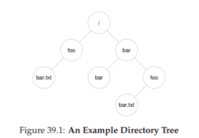

# Phần xen kẽ: Tệp và Thư mục (Interlude: Files and Directories)

Cho đến nay, chúng ta đã thấy sự hình thành của hai **abstraction** (lớp trừu tượng) quan trọng trong hệ điều hành: **process** (tiến trình) – là sự ảo hóa của CPU, và **address space** (không gian địa chỉ) – là sự ảo hóa của bộ nhớ.  
Kết hợp lại, hai abstraction này cho phép một chương trình chạy như thể nó đang ở trong một thế giới riêng tư, tách biệt; như thể nó có bộ xử lý (hoặc nhiều bộ xử lý) riêng; như thể nó có bộ nhớ riêng.  
Ảo tưởng này giúp việc lập trình hệ thống trở nên dễ dàng hơn rất nhiều, và vì thế ngày nay nó phổ biến không chỉ trên máy tính để bàn và máy chủ mà còn ngày càng xuất hiện trên mọi nền tảng lập trình được, bao gồm cả điện thoại di động và các thiết bị tương tự.

Trong phần này, chúng ta sẽ bổ sung một mảnh ghép quan trọng nữa vào bức tranh ảo hóa: **persistent storage** (lưu trữ bền vững).  
Một thiết bị lưu trữ bền vững, chẳng hạn như **ổ đĩa cứng** (hard disk drive) truyền thống hoặc **thiết bị lưu trữ thể rắn** (solid-state storage device) hiện đại, lưu trữ thông tin một cách lâu dài (hoặc ít nhất là trong một thời gian dài).  
Không giống như bộ nhớ, nơi dữ liệu bị mất khi mất điện, thiết bị lưu trữ bền vững giữ nguyên dữ liệu.  
Do đó, hệ điều hành phải đặc biệt cẩn trọng với loại thiết bị này: đây là nơi người dùng lưu trữ dữ liệu mà họ thực sự quan tâm.

### CRUX: QUẢN LÝ THIẾT BỊ LƯU TRỮ BỀN VỮNG NHƯ THẾ NÀO?

> Hệ điều hành nên quản lý một thiết bị lưu trữ bền vững như thế nào? Các API là gì? Những khía cạnh quan trọng trong triển khai là gì?

Vì vậy, trong vài chương tiếp theo, chúng ta sẽ khám phá các kỹ thuật quan trọng để quản lý dữ liệu bền vững, tập trung vào các phương pháp cải thiện hiệu năng và độ tin cậy.  
Tuy nhiên, trước tiên chúng ta sẽ bắt đầu với phần tổng quan về **API**: các giao diện mà bạn sẽ gặp khi tương tác với **UNIX file system** (hệ thống tệp UNIX).


## 39.1 Tệp và Thư mục (Files And Directories)

Hai abstraction quan trọng đã được phát triển theo thời gian trong quá trình ảo hóa lưu trữ.

**Abstraction** đầu tiên là **file** (tệp).  
Một file đơn giản là một mảng tuyến tính các byte, mỗi byte có thể được đọc hoặc ghi.  
Mỗi file có một dạng tên mức thấp nào đó, thường là một con số; người dùng thường không biết đến tên này.  
Vì lý do lịch sử, tên mức thấp của một file thường được gọi là **inode number** (số inode, hay i-number).  
Chúng ta sẽ tìm hiểu nhiều hơn về inode trong các chương sau; hiện tại, chỉ cần giả định rằng mỗi file có một inode number gắn liền với nó.

Trong hầu hết các hệ thống, hệ điều hành không biết nhiều về cấu trúc bên trong của file (ví dụ: nó là một bức ảnh, một tệp văn bản, hay mã C); thay vào đó, trách nhiệm của **file system** (hệ thống tệp) chỉ đơn giản là lưu trữ dữ liệu đó một cách bền vững trên đĩa và đảm bảo rằng khi bạn yêu cầu dữ liệu lần nữa, bạn nhận được đúng dữ liệu mà bạn đã lưu ban đầu.  
Làm được điều này không đơn giản như tưởng tượng!

**Abstraction** thứ hai là **directory** (thư mục).  
Một directory, giống như file, cũng có một tên mức thấp (tức inode number), nhưng nội dung của nó rất đặc thù: nó chứa một danh sách các cặp **(tên đọc được bởi người dùng, tên mức thấp)**.  
Ví dụ: giả sử có một file với tên mức thấp là “10”, và nó được người dùng gọi bằng tên “foo”.  
Directory chứa “foo” sẽ có một mục **(“foo”, “10”)** ánh xạ tên đọc được sang tên mức thấp.  
Mỗi mục trong một directory tham chiếu tới hoặc là file, hoặc là directory khác.  
Bằng cách đặt các directory bên trong các directory khác, người dùng có thể xây dựng một **directory tree** (cây thư mục) hoặc **directory hierarchy** (hệ phân cấp thư mục) tùy ý, trong đó tất cả file và directory đều được lưu trữ.

Cây thư mục bắt đầu từ **root directory** (thư mục gốc) – trong các hệ thống dựa trên UNIX, thư mục gốc được ký hiệu đơn giản là `/` – và sử dụng một ký tự phân tách nào đó để đặt tên các thư mục con tiếp theo cho đến khi chỉ ra được file hoặc directory mong muốn.  
Ví dụ: nếu một người dùng tạo một thư mục `foo` trong thư mục gốc `/`, và sau đó tạo một file `bar.txt` trong thư mục `foo`, chúng ta có thể tham chiếu tới file này bằng **absolute pathname** (đường dẫn tuyệt đối), trong trường hợp này sẽ là:

```
/foo/bar.txt
```



**Hình 39.1: Ví dụ về cây thư mục (An Example Directory Tree)**

> **TIP: SUY NGHĨ CẨN THẬN VỀ VIỆC ĐẶT TÊN**  
>  
> Đặt tên (**naming**) là một khía cạnh quan trọng của các hệ thống máy tính. Trong các hệ thống UNIX, hầu như mọi thứ bạn có thể nghĩ tới đều được đặt tên thông qua **file system** (hệ thống tệp). Không chỉ các file, mà cả thiết bị (**device**), ống dẫn (**pipe**), và thậm chí cả **process** (tiến trình) cũng có thể được tìm thấy trong một cấu trúc trông giống như một hệ thống tệp thông thường.  
> Sự thống nhất trong cách đặt tên này giúp đơn giản hóa mô hình khái niệm của bạn về hệ thống, và làm cho hệ thống trở nên đơn giản hơn và có tính mô-đun cao hơn. Vì vậy, bất cứ khi nào tạo một hệ thống hoặc giao diện, hãy suy nghĩ kỹ về những cái tên bạn đang sử dụng.

Các **directory** (thư mục) và **file** (tệp) có thể trùng tên miễn là chúng nằm ở các vị trí khác nhau trong cây hệ thống tệp.  
Ví dụ: có thể tồn tại hai file tên `bar.txt` như trong hình minh họa: `/foo/bar.txt` và `/bar/foo/bar.txt`.


## 39.2 Giao diện hệ thống tệp (The File System Interface)

Bây giờ, chúng ta sẽ thảo luận chi tiết hơn về **file system interface** (giao diện hệ thống tệp).  
Chúng ta sẽ bắt đầu với những thao tác cơ bản: tạo, truy cập và xóa file.  
Bạn có thể nghĩ rằng điều này khá đơn giản, nhưng trong quá trình tìm hiểu, chúng ta sẽ khám phá một **system call** bí ẩn được dùng để xóa file, gọi là `unlink()`.  
Hy vọng rằng, đến cuối chương này, lời giải cho “bí ẩn” đó sẽ trở nên rõ ràng với bạn.


## 39.3 Tạo file (Creating Files)

Chúng ta sẽ bắt đầu với thao tác cơ bản nhất: **tạo một file**.  
Điều này có thể thực hiện được với **system call** `open`; bằng cách gọi `open()` và truyền vào cờ (**flag**) `O_CREAT`, một chương trình có thể tạo ra một file mới.  
Dưới đây là ví dụ mã nguồn để tạo một file tên “foo” trong **current working directory** (thư mục làm việc hiện tại):

```c
int fd = open("foo", O_CREAT|O_WRONLY|O_TRUNC, S_IRUSR|S_IWUSR);
```

> **ASIDE: SYSTEM CALL CREAT()**  
>  
> Cách cũ hơn để tạo file là gọi `creat()`, như sau:  
>  
> ```c
> // tùy chọn: thêm tham số thứ hai để thiết lập quyền truy cập
> int fd = creat("foo");
> ```  
>  
> Bạn có thể coi `creat()` tương đương với `open()` với các cờ: `O_CREAT | O_WRONLY | O_TRUNC`.  
> Vì `open()` có thể tạo file, nên việc sử dụng `creat()` đã phần nào ít phổ biến hơn.  
> Tuy nhiên, nó vẫn giữ một vị trí đặc biệt trong “truyền thuyết” UNIX.  
> Cụ thể, khi Ken Thompson được hỏi ông sẽ làm gì khác nếu thiết kế lại UNIX, ông trả lời:  
> “Tôi sẽ viết `creat` với một chữ e” (tức là `create`).

Một khía cạnh quan trọng của `open()` là giá trị nó trả về: **file descriptor** (bộ mô tả tệp).  
File descriptor chỉ đơn giản là một số nguyên, riêng cho mỗi **process** (tiến trình), và được dùng trong các hệ thống UNIX để truy cập file.

Các file descriptor được hệ điều hành quản lý **theo từng process**.  
Điều này có nghĩa là một cấu trúc dữ liệu đơn giản nào đó (ví dụ: một mảng) được lưu trong **proc structure** (cấu trúc tiến trình) trên các hệ thống UNIX.  
Dưới đây là phần liên quan từ **xv6 kernel**:


## 39.4 Đọc và ghi tệp (Reading And Writing Files)

Khi đã có một số file, tất nhiên chúng ta sẽ muốn đọc hoặc ghi chúng.  
Hãy bắt đầu bằng việc đọc một file đã tồn tại.  
Nếu đang gõ lệnh trong **command line** (dòng lệnh), chúng ta có thể dùng chương trình `cat` để hiển thị nội dung của file ra màn hình.

```sh
prompt> echo hello > foo
prompt> cat foo
hello
prompt>
```

Để tìm hiểu điều gì thực sự xảy ra, chúng ta sẽ sử dụng một công cụ cực kỳ hữu ích để **theo dõi các system call** mà một chương trình thực hiện.  
Trên Linux, công cụ này được gọi là `strace`.  
Dưới đây là ví dụ sử dụng `strace` để tìm hiểu `cat` đang làm gì (một số call đã được lược bỏ để dễ đọc):

...

Tại sao lần gọi `open()` đầu tiên lại trả về **3**, chứ không phải **0** hoặc **1**?  
Hóa ra, mỗi **process** (tiến trình) đang chạy đã mặc định mở sẵn **ba file**:

- **standard input** (stdin – bộ mô tả tệp số 0)  
- **standard output** (stdout – bộ mô tả tệp số 1)  
- **standard error** (stderr – bộ mô tả tệp số 2)

Sau khi `open` thành công, `cat` sử dụng **system call** `read()` để liên tục đọc một số byte từ file.  
Chương trình sau đó cố gắng đọc thêm, nhưng vì không còn byte nào, `read()` trả về **0** và chương trình hiểu rằng nó đã đọc hết toàn bộ file.  
Do đó, chương trình gọi `close()` để báo rằng nó đã hoàn tất.


## 39.5 Đọc và ghi, nhưng không theo tuần tự (Reading And Writing, But Not Sequentially)

Đôi khi, chúng ta cần đọc hoặc ghi tại một **offset** (vị trí bù) cụ thể trong file.  
Để làm điều này, ta sử dụng **system call** `lseek()`:

```c
off_t lseek(int fildes, off_t offset, int whence);
```

Tham số `whence` xác định chính xác cách dịch chuyển con trỏ file:

- **SEEK_SET**: đặt offset hiện tại thành `offset` byte.  
- **SEEK_CUR**: đặt offset thành vị trí hiện tại cộng thêm `offset` byte.  
- **SEEK_END**: đặt offset thành kích thước file cộng thêm `offset` byte.

Với mỗi file mà một process mở, hệ điều hành sẽ theo dõi một **offset hiện tại** (current offset), xác định vị trí bắt đầu cho lần đọc hoặc ghi tiếp theo.  
Offset này được cập nhật **ngầm** khi gọi `read` hoặc `write`, hoặc **tường minh** khi gọi `lseek`.  
Offset này được lưu trong **struct file**.  
Dưới đây là định nghĩa (đơn giản hóa) của cấu trúc này trong **xv6**:

```c
struct file {
  int ref;
  char readable;
  char writable;
  struct inode *ip;
  uint off;
};
```

> **ASIDE: GỌI LSEEK() KHÔNG THỰC HIỆN DISK SEEK**  
>  
> Tên gọi của system call `lseek()` dễ gây nhầm lẫn cho nhiều sinh viên.  
> Lời gọi `lseek()` chỉ đơn giản thay đổi một biến trong bộ nhớ của hệ điều hành, biến này theo dõi offset hiện tại.  
> **Disk seek** (dịch chuyển đầu đọc đĩa) chỉ xảy ra khi một thao tác đọc hoặc ghi tới đĩa nằm trên một track khác so với thao tác trước đó.  
> Gọi `lseek()` có thể dẫn đến một disk seek trong thao tác đọc hoặc ghi tiếp theo, nhưng bản thân nó **không hề** gây ra bất kỳ I/O vật lý nào.

Hãy theo dõi một process mở một file (kích thước 300 byte) và đọc nó bằng cách gọi `read()` nhiều lần, mỗi lần đọc 100 byte.


## 39.6 Chia sẻ entry trong bảng file mở: fork() và dup() (Shared File Table Entries: fork() And dup())

Trong nhiều trường hợp, ánh xạ từ **file descriptor** (bộ mô tả tệp) tới một entry trong **open file table** (bảng file mở) là ánh xạ **một-một**.  
Tuy nhiên, có một số trường hợp thú vị khi một entry trong open file table được **chia sẻ**.  
Một trong những trường hợp đó xảy ra khi **process cha** tạo ra **process con** bằng `fork()`.


**Hình 39.2: Chia sẻ entry bảng file giữa tiến trình cha/con (fork-seek.c)**

Khi chạy chương trình này, chúng ta thấy kết quả sau:

```sh
prompt> ./fork-seek
child: offset 10
parent: offset 10
prompt>
```

Một trường hợp chia sẻ khác xảy ra với **system call** `dup()`.  
Lời gọi `dup()` cho phép một **process** (tiến trình) tạo ra một **file descriptor** (bộ mô tả tệp) mới tham chiếu tới **cùng một file đã mở** (open file) như một descriptor hiện có.

...


**Hình 39.4: Chia sẻ entry bảng file với dup() (dup.c)**


## 39.7 Ghi ngay lập tức với fsync() (Writing Immediately With fsync())

Thông thường, khi một chương trình gọi `write()`, **file system** (hệ thống tệp) sẽ **buffer** (đệm) các thao tác ghi này trong bộ nhớ một thời gian vì lý do hiệu năng.  
Tuy nhiên, một số ứng dụng yêu cầu khả năng **ép** dữ liệu được ghi xuống đĩa ngay lập tức.

Để hỗ trợ các ứng dụng loại này, hầu hết các file system cung cấp **system call**:

```c
int fsync(int fd);
```

Khi một process gọi `fsync()`, file system sẽ buộc tất cả dữ liệu **dirty** (chưa được ghi xuống đĩa) của file được tham chiếu bởi file descriptor chỉ định phải được ghi xuống đĩa.


## 39.8 Đổi tên file (Renaming Files)

Để đổi tên một file, lệnh `mv` sử dụng **system call**:

```c
int rename(char *old, char *new);
```

Một đảm bảo thú vị mà `rename()` cung cấp là nó (thường) được triển khai như một call **atomic** (nguyên tử) đối với các sự cố **system crash** (sập hệ thống).  
Điều này rất quan trọng đối với các ứng dụng yêu cầu cập nhật trạng thái file một cách nguyên tử.  
Ví dụ, một trình soạn thảo file có thể thực hiện các bước sau để lưu thay đổi một cách an toàn:

...

Bước cuối cùng này **hoán đổi nguyên tử** file mới vào vị trí, đồng thời xóa phiên bản cũ của file.


## 39.9 Lấy thông tin về file (Getting Information About Files)

File system lưu trữ khá nhiều thông tin về mỗi file, mà chúng ta thường gọi là **metadata** (siêu dữ liệu).  
Để xem metadata của một file cụ thể, chúng ta có thể sử dụng **system call** `stat()` hoặc `fstat()`.  
Các call này sẽ điền thông tin vào một cấu trúc `stat`:

...


**Hình 39.5: Cấu trúc stat (The stat structure)**

Bạn cũng có thể sử dụng công cụ dòng lệnh `stat` để xem thông tin này.


## 39.10 Xóa file (Removing Files)

Tại thời điểm này, chúng ta đã biết cách tạo tập tin (file) và truy cập chúng, theo tuần tự hoặc không tuần tự. Nhưng làm thế nào để xóa tập tin? Nếu bạn đã từng sử dụng UNIX, có lẽ bạn nghĩ mình biết: chỉ cần chạy chương trình `rm`. Nhưng `rm` sử dụng **system call** (lời gọi hệ thống) nào để xóa một tập tin?[^1]

Hãy dùng lại công cụ quen thuộc `strace` để tìm hiểu. Dưới đây là ví dụ khi chúng ta xóa tập tin `foo`:

```bash
prompt> strace rm foo
...
unlink("foo") = 0
...
```

Chúng ta đã loại bỏ nhiều phần thông tin không liên quan từ kết quả `strace`, chỉ giữ lại một lời gọi duy nhất tới **system call** có tên khá bí ẩn `unlink()`. Như bạn thấy, `unlink()` chỉ nhận tên của tập tin cần xóa và trả về giá trị 0 khi thành công. Nhưng điều này dẫn đến một câu hỏi thú vị: tại sao lời gọi hệ thống này lại có tên là `unlink`? Tại sao không đặt là `remove` hoặc `delete`? Để trả lời câu hỏi này, chúng ta cần hiểu không chỉ về tập tin, mà còn về thư mục (directory).


## Tạo thư mục (Making Directories)

Ngoài tập tin, một tập hợp các **system call** liên quan đến thư mục cho phép bạn tạo, đọc và xóa thư mục. Lưu ý rằng bạn không bao giờ có thể ghi trực tiếp vào một thư mục. Nguyên nhân là vì định dạng của thư mục được xem là **metadata** (siêu dữ liệu) của hệ thống tập tin, và hệ thống tập tin chịu trách nhiệm đảm bảo tính toàn vẹn của dữ liệu thư mục. Do đó, bạn chỉ có thể cập nhật thư mục một cách gián tiếp, ví dụ: bằng cách tạo tập tin, thư mục con hoặc các loại đối tượng khác bên trong nó. Bằng cách này, hệ thống tập tin đảm bảo nội dung thư mục luôn đúng như mong đợi.

Để tạo một thư mục, có một **system call** duy nhất là `mkdir()`. Chương trình `mkdir` cùng tên có thể được dùng để tạo thư mục. Hãy xem điều gì xảy ra khi chúng ta chạy `mkdir` để tạo một thư mục đơn giản tên `foo`:

```bash
prompt> strace mkdir foo
...
mkdir("foo", 0777) = 0
...
prompt>
```

Khi một thư mục được tạo, nó được xem là “rỗng”, mặc dù thực tế nó vẫn chứa một số nội dung tối thiểu. Cụ thể, một thư mục rỗng có hai mục (entry): một mục tham chiếu đến chính nó, và một mục tham chiếu đến thư mục cha. Mục thứ nhất được gọi là “.” (dot), và mục thứ hai là “..” (dot-dot). Bạn có thể thấy các mục này bằng cách truyền tùy chọn (`-a`) cho chương trình `ls`:

```bash
prompt> ls -a
./ ../
prompt> ls -al
total 8
drwxr-x--- 2 remzi remzi    6 Apr 30 16:17 ./
drwxr-x--- 26 remzi remzi 4096 Apr 30 16:17 ../
```

> **TIP: CẨN TRỌNG VỚI CÁC LỆNH MẠNH**
> Chương trình `rm` là một ví dụ điển hình về các lệnh mạnh mẽ, và đôi khi sức mạnh quá mức có thể gây hại. Ví dụ, để xóa nhiều tập tin cùng lúc, bạn có thể gõ:
>
> ```bash
> prompt> rm *
> ```
>
> Trong đó, ký tự `*` sẽ khớp với tất cả các tập tin trong thư mục hiện tại. Nhưng đôi khi bạn cũng muốn xóa cả thư mục và toàn bộ nội dung của chúng. Bạn có thể làm điều này bằng cách yêu cầu `rm` đệ quy đi vào từng thư mục và xóa nội dung bên trong:
>
> ```bash
> prompt> rm -rf *
> ```
>
> Vấn đề nghiêm trọng xảy ra khi bạn vô tình chạy lệnh này từ thư mục gốc của hệ thống tập tin, dẫn đến việc xóa toàn bộ tập tin và thư mục. Vì vậy, hãy nhớ rằng các lệnh mạnh mẽ giống như con dao hai lưỡi: chúng cho phép bạn làm được rất nhiều việc chỉ với vài phím bấm, nhưng cũng có thể gây ra thiệt hại lớn trong chớp mắt.


## Đọc thư mục (Reading Directories)

Bây giờ chúng ta đã tạo được một thư mục, có thể chúng ta cũng muốn đọc nội dung của nó. Thực tế, đó chính là điều mà chương trình `ls` thực hiện. Hãy thử viết một công cụ nhỏ giống `ls` để xem cách làm. Thay vì chỉ mở thư mục như một tập tin, chúng ta sẽ dùng một tập hợp lời gọi mới. Dưới đây là chương trình ví dụ in ra nội dung của một thư mục. Chương trình sử dụng ba lời gọi `opendir()`, `readdir()` và `closedir()` để thực hiện công việc. Giao diện này khá đơn giản: chỉ cần một vòng lặp để đọc từng mục thư mục một, rồi in ra tên và số inode của mỗi tập tin.

```c
int main(int argc, char *argv[]) {
    DIR *dp = opendir(".");
    assert(dp != NULL);
    struct dirent *d;
    while ((d = readdir(dp)) != NULL) {
        printf("%lu %s\n", (unsigned long) d->d_ino, d->d_name);
    }
    closedir(dp);
    return 0;
}
```

Khai báo dưới đây cho thấy thông tin có trong mỗi mục thư mục, được lưu trong cấu trúc dữ liệu `struct dirent`:

```c
struct dirent {
    char          d_name[256]; // tên tập tin
    ino_t         d_ino;       // số inode
    off_t         d_off;       // vị trí (offset) tới mục tiếp theo
    unsigned short d_reclen;   // độ dài bản ghi này
    unsigned char d_type;      // loại tập tin
};
```

Vì thư mục chứa rất ít thông tin (về cơ bản chỉ ánh xạ tên sang số inode, cùng một vài chi tiết khác), một chương trình có thể muốn gọi `stat()` trên từng tập tin để lấy thêm thông tin, chẳng hạn như kích thước hoặc các thuộc tính chi tiết khác. Thực tế, đây chính là điều `ls` làm khi bạn truyền cho nó tùy chọn `-l`. Hãy thử dùng `strace` trên `ls` với và không có tùy chọn này để tự kiểm chứng.


## Xóa thư mục (Deleting Directories)

Cuối cùng, bạn có thể xóa một thư mục bằng lời gọi `rmdir()` (được sử dụng bởi chương trình cùng tên `rmdir`). Không giống như việc xóa tập tin, xóa thư mục nguy hiểm hơn, vì bạn có thể xóa một lượng lớn dữ liệu chỉ với một lệnh. Do đó, `rmdir()` yêu cầu thư mục phải rỗng (tức là chỉ chứa các mục “.” và “..”) trước khi bị xóa. Nếu bạn cố gắng xóa một thư mục không rỗng, lời gọi `rmdir()` sẽ thất bại.


[^1]: `strace` là công cụ theo dõi các **system call** mà một tiến trình thực hiện, rất hữu ích để tìm hiểu cách chương trình tương tác với kernel.


Dưới đây là bản dịch tiếng Việt hoàn chỉnh, tuân thủ đầy đủ các yêu cầu bạn đưa ra, giữ nguyên thuật ngữ kỹ thuật phổ biến, bổ sung giải thích khi cần, và trình bày theo phong cách học thuật dành cho sinh viên ngành Khoa học Máy tính.


## Hard Links (Liên kết cứng)

Bây giờ chúng ta quay lại câu hỏi bí ẩn: tại sao việc xóa một tập tin lại được thực hiện thông qua `unlink()`? Để hiểu điều này, ta cần biết một cách khác để tạo một mục (entry) trong cây hệ thống tập tin, thông qua một **system call** (lời gọi hệ thống) có tên `link()`. Lời gọi `link()` nhận hai tham số: một đường dẫn cũ và một đường dẫn mới; khi bạn “link” (liên kết) một tên tập tin mới tới một tên tập tin cũ, bạn thực chất đang tạo thêm một cách khác để tham chiếu đến cùng một tập tin. Chương trình dòng lệnh `ln` được dùng để làm việc này, như trong ví dụ sau:

```bash
prompt> echo hello > file
prompt> cat file
hello
prompt> ln file file2
prompt> cat file2
hello
```

Ở đây, chúng ta tạo một tập tin chứa từ “hello” và đặt tên là `file`. Sau đó, chúng ta tạo một **hard link** (liên kết cứng) tới tập tin đó bằng chương trình `ln`. Sau bước này, chúng ta có thể đọc nội dung tập tin bằng cách mở `file` hoặc `file2`. Cách `link()` hoạt động là: nó chỉ đơn giản tạo thêm một tên mới trong thư mục mà bạn đang tạo liên kết, và trỏ tên đó tới cùng **inode number** (số inode – định danh mức thấp của tập tin) của tập tin gốc. Tập tin không hề được sao chép; thay vào đó, bạn có hai tên dễ đọc (`file` và `file2`) cùng trỏ tới cùng một tập tin. Chúng ta có thể thấy điều này ngay trong thư mục, bằng cách in ra số inode của từng tập tin:

```bash
prompt> ls -i file file2
67158084 file
67158084 file2
prompt>
```

Khi truyền tùy chọn `-i` cho `ls`, nó sẽ in ra số inode của mỗi tập tin (cùng với tên tập tin). Như vậy, bạn có thể thấy `link` thực chất đã làm gì: chỉ tạo một tham chiếu mới tới cùng một số inode (67158084 trong ví dụ này).

Đến đây, bạn có thể bắt đầu hiểu tại sao `unlink()` lại có tên như vậy. Khi bạn tạo một tập tin, thực chất bạn đang làm hai việc:  
1. Tạo một cấu trúc dữ liệu (inode) để lưu hầu hết thông tin liên quan đến tập tin, bao gồm kích thước, vị trí các block trên đĩa, v.v.  
2. Liên kết một tên dễ đọc với tập tin đó, và đặt liên kết này vào một thư mục.

Sau khi tạo một hard link tới tập tin, hệ thống tập tin không phân biệt giữa tên gốc (`file`) và tên mới (`file2`); cả hai chỉ là các liên kết tới metadata (siêu dữ liệu) của tập tin, được lưu trong inode số 67158084.

Vì vậy, để xóa một tập tin khỏi hệ thống tập tin, ta gọi `unlink()`. Trong ví dụ trên, ta có thể xóa tập tin `file` và vẫn truy cập được nội dung qua `file2`:

```bash
prompt> rm file
removed ‘file’
prompt> cat file2
hello
```

Điều này hoạt động được vì khi hệ thống tập tin thực hiện `unlink()` trên `file`, nó sẽ kiểm tra **reference count** (bộ đếm tham chiếu, đôi khi gọi là link count) trong inode. Reference count cho biết có bao nhiêu tên tập tin khác nhau đang liên kết tới inode này. Khi `unlink()` được gọi, nó xóa liên kết giữa tên dễ đọc (tập tin bị xóa) và inode tương ứng, đồng thời giảm reference count đi 1; chỉ khi reference count giảm xuống 0, hệ thống tập tin mới giải phóng inode và các block dữ liệu liên quan, và khi đó tập tin mới thực sự bị “xóa” khỏi đĩa.[^2]

Bạn có thể xem reference count của một tập tin bằng cách dùng `stat()`. Hãy xem ví dụ khi chúng ta tạo và xóa các hard link tới một tập tin. Trong ví dụ này, ta sẽ tạo ba liên kết tới cùng một tập tin, rồi xóa chúng. Hãy chú ý đến link count:

```bash
prompt> echo hello > file
prompt> stat file
... Inode: 67158084 Links: 1 ...
prompt> ln file file2
prompt> stat file
... Inode: 67158084 Links: 2 ...
prompt> stat file2
... Inode: 67158084 Links: 2 ...
prompt> ln file2 file3
prompt> stat file
... Inode: 67158084 Links: 3 ...
prompt> rm file
prompt> stat file2
... Inode: 67158084 Links: 2 ...
prompt> rm file2
prompt> stat file3
... Inode: 67158084 Links: 1 ...
prompt> rm file3
```


## Symbolic Links (Liên kết tượng trưng)

Có một loại liên kết khác rất hữu ích, gọi là **symbolic link** (liên kết tượng trưng) hoặc đôi khi là **soft link** (liên kết mềm). Hard link có một số hạn chế: bạn không thể tạo hard link tới một thư mục (để tránh tạo vòng lặp trong cây thư mục); bạn không thể hard link tới tập tin ở phân vùng đĩa khác (vì số inode chỉ là duy nhất trong một hệ thống tập tin, không phải giữa các hệ thống tập tin khác nhau); v.v. Vì vậy, một loại liên kết mới – symbolic link – đã được tạo ra.[^3]

Để tạo symbolic link, bạn vẫn dùng chương trình `ln`, nhưng thêm tùy chọn `-s`. Ví dụ:

```bash
prompt> echo hello > file
prompt> ln -s file file2
prompt> cat file2
hello
```

Như bạn thấy, việc tạo soft link trông khá giống với hard link, và tập tin gốc giờ có thể được truy cập qua tên `file` hoặc qua symbolic link `file2`. Tuy nhiên, ngoài sự giống nhau bề ngoài này, symbolic link thực chất khác hard link ở nhiều điểm. Điểm khác biệt đầu tiên là symbolic link thực chất là một tập tin riêng, thuộc loại khác. Chúng ta đã nói về regular file (tập tin thường) và directory (thư mục); symbolic link là loại thứ ba mà hệ thống tập tin nhận biết. Khi chạy `stat` trên symbolic link, bạn sẽ thấy:

```bash
prompt> stat file
... regular file ...
prompt> stat file2
... symbolic link ...
```

Chạy `ls` cũng cho thấy điều này. Nếu bạn để ý ký tự đầu tiên trong cột ngoài cùng bên trái của kết quả `ls -l`, bạn sẽ thấy: ký tự `-` cho regular file, `d` cho directory, và `l` cho symbolic link. Bạn cũng có thể thấy kích thước của symbolic link (4 byte trong trường hợp này) và tập tin mà nó trỏ tới (`file`):

```bash
prompt> ls -al
drwxr-x--- 2 remzi remzi   29 May  3 19:10 ./
drwxr-x--- 27 remzi remzi 4096 May  3 15:14 ../
-rw-r----- 1 remzi remzi    6 May  3 19:10 file
lrwxrwxrwx 1 remzi remzi    4 May  3 19:10 file2 -> file
```

Lý do `file2` có kích thước 4 byte là vì symbolic link lưu **pathname** (đường dẫn) của tập tin mà nó trỏ tới như dữ liệu của chính symbolic link đó. Vì chúng ta liên kết tới tập tin tên `file`, symbolic link `file2` chỉ dài 4 byte. Nếu liên kết tới một đường dẫn dài hơn, symbolic link sẽ lớn hơn:

```bash
prompt> echo hello > alongerfilename
prompt> ln -s alongerfilename file3
prompt> ls -al alongerfilename file3
-rw-r----- 1 remzi remzi  6 May 3 19:17 alongerfilename
lrwxrwxrwx 1 remzi remzi 15 May 3 19:17 file3 -> alongerfilename
```

Cuối cùng, do cách symbolic link được tạo ra, nó có thể dẫn đến tình huống gọi là **dangling reference** (tham chiếu treo):

```bash
prompt> echo hello > file
prompt> ln -s file file2
prompt> cat file2
hello
prompt> rm file
prompt> cat file2
cat: file2: No such file or directory
```

Như bạn thấy, khác với hard link, khi xóa tập tin gốc `file`, symbolic link sẽ trỏ tới một đường dẫn không còn tồn tại.

## Permission Bits và Access Control Lists (Danh sách kiểm soát truy cập)

Khái niệm trừu tượng (abstraction) của **process** (tiến trình) cung cấp hai dạng ảo hóa (virtualization) trung tâm: ảo hóa CPU và ảo hóa bộ nhớ. Mỗi dạng ảo hóa này tạo cho tiến trình ảo giác rằng nó có CPU riêng và bộ nhớ riêng; trên thực tế, **OS** (hệ điều hành) bên dưới sử dụng nhiều kỹ thuật khác nhau để chia sẻ tài nguyên vật lý hạn chế giữa các thực thể cạnh tranh một cách an toàn và bảo mật.

**File system** (hệ thống tập tin) cũng cung cấp một cái nhìn ảo về đĩa, biến nó từ một tập hợp các block thô thành các tập tin và thư mục thân thiện hơn với người dùng, như đã mô tả trong chương này. Tuy nhiên, sự trừu tượng này khác đáng kể so với CPU và bộ nhớ, ở chỗ tập tin thường được chia sẻ giữa nhiều người dùng và tiến trình, và không phải lúc nào cũng là riêng tư. Do đó, trong file system thường tồn tại một tập hợp cơ chế toàn diện hơn để cho phép các mức độ chia sẻ khác nhau.

Hình thức cơ bản đầu tiên của các cơ chế này là **permission bits** (các bit quyền truy cập) kiểu UNIX cổ điển. Để xem quyền truy cập của một tập tin `foo.txt`, chỉ cần gõ:

```bash
prompt> ls -l foo.txt
-rw-r--r-- 1 remzi wheel 0 Aug 24 16:29 foo.txt
```

Chúng ta sẽ chỉ tập trung vào phần đầu tiên của kết quả này, cụ thể là `-rw-r--r--`. Ký tự đầu tiên cho biết loại tập tin: `-` cho **regular file** (tập tin thường, như `foo.txt`), `d` cho **directory** (thư mục), `l` cho **symbolic link** (liên kết tượng trưng), v.v.; phần này (hầu hết) không liên quan đến quyền truy cập, nên tạm thời bỏ qua.

Phần chúng ta quan tâm là **permission bits**, được biểu diễn bởi chín ký tự tiếp theo (`rw-r--r--`). Các bit này xác định, đối với mỗi tập tin thường, thư mục hoặc thực thể khác, ai có thể truy cập và truy cập như thế nào. Quyền được chia thành ba nhóm: quyền của **owner** (chủ sở hữu tập tin), quyền của **group** (nhóm) mà tập tin thuộc về, và quyền của **others** (người dùng khác). Các quyền này bao gồm: đọc (read), ghi (write) và thực thi (execute) tập tin.

Trong ví dụ trên, ba ký tự đầu tiên (`rw-`) cho biết tập tin có thể đọc và ghi bởi owner; ba ký tự tiếp theo (`r--`) cho biết chỉ có thể đọc bởi các thành viên của group `wheel`; và ba ký tự cuối (`r--`) cho biết chỉ có thể đọc bởi mọi người khác trong hệ thống.

Owner của tập tin có thể thay đổi các quyền này, ví dụ bằng lệnh `chmod` (change mode). Để loại bỏ quyền truy cập của tất cả mọi người trừ owner, bạn có thể gõ:

```bash
prompt> chmod 600 foo.txt
```

> **ASIDE: SUPERUSER TRONG FILE SYSTEM**
> Người dùng nào được phép thực hiện các thao tác đặc quyền để quản trị file system? Ví dụ, nếu cần xóa tập tin của một người dùng không hoạt động để giải phóng dung lượng, ai có quyền làm điều đó? Trong file system cục bộ, mặc định phổ biến là có một **superuser** (người dùng siêu cấp, thường là `root`) có thể truy cập tất cả tập tin bất kể quyền hạn. Trong file system phân tán như AFS (có **access control lists**), một nhóm gọi là `system:administrators` chứa các người dùng được tin cậy để làm việc này. Trong cả hai trường hợp, các người dùng đặc quyền này tiềm ẩn rủi ro bảo mật; nếu kẻ tấn công giả mạo được họ, toàn bộ dữ liệu trong hệ thống có thể bị truy cập, vi phạm tính riêng tư và bảo vệ dữ liệu.

Lệnh trên bật bit đọc (4) và bit ghi (2) cho owner (OR hai giá trị này được 6), nhưng đặt quyền của group và others về 0, tạo thành quyền `rw-------`.

Bit thực thi (**execute bit**) đặc biệt thú vị. Đối với regular file, bit này quyết định chương trình có thể chạy hay không. Ví dụ, nếu có một shell script tên `hello.csh`, ta có thể chạy nó bằng:

```bash
prompt> ./hello.csh
hello, from shell world.
```

Tuy nhiên, nếu không đặt bit thực thi đúng cách:

```bash
prompt> chmod 600 hello.csh
prompt> ./hello.csh
./hello.csh: Permission denied.
```

Đối với directory, bit thực thi hoạt động khác: nó cho phép người dùng (hoặc group, hoặc mọi người) có thể **cd** vào thư mục đó, và kết hợp với bit ghi, có thể tạo tập tin bên trong. Cách tốt nhất để hiểu rõ là tự thử nghiệm.

Ngoài permission bits, một số file system như AFS (được đề cập ở chương sau) cung cấp cơ chế kiểm soát tinh vi hơn, dưới dạng **Access Control List** (ACL) cho mỗi thư mục. ACL cho phép xác định chính xác ai có thể truy cập tài nguyên. Trong file system, ACL cho phép tạo danh sách cụ thể ai được và không được đọc một tập hợp tập tin, khác với mô hình owner/group/others hạn chế của permission bits.

Ví dụ, đây là quyền truy cập của một thư mục riêng tư trong tài khoản AFS của một tác giả, hiển thị bằng lệnh `fs listacl`:

```bash
prompt> fs listacl private
Access list for private is
Normal rights:
  system:administrators rlidwka
  remzi rlidwka
```

Danh sách này cho thấy cả system administrators và người dùng `remzi` đều có quyền lookup, insert, delete, quản trị thư mục, cũng như đọc, ghi và khóa tập tin. Để cho phép người khác (ở đây là tác giả còn lại) truy cập thư mục này, `remzi` chỉ cần gõ:

```bash
prompt> fs setacl private/ andrea rl
```

Vậy là quyền riêng tư của remzi đã mất! Nhưng bạn cũng học được một bài học quan trọng hơn: trong một cuộc hôn nhân tốt đẹp, không có bí mật — ngay cả trong file system.[^4]


## Tạo và Mount một File System

Chúng ta đã tìm hiểu các giao diện cơ bản để truy cập tập tin, thư mục và một số loại liên kết đặc biệt. Nhưng còn một chủ đề nữa: làm thế nào để ghép một cây thư mục hoàn chỉnh từ nhiều file system bên dưới. Việc này được thực hiện bằng cách tạo file system, sau đó **mount** chúng để nội dung có thể truy cập.

Để tạo file system, hầu hết các hệ thống cung cấp công cụ `mkfs` (viết tắt của “make file system”), thực hiện đúng nhiệm vụ này. Ý tưởng: cung cấp cho công cụ một thiết bị (ví dụ: phân vùng đĩa `/dev/sda1`) và loại file system (ví dụ: `ext3`), nó sẽ ghi một file system trống, bắt đầu với thư mục gốc, vào phân vùng đó.

Tuy nhiên, sau khi tạo, file system cần được gắn vào cây thư mục thống nhất. Việc này được thực hiện bằng chương trình `mount` (gọi **system call** `mount()` để thực hiện). `mount` sẽ lấy một thư mục hiện có làm **mount point** (điểm gắn) và “dán” file system mới vào cây thư mục tại đó.

Ví dụ: giả sử ta có một file system `ext3` chưa mount, nằm ở phân vùng `/dev/sda1`, chứa thư mục gốc với hai thư mục con `a` và `b`, mỗi thư mục chứa một tập tin `foo`. Ta muốn mount nó vào `/home/users`:

```bash
prompt> mount -t ext3 /dev/sda1 /home/users
```

Nếu thành công, file system mới sẽ khả dụng. Để xem nội dung thư mục gốc của nó:

```bash
prompt> ls /home/users/
a b
```

Dưới đây là bản dịch tiếng Việt hoàn chỉnh, tuân thủ đầy đủ các yêu cầu của bạn, giữ nguyên thuật ngữ kỹ thuật phổ biến, bổ sung giải thích khi cần, và trình bày theo phong cách học thuật dành cho sinh viên ngành Khoa học Máy tính.

---

Như bạn thấy, **pathname** `/home/users/` giờ đây trỏ tới thư mục gốc của thư mục vừa được **mount** (gắn kết). Tương tự, chúng ta có thể truy cập các thư mục `a` và `b` thông qua các pathname `/home/users/a` và `/home/users/b`. Cuối cùng, các tập tin tên `foo` có thể được truy cập qua `/home/users/a/foo` và `/home/users/b/foo`. Đây chính là ưu điểm của `mount`: thay vì có nhiều file system riêng biệt, `mount` hợp nhất tất cả các file system thành một cây duy nhất, giúp việc đặt tên trở nên thống nhất và thuận tiện.

Để xem những gì đang được mount trên hệ thống của bạn, và tại các điểm mount nào, chỉ cần chạy chương trình `mount`. Bạn sẽ thấy kết quả tương tự như sau:

```bash
/dev/sda1 on / type ext3 (rw)
proc on /proc type proc (rw)
sysfs on /sys type sysfs (rw)
/dev/sda5 on /tmp type ext3 (rw)
/dev/sda7 on /var/vice/cache type ext3 (rw)
tmpfs on /dev/shm type tmpfs (rw)
AFS on /afs type afs (rw)
```

Sự kết hợp “hỗn hợp” này cho thấy nhiều loại file system khác nhau, bao gồm `ext3` (một file system tiêu chuẩn dựa trên đĩa), file system `proc` (dùng để truy cập thông tin về các **process** – tiến trình – đang chạy), `tmpfs` (file system dành cho các tập tin tạm thời), và `AFS` (một file system phân tán), tất cả đều được “ghép” vào cùng một cây file system của máy.

> **TIP: CẨN TRỌNG VỚI TOCTTOU**
>
> Năm 1974, McPhee phát hiện một vấn đề trong các hệ thống máy tính. Cụ thể, McPhee nhận thấy rằng: “... nếu tồn tại một khoảng thời gian giữa bước kiểm tra tính hợp lệ (validity-check) và thao tác liên quan đến bước kiểm tra đó, [và,] thông qua **multitasking** (đa nhiệm), các biến được kiểm tra có thể bị thay đổi có chủ đích trong khoảng thời gian này, dẫn đến việc chương trình điều khiển thực hiện một thao tác không hợp lệ.” Ngày nay, chúng ta gọi đây là vấn đề **Time Of Check To Time Of Use** (TOCTTOU – từ lúc kiểm tra đến lúc sử dụng), và đáng tiếc là nó vẫn có thể xảy ra.
>
> Một ví dụ đơn giản, được mô tả bởi Bishop và Dilger[^5], cho thấy cách một người dùng có thể đánh lừa một dịch vụ đáng tin cậy hơn và gây ra sự cố. Hãy tưởng tượng một dịch vụ email chạy với quyền `root` (và do đó có đặc quyền truy cập tất cả tập tin trên hệ thống). Dịch vụ này nối thêm một thông điệp mới vào tập tin hộp thư đến (inbox) của người dùng như sau: đầu tiên, nó gọi `lstat()` để lấy thông tin về tập tin, đảm bảo rằng đây thực sự là một **regular file** (tập tin thường) thuộc sở hữu của người dùng đích, và không phải là một liên kết (link) tới tập tin khác mà máy chủ email không nên cập nhật. Sau khi kiểm tra thành công, máy chủ sẽ cập nhật tập tin với thông điệp mới.
>
> Vấn đề là khoảng trống giữa bước kiểm tra và bước cập nhật: kẻ tấn công (trong trường hợp này là chính người nhận email, và do đó có quyền truy cập hộp thư đến) thay thế tập tin inbox (thông qua lời gọi `rename()`) để trỏ tới một tập tin nhạy cảm như `/etc/passwd` (chứa thông tin về người dùng và mật khẩu). Nếu việc thay thế này xảy ra đúng thời điểm (giữa bước kiểm tra và bước truy cập), máy chủ sẽ vô tình cập nhật tập tin nhạy cảm với nội dung email. Khi đó, kẻ tấn công có thể ghi vào tập tin nhạy cảm chỉ bằng cách gửi email – một hình thức leo thang đặc quyền; bằng cách cập nhật `/etc/passwd`, kẻ tấn công có thể thêm một tài khoản với quyền root và chiếm quyền điều khiển hệ thống.
>
> Không có giải pháp đơn giản và hoàn hảo cho vấn đề TOCTTOU[^6]. Một cách tiếp cận là giảm số lượng dịch vụ cần chạy với quyền root, điều này giúp giảm rủi ro. Cờ `O_NOFOLLOW` khiến `open()` thất bại nếu mục tiêu là một symbolic link, từ đó tránh được các tấn công dựa trên liên kết này. Các phương pháp triệt để hơn, như sử dụng **transactional file system** (file system giao dịch)[^7], có thể giải quyết vấn đề, nhưng hiện chưa có nhiều hệ thống như vậy được triển khai rộng rãi. Vì vậy, lời khuyên (có phần yếu ớt) thường là: hãy cẩn thận khi viết mã chạy với đặc quyền cao!

---

## Tóm tắt (Summary)

Giao diện file system trong các hệ thống UNIX (và thực tế là trong bất kỳ hệ thống nào) thoạt nhìn có vẻ khá đơn giản, nhưng để thành thạo, bạn cần hiểu rất nhiều khía cạnh. Không gì tốt hơn là **thực hành sử dụng thường xuyên**. Và tất nhiên, hãy đọc thêm; như thường lệ, Stevens[^8] là điểm khởi đầu tuyệt vời.

> **ASIDE: CÁC THUẬT NGỮ QUAN TRỌNG TRONG FILE SYSTEM**
> - **File** (tập tin) là một mảng byte có thể được tạo, đọc, ghi và xóa. Nó có một tên mức thấp (low-level name, tức là một số) để định danh duy nhất. Tên mức thấp này thường được gọi là **i-number**.
> - **Directory** (thư mục) là một tập hợp các bộ dữ liệu (tuple), mỗi bộ chứa một tên dễ đọc và tên mức thấp mà nó ánh xạ tới. Mỗi mục (entry) trỏ tới một thư mục khác hoặc một tập tin. Mỗi thư mục cũng có một i-number riêng. Một thư mục luôn có hai mục đặc biệt: `.` trỏ tới chính nó, và `..` trỏ tới thư mục cha.
> - **Directory tree** hoặc **directory hierarchy** (cây thư mục) tổ chức tất cả tập tin và thư mục thành một cây lớn, bắt đầu từ thư mục gốc (root).
> - Để truy cập một tập tin, một **process** (tiến trình) phải sử dụng một **system call** (thường là `open()`) để yêu cầu quyền từ hệ điều hành. Nếu được cấp quyền, OS trả về một **file descriptor**, có thể dùng để đọc hoặc ghi tùy theo quyền và mục đích.
> - Mỗi file descriptor là một thực thể riêng tư, thuộc về từng process, trỏ tới một mục trong **open file table**. Mục này lưu thông tin tập tin được truy cập, vị trí hiện tại (offset) trong tập tin (tức là phần nào của tập tin sẽ được đọc hoặc ghi tiếp theo), và các thông tin liên quan khác.
> - Các lời gọi `read()` và `write()` sẽ tự động cập nhật offset hiện tại; ngoài ra, process có thể dùng `lseek()` để thay đổi giá trị này, cho phép truy cập ngẫu nhiên tới các phần khác nhau của tập tin.
> - Để buộc cập nhật dữ liệu xuống thiết bị lưu trữ lâu dài (persistent media), process phải dùng `fsync()` hoặc các lời gọi liên quan. Tuy nhiên, làm điều này đúng cách mà vẫn duy trì hiệu năng cao là một thách thức[^9], nên cần cân nhắc kỹ.
> - Để có nhiều tên dễ đọc trong file system cùng trỏ tới một tập tin gốc, hãy dùng **hard link** hoặc **symbolic link**. Mỗi loại có ưu và nhược điểm riêng, nên cân nhắc trước khi sử dụng. Và nhớ rằng, xóa một tập tin thực chất là thực hiện lần `unlink()` cuối cùng của nó khỏi cây thư mục.
> - Hầu hết các file system có cơ chế bật/tắt chia sẻ. Dạng cơ bản là **permission bits**; dạng nâng cao hơn là **access control list** cho phép kiểm soát chính xác hơn ai có thể truy cập và thao tác dữ liệu.


[^1]: Some file systems call these structures similar, but slightly different, names, such as dnodes; the basic idea is similar however.

[^2]: Note again how creative the authors of this book are. We also used to have a cat named “Cat” (true story). However, she died, and we now have a hamster named “Hammy.” Update: Hammy is now dead too. The pet bodies are piling up.

[^3]: “A Fast File System for UNIX” by Marshall K. McKusick, William N. Joy, Sam J. Leffler, Robert S. Fabry. ACM TOCS, 2:3, August 1984. We’ll talk about the Fast File System (FFS) explicitly later on. Here, we refer to it because of all the other random fun things it introduced, like long file names and symbolic links. Sometimes, when you are building a system to improve one thing, you improve a lot of other things along the way.

[^4]: Married happily since 1996, if you were wondering. We know, you weren’t.

[^5]: “Checking for Race Conditions in File Accesses” by Matt Bishop, Michael Dilger. Computing Systems 9:2, 1996. A great description of the TOCTTOU problem and its presence in file systems.

[^6]: “Portably Solving File TOCTTOU Races with Hardness Amplification” by D. Tsafrir, T. Hertz, D. Wagner, D. Da Silva. FAST ’08, San Jose, California, 2008. Not the paper that introduced TOCTTOU, but a recent-ish and well-done description of the problem and a way to solve the problem in a portable manner.

[^7]: “TxFS: Leveraging File-System Crash Consistency to Provide ACID Transactions” by Y. Hu, Z. Zhu, I. Neal, Y. Kwon, T. Cheng, V. Chidambaram, E. Witchel. USENIX ATC ’18, June 2018. The best paper at USENIX ATC ’18, and a good recent place to start to learn about transactional file systems.

[^8]: “Advanced Programming in the UNIX Environment” by W. Richard Stevens and Stephen A. Rago. Addison-Wesley, 2005. We have probably referenced this book a few hundred thousand times. It is that useful to you, if you care to become an awesome systems programmer.

[^9]: “All File Systems Are Not Created Equal: On the Complexity of Crafting Crash-Consistent Applications” by Thanumalayan S. Pillai, Vijay Chidambaram, Ramnatthan Alagappan, Samer Al-Kiswany, Andrea C. Arpaci-Dusseau, and Remzi H. Arpaci-Dusseau. OSDI ’14, Broomfield, Colorado, October 2014. The full conference paper on this topic – with many more details and interesting tidbits than the first workshop paper above.