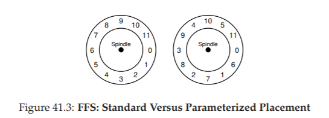

# 41 Tính cục bộ (Locality) và Hệ thống tệp nhanh (Fast File System)

Khi hệ điều hành **UNIX** lần đầu tiên được giới thiệu, chính “phù thủy” UNIX – **Ken Thompson** – đã viết hệ thống tệp đầu tiên.  
Chúng ta sẽ gọi đó là **“old UNIX file system”** (hệ thống tệp UNIX cũ), và nó thực sự rất đơn giản.  
Về cơ bản, các cấu trúc dữ liệu của nó trên đĩa trông như sau:

...

**Super block** (S) chứa thông tin về toàn bộ hệ thống tệp: kích thước của volume, số lượng **inode**, con trỏ tới phần đầu của **free list** (danh sách các block trống), và các thông tin khác.  
Vùng **inode** trên đĩa chứa tất cả các inode của hệ thống tệp.  
Cuối cùng, phần lớn dung lượng đĩa được chiếm bởi các **data block** (block dữ liệu).

Điểm tốt của hệ thống tệp cũ là nó **đơn giản** và hỗ trợ các **abstraction** (trừu tượng hóa) cơ bản mà hệ thống tệp muốn cung cấp: **file** và **cây thư mục** (directory hierarchy).  
Hệ thống dễ sử dụng này là một bước tiến thực sự so với các hệ thống lưu trữ dựa trên bản ghi (record-based storage systems) cồng kềnh trước đây, và cấu trúc cây thư mục là một cải tiến vượt trội so với các hệ thống cũ chỉ hỗ trợ cấu trúc thư mục một cấp.

## 41.1 Vấn đề: Hiệu năng kém (The Problem: Poor Performance)

Vấn đề: hiệu năng **rất tệ**.  
Theo đo đạc của **Kirk McKusick** và các đồng nghiệp tại Berkeley [MJLF84], hiệu năng ban đầu đã kém và càng tệ hơn theo thời gian, đến mức hệ thống tệp chỉ cung cấp **2% băng thông tổng thể của đĩa**!

Nguyên nhân chính là hệ thống tệp UNIX cũ **đối xử với đĩa như bộ nhớ truy cập ngẫu nhiên** (*random-access memory*); dữ liệu bị rải khắp nơi mà không quan tâm đến việc phương tiện lưu trữ là **đĩa**, vốn có **chi phí định vị (positioning cost)** thực sự và đắt đỏ.  
Ví dụ: các **data block** của một file thường nằm rất xa **inode** của nó, dẫn đến việc phải thực hiện một **seek** (dịch chuyển đầu đọc) tốn kém mỗi khi đọc inode rồi đọc các data block của file (một thao tác khá phổ biến).

Tệ hơn nữa, hệ thống tệp dễ bị **phân mảnh** (*fragmentation*), do vùng trống không được quản lý cẩn thận.  
**Free list** cuối cùng sẽ trỏ tới một loạt các block nằm rải rác khắp đĩa, và khi cấp phát file mới, hệ thống chỉ đơn giản lấy block trống tiếp theo.  
Kết quả là một file **liên tiếp về mặt logic** lại được truy cập bằng cách di chuyển qua lại trên đĩa, làm giảm hiệu năng nghiêm trọng.

Ví dụ: hãy hình dung vùng **data block** sau, chứa bốn file (A, B, C và D), mỗi file có kích thước **2 block**:

...

Nếu B và D bị xóa, bố cục còn lại sẽ là:

...

Như bạn thấy, vùng trống bị phân mảnh thành **hai cụm** mỗi cụm 2 block, thay vì một cụm liền mạch gồm 4 block.  
Giả sử bây giờ bạn muốn cấp phát một file E có kích thước **4 block**:

...

Bạn có thể thấy điều gì xảy ra: **E** bị phân tán khắp đĩa, và kết quả là khi truy cập **E**, bạn không đạt được hiệu năng tối đa (truy cập tuần tự) từ đĩa.  
Thay vào đó, bạn phải đọc **E1** và **E2**, sau đó **seek** (dịch chuyển đầu đọc), rồi mới đọc **E3** và **E4**.  
Vấn đề **phân mảnh** (*fragmentation*) này xảy ra thường xuyên trong **old UNIX file system** và làm giảm hiệu năng đáng kể.  

Một lưu ý bên lề: đây chính xác là vấn đề mà các công cụ **disk defragmentation** (chống phân mảnh đĩa) giải quyết; chúng **tái tổ chức dữ liệu trên đĩa** để đặt các file nằm liền nhau và tạo ra vùng trống liên tục (một hoặc vài vùng), bằng cách di chuyển dữ liệu và sau đó ghi lại **inode** và các cấu trúc liên quan để phản ánh thay đổi.

Một vấn đề khác: **kích thước block ban đầu quá nhỏ** (512 byte).  
Do đó, việc truyền dữ liệu từ đĩa vốn đã kém hiệu quả.  
Block nhỏ có ưu điểm là giảm **internal fragmentation** (lãng phí bên trong block), nhưng lại bất lợi cho việc truyền dữ liệu vì mỗi block có thể yêu cầu một chi phí định vị (**positioning overhead**) để truy cập.  
Vì vậy, vấn đề đặt ra là:

> **THE CRUX: LÀM THẾ NÀO TỔ CHỨC DỮ LIỆU TRÊN ĐĨA ĐỂ CẢI THIỆN HIỆU NĂNG**  
> Làm thế nào chúng ta có thể tổ chức các cấu trúc dữ liệu của hệ thống tệp để cải thiện hiệu năng?  
> Cần những chính sách cấp phát nào trên các cấu trúc dữ liệu đó?  
> Làm thế nào để khiến hệ thống tệp “nhận thức về đĩa” (*disk aware*)?

## 41.2 FFS: “Disk Awareness” là giải pháp (Disk Awareness Is The Solution)

Một nhóm tại **Berkeley** đã quyết định xây dựng một hệ thống tệp tốt hơn và nhanh hơn, mà họ đặt tên một cách thông minh là **Fast File System (FFS)**.  
Ý tưởng là thiết kế các cấu trúc và chính sách cấp phát của hệ thống tệp sao cho **“disk aware”** (nhận thức được đặc tính của đĩa) để cải thiện hiệu năng — và đó chính xác là những gì họ đã làm.  

FFS đã mở ra một kỷ nguyên mới trong nghiên cứu hệ thống tệp; bằng cách **giữ nguyên giao diện** với hệ thống tệp (các API như `open()`, `read()`, `write()`, `close()` và các system call khác) nhưng **thay đổi phần triển khai bên trong**, các tác giả đã mở đường cho việc xây dựng các hệ thống tệp mới — công việc vẫn tiếp tục cho đến ngày nay.  

Hầu như tất cả các hệ thống tệp hiện đại đều tuân thủ giao diện hiện có (và do đó duy trì khả năng tương thích với ứng dụng) trong khi thay đổi phần bên trong để cải thiện hiệu năng, độ tin cậy hoặc vì các lý do khác.

## 41.3 Tổ chức cấu trúc: Cylinder Group (Organizing Structure: The Cylinder Group)

Bước đầu tiên là thay đổi các cấu trúc trên đĩa.  
FFS chia đĩa thành một số **cylinder group**.  

Một **cylinder** là tập hợp các track trên các bề mặt khác nhau của ổ cứng, nhưng có cùng khoảng cách tới tâm của ổ đĩa; nó được gọi là “cylinder” vì hình dạng tương tự hình trụ trong hình học.  
FFS gộp **N cylinder liên tiếp** thành một nhóm, và do đó toàn bộ đĩa có thể được xem như một tập hợp các cylinder group.  

Dưới đây là một ví dụ đơn giản, minh họa **bốn track ngoài cùng** của một ổ đĩa với **sáu platter**, và một cylinder group bao gồm **ba cylinder**:

...

Lưu ý rằng các ổ đĩa hiện đại **không cung cấp đủ thông tin** để hệ thống tệp thực sự biết một cylinder cụ thể đang được sử dụng hay không; như đã thảo luận trước đây [AD14a], các ổ đĩa xuất ra một **không gian địa chỉ logic** của các block và **ẩn đi chi tiết hình học** của chúng với phía client.  

Do đó, các hệ thống tệp hiện đại (như **Linux ext2**, **ext3** và **ext4**) thay vào đó tổ chức ổ đĩa thành các **block group**, mỗi block group chỉ đơn giản là một phần liên tiếp của không gian địa chỉ của đĩa.  

Hình minh họa dưới đây cho thấy một ví dụ trong đó **mỗi 8 block** được tổ chức thành một block group khác nhau (lưu ý rằng trong thực tế, mỗi group sẽ bao gồm nhiều block hơn rất nhiều):

...

Dù bạn gọi chúng là **cylinder group** hay **block group**, thì các nhóm này chính là **cơ chế trung tâm** mà **FFS** (Fast File System) sử dụng để cải thiện hiệu năng.  
Điểm mấu chốt là: bằng cách đặt hai file trong cùng một nhóm, FFS có thể đảm bảo rằng việc truy cập file này ngay sau file kia sẽ **không** dẫn đến các thao tác **seek** (dịch chuyển đầu đọc) dài trên đĩa.  

Để sử dụng các nhóm này cho việc lưu trữ file và thư mục, FFS cần có khả năng **đặt file và thư mục vào một nhóm** và **theo dõi toàn bộ thông tin cần thiết** về chúng trong nhóm đó.  
Để làm được điều này, FFS bao gồm tất cả các cấu trúc mà bạn mong đợi một hệ thống tệp có trong mỗi nhóm, ví dụ:  
- Vùng lưu **inode**  
- Vùng lưu **data block**  
- Và một số cấu trúc để theo dõi xem mỗi inode hoặc data block đã được cấp phát hay còn trống  

Dưới đây là sơ đồ mô tả những gì FFS lưu trữ trong một **cylinder group** duy nhất:

...

Bây giờ, hãy xem xét chi tiết các thành phần của một cylinder group duy nhất này.  
FFS giữ **một bản sao của super block (S)** trong mỗi nhóm vì lý do **độ tin cậy**.  
Super block là thành phần cần thiết để **mount** (gắn kết) hệ thống tệp; bằng cách giữ nhiều bản sao, nếu một bản bị hỏng, bạn vẫn có thể mount và truy cập hệ thống tệp bằng một bản sao còn hoạt động.

Bên trong mỗi nhóm, FFS cần theo dõi xem **inode** và **data block** của nhóm đó đã được cấp phát hay chưa.  
Một **inode bitmap** (ib) và **data bitmap** (db) riêng cho từng nhóm đảm nhận vai trò này đối với inode và data block trong nhóm.  
**Bitmap** là một cách tuyệt vời để quản lý vùng trống trong hệ thống tệp vì nó giúp dễ dàng tìm được một vùng trống lớn và cấp phát nó cho một file, từ đó có thể tránh được một số vấn đề phân mảnh mà **free list** trong hệ thống tệp cũ gặp phải.

Cuối cùng, vùng **inode** và **data block** trong mỗi nhóm cũng giống như trong hệ thống tệp rất đơn giản trước đây (**VSFS**).  
Phần lớn dung lượng của mỗi cylinder group, như thường lệ, là **data block**.

> **ASIDE: QUÁ TRÌNH TẠO FILE TRONG FFS (FFS FILE CREATION)**  
> Ví dụ, hãy nghĩ về những cấu trúc dữ liệu nào phải được cập nhật khi tạo một file; giả sử, trong ví dụ này, người dùng tạo một file mới `/foo/bar.txt` và file này dài **1 block** (4KB).  
> File này là mới, do đó cần một **inode mới**; vì vậy, cả **inode bitmap** và **inode mới được cấp phát** sẽ được ghi xuống đĩa.  
> File này cũng có dữ liệu, nên nó cũng phải được cấp phát block dữ liệu; do đó, **data bitmap** và một **data block** sẽ (cuối cùng) được ghi xuống đĩa.  
> Như vậy, **ít nhất bốn thao tác ghi** vào cylinder group hiện tại sẽ diễn ra (hãy nhớ rằng các thao tác ghi này có thể được **buffer** trong bộ nhớ một thời gian trước khi thực sự ghi xuống đĩa).  
> Nhưng chưa hết! Khi tạo một file mới, bạn cũng phải đặt file đó vào **cây thư mục** của hệ thống tệp, tức là thư mục chứa nó phải được cập nhật.  
> Cụ thể, thư mục cha `foo` phải được cập nhật để thêm entry cho `bar.txt`; bản cập nhật này có thể vừa với một data block hiện có của `foo` hoặc yêu cầu cấp phát một block mới (kèm theo cập nhật **data bitmap**).  
> **Inode** của `foo` cũng phải được cập nhật, vừa để phản ánh độ dài mới của thư mục, vừa để cập nhật các trường thời gian (chẳng hạn như **last-modified-time**).  
> Tổng thể, đây là **rất nhiều công việc** chỉ để tạo một file mới! Có lẽ lần tới khi bạn làm điều đó, bạn nên biết ơn hơn — hoặc ít nhất là ngạc nhiên rằng mọi thứ lại hoạt động trơn tru đến vậy.

## 41.4 Chính sách: Cách cấp phát file và thư mục (Policies: How To Allocate Files and Directories)

Với cấu trúc **group** (nhóm) đã được thiết lập, **FFS** (Fast File System) giờ đây phải quyết định cách **đặt file, thư mục và metadata** (siêu dữ liệu) liên quan lên đĩa để cải thiện hiệu năng.  
Nguyên tắc cơ bản (*mantra*) rất đơn giản: **giữ các dữ liệu liên quan ở gần nhau** (và hệ quả của nó: **giữ các dữ liệu không liên quan ở xa nhau**).

Do đó, để tuân theo nguyên tắc này, FFS phải xác định **thế nào là “liên quan”** và đặt chúng trong **cùng một block group**; ngược lại, các mục không liên quan nên được đặt ở **các block group khác nhau**.  
Để đạt được điều này, FFS sử dụng một số **heuristic** (kinh nghiệm thực tiễn) đơn giản trong việc bố trí dữ liệu.

**Đầu tiên** là việc bố trí **thư mục**.  
FFS áp dụng một cách tiếp cận đơn giản:  
- Tìm **cylinder group** có **ít thư mục đã được cấp phát** (để cân bằng số lượng thư mục giữa các nhóm)  
- Và có **nhiều inode trống** (để sau đó có thể cấp phát nhiều file)  
- Sau đó đặt **dữ liệu thư mục** và **inode** của nó vào nhóm đó.  

Tất nhiên, có thể sử dụng các heuristic khác ở đây (ví dụ: xét đến số lượng **data block** trống).

**Đối với file**, FFS thực hiện hai điều:  
1. Đảm bảo (trong trường hợp tổng quát) **cấp phát các data block của file trong cùng group với inode của nó**, từ đó tránh các thao tác **seek** dài giữa inode và dữ liệu (như trong hệ thống tệp cũ).  
2. Đặt **tất cả các file trong cùng một thư mục** vào **cylinder group** của thư mục đó.  

Ví dụ: nếu người dùng tạo bốn file `/a/b`, `/a/c`, `/a/d`, và `/b/f`, FFS sẽ cố gắng đặt **ba file đầu tiên** gần nhau (cùng group) và **file thứ tư** ở xa (một group khác).

Hãy xem một ví dụ về cách cấp phát như vậy.  
Trong ví dụ này, giả sử **mỗi group chỉ có 10 inode và 10 data block** (cả hai con số này đều nhỏ một cách phi thực tế), và ba thư mục (**root directory** `/`, `/a`, và `/b`) cùng bốn file (`/a/c`, `/a/d`, `/a/e`, `/b/f`) được đặt vào các group theo đúng chính sách của FFS.  

Giả sử các file thường (**regular file**) mỗi file có kích thước **2 block**, và các thư mục chỉ có **1 block dữ liệu**.  
Trong hình minh họa, chúng ta sử dụng các ký hiệu hiển nhiên cho mỗi file hoặc thư mục (ví dụ: `/` cho thư mục gốc, `a` cho `/a`, `f` cho `/b/f`, v.v.).

...

Lưu ý rằng chính sách của **FFS** mang lại hai lợi ích rõ rệt:  
- **Data block** của mỗi file nằm gần **inode** của chính file đó  
- Các file trong cùng một thư mục nằm gần nhau (cụ thể, `/a/c`, `/a/d` và `/a/e` đều nằm trong **Group 1**, còn thư mục `/b` và file `/b/f` của nó nằm gần nhau trong **Group 2**).

Ngược lại, hãy xem xét một chính sách cấp phát **inode** khác, trong đó chỉ đơn giản là phân tán inode ra các group, nhằm đảm bảo rằng bảng inode của không group nào bị lấp đầy quá nhanh.  
Kết quả cấp phát cuối cùng có thể trông như sau:

...

Như bạn có thể thấy từ hình minh họa, mặc dù chính sách này thực sự giữ dữ liệu file (và thư mục) gần inode tương ứng của nó, nhưng các file trong cùng một thư mục lại bị phân tán ngẫu nhiên khắp đĩa, và do đó **tính cục bộ theo tên** (*name-based locality*) không được duy trì.  
Việc truy cập các file `/a/c`, `/a/d` và `/a/e` giờ đây phải trải qua **ba group** thay vì chỉ một group như cách tiếp cận của FFS.

Các heuristic (kinh nghiệm thực tiễn) trong chính sách của FFS **không** dựa trên các nghiên cứu sâu rộng về lưu lượng truy cập hệ thống tệp hay các phân tích phức tạp; thay vào đó, chúng dựa trên **common sense** (lẽ thường) cổ điển (chẳng phải **CS** là viết tắt của *common sense* sao?)[^1].  
Các file trong một thư mục thường được truy cập cùng nhau: hãy tưởng tượng việc biên dịch một loạt file rồi liên kết chúng thành một file thực thi duy nhất.  
Bởi vì tồn tại tính cục bộ dựa trên không gian tên (*namespace locality*) như vậy, FFS thường sẽ cải thiện hiệu năng, đảm bảo rằng các thao tác seek giữa các file liên quan là ngắn và nhanh.

[^1]: Một số người gọi *common sense* là *horse sense*, đặc biệt là những người thường xuyên làm việc với ngựa. Tuy nhiên, chúng tôi cảm giác rằng thành ngữ này có thể sẽ bị mai một khi “con ngựa cơ giới” – tức là ô tô – ngày càng phổ biến. Họ sẽ phát minh ra gì tiếp theo? Một cỗ máy bay chăng??!!

## 41.5 Đo lường tính cục bộ của file (Measuring File Locality)

Để hiểu rõ hơn liệu các heuristic này có hợp lý hay không, hãy phân tích một số **trace** (bản ghi) truy cập hệ thống tệp và xem liệu thực sự có tồn tại **namespace locality** hay không.  
Vì một lý do nào đó, dường như chưa có một nghiên cứu tốt nào về chủ đề này trong tài liệu học thuật.

Cụ thể, chúng ta sẽ sử dụng **SEER traces** [K94] và phân tích xem các lần truy cập file “cách xa” nhau như thế nào trong cây thư mục.  
Ví dụ: nếu file `f` được mở, và sau đó lại được mở tiếp ngay trong trace (trước khi bất kỳ file nào khác được mở), thì khoảng cách giữa hai lần mở này trong cây thư mục là **0** (vì chúng là cùng một file).  
Nếu một file `f` trong thư mục `dir` (tức `dir/f`) được mở, và tiếp theo là mở file `g` trong cùng thư mục (tức `dir/g`), thì khoảng cách giữa hai lần truy cập file này là **1**, vì chúng cùng thư mục nhưng không phải cùng file.  

Nói cách khác, **metric khoảng cách** của chúng ta đo xem phải đi lên bao nhiêu cấp trong cây thư mục để tìm **tổ tiên chung** của hai file; chúng càng gần nhau trong cây, metric này càng nhỏ.

**Hình 41.1: Tính cục bộ của FFS đối với SEER traces**

Hình 41.1 cho thấy tính cục bộ quan sát được trong SEER traces trên tất cả các workstation trong cụm SEER, xét trên toàn bộ các trace.  
Biểu đồ vẽ **metric khoảng cách** trên trục hoành (x-axis) và hiển thị **tỷ lệ tích lũy** của các lần mở file có khoảng cách đó trên trục tung (y-axis).  

Cụ thể, đối với SEER traces (được đánh dấu “Trace” trong biểu đồ), bạn có thể thấy rằng khoảng **7%** các lần truy cập file là tới **file vừa được mở trước đó**, và gần **40%** các lần truy cập file là tới **cùng file** hoặc **file trong cùng thư mục** (tức khoảng cách bằng 0 hoặc 1).  
Do đó, giả định về tính cục bộ của FFS có vẻ hợp lý (ít nhất là đối với các trace này).

Thú vị là, khoảng **25%** số lần truy cập file còn lại là tới các file có khoảng cách bằng **2**.  
Loại tính cục bộ này xảy ra khi người dùng tổ chức một tập hợp các thư mục liên quan theo cấu trúc nhiều cấp và thường xuyên chuyển qua lại giữa chúng.  
Ví dụ: nếu người dùng có thư mục `src` và biên dịch các file đối tượng (`.o`) vào thư mục `obj`, và cả hai thư mục này đều là thư mục con của thư mục chính `proj`, thì một mẫu truy cập phổ biến sẽ là `proj/src/foo.c` tiếp theo là `proj/obj/foo.o`.  
Khoảng cách giữa hai lần truy cập này là **2**, vì `proj` là tổ tiên chung.  
FFS **không** nắm bắt được loại tính cục bộ này trong chính sách của nó, và do đó sẽ có nhiều thao tác seek hơn giữa các lần truy cập như vậy.

Để so sánh, biểu đồ cũng hiển thị tính cục bộ đối với một trace “Random”.  
Trace ngẫu nhiên này được tạo ra bằng cách chọn các file từ một SEER trace hiện có theo thứ tự ngẫu nhiên, và tính metric khoảng cách giữa các lần truy cập được sắp xếp ngẫu nhiên này.  
Như bạn thấy, tính cục bộ theo không gian tên trong trace ngẫu nhiên thấp hơn, như dự đoán.  
Tuy nhiên, vì cuối cùng mọi file đều có một tổ tiên chung (ví dụ: thư mục root), nên vẫn tồn tại một mức độ cục bộ nhất định, và do đó trace ngẫu nhiên hữu ích như một điểm so sánh.

## 41.6 Ngoại lệ đối với tệp lớn (The Large-File Exception)

Trong **FFS** (Fast File System), có một ngoại lệ quan trọng đối với chính sách chung về bố trí file, và ngoại lệ này áp dụng cho **các file lớn**.  
Nếu không có một quy tắc khác, một file lớn sẽ **lấp đầy toàn bộ block group** mà nó được đặt vào đầu tiên (và có thể cả các group khác).  
Việc lấp đầy một block group theo cách này là **không mong muốn**, vì nó ngăn cản các file “liên quan” được đặt vào cùng block group đó, từ đó có thể làm giảm **tính cục bộ truy cập file** (*file-access locality*).

Vì vậy, đối với các file lớn, FFS thực hiện như sau:  
Sau khi một số lượng block nhất định được cấp phát trong block group đầu tiên (ví dụ: 12 block, hoặc bằng số lượng **direct pointer** có trong một inode), FFS sẽ đặt **phần “lớn” tiếp theo** của file (ví dụ: các block được trỏ tới bởi **indirect block** đầu tiên) vào **một block group khác** (có thể được chọn vì mức sử dụng thấp).  
Sau đó, phần tiếp theo của file sẽ được đặt vào **một block group khác nữa**, và cứ thế tiếp tục.

Hãy xem một số sơ đồ để hiểu rõ hơn chính sách này.  
Nếu **không** có ngoại lệ cho file lớn, một file lớn duy nhất sẽ đặt **tất cả các block** của nó vào **một vùng** trên đĩa.  
Chúng ta xét một ví dụ nhỏ: một file (`/a`) có **30 block** trong một FFS được cấu hình với **10 inode** và **40 data block** mỗi group.  
Dưới đây là minh họa FFS **không** áp dụng ngoại lệ cho file lớn:

...

Như bạn thấy trong hình, `/a` chiếm hầu hết các data block trong **Group 0**, trong khi các group khác vẫn trống.  
Nếu bây giờ tạo thêm một số file khác trong thư mục gốc (`/`), sẽ **không còn nhiều chỗ** cho dữ liệu của chúng trong group này.

Với ngoại lệ cho file lớn (trong ví dụ này được đặt là **5 block mỗi phần**), FFS thay vào đó **phân tán file** ra nhiều group, và mức sử dụng trong mỗi group sẽ **không quá cao**:

...

Người đọc tinh ý (chính là bạn) sẽ nhận ra rằng việc **phân tán các block của một file** khắp đĩa sẽ **làm giảm hiệu năng**, đặc biệt trong trường hợp khá phổ biến là **truy cập tuần tự** (ví dụ: khi người dùng hoặc ứng dụng đọc các phần từ 0 đến 29 theo thứ tự).  
Và bạn hoàn toàn đúng!  
Tuy nhiên, bạn có thể giải quyết vấn đề này bằng cách **chọn kích thước phần (chunk size)** một cách hợp lý.  

Cụ thể, nếu chunk size đủ lớn, hệ thống tệp sẽ dành **phần lớn thời gian** để truyền dữ liệu từ đĩa và chỉ một **phần nhỏ** thời gian để seek giữa các chunk.  
Quá trình **giảm chi phí cố định bằng cách thực hiện nhiều công việc hơn cho mỗi lần trả chi phí** này được gọi là **amortization** (phân bổ chi phí) và là một kỹ thuật phổ biến trong các hệ thống máy tính.

Hãy làm một ví dụ:  
- Giả sử **thời gian định vị trung bình** (*average positioning time*, bao gồm seek và quay đĩa) của một ổ đĩa là **10 ms**.  
- Giả sử thêm rằng ổ đĩa truyền dữ liệu với tốc độ **40 MB/s**.  

Nếu mục tiêu của bạn là **dành một nửa thời gian để seek giữa các chunk** và **một nửa thời gian để truyền dữ liệu** (tức đạt **50% hiệu năng đĩa tối đa**), bạn sẽ cần **10 ms truyền dữ liệu** cho mỗi **10 ms định vị**.  

Vậy câu hỏi là: **chunk phải lớn bao nhiêu** để mất 10 ms cho việc truyền dữ liệu?  
Rất đơn giản, chỉ cần dùng toán học, cụ thể là **phân tích thứ nguyên** (*dimensional analysis*) đã đề cập trong chương về đĩa [AD14a]:

[
40 \frac{\text{MB}}{\text{sec}} \cdot \frac{1024 \ \text{KB}}{1 \ \text{MB}} \cdot \frac{1 \ \text{sec}}{1000 \ \text{ms}} \cdot 10 \ \text{ms} = 409.6 \ \text{KB}
\]  
*(41.1)*

Về cơ bản, phương trình này nói rằng: nếu bạn truyền dữ liệu với tốc độ **40 MB/s**, bạn chỉ cần truyền **409,6 KB** mỗi lần seek để dành **một nửa thời gian cho seek** và **một nửa thời gian cho truyền dữ liệu**.  
Tương tự, bạn có thể tính kích thước **chunk** (phần dữ liệu) cần thiết để đạt **90% băng thông cực đại** (kết quả khoảng **3,6 MB**), hoặc thậm chí **99% băng thông cực đại** (**39,6 MB**!).  
Như bạn thấy, càng muốn tiến gần đến mức cực đại, kích thước chunk càng phải lớn (xem **Hình 41.2** để thấy đồ thị các giá trị này).

**Hình 41.2: Amortization – Chunk phải lớn đến mức nào? (Amortization: How Big Do Chunks Have To Be?)**

Tuy nhiên, **FFS** không sử dụng kiểu tính toán này để phân tán các file lớn ra nhiều group.  
Thay vào đó, nó áp dụng một cách tiếp cận đơn giản, dựa trên **cấu trúc của inode**.  
Cụ thể:  
- **12 direct block** đầu tiên được đặt trong cùng group với inode  
- Mỗi **indirect block** tiếp theo, và tất cả các block mà nó trỏ tới, được đặt trong một group khác  

Với kích thước block là **4 KB** và địa chỉ đĩa 32-bit, chiến lược này có nghĩa là **mỗi 1024 block** của file (**4 MB**) sẽ được đặt ở các group khác nhau, ngoại lệ duy nhất là **48 KB đầu tiên** của file (được trỏ tới bởi các direct pointer).

Lưu ý rằng xu hướng của ổ đĩa là **tốc độ truyền dữ liệu** được cải thiện khá nhanh (do các nhà sản xuất đĩa ngày càng lưu được nhiều bit hơn trên cùng một bề mặt), nhưng các yếu tố cơ học liên quan đến seek (tốc độ di chuyển tay đọc và tốc độ quay) lại cải thiện khá chậm [P98].  
Điều này có nghĩa là theo thời gian, **chi phí cơ học** trở nên tương đối đắt đỏ hơn, và để **amortize** (phân bổ) chi phí này, bạn phải truyền nhiều dữ liệu hơn giữa các lần seek.

## 41.7 Một vài điểm khác về FFS (A Few Other Things About FFS)

FFS cũng giới thiệu một số cải tiến khác.  
Đặc biệt, các nhà thiết kế rất lo ngại về việc hỗ trợ **các file nhỏ**; thực tế, vào thời điểm đó, nhiều file chỉ khoảng **2 KB**, và việc sử dụng block 4 KB – tuy tốt cho tốc độ truyền dữ liệu – lại không hiệu quả về mặt sử dụng không gian.  
Hiện tượng **internal fragmentation** (phân mảnh bên trong) này có thể dẫn đến việc **lãng phí khoảng một nửa dung lượng đĩa** đối với một hệ thống tệp điển hình.

Giải pháp mà các nhà thiết kế FFS đưa ra rất đơn giản và giải quyết được vấn đề:  
Họ quyết định giới thiệu **sub-block** – các block nhỏ 512 byte mà hệ thống tệp có thể cấp phát cho file.  
Nhờ đó, nếu bạn tạo một file nhỏ (ví dụ: 1 KB), nó sẽ chỉ chiếm **hai sub-block** và không lãng phí cả block 4 KB.  
Khi file lớn dần, hệ thống tệp sẽ tiếp tục cấp phát các block 512 byte cho đến khi đạt đủ 4 KB dữ liệu.  
Tại thời điểm đó, FFS sẽ tìm một block 4 KB, **sao chép các sub-block vào đó**, và giải phóng các sub-block để tái sử dụng.

**Hình 41.3: FFS – So sánh bố trí chuẩn và bố trí tham số hóa (Standard Versus Parameterized Placement)**

Bạn có thể nhận thấy rằng quá trình này **không hiệu quả**, vì yêu cầu nhiều công việc bổ sung cho hệ thống tệp (đặc biệt là nhiều thao tác I/O để thực hiện việc sao chép).  
Và bạn lại đúng!  
Vì vậy, FFS thường tránh hành vi kém hiệu quả này bằng cách **chỉnh sửa thư viện libc**; thư viện này sẽ **buffer** (đệm) các thao tác ghi và sau đó gửi chúng thành các chunk 4 KB tới hệ thống tệp, nhờ đó tránh hoàn toàn việc phải xử lý sub-block trong hầu hết các trường hợp.

Một điểm thú vị thứ hai mà **FFS** (Fast File System) giới thiệu là **bố trí dữ liệu trên đĩa được tối ưu cho hiệu năng**.  
Vào thời điểm đó (trước khi có **SCSI** và các giao tiếp thiết bị hiện đại hơn), ổ đĩa kém tinh vi hơn nhiều và yêu cầu **CPU** của máy chủ điều khiển hoạt động của chúng theo cách “thủ công” hơn.  
Một vấn đề phát sinh trong FFS khi một file được đặt trên **các sector liên tiếp** của đĩa, như minh họa bên trái trong **Hình 41.3**.

Cụ thể, vấn đề xảy ra trong quá trình **đọc tuần tự** (*sequential read*).  
FFS sẽ gửi yêu cầu đọc **block 0**; đến khi việc đọc hoàn tất và FFS gửi yêu cầu đọc **block 1**, thì đã quá muộn: **block 1** đã quay qua khỏi đầu đọc, và bây giờ việc đọc block 1 sẽ phải chịu **một vòng quay đầy đủ** (*full rotation*).

FFS giải quyết vấn đề này bằng một **bố trí khác**, như bạn thấy ở bên phải **Hình 41.3**.  
Bằng cách **bỏ qua mỗi block xen kẽ** (trong ví dụ), FFS có đủ thời gian để yêu cầu block tiếp theo trước khi nó đi qua đầu đọc.  
Thực tế, FFS đủ “thông minh” để xác định, đối với một ổ đĩa cụ thể, cần bỏ qua bao nhiêu block khi bố trí dữ liệu để tránh các vòng quay thừa; kỹ thuật này được gọi là **parameterization** (tham số hóa), vì FFS sẽ xác định các tham số hiệu năng cụ thể của ổ đĩa và sử dụng chúng để quyết định **sơ đồ bố trí so le** chính xác.

Bạn có thể nghĩ: “Cách này cũng không hay lắm”.  
Thực tế, bạn chỉ đạt được **50% băng thông cực đại** với kiểu bố trí này, vì bạn phải quay quanh mỗi track **hai lần** chỉ để đọc mỗi block một lần.  
May mắn thay, các ổ đĩa hiện đại thông minh hơn nhiều: chúng **đọc toàn bộ track** vào và lưu trong **bộ nhớ đệm nội bộ** (*internal disk cache*, thường gọi là **track buffer** vì lý do này).  
Sau đó, ở các lần đọc tiếp theo trên track đó, ổ đĩa sẽ chỉ trả về dữ liệu mong muốn từ cache của nó.  
Do đó, các hệ thống tệp không còn phải lo lắng về những chi tiết cực kỳ thấp này nữa.  
**Abstraction** (trừu tượng hóa) và các giao diện cấp cao hơn có thể là một điều tốt, khi được thiết kế hợp lý.

> **TIP: LÀM CHO HỆ THỐNG DỄ SỬ DỤNG (MAKE THE SYSTEM USABLE)**  
> Có lẽ bài học cơ bản nhất từ FFS là: không chỉ giới thiệu ý tưởng tốt về **bố trí dữ liệu nhận thức đĩa** (*disk-aware layout*), mà còn bổ sung nhiều tính năng giúp hệ thống **dễ sử dụng hơn**.  
> Các tính năng như **tên file dài**, **symbolic link**, và thao tác **rename** hoạt động nguyên tử (*atomic*) đều cải thiện tính hữu ích của hệ thống; mặc dù khó để viết một bài nghiên cứu dài về chúng (hãy tưởng tượng đọc 14 trang về “The Symbolic Link: Hard Link’s Long Lost Cousin”), nhưng những tính năng nhỏ này khiến FFS hữu dụng hơn và có khả năng cao hơn được chấp nhận rộng rãi.  
> Làm cho hệ thống dễ sử dụng thường quan trọng ngang hoặc hơn cả các đổi mới kỹ thuật sâu.

Một số cải tiến về khả năng sử dụng khác cũng được bổ sung.  
FFS là một trong những hệ thống tệp đầu tiên cho phép **tên file dài**, cho phép đặt tên biểu đạt hơn thay vì cách tiếp cận truyền thống với kích thước cố định (ví dụ: 8 ký tự).  
Hơn nữa, một khái niệm mới được giới thiệu là **symbolic link**.  
Như đã thảo luận ở chương trước [AD14b], **hard link** bị giới hạn ở chỗ:  
- Không thể trỏ tới thư mục (để tránh tạo vòng lặp trong cây hệ thống tệp)  
- Chỉ có thể trỏ tới file trong cùng một volume (tức **inode number** vẫn phải có ý nghĩa)  

**Symbolic link** cho phép người dùng tạo một “bí danh” (*alias*) tới bất kỳ file hoặc thư mục nào trên hệ thống và do đó linh hoạt hơn nhiều.  
FFS cũng giới thiệu thao tác `rename()` nguyên tử để đổi tên file.  
Những cải tiến về khả năng sử dụng, vượt ra ngoài công nghệ cơ bản, cũng có thể đã giúp FFS có được một cộng đồng người dùng mạnh mẽ hơn.

## 41.8 Tóm tắt (Summary)

Sự ra đời của **FFS** là một **bước ngoặt** trong lịch sử hệ thống tệp, vì nó cho thấy rằng vấn đề **quản lý file** là một trong những vấn đề thú vị nhất trong một hệ điều hành, và chỉ ra cách bắt đầu xử lý thiết bị quan trọng nhất – **ổ đĩa cứng**.  
Kể từ đó, hàng trăm hệ thống tệp mới đã được phát triển, nhưng cho đến nay, nhiều hệ thống tệp vẫn lấy cảm hứng từ FFS (ví dụ: **Linux ext2** và **ext3** rõ ràng là hậu duệ về mặt ý tưởng).  
Chắc chắn rằng tất cả các hệ thống hiện đại đều rút ra bài học chính từ FFS: **hãy đối xử với đĩa như chính nó – một chiếc đĩa**.