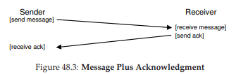

# 48. Hệ thống phân tán (Distributed Systems)

**Hệ thống phân tán** đã thay đổi bộ mặt của thế giới. Khi trình duyệt web của bạn kết nối tới một web server ở đâu đó trên hành tinh, bạn đang tham gia vào một dạng đơn giản của **hệ thống phân tán kiểu client/server**. Tuy nhiên, khi bạn truy cập một dịch vụ web hiện đại như Google hoặc Facebook, bạn không chỉ tương tác với một máy duy nhất; phía sau hậu trường, các dịch vụ phức tạp này được xây dựng từ một tập hợp lớn (tức là hàng nghìn) máy, mỗi máy hợp tác để cung cấp dịch vụ cụ thể của trang. Do đó, có thể thấy rõ lý do tại sao việc nghiên cứu hệ thống phân tán lại thú vị. Thực tế, nó xứng đáng có hẳn một môn học riêng; ở đây, chúng ta chỉ giới thiệu một vài chủ đề chính.

Khi xây dựng một hệ thống phân tán, nhiều thách thức mới xuất hiện. Thách thức lớn nhất mà chúng ta tập trung ở đây là **failure** (lỗi/hỏng hóc); máy tính, ổ đĩa, mạng và phần mềm đều có thể hỏng theo thời gian, vì chúng ta không (và có lẽ sẽ không bao giờ) biết cách xây dựng các thành phần và hệ thống “hoàn hảo”. Tuy nhiên, khi xây dựng một dịch vụ web hiện đại, chúng ta muốn nó xuất hiện với khách hàng như thể nó **không bao giờ hỏng**; vậy làm thế nào để đạt được điều này?

>> **THE CRUX: CÁCH XÂY DỰNG HỆ THỐNG HOẠT ĐỘNG KHI THÀNH PHẦN BỊ LỖI**  
>> Làm thế nào để xây dựng một hệ thống hoạt động từ các thành phần không phải lúc nào cũng hoạt động đúng? Câu hỏi cơ bản này có thể khiến bạn nhớ lại một số chủ đề chúng ta đã thảo luận trong phần mảng lưu trữ RAID; tuy nhiên, các vấn đề ở đây thường phức tạp hơn, và giải pháp cũng vậy.

Điều thú vị là, mặc dù lỗi là thách thức trung tâm trong việc xây dựng hệ thống phân tán, nó cũng là một cơ hội. Đúng là máy móc sẽ hỏng; nhưng việc một máy hỏng không có nghĩa là toàn bộ hệ thống phải ngừng hoạt động. Bằng cách tập hợp nhiều máy lại, chúng ta có thể xây dựng một hệ thống **có vẻ như hiếm khi hỏng**, mặc dù các thành phần của nó hỏng thường xuyên. Đây chính là **vẻ đẹp và giá trị cốt lõi** của hệ thống phân tán, và là lý do tại sao chúng là nền tảng của hầu hết mọi dịch vụ web hiện đại mà bạn sử dụng, bao gồm Google, Facebook, v.v.

>> **TIP: GIAO TIẾP VỐN DĨ LÀ KHÔNG ĐÁNG TIN CẬY**  
>> Trong hầu hết mọi trường hợp, nên coi giao tiếp là một hoạt động vốn dĩ không đáng tin cậy. Lỗi bit (bit corruption), liên kết hoặc máy bị hỏng hoặc không hoạt động, và thiếu bộ đệm cho các gói tin đến đều dẫn đến cùng một kết quả: gói tin đôi khi không đến được đích. Để xây dựng các dịch vụ đáng tin cậy trên nền mạng không đáng tin cậy như vậy, chúng ta phải xem xét các kỹ thuật có thể đối phó với việc mất gói tin.

Ngoài ra còn có những vấn đề quan trọng khác. **Hiệu năng hệ thống** thường rất quan trọng; với một mạng kết nối các thành phần của hệ thống phân tán, các nhà thiết kế hệ thống phải cân nhắc kỹ cách thực hiện nhiệm vụ, cố gắng giảm số lượng thông điệp gửi đi và làm cho giao tiếp hiệu quả nhất có thể (độ trễ thấp, băng thông cao). Cuối cùng, **bảo mật** cũng là một yếu tố cần thiết. Khi kết nối tới một site từ xa, việc đảm bảo rằng bên kia thực sự là người họ tuyên bố trở thành một vấn đề trung tâm. Hơn nữa, đảm bảo rằng bên thứ ba không thể theo dõi hoặc thay đổi một phiên giao tiếp đang diễn ra giữa hai bên cũng là một thách thức.

Trong phần giới thiệu này, chúng ta sẽ đề cập đến khía cạnh cơ bản nhất và mới mẻ trong hệ thống phân tán: **giao tiếp**. Cụ thể, các máy trong một hệ thống phân tán nên giao tiếp với nhau như thế nào? Chúng ta sẽ bắt đầu với các **primitive** (nguyên thủy) cơ bản nhất là **message** (thông điệp), và xây dựng một số primitive cấp cao hơn trên nền tảng đó. Như đã nói ở trên, **failure** sẽ là trọng tâm: các tầng giao tiếp nên xử lý lỗi như thế nào?


## 48.1 Cơ bản về giao tiếp (Communication Basics)

Nguyên tắc trung tâm của mạng máy tính hiện đại là: **giao tiếp vốn dĩ không đáng tin cậy**. Dù là trên mạng diện rộng (**wide-area Internet**) hay mạng cục bộ tốc độ cao (**local-area high-speed network**) như **Infiniband**, các gói tin thường xuyên bị mất, bị hỏng hoặc không đến được đích.

Có nhiều nguyên nhân dẫn đến mất hoặc hỏng gói tin. Đôi khi, trong quá trình truyền, một số bit bị lật do sự cố điện hoặc các vấn đề tương tự. Đôi khi, một thành phần trong hệ thống, chẳng hạn như liên kết mạng, bộ định tuyến gói tin (**packet router**) hoặc thậm chí máy chủ từ xa, bị hỏng hoặc không hoạt động đúng; cáp mạng đôi khi cũng bị đứt.

Tuy nhiên, nguyên nhân cơ bản hơn là mất gói tin do **thiếu bộ đệm** trong **network switch**, **router**, hoặc **endpoint**. Cụ thể, ngay cả khi chúng ta có thể đảm bảo rằng tất cả các liên kết hoạt động đúng và tất cả các thành phần trong hệ thống (switch, router, end host) đều đang chạy như mong đợi, việc mất gói tin vẫn có thể xảy ra vì lý do sau: Hãy tưởng tượng một gói tin đến một router; để gói tin được xử lý, nó phải được đặt vào bộ nhớ nào đó bên trong router. Nếu nhiều gói tin như vậy đến cùng lúc, có thể bộ nhớ trong router không đủ để chứa tất cả. Lúc này, lựa chọn duy nhất của router là **loại bỏ** một hoặc nhiều gói tin. Hành vi tương tự cũng xảy ra ở các **end host**; khi bạn gửi một số lượng lớn thông điệp tới một máy duy nhất, tài nguyên của máy đó có thể nhanh chóng bị quá tải, và do đó việc mất gói tin lại xảy ra.

Vì vậy, **mất gói tin** là một hiện tượng cơ bản trong mạng máy tính. Câu hỏi đặt ra là: **chúng ta nên xử lý nó như thế nào?**

## 48.2 Các tầng giao tiếp không đáng tin cậy (Unreliable Communication Layers)

Một cách đơn giản là: **chúng ta không xử lý nó**. Bởi vì một số ứng dụng biết cách tự xử lý việc mất gói tin (**packet loss**), đôi khi sẽ hữu ích nếu để chúng giao tiếp thông qua một tầng truyền thông cơ bản **không đáng tin cậy**. Đây là một ví dụ của **end-to-end argument** (lập luận đầu-cuối) mà bạn thường nghe nói đến (xem phần *Aside* ở cuối chương).  

Một ví dụ điển hình của tầng không đáng tin cậy như vậy là **UDP/IP networking stack** (ngăn xếp mạng UDP/IP) hiện có trên hầu hết các hệ thống hiện đại. Để sử dụng **UDP**, một **process** (tiến trình) sử dụng **sockets API** để tạo một **communication endpoint** (điểm cuối giao tiếp); các tiến trình trên máy khác (hoặc trên cùng một máy) gửi **UDP datagram** (gói tin UDP – một thông điệp có kích thước cố định tới một giới hạn tối đa) tới tiến trình ban đầu.


**Hình 48.1** và **Hình 48.2** minh họa một client và server đơn giản được xây dựng trên nền UDP/IP. Client có thể gửi một thông điệp tới server, và server sẽ phản hồi lại. Chỉ với một lượng mã nhỏ như vậy, bạn đã có tất cả những gì cần để bắt đầu xây dựng hệ thống phân tán!

...


**Hình 48.1: Ví dụ mã UDP (client.c, server.c)**

...


**Hình 48.2: Một thư viện UDP đơn giản (udp.c)**

UDP là một ví dụ tuyệt vời của tầng giao tiếp không đáng tin cậy. Nếu bạn sử dụng nó, bạn sẽ gặp những tình huống gói tin bị mất (**dropped**) và do đó không đến được đích; phía gửi sẽ **không bao giờ** được thông báo về việc mất gói tin này. Tuy nhiên, điều đó không có nghĩa là UDP không bảo vệ chống lại bất kỳ lỗi nào. Ví dụ, UDP bao gồm một **checksum** để phát hiện một số dạng lỗi hỏng gói tin (**packet corruption**).

>> **TIP: SỬ DỤNG CHECKSUM ĐỂ ĐẢM BẢO TÍNH TOÀN VẸN (INTEGRITY)**  
>> Checksum là một phương pháp thường được sử dụng để phát hiện lỗi hỏng dữ liệu nhanh chóng và hiệu quả trong các hệ thống hiện đại. Một checksum đơn giản là phép cộng: chỉ cần cộng tất cả các byte của một khối dữ liệu; tất nhiên, nhiều loại checksum tinh vi hơn đã được tạo ra, bao gồm **cyclic redundancy codes (CRC)** cơ bản, **Fletcher checksum**, và nhiều loại khác [MK09].  
>> Trong mạng máy tính, checksum được sử dụng như sau: Trước khi gửi một thông điệp từ máy này sang máy khác, tính toán checksum trên các byte của thông điệp. Sau đó gửi cả thông điệp và checksum tới đích. Ở phía nhận, máy nhận cũng tính toán checksum trên thông điệp nhận được; nếu checksum tính được khớp với checksum đã gửi, máy nhận có thể yên tâm rằng dữ liệu **nhiều khả năng** không bị hỏng trong quá trình truyền.  
>> Checksum có thể được đánh giá theo nhiều tiêu chí khác nhau. **Hiệu quả** là một yếu tố chính: liệu thay đổi trong dữ liệu có dẫn đến thay đổi trong checksum không? Checksum càng mạnh thì càng khó để thay đổi dữ liệu mà không bị phát hiện. **Hiệu năng** là tiêu chí quan trọng khác: tính toán checksum tốn bao nhiêu chi phí? Đáng tiếc, hiệu quả và hiệu năng thường mâu thuẫn nhau, nghĩa là checksum chất lượng cao thường tốn nhiều chi phí tính toán. Cuộc sống, một lần nữa, không hoàn hảo.

Tuy nhiên, vì nhiều ứng dụng chỉ đơn giản muốn gửi dữ liệu tới đích mà không phải lo lắng về việc mất gói tin, chúng ta cần nhiều hơn thế. Cụ thể, chúng ta cần **giao tiếp đáng tin cậy** trên nền một mạng không đáng tin cậy.


## 48.3 Các tầng giao tiếp đáng tin cậy (Reliable Communication Layers)

Để xây dựng một tầng giao tiếp đáng tin cậy, chúng ta cần một số cơ chế và kỹ thuật mới để xử lý việc mất gói tin. Hãy xem xét một ví dụ đơn giản trong đó một client đang gửi một thông điệp tới server qua một kết nối không đáng tin cậy. Câu hỏi đầu tiên cần trả lời: **làm thế nào để phía gửi biết rằng phía nhận thực sự đã nhận được thông điệp?**

Kỹ thuật mà chúng ta sẽ sử dụng được gọi là **acknowledgment** (xác nhận), hay viết tắt là **ack**. Ý tưởng rất đơn giản: phía gửi gửi một thông điệp tới phía nhận; phía nhận sau đó gửi lại một thông điệp ngắn để xác nhận đã nhận được. **Hình 48.3** minh họa quá trình này.



**Hình 48.3: Thông điệp và xác nhận (Message Plus Acknowledgment)**

Khi phía gửi nhận được **acknowledgment** cho thông điệp, nó có thể yên tâm rằng phía nhận thực sự đã nhận được thông điệp gốc. Tuy nhiên, điều gì sẽ xảy ra nếu phía gửi **không** nhận được acknowledgment?

Để xử lý trường hợp này, chúng ta cần một cơ chế bổ sung, gọi là **timeout** (hết thời gian chờ). Khi phía gửi gửi một thông điệp, nó sẽ đặt một bộ đếm thời gian để kích hoạt sau một khoảng thời gian nhất định. Nếu trong khoảng thời gian đó không nhận được acknowledgment, phía gửi kết luận rằng thông điệp đã bị mất. Khi đó, phía gửi sẽ **retry** (thử gửi lại), gửi cùng một thông điệp một lần nữa với hy vọng lần này nó sẽ đến nơi.  

Để cách tiếp cận này hoạt động, phía gửi phải giữ lại một bản sao của thông điệp, phòng khi cần gửi lại. Sự kết hợp giữa **timeout** và **retry** khiến một số người gọi phương pháp này là **timeout/retry**; khá thông minh, phải không? **Hình 48.4** minh họa một ví dụ.


**Hình 48.4: Thông điệp và xác nhận – Yêu cầu bị rơi (Message Plus Acknowledgment: Dropped Request)**


Thật không may, cơ chế **timeout/retry** (hết thời gian chờ/thử lại) ở dạng này vẫn chưa đủ. **Hình 48.5** minh họa một ví dụ về mất gói tin (**packet loss**) có thể gây ra rắc rối. Trong ví dụ này, không phải thông điệp gốc bị mất, mà là **acknowledgment** (gói tin xác nhận).  

Từ góc nhìn của phía gửi, tình huống có vẻ giống nhau: không nhận được ack, và do đó cần thực hiện timeout và retry. Nhưng từ góc nhìn của phía nhận, lại hoàn toàn khác: cùng một thông điệp đã được nhận **hai lần**! Mặc dù có thể có những trường hợp điều này không gây hại, nhưng nhìn chung thì không ổn; hãy tưởng tượng điều gì sẽ xảy ra khi bạn đang tải xuống một tệp và các gói tin thừa bị lặp lại trong quá trình tải. Do đó, khi chúng ta hướng tới một tầng thông điệp đáng tin cậy (**reliable message layer**), chúng ta thường muốn đảm bảo rằng **mỗi thông điệp chỉ được nhận đúng một lần** bởi phía nhận.


**Hình 48.5: Thông điệp và xác nhận – Phản hồi bị rơi (Message Plus Acknowledgment: Dropped Reply)**

Để cho phép phía nhận phát hiện việc truyền trùng lặp thông điệp, phía gửi phải gán cho mỗi thông điệp một **định danh duy nhất** (unique ID), và phía nhận cần có cách để theo dõi xem nó đã thấy thông điệp đó trước đây hay chưa. Khi phía nhận phát hiện một thông điệp trùng lặp, nó chỉ cần gửi ack cho thông điệp đó, nhưng (quan trọng) **không** chuyển thông điệp này lên ứng dụng nhận dữ liệu. Như vậy, phía gửi nhận được ack nhưng thông điệp không bị nhận hai lần, đảm bảo **ngữ nghĩa exactly-once** (chỉ-một-lần) như đã đề cập.

Có nhiều cách để phát hiện thông điệp trùng lặp. Ví dụ, phía gửi có thể tạo một ID duy nhất cho mỗi thông điệp; phía nhận có thể lưu lại mọi ID mà nó từng thấy. Cách này có thể hoạt động, nhưng chi phí quá cao, đòi hỏi bộ nhớ không giới hạn để lưu tất cả ID.

Một cách đơn giản hơn, yêu cầu ít bộ nhớ, giải quyết được vấn đề này là sử dụng **sequence counter** (bộ đếm tuần tự). Với sequence counter, phía gửi và phía nhận thống nhất một giá trị bắt đầu (ví dụ: 1) cho một bộ đếm mà mỗi bên sẽ duy trì. Mỗi khi gửi một thông điệp, giá trị hiện tại của bộ đếm sẽ được gửi kèm theo thông điệp; giá trị này (N) đóng vai trò như ID của thông điệp. Sau khi gửi thông điệp, phía gửi tăng giá trị bộ đếm lên (N + 1).

>> **TIP: CẨN THẬN KHI ĐẶT GIÁ TRỊ TIMEOUT**  
>> Như bạn có thể đoán từ phần thảo luận, việc đặt giá trị timeout đúng là một yếu tố quan trọng khi sử dụng timeout để thử gửi lại thông điệp. Nếu timeout quá nhỏ, phía gửi sẽ gửi lại thông điệp một cách không cần thiết, lãng phí thời gian CPU và tài nguyên mạng. Nếu timeout quá lớn, phía gửi sẽ chờ quá lâu mới gửi lại, làm giảm hiệu năng cảm nhận được ở phía gửi. Giá trị “đúng” từ góc nhìn của một client và server đơn lẻ là chờ vừa đủ để phát hiện mất gói tin nhưng không lâu hơn.  
>> Tuy nhiên, trong hệ thống phân tán thường có nhiều hơn một client và server, như chúng ta sẽ thấy ở các chương sau. Trong kịch bản nhiều client gửi tới một server, mất gói tin ở server có thể là dấu hiệu server đang quá tải. Nếu đúng vậy, client có thể thử lại theo cách thích ứng khác; ví dụ, sau lần timeout đầu tiên, client có thể tăng giá trị timeout lên cao hơn, có thể gấp đôi giá trị ban đầu. Cơ chế **exponential back-off** (lùi thời gian theo cấp số nhân), được tiên phong trong mạng Aloha và áp dụng trong Ethernet thời kỳ đầu [A70], giúp tránh tình huống tài nguyên bị quá tải do quá nhiều lần gửi lại. Các hệ thống mạnh mẽ luôn cố gắng tránh loại quá tải này.

Phía nhận sử dụng giá trị bộ đếm của mình như giá trị mong đợi cho ID của thông điệp đến từ phía gửi đó. Nếu ID của thông điệp nhận được (N) khớp với bộ đếm của phía nhận (cũng là N), nó gửi ack và chuyển thông điệp lên ứng dụng; trong trường hợp này, phía nhận kết luận đây là lần đầu tiên thông điệp này được nhận. Sau đó, phía nhận tăng bộ đếm của mình lên (N + 1) và chờ thông điệp tiếp theo.

Nếu ack bị mất, phía gửi sẽ timeout và gửi lại thông điệp N. Lần này, bộ đếm của phía nhận đã cao hơn (N + 1), do đó phía nhận biết rằng nó đã nhận thông điệp này trước đó. Vì vậy, nó gửi ack nhưng không chuyển thông điệp lên ứng dụng. Theo cách đơn giản này, **sequence counter** có thể được sử dụng để tránh trùng lặp.

Tầng giao tiếp đáng tin cậy được sử dụng phổ biến nhất được gọi là **TCP/IP**, hay ngắn gọn là **TCP**. TCP có mức độ tinh vi cao hơn nhiều so với mô tả ở trên, bao gồm cơ chế xử lý **congestion** (tắc nghẽn) trong mạng [VJ88], hỗ trợ nhiều yêu cầu đồng thời (**multiple outstanding requests**), và hàng trăm tinh chỉnh và tối ưu hóa nhỏ khác. Hãy tìm hiểu thêm nếu bạn quan tâm; tốt hơn nữa, hãy tham gia một khóa học về mạng máy tính và học kỹ phần này.

## 48.4 Các trừu tượng giao tiếp (Communication Abstractions)

Với một **messaging layer** (tầng nhắn tin) cơ bản, chúng ta tiếp cận câu hỏi tiếp theo trong chương này: **khi xây dựng một hệ thống phân tán, chúng ta nên sử dụng trừu tượng giao tiếp nào?**

Cộng đồng nghiên cứu hệ thống đã phát triển nhiều cách tiếp cận trong nhiều năm qua. Một nhánh công trình đã lấy các **OS abstractions** (trừu tượng của hệ điều hành) và mở rộng chúng để hoạt động trong môi trường phân tán. Ví dụ, các hệ thống **distributed shared memory (DSM)** – bộ nhớ chia sẻ phân tán – cho phép các **process** (tiến trình) trên các máy khác nhau chia sẻ một không gian địa chỉ ảo (**virtual address space**) lớn [LH89]. Trừu tượng này biến một phép tính phân tán thành thứ trông giống như một ứng dụng đa luồng (**multi-threaded application**); điểm khác biệt duy nhất là các luồng này chạy trên các máy khác nhau thay vì trên các bộ xử lý khác nhau trong cùng một máy.

Cách hầu hết các hệ thống DSM hoạt động là thông qua hệ thống **virtual memory** (bộ nhớ ảo) của hệ điều hành. Khi một **page** (trang) được truy cập trên một máy, có thể xảy ra hai tình huống:  
- Trường hợp thứ nhất (tốt nhất), page đã có sẵn trên máy, và dữ liệu được lấy nhanh chóng.  
- Trường hợp thứ hai, page hiện đang nằm trên một máy khác. Khi đó xảy ra **page fault** (lỗi trang), và **page fault handler** (trình xử lý lỗi trang) sẽ gửi một thông điệp tới máy khác để lấy page, cài đặt nó vào **page table** (bảng trang) của tiến trình yêu cầu, rồi tiếp tục thực thi.

Cách tiếp cận này ngày nay không được sử dụng rộng rãi vì nhiều lý do. Vấn đề lớn nhất của DSM là cách nó xử lý **failure** (lỗi/hỏng hóc). Hãy tưởng tượng, nếu một máy bị hỏng; điều gì sẽ xảy ra với các page trên máy đó? Nếu các cấu trúc dữ liệu của phép tính phân tán được phân tán khắp toàn bộ không gian địa chỉ thì sao? Trong trường hợp này, một phần của các cấu trúc dữ liệu đó sẽ đột ngột trở nên không thể truy cập. Xử lý lỗi khi một phần không gian địa chỉ của bạn biến mất là rất khó; hãy tưởng tượng một **linked list** (danh sách liên kết) mà con trỏ “next” trỏ vào một phần của không gian địa chỉ đã mất. Thật khủng khiếp!

Một vấn đề khác là hiệu năng. Khi viết mã, người ta thường giả định rằng truy cập bộ nhớ là rẻ. Trong các hệ thống DSM, một số truy cập là rẻ, nhưng một số khác gây ra page fault và yêu cầu lấy dữ liệu tốn kém từ máy từ xa. Do đó, lập trình viên của các hệ thống DSM phải rất cẩn thận tổ chức tính toán sao cho hầu như không có giao tiếp nào xảy ra, điều này làm mất đi nhiều ý nghĩa của cách tiếp cận này. Mặc dù đã có nhiều nghiên cứu trong lĩnh vực này, tác động thực tiễn là rất ít; ngày nay không ai xây dựng hệ thống phân tán đáng tin cậy bằng DSM nữa.


## 48.5 Remote Procedure Call (RPC)

Trong khi các **OS abstractions** tỏ ra là lựa chọn kém hiệu quả để xây dựng hệ thống phân tán, các **programming language (PL) abstractions** (trừu tượng của ngôn ngữ lập trình) lại hợp lý hơn nhiều. Trừu tượng chiếm ưu thế nhất dựa trên ý tưởng **remote procedure call** (gọi thủ tục từ xa), hay viết tắt là **RPC** [BN84][^1].

Các gói RPC đều có một mục tiêu đơn giản: làm cho quá trình thực thi mã trên một máy từ xa trở nên đơn giản và trực quan như việc gọi một hàm cục bộ. Do đó, từ góc nhìn của **client**, một call thủ tục được thực hiện, và một thời gian sau, kết quả được trả về. **Server** chỉ cần định nghĩa một số **routine** (thủ tục) mà nó muốn xuất ra. Phần “ma thuật” còn lại được xử lý bởi hệ thống RPC, vốn thường có hai thành phần chính:  
- **Stub generator** (trình tạo stub, đôi khi gọi là **protocol compiler** – trình biên dịch giao thức)  
- **Run-time library** (thư viện thời gian chạy)  

Chúng ta sẽ xem xét chi tiết từng thành phần này ngay sau đây.


[^1]: BN84 – Tài liệu tham khảo gốc về RPC.

### Trình tạo Stub (Stub Generator)

Nhiệm vụ của **stub generator** khá đơn giản: loại bỏ phần khó khăn trong việc đóng gói (packing) các tham số và kết quả của hàm vào thông điệp bằng cách tự động hóa quá trình này. Cách tiếp cận này mang lại nhiều lợi ích: giúp tránh được những lỗi đơn giản thường gặp khi viết mã thủ công; hơn nữa, một **stub compiler** (trình biên dịch stub) có thể tối ưu mã này và cải thiện hiệu năng.

**Đầu vào** của trình biên dịch này đơn giản là tập hợp các call hàm mà **server** muốn xuất ra cho **client**. Về mặt khái niệm, nó có thể đơn giản như sau:

```c
interface {
    int func1(int arg1);
    int func2(int arg1, int arg2);
};
```

**Stub generator** sẽ lấy một interface như trên và sinh ra một số thành phần mã khác nhau.  
- **Phía client**: sinh ra **client stub**, chứa mỗi hàm được định nghĩa trong interface; một chương trình client muốn sử dụng dịch vụ RPC này sẽ liên kết (link) với client stub và gọi vào đó để thực hiện các RPC.

Bên trong, mỗi hàm trong client stub sẽ thực hiện toàn bộ công việc cần thiết để thực hiện **remote procedure call**.  
Từ góc nhìn của client, mã chỉ đơn giản là một call hàm (ví dụ: client gọi `func1(x)`); nhưng bên trong, mã trong client stub cho `func1()` sẽ thực hiện:

* **Tạo bộ đệm thông điệp (message buffer).** Thông thường, đây chỉ là một mảng byte liên tiếp có kích thước nhất định.
* **Đóng gói thông tin cần thiết vào message buffer.** Thông tin này bao gồm một định danh (identifier) cho hàm cần gọi, cũng như tất cả các tham số mà hàm cần (ví dụ: trong trường hợp trên, một số nguyên cho `func1`). Quá trình đưa toàn bộ thông tin này vào một bộ đệm liên tiếp được gọi là **marshaling** (đóng gói tham số) hoặc **serialization** (tuần tự hóa thông điệp).
* **Gửi thông điệp tới RPC server đích.** Việc giao tiếp với RPC server và tất cả các chi tiết cần thiết để hoạt động đúng được xử lý bởi **RPC run-time library** (thư viện thời gian chạy RPC), sẽ được mô tả chi tiết hơn bên dưới.
* **Chờ phản hồi.** Vì call hàm thường là đồng bộ (**synchronous**), call sẽ chờ cho đến khi hoàn tất.
* **Giải nén mã trả về và các tham số khác.** Nếu hàm chỉ trả về một mã kết quả duy nhất, quá trình này khá đơn giản; tuy nhiên, các hàm phức tạp hơn có thể trả về kết quả phức tạp (ví dụ: một danh sách), và do đó stub có thể cần giải nén chúng. Bước này còn được gọi là **unmarshaling** hoặc **deserialization**.
* **Trả kết quả về cho hàm gọi.** Cuối cùng, trả kết quả từ client stub về mã client.


**Phía server** cũng được sinh mã. Các bước thực hiện trên server như sau:

* **Giải nén thông điệp.** Bước này, gọi là **unmarshaling** hoặc **deserialization**, lấy thông tin ra khỏi thông điệp đến. Định danh hàm và các tham số được trích xuất.
* **Gọi vào hàm thực tế.** Cuối cùng! Đây là lúc hàm từ xa thực sự được thực thi. **RPC runtime** gọi vào hàm được chỉ định bởi ID và truyền vào các tham số cần thiết.
* **Đóng gói kết quả.** Các giá trị trả về được **marshal** trở lại thành một bộ đệm phản hồi duy nhất.
* **Gửi phản hồi.** Phản hồi được gửi lại cho phía gọi.


Có một số vấn đề quan trọng khác cần xem xét trong **stub compiler**:

- **Tham số phức tạp**: Làm thế nào để đóng gói và gửi một cấu trúc dữ liệu phức tạp?  
  Ví dụ, khi gọi **system call** `write()`, ta truyền vào ba tham số: một số nguyên **file descriptor**, một con trỏ tới **buffer**, và một kích thước cho biết bao nhiêu byte (bắt đầu từ con trỏ) sẽ được ghi. Nếu một gói RPC nhận một con trỏ, nó cần biết cách diễn giải con trỏ đó và thực hiện hành động đúng. Thông thường, điều này được thực hiện thông qua:
  - Các kiểu dữ liệu đã biết (ví dụ: `buffer_t` dùng để truyền các khối dữ liệu với kích thước xác định, mà RPC compiler hiểu được), hoặc
  - Gắn chú thích (annotation) vào cấu trúc dữ liệu với thông tin bổ sung, cho phép compiler biết byte nào cần được **serialize**.

- **Tổ chức server liên quan đến concurrency (tính đồng thời)**:  
  Một server đơn giản chỉ chờ yêu cầu trong một vòng lặp và xử lý từng yêu cầu một. Tuy nhiên, như bạn có thể đoán, điều này rất kém hiệu quả; nếu một call RPC bị chặn (ví dụ: do I/O), tài nguyên server sẽ bị lãng phí.  
  Do đó, hầu hết server được xây dựng theo một dạng **concurrent** nào đó. Một mô hình phổ biến là **thread pool** (bể luồng). Trong mô hình này:
  - Một tập hữu hạn các **thread** được tạo khi server khởi động.
  - Khi một thông điệp đến, nó được phân phối tới một trong các **worker thread**, luồng này sẽ thực hiện công việc của call RPC và cuối cùng phản hồi.
  - Trong thời gian đó, **main thread** tiếp tục nhận các yêu cầu khác và có thể phân phối chúng cho các worker khác.

Cách tổ chức này cho phép thực thi đồng thời trong server, tăng mức sử dụng tài nguyên; tuy nhiên, chi phí tiêu chuẩn cũng xuất hiện, chủ yếu là độ phức tạp lập trình, vì các call RPC giờ đây có thể cần sử dụng **lock** và các **synchronization primitives** (cơ chế đồng bộ hóa) khác để đảm bảo hoạt động đúng.


### Thư viện thời gian chạy (Run-Time Library)

**Run-time library** đảm nhiệm phần lớn công việc nặng trong một hệ thống **RPC** (Remote Procedure Call – gọi thủ tục từ xa); hầu hết các vấn đề về hiệu năng và độ tin cậy đều được xử lý tại đây. Chúng ta sẽ cùng thảo luận một số thách thức chính khi xây dựng một tầng run-time như vậy.

Một trong những thách thức đầu tiên cần vượt qua là **làm thế nào để định vị một dịch vụ từ xa**. Vấn đề này, gọi là **naming** (đặt tên/định danh), là một vấn đề phổ biến trong các hệ thống phân tán, và ở một mức độ nào đó vượt ra ngoài phạm vi thảo luận hiện tại. Cách tiếp cận đơn giản nhất là xây dựng dựa trên các hệ thống đặt tên hiện có, ví dụ: **hostname** và **port number** do các giao thức Internet hiện tại cung cấp. Trong hệ thống như vậy, **client** phải biết hostname hoặc địa chỉ IP của máy đang chạy dịch vụ RPC mong muốn, cũng như số cổng mà nó đang sử dụng (port number chỉ đơn giản là một cách để định danh một hoạt động giao tiếp cụ thể đang diễn ra trên một máy, cho phép nhiều kênh giao tiếp đồng thời). Bộ giao thức (protocol suite) sau đó phải cung cấp cơ chế định tuyến các gói tin tới một địa chỉ cụ thể từ bất kỳ máy nào khác trong hệ thống. Để tìm hiểu sâu hơn về vấn đề naming, bạn có thể tham khảo các tài liệu về **DNS** và **name resolution** trên Internet, hoặc tốt hơn là đọc chương viết rất hay trong sách của Saltzer và Kaashoek [SK09].

Khi client đã biết server nào cần liên hệ cho một dịch vụ từ xa cụ thể, câu hỏi tiếp theo là **RPC nên được xây dựng trên giao thức tầng vận chuyển (transport-level protocol) nào**. Cụ thể, hệ thống RPC nên sử dụng một giao thức đáng tin cậy như **TCP/IP**, hay nên xây dựng trên một tầng giao tiếp không đáng tin cậy như **UDP/IP**?

Nếu suy nghĩ đơn giản, lựa chọn này có vẻ dễ dàng: rõ ràng chúng ta muốn yêu cầu được gửi **đáng tin cậy** tới server từ xa, và cũng muốn nhận phản hồi một cách đáng tin cậy. Vậy thì nên chọn giao thức vận chuyển đáng tin cậy như TCP, đúng không?

Đáng tiếc, xây dựng RPC trên một tầng giao tiếp đáng tin cậy có thể dẫn đến **sự kém hiệu quả nghiêm trọng về hiệu năng**. Hãy nhớ lại phần thảo luận ở trên về cách các tầng giao tiếp đáng tin cậy hoạt động: với **acknowledgment** (xác nhận) kết hợp với **timeout/retry** (hết thời gian chờ/thử lại). Do đó, khi client gửi một yêu cầu RPC tới server, server sẽ phản hồi bằng một ack để caller biết rằng yêu cầu đã được nhận. Tương tự, khi server gửi phản hồi tới client, client cũng gửi ack để server biết rằng phản hồi đã được nhận. Khi xây dựng một giao thức request/response (yêu cầu/đáp ứng) như RPC trên một tầng giao tiếp đáng tin cậy, sẽ có **hai thông điệp “thừa”** được gửi.

Vì lý do này, nhiều gói RPC được xây dựng trên các tầng giao tiếp không đáng tin cậy như UDP. Cách này cho phép một tầng RPC hiệu quả hơn, nhưng đồng thời bổ sung trách nhiệm đảm bảo độ tin cậy cho chính hệ thống RPC. Tầng RPC đạt được mức độ tin cậy mong muốn bằng cách sử dụng timeout/retry và acknowledgment tương tự như đã mô tả ở trên. Bằng cách sử dụng một dạng **sequence numbering** (đánh số thứ tự), tầng giao tiếp có thể đảm bảo rằng mỗi RPC diễn ra **chính xác một lần** (trong trường hợp không có lỗi), hoặc **nhiều nhất một lần** (trong trường hợp xảy ra lỗi).


### Các vấn đề khác (Other Issues)

Có một số vấn đề khác mà **RPC run-time** cũng phải xử lý. Ví dụ: điều gì xảy ra khi một call từ xa mất nhiều thời gian để hoàn tất? Với cơ chế timeout, một call từ xa chạy lâu có thể bị client coi là lỗi, dẫn đến việc retry, và do đó cần xử lý cẩn thận. Một giải pháp là sử dụng **explicit acknowledgment** (xác nhận rõ ràng từ phía nhận gửi tới phía gửi) khi phản hồi chưa được tạo ngay; điều này cho client biết rằng server đã nhận yêu cầu. Sau đó, sau một khoảng thời gian, client có thể định kỳ hỏi xem server vẫn đang xử lý yêu cầu hay không; nếu server liên tục trả lời “có”, client nên tiếp tục chờ (suy cho cùng, đôi khi một call thủ tục có thể mất nhiều thời gian để hoàn tất).

Run-time cũng phải xử lý các call thủ tục có tham số lớn, vượt quá kích thước có thể chứa trong một gói tin duy nhất. Một số giao thức mạng tầng thấp cung cấp chức năng **fragmentation** (phân mảnh phía gửi – chia gói lớn thành nhiều gói nhỏ) và **reassembly** (tái hợp phía nhận – ghép các phần nhỏ thành một khối logic lớn hơn); nếu không, RPC run-time có thể phải tự triển khai chức năng này. Xem chi tiết trong bài báo của Birrell và Nelson [BN84].


>> **ASIDE: LẬP LUẬN END-TO-END (THE END-TO-END ARGUMENT)**  
>> Lập luận **end-to-end** cho rằng tầng cao nhất trong một hệ thống, thường là ứng dụng ở “đầu cuối”, mới là nơi duy nhất trong một hệ thống phân tầng có thể thực sự triển khai một số chức năng nhất định. Trong bài báo nổi tiếng [SRC84], Saltzer và cộng sự đã minh họa điều này qua một ví dụ xuất sắc: **truyền tệp tin đáng tin cậy** giữa hai máy. Nếu bạn muốn truyền một tệp từ máy A sang máy B, và đảm bảo rằng các byte trên B **chính xác** giống với các byte ban đầu trên A, bạn phải có một cơ chế kiểm tra “end-to-end” cho việc này; các cơ chế đáng tin cậy ở tầng thấp hơn, ví dụ trong mạng hoặc đĩa, không cung cấp được đảm bảo này.  
>>  
>> Ngược lại là cách tiếp cận cố gắng giải quyết vấn đề truyền tệp tin đáng tin cậy bằng cách thêm độ tin cậy vào các tầng thấp hơn của hệ thống. Ví dụ, giả sử chúng ta xây dựng một giao thức truyền thông đáng tin cậy và sử dụng nó để xây dựng truyền tệp tin đáng tin cậy. Giao thức truyền thông này đảm bảo rằng mọi byte được gửi bởi phía gửi sẽ được nhận theo đúng thứ tự bởi phía nhận, sử dụng timeout/retry, acknowledgment và sequence number. Đáng tiếc, sử dụng một giao thức như vậy **không** đồng nghĩa với việc truyền tệp tin là đáng tin cậy; hãy tưởng tượng dữ liệu bị hỏng trong bộ nhớ của phía gửi trước khi truyền, hoặc xảy ra sự cố khi phía nhận ghi dữ liệu xuống đĩa. Trong những trường hợp đó, mặc dù dữ liệu đã được truyền đáng tin cậy qua mạng, việc truyền tệp tin của chúng ta cuối cùng vẫn **không** đáng tin cậy. Để xây dựng một truyền tệp tin đáng tin cậy, phải bao gồm các kiểm tra độ tin cậy end-to-end, ví dụ: sau khi truyền xong, đọc lại tệp trên đĩa của phía nhận, tính toán checksum và so sánh với checksum của tệp trên phía gửi.  
>>  
>> Hệ quả của nguyên tắc này là đôi khi việc để các tầng thấp hơn cung cấp thêm chức năng có thể cải thiện hiệu năng hệ thống hoặc tối ưu hóa hệ thống. Do đó, bạn không nên loại trừ hoàn toàn việc có các cơ chế như vậy ở tầng thấp hơn; thay vào đó, hãy cân nhắc kỹ lưỡng tính hữu ích của chúng, xét đến cách chúng sẽ được sử dụng trong toàn bộ hệ thống hoặc ứng dụng.

Một vấn đề mà nhiều hệ thống phải xử lý là **byte ordering** (thứ tự byte). Như bạn có thể biết, một số máy lưu trữ giá trị theo thứ tự gọi là **big endian**, trong khi những máy khác sử dụng **little endian**.  
- **Big endian** lưu các byte (ví dụ, của một số nguyên) từ bit có trọng số cao nhất đến bit có trọng số thấp nhất, tương tự như cách viết số Ả Rập.  
- **Little endian** thì ngược lại.  

Cả hai đều là những cách hợp lệ để lưu trữ thông tin số; câu hỏi đặt ra ở đây là **làm thế nào để giao tiếp giữa các máy có endianness khác nhau**.

Các gói RPC thường xử lý vấn đề này bằng cách cung cấp một **endianness** được xác định rõ ràng trong định dạng thông điệp của chúng. Trong gói RPC của Sun, lớp **XDR (eXternal Data Representation)** cung cấp chức năng này.  
- Nếu máy gửi hoặc nhận thông điệp có cùng endianness với XDR, thông điệp sẽ được gửi và nhận như bình thường.  
- Nếu máy giao tiếp có endianness khác, mỗi phần thông tin trong thông điệp phải được chuyển đổi.  

Do đó, sự khác biệt về endianness có thể gây ra một chi phí hiệu năng nhỏ.


Một vấn đề cuối cùng là liệu có nên **phơi bày bản chất bất đồng bộ (asynchronous)** của giao tiếp cho client hay không, từ đó cho phép một số tối ưu hóa hiệu năng.  
Cụ thể, RPC thông thường được thực hiện **đồng bộ** (synchronous), tức là khi client thực hiện call thủ tục, nó phải chờ cho đến khi call trả về trước khi tiếp tục. Vì thời gian chờ này có thể dài, và vì client có thể có những công việc khác cần làm, một số gói RPC cho phép gọi RPC **bất đồng bộ** (asynchronous).  

Khi một RPC bất đồng bộ được thực hiện, gói RPC sẽ gửi yêu cầu và trả về ngay lập tức; client sau đó có thể tự do làm việc khác, chẳng hạn gọi các RPC khác hoặc thực hiện các tính toán hữu ích khác.  
Tại một thời điểm nào đó, client sẽ muốn xem kết quả của RPC bất đồng bộ; khi đó nó sẽ gọi lại vào tầng RPC, yêu cầu chờ cho đến khi các RPC đang chờ hoàn tất, và lúc này các tham số trả về mới có thể được truy cập.


## 48.6 Tóm tắt (Summary)

Chúng ta đã được giới thiệu một chủ đề mới: **hệ thống phân tán** (distributed systems), và vấn đề lớn nhất của nó: **xử lý lỗi** (failure) – điều giờ đây đã trở thành chuyện thường ngày. Như người ta vẫn nói ở Google: khi bạn chỉ có một máy tính để bàn, lỗi là hiếm; nhưng khi bạn ở trong một **data center** với hàng nghìn máy, lỗi xảy ra **liên tục**.  
**Chìa khóa** của bất kỳ hệ thống phân tán nào là cách bạn xử lý những lỗi đó.

Chúng ta cũng đã thấy rằng **giao tiếp** là trái tim của mọi hệ thống phân tán. Một trừu tượng phổ biến của giao tiếp này là **remote procedure call (RPC)**, cho phép client thực hiện các call từ xa tới server; gói RPC xử lý tất cả các chi tiết phức tạp, bao gồm **timeout/retry** và **acknowledgment**, để cung cấp một dịch vụ gần giống nhất với call thủ tục cục bộ.

Cách tốt nhất để thực sự hiểu một gói RPC tất nhiên là **tự mình sử dụng nó**. Hệ thống RPC của Sun, sử dụng trình biên dịch stub `rpcgen`, là một ví dụ cũ; **gRPC** của Google và **Apache Thrift** là những phiên bản hiện đại hơn của cùng ý tưởng. Hãy thử một trong số chúng và tự trải nghiệm để hiểu tại sao chúng lại được quan tâm đến vậy.